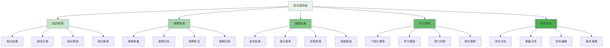
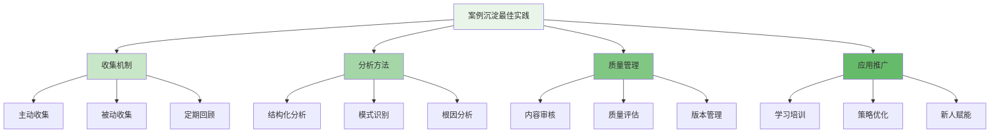

在企业级智能风控平台的运营中，知识库与案例沉淀是团队能力传承和持续改进的重要基础设施。通过系统化地积累和管理风控对抗经验，企业能够将个体智慧转化为组织资产，提升团队整体作战能力，并为新人培养提供丰富的学习资源。

## 知识库系统架构设计

知识库系统需要支持从知识创建到应用的全生命周期管理，确保知识资产的有效沉淀和高效利用。

### 系统架构层次



### 核心功能模块

```yaml
# 知识库系统核心功能模块
knowledge_base_modules:
  knowledge_management:
    description: "知识全生命周期管理"
    features:
      - "知识创建与编辑"
      - "知识分类与标签"
      - "知识审核与发布"
      - "知识版本管理"
    integration_points:
      - "文档管理系统"
      - "权限控制系统"
      - "版本控制系统"
  
  case_management:
    description: "案例收集与分析"
    features:
      - "案例收集机制"
      - "案例分析工具"
      - "案例标注系统"
      - "案例归档管理"
    integration_points:
      - "案件管理系统"
      - "数据分析平台"
      - "标签管理系统"
  
  search_retrieval:
    description: "智能搜索与检索"
    features:
      - "全文搜索引擎"
      - "语义理解搜索"
      - "多维度筛选"
      - "搜索结果排序"
    integration_points:
      - "搜索引擎"
      - "自然语言处理"
      - "推荐系统"
  
  learning_recommendation:
    description: "个性化学习推荐"
    features:
      - "用户画像构建"
      - "内容推荐算法"
      - "学习路径规划"
      - "热门内容推荐"
    integration_points:
      - "用户行为分析"
      - "机器学习平台"
      - "推荐引擎"
```

## 知识管理体系

知识管理体系是确保知识资产质量和价值的关键，需要建立标准化的管理流程。

### 知识分类体系

```python
class KnowledgeManagementSystem:
    def __init__(self):
        self.knowledge_repository = KnowledgeRepository()
        self.category_manager = CategoryManager()
        self.review_engine = ReviewEngine()
        self.version_controller = VersionController()
    
    def create_knowledge_item(self, knowledge_data):
        """创建知识条目"""
        # 1. 验证知识数据
        self.validate_knowledge_data(knowledge_data)
        
        # 2. 生成知识ID
        knowledge_id = self.generate_knowledge_id()
        
        # 3. 创建知识对象
        knowledge_item = KnowledgeItem(
            id=knowledge_id,
            title=knowledge_data.title,
            content=knowledge_data.content,
            category=knowledge_data.category,
            tags=knowledge_data.tags,
            author=knowledge_data.author,
            status="draft",
            created_at=datetime.now(),
            version="1.0"
        )
        
        # 4. 保存知识条目
        self.knowledge_repository.save(knowledge_item)
        
        # 5. 触发审核流程
        self.review_engine.submit_for_review(knowledge_item)
        
        return knowledge_item
    
    def validate_knowledge_data(self, data):
        """验证知识数据"""
        # 1. 必需字段检查
        required_fields = ['title', 'content', 'category', 'author']
        for field in required_fields:
            if not hasattr(data, field) or not getattr(data, field):
                raise ValueError(f"Missing required field: {field}")
        
        # 2. 分类有效性检查
        if not self.category_manager.is_valid_category(data.category):
            raise ValueError(f"Invalid category: {data.category}")
        
        # 3. 内容质量检查
        if len(data.content) < 100:
            raise ValueError("Content is too short, minimum 100 characters required")
        
        # 4. 标签规范检查
        if data.tags and len(data.tags) > 10:
            raise ValueError("Too many tags, maximum 10 tags allowed")
    
    def organize_knowledge_categories(self):
        """组织知识分类体系"""
        categories = {
            "risk_patterns": {
                "name": "风险模式识别",
                "subcategories": [
                    "欺诈模式",
                    "作弊模式",
                    "洗钱模式",
                    "异常行为模式"
                ],
                "description": "各类风险行为的识别模式和特征"
            },
            "strategy_tactics": {
                "name": "策略与战术",
                "subcategories": [
                    "规则策略",
                    "模型策略",
                    "名单策略",
                    "复合策略"
                ],
                "description": "风控策略的设计思路和实施方法"
            },
            "technical_solutions": {
                "name": "技术解决方案",
                "subcategories": [
                    "数据处理",
                    "特征工程",
                    "模型算法",
                    "系统架构"
                ],
                "description": "技术实现方案和最佳实践"
            },
            "industry_insights": {
                "name": "行业洞察",
                "subcategories": [
                    "金融风控",
                    "电商风控",
                    "社交风控",
                    "游戏风控"
                ],
                "description": "各行业风控特点和挑战"
            },
            "tools_resources": {
                "name": "工具与资源",
                "subcategories": [
                    "开源工具",
                    "商业产品",
                    "数据源",
                    "学习资源"
                ],
                "description": "有用的工具和资源推荐"
            },
            "regulatory_compliance": {
                "name": "法规合规",
                "subcategories": [
                    "法律法规",
                    "行业标准",
                    "合规实践",
                    "审计要求"
                ],
                "description": "相关法规和合规要求"
            }
        }
        
        return categories
    
    def review_knowledge_item(self, knowledge_id, reviewer, review_result):
        """审核知识条目"""
        # 1. 获取知识条目
        knowledge_item = self.knowledge_repository.get(knowledge_id)
        
        # 2. 更新审核信息
        knowledge_item.reviewed_by = reviewer
        knowledge_item.reviewed_at = datetime.now()
        knowledge_item.review_comments = review_result.comments
        
        # 3. 根据审核结果更新状态
        if review_result.approved:
            knowledge_item.status = "published"
            knowledge_item.published_at = datetime.now()
        else:
            knowledge_item.status = "rejected"
            knowledge_item.rejection_reason = review_result.rejection_reason
        
        # 4. 保存更新
        self.knowledge_repository.update(knowledge_item)
        
        # 5. 通知作者
        self.notify_author_about_review(knowledge_item, review_result)
        
        return knowledge_item
```

### 知识标签体系

```go
type KnowledgeTagSystem struct {
    TagRepository    *TagRepository
    TagAnalyzer      *TagAnalyzer
    TagRecommender   *TagRecommender
    TagStatistics    *TagStatistics
}

type KnowledgeTag struct {
    ID          string    `json:"id"`
    Name        string    `json:"name"`
    Category    string    `json:"category"`
    Description string    `json:"description"`
    UsageCount  int       `json:"usage_count"`
    CreatedAt   time.Time `json:"created_at"`
    UpdatedAt   time.Time `json:"updated_at"`
}

type TagHierarchy struct {
    RootTags    []TagNode `json:"root_tags"`
    Relations   []TagRelation `json:"relations"`
}

type TagNode struct {
    Tag         KnowledgeTag `json:"tag"`
    Children    []TagNode    `json:"children"`
}

type TagRelation struct {
    ParentTag   string `json:"parent_tag"`
    ChildTag    string `json:"child_tag"`
    RelationType string `json:"relation_type"`  // "broader", "narrower", "related"
}

func (kts *KnowledgeTagSystem) CreateTag(tagData *KnowledgeTag) (*KnowledgeTag, error) {
    // 1. 验证标签数据
    if err := kts.validateTagData(tagData); err != nil {
        return nil, err
    }
    
    // 2. 检查标签是否已存在
    existingTag, err := kts.TagRepository.FindByName(tagData.Name)
    if err == nil && existingTag != nil {
        return nil, fmt.Errorf("tag already exists: %s", tagData.Name)
    }
    
    // 3. 生成标签ID
    tagData.ID = kts.generateTagID()
    tagData.CreatedAt = time.Now()
    tagData.UpdatedAt = time.Now()
    tagData.UsageCount = 0
    
    // 4. 保存标签
    if err := kts.TagRepository.Save(tagData); err != nil {
        return nil, err
    }
    
    return tagData, nil
}

func (kts *KnowledgeTagSystem) AutoTagContent(content string, category string) ([]KnowledgeTag, error) {
    // 1. 内容预处理
    processedContent := kts.preprocessContent(content)
    
    // 2. 提取关键词
    keywords := kts.extractKeywords(processedContent)
    
    // 3. 分析标签匹配度
    matchedTags := kts.TagAnalyzer.MatchTags(keywords, category)
    
    // 4. 推荐相关标签
    recommendedTags := kts.TagRecommender.RecommendTags(matchedTags, category)
    
    // 5. 合并结果
    allTags := append(matchedTags, recommendedTags...)
    
    return allTags, nil
}

func (kts *KnowledgeTagSystem) BuildTagHierarchy() *TagHierarchy {
    // 1. 获取所有标签
    allTags, err := kts.TagRepository.GetAllTags()
    if err != nil {
        return nil
    }
    
    // 2. 构建标签关系
    relations := kts.buildTagRelations(allTags)
    
    // 3. 构建层次结构
    hierarchy := kts.buildHierarchyStructure(allTags, relations)
    
    // 4. 统计使用情况
    usageStats := kts.TagStatistics.CalculateUsageStatistics(allTags)
    
    // 5. 更新标签使用计数
    for _, tag := range allTags {
        if stat, exists := usageStats[tag.ID]; exists {
            tag.UsageCount = stat.UsageCount
            kts.TagRepository.UpdateTag(tag)
        }
    }
    
    return &TagHierarchy{
        RootTags:  hierarchy,
        Relations: relations,
    }
}

func (kts *KnowledgeTagSystem) validateTagData(tag *KnowledgeTag) error {
    // 1. 检查必需字段
    if tag.Name == "" {
        return fmt.Errorf("tag name is required")
    }
    
    // 2. 检查名称长度
    if len(tag.Name) > 50 {
        return fmt.Errorf("tag name is too long, maximum 50 characters")
    }
    
    // 3. 检查分类
    if tag.Category == "" {
        return fmt.Errorf("tag category is required")
    }
    
    // 4. 检查描述长度
    if len(tag.Description) > 200 {
        return fmt.Errorf("tag description is too long, maximum 200 characters")
    }
    
    return nil
}
```

## 案例沉淀与分析

案例沉淀是知识库的核心内容，需要建立系统化的收集和分析机制。

### 案例收集机制

```typescript
interface CaseDepositionSystem {
    // 案例收集
    collectCase(caseData: CaseData): Promise<CaseItem>;
    
    // 案例分析
    analyzeCase(caseId: string): Promise<CaseAnalysis>;
    
    // 案例标注
    tagCase(caseId: string, tags: string[]): Promise<void>;
    
    // 案例归档
    archiveCase(caseId: string): Promise<void>;
}

class RiskControlCaseDeposition implements CaseDepositionSystem {
    private caseRepository: CaseRepository;
    private analysisEngine: CaseAnalysisEngine;
    private taggingSystem: CaseTaggingSystem;
    
    async collectCase(caseData: CaseData): Promise<CaseItem> {
        // 1. 验证案例数据
        this.validateCaseData(caseData);
        
        // 2. 生成案例ID
        const caseId = this.generateCaseId();
        
        // 3. 创建案例对象
        const caseItem = new CaseItem({
            id: caseId,
            title: caseData.title,
            description: caseData.description,
            riskType: caseData.riskType,
            businessDomain: caseData.businessDomain,
            detectionMethod: caseData.detectionMethod,
            handlingProcess: caseData.handlingProcess,
            keyInsights: caseData.keyInsights,
            lessonsLearned: caseData.lessonsLearned,
            author: caseData.author,
            createdAt: new Date(),
            status: 'pending_review'
        });
        
        // 4. 保存案例
        await this.caseRepository.save(caseItem);
        
        // 5. 自动标注
        const autoTags = await this.taggingSystem.autoTagCase(caseItem);
        caseItem.tags = autoTags;
        
        // 6. 触发审核流程
        await this.submitForReview(caseItem);
        
        return caseItem;
    }
    
    async analyzeCase(caseId: string): Promise<CaseAnalysis> {
        // 1. 获取案例数据
        const caseItem = await this.caseRepository.getById(caseId);
        
        // 2. 执行案例分析
        const analysis = await this.analysisEngine.analyze(caseItem);
        
        // 3. 生成分析报告
        const report = this.generateAnalysisReport(analysis);
        
        // 4. 保存分析结果
        await this.caseRepository.updateAnalysis(caseId, analysis);
        
        return {
            caseId: caseId,
            analysis: analysis,
            report: report
        };
    }
    
    private validateCaseData(data: CaseData): void {
        // 1. 必需字段检查
        const requiredFields = ['title', 'description', 'riskType', 'handlingProcess'];
        for (const field of requiredFields) {
            if (!data[field]) {
                throw new Error(`Missing required field: ${field}`);
            }
        }
        
        // 2. 风险类型检查
        const validRiskTypes = ['fraud', 'abuse', 'suspicious_activity', 'compliance_violation'];
        if (!validRiskTypes.includes(data.riskType)) {
            throw new Error(`Invalid risk type: ${data.riskType}`);
        }
        
        // 3. 内容长度检查
        if (data.description.length < 200) {
            throw new Error('Case description is too short, minimum 200 characters required');
        }
        
        if (data.handlingProcess.length < 300) {
            throw new Error('Handling process description is too short, minimum 300 characters required');
        }
    }
    
    private generateAnalysisReport(analysis: CaseAnalysisData): AnalysisReport {
        return {
            executiveSummary: this.generateExecutiveSummary(analysis),
            riskPatternAnalysis: analysis.riskPatterns,
            detectionEffectiveness: analysis.detectionEffectiveness,
            handlingEfficiency: analysis.handlingEfficiency,
            improvementOpportunities: analysis.improvementOpportunities,
            bestPractices: analysis.bestPractices,
            recommendations: this.generateRecommendations(analysis)
        };
    }
    
    private generateExecutiveSummary(analysis: CaseAnalysisData): string {
        return `
## 执行摘要

本案例涉及${analysis.riskType}类型的风险事件，主要发生在${analysis.businessDomain}业务领域。
通过分析发现，该案例具有以下特点：

1. **风险特征**：${analysis.keyCharacteristics}
2. **检测效果**：${analysis.detectionEffectiveness.overallScore}/100
3. **处理效率**：${analysis.handlingEfficiency.timeToResolution}小时完成处理
4. **关键洞察**：${analysis.keyInsights}

建议团队重点关注${analysis.recommendations.slice(0, 3).join('、')}等方面的改进。
        `.trim();
    }
}
```

### 案例分析框架

```javascript
class CaseAnalysisFramework {
    constructor(config) {
        this.config = config;
        this.patternAnalyzer = new RiskPatternAnalyzer();
        this.efficiencyEvaluator = new HandlingEfficiencyEvaluator();
        this.insightExtractor = new InsightExtractor();
    }
    
    /**
     * 执行案例分析
     * @param {Object} caseData - 案例数据
     * @returns {Promise<Object>} 分析结果
     */
    async analyzeCase(caseData) {
        try {
            // 1. 风险模式分析
            const patternAnalysis = await this.analyzeRiskPatterns(caseData);
            
            // 2. 检测效果评估
            const detectionAnalysis = await this.evaluateDetectionEffectiveness(caseData);
            
            // 3. 处理效率分析
            const efficiencyAnalysis = await this.analyzeHandlingEfficiency(caseData);
            
            // 4. 关键洞察提取
            const insights = await this.extractKeyInsights(caseData, patternAnalysis);
            
            // 5. 最佳实践识别
            const bestPractices = this.identifyBestPractices(caseData, efficiencyAnalysis);
            
            // 6. 改进建议生成
            const recommendations = this.generateRecommendations(
                patternAnalysis, 
                detectionAnalysis, 
                efficiencyAnalysis
            );
            
            return {
                caseId: caseData.id,
                riskPatterns: patternAnalysis,
                detectionEffectiveness: detectionAnalysis,
                handlingEfficiency: efficiencyAnalysis,
                keyInsights: insights,
                bestPractices: bestPractices,
                improvementOpportunities: recommendations,
                overallAssessment: this.calculateOverallAssessment(
                    patternAnalysis, 
                    detectionAnalysis, 
                    efficiencyAnalysis
                )
            };
        } catch (error) {
            console.error('Failed to analyze case:', error);
            return { success: false, error: error.message };
        }
    }
    
    /**
     * 分析风险模式
     * @param {Object} caseData - 案例数据
     * @returns {Promise<Object>} 模式分析结果
     */
    async analyzeRiskPatterns(caseData) {
        // 1. 行为序列分析
        const behaviorSequence = this.extractBehaviorSequence(caseData.evidence);
        
        // 2. 时间模式分析
        const timePatterns = this.analyzeTimePatterns(behaviorSequence);
        
        // 3. 地理模式分析
        const geoPatterns = this.analyzeGeoPatterns(caseData.evidence);
        
        // 4. 设备模式分析
        const devicePatterns = this.analyzeDevicePatterns(caseData.evidence);
        
        // 5. 关联关系分析
        const relationshipPatterns = await this.analyzeRelationships(caseData);
        
        // 6. 模式匹配
        const matchedPatterns = await this.patternAnalyzer.matchPatterns({
            behavior: behaviorSequence,
            time: timePatterns,
            geo: geoPatterns,
            device: devicePatterns,
            relationships: relationshipPatterns
        });
        
        return {
            behaviorSequence: behaviorSequence,
            timePatterns: timePatterns,
            geoPatterns: geoPatterns,
            devicePatterns: devicePatterns,
            relationshipPatterns: relationshipPatterns,
            matchedPatterns: matchedPatterns,
            noveltyScore: this.calculatePatternNovelty(matchedPatterns)
        };
    }
    
    /**
     * 评估检测效果
     * @param {Object} caseData - 案例数据
     * @returns {Promise<Object>} 检测效果评估结果
     */
    async evaluateDetectionEffectiveness(caseData) {
        const evaluation = {
            detectionTime: caseData.detectionTime,
            detectionMethod: caseData.detectionMethod,
            falsePositiveRate: caseData.falsePositiveRate,
           漏报Rate: caseData.漏报Rate,
            accuracy: this.calculateDetectionAccuracy(caseData)
        };
        
        // 1. 时效性评估
        evaluation.timeliness = this.evaluateDetectionTimeliness(
            caseData.occurrenceTime,
            caseData.detectionTime
        );
        
        // 2. 准确性评估
        evaluation.precision = this.calculatePrecision(caseData);
        evaluation.recall = this.calculateRecall(caseData);
        evaluation.f1Score = this.calculateF1Score(evaluation.precision, evaluation.recall);
        
        // 3. 成本效益分析
        evaluation.costBenefit = this.analyzeCostBenefit(caseData);
        
        return evaluation;
    }
    
    /**
     * 分析处理效率
     * @param {Object} caseData - 案例数据
     * @returns {Promise<Object>} 效率分析结果
     */
    async analyzeHandlingEfficiency(caseData) {
        const efficiency = {
            timeToResolution: this.calculateTimeToResolution(caseData),
            resourceUtilization: caseData.resourceUtilization,
            teamCoordination: caseData.teamCoordinationScore
        };
        
        // 1. 处理时间分析
        efficiency.processingTimeAnalysis = this.analyzeProcessingTime(caseData.timeline);
        
        // 2. 资源使用分析
        efficiency.resourceAnalysis = this.analyzeResourceUsage(caseData.resources);
        
        // 3. 团队协作分析
        efficiency.collaborationAnalysis = this.analyzeTeamCollaboration(caseData.collaboration);
        
        // 4. 瓶颈识别
        efficiency.bottlenecks = this.identifyBottlenecks(efficiency.processingTimeAnalysis);
        
        return efficiency;
    }
    
    /**
     * 提取关键洞察
     * @param {Object} caseData - 案例数据
     * @param {Object} patternAnalysis - 模式分析结果
     * @returns {Promise<Array>} 关键洞察
     */
    async extractKeyInsights(caseData, patternAnalysis) {
        const insights = [];
        
        // 1. 从风险模式中提取洞察
        for (const pattern of patternAnalysis.matchedPatterns) {
            const insight = {
                type: 'pattern_insight',
                description: pattern.description,
                implication: pattern.implication,
                recommendation: pattern.recommendation,
                confidence: pattern.confidence
            };
            insights.push(insight);
        }
        
        // 2. 从检测效果中提取洞察
        if (patternAnalysis.detectionEffectiveness.漏报Rate > 0.1) {
            insights.push({
                type: 'detection_gap',
                description: '检测存在明显漏报问题',
                implication: '可能导致更多类似风险未被发现',
                recommendation: '优化检测规则或模型',
                confidence: 0.8
            });
        }
        
        // 3. 从处理效率中提取洞察
        if (patternAnalysis.handlingEfficiency.timeToResolution > 24) {
            insights.push({
                type: 'efficiency_issue',
                description: '案例处理时间过长',
                implication: '影响风险控制的及时性',
                recommendation: '优化处理流程或资源配置',
                confidence: 0.7
            });
        }
        
        return insights;
    }
}
```

## 学习推荐系统

学习推荐系统能够根据用户需求和能力水平，提供个性化的学习内容推荐。

### 用户画像构建

```yaml
# 用户画像维度
user_profile_dimensions:
  role_information:
    name: "角色信息"
    attributes:
      - "职位级别"
      - "专业领域"
      - "工作年限"
      - "负责业务"
    data_sources:
      - "HR系统"
      - "组织架构"
      - "用户自述"
  
  skill_level:
    name: "技能水平"
    attributes:
      - "风控基础知识"
      - "数据分析能力"
      - "技术实现能力"
      - "业务理解深度"
    assessment_methods:
      - "技能测试"
      - "案例分析"
      - "同行评价"
      - "学习记录"
  
  learning_preferences:
    name: "学习偏好"
    attributes:
      - "学习方式偏好"
      - "内容类型偏好"
      - "学习时间习惯"
      - "互动程度需求"
    collection_methods:
      - "问卷调查"
      - "行为数据分析"
      - "用户反馈"
      - "A/B测试"
  
  learning_history:
    name: "学习历史"
    attributes:
      - "已学内容"
      - "学习进度"
      - "掌握程度"
      - "兴趣标签"
    tracking_methods:
      - "学习记录"
      - "测试成绩"
      - "互动行为"
      - "内容评价"
```

### 推荐算法实现

```python
class LearningRecommendationEngine:
    def __init__(self):
        self.user_profiler = UserProfileBuilder()
        self.content_analyzer = ContentAnalyzer()
        self.recommendation_algorithms = {
            'collaborative_filtering': CollaborativeFiltering(),
            'content_based': ContentBasedFiltering(),
            'hybrid': HybridRecommendation(),
            'deep_learning': DeepLearningRecommendation()
        }
        self.feedback_collector = FeedbackCollector()
    
    def generate_recommendations(self, user_id, recommendation_type='personalized'):
        """生成学习推荐"""
        # 1. 获取用户画像
        user_profile = self.user_profiler.get_user_profile(user_id)
        
        # 2. 选择推荐算法
        algorithm = self.select_algorithm(user_profile, recommendation_type)
        
        # 3. 生成推荐
        raw_recommendations = algorithm.generate(user_profile)
        
        # 4. 过滤和排序
        filtered_recommendations = self.filter_recommendations(raw_recommendations, user_profile)
        sorted_recommendations = self.sort_recommendations(filtered_recommendations, user_profile)
        
        # 5. 个性化调整
        personalized_recommendations = self.personalize_recommendations(
            sorted_recommendations, 
            user_profile
        )
        
        return personalized_recommendations
    
    def select_algorithm(self, user_profile, recommendation_type):
        """选择推荐算法"""
        if recommendation_type == 'personalized':
            # 根据用户特征选择最适合的算法
            if user_profile.learning_history.count < 10:
                # 新用户使用基于内容的推荐
                return self.recommendation_algorithms['content_based']
            else:
                # 老用户使用协同过滤
                return self.recommendation_algorithms['collaborative_filtering']
        elif recommendation_type == 'popular':
            # 热门内容推荐
            return self.recommendation_algorithms['content_based']
        elif recommendation_type == 'diverse':
            # 多样化推荐
            return self.recommendation_algorithms['hybrid']
        else:
            # 默认使用混合推荐
            return self.recommendation_algorithms['hybrid']
    
    def filter_recommendations(self, recommendations, user_profile):
        """过滤推荐内容"""
        filtered = []
        
        for item in recommendations:
            # 1. 过滤已学习内容
            if item.id in user_profile.learning_history.completed_items:
                continue
            
            # 2. 过滤不匹配技能水平的内容
            if not self.matches_skill_level(item, user_profile.skill_level):
                continue
            
            # 3. 过滤不相关领域内容
            if not self.matches_interests(item, user_profile.interests):
                continue
            
            # 4. 过滤不适当难度内容
            if not self.matches_learning_pace(item, user_profile.learning_pace):
                continue
            
            filtered.append(item)
        
        return filtered
    
    def sort_recommendations(self, recommendations, user_profile):
        """排序推荐内容"""
        # 1. 计算各项得分
        for item in recommendations:
            item.relevance_score = self.calculate_relevance_score(item, user_profile)
            item.popularity_score = self.calculate_popularity_score(item)
            item.novelty_score = self.calculate_novelty_score(item, user_profile)
            item.diversity_score = self.calculate_diversity_score(item, recommendations)
        
        # 2. 综合排序
        sorted_recommendations = sorted(
            recommendations,
            key=lambda x: (
                0.4 * x.relevance_score +
                0.3 * x.popularity_score +
                0.2 * x.novelty_score +
                0.1 * x.diversity_score
            ),
            reverse=True
        )
        
        return sorted_recommendations
    
    def personalize_recommendations(self, recommendations, user_profile):
        """个性化调整推荐"""
        personalized = []
        
        for i, item in enumerate(recommendations):
            # 1. 调整个性化展示
            item.display_title = self.personalize_title(item, user_profile)
            item.reason = self.generate_recommendation_reason(item, user_profile)
            
            # 2. 添加学习路径建议
            if i < 5:  # 前5个推荐
                item.learning_path = self.suggest_learning_path(item, user_profile)
            
            # 3. 添加预估学习时间
            item.estimated_time = self.estimate_learning_time(item, user_profile)
            
            personalized.append(item)
        
        return personalized

class CollaborativeFiltering:
    def __init__(self):
        self.similarity_calculator = SimilarityCalculator()
        self.rating_predictor = RatingPredictor()
    
    def generate(self, user_profile):
        """生成协同过滤推荐"""
        # 1. 找到相似用户
        similar_users = self.find_similar_users(user_profile)
        
        # 2. 收集相似用户的偏好
        neighbor_preferences = self.collect_neighbor_preferences(similar_users)
        
        # 3. 预测评分
        predicted_ratings = self.predict_ratings(user_profile, neighbor_preferences)
        
        # 4. 生成推荐列表
        recommendations = self.generate_recommendation_list(predicted_ratings, user_profile)
        
        return recommendations
    
    def find_similar_users(self, user_profile):
        """找到相似用户"""
        all_users = self.get_all_users()
        similarities = []
        
        for user in all_users:
            if user.id == user_profile.user_id:
                continue
            
            similarity = self.similarity_calculator.calculate(
                user_profile.learning_history,
                user.learning_history
            )
            
            if similarity > 0.5:  # 相似度阈值
                similarities.append({
                    'user_id': user.id,
                    'similarity': similarity,
                    'weight': similarity  # 权重等于相似度
                })
        
        # 按相似度排序，取前K个
        similarities.sort(key=lambda x: x['similarity'], reverse=True)
        return similarities[:50]  # 取前50个最相似用户
```

## 最佳实践与经验总结

在构建知识库与案例沉淀系统的过程中，需要遵循一系列最佳实践来确保系统的成功实施和有效运行。

### 知识管理最佳实践

1. **建立激励机制**：鼓励团队成员积极贡献知识和案例
2. **标准化流程**：制定统一的知识创建、审核、发布流程
3. **质量控制**：建立严格的内容质量审核机制
4. **持续更新**：定期更新和维护知识内容的时效性
5. **用户参与**：鼓励用户参与知识的评价和改进

### 案例沉淀最佳实践



### 运营管理建议

1. **建立专职团队**：组建专门的知识管理团队负责系统运营
2. **制定管理制度**：建立完善的管理制度和操作规范
3. **定期评估优化**：定期评估系统效果并持续优化改进
4. **文化建设**：培养知识分享和持续学习的团队文化

通过构建功能完善的知识库与案例沉淀系统，企业可以有效积累和传承风控团队的智慧资产，提升团队整体能力，并为新人培养提供丰富的学习资源，实现组织能力的持续提升。