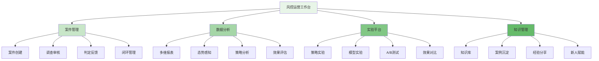
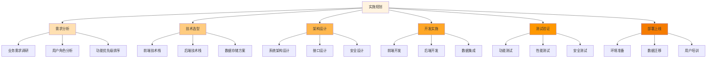

在企业级智能风控平台的建设中，运营工作台是连接技术能力与业务价值的关键桥梁。它不仅是一个工具集合，更是风控团队进行日常运营、策略优化和持续改进的核心平台。通过构建功能完善的风控运营工作台，企业能够实现从被动响应到主动预防的转变，提升风控效率和准确性。

## 风控运营工作台的核心价值

风控运营工作台作为风控体系的重要组成部分，承载着策略执行、效果评估、经验沉淀和团队协作等多重功能。

### 工作台功能架构



### 工作台核心组件

```yaml
# 风控运营工作台核心组件
operation_workbench_components:
  case_management_system:
    description: "案件全生命周期管理系统"
    features:
      - "案件创建与分配"
      - "调查任务管理"
      - "审核流程控制"
      - "反馈闭环机制"
    technologies:
      - "工作流引擎"
      - "任务调度系统"
      - "权限管理系统"
  
  data_visualization_platform:
    description: "数据可视化分析平台"
    features:
      - "实时监控大屏"
      - "多维度报表"
      - "风险态势感知"
      - "策略效果分析"
    technologies:
      - "BI工具集成"
      - "实时计算引擎"
      - "可视化组件库"
  
  experiment_management_system:
    description: "策略与模型实验平台"
    features:
      - "A/B测试框架"
      - "灰度发布机制"
      - "效果评估工具"
      - "统计分析模块"
    technologies:
      - "实验分流服务"
      - "指标计算引擎"
      - "统计分析库"
  
  knowledge_management_system:
    description: "知识库与案例管理系统"
    features:
      - "知识分类管理"
      - "案例沉淀机制"
      - "经验分享平台"
      - "新人培训模块"
    technologies:
      - "文档管理系统"
      - "搜索引引擎"
      - "协作平台集成"
```

## 案件管理系统设计与实现

案件管理系统是风控运营工作台的核心组件之一，负责处理可疑交易、异常行为等风险事件的全生命周期管理。

### 案件生命周期管理

```python
class CaseManagementSystem:
    def __init__(self):
        self.case_repository = CaseRepository()
        self.workflow_engine = WorkflowEngine()
        self.notification_service = NotificationService()
    
    def create_case(self, risk_event):
        """创建案件"""
        # 1. 生成案件基本信息
        case = Case(
            id=self.generate_case_id(),
            event_id=risk_event.id,
            risk_type=risk_event.risk_type,
            priority=self.calculate_priority(risk_event),
            status="CREATED",
            created_at=datetime.now()
        )
        
        # 2. 保存案件
        self.case_repository.save(case)
        
        # 3. 触发工作流
        workflow_instance = self.workflow_engine.start_workflow(
            workflow_name="case_investigation",
            case_id=case.id
        )
        
        # 4. 发送通知
        self.notification_service.send_notification(
            recipient=self.get_assigned_investigator(case),
            message=f"新案件 {case.id} 已创建，请及时处理"
        )
        
        return case
    
    def assign_case(self, case_id, investigator):
        """分配案件"""
        case = self.case_repository.get(case_id)
        case.assigned_to = investigator
        case.status = "ASSIGNED"
        case.assigned_at = datetime.now()
        
        self.case_repository.update(case)
        
        # 通知调查员
        self.notification_service.send_notification(
            recipient=investigator,
            message=f"案件 {case_id} 已分配给您，请及时处理"
        )
        
        return case
    
    def update_case_status(self, case_id, status, remarks=None):
        """更新案件状态"""
        case = self.case_repository.get(case_id)
        case.status = status
        case.updated_at = datetime.now()
        
        if remarks:
            case.remarks = remarks
        
        self.case_repository.update(case)
        
        # 记录状态变更日志
        self.log_status_change(case_id, status, remarks)
        
        return case
```

### 调查审核流程

```go
type InvestigationWorkflow struct {
    CaseID       string
    CurrentStep  string
    Assignee     string
    Status       string
    History      []WorkflowStep
}

type WorkflowStep struct {
    StepName     string
    Assignee     string
    StartTime    time.Time
    EndTime      time.Time
    Status       string
    Comments     string
}

func (iw *InvestigationWorkflow) ExecuteStep(stepName string, inputData map[string]interface{}) error {
    // 1. 验证步骤权限
    if err := iw.validateStepPermission(stepName); err != nil {
        return err
    }
    
    // 2. 执行步骤逻辑
    result, err := iw.executeStepLogic(stepName, inputData)
    if err != nil {
        return err
    }
    
    // 3. 记录步骤执行情况
    step := WorkflowStep{
        StepName:  stepName,
        Assignee:  iw.Assignee,
        StartTime: time.Now(),
        EndTime:   time.Now(),
        Status:    "COMPLETED",
        Comments:  result.Comments,
    }
    
    iw.History = append(iw.History, step)
    
    // 4. 更新工作流状态
    iw.CurrentStep = result.NextStep
    iw.Assignee = result.NextAssignee
    
    // 5. 触发下一步操作
    if result.NeedNotification {
        iw.sendNotification(result.Notification)
    }
    
    return nil
}

func (iw *InvestigationWorkflow) validateStepPermission(stepName string) error {
    // 验证当前用户是否有权限执行该步骤
    currentUser := getCurrentUser()
    if !hasPermission(currentUser, stepName) {
        return fmt.Errorf("user %s has no permission to execute step %s", currentUser, stepName)
    }
    return nil
}
```

## 数据可视化与分析平台

数据可视化与分析平台为风控运营提供直观的数据洞察，帮助团队快速识别风险趋势和策略效果。

### 多维数据报表系统

```typescript
interface DataVisualizationPlatform {
    // 实时监控大屏
    renderRealTimeDashboard(metrics: RealTimeMetrics): Promise<void>;
    
    // 多维度报表生成
    generateMultiDimensionalReport(
        dimensions: string[], 
        metrics: string[], 
        filters: ReportFilters
    ): Promise<ReportData>;
    
    // 风险态势感知
    analyzeRiskSituation(timeRange: TimeRange): Promise<RiskSituation>;
    
    // 策略效果分析
    evaluateStrategyEffectiveness(
        strategyId: string, 
        timeRange: TimeRange
    ): Promise<StrategyEffectiveness>;
}

class RiskControlDataVizPlatform implements DataVisualizationPlatform {
    private dataEngine: DataEngine;
    private visualizationEngine: VisualizationEngine;
    private analyticsEngine: AnalyticsEngine;
    
    async renderRealTimeDashboard(metrics: RealTimeMetrics): Promise<void> {
        // 1. 获取实时数据
        const realTimeData = await this.dataEngine.getRealTimeData(metrics);
        
        // 2. 数据处理与聚合
        const processedData = this.processRealTimeData(realTimeData);
        
        // 3. 生成可视化组件
        const dashboardComponents = this.visualizationEngine.createDashboardComponents(
            processedData
        );
        
        // 4. 渲染大屏
        this.visualizationEngine.renderDashboard(dashboardComponents);
    }
    
    async generateMultiDimensionalReport(
        dimensions: string[], 
        metrics: string[], 
        filters: ReportFilters
    ): Promise<ReportData> {
        // 1. 构建查询条件
        const query = this.buildQuery(dimensions, metrics, filters);
        
        // 2. 执行数据查询
        const rawData = await this.dataEngine.executeQuery(query);
        
        // 3. 数据聚合与计算
        const aggregatedData = this.aggregateData(rawData, dimensions, metrics);
        
        // 4. 生成报表
        const report = this.visualizationEngine.createReport(aggregatedData);
        
        return report;
    }
    
    async analyzeRiskSituation(timeRange: TimeRange): Promise<RiskSituation> {
        // 1. 获取风险数据
        const riskData = await this.dataEngine.getRiskData(timeRange);
        
        // 2. 风险趋势分析
        const trendAnalysis = this.analyticsEngine.analyzeTrend(riskData);
        
        // 3. 风险分布分析
        const distributionAnalysis = this.analyticsEngine.analyzeDistribution(riskData);
        
        // 4. 风险热点识别
        const hotspots = this.analyticsEngine.identifyHotspots(riskData);
        
        return {
            trend: trendAnalysis,
            distribution: distributionAnalysis,
            hotspots: hotspots,
            timeRange: timeRange
        };
    }
}
```

### 攻击态势感知系统

```javascript
class AttackSituationAwareness {
    constructor(config) {
        this.config = config;
        this.threatIntelligence = new ThreatIntelligenceService();
        this.anomalyDetector = new AnomalyDetectionEngine();
        this.alertCorrelator = new AlertCorrelationEngine();
    }
    
    /**
     * 实时攻击态势感知
     * @param {Object} eventData - 事件数据
     * @returns {Promise<Object>} 态势分析结果
     */
    async analyzeAttackSituation(eventData) {
        try {
            // 1. 威胁情报匹配
            const threatMatches = await this.threatIntelligence.match(eventData);
            
            // 2. 异常行为检测
            const anomalies = await this.anomalyDetector.detect(eventData);
            
            // 3. 告警关联分析
            const correlatedAlerts = await this.alertCorrelator.correlate(
                eventData, 
                threatMatches, 
                anomalies
            );
            
            // 4. 态势评估
            const situation = this.assessSituation(correlatedAlerts);
            
            // 5. 风险评分计算
            const riskScore = this.calculateRiskScore(situation);
            
            return {
                eventData: eventData,
                threatMatches: threatMatches,
                anomalies: anomalies,
                correlatedAlerts: correlatedAlerts,
                situation: situation,
                riskScore: riskScore,
                timestamp: new Date()
            };
        } catch (error) {
            console.error('Attack situation analysis failed:', error);
            return { success: false, error: error.message };
        }
    }
    
    /**
     * 态势评估
     * @param {Array} alerts - 关联告警
     * @returns {Object} 态势评估结果
     */
    assessSituation(alerts) {
        // 按攻击类型分类
        const attackTypes = this.categorizeAttacks(alerts);
        
        // 计算攻击强度
        const attackIntensity = this.calculateAttackIntensity(alerts);
        
        // 识别攻击来源
        const attackSources = this.identifyAttackSources(alerts);
        
        // 评估影响范围
        const impactScope = this.assessImpactScope(alerts);
        
        return {
            attackTypes: attackTypes,
            intensity: attackIntensity,
            sources: attackSources,
            impact: impactScope
        };
    }
}
```

## 实验平台设计与实现

实验平台是风控策略和模型持续优化的重要工具，通过A/B测试和灰度发布机制，确保新策略的安全性和有效性。

### A/B测试框架

```yaml
# A/B测试框架配置
ab_testing_framework:
  experiment_design:
    traffic_splitting:
      methods:
        - "随机分流"
        - "哈希分流"
        - "业务特征分流"
      ratios:
        - "90:10"
        - "80:20"
        - "70:30"
        - "50:50"
    
    metric_collection:
      primary_metrics:
        - "风险识别准确率"
        - "误报率"
        - "漏报率"
        - "处理时效"
      secondary_metrics:
        - "用户体验指标"
        - "业务指标影响"
        - "系统性能指标"
    
    statistical_analysis:
      significance_test:
        - "T检验"
        - "卡方检验"
        - "置信区间分析"
      sample_size_calculation:
        - "功效分析"
        - "最小 detectable effect"
```

### 灰度发布机制

```python
class GrayReleaseManager:
    def __init__(self):
        self.experiment_repository = ExperimentRepository()
        self.traffic_controller = TrafficController()
        self.metric_collector = MetricCollector()
        self.analysis_engine = AnalysisEngine()
    
    def create_experiment(self, strategy_config):
        """创建实验"""
        experiment = Experiment(
            id=self.generate_experiment_id(),
            name=strategy_config.name,
            description=strategy_config.description,
            status="CREATED",
            created_at=datetime.now()
        )
        
        # 保存实验配置
        self.experiment_repository.save(experiment)
        
        # 初始化流量配置
        self.traffic_controller.initialize_traffic_config(experiment.id, strategy_config.traffic_config)
        
        # 初始化指标收集
        self.metric_collector.initialize_metrics(experiment.id, strategy_config.metrics)
        
        return experiment
    
    def start_experiment(self, experiment_id, traffic_ratio=0.1):
        """启动实验"""
        experiment = self.experiment_repository.get(experiment_id)
        experiment.status = "RUNNING"
        experiment.started_at = datetime.now()
        
        # 设置流量比例
        self.traffic_controller.set_traffic_ratio(experiment_id, traffic_ratio)
        
        # 启动指标收集
        self.metric_collector.start_collection(experiment_id)
        
        self.experiment_repository.update(experiment)
        
        return experiment
    
    def analyze_experiment(self, experiment_id):
        """分析实验结果"""
        experiment = self.experiment_repository.get(experiment_id)
        
        # 收集指标数据
        metrics_data = self.metric_collector.get_metrics(experiment_id)
        
        # 统计分析
        analysis_result = self.analysis_engine.analyze(metrics_data)
        
        # 生成报告
        report = self.generate_analysis_report(experiment, analysis_result)
        
        return report
    
    def scale_experiment(self, experiment_id, new_ratio):
        """扩缩实验流量"""
        # 验证实验状态
        experiment = self.experiment_repository.get(experiment_id)
        if experiment.status != "RUNNING":
            raise Exception("Experiment is not running")
        
        # 更新流量比例
        self.traffic_controller.set_traffic_ratio(experiment_id, new_ratio)
        
        # 记录变更
        self.log_traffic_change(experiment_id, new_ratio)
        
        return True
```

## 知识库与案例沉淀系统

知识库与案例沉淀系统是风控团队经验传承和能力提升的重要平台，通过结构化的知识管理，实现团队智慧的积累和复用。

### 知识分类管理体系

```go
type KnowledgeManagementSystem struct {
    KnowledgeRepository *KnowledgeRepository
    SearchEngine        *SearchEngine
    CollaborationTool   *CollaborationTool
    TrainingPlatform    *TrainingPlatform
}

type KnowledgeCategory struct {
    ID          string
    Name        string
    ParentID    string
    Description string
    SubCategories []*KnowledgeCategory
}

type KnowledgeItem struct {
    ID          string
    Title       string
    Content     string
    CategoryID  string
    Tags        []string
    Author      string
    CreatedAt   time.Time
    UpdatedAt   time.Time
    Version     int
    Status      string  // DRAFT, PUBLISHED, ARCHIVED
}

func (kms *KnowledgeManagementSystem) CreateKnowledgeItem(item *KnowledgeItem) error {
    // 1. 验证输入数据
    if err := kms.validateKnowledgeItem(item); err != nil {
        return err
    }
    
    // 2. 设置元数据
    item.ID = generateKnowledgeID()
    item.CreatedAt = time.Now()
    item.UpdatedAt = time.Now()
    item.Version = 1
    item.Status = "DRAFT"
    
    // 3. 保存知识条目
    if err := kms.KnowledgeRepository.Save(item); err != nil {
        return err
    }
    
    // 4. 建立索引
    if err := kms.SearchEngine.Index(item); err != nil {
        return err
    }
    
    return nil
}

func (kms *KnowledgeManagementSystem) PublishKnowledgeItem(itemID string) error {
    // 1. 获取知识条目
    item, err := kms.KnowledgeRepository.Get(itemID)
    if err != nil {
        return err
    }
    
    // 2. 验证发布条件
    if err := kms.validatePublishConditions(item); err != nil {
        return err
    }
    
    // 3. 更新状态
    item.Status = "PUBLISHED"
    item.UpdatedAt = time.Now()
    
    // 4. 保存更新
    if err := kms.KnowledgeRepository.Update(item); err != nil {
        return err
    }
    
    // 5. 更新索引
    if err := kms.SearchEngine.Index(item); err != nil {
        return err
    }
    
    return nil
}
```

### 案例沉淀与复用机制

```typescript
interface CaseRepository {
    // 案例存储
    saveCase(caseItem: CaseItem): Promise<void>;
    
    // 案例检索
    searchCases(criteria: SearchCriteria): Promise<CaseItem[]>;
    
    // 案例分类
    categorizeCases(): Promise<CaseCategory[]>;
    
    // 案例推荐
    recommendCases(userProfile: UserProfile): Promise<CaseItem[]>;
}

class RiskControlCaseRepository implements CaseRepository {
    private storage: CaseStorage;
    private indexer: CaseIndexer;
    private recommender: CaseRecommender;
    
    async saveCase(caseItem: CaseItem): Promise<void> {
        // 1. 数据验证
        this.validateCaseItem(caseItem);
        
        // 2. 生成唯一标识
        caseItem.id = this.generateCaseID();
        caseItem.createdAt = new Date();
        caseItem.updatedAt = new Date();
        
        // 3. 存储案例
        await this.storage.save(caseItem);
        
        // 4. 建立索引
        await this.indexer.index(caseItem);
        
        // 5. 更新推荐模型
        await this.recommender.updateModel(caseItem);
    }
    
    async searchCases(criteria: SearchCriteria): Promise<CaseItem[]> {
        // 1. 构建查询条件
        const query = this.buildSearchQuery(criteria);
        
        // 2. 执行搜索
        const results = await this.storage.search(query);
        
        // 3. 排序和过滤
        const filteredResults = this.filterAndSort(results, criteria);
        
        return filteredResults;
    }
    
    async recommendCases(userProfile: UserProfile): Promise<CaseItem[]> {
        // 1. 获取用户历史行为
        const userHistory = await this.getUserHistory(userProfile);
        
        // 2. 生成推荐
        const recommendations = await this.recommender.recommend(
            userProfile, 
            userHistory
        );
        
        // 3. 补充案例详情
        const detailedCases = await this.enrichCaseDetails(recommendations);
        
        return detailedCases;
    }
}
```

## 最佳实践与经验总结

在构建风控运营工作台的过程中，需要遵循一系列最佳实践来确保系统的成功实施和有效运行。

### 系统设计原则

1. **用户体验优先**：界面设计简洁直观，操作流程符合用户习惯
2. **数据驱动决策**：所有功能都应基于数据分析，提供决策支持
3. **可扩展性设计**：系统架构应支持功能模块的灵活扩展
4. **安全性保障**：严格的数据访问控制和操作审计机制

### 实施要点



### 运营管理建议

1. **建立标准化流程**：制定详细的案件处理流程和操作规范
2. **持续优化迭代**：基于用户反馈和数据分析不断改进系统功能
3. **团队能力建设**：定期组织培训，提升团队专业技能
4. **效果评估机制**：建立科学的KPI体系，量化系统价值

通过构建功能完善的风控运营工作台，企业可以显著提升风控运营效率，实现从被动响应到主动预防的转变，为业务的健康发展提供有力保障。