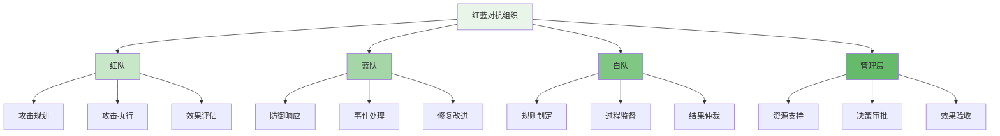
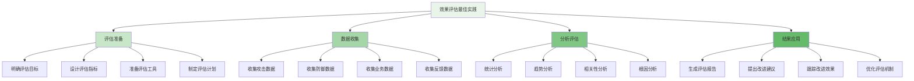

红蓝对抗机制是企业级智能风控平台持续改进和能力验证的核心手段。通过模拟真实攻击场景，红蓝对抗能够有效检验风控系统的防护能力，发现潜在脆弱性，并为策略优化提供实战依据。

## 红蓝对抗组织架构

红蓝对抗需要建立清晰的组织架构和角色分工，确保对抗演练的科学性和有效性。

### 组织架构设计



### 核心角色职责

```yaml
# 红蓝对抗核心角色职责
red_blue_team_roles:
  red_team:
    name: "红队（攻击方）"
    responsibilities:
      - "设计攻击场景和策略"
      - "执行模拟攻击测试"
      - "评估攻击效果和绕过能力"
      - "提供攻击技术洞察"
    required_skills:
      - "攻击技术专长"
      - "系统漏洞理解"
      - "创新思维能力"
      - "报告撰写能力"
  
  blue_team:
    name: "蓝队（防御方）"
    responsibilities:
      - "监控和检测攻击行为"
      - "响应和处理安全事件"
      - "分析攻击手法和特征"
      - "优化防护策略和机制"
    required_skills:
      - "安全监控能力"
      - "事件响应经验"
      - "策略优化技能"
      - "团队协作能力"
  
  white_team:
    name: "白队（裁判方）"
    responsibilities:
      - "制定对抗规则和标准"
      - "监督对抗过程合规性"
      - "评估对抗结果有效性"
      - "协调资源和支持"
    required_skills:
      - "规则制定能力"
      - "过程管理经验"
      - "公正判断能力"
      - "沟通协调技能"
```

## 攻击场景设计

攻击场景设计是红蓝对抗的核心环节，需要贴近实际威胁环境并具有挑战性。

### 场景设计原则

```python
class AttackScenarioDesigner:
    def __init__(self):
        self.threat_intelligence = ThreatIntelligenceHub()
        self.business_analyzer = BusinessContextAnalyzer()
        self.system_architect = SystemArchitectureAnalyzer()
        self.complexity_evaluator = ComplexityEvaluator()
    
    def design_attack_scenario(self, scenario_config):
        """设计攻击场景"""
        # 1. 威胁情报分析
        threat_analysis = self.threat_intelligence.analyze_current_threats()
        
        # 2. 业务上下文分析
        business_context = self.business_analyzer.analyze_business_context(
            scenario_config.business_domain
        )
        
        # 3. 系统架构分析
        system_analysis = self.system_architect.analyze_system_architecture(
            scenario_config.target_systems
        )
        
        # 4. 攻击向量设计
        attack_vectors = self.design_attack_vectors(
            threat_analysis,
            business_context,
            system_analysis,
            scenario_config.complexity_level
        )
        
        # 5. 成功标准定义
        success_criteria = self.define_success_criteria(
            attack_vectors,
            scenario_config.objectives
        )
        
        # 6. 时间线规划
        timeline = self.plan_attack_timeline(attack_vectors)
        
        # 7. 风险评估
        risk_assessment = self.assess_scenario_risks(
            attack_vectors,
            business_context
        )
        
        return AttackScenario(
            id=self.generate_scenario_id(),
            name=scenario_config.name,
            description=scenario_config.description,
            threat_background=threat_analysis,
            business_context=business_context,
            system_context=system_analysis,
            attack_vectors=attack_vectors,
            success_criteria=success_criteria,
            timeline=timeline,
            risk_assessment=risk_assessment,
            complexity=self.complexity_evaluator.evaluate(attack_vectors),
            created_at=datetime.now()
        )
    
    def design_attack_vectors(self, threat_analysis, business_context, system_analysis, complexity):
        """设计攻击向量"""
        vectors = []
        
        # 1. 基于威胁情报的向量
        threat_based_vectors = self.generate_threat_based_vectors(threat_analysis)
        vectors.extend(threat_based_vectors)
        
        # 2. 基于业务特点的向量
        business_based_vectors = self.generate_business_based_vectors(business_context)
        vectors.extend(business_based_vectors)
        
        # 3. 基于系统架构的向量
        system_based_vectors = self.generate_system_based_vectors(system_analysis)
        vectors.extend(system_based_vectors)
        
        # 4. 根据复杂度调整向量
        if complexity == "high":
            # 增加复合攻击向量
            composite_vectors = self.generate_composite_vectors(vectors)
            vectors.extend(composite_vectors)
        elif complexity == "low":
            # 简化攻击向量
            vectors = self.simplify_vectors(vectors)
        
        return vectors
    
    def generate_threat_based_vectors(self, threat_analysis):
        """基于威胁情报生成攻击向量"""
        vectors = []
        
        for threat in threat_analysis.current_threats:
            if threat.type == "credential_theft":
                vectors.append(AttackVector(
                    id=f"vector-{len(vectors)+1}",
                    type="credential_theft",
                    techniques=["phishing", "keylogger", "man_in_the_middle"],
                    tools=["metasploit", "ettercap", "social_engineering_toolkit"],
                    complexity="medium",
                    stealth_level="high"
                ))
            elif threat.type == "account_takeover":
                vectors.append(AttackVector(
                    id=f"vector-{len(vectors)+1}",
                    type="account_takeover",
                    techniques=["credential_stuffing", "brute_force", "session_hijacking"],
                    tools=["hydra", "burp_suite", "sqlmap"],
                    complexity="medium",
                    stealth_level="medium"
                ))
            elif threat.type == "payment_fraud":
                vectors.append(AttackVector(
                    id=f"vector-{len(vectors)+1}",
                    type="payment_fraud",
                    techniques=["transaction_manipulation", "card_testing", "chargeback_fraud"],
                    tools=["mitmproxy", "tamper_data", "custom_scripts"],
                    complexity="high",
                    stealth_level="high"
                ))
        
        return vectors
    
    def generate_business_based_vectors(self, business_context):
        """基于业务特点生成攻击向量"""
        vectors = []
        
        if business_context.domain == "ecommerce":
            vectors.extend([
                AttackVector(
                    id=f"vector-{len(vectors)+1}",
                    type="promotion_abuse",
                    techniques=["coupon_stacking", "referral_farming", "loyalty_point_harvesting"],
                    tools=["automation_scripts", "proxy_pools", "account_farmers"],
                    complexity="low",
                    stealth_level="low"
                ),
                AttackVector(
                    id=f"vector-{len(vectors)+1}",
                    type="inventory_hoarding",
                    techniques=["cart_hijacking", "flash_sale_sniping", "bot_purchasing"],
                    tools=["selenium", "headless_browsers", "rate_limit_bypassers"],
                    complexity="medium",
                    stealth_level="medium"
                )
            ])
        elif business_context.domain == "financial":
            vectors.extend([
                AttackVector(
                    id=f"vector-{len(vectors)+1}",
                    type="aml_evasion",
                    techniques=["structuring", "smurfing", "trade_based_laundering"],
                    tools=["transaction_simulators", "network_analyzers", "pattern_obfuscators"],
                    complexity="high",
                    stealth_level="high"
                ),
                AttackVector(
                    id=f"vector-{len(vectors)+1}",
                    type="credit_risk_manipulation",
                    techniques=["income_falsification", "employment_verification_bypass", "asset_hiding"],
                    tools=["document_forgery_tools", "identity_masking_services", "relationship_graph_manipulators"],
                    complexity="high",
                    stealth_level="high"
                )
            ])
        
        return vectors
```

### 攻击工具与技术

```go
type AttackToolkit struct {
    Tools         map[string]AttackTool
    Techniques    map[string]AttackTechnique
    Payloads      map[string]AttackPayload
    Infrastructure AttackInfrastructure
}

type AttackTool struct {
    Name          string
    Category      string  // recon, exploitation, evasion, etc.
    Description   string
    Capabilities  []string
    Dependencies  []string
    Configuration ToolConfiguration
}

type AttackTechnique struct {
    Name          string
    Tactic        string  // initial_access, execution, persistence, etc.
    Description   string
    Steps         []TechniqueStep
    Indicators    []string
    Countermeasures []string
}

type AttackPayload struct {
    ID            string
    Type          string  // malware, phishing, exploit, etc.
    Content       string
    Encoding      string
    Size          int
    TargetSystem  string
    DeliveryMethod string
}

func (atk *AttackToolkit) PrepareCustomTool(toolConfig *ToolConfiguration) *AttackTool {
    // 1. 创建工具实例
    tool := &AttackTool{
        Name:         toolConfig.Name,
        Category:     toolConfig.Category,
        Description:  toolConfig.Description,
        Capabilities: toolConfig.Capabilities,
        Dependencies: toolConfig.Dependencies,
    }
    
    // 2. 配置工具参数
    tool.Configuration = atk.configureTool(toolConfig.Parameters)
    
    // 3. 验证工具依赖
    if err := atk.verifyDependencies(tool.Dependencies); err != nil {
        return nil, fmt.Errorf("tool dependencies verification failed: %v", err)
    }
    
    // 4. 初始化工具环境
    if err := atk.initializeToolEnvironment(tool); err != nil {
        return nil, fmt.Errorf("tool initialization failed: %v", err)
    }
    
    // 5. 存储工具
    atk.Tools[tool.Name] = tool
    
    return tool
}

func (atk *AttackToolkit) GenerateAttackPayload(payloadConfig *PayloadConfiguration) *AttackPayload {
    // 1. 生成载荷内容
    content := atk.generatePayloadContent(payloadConfig)
    
    // 2. 编码载荷
    encodedContent := atk.encodePayload(content, payloadConfig.Encoding)
    
    // 3. 计算载荷大小
    size := len(encodedContent)
    
    // 4. 创建载荷对象
    payload := &AttackPayload{
        ID:             atk.generatePayloadID(),
        Type:           payloadConfig.Type,
        Content:        encodedContent,
        Encoding:       payloadConfig.Encoding,
        Size:           size,
        TargetSystem:   payloadConfig.TargetSystem,
        DeliveryMethod: payloadConfig.DeliveryMethod,
    }
    
    // 5. 存储载荷
    atk.Payloads[payload.ID] = payload
    
    return payload
}

func (atk *AttackToolkit) ExecuteAttack(attackPlan *AttackPlan) *AttackExecutionResult {
    // 1. 初始化执行环境
    executionContext := atk.initializeExecutionContext(attackPlan)
    
    // 2. 按步骤执行攻击
    stepResults := make([]AttackStepResult, 0)
    
    for _, step := range attackPlan.Steps {
        // 执行攻击步骤
        stepResult := atk.executeAttackStep(step, executionContext)
        stepResults = append(stepResults, stepResult)
        
        // 检查步骤是否成功
        if !stepResult.Success {
            // 记录失败原因
            executionContext.FailureReasons = append(executionContext.FailureReasons, stepResult.Error)
            
            // 根据配置决定是否继续
            if !attackPlan.ContinueOnFailure {
                break
            }
        }
        
        // 更新执行上下文
        executionContext.UpdateWithStepResult(stepResult)
    }
    
    // 3. 评估攻击效果
    attackEffect := atk.evaluateAttackEffect(stepResults, attackPlan.Objectives)
    
    // 4. 生成执行报告
    executionReport := atk.generateExecutionReport(stepResults, attackEffect)
    
    return &AttackExecutionResult{
        PlanID:         attackPlan.ID,
        StartTime:      executionContext.StartTime,
        EndTime:        time.Now(),
        StepResults:    stepResults,
        AttackEffect:   attackEffect,
        ExecutionReport: executionReport,
        Success:        attackEffect.SuccessRate > 0.7,  // 70%成功率视为成功
    }
}
```

## 对抗效果评估

对抗效果评估是红蓝对抗的关键环节，需要建立科学的评估体系和标准。

### 评估指标体系

```typescript
interface AttackDefenseEvaluation {
    // 攻击效果评估
    evaluateAttackEffectiveness(attackResults: AttackResults): Promise<AttackEffectiveness>;
    
    // 防御能力评估
    evaluateDefenseCapability(defenseResults: DefenseResults): Promise<DefenseCapability>;
    
    // 综合效果评估
    evaluateOverallEffectiveness(attackEval: AttackEffectiveness, defenseEval: DefenseCapability): Promise<OverallEffectiveness>;
    
    // 改进建议生成
    generateImprovementRecommendations(evaluation: OverallEffectiveness): Promise<ImprovementRecommendations>;
}

class RedBlueTeamEvaluator implements AttackDefenseEvaluation {
    private metricsCollector: MetricsCollector;
    private analysisEngine: EvaluationAnalysisEngine;
    private recommendationEngine: RecommendationEngine;
    
    async evaluateAttackEffectiveness(attackResults: AttackResults): Promise<AttackEffectiveness> {
        // 1. 攻击成功率评估
        const successRate = this.calculateAttackSuccessRate(attackResults);
        
        // 2. 攻击复杂度评估
        const complexityScore = this.evaluateAttackComplexity(attackResults.scenarios);
        
        // 3. 绕过能力评估
        const bypassCapability = this.assessBypassCapabilities(attackResults);
        
        // 4. 时效性评估
        const timingEffectiveness = this.evaluateAttackTiming(attackResults);
        
        // 5. 资源利用评估
        const resourceEfficiency = this.evaluateResourceUtilization(attackResults);
        
        return {
            successRate: successRate,
            complexityScore: complexityScore,
            bypassCapability: bypassCapability,
            timingEffectiveness: timingEffectiveness,
            resourceEfficiency: resourceEfficiency,
            overallScore: this.calculateAttackOverallScore(
                successRate, 
                complexityScore, 
                bypassCapability, 
                timingEffectiveness, 
                resourceEfficiency
            )
        };
    }
    
    async evaluateDefenseCapability(defenseResults: DefenseResults): Promise<DefenseCapability> {
        // 1. 检测率评估
        const detectionRate = this.calculateDetectionRate(defenseResults);
        
        // 2. 响应时间评估
        const responseTime = this.calculateAverageResponseTime(defenseResults.responses);
        
        // 3. 误报率评估
        const falsePositiveRate = this.calculateFalsePositiveRate(defenseResults.alerts);
        
        // 4. 处理效果评估
        const handlingEffectiveness = this.evaluateHandlingEffectiveness(defenseResults);
        
        // 5. 资源消耗评估
        const resourceConsumption = this.evaluateResourceConsumption(defenseResults);
        
        return {
            detectionRate: detectionRate,
            responseTime: responseTime,
            falsePositiveRate: falsePositiveRate,
            handlingEffectiveness: handlingEffectiveness,
            resourceConsumption: resourceConsumption,
            overallScore: this.calculateDefenseOverallScore(
                detectionRate,
                responseTime,
                falsePositiveRate,
                handlingEffectiveness,
                resourceConsumption
            )
        };
    }
    
    async evaluateOverallEffectiveness(attackEval: AttackEffectiveness, defenseEval: DefenseCapability): Promise<OverallEffectiveness> {
        // 1. 平衡性评估
        const balanceScore = this.evaluateBalance(attackEval, defenseEval);
        
        // 2. 实战价值评估
        const practicalValue = this.assessPracticalValue(attackEval, defenseEval);
        
        // 3. 学习效果评估
        const learningEffect = this.evaluateLearningEffect(attackEval, defenseEval);
        
        // 4. 成本效益评估
        const costBenefit = this.analyzeCostBenefit(attackEval, defenseEval);
        
        // 5. 综合评分
        const overallScore = this.calculateOverallEffectivenessScore(
            attackEval.overallScore,
            defenseEval.overallScore,
            balanceScore,
            practicalValue,
            learningEffect,
            costBenefit
        );
        
        return {
            balanceScore: balanceScore,
            practicalValue: practicalValue,
            learningEffect: learningEffect,
            costBenefit: costBenefit,
            overallScore: overallScore,
            effectivenessLevel: this.determineEffectivenessLevel(overallScore)
        };
    }
    
    private calculateAttackSuccessRate(results: AttackResults): number {
        if (results.scenarios.length === 0) return 0;
        
        const successfulScenarios = results.scenarios.filter(s => s.success).length;
        return successfulScenarios / results.scenarios.length;
    }
    
    private evaluateAttackComplexity(scenarios: AttackScenario[]): number {
        if (scenarios.length === 0) return 0;
        
        const totalComplexity = scenarios.reduce((sum, scenario) => {
            return sum + this.mapComplexityToScore(scenario.complexity);
        }, 0);
        
        return totalComplexity / scenarios.length;
    }
    
    private mapComplexityToScore(complexity: string): number {
        switch (complexity.toLowerCase()) {
            case 'low': return 1;
            case 'medium': return 2;
            case 'high': return 3;
            default: return 1;
        }
    }
    
    private assessBypassCapabilities(attackResults: AttackResults): BypassCapability {
        const bypassMetrics = {
            totalBypasses: 0,
            successfulBypasses: 0,
            bypassTechniques: [] as string[],
            detectionEvasion: 0
        };
        
        for (const scenario of attackResults.scenarios) {
            for (const vector of scenario.attackVectors) {
                bypassMetrics.totalBypasses++;
                if (vector.bypassedDetection) {
                    bypassMetrics.successfulBypasses++;
                    bypassMetrics.bypassTechniques.push(vector.technique);
                }
            }
        }
        
        const bypassRate = bypassMetrics.totalBypasses > 0 ? 
            bypassMetrics.successfulBypasses / bypassMetrics.totalBypasses : 0;
        
        return {
            bypassRate: bypassRate,
            techniques: [...new Set(bypassMetrics.bypassTechniques)],
            overallCapability: bypassRate * 100
        };
    }
}
```

### 评估数据分析

```javascript
class EvaluationDataAnalyzer {
    constructor(config) {
        this.config = config;
        this.statisticalEngine = new StatisticalAnalysisEngine();
        this.trendAnalyzer = new TrendAnalysisEngine();
        this.correlationEngine = new CorrelationAnalysisEngine();
    }
    
    /**
     * 分析对抗评估数据
     * @param {Object} evaluationData - 评估数据
     * @returns {Promise<Object>} 分析结果
     */
    async analyzeEvaluationData(evaluationData) {
        try {
            // 1. 描述性统计分析
            const descriptiveStats = this.performDescriptiveAnalysis(evaluationData);
            
            // 2. 趋势分析
            const trends = await this.analyzeTrends(evaluationData);
            
            // 3. 相关性分析
            const correlations = await this.analyzeCorrelations(evaluationData);
            
            // 4. 异常检测
            const anomalies = await this.detectAnomalies(evaluationData);
            
            // 5. 根因分析
            const rootCauses = await this.analyzeRootCauses(evaluationData, anomalies);
            
            // 6. 改进建议
            const recommendations = this.generateDataDrivenRecommendations(
                descriptiveStats, 
                trends, 
                correlations, 
                rootCauses
            );
            
            return {
                descriptiveStats: descriptiveStats,
                trends: trends,
                correlations: correlations,
                anomalies: anomalies,
                rootCauses: rootCauses,
                recommendations: recommendations
            };
        } catch (error) {
            console.error('Failed to analyze evaluation data:', error);
            return { success: false, error: error.message };
        }
    }
    
    /**
     * 执行描述性统计分析
     * @param {Object} data - 数据
     * @returns {Object} 统计结果
     */
    performDescriptiveAnalysis(data) {
        const stats = {};
        
        // 1. 攻击成功率统计
        stats.attackSuccess = this.calculateBasicStats(
            data.attackScenarios.map(s => s.successRate)
        );
        
        // 2. 防御检测率统计
        stats.defenseDetection = this.calculateBasicStats(
            data.defenseResponses.map(r => r.detectionRate)
        );
        
        // 3. 响应时间统计
        stats.responseTime = this.calculateBasicStats(
            data.defenseResponses.map(r => r.responseTime)
        );
        
        // 4. 误报率统计
        stats.falsePositive = this.calculateBasicStats(
            data.defenseAlerts.map(a => a.falsePositiveRate)
        );
        
        return stats;
    }
    
    /**
     * 分析趋势
     * @param {Object} data - 数据
     * @returns {Promise<Object>} 趋势分析结果
     */
    async analyzeTrends(data) {
        const trends = {};
        
        // 1. 攻击成功率趋势
        trends.attackSuccess = await this.trendAnalyzer.analyzeTimeSeries(
            data.attackScenarios.map(s => ({
                timestamp: s.timestamp,
                value: s.successRate
            }))
        );
        
        // 2. 防御能力趋势
        trends.defenseCapability = await this.trendAnalyzer.analyzeTimeSeries(
            data.defenseMetrics.map(m => ({
                timestamp: m.timestamp,
                value: m.overallScore
            }))
        );
        
        // 3. 系统成熟度趋势
        trends.systemMaturity = await this.trendAnalyzer.analyzeTimeSeries(
            data.maturityMetrics.map(m => ({
                timestamp: m.timestamp,
                value: m.maturityLevel
            }))
        );
        
        return trends;
    }
    
    /**
     * 分析相关性
     * @param {Object} data - 数据
     * @returns {Promise<Object>} 相关性分析结果
     */
    async analyzeCorrelations(data) {
        const correlations = {};
        
        // 1. 攻击复杂度与成功率相关性
        correlations.complexitySuccess = await this.correlationEngine.calculateCorrelation(
            data.attackScenarios.map(s => s.complexityScore),
            data.attackScenarios.map(s => s.successRate)
        );
        
        // 2. 检测率与响应时间相关性
        correlations.detectionResponse = await this.correlationEngine.calculateCorrelation(
            data.defenseResponses.map(r => r.detectionRate),
            data.defenseResponses.map(r => r.responseTime)
        );
        
        // 3. 误报率与漏报率相关性
        correlations.falseNegative = await this.correlationEngine.calculateCorrelation(
            data.defenseAlerts.map(a => a.falsePositiveRate),
            data.defenseAlerts.map(a => a.missedDetectionRate)
        );
        
        return correlations;
    }
    
    /**
     * 检测异常
     * @param {Object} data - 数据
     * @returns {Promise<Array>} 异常检测结果
     */
    async detectAnomalies(data) {
        const anomalies = [];
        
        // 1. 使用统计方法检测异常
        const statisticalAnomalies = this.detectStatisticalAnomalies(data);
        anomalies.push(...statisticalAnomalies);
        
        // 2. 使用机器学习方法检测异常
        const mlAnomalies = await this.detectMLAnomalies(data);
        anomalies.push(...mlAnomalies);
        
        // 3. 使用规则方法检测异常
        const ruleBasedAnomalies = this.detectRuleBasedAnomalies(data);
        anomalies.push(...ruleBasedAnomalies);
        
        return anomalies;
    }
    
    /**
     * 分析根因
     * @param {Object} data - 数据
     * @param {Array} anomalies - 异常
     * @returns {Promise<Array>} 根因分析结果
     */
    async analyzeRootCauses(data, anomalies) {
        const rootCauses = [];
        
        for (const anomaly of anomalies) {
            // 1. 基于规则的根因分析
            const ruleBasedCauses = this.analyzeRuleBasedRootCauses(anomaly, data);
            rootCauses.push(...ruleBasedCauses);
            
            // 2. 基于统计的根因分析
            const statisticalCauses = this.analyzeStatisticalRootCauses(anomaly, data);
            rootCauses.push(...statisticalCauses);
            
            // 3. 基于机器学习的根因分析
            const mlCauses = await this.analyzeMLRootCauses(anomaly, data);
            rootCauses.push(...mlCauses);
        }
        
        return rootCauses;
    }
    
    /**
     * 生成数据驱动的改进建议
     * @param {Object} stats - 统计数据
     * @param {Object} trends - 趋势数据
     * @param {Object} correlations - 相关性数据
     * @param {Array} rootCauses - 根因数据
     * @returns {Array} 改进建议
     */
    generateDataDrivenRecommendations(stats, trends, correlations, rootCauses) {
        const recommendations = [];
        
        // 1. 基于统计结果的建议
        if (stats.attackSuccess.mean > 0.7) {
            recommendations.push({
                type: 'security_improvement',
                priority: 'high',
                description: '攻击成功率过高，建议加强检测机制',
                actions: [
                    '优化规则引擎检测能力',
                    '增强机器学习模型',
                    '完善名单服务策略'
                ]
            });
        }
        
        // 2. 基于趋势的建议
        if (trends.defenseCapability.trend < 0) {
            recommendations.push({
                type: 'capability_degradation',
                priority: 'medium',
                description: '防御能力呈下降趋势，建议分析原因',
                actions: [
                    '审查近期策略变更',
                    '评估系统性能影响',
                    '检查资源配置情况'
                ]
            });
        }
        
        // 3. 基于相关性的建议
        if (Math.abs(correlations.complexitySuccess.correlation) > 0.7) {
            recommendations.push({
                type: 'complexity_management',
                priority: 'medium',
                description: '攻击复杂度与成功率强相关，建议优化复杂攻击检测',
                actions: [
                    '加强行为分析能力',
                    '完善图计算检测',
                    '提升模型复杂度处理能力'
                ]
            });
        }
        
        // 4. 基于根因的建议
        for (const cause of rootCauses) {
            recommendations.push({
                type: 'root_cause_remediation',
                priority: cause.impact > 0.8 ? 'high' : 'medium',
                description: cause.description,
                actions: cause.remediationActions
            });
        }
        
        return recommendations;
    }
}
```

## 最佳实践与经验总结

在实施红蓝对抗机制的过程中，需要遵循一系列最佳实践来确保机制的有效性和可持续性。

### 对抗机制实施最佳实践

1. **明确目标导向**：每次对抗都应有清晰的目标和预期成果
2. **渐进式实施**：从简单场景开始，逐步增加复杂度
3. **全程记录**：详细记录对抗过程和结果数据
4. **及时复盘**：对抗结束后立即进行复盘总结
5. **持续改进**：基于对抗结果持续优化防护体系

### 效果评估最佳实践



### 运营管理建议

1. **建立专职团队**：组建专业的红蓝对抗团队负责机制实施
2. **制度化管理**：建立定期对抗和评估的制度化流程
3. **工具平台建设**：建设完善的对抗和评估工具平台
4. **文化建设**：培养积极面对挑战和持续改进的团队文化
5. **知识管理**：建立对抗经验和教训的知识管理体系

通过建立完善的红蓝对抗机制，企业可以有效检验风控平台的实战能力，发现系统脆弱性，并持续提升平台的防护水平和应急响应能力。这种机制不仅能够提升技术防护能力，还能够培养团队的实战经验和应急响应能力，为企业的安全防护体系提供有力支撑。