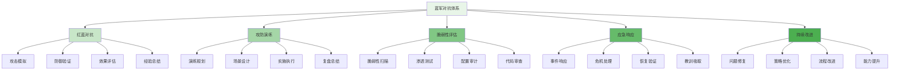
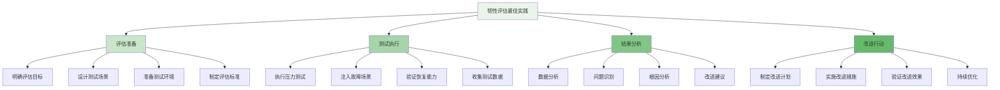

在企业级智能风控平台的建设中，蓝军对抗与体系评估是确保平台有效性和持续改进的重要环节。通过主动模拟攻击和系统性评估，企业能够发现防护体系中的薄弱环节，验证防御机制的有效性，并不断提升风控平台的实战能力。

## 蓝军对抗体系架构

蓝军对抗体系需要模拟真实的攻击场景，构建完整的攻防演练机制，确保评估的科学性和有效性。

### 体系架构层次



### 核心功能模块

```yaml
# 蓝军对抗体系核心功能模块
red_blue_team_modules:
  attack_simulation:
    description: "攻击模拟机制"
    features:
      - "攻击向量模拟"
      - "攻击工具开发"
      - "攻击场景构建"
      - "攻击效果评估"
    integration_points:
      - "威胁情报平台"
      - "攻击工具库"
      - "演练管理系统"
  
  defense_validation:
    description: "防御验证机制"
    features:
      - "检测能力验证"
      - "响应机制测试"
      - "防护效果评估"
      - "系统韧性检验"
    integration_points:
      - "风控平台"
      - "安全监控系统"
      - "事件响应平台"
  
  vulnerability_assessment:
    description: "脆弱性评估"
    features:
      - "自动化扫描"
      - "人工渗透测试"
      - "配置安全审计"
      - "代码安全审查"
    integration_points:
      - "漏洞扫描工具"
      - "渗透测试平台"
      - "代码审计工具"
  
  continuous_improvement:
    description: "持续改进机制"
    features:
      - "问题跟踪管理"
      - "修复效果验证"
      - "策略迭代优化"
      - "能力提升计划"
    integration_points:
      - "问题管理系统"
      - "策略管理平台"
      - "培训学习系统"
```

## 红蓝对抗机制设计

红蓝对抗是检验风控平台有效性的重要手段，需要建立科学的对抗机制和评估体系。

### 对抗组织架构

```python
class RedBlueTeamFramework:
    def __init__(self):
        self.red_team = RedTeam()
        self.blue_team = BlueTeam()
        self.white_team = WhiteTeam()  # 裁判团队
        self.attack_scenarios = AttackScenarioRepository()
        self.evaluation_engine = EvaluationEngine()
    
    def conduct_red_blue_exercise(self, exercise_config):
        """执行红蓝对抗演练"""
        # 1. 演练准备
        exercise = self.prepare_exercise(exercise_config)
        
        # 2. 攻击模拟
        attack_results = self.red_team.execute_attacks(exercise.scenarios)
        
        # 3. 防御响应
        defense_results = self.blue_team.respond_to_attacks(attack_results)
        
        # 4. 效果评估
        evaluation = self.evaluate_exercise(exercise, attack_results, defense_results)
        
        # 5. 复盘总结
        lessons = self.conduct_debriefing(evaluation)
        
        # 6. 改进行动
        improvement_plan = self.generate_improvement_plan(lessons)
        
        return {
            'exercise': exercise,
            'attack_results': attack_results,
            'defense_results': defense_results,
            'evaluation': evaluation,
            'lessons': lessons,
            'improvement_plan': improvement_plan
        }
    
    def prepare_exercise(self, config):
        """准备对抗演练"""
        # 1. 确定演练目标
        objectives = self.define_objectives(config.objectives)
        
        # 2. 设计攻击场景
        scenarios = self.design_attack_scenarios(config.scenario_types, config.complexity)
        
        # 3. 制定演练计划
        plan = self.create_exercise_plan(scenarios, config.timeline)
        
        # 4. 准备演练环境
        environment = self.setup_exercise_environment(config.scope)
        
        # 5. 建立评估标准
        criteria = self.establish_evaluation_criteria(config.metrics)
        
        return Exercise(
            id=self.generate_exercise_id(),
            objectives=objectives,
            scenarios=scenarios,
            plan=plan,
            environment=environment,
            criteria=criteria,
            status='prepared',
            created_at=datetime.now()
        )
    
    def design_attack_scenarios(self, scenario_types, complexity):
        """设计攻击场景"""
        scenarios = []
        
        # 1. 基于威胁情报设计场景
        threat_intel = self.get_latest_threat_intelligence()
        
        # 2. 根据业务特点定制场景
        business_context = self.get_business_context()
        
        # 3. 考虑系统架构设计场景
        system_architecture = self.get_system_architecture()
        
        # 4. 生成具体攻击场景
        for scenario_type in scenario_types:
            if scenario_type == 'account_takeover':
                scenario = self.create_account_takeover_scenario(
                    threat_intel, 
                    business_context, 
                    complexity
                )
            elif scenario_type == 'payment_fraud':
                scenario = self.create_payment_fraud_scenario(
                    threat_intel, 
                    business_context, 
                    complexity
                )
            elif scenario_type == 'content_abuse':
                scenario = self.create_content_abuse_scenario(
                    threat_intel, 
                    business_context, 
                    complexity
                )
            elif scenario_type == 'promotion_abuse':
                scenario = self.create_promotion_abuse_scenario(
                    threat_intel, 
                    business_context, 
                    complexity
                )
            else:
                scenario = self.create_generic_attack_scenario(
                    scenario_type, 
                    threat_intel, 
                    business_context, 
                    complexity
                )
            
            scenarios.append(scenario)
        
        return scenarios
    
    def evaluate_exercise(self, exercise, attack_results, defense_results):
        """评估演练效果"""
        # 1. 攻击成功率评估
        attack_success_rate = self.calculate_attack_success_rate(attack_results)
        
        # 2. 防御检测率评估
        detection_rate = self.calculate_detection_rate(attack_results, defense_results)
        
        # 3. 响应时效性评估
        response_time = self.calculate_response_time(defense_results)
        
        # 4. 业务影响评估
        business_impact = self.assess_business_impact(attack_results)
        
        # 5. 成本效益分析
        cost_benefit = self.analyze_cost_benefit(exercise, attack_results, defense_results)
        
        # 6. 综合评分
        overall_score = self.calculate_overall_score(
            attack_success_rate,
            detection_rate,
            response_time,
            business_impact,
            cost_benefit
        )
        
        return ExerciseEvaluation(
            exercise_id=exercise.id,
            attack_success_rate=attack_success_rate,
            detection_rate=detection_rate,
            response_time=response_time,
            business_impact=business_impact,
            cost_benefit=cost_benefit,
            overall_score=overall_score,
            detailed_metrics=self.collect_detailed_metrics(attack_results, defense_results),
            recommendations=self.generate_recommendations(
                attack_success_rate,
                detection_rate,
                response_time
            )
        )
```

### 攻击模拟实现

```go
type RedTeam struct {
    AttackToolkit    *AttackToolkit
    ScenarioExecutor *ScenarioExecutor
    IntelligenceHub  *ThreatIntelligenceHub
    ReportingEngine  *ReportingEngine
}

type AttackScenario struct {
    ID              string          `json:"id"`
    Name            string          `json:"name"`
    Description     string          `json:"description"`
    AttackVectors   []AttackVector  `json:"attack_vectors"`
    Complexity      string          `json:"complexity"`  // low, medium, high
    ExpectedImpact  string          `json:"expected_impact"`
    SuccessCriteria []SuccessCriterion `json:"success_criteria"`
    Timeline        AttackTimeline  `json:"timeline"`
}

type AttackVector struct {
    Type            string            `json:"type"`
    Technique       string            `json:"technique"`
    Tools           []string          `json:"tools"`
    Payloads        []AttackPayload   `json:"payloads"`
    TargetSystems   []string          `json:"target_systems"`
    ExecutionSteps  []ExecutionStep   `json:"execution_steps"`
}

type AttackPayload struct {
    Type            string            `json:"type"`  // data, code, network
    Content         string            `json:"content"`
    Encoding        string            `json:"encoding"`
    Size            int               `json:"size"`
}

func (rt *RedTeam) ExecuteAttackScenario(scenario *AttackScenario) *AttackResult {
    // 1. 初始化攻击环境
    attackContext := rt.initializeAttackContext(scenario)
    
    // 2. 按时间线执行攻击步骤
    executionResults := make([]StepResult, 0)
    
    for _, step := range scenario.Timeline.Steps {
        // 执行攻击步骤
        stepResult := rt.executeAttackStep(step, attackContext)
        executionResults = append(executionResults, stepResult)
        
        // 检查是否达到成功条件
        if rt.checkSuccessCriteria(scenario.SuccessCriteria, stepResult) {
            break
        }
        
        // 检查是否需要调整策略
        if stepResult.NeedsAdaptation {
            rt.adaptAttackStrategy(scenario, stepResult)
        }
    }
    
    // 3. 评估攻击效果
    attackEffect := rt.evaluateAttackEffect(executionResults, scenario.ExpectedImpact)
    
    // 4. 生成攻击报告
    attackReport := rt.ReportingEngine.GenerateAttackReport(
        scenario, 
        executionResults, 
        attackEffect,
    )
    
    return &AttackResult{
        ScenarioID:     scenario.ID,
        ExecutionTime:  time.Now(),
        Steps:          executionResults,
        Effect:         attackEffect,
        Report:         attackReport,
        Success:        attackEffect.SuccessRate > 0.7,  // 70%成功率视为成功
    }
}

func (rt *RedTeam) initializeAttackContext(scenario *AttackScenario) *AttackContext {
    // 1. 获取目标系统信息
    targetInfo := rt.getTargetSystemInfo(scenario.TargetSystems)
    
    // 2. 准备攻击工具
    tools := rt.prepareAttackTools(scenario.AttackVectors)
    
    // 3. 设置监控机制
    monitors := rt.setupAttackMonitoring(scenario)
    
    // 4. 建立通信通道
    communication := rt.establishCommunicationChannels()
    
    return &AttackContext{
        Scenario:       scenario,
        TargetInfo:     targetInfo,
        Tools:          tools,
        Monitors:       monitors,
        Communication:  communication,
        StartTime:      time.Now(),
    }
}

func (rt *RedTeam) executeAttackStep(step ExecutionStep, context *AttackContext) StepResult {
    // 1. 记录步骤开始时间
    startTime := time.Now()
    
    // 2. 执行攻击操作
    executionOutput, err := rt.AttackToolkit.Execute(
        step.CommandType,
        step.Parameters,
        context.Tools,
    )
    
    // 3. 收集执行结果
    result := StepResult{
        StepID:         step.ID,
        StartTime:      startTime,
        EndTime:        time.Now(),
        Command:        step.CommandType,
        Parameters:     step.Parameters,
        Output:         executionOutput,
        Error:          err,
        Success:        err == nil,
    }
    
    // 4. 监控目标系统响应
    systemResponse := rt.monitorSystemResponse(context.Monitors, step)
    result.SystemResponse = systemResponse
    
    // 5. 评估是否需要调整策略
    result.NeedsAdaptation = rt.evaluateAdaptationNeed(systemResponse, step)
    
    return result
}
```

## 攻防演练与复盘

攻防演练是提升团队实战能力的重要途径，需要建立完善的演练和复盘机制。

### 演练规划与执行

```typescript
interface AttackDefenseExercise {
    // 演练规划
    planExercise(config: ExerciseConfig): Promise<ExercisePlan>;
    
    // 演练执行
    executeExercise(plan: ExercisePlan): Promise<ExerciseExecution>;
    
    // 演练监控
    monitorExercise(execution: ExerciseExecution): Promise<ExerciseMetrics>;
    
    // 演练复盘
    conductDebriefing(execution: ExerciseExecution): Promise<DebriefingReport>;
}

class RiskControlAttackDefenseExercise implements AttackDefenseExercise {
    private scenarioDesigner: ScenarioDesigner;
    private exerciseExecutor: ExerciseExecutor;
    private monitoringService: ExerciseMonitoringService;
    private debriefingEngine: DebriefingEngine;
    
    async planExercise(config: ExerciseConfig): Promise<ExercisePlan> {
        // 1. 分析演练需求
        const requirements = this.analyzeRequirements(config);
        
        // 2. 设计演练场景
        const scenarios = await this.designScenarios(requirements);
        
        // 3. 制定执行计划
        const executionPlan = this.createExecutionPlan(scenarios, config.timeline);
        
        // 4. 准备演练资源
        const resources = await this.prepareResources(config);
        
        // 5. 建立评估标准
        const evaluationCriteria = this.establishCriteria(config.objectives);
        
        // 6. 生成演练计划
        const plan = new ExercisePlan({
            id: this.generatePlanId(),
            requirements: requirements,
            scenarios: scenarios,
            executionPlan: executionPlan,
            resources: resources,
            evaluationCriteria: evaluationCriteria,
            status: 'planned',
            createdAt: new Date()
        });
        
        return plan;
    }
    
    async executeExercise(plan: ExercisePlan): Promise<ExerciseExecution> {
        // 1. 初始化演练环境
        const environment = await this.initializeEnvironment(plan);
        
        // 2. 启动监控系统
        await this.monitoringService.startMonitoring(plan);
        
        // 3. 按计划执行演练
        const executionResults = await this.executeScenarios(plan.scenarios, environment);
        
        // 4. 收集执行数据
        const executionData = await this.collectExecutionData(plan, executionResults);
        
        // 5. 生成执行报告
        const executionReport = this.generateExecutionReport(executionData);
        
        return new ExerciseExecution({
            planId: plan.id,
            environment: environment,
            results: executionResults,
            data: executionData,
            report: executionReport,
            status: 'completed',
            completedAt: new Date()
        });
    }
    
    async conductDebriefing(execution: ExerciseExecution): Promise<DebriefingReport> {
        // 1. 收集演练数据
        const exerciseData = await this.collectExerciseData(execution);
        
        // 2. 分析演练结果
        const analysis = await this.analyzeExerciseResults(exerciseData);
        
        // 3. 识别关键发现
        const keyFindings = this.identifyKeyFindings(analysis);
        
        // 4. 总结经验教训
        const lessonsLearned = this.summarizeLessonsLearned(keyFindings);
        
        // 5. 制定改进行动
        const actionItems = this.generateActionItems(lessonsLearned);
        
        // 6. 生成复盘报告
        const report = new DebriefingReport({
            executionId: execution.id,
            keyFindings: keyFindings,
            lessonsLearned: lessonsLearned,
            actionItems: actionItems,
            recommendations: this.generateRecommendations(analysis),
            createdAt: new Date()
        });
        
        return report;
    }
    
    private async designScenarios(requirements: ExerciseRequirements): Promise<AttackScenario[]> {
        const scenarios: AttackScenario[] = [];
        
        // 1. 账户盗用场景
        scenarios.push({
            id: 'scenario-001',
            name: '高级持续性账户盗用攻击',
            description: '模拟高级攻击者通过多种手段获取用户账户控制权',
            attackVectors: [
                {
                    type: 'credential_stuffing',
                    technique: '大规模凭证填充攻击',
                    tools: ['hydra', 'burp_suite'],
                    payloads: this.generateCredentialPayloads(10000),
                    targetSystems: ['login_service', 'api_gateway'],
                    executionSteps: [
                        {
                            id: 'step-001',
                            name: '收集目标账户',
                            description: '通过公开渠道收集目标用户账户信息',
                            technique: 'osint',
                            estimatedTime: '2h'
                        },
                        {
                            id: 'step-002',
                            name: '凭证填充攻击',
                            description: '使用收集的凭证库进行大规模登录尝试',
                            technique: 'credential_stuffing',
                            estimatedTime: '4h'
                        },
                        {
                            id: 'step-003',
                            name: '绕过防护机制',
                            description: '使用代理池和用户模拟绕过风控检测',
                            technique: 'ip_rotation',
                            estimatedTime: '3h'
                        }
                    ]
                },
                {
                    type: 'session_hijacking',
                    technique: '会话劫持攻击',
                    tools: ['ettercap', 'wireshark'],
                    payloads: this.generateSessionPayloads(100),
                    targetSystems: ['web_application', 'mobile_app'],
                    executionSteps: [
                        {
                            id: 'step-004',
                            name: '网络嗅探',
                            description: '在公共WiFi环境下嗅探用户会话',
                            technique: 'packet_sniffing',
                            estimatedTime: '1h'
                        },
                        {
                            id: 'step-005',
                            name: '会话令牌提取',
                            description: '从网络流量中提取有效的会话令牌',
                            technique: 'token_extraction',
                            estimatedTime: '30m'
                        },
                        {
                            id: 'step-006',
                            name: '会话劫持',
                            description: '使用提取的令牌冒充合法用户',
                            technique: 'session_hijacking',
                            estimatedTime: '15m'
                        }
                    ]
                }
            ],
            complexity: 'high',
            expectedImpact: 'medium',
            successCriteria: [
                {
                    metric: 'successful_logins',
                    threshold: '>50',
                    weight: 0.4
                },
                {
                    metric: 'undetected_sessions',
                    threshold: '>10',
                    weight: 0.3
                },
                {
                    metric: 'bypassed_protections',
                    threshold: '>3',
                    weight: 0.3
                }
            ],
            timeline: {
                startDate: new Date(),
                endDate: new Date(Date.now() + 7 * 24 * 60 * 60 * 1000),  // 7天
                phases: [
                    {
                        name: '准备阶段',
                        duration: '2d',
                        activities: ['环境搭建', '工具准备', '情报收集']
                    },
                    {
                        name: '执行阶段',
                        duration: '4d',
                        activities: ['攻击实施', '效果监控', '数据收集']
                    },
                    {
                        name: '总结阶段',
                        duration: '1d',
                        activities: ['数据分析', '报告撰写', '经验总结']
                    }
                ]
            }
        });
        
        // 2. 支付欺诈场景
        scenarios.push({
            id: 'scenario-002',
            name: '复杂支付欺诈攻击',
            description: '模拟团伙通过技术手段绕过支付风控进行欺诈',
            attackVectors: [
                {
                    type: 'transaction_manipulation',
                    technique: '交易数据篡改',
                    tools: ['mitmproxy', 'postman'],
                    payloads: this.generateTransactionPayloads(1000),
                    targetSystems: ['payment_gateway', 'transaction_service'],
                    executionSteps: [
                        {
                            id: 'step-007',
                            name: '交易拦截',
                            description: '拦截正常用户的支付请求',
                            technique: 'man_in_the_middle',
                            estimatedTime: '1h'
                        },
                        {
                            id: 'step-008',
                            name: '数据篡改',
                            description: '修改交易金额和收款账户',
                            technique: 'data_manipulation',
                            estimatedTime: '30m'
                        },
                        {
                            id: 'step-009',
                            name: '重放攻击',
                            description: '重复发送篡改后的交易请求',
                            technique: 'replay_attack',
                            estimatedTime: '2h'
                        }
                    ]
                }
            ],
            complexity: 'medium',
            expectedImpact: 'high',
            successCriteria: [
                {
                    metric: 'successful_fraud_transactions',
                    threshold: '>10',
                    weight: 0.5
                },
                {
                    metric: 'bypassed_fraud_detection',
                    threshold: '>5',
                    weight: 0.3
                },
                {
                    metric: 'financial_loss',
                    threshold: '>10000',
                    weight: 0.2
                }
            ],
            timeline: {
                startDate: new Date(Date.now() + 8 * 24 * 60 * 60 * 1000),
                endDate: new Date(Date.now() + 15 * 24 * 60 * 60 * 1000),  // 7天
                phases: [
                    {
                        name: '准备阶段',
                        duration: '2d',
                        activities: ['账户准备', '工具配置', '策略研究']
                    },
                    {
                        name: '执行阶段',
                        duration: '4d',
                        activities: ['攻击实施', '资金转移', '痕迹清理']
                    },
                    {
                        name: '总结阶段',
                        duration: '1d',
                        activities: ['效果评估', '报告编写', '改进建议']
                    }
                ]
            }
        });
        
        return scenarios;
    }
}
```

### 复盘分析机制

```javascript
class ExerciseDebriefingAnalyzer {
    constructor(config) {
        this.config = config;
        this.dataCollector = new ExerciseDataCollector();
        this.analysisEngine = new DebriefingAnalysisEngine();
        this.reportingEngine = new DebriefingReportingEngine();
    }
    
    /**
     * 执行演练复盘分析
     * @param {Object} exerciseExecution - 演练执行数据
     * @returns {Promise<Object>} 复盘分析结果
     */
    async conductDebriefingAnalysis(exerciseExecution) {
        try {
            // 1. 收集演练数据
            const exerciseData = await this.collectExerciseData(exerciseExecution);
            
            // 2. 分析攻击效果
            const attackAnalysis = await this.analyzeAttackEffectiveness(exerciseData);
            
            // 3. 分析防御表现
            const defenseAnalysis = await this.analyzeDefensePerformance(exerciseData);
            
            // 4. 识别系统脆弱性
            const vulnerabilityAnalysis = await this.identifySystemVulnerabilities(
                attackAnalysis, 
                defenseAnalysis
            );
            
            // 5. 评估业务影响
            const businessImpact = await this.assessBusinessImpact(exerciseData);
            
            // 6. 总结经验教训
            const lessonsLearned = this.summarizeLessons(
                attackAnalysis, 
                defenseAnalysis, 
                vulnerabilityAnalysis
            );
            
            // 7. 生成改进建议
            const recommendations = this.generateImprovementRecommendations(
                vulnerabilityAnalysis,
                lessonsLearned
            );
            
            // 8. 生成复盘报告
            const report = await this.generateDebriefingReport({
                exerciseExecution: exerciseExecution,
                attackAnalysis: attackAnalysis,
                defenseAnalysis: defenseAnalysis,
                vulnerabilityAnalysis: vulnerabilityAnalysis,
                businessImpact: businessImpact,
                lessonsLearned: lessonsLearned,
                recommendations: recommendations
            });
            
            return {
                success: true,
                exerciseId: exerciseExecution.id,
                attackAnalysis: attackAnalysis,
                defenseAnalysis: defenseAnalysis,
                vulnerabilityAnalysis: vulnerabilityAnalysis,
                businessImpact: businessImpact,
                lessonsLearned: lessonsLearned,
                recommendations: recommendations,
                report: report
            };
        } catch (error) {
            console.error('Failed to conduct debriefing analysis:', error);
            return { success: false, error: error.message };
        }
    }
    
    /**
     * 收集演练数据
     * @param {Object} execution - 演练执行数据
     * @returns {Promise<Object>} 收集的数据
     */
    async collectExerciseData(execution) {
        // 1. 收集攻击数据
        const attackData = await this.dataCollector.collectAttackData(execution);
        
        // 2. 收集防御数据
        const defenseData = await this.dataCollector.collectDefenseData(execution);
        
        // 3. 收集系统日志
        const systemLogs = await this.dataCollector.collectSystemLogs(execution);
        
        // 4. 收集业务数据
        const businessData = await this.dataCollector.collectBusinessData(execution);
        
        // 5. 收集用户反馈
        const userFeedback = await this.dataCollector.collectUserFeedback(execution);
        
        return {
            attackData: attackData,
            defenseData: defenseData,
            systemLogs: systemLogs,
            businessData: businessData,
            userFeedback: userFeedback,
            execution: execution
        };
    }
    
    /**
     * 分析攻击效果
     * @param {Object} exerciseData - 演练数据
     * @returns {Promise<Object>} 攻击效果分析结果
     */
    async analyzeAttackEffectiveness(exerciseData) {
        const analysis = {
            overallSuccessRate: 0,
            vectorEffectiveness: {},
            techniquePerformance: {},
            bypassCapabilities: []
        };
        
        // 1. 计算总体成功率
        analysis.overallSuccessRate = this.calculateOverallSuccessRate(
            exerciseData.attackData.scenarios
        );
        
        // 2. 分析各攻击向量效果
        for (const scenario of exerciseData.attackData.scenarios) {
            for (const vector of scenario.attackVectors) {
                const vectorEffectiveness = this.calculateVectorEffectiveness(vector);
                analysis.vectorEffectiveness[vector.type] = vectorEffectiveness;
            }
        }
        
        // 3. 分析攻击技术性能
        analysis.techniquePerformance = this.analyzeTechniquePerformance(
            exerciseData.attackData.scenarios
        );
        
        // 4. 识别绕过能力
        analysis.bypassCapabilities = this.identifyBypassCapabilities(
            exerciseData.attackData.scenarios,
            exerciseData.defenseData.detections
        );
        
        // 5. 时效性分析
        analysis.timingAnalysis = this.analyzeAttackTiming(
            exerciseData.attackData.scenarios
        );
        
        return analysis;
    }
    
    /**
     * 分析防御表现
     * @param {Object} exerciseData - 演练数据
     * @returns {Promise<Object>} 防御表现分析结果
     */
    async analyzeDefensePerformance(exerciseData) {
        const analysis = {
            detectionRate: 0,
            responseTime: 0,
            falsePositiveRate: 0,
            coverageAnalysis: {}
        };
        
        // 1. 计算检测率
        analysis.detectionRate = this.calculateDetectionRate(
            exerciseData.attackData.scenarios,
            exerciseData.defenseData.detections
        );
        
        // 2. 分析响应时间
        analysis.responseTime = this.calculateAverageResponseTime(
            exerciseData.defenseData.responses
        );
        
        // 3. 计算误报率
        analysis.falsePositiveRate = this.calculateFalsePositiveRate(
            exerciseData.defenseData.alerts
        );
        
        // 4. 覆盖面分析
        analysis.coverageAnalysis = this.analyzeDetectionCoverage(
            exerciseData.attackData.scenarios,
            exerciseData.defenseData.detections
        );
        
        // 5. 准确性分析
        analysis.accuracyAnalysis = this.analyzeDetectionAccuracy(
            exerciseData.defenseData.detections,
            exerciseData.attackData.scenarios
        );
        
        return analysis;
    }
    
    /**
     * 识别系统脆弱性
     * @param {Object} attackAnalysis - 攻击分析结果
     * @param {Object} defenseAnalysis - 防御分析结果
     * @returns {Promise<Object>} 脆弱性分析结果
     */
    async identifySystemVulnerabilities(attackAnalysis, defenseAnalysis) {
        const vulnerabilities = {
            highRisk: [],
            mediumRisk: [],
            lowRisk: [],
            configurationIssues: [],
            processGaps: []
        };
        
        // 1. 基于攻击成功率识别脆弱性
        if (attackAnalysis.overallSuccessRate > 0.7) {
            vulnerabilities.highRisk.push({
                type: 'overall_vulnerability',
                description: '系统整体防护能力不足',
                impact: 'high',
                recommendation: '全面审查风控策略和检测机制'
            });
        }
        
        // 2. 基于绕过能力识别脆弱性
        for (const bypass of attackAnalysis.bypassCapabilities) {
            vulnerabilities.highRisk.push({
                type: 'bypass_vulnerability',
                description: `检测机制可被${bypass.technique}技术绕过`,
                impact: 'high',
                recommendation: `加强针对${bypass.technique}的检测能力`
            });
        }
        
        // 3. 基于检测覆盖率识别脆弱性
        for (const [vectorType, coverage] of Object.entries(defenseAnalysis.coverageAnalysis)) {
            if (coverage < 0.5) {
                vulnerabilities.mediumRisk.push({
                    type: 'coverage_gap',
                    description: `${vectorType}类型的攻击检测覆盖率不足`,
                    impact: 'medium',
                    recommendation: `提升${vectorType}攻击的检测能力`
                });
            }
        }
        
        // 4. 基于响应时间识别脆弱性
        if (defenseAnalysis.responseTime > 300) {  // 5分钟
            vulnerabilities.mediumRisk.push({
                type: 'response_delay',
                description: '安全事件响应时间过长',
                impact: 'medium',
                recommendation: '优化事件响应流程和自动化能力'
            });
        }
        
        // 5. 基于误报率识别脆弱性
        if (defenseAnalysis.falsePositiveRate > 0.1) {
            vulnerabilities.lowRisk.push({
                type: 'false_positive',
                description: '误报率过高影响运营效率',
                impact: 'low',
                recommendation: '优化检测算法减少误报'
            });
        }
        
        return vulnerabilities;
    }
}
```

## 平台韧性评估

平台韧性评估是检验风控系统在遭受攻击时的应急响应和恢复能力的重要环节。

### 韧性评估框架

```yaml
# 平台韧性评估框架
platform_resilience_framework:
  assessment_dimensions:
    availability:
      name: "可用性"
      metrics:
        - "系统正常运行时间"
        - "服务中断时长"
        - "恢复时间目标(RTO)"
        - "恢复点目标(RPO)"
      assessment_methods:
        - "压力测试"
        - "故障注入"
        - "灾难恢复演练"
    
    performance:
      name: "性能"
      metrics:
        - "响应时间"
        - "吞吐量"
        - "资源利用率"
        - "容量弹性"
      assessment_methods:
        - "负载测试"
        - "容量规划验证"
        - "性能基准测试"
    
    security:
      name: "安全性"
      metrics:
        - "攻击检测率"
        - "漏洞修复时间"
        - "安全事件响应时间"
        - "数据保护能力"
      assessment_methods:
        - "渗透测试"
        - "漏洞扫描"
        - "红蓝对抗"
        - "安全审计"
    
    reliability:
      name: "可靠性"
      metrics:
        - "故障率"
        - "平均修复时间(MTTR)"
        - "平均无故障时间(MTBF)"
        - "数据一致性"
      assessment_methods:
        - "长期稳定性监控"
        - "故障模式分析"
        - "冗余机制验证"
    
    adaptability:
      name: "适应性"
      metrics:
        - "策略更新时效"
        - "新威胁响应时间"
        - "配置变更影响"
        - "扩展能力"
      assessment_methods:
        - "变更管理评估"
        - "新策略部署测试"
        - "弹性伸缩验证"
```

### 应急响应与恢复

```python
class PlatformResilienceAssessment:
    def __init__(self):
        self.stress_tester = StressTester()
        self.fault_injector = FaultInjector()
        self.recovery_verifier = RecoveryVerifier()
        self.resilience_analyzer = ResilienceAnalyzer()
    
    def assess_platform_resilience(self, assessment_config):
        """评估平台韧性"""
        # 1. 可用性评估
        availability_assessment = self.assess_availability(assessment_config)
        
        # 2. 性能评估
        performance_assessment = self.assess_performance(assessment_config)
        
        # 3. 安全性评估
        security_assessment = self.assess_security(assessment_config)
        
        # 4. 可靠性评估
        reliability_assessment = self.assess_reliability(assessment_config)
        
        # 5. 适应性评估
        adaptability_assessment = self.assess_adaptability(assessment_config)
        
        # 6. 综合韧性评估
        overall_resilience = self.calculate_overall_resilience(
            availability_assessment,
            performance_assessment,
            security_assessment,
            reliability_assessment,
            adaptability_assessment
        )
        
        # 7. 生成评估报告
        assessment_report = self.generate_assessment_report(
            availability_assessment,
            performance_assessment,
            security_assessment,
            reliability_assessment,
            adaptability_assessment,
            overall_resilience
        )
        
        return {
            'availability': availability_assessment,
            'performance': performance_assessment,
            'security': security_assessment,
            'reliability': reliability_assessment,
            'adaptability': adaptability_assessment,
            'overall_resilience': overall_resilience,
            'report': assessment_report
        }
    
    def assess_availability(self, config):
        """评估可用性"""
        assessment = {}
        
        # 1. 正常运行时间测试
        uptime_test = self.stress_tester.run_uptime_test(
            config.test_duration,
            config.load_patterns
        )
        assessment['uptime'] = uptime_test.results
        
        # 2. 故障恢复测试
        recovery_test = self.fault_injector.inject_faults_and_test_recovery(
            config.fault_scenarios,
            config.recovery_requirements
        )
        assessment['recovery'] = recovery_test.results
        
        # 3. 灾难恢复演练
        dr_test = self.conduct_disaster_recovery_test(config.dr_scenarios)
        assessment['disaster_recovery'] = dr_test.results
        
        # 4. 可用性指标计算
        assessment['metrics'] = self.calculate_availability_metrics(
            uptime_test.results,
            recovery_test.results,
            dr_test.results
        )
        
        return assessment
    
    def assess_performance(self, config):
        """评估性能"""
        assessment = {}
        
        # 1. 负载测试
        load_test = self.stress_tester.run_load_test(
            config.load_scenarios,
            config.performance_targets
        )
        assessment['load_test'] = load_test.results
        
        # 2. 容量规划验证
        capacity_test = self.verify_capacity_planning(
            config.capacity_scenarios,
            config.scaling_requirements
        )
        assessment['capacity'] = capacity_test.results
        
        # 3. 性能基准测试
        benchmark_test = self.run_performance_benchmark(
            config.benchmark_scenarios
        )
        assessment['benchmark'] = benchmark_test.results
        
        # 4. 性能指标计算
        assessment['metrics'] = self.calculate_performance_metrics(
            load_test.results,
            capacity_test.results,
            benchmark_test.results
        )
        
        return assessment
    
    def assess_security(self, config):
        """评估安全性"""
        assessment = {}
        
        # 1. 渗透测试
        penetration_test = self.conduct_penetration_test(
            config.attack_scenarios,
            config.security_requirements
        )
        assessment['penetration'] = penetration_test.results
        
        # 2. 漏洞扫描
        vulnerability_scan = self.perform_vulnerability_scan(
            config.scan_targets,
            config.vulnerability_thresholds
        )
        assessment['vulnerability'] = vulnerability_scan.results
        
        # 3. 红蓝对抗
        red_blue_exercise = self.conduct_red_blue_exercise(
            config.exercise_scenarios
        )
        assessment['red_blue'] = red_blue_exercise.results
        
        # 4. 安全审计
        security_audit = self.perform_security_audit(
            config.audit_scope,
            config.compliance_requirements
        )
        assessment['audit'] = security_audit.results
        
        # 5. 安全指标计算
        assessment['metrics'] = self.calculate_security_metrics(
            penetration_test.results,
            vulnerability_scan.results,
            red_blue_exercise.results,
            security_audit.results
        )
        
        return assessment
    
    def calculate_overall_resilience(self, availability, performance, security, reliability, adaptability):
        """计算综合韧性评分"""
        # 各维度权重
        weights = {
            'availability': 0.25,
            'performance': 0.20,
            'security': 0.30,
            'reliability': 0.15,
            'adaptability': 0.10
        }
        
        # 计算各维度得分
        dimension_scores = {
            'availability': self.calculate_availability_score(availability),
            'performance': self.calculate_performance_score(performance),
            'security': self.calculate_security_score(security),
            'reliability': self.calculate_reliability_score(reliability),
            'adaptability': self.calculate_adaptability_score(adaptability)
        }
        
        # 计算综合得分
        overall_score = sum(
            dimension_scores[dimension] * weights[dimension]
            for dimension in weights.keys()
        )
        
        # 确定韧性等级
        resilience_level = self.determine_resilience_level(overall_score)
        
        return {
            'overall_score': overall_score,
            'dimension_scores': dimension_scores,
            'resilience_level': resilience_level,
            'improvement_areas': self.identify_improvement_areas(dimension_scores)
        }
```

## 最佳实践与经验总结

在构建蓝军对抗与体系评估机制的过程中，需要遵循一系列最佳实践来确保机制的有效实施和持续改进。

### 对抗演练最佳实践

1. **明确目标导向**：每次演练都应有清晰的目标和预期成果
2. **场景真实性**：设计贴近实际业务和威胁环境的攻击场景
3. **渐进式实施**：从简单场景开始，逐步增加复杂度
4. **全程记录**：详细记录演练过程和结果数据
5. **及时复盘**：演练结束后立即进行复盘总结

### 韧性评估最佳实践



### 运营管理建议

1. **建立专职团队**：组建专业的红蓝对抗团队负责演练组织
2. **制度化管理**：建立定期演练和评估的制度化流程
3. **工具平台建设**：建设完善的演练和评估工具平台
4. **文化建设**：培养积极面对挑战和持续改进的团队文化

通过构建完善的蓝军对抗与体系评估机制，企业可以有效检验风控平台的实战能力，发现系统脆弱性，并持续提升平台的防护水平和应急响应能力。