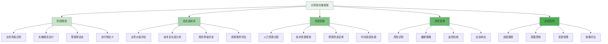
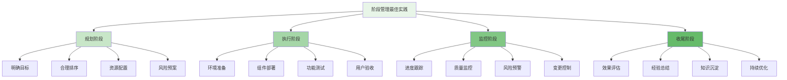

分阶段实施是企业级智能风控平台成功落地的关键策略。通过科学规划实施阶段，从核心交易场景开始，逐步扩展到全业务场景，能够有效降低项目风险，确保平台稳定运行，并最大化业务价值。

## 分阶段实施框架

分阶段实施需要建立清晰的框架体系，确保每个阶段都有明确的目标、可交付成果和成功标准。

### 实施框架设计



### 实施阶段划分

```yaml
# 分阶段实施阶段划分
implementation_phases:
  phase_1:
    name: "第一阶段：核心交易风控"
    description: "聚焦核心交易场景，建立基础风控能力"
    timeline: "3个月"
    business_scenarios:
      - "支付交易风控"
      - "账户安全保护"
      - "资金流转监控"
    key_components:
      - "实时数据采集"
      - "基础规则引擎"
      - "决策执行系统"
      - "监控告警平台"
    success_criteria:
      - "99.9%系统可用性"
      - "毫秒级响应时间"
      - "95%以上检测准确率"
      - "用户影响最小化"
  
  phase_2:
    name: "第二阶段：营销反作弊"
    description: "扩展营销活动场景，建立反作弊能力"
    timeline: "2个月"
    business_scenarios:
      - "优惠券防刷"
      - "邀请奖励保护"
      - "活动参与监控"
    key_components:
      - "特征平台"
      - "名单服务"
      - "行为分析引擎"
      - "营销效果评估"
    success_criteria:
      - "90%以上欺诈识别率"
      - "10%以下误报率"
      - "实时响应能力"
      - "业务增长保护"
  
  phase_3:
    name: "第三阶段：内容安全"
    description: "覆盖内容安全场景，建立内容风控能力"
    timeline: "4个月"
    business_scenarios:
      - "不良信息过滤"
      - "社区内容监管"
      - "用户生成内容审核"
    key_components:
      - "图计算引擎"
      - "内容识别模型"
      - "关系网络分析"
      - "内容质量评估"
    success_criteria:
      - "95%以上违规内容识别"
      - "良好用户体验"
      - "可扩展架构"
      - "合规性保障"
  
  phase_4:
    name: "第四阶段：全场景优化"
    description: "整合全场景能力，实现智能化风控"
    timeline: "3个月"
    business_scenarios:
      - "跨场景风险识别"
      - "智能策略优化"
      - "预测性风险防控"
    key_components:
      - "AI模型服务"
      - "实验平台"
      - "知识管理系统"
      - "智能决策引擎"
    success_criteria:
      - "端到端优化"
      - "自动化决策"
      - "预测分析能力"
      - "持续改进机制"
```

## 优先级排序方法

科学的优先级排序是分阶段实施成功的关键，需要综合考虑业务价值、技术复杂度和风险因素。

### 优先级评估模型

```python
class ImplementationPriorityEvaluator:
    def __init__(self):
        self.business_value_analyzer = BusinessValueAnalyzer()
        self.technical_complexity_assessor = TechnicalComplexityAssessor()
        self.risk_evaluator = RiskEvaluator()
        self.resource_planner = ResourcePlanner()
    
    def evaluate_implementation_priority(self, scenarios):
        """评估实施优先级"""
        # 1. 业务价值评估
        business_values = self.business_value_analyzer.analyze_scenarios(scenarios)
        
        # 2. 技术复杂度评估
        technical_complexities = self.technical_complexity_assessor.assess_scenarios(scenarios)
        
        # 3. 风险等级评估
        risk_levels = self.risk_evaluator.evaluate_scenarios(scenarios)
        
        # 4. 资源需求评估
        resource_requirements = self.resource_planner.estimate_requirements(scenarios)
        
        # 5. 综合优先级计算
        priorities = self.calculate_priorities(
            business_values,
            technical_complexities,
            risk_levels,
            resource_requirements
        )
        
        # 6. 优先级排序
        sorted_priorities = self.sort_by_priority(priorities)
        
        return sorted_priorities
    
    def calculate_priorities(self, business_values, technical_complexities, risk_levels, resource_requirements):
        """计算综合优先级"""
        priorities = []
        
        for scenario in business_values:
            # 业务价值权重 40%
            business_score = business_values[scenario] * 0.4
            
            # 技术复杂度权重 20% (复杂度越低，优先级越高)
            complexity_score = (1 - technical_complexities[scenario]) * 0.2
            
            # 风险等级权重 25% (风险越高，优先级越高)
            risk_score = risk_levels[scenario] * 0.25
            
            # 资源需求权重 15% (资源需求越少，优先级越高)
            resource_score = (1 - resource_requirements[scenario]) * 0.15
            
            # 综合得分
            total_score = business_score + complexity_score + risk_score + resource_score
            
            priorities.append({
                'scenario': scenario,
                'business_value': business_values[scenario],
                'technical_complexity': technical_complexities[scenario],
                'risk_level': risk_levels[scenario],
                'resource_requirement': resource_requirements[scenario],
                'priority_score': total_score
            })
        
        return priorities
    
    def analyze_business_value(self, scenarios):
        """分析业务价值"""
        values = {}
        
        for scenario in scenarios:
            value_score = 0
            
            # 资金损失风险权重 30%
            value_score += scenario.financial_risk * 0.3
            
            # 用户体验影响权重 25%
            value_score += scenario.user_impact * 0.25
            
            # 业务规模权重 20%
            value_score += scenario.business_scale * 0.2
            
            # 合规要求权重 15%
            value_score += scenario.compliance_requirement * 0.15
            
            # 市场竞争权重 10%
            value_score += scenario.competitive_advantage * 0.1
            
            values[scenario] = value_score
        
        return values
    
    def assess_technical_complexity(self, scenarios):
        """评估技术复杂度"""
        complexities = {}
        
        for scenario in scenarios:
            complexity_score = 0
            
            # 数据处理复杂度权重 25%
            complexity_score += scenario.data_complexity * 0.25
            
            # 算法复杂度权重 25%
            complexity_score += scenario.algorithm_complexity * 0.25
            
            # 系统集成复杂度权重 20%
            complexity_score += scenario.integration_complexity * 0.20
            
            # 实时性要求权重 15%
            complexity_score += scenario.real_time_requirement * 0.15
            
            # 可扩展性要求权重 15%
            complexity_score += scenario.scalability_requirement * 0.15
            
            complexities[scenario] = complexity_score
        
        return complexities
```

### 业务场景优先级排序

```go
type ScenarioPrioritySorter struct {
    BusinessValueEvaluator    *BusinessValueEvaluator
    ComplexityAssessor       *ComplexityAssessor
    RiskAnalyzer             *RiskAnalyzer
    ResourceEstimator        *ResourceEstimator
}

type BusinessScenario struct {
    ID                   string
    Name                 string
    Domain               string  // transaction, marketing, content, etc.
    BusinessValue        float64
    TechnicalComplexity  float64
    RiskLevel            float64
    ResourceRequirement  float64
    ImplementationTime   time.Duration
    Dependencies         []string
}

type PriorityScore struct {
    Scenario           *BusinessScenario
    BusinessValueScore float64
    ComplexityScore    float64
    RiskScore          float64
    ResourceScore      float64
    TotalScore         float64
    PriorityLevel      string  // high, medium, low
}

func (sps *ScenarioPrioritySorter) SortScenariosByPriority(scenarios []*BusinessScenario) []*PriorityScore {
    priorityScores := make([]*PriorityScore, 0)
    
    // 1. 计算每个场景的优先级得分
    for _, scenario := range scenarios {
        // 业务价值得分 (权重40%)
        businessValue := sps.BusinessValueEvaluator.Evaluate(scenario)
        businessScore := businessValue * 0.4
        
        // 技术复杂度得分 (权重20%，复杂度越低得分越高)
        complexity := sps.ComplexityAssessor.Assess(scenario)
        complexityScore := (1 - complexity) * 0.2
        
        // 风险等级得分 (权重25%，风险越高得分越高)
        risk := sps.RiskAnalyzer.Analyze(scenario)
        riskScore := risk * 0.25
        
        // 资源需求得分 (权重15%，资源需求越少得分越高)
        resource := sps.ResourceEstimator.Estimate(scenario)
        resourceScore := (1 - resource) * 0.15
        
        // 总得分
        totalScore := businessScore + complexityScore + riskScore + resourceScore
        
        priorityScore := &PriorityScore{
            Scenario:           scenario,
            BusinessValueScore: businessScore,
            ComplexityScore:    complexityScore,
            RiskScore:          riskScore,
            ResourceScore:      resourceScore,
            TotalScore:         totalScore,
        }
        
        priorityScores = append(priorityScores, priorityScore)
    }
    
    // 2. 按总得分排序
    sort.Slice(priorityScores, func(i, j int) bool {
        return priorityScores[i].TotalScore > priorityScores[j].TotalScore
    })
    
    // 3. 设置优先级等级
    sps.assignPriorityLevels(priorityScores)
    
    return priorityScores
}

func (sps *ScenarioPrioritySorter) assignPriorityLevels(scores []*PriorityScore) {
    if len(scores) == 0 {
        return
    }
    
    // 计算得分分布
    totalScore := 0.0
    for _, score := range scores {
        totalScore += score.TotalScore
    }
    averageScore := totalScore / float64(len(scores))
    
    // 分配优先级等级
    for _, score := range scores {
        if score.TotalScore >= averageScore*1.2 {
            score.PriorityLevel = "high"
        } else if score.TotalScore >= averageScore*0.8 {
            score.PriorityLevel = "medium"
        } else {
            score.PriorityLevel = "low"
        }
    }
}

func (sps *ScenarioPrioritySorter) createImplementationSequence(priorityScores []*PriorityScore) []*ImplementationSequence {
    sequences := make([]*ImplementationSequence, 0)
    
    // 按优先级分组
    highPriority := make([]*PriorityScore, 0)
    mediumPriority := make([]*PriorityScore, 0)
    lowPriority := make([]*PriorityScore, 0)
    
    for _, score := range priorityScores {
        switch score.PriorityLevel {
        case "high":
            highPriority = append(highPriority, score)
        case "medium":
            mediumPriority = append(mediumPriority, score)
        case "low":
            lowPriority = append(lowPriority, score)
        }
    }
    
    // 创建实施序列
    if len(highPriority) > 0 {
        sequences = append(sequences, &ImplementationSequence{
            Phase:     "Phase 1 - High Priority",
            Scenarios: sps.extractScenarios(highPriority),
            Timeline:  "3 months",
            Resources: sps.calculateRequiredResources(highPriority),
        })
    }
    
    if len(mediumPriority) > 0 {
        sequences = append(sequences, &ImplementationSequence{
            Phase:     "Phase 2 - Medium Priority",
            Scenarios: sps.extractScenarios(mediumPriority),
            Timeline:  "2 months",
            Resources: sps.calculateRequiredResources(mediumPriority),
        })
    }
    
    if len(lowPriority) > 0 {
        sequences = append(sequences, &ImplementationSequence{
            Phase:     "Phase 3 - Low Priority",
            Scenarios: sps.extractScenarios(lowPriority),
            Timeline:  "2 months",
            Resources: sps.calculateRequiredResources(lowPriority),
        })
    }
    
    return sequences
}
```

## 实施阶段管理

有效的阶段管理是确保分阶段实施成功的关键，需要建立完善的管理机制和控制流程。

### 阶段管理流程

```typescript
interface PhaseManagement {
    // 阶段规划
    planPhase(phase: ImplementationPhase): Promise<PhasePlan>;
    
    // 阶段执行
    executePhase(plan: PhasePlan): Promise<PhaseExecution>;
    
    // 阶段监控
    monitorPhase(execution: PhaseExecution): Promise<PhaseMonitoring>;
    
    // 阶段评估
    evaluatePhase(monitoring: PhaseMonitoring): Promise<PhaseEvaluation>;
}

class RiskControlPhaseManager implements PhaseManagement {
    private phasePlanner: PhasePlanner;
    private executionEngine: PhaseExecutionEngine;
    private monitoringSystem: PhaseMonitoringSystem;
    private evaluationEngine: PhaseEvaluationEngine;
    
    async planPhase(phase: ImplementationPhase): Promise<PhasePlan> {
        // 1. 详细需求分析
        const requirements = await this.analyzePhaseRequirements(phase);
        
        // 2. 技术方案设计
        const technicalDesign = await this.designTechnicalSolution(phase);
        
        // 3. 资源规划
        const resourcePlan = await this.planPhaseResources(phase);
        
        // 4. 风险评估
        const riskAssessment = await this.assessPhaseRisks(phase);
        
        // 5. 时间计划
        const timeline = await this.createPhaseTimeline(phase);
        
        // 6. 质量标准
        const qualityStandards = await this.defineQualityStandards(phase);
        
        return {
            phase: phase,
            requirements: requirements,
            technicalDesign: technicalDesign,
            resources: resourcePlan,
            risks: riskAssessment,
            timeline: timeline,
            qualityStandards: qualityStandards,
            approvalStatus: 'pending'
        };
    }
    
    async executePhase(plan: PhasePlan): Promise<PhaseExecution> {
        // 1. 环境准备
        const environment = await this.prepareExecutionEnvironment(plan);
        
        // 2. 组件部署
        const deployment = await this.deployPhaseComponents(plan, environment);
        
        // 3. 功能测试
        const testing = await this.testPhaseFunctionality(deployment);
        
        // 4. 用户验收
        const acceptance = await this.conductUserAcceptance(testing);
        
        // 5. 生产上线
        const production = await this.deployToProduction(acceptance);
        
        return {
            plan: plan,
            environment: environment,
            deployment: deployment,
            testing: testing,
            acceptance: acceptance,
            production: production,
            status: 'completed',
            completionTime: new Date()
        };
    }
    
    async monitorPhase(execution: PhaseExecution): Promise<PhaseMonitoring> {
        // 1. 启动监控
        const monitoring = await this.startPhaseMonitoring(execution);
        
        // 2. 性能监控
        const performance = await this.monitorPerformance(execution);
        
        // 3. 质量监控
        const quality = await this.monitorQuality(execution);
        
        // 4. 风险监控
        const risks = await this.monitorRisks(execution);
        
        // 5. 进度监控
        const progress = await this.monitorProgress(execution);
        
        return {
            execution: execution,
            monitoring: monitoring,
            performance: performance,
            quality: quality,
            risks: risks,
            progress: progress,
            status: 'monitoring'
        };
    }
    
    private async analyzePhaseRequirements(phase: ImplementationPhase): Promise<PhaseRequirements> {
        // 1. 业务需求分析
        const businessRequirements = await this.analyzeBusinessRequirements(phase.scenarios);
        
        // 2. 技术需求分析
        const technicalRequirements = await this.analyzeTechnicalRequirements(phase.components);
        
        // 3. 数据需求分析
        const dataRequirements = await this.analyzeDataRequirements(phase.scenarios);
        
        // 4. 集成需求分析
        const integrationRequirements = await this.analyzeIntegrationRequirements(phase.components);
        
        // 5. 安全需求分析
        const securityRequirements = await this.analyzeSecurityRequirements(phase.scenarios);
        
        return {
            business: businessRequirements,
            technical: technicalRequirements,
            data: dataRequirements,
            integration: integrationRequirements,
            security: securityRequirements,
            overall: this.synthesizeOverallRequirements(
                businessRequirements,
                technicalRequirements,
                dataRequirements,
                integrationRequirements,
                securityRequirements
            )
        };
    }
    
    private async designTechnicalSolution(phase: ImplementationPhase): Promise<TechnicalDesign> {
        // 1. 架构设计
        const architecture = await this.designPhaseArchitecture(phase.components);
        
        // 2. 数据流设计
        const dataFlow = await this.designDataFlow(phase.scenarios, phase.components);
        
        // 3. 接口设计
        const interfaces = await this.designInterfaces(phase.components);
        
        // 4. 部署设计
        const deployment = await this.designDeployment(phase.components);
        
        // 5. 监控设计
        const monitoring = await this.designMonitoring(phase.components);
        
        return {
            architecture: architecture,
            dataFlow: dataFlow,
            interfaces: interfaces,
            deployment: deployment,
            monitoring: monitoring,
            documentation: await this.generateTechnicalDocumentation(architecture, dataFlow, interfaces)
        };
    }
}
```

### 阶段控制机制

```javascript
class PhaseControlMechanism {
    constructor(config) {
        this.config = config;
        this.progressTracker = new ProgressTracker();
        this.qualityController = new QualityController();
        this.riskMonitor = new RiskMonitor();
        this.changeManager = new ChangeManager();
    }
    
    /**
     * 实施阶段控制机制
     * @param {Object} phase - 实施阶段
     * @returns {Promise<Object>} 控制机制
     */
    async implementPhaseControl(phase) {
        try {
            // 1. 建立进度跟踪机制
            const progressTracking = await this.setupProgressTracking(phase);
            
            // 2. 建立质量控制机制
            const qualityControl = await this.setupQualityControl(phase);
            
            // 3. 建立风险监控机制
            const riskMonitoring = await this.setupRiskMonitoring(phase);
            
            // 4. 建立变更管理机制
            const changeManagement = await this.setupChangeManagement(phase);
            
            // 5. 建立沟通协调机制
            const communicationCoordination = await this.setupCommunicationMechanism(phase);
            
            return {
                phase: phase,
                progressTracking: progressTracking,
                qualityControl: qualityControl,
                riskMonitoring: riskMonitoring,
                changeManagement: changeManagement,
                communication: communicationCoordination,
                overallControl: this.createOverallControlFramework(
                    progressTracking,
                    qualityControl,
                    riskMonitoring,
                    changeManagement
                )
            };
        } catch (error) {
            console.error('Failed to implement phase control:', error);
            return { success: false, error: error.message };
        }
    }
    
    /**
     * 设置进度跟踪机制
     * @param {Object} phase - 实施阶段
     * @returns {Promise<Object>} 进度跟踪机制
     */
    async setupProgressTracking(phase) {
        // 1. 定义里程碑
        const milestones = this.definePhaseMilestones(phase);
        
        // 2. 设置关键路径
        const criticalPath = this.identifyCriticalPath(phase.tasks);
        
        // 3. 建立跟踪指标
        const trackingMetrics = this.defineTrackingMetrics(phase);
        
        // 4. 配置报告机制
        const reportingMechanism = await this.configureReportingMechanism(phase);
        
        // 5. 启动跟踪系统
        const trackingSystem = await this.startTrackingSystem(
            milestones,
            criticalPath,
            trackingMetrics
        );
        
        return {
            milestones: milestones,
            criticalPath: criticalPath,
            metrics: trackingMetrics,
            reporting: reportingMechanism,
            system: trackingSystem,
            tracker: this.progressTracker
        };
    }
    
    /**
     * 设置质量控制机制
     * @param {Object} phase - 实施阶段
     * @returns {Promise<Object>} 质量控制机制
     */
    async setupQualityControl(phase) {
        // 1. 定义质量标准
        const qualityStandards = this.defineQualityStandards(phase);
        
        // 2. 设置检查点
        const checkPoints = this.defineQualityCheckPoints(phase);
        
        // 3. 建立测试策略
        const testStrategy = await this.createTestStrategy(phase);
        
        // 4. 配置质量工具
        const qualityTools = await this.configureQualityTools(phase);
        
        // 5. 启动质量控制
        const qualityControl = await this.startQualityControl(
            qualityStandards,
            checkPoints,
            testStrategy,
            qualityTools
        );
        
        return {
            standards: qualityStandards,
            checkPoints: checkPoints,
            testStrategy: testStrategy,
            tools: qualityTools,
            controller: this.qualityController,
            system: qualityControl
        };
    }
    
    /**
     * 定义阶段里程碑
     * @param {Object} phase - 实施阶段
     * @returns {Array} 里程碑列表
     */
    definePhaseMilestones(phase) {
        const milestones = [];
        
        // 1. 启动里程碑
        milestones.push({
            id: `${phase.id}-start`,
            name: `${phase.name} 启动`,
            description: `正式启动 ${phase.name} 实施阶段`,
            date: phase.startDate,
            deliverables: ['项目启动会议', '实施计划确认'],
            successCriteria: ['计划批准', '资源到位']
        });
        
        // 2. 设计完成里程碑
        milestones.push({
            id: `${phase.id}-design`,
            name: `${phase.name} 设计完成`,
            description: `完成 ${phase.name} 技术设计`,
            date: this.calculateMilestoneDate(phase.startDate, 0.3),
            deliverables: ['技术设计方案', '架构文档', '接口规范'],
            successCriteria: ['设计评审通过', '文档完整']
        });
        
        // 3. 开发完成里程碑
        milestones.push({
            id: `${phase.id}-development`,
            name: `${phase.name} 开发完成`,
            description: `完成 ${phase.name} 核心功能开发`,
            date: this.calculateMilestoneDate(phase.startDate, 0.6),
            deliverables: ['核心功能代码', '单元测试报告', '集成测试环境'],
            successCriteria: ['代码质量达标', '测试通过率>95%']
        });
        
        // 4. 测试完成里程碑
        milestones.push({
            id: `${phase.id}-testing`,
            name: `${phase.name} 测试完成`,
            description: `完成 ${phase.name} 全面测试`,
            date: this.calculateMilestoneDate(phase.startDate, 0.8),
            deliverables: ['测试报告', '缺陷修复记录', '性能测试结果'],
            successCriteria: ['测试覆盖率>90%', '关键缺陷修复率100%']
        });
        
        // 5. 上线完成里程碑
        milestones.push({
            id: `${phase.id}-completion`,
            name: `${phase.name} 实施完成`,
            description: `完成 ${phase.name} 生产上线`,
            date: phase.endDate,
            deliverables: ['生产环境部署', '用户验收报告', '运维手册'],
            successCriteria: ['系统稳定运行', '用户验收通过']
        });
        
        return milestones;
    }
    
    /**
     * 定义质量标准
     * @param {Object} phase - 实施阶段
     * @returns {Object} 质量标准
     */
    defineQualityStandards(phase) {
        return {
            codeQuality: {
                standard: '代码规范符合度>95%',
                metrics: ['代码覆盖率', '静态分析通过率', '代码审查通过率'],
                tools: ['SonarQube', 'ESLint', 'Checkmarx']
            },
            performance: {
                standard: '系统响应时间<100ms',
                metrics: ['平均响应时间', '95%响应时间', '吞吐量'],
                tools: ['JMeter', 'LoadRunner', 'Prometheus']
            },
            security: {
                standard: '高危漏洞修复率100%',
                metrics: ['漏洞扫描结果', '安全测试通过率', '渗透测试结果'],
                tools: ['OWASP ZAP', 'Nessus', 'Burp Suite']
            },
            reliability: {
                standard: '系统可用性>99.9%',
                metrics: ['系统正常运行时间', '故障恢复时间', '平均无故障时间'],
                tools: ['监控系统', '日志分析', 'APM工具']
            }
        };
    }
}
```

## 最佳实践与经验总结

在实施分阶段实施策略的过程中，需要遵循一系列最佳实践来确保实施效果。

### 实施最佳实践

1. **循序渐进**：从简单场景开始，逐步增加复杂度
2. **价值导向**：优先实施业务价值高的场景
3. **风险控制**：建立完善的风险识别和应对机制
4. **用户参与**：让最终用户深度参与实施过程
5. **持续改进**：建立反馈机制，持续优化实施效果

### 阶段管理最佳实践



### 成功要素总结

1. **领导支持**：获得高层管理者的支持和承诺
2. **团队协作**：建立跨部门协作机制
3. **工具支撑**：建设完善的实施管理工具
4. **知识管理**：建立实施经验和教训的知识库
5. **文化建设**：培养持续改进的团队文化

通过科学的分阶段实施策略，企业能够有效降低风控平台实施风险，确保项目成功落地，并最大化业务价值。这种渐进式的实施方法不仅能够快速见到成效，还能够为后续阶段的实施积累宝贵经验，为平台的长期发展奠定坚实基础。