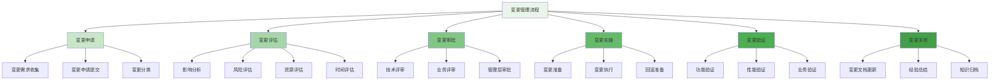
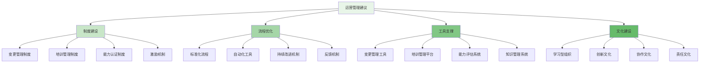

在企业级智能风控平台的实施过程中，变更管理与培训是确保平台成功落地和持续优化的关键环节。通过建立完善的变更管理机制和系统性的培训体系，企业能够有效赋能策略工程师、数据分析师和运营人员，提升团队整体的专业能力，确保风控平台的长期稳定运行和持续价值创造。

## 变更管理体系设计

变更管理是确保风控平台稳定运行和持续优化的重要机制，需要建立科学的管理流程和规范。

### 变更管理流程



### 变更分类与管理

```yaml
# 变更分类与管理规范
change_management_categories:
  emergency_changes:
    name: "紧急变更"
    description: "需要立即实施以解决严重问题或安全漏洞的变更"
    approval_level: "高级管理层"
    implementation_time: "2小时内"
    rollback_plan: "必须提供"
    documentation: "事后补充完整文档"
    examples:
      - "安全漏洞修复"
      - "严重性能问题修复"
      - "系统崩溃修复"
  
  standard_changes:
    name: "标准变更"
    description: "预定义的、风险较低的常规变更"
    approval_level: "技术负责人"
    implementation_time: "1-3个工作日"
    rollback_plan: "必须提供"
    documentation: "完整文档"
    examples:
      - "规则更新"
      - "策略调整"
      - "配置变更"
      - "名单更新"
  
  normal_changes:
    name: "普通变更"
    description: "常规的、需要评估的变更"
    approval_level: "变更委员会"
    implementation_time: "3-7个工作日"
    rollback_plan: "必须提供"
    documentation: "完整文档"
    examples:
      - "功能增强"
      - "性能优化"
      - "模型更新"
      - "架构调整"
  
  major_changes:
    name: "重大变更"
    description: "对系统架构或业务流程有重大影响的变更"
    approval_level: "高级管理层+技术委员会"
    implementation_time: "1-4周"
    rollback_plan: "必须提供详细方案"
    documentation: "详细设计文档+测试报告"
    examples:
      - "核心架构重构"
      - "重大功能上线"
      - "技术栈升级"
      - "数据迁移"
```

### 变更管理工具

```python
class ChangeManagementSystem:
    def __init__(self, config):
        self.config = config
        self.change_repository = ChangeRepository()
        self.notification_service = NotificationService()
        self.workflow_engine = WorkflowEngine()
        self.approval_engine = ApprovalEngine()
    
    def submit_change_request(self, change_request):
        """提交变更请求"""
        # 1. 验证变更请求
        validation_result = self.validate_change_request(change_request)
        if not validation_result.valid:
            raise ValidationError(validation_result.errors)
        
        # 2. 生成变更ID
        change_id = self.generate_change_id()
        
        # 3. 创建变更记录
        change_record = ChangeRecord(
            change_id=change_id,
            requestor=change_request.requestor,
            title=change_request.title,
            description=change_request.description,
            category=change_request.category,
            priority=change_request.priority,
            impact=change_request.impact,
            urgency=change_request.urgency,
            status='submitted',
            created_at=datetime.now(),
            updated_at=datetime.now()
        )
        
        # 4. 保存变更记录
        self.change_repository.save(change_record)
        
        # 5. 启动审批流程
        workflow = self.workflow_engine.start_workflow(
            workflow_type='change_approval',
            context={'change_id': change_id}
        )
        
        # 6. 发送通知
        self.notification_service.send_notification(
            recipients=self.get_approvers(change_request.category),
            message=f"新的变更请求已提交: {change_request.title}",
            data={'change_id': change_id, 'change_title': change_request.title}
        )
        
        return change_id
    
    def evaluate_change_impact(self, change_id):
        """评估变更影响"""
        # 1. 获取变更记录
        change_record = self.change_repository.get(change_id)
        
        # 2. 分析影响范围
        impact_analysis = self.analyze_impact(
            change_record.description,
            change_record.category
        )
        
        # 3. 评估风险等级
        risk_level = self.assess_risk_level(
            change_record.impact,
            change_record.urgency,
            impact_analysis
        )
        
        # 4. 估算资源需求
        resource_estimate = self.estimate_resources(
            change_record.category,
            impact_analysis
        )
        
        # 5. 制定实施计划
        implementation_plan = self.create_implementation_plan(
            change_record,
            impact_analysis,
            resource_estimate
        )
        
        # 6. 更新变更记录
        change_record.impact_analysis = impact_analysis
        change_record.risk_level = risk_level
        change_record.resource_estimate = resource_estimate
        change_record.implementation_plan = implementation_plan
        change_record.status = 'evaluated'
        change_record.updated_at = datetime.now()
        
        self.change_repository.update(change_record)
        
        return {
            'impact_analysis': impact_analysis,
            'risk_level': risk_level,
            'resource_estimate': resource_estimate,
            'implementation_plan': implementation_plan
        }
    
    def approve_change(self, change_id, approver, decision, comments=None):
        """审批变更"""
        # 1. 获取变更记录
        change_record = self.change_repository.get(change_id)
        
        # 2. 记录审批意见
        approval_record = ApprovalRecord(
            change_id=change_id,
            approver=approver,
            decision=decision,
            comments=comments,
            timestamp=datetime.now()
        )
        
        # 3. 更新审批状态
        self.approval_engine.record_approval(approval_record)
        
        # 4. 检查是否所有审批完成
        if self.approval_engine.is_approval_complete(change_id):
            if decision == 'approved':
                change_record.status = 'approved'
                # 启动实施流程
                self.workflow_engine.start_workflow(
                    workflow_type='change_implementation',
                    context={'change_id': change_id}
                )
            else:
                change_record.status = 'rejected'
            
            change_record.updated_at = datetime.now()
            self.change_repository.update(change_record)
        
        # 5. 发送通知
        self.notification_service.send_notification(
            recipients=[change_record.requestor],
            message=f"变更请求审批状态更新: {decision}",
            data={'change_id': change_id, 'decision': decision, 'comments': comments}
        )
        
        return approval_record

class ChangeImpactAnalyzer:
    def __init__(self):
        self.system_architecture = SystemArchitecture()
        self.dependency_mapper = DependencyMapper()
        self.business_process_analyzer = BusinessProcessAnalyzer()
    
    def analyze_impact(self, change_description, change_category):
        """分析变更影响"""
        # 1. 识别变更涉及的系统组件
        affected_components = self.identify_affected_components(
            change_description,
            change_category
        )
        
        # 2. 分析组件依赖关系
        dependencies = self.dependency_mapper.analyze_dependencies(affected_components)
        
        # 3. 评估对业务流程的影响
        business_impact = self.business_process_analyzer.assess_impact(
            affected_components,
            dependencies
        )
        
        # 4. 识别潜在风险点
        risk_points = self.identify_risk_points(
            affected_components,
            dependencies,
            business_impact
        )
        
        # 5. 估算影响范围
        impact_scope = self.estimate_impact_scope(
            affected_components,
            dependencies
        )
        
        return ChangeImpactAnalysis(
            affected_components=affected_components,
            dependencies=dependencies,
            business_impact=business_impact,
            risk_points=risk_points,
            impact_scope=impact_scope,
            analysis_timestamp=datetime.now()
        )
    
    def identify_affected_components(self, change_description, change_category):
        """识别受影响的系统组件"""
        # 使用自然语言处理分析变更描述
        keywords = self.extract_keywords(change_description)
        
        # 根据变更类别和关键词匹配系统组件
        potential_components = self.match_components(keywords, change_category)
        
        # 验证组件相关性
        confirmed_components = self.verify_component_relevance(
            potential_components,
            change_description
        )
        
        return confirmed_components
    
    def assess_risk_level(self, impact, urgency, impact_analysis):
        """评估风险等级"""
        # 风险矩阵计算
        risk_score = self.calculate_risk_score(impact, urgency)
        
        # 考虑影响分析结果
        adjusted_score = self.adjust_risk_score(risk_score, impact_analysis)
        
        # 确定风险等级
        if adjusted_score >= 90:
            return 'critical'
        elif adjusted_score >= 70:
            return 'high'
        elif adjusted_score >= 50:
            return 'medium'
        elif adjusted_score >= 30:
            return 'low'
        else:
            return 'minimal'
```

## 培训体系构建

系统性的培训体系是提升团队专业能力、确保风控平台有效使用的关键。

### 培训对象与内容

```go
type TrainingProgram struct {
    ProgramID      string           `json:"program_id"`
    ProgramName    string           `json:"program_name"`
    TargetAudience []string         `json:"target_audience"`  // 目标受众
    LearningPath   []LearningModule `json:"learning_path"`    // 学习路径
    Duration       string           `json:"duration"`         // 培训时长
    Prerequisites  []string         `json:"prerequisites"`    // 前置条件
    Certification  bool             `json:"certification"`    // 是否认证
    Resources      []TrainingResource `json:"resources"`      // 培训资源
}

type LearningModule struct {
    ModuleID       string           `json:"module_id"`
    ModuleName     string           `json:"module_name"`
    Description    string           `json:"description"`
    Content        []LearningTopic  `json:"content"`          // 学习内容
    Duration       string           `json:"duration"`         // 模块时长
    Assessment     Assessment       `json:"assessment"`       // 考核方式
    Prerequisites  []string         `json:"prerequisites"`    // 前置模块
}

type LearningTopic struct {
    TopicID        string           `json:"topic_id"`
    TopicName      string           `json:"topic_name"`
    Description    string           `json:"description"`
    Content        string           `json:"content"`          // 具体内容
    Examples       []string         `json:"examples"`         // 实例
    Exercises      []Exercise       `json:"exercises"`        // 练习
    Resources      []LearningResource `json:"resources"`      // 学习资源
}

type TrainingResource struct {
    ResourceType   string           `json:"resource_type"`    // 资源类型
    ResourceName   string           `json:"resource_name"`
    ResourceURL    string           `json:"resource_url"`
    Description    string           `json:"description"`
}

type Assessment struct {
    Type           string           `json:"type"`             // 考核类型
    PassScore      float64          `json:"pass_score"`       // 通过分数
    Questions      []Question       `json:"questions"`        // 考题
    TimeLimit      string           `json:"time_limit"`       // 时间限制
}

func CreateRiskControlTrainingProgram() *TrainingProgram {
    return &TrainingProgram{
        ProgramID:   "rc-training-001",
        ProgramName: "企业级智能风控平台培训课程",
        TargetAudience: []string{
            "策略工程师",
            "数据分析师",
            "运营人员",
            "安全工程师",
            "产品经理",
        },
        Duration: "40小时",
        Certification: true,
        LearningPath: []LearningModule{
            {
                ModuleID: "rc-mod-001",
                ModuleName: "风控平台基础概念",
                Duration: "4小时",
                Content: []LearningTopic{
                    {
                        TopicID: "rc-topic-001",
                        TopicName: "风控平台概述",
                        Description: "介绍风控平台的核心价值和应用场景",
                        Content: `
                        1. 风控平台的定义和作用
                        2. 风控平台在企业中的战略地位
                        3. 风控平台的核心组件和架构
                        4. 风控平台与业务系统的关系
                        `,
                        Examples: []string{
                            "电商平台反欺诈案例",
                            "金融行业信用风险控制",
                            "社交平台内容安全防护",
                        },
                    },
                    {
                        TopicID: "rc-topic-002",
                        TopicName: "风控核心理论",
                        Description: "风控领域的基础理论和方法论",
                        Content: `
                        1. 风险识别与评估方法
                        2. 规则引擎与机器学习模型
                        3. 数据驱动的风控策略
                        4. 风控指标体系设计
                        `,
                    },
                },
                Assessment: Assessment{
                    Type: "在线测试",
                    PassScore: 80.0,
                    TimeLimit: "60分钟",
                },
            },
            {
                ModuleID: "rc-mod-002",
                ModuleName: "策略工程师专项培训",
                Duration: "12小时",
                Prerequisites: []string{"rc-mod-001"},
                Content: []LearningTopic{
                    {
                        TopicID: "rc-topic-003",
                        TopicName: "规则引擎使用",
                        Description: "掌握规则引擎的配置和使用方法",
                        Content: `
                        1. 规则语法和表达式
                        2. 规则集设计和管理
                        3. 规则优先级和冲突处理
                        4. 规则性能优化
                        `,
                        Exercises: []Exercise{
                            {
                                ExerciseID: "ex-001",
                                Title: "设计用户注册风控规则",
                                Description: "为用户注册场景设计一套完整的风控规则",
                                Steps: []string{
                                    "分析注册场景的风险点",
                                    "设计基础规则",
                                    "配置规则优先级",
                                    "测试规则效果",
                                },
                            },
                        },
                    },
                    {
                        TopicID: "rc-topic-004",
                        TopicName: "策略优化方法",
                        Description: "学习策略优化的理论和实践方法",
                        Content: `
                        1. 策略效果评估指标
                        2. A/B测试设计和实施
                        3. 策略迭代优化流程
                        4. 策略版本管理
                        `,
                    },
                },
                Assessment: Assessment{
                    Type: "实战项目",
                    PassScore: 85.0,
                    TimeLimit: "4小时",
                },
            },
            {
                ModuleID: "rc-mod-003",
                ModuleName: "数据分析师专项培训",
                Duration: "10小时",
                Prerequisites: []string{"rc-mod-001"},
                Content: []LearningTopic{
                    {
                        TopicID: "rc-topic-005",
                        TopicName: "风控数据分析",
                        Description: "掌握风控数据分析的方法和工具",
                        Content: `
                        1. 风控数据特征分析
                        2. 风险模式识别
                        3. 数据可视化技术
                        4. 异常检测方法
                        `,
                    },
                    {
                        TopicID: "rc-topic-006",
                        TopicName: "模型评估与监控",
                        Description: "学习机器学习模型的评估和监控方法",
                        Content: `
                        1. 模型性能评估指标
                        2. 概念漂移检测
                        3. 模型效果监控
                        4. 模型迭代优化
                        `,
                    },
                },
                Assessment: Assessment{
                    Type: "案例分析报告",
                    PassScore: 80.0,
                    TimeLimit: "3小时",
                },
            },
            {
                ModuleID: "rc-mod-004",
                ModuleName: "运营人员专项培训",
                Duration: "8小时",
                Prerequisites: []string{"rc-mod-001"},
                Content: []LearningTopic{
                    {
                        TopicID: "rc-topic-007",
                        TopicName: "案件处理流程",
                        Description: "掌握案件处理的标准流程和方法",
                        Content: `
                        1. 案件接收和分类
                        2. 案件调查和分析
                        3. 案件处理和反馈
                        4. 案例总结和知识沉淀
                        `,
                    },
                    {
                        TopicID: "rc-topic-008",
                        TopicName: "运营分析和报告",
                        Description: "学习运营分析和报告制作方法",
                        Content: `
                        1. 运营指标监控
                        2. 运营效果分析
                        3. 运营报告制作
                        4. 运营优化建议
                        `,
                    },
                },
                Assessment: Assessment{
                    Type: "操作演练",
                    PassScore: 90.0,
                    TimeLimit: "2小时",
                },
            },
            {
                ModuleID: "rc-mod-005",
                ModuleName: "平台高级功能",
                Duration: "6小时",
                Prerequisites: []string{"rc-mod-002", "rc-mod-003", "rc-mod-004"},
                Content: []LearningTopic{
                    {
                        TopicID: "rc-topic-009",
                        TopicName: "实验平台使用",
                        Description: "掌握A/B测试和灰度发布的使用方法",
                        Content: `
                        1. 实验设计原则
                        2. 实验配置和管理
                        3. 实验效果分析
                        4. 实验结果应用
                        `,
                    },
                    {
                        TopicID: "rc-topic-010",
                        TopicName: "知识库应用",
                        Description: "学习知识库的使用和维护方法",
                        Content: `
                        1. 知识库结构和内容
                        2. 知识检索和应用
                        3. 知识更新和维护
                        4. 知识分享和传承
                        `,
                    },
                },
                Assessment: Assessment{
                    Type: "综合考试",
                    PassScore: 85.0,
                    TimeLimit: "2小时",
                },
            },
        },
        Resources: []TrainingResource{
            {
                ResourceType: "文档",
                ResourceName: "风控平台用户手册",
                ResourceURL: "/docs/risk-control-user-guide.pdf",
                Description: "详细的平台使用说明文档",
            },
            {
                ResourceType: "视频",
                ResourceName: "风控平台操作视频教程",
                ResourceURL: "/videos/risk-control-tutorials/",
                Description: "平台操作的视频教程系列",
            },
            {
                ResourceType: "案例",
                ResourceName: "典型风控案例集",
                ResourceURL: "/cases/risk-control-cases/",
                Description: "实际业务场景中的风控案例",
            },
        },
    }
}
```

### 培训实施与管理

```typescript
interface TrainingManagementSystem {
    // 培训计划管理
    createTrainingPlan(plan: TrainingPlan): Promise<TrainingPlan>;
    
    // 培训执行管理
    executeTraining(session: TrainingSession): Promise<TrainingResult>;
    
    // 培训效果评估
    evaluateTrainingEffectiveness(participants: TrainingParticipant[]): Promise<TrainingEffectiveness>;
    
    // 培训资源管理
    manageTrainingResources(resources: TrainingResource[]): Promise<void>;
}

class RiskControlTrainingManager implements TrainingManagementSystem {
    private trainingRepository: TrainingRepository;
    private notificationService: NotificationService;
    private assessmentEngine: AssessmentEngine;
    private resourceManager: ResourceManager;
    
    async createTrainingPlan(plan: TrainingPlan): Promise<TrainingPlan> {
        // 1. 验证培训计划
        const validation = await this.validateTrainingPlan(plan);
        if (!validation.isValid) {
            throw new ValidationError(validation.errors);
        }
        
        // 2. 生成培训计划ID
        const planId = this.generatePlanId();
        
        // 3. 创建培训计划记录
        const trainingPlan = new TrainingPlan({
            planId: planId,
            programId: plan.programId,
            planName: plan.planName,
            targetAudience: plan.targetAudience,
            schedule: plan.schedule,
            trainers: plan.trainers,
            location: plan.location,
            materials: plan.materials,
            status: 'planned',
            createdAt: new Date(),
            updatedAt: new Date()
        });
        
        // 4. 保存培训计划
        await this.trainingRepository.savePlan(trainingPlan);
        
        // 5. 发送通知
        await this.notificationService.sendBulkNotification(
            plan.targetAudience,
            `新的培训计划已发布: ${plan.planName}`,
            {
                planId: planId,
                planName: plan.planName,
                schedule: plan.schedule
            }
        );
        
        return trainingPlan;
    }
    
    async executeTraining(session: TrainingSession): Promise<TrainingResult> {
        // 1. 准备培训环境
        await this.prepareTrainingEnvironment(session);
        
        // 2. 签到管理
        const attendance = await this.manageAttendance(session);
        
        // 3. 执行培训内容
        const trainingProgress = await this.deliverTrainingContent(session);
        
        // 4. 实时互动
        await this.facilitateInteraction(session);
        
        // 5. 考核评估
        const assessments = await this.conductAssessments(session);
        
        // 6. 生成培训结果
        const trainingResult = new TrainingResult({
            sessionId: session.sessionId,
            planId: session.planId,
            participants: attendance,
            contentDelivery: trainingProgress,
            assessments: assessments,
            feedback: await this.collectFeedback(session),
            completionRate: this.calculateCompletionRate(attendance, session.participants),
            averageScore: this.calculateAverageScore(assessments),
            status: 'completed',
            completedAt: new Date()
        });
        
        // 7. 保存培训结果
        await this.trainingRepository.saveResult(trainingResult);
        
        // 8. 更新参与者档案
        await this.updateParticipantProfiles(trainingResult);
        
        return trainingResult;
    }
    
    async evaluateTrainingEffectiveness(participants: TrainingParticipant[]): Promise<TrainingEffectiveness> {
        // 1. 收集培训后数据
        const postTrainingData = await this.collectPostTrainingData(participants);
        
        // 2. 对比培训前后表现
        const performanceComparison = await this.comparePrePostPerformance(participants);
        
        // 3. 分析知识掌握情况
        const knowledgeAssessment = await this.assessKnowledgeRetention(participants);
        
        // 4. 评估行为改变
        const behaviorChange = await this.evaluateBehavioralChange(participants);
        
        // 5. 计算投资回报率
        const roiAnalysis = await this.analyzeROI(participants);
        
        // 6. 生成效果评估报告
        const effectiveness = new TrainingEffectiveness({
            participants: participants.length,
            completionRate: this.calculateOverallCompletionRate(participants),
            knowledgeGain: knowledgeAssessment.averageImprovement,
            skillApplication: behaviorChange.applicationRate,
            businessImpact: roiAnalysis.businessValue,
            participantSatisfaction: postTrainingData.satisfactionScore,
            trainerEvaluation: postTrainingData.trainerRating,
            recommendations: this.generateImprovementRecommendations(
                performanceComparison,
                knowledgeAssessment,
                behaviorChange
            )
        });
        
        // 7. 存档评估结果
        await this.trainingRepository.saveEffectiveness(effectiveness);
        
        return effectiveness;
    }
    
    private async validateTrainingPlan(plan: TrainingPlan): Promise<ValidationResult> {
        const errors: string[] = [];
        
        // 验证必填字段
        if (!plan.programId) errors.push("培训项目ID不能为空");
        if (!plan.planName) errors.push("培训计划名称不能为空");
        if (!plan.targetAudience || plan.targetAudience.length === 0) errors.push("目标受众不能为空");
        if (!plan.schedule) errors.push("培训时间安排不能为空");
        
        // 验证时间安排
        if (plan.schedule.startDate > plan.schedule.endDate) {
            errors.push("培训开始时间不能晚于结束时间");
        }
        
        // 验证资源可用性
        const resourceAvailability = await this.checkResourceAvailability(plan);
        if (!resourceAvailability.available) {
            errors.push(`资源不可用: ${resourceAvailability.unavailableResources.join(', ')}`);
        }
        
        return {
            isValid: errors.length === 0,
            errors: errors
        };
    }
    
    private async collectPostTrainingData(participants: TrainingParticipant[]): Promise<any> {
        const data = {
            satisfactionScore: 0,
            trainerRating: 0,
            applicationRate: 0,
            feedback: [] as string[]
        };
        
        // 收集满意度调查
        const satisfactionSurveys = await this.trainingRepository.getSurveys(
            participants.map(p => p.participantId),
            'satisfaction'
        );
        data.satisfactionScore = this.calculateAverageRating(satisfactionSurveys);
        
        // 收集培训师评价
        const trainerEvaluations = await this.trainingRepository.getSurveys(
            participants.map(p => p.participantId),
            'trainer'
        );
        data.trainerRating = this.calculateAverageRating(trainerEvaluations);
        
        // 收集应用情况反馈
        const applicationFeedback = await this.trainingRepository.getFeedback(
            participants.map(p => p.participantId),
            'application'
        );
        data.applicationRate = this.calculateApplicationRate(applicationFeedback);
        
        // 收集建议和意见
        const suggestions = await this.trainingRepository.getFeedback(
            participants.map(p => p.participantId),
            'suggestions'
        );
        data.feedback = suggestions.map(f => f.content);
        
        return data;
    }
}
```

## 能力评估与认证

建立科学的能力评估和认证体系，确保团队成员具备相应的专业能力。

### 能力模型设计

```yaml
# 风控团队能力模型
risk_control_competency_model:
  strategy_engineer:
    name: "策略工程师"
    description: "负责风控策略设计、实施和优化的专业人员"
    competency_areas:
      - domain_knowledge:
          name: "领域知识"
          description: "对风控业务和相关技术的深入理解"
          levels:
            beginner:
              description: "了解基本的风控概念和流程"
              indicators:
                - "能够解释风控的基本原理"
                - "了解常见的风险类型"
                - "熟悉基本的风控工具"
            intermediate:
              description: "掌握风控领域的核心知识和技能"
              indicators:
                - "能够设计基础的风控策略"
                - "理解规则引擎和机器学习模型"
                - "能够分析风控效果数据"
            advanced:
              description: "具备深入的风控专业知识和实践经验"
              indicators:
                - "能够设计复杂的风控策略体系"
                - "具备模型优化和策略迭代能力"
                - "能够指导初级工程师工作"
            expert:
              description: "在风控策略领域具有权威性专业知识"
              indicators:
                - "能够制定企业级风控策略框架"
                - "具备创新性的风控解决方案设计能力"
                - "能够引领行业风控技术发展"
      
      - technical_skills:
          name: "技术技能"
          description: "实施风控策略所需的技术能力"
          levels:
            beginner:
              description: "掌握基本的技术工具和方法"
              indicators:
                - "能够使用规则引擎配置简单规则"
                - "了解基本的SQL查询"
                - "能够使用基本的数据分析工具"
            intermediate:
              description: "具备较强的技术实施能力"
              indicators:
                - "能够独立设计和实现风控策略"
                - "掌握复杂规则配置和优化"
                - "具备基础的数据分析和可视化能力"
            advanced:
              description: "具备高级技术架构和优化能力"
              indicators:
                - "能够设计高性能的风控策略系统"
                - "具备大规模数据处理能力"
                - "能够进行系统性能调优"
            expert:
              description: "具备引领技术发展方向的能力"
              indicators:
                - "能够设计企业级风控技术架构"
                - "具备技术创新和研发能力"
                - "能够解决复杂的技术难题"
      
      - analytical_ability:
          name: "分析能力"
          description: "数据分析和问题解决的能力"
          levels:
            beginner:
              description: "具备基础的数据分析能力"
              indicators:
                - "能够理解基本的统计概念"
                - "能够使用图表展示数据"
                - "能够识别明显的数据异常"
            intermediate:
              description: "具备较强的数据分析和洞察力"
              indicators:
                - "能够进行多维度数据分析"
                - "能够识别潜在的风险模式"
                - "能够提出数据驱动的改进建议"
            advanced:
              description: "具备深度数据分析和预测能力"
              indicators:
                - "能够构建预测模型"
                - "具备复杂问题的分析解决能力"
                - "能够指导团队进行数据分析"
            expert:
              description: "具备行业领先的数据分析能力"
              indicators:
                - "能够引领数据分析方法论创新"
                - "具备战略性的数据洞察力"
                - "能够推动数据驱动的业务变革"
  
  data_analyst:
    name: "数据分析师"
    description: "负责风控数据分析、模型评估和监控的专业人员"
    competency_areas:
      - data_analysis:
          name: "数据分析"
          description: "数据处理、分析和洞察的能力"
          levels:
            beginner:
              description: "掌握基本的数据分析方法"
              indicators:
                - "能够使用基本统计方法分析数据"
                - "能够制作基础的数据报表"
                - "能够识别数据质量问题"
            intermediate:
              description: "具备较强的数据分析和建模能力"
              indicators:
                - "能够进行复杂的数据分析"
                - "掌握常用的机器学习算法"
                - "能够构建预测模型"
            advanced:
              description: "具备高级数据分析和算法优化能力"
              indicators:
                - "能够设计创新的数据分析方法"
                - "具备大规模数据处理能力"
                - "能够优化算法性能"
            expert:
              description: "具备行业领先的数据分析能力"
              indicators:
                - "能够引领数据分析技术发展"
                - "具备战略性的数据洞察力"
                - "能够推动数据科学创新"
      
      - model_evaluation:
          name: "模型评估"
          description: "机器学习模型评估和监控的能力"
          levels:
            beginner:
              description: "了解基本的模型评估方法"
              indicators:
                - "能够计算基本的评估指标"
                - "了解常见的模型类型"
                - "能够识别模型过拟合问题"
            intermediate:
              description: "具备模型评估和优化能力"
              indicators:
                - "能够进行全面的模型性能评估"
                - "掌握模型监控方法"
                - "能够提出模型改进建议"
            advanced:
              description: "具备高级模型优化和创新能力"
              indicators:
                - "能够设计创新的模型评估方法"
                - "具备复杂模型的优化能力"
                - "能够解决模型性能瓶颈"
            expert:
              description: "具备引领模型技术发展的能力"
              indicators:
                - "能够制定企业级模型管理策略"
                - "具备模型技术创新能力"
                - "能够推动行业模型技术发展"
  
  operations_staff:
    name: "运营人员"
    description: "负责风控案件处理、运营分析和知识管理的专业人员"
    competency_areas:
      - case_handling:
          name: "案件处理"
          description: "风控案件调查、处理和反馈的能力"
          levels:
            beginner:
              description: "掌握基本的案件处理流程"
              indicators:
                - "能够按照标准流程处理简单案件"
                - "了解案件分类方法"
                - "能够记录案件处理结果"
            intermediate:
              description: "具备独立处理复杂案件的能力"
              indicators:
                - "能够分析复杂案件的风险因素"
                - "具备较强的调查分析能力"
                - "能够提出案件处理优化建议"
            advanced:
              description: "具备案件处理专家级能力"
              indicators:
                - "能够处理高风险复杂案件"
                - "具备案件模式识别能力"
                - "能够指导团队案件处理工作"
            expert:
              description: "具备案件处理体系设计能力"
              indicators:
                - "能够制定案件处理标准流程"
                - "具备案件处理体系优化能力"
                - "能够推动案件处理方法创新"
      
      - operational_analysis:
          name: "运营分析"
          description: "风控运营数据分析和报告的能力"
          levels:
            beginner:
              description: "掌握基本的运营分析方法"
              indicators:
                - "能够制作基础的运营报表"
                - "了解关键运营指标"
                - "能够识别明显的运营异常"
            intermediate:
              description: "具备较强的运营分析能力"
              indicators:
                - "能够进行多维度运营分析"
                - "掌握运营趋势预测方法"
                - "能够提出运营优化建议"
            advanced:
              description: "具备高级运营分析和决策支持能力"
              indicators:
                - "能够进行战略性的运营分析"
                - "具备复杂问题的分析解决能力"
                - "能够为管理层提供决策支持"
            expert:
              description: "具备运营体系优化能力"
              indicators:
                - "能够制定企业级运营策略"
                - "具备运营体系创新能力"
                - "能够推动运营模式变革"
```

## 最佳实践与经验总结

在实施变更管理与培训体系的过程中，需要遵循一系列最佳实践来确保体系的有效性和可持续性。

### 实施最佳实践

1. **循序渐进**：从简单场景开始，逐步完善管理体系
2. **全员参与**：确保所有相关人员都参与到变更管理和培训中
3. **持续改进**：定期评估和优化变更管理流程和培训内容
4. **数据驱动**：基于数据分析不断优化管理策略和培训效果
5. **文化建设**：培养积极拥抱变化和持续学习的团队文化

### 运营管理建议



通过建立完善的变更管理体系和系统性的培训体系，企业能够有效提升风控团队的专业能力，确保风控平台的稳定运行和持续优化，为企业的业务安全和可持续发展提供有力保障。