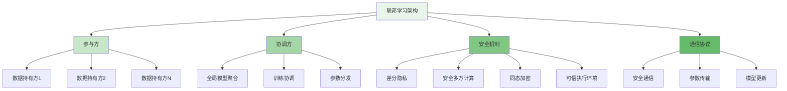
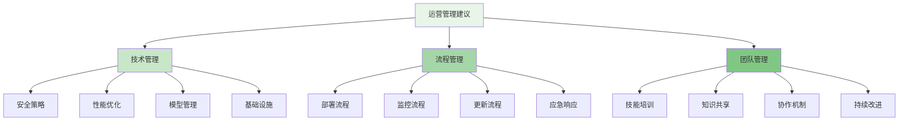

联邦学习作为一种新兴的分布式机器学习范式，在保护数据隐私的前提下实现多方协作建模，为风控平台提供了全新的技术路径。通过联邦学习，不同机构可以在不共享原始数据的情况下共同训练高质量的风控模型，既保护了数据隐私，又提升了模型效果，实现了隐私保护与模型性能的平衡。

## 联邦学习基础概念

联邦学习是一种分布式机器学习方法，允许多个参与方在不共享本地数据的情况下协同训练全局模型。

### 联邦学习架构



### 联邦学习类型

```yaml
# 联邦学习类型
federated_learning_types:
  horizontal_federated_learning:
    name: "横向联邦学习"
    description: "参与方拥有相似特征空间但样本空间不同的数据"
   适用场景:
      - "不同地区的同一业务"
      - "不同时间段的数据"
      - "不同用户群体的数据"
    技术特点:
      - "特征维度一致"
      - "样本ID不重叠"
      - "模型结构相同"
    风控应用:
      - "跨地区欺诈检测"
      - "跨时间段风险建模"
      - "跨用户群体行为分析"
  
  vertical_federated_learning:
    name: "纵向联邦学习"
    description: "参与方拥有相似样本空间但特征空间不同的数据"
    适用场景:
      - "不同机构的同一用户群体"
      - "不同业务线的用户数据"
      - "不同数据源的特征信息"
    技术特点:
      - "样本ID重叠"
      - "特征维度不同"
      - "需要隐私求交"
    风控应用:
      - "跨机构联合建模"
      - "多维度风险评估"
      - "综合信用评分"
  
  federated_transfer_learning:
    name: "联邦迁移学习"
    description: "参与方拥有不同特征空间和样本空间的数据"
    适用场景:
      - "完全不同业务领域的数据"
      - "跨行业风险建模"
      - "知识迁移和复用"
    技术特点:
      - "特征和样本都不重叠"
      - "需要知识迁移机制"
      - "模型结构可能不同"
    风控应用:
      - "跨行业风险模式识别"
      - "新兴业务风险建模"
      - "知识图谱构建"
```

## 联邦学习在风控中的应用

联邦学习在风控领域的应用能够有效解决数据孤岛问题，提升模型的泛化能力和准确性。

### 风控场景的联邦学习框架

```python
class RiskControlFederatedLearningFramework:
    def __init__(self, config):
        self.config = config
        self.participants = []
        self.coordinator = FederatedCoordinator()
        self.security_engine = SecurityEngine()
        self.communication_manager = CommunicationManager()
        self.model_repository = ModelRepository()
    
    def register_participant(self, participant_info):
        """注册参与方"""
        # 1. 验证参与方资质
        qualification_check = self.verify_participant_qualification(participant_info)
        if not qualification_check.is_qualified:
            raise UnqualifiedParticipantError("Participant does not meet qualification requirements")
        
        # 2. 建立安全连接
        secure_connection = self.security_engine.establish_secure_connection(participant_info)
        
        # 3. 注册参与方
        participant = FederatedParticipant(
            participant_id=participant_info.id,
            organization=participant_info.organization,
            data_characteristics=participant_info.data_characteristics,
            security_level=participant_info.security_level,
            connection=secure_connection
        )
        
        self.participants.append(participant)
        
        # 4. 初始化本地模型
        self.initialize_local_model(participant)
        
        return participant.participant_id
    
    def initialize_federated_training(self, training_config):
        """初始化联邦训练"""
        # 1. 验证训练配置
        config_validation = self.validate_training_config(training_config)
        if not config_validation.is_valid:
            raise InvalidTrainingConfigError(config_validation.errors)
        
        # 2. 确定联邦学习类型
        fl_type = self.determine_federated_type(training_config.data_characteristics)
        
        # 3. 初始化全局模型
        global_model = self.initialize_global_model(training_config.model_architecture, fl_type)
        
        # 4. 配置安全机制
        security_config = self.configure_security_mechanisms(training_config.security_requirements)
        
        # 5. 启动训练协调器
        self.coordinator.start_coordinator(
            global_model=global_model,
            participants=self.participants,
            security_config=security_config,
            training_config=training_config
        )
        
        return FederatedTrainingSession(
            session_id=self.generate_session_id(),
            global_model=global_model,
            participants=self.participants,
            fl_type=fl_type,
            status='initialized'
        )
    
    def execute_federated_round(self, session_id, round_config):
        """执行联邦训练轮次"""
        # 1. 获取训练会话
        session = self.get_training_session(session_id)
        
        # 2. 分发全局模型参数
        self.distribute_global_model(session.global_model, session.participants)
        
        # 3. 收集本地模型更新
        local_updates = self.collect_local_updates(session.participants, round_config)
        
        # 4. 安全聚合模型更新
        aggregated_update = self.security_engine.secure_aggregate(
            local_updates,
            session.security_config.aggregation_method
        )
        
        # 5. 更新全局模型
        session.global_model = self.update_global_model(
            session.global_model,
            aggregated_update,
            session.security_config
        )
        
        # 6. 评估模型性能
        performance_metrics = self.evaluate_global_model(session.global_model)
        
        # 7. 记录训练日志
        self.log_training_round(
            session_id=session_id,
            round_number=round_config.round_number,
            metrics=performance_metrics,
            updates=local_updates
        )
        
        return FederatedRoundResult(
            round_number=round_config.round_number,
            global_model=session.global_model,
            performance_metrics=performance_metrics,
            participant_contributions=self.calculate_participant_contributions(local_updates)
        )
    
    def distribute_global_model(self, global_model, participants):
        """分发全局模型"""
        for participant in participants:
            # 1. 加密模型参数
            encrypted_params = self.security_engine.encrypt_model_parameters(
                global_model.get_parameters(),
                participant.security_level
            )
            
            # 2. 安全传输
            self.communication_manager.secure_transmit(
                source=self.coordinator,
                destination=participant,
                data=encrypted_params,
                encryption_method=participant.security_level.encryption_method
            )
            
            # 3. 记录传输日志
            self.log_model_distribution(participant.participant_id, global_model.model_id)
    
    def collect_local_updates(self, participants, round_config):
        """收集本地模型更新"""
        local_updates = []
        
        for participant in participants:
            try:
                # 1. 接收本地更新
                local_update = self.communication_manager.receive_secure_data(
                    source=participant,
                    destination=self.coordinator,
                    timeout=round_config.communication_timeout
                )
                
                # 2. 验证更新完整性
                update_validation = self.security_engine.validate_model_update(local_update)
                if not update_validation.is_valid:
                    self.log_invalid_update(participant.participant_id, update_validation.errors)
                    continue
                
                # 3. 解密更新数据
                decrypted_update = self.security_engine.decrypt_model_update(
                    local_update,
                    participant.security_level
                )
                
                # 4. 记录有效更新
                local_updates.append(FederatedUpdate(
                    participant_id=participant.participant_id,
                    update_data=decrypted_update,
                    update_size=len(decrypted_update),
                    timestamp=datetime.now()
                ))
                
            except CommunicationError as e:
                self.log_communication_error(participant.participant_id, str(e))
                continue
        
        return local_updates

class HorizontalFederatedLearning:
    def __init__(self, framework):
        self.framework = framework
        self.model_aggregator = ModelAggregator()
    
    def train_horizontal_federated_model(self, training_config):
        """训练横向联邦模型"""
        # 1. 初始化训练会话
        session = self.framework.initialize_federated_training(training_config)
        
        # 2. 执行训练轮次
        for round_num in range(training_config.rounds):
            round_config = FederatedRoundConfig(
                round_number=round_num,
                local_epochs=training_config.local_epochs,
                batch_size=training_config.batch_size,
                learning_rate=training_config.learning_rate
            )
            
            # 执行一轮训练
            round_result = self.framework.execute_federated_round(session.session_id, round_config)
            
            # 评估轮次结果
            if self.should_early_stop(round_result.performance_metrics, training_config.early_stop_config):
                break
        
        # 3. 生成最终模型
        final_model = self.generate_final_model(session.global_model, training_config)
        
        # 4. 部署模型
        deployment_result = self.deploy_federated_model(final_model, training_config.deployment_config)
        
        return FederatedTrainingResult(
            session_id=session.session_id,
            final_model=final_model,
            training_history=self.get_training_history(session.session_id),
            deployment_result=deployment_result,
            performance_summary=self.summarize_performance(session.session_id)
        )
    
    def aggregate_model_updates(self, local_updates, aggregation_config):
        """聚合模型更新"""
        # 1. 权重计算
        participant_weights = self.calculate_participant_weights(local_updates, aggregation_config.weighting_strategy)
        
        # 2. 加权平均聚合
        if aggregation_config.method == 'fedavg':
            aggregated_update = self.model_aggregator.weighted_average(
                local_updates,
                participant_weights
            )
        
        # 3. 中位数聚合（对抗恶意参与方）
        elif aggregation_config.method == 'fedmedian':
            aggregated_update = self.model_aggregator.median_aggregation(local_updates)
        
        # 4. Krum聚合（检测和排除异常更新）
        elif aggregation_config.method == 'krum':
            aggregated_update = self.model_aggregator.krum_aggregation(
                local_updates,
                aggregation_config.krum_malicious_count
            )
        
        # 5. 应用差分隐私保护
        if aggregation_config.differential_privacy.enabled:
            aggregated_update = self.apply_differential_privacy(
                aggregated_update,
                aggregation_config.differential_privacy.epsilon
            )
        
        return aggregated_update

class VerticalFederatedLearning:
    def __init__(self, framework):
        self.framework = framework
        self.privacy_set_intersection = PrivacySetIntersection()
        self.secure_aggregation = SecureAggregation()
    
    def train_vertical_federated_model(self, training_config):
        """训练纵向联邦模型"""
        # 1. 隐私求交
        common_samples = self.privacy_set_intersection.find_common_samples(
            self.framework.participants,
            training_config.psi_config
        )
        
        # 2. 初始化垂直联邦训练
        session = self.initialize_vertical_training(training_config, common_samples)
        
        # 3. 执行垂直联邦训练
        for iteration in range(training_config.iterations):
            # 3.1 前向传播阶段
            intermediate_results = self.execute_forward_pass(session, iteration)
            
            # 3.2 后向传播阶段
            gradients = self.execute_backward_pass(session, intermediate_results)
            
            # 3.3 安全聚合梯度
            aggregated_gradients = self.secure_aggregate_gradients(gradients, session.security_config)
            
            # 3.4 更新模型参数
            self.update_model_parameters(session, aggregated_gradients)
            
            # 3.5 评估模型性能
            performance_metrics = self.evaluate_vertical_model(session.model)
            
            # 3.6 记录训练日志
            self.log_vertical_training_iteration(
                session_id=session.session_id,
                iteration=iteration,
                metrics=performance_metrics
            )
        
        # 4. 生成最终模型
        final_model = self.generate_vertical_final_model(session.model, training_config)
        
        return VerticalFederatedTrainingResult(
            session_id=session.session_id,
            final_model=final_model,
            common_samples=common_samples,
            training_history=self.get_vertical_training_history(session.session_id),
            performance_summary=self.summarize_vertical_performance(session.session_id)
        )
    
    def execute_forward_pass(self, session, iteration):
        """执行前向传播"""
        intermediate_results = {}
        
        # 1. 各参与方计算本地前向传播结果
        for participant in session.participants:
            local_features = self.get_local_features(participant, session.common_samples)
            
            # 计算中间结果
            intermediate_result = participant.model.forward_pass(
                local_features,
                session.model.get_parameters()
            )
            
            # 安全传输中间结果
            encrypted_result = self.framework.security_engine.encrypt_intermediate_result(
                intermediate_result,
                session.security_config
            )
            
            intermediate_results[participant.participant_id] = encrypted_result
        
        return intermediate_results
    
    def execute_backward_pass(self, session, intermediate_results):
        """执行后向传播"""
        gradients = {}
        
        # 1. 计算全局损失梯度
        global_gradients = self.compute_global_gradients(
            intermediate_results,
            session.labels,
            session.model
        )
        
        # 2. 各参与方计算本地梯度
        for participant in session.participants:
            local_features = self.get_local_features(participant, session.common_samples)
            
            # 计算本地梯度
            local_gradient = participant.model.compute_local_gradient(
                local_features,
                global_gradients,
                session.model.get_parameters()
            )
            
            # 加密梯度
            encrypted_gradient = self.framework.security_engine.encrypt_gradient(
                local_gradient,
                session.security_config
            )
            
            gradients[participant.participant_id] = encrypted_gradient
        
        return gradients
```

## 安全机制与隐私保护

联邦学习的安全机制是保护参与方数据隐私和模型安全的关键。

### 差分隐私保护

```go
type DifferentialPrivacyEngine struct {
    Epsilon           float64
    Delta             float64
    NoiseMechanism    NoiseMechanism
    Sensitivity       float64
    ClippingThreshold float64
}

type NoiseMechanism int

const (
    Laplace NoiseMechanism = iota
    Gaussian
    Exponential
)

type DPEngineResult struct {
    PrivateData       interface{} `json:"private_data"`
    NoiseAdded        float64     `json:"noise_added"`
    PrivacyBudget     float64     `json:"privacy_budget"`
    ConfidenceLevel   float64     `json:"confidence_level"`
}

func (dpe *DifferentialPrivacyEngine) AddNoise(data interface{}) *DPEngineResult {
    // 1. 计算敏感度
    sensitivity := dpe.calculateSensitivity(data)
    
    // 2. 裁剪数据以限制敏感度
    clippedData := dpe.clipData(data, dpe.ClippingThreshold)
    
    // 3. 生成噪声
    noise := dpe.generateNoise(sensitivity)
    
    // 4. 添加噪声到数据
    noisyData := dpe.addNoiseToData(clippedData, noise)
    
    // 5. 计算隐私预算消耗
    privacyBudget := dpe.calculatePrivacyBudget(sensitivity, noise)
    
    // 6. 评估置信水平
    confidence := dpe.estimateConfidence(noisyData, data)
    
    return &DPEngineResult{
        PrivateData:     noisyData,
        NoiseAdded:      noise,
        PrivacyBudget:   privacyBudget,
        ConfidenceLevel: confidence,
    }
}

func (dpe *DifferentialPrivacyEngine) calculateSensitivity(data interface{}) float64 {
    // 对于数值型数据，计算相邻数据集的最大差异
    switch v := data.(type) {
    case []float64:
        return dpe.calculateVectorSensitivity(v)
    case float64:
        return dpe.calculateScalarSensitivity(v)
    case [][]float64:
        return dpe.calculateMatrixSensitivity(v)
    default:
        return 1.0 // 默认敏感度
    }
}

func (dpe *DifferentialPrivacyEngine) generateNoise(sensitivity float64) float64 {
    switch dpe.NoiseMechanism {
    case Laplace:
        // 拉普拉斯噪声
        scale := sensitivity / dpe.Epsilon
        return dpe.generateLaplaceNoise(scale)
    case Gaussian:
        // 高斯噪声
        sigma := sensitivity * math.Sqrt(2*math.Log(1.25/dpe.Delta)) / dpe.Epsilon
        return dpe.generateGaussianNoise(sigma)
    default:
        // 默认使用拉普拉斯噪声
        scale := sensitivity / dpe.Epsilon
        return dpe.generateLaplaceNoise(scale)
    }
}

func (dpe *DifferentialPrivacyEngine) clipData(data interface{}, threshold float64) interface{} {
    // 裁剪数据以限制L2范数
    switch v := data.(type) {
    case []float64:
        return dpe.clipVector(v, threshold)
    case [][]float64:
        return dpe.clipMatrix(v, threshold)
    default:
        return data
    }
}

type RiskControlDifferentialPrivacy struct {
    DPConfig     *DifferentialPrivacyConfig
    PrivacyEngine *DifferentialPrivacyEngine
    BudgetManager *PrivacyBudgetManager
}

func (rcdp *RiskControlDifferentialPrivacy) ProtectModelGradients(gradients []float64) []float64 {
    // 1. 检查隐私预算
    if rcdp.BudgetManager.IsBudgetExhausted() {
        return gradients // 预算耗尽时返回原始梯度
    }
    
    // 2. 裁剪梯度以限制敏感度
    clippedGradients := rcdp.clipGradients(gradients, rcdp.DPConfig.ClippingThreshold)
    
    // 3. 添加差分隐私噪声
    noisyGradients := make([]float64, len(clippedGradients))
    for i, grad := range clippedGradients {
        // 计算每个梯度的敏感度
        sensitivity := rcdp.calculateGradientSensitivity(grad)
        
        // 生成噪声
        noise := rcdp.PrivacyEngine.generateNoise(sensitivity)
        
        // 添加噪声
        noisyGradients[i] = grad + noise
        
        // 消耗隐私预算
        budgetConsumed := rcdp.PrivacyEngine.calculatePrivacyBudget(sensitivity, noise)
        rcdp.BudgetManager.ConsumeBudget(budgetConsumed)
    }
    
    return noisyGradients
}

func (rcdp *RiskControlDifferentialPrivacy) ProtectModelOutputs(predictions []float64) []float64 {
    // 1. 对模型输出添加噪声保护
    protectedOutputs := make([]float64, len(predictions))
    
    for i, pred := range predictions {
        // 计算输出敏感度
        sensitivity := rcdp.calculateOutputSensitivity(pred)
        
        // 生成噪声
        noise := rcdp.PrivacyEngine.generateNoise(sensitivity)
        
        // 添加噪声
        protectedOutputs[i] = pred + noise
        
        // 消耗隐私预算
        budgetConsumed := rcdp.PrivacyEngine.calculatePrivacyBudget(sensitivity, noise)
        rcdp.BudgetManager.ConsumeBudget(budgetConsumed)
    }
    
    return protectedOutputs
}
```

### 安全多方计算

```typescript
interface SecureMultiPartyComputation {
    // 秘密共享
    secretSharing(data: any, participantCount: number): Promise<SharedSecrets>;
    
    // 安全聚合
    secureAggregation(shares: SharedSecrets[]): Promise<AggregatedResult>;
    
    // 安全比较
    secureComparison(share1: SharedSecret, share2: SharedSecret): Promise<ComparisonResult>;
    
    // 安全求交
    privateSetIntersection(set1: PrivateSet, set2: PrivateSet): Promise<IntersectionResult>;
}

class RiskControlSecureComputation implements SecureMultiPartyComputation {
    private cryptoEngine: CryptoEngine;
    private communicationManager: SecureCommunicationManager;
    
    async secretSharing(data: any, participantCount: number): Promise<SharedSecrets> {
        // 1. 生成随机份额
        const shares: SecretShare[] = [];
        let sum = 0;
        
        // 生成n-1个随机份额
        for (let i = 0; i < participantCount - 1; i++) {
            const randomShare = this.cryptoEngine.generateRandomNumber();
            shares.push(new SecretShare(i + 1, randomShare));
            sum += randomShare;
        }
        
        // 计算最后一个份额，使得所有份额之和等于原始数据
        const lastShare = data - sum;
        shares.push(new SecretShare(participantCount, lastShare));
        
        // 2. 分发份额
        const distributedShares = await this.distributeShares(shares);
        
        return new SharedSecrets(distributedShares, data.constructor.name);
    }
    
    async secureAggregation(shares: SharedSecrets[]): Promise<AggregatedResult> {
        // 1. 收集所有参与方的份额
        const allShares = await this.collectShares(shares);
        
        // 2. 逐位聚合份额
        const aggregatedShares: SecretShare[] = [];
        
        // 假设所有份额具有相同的索引
        for (let i = 0; i < allShares[0].length; i++) {
            let sum = 0;
            for (const participantShares of allShares) {
                sum += participantShares[i].value;
            }
            aggregatedShares.push(new SecretShare(i + 1, sum));
        }
        
        // 3. 重构聚合结果
        const aggregatedResult = this.reconstructSecret(aggregatedShares);
        
        return new AggregatedResult(aggregatedResult, shares.length);
    }
    
    async privateSetIntersection(set1: PrivateSet, set2: PrivateSet): Promise<IntersectionResult> {
        // 1. 使用布隆过滤器进行隐私求交
        const bloomFilter1 = await this.createBloomFilter(set1, set1.participantId);
        const bloomFilter2 = await this.createBloomFilter(set2, set2.participantId);
        
        // 2. 安全交换布隆过滤器
        const receivedFilter1 = await this.secureExchange(bloomFilter1, set2.participantId);
        const receivedFilter2 = await this.secureExchange(bloomFilter2, set1.participantId);
        
        // 3. 计算交集
        const intersection = await this.computeIntersection(
            set1,
            set2,
            receivedFilter1,
            receivedFilter2
        );
        
        // 4. 隐私保护交集结果
        const privateIntersection = await this.protectIntersectionResult(intersection);
        
        return new IntersectionResult(
            intersection: privateIntersection,
            size: intersection.length,
            participant1: set1.participantId,
            participant2: set2.participantId
        );
    }
    
    private async distributeShares(shares: SecretShare[]): Promise<DistributedShares> {
        const distributed: DistributedShares = {};
        
        // 将份额安全分发给各参与方
        for (const share of shares) {
            const encryptedShare = await this.cryptoEngine.encrypt(
                share,
                this.getParticipantPublicKey(share.participantId)
            );
            
            await this.communicationManager.sendSecureMessage(
                encryptedShare,
                share.participantId,
                'SECRET_SHARE'
            );
            
            distributed[share.participantId] = encryptedShare;
        }
        
        return distributed;
    }
    
    private async collectShares(shares: SharedSecrets[]): Promise<SecretShare[][]> {
        const allShares: SecretShare[][] = [];
        
        // 从各参与方收集份额
        for (const sharedSecret of shares) {
            const participantShares = await this.communicationManager.receiveSecureMessage(
                sharedSecret.participantId,
                'SECRET_SHARE'
            );
            
            const decryptedShares = await this.cryptoEngine.decrypt(
                participantShares,
                this.getParticipantPrivateKey(sharedSecret.participantId)
            );
            
            allShares.push(decryptedShares);
        }
        
        return allShares;
    }
    
    private reconstructSecret(shares: SecretShare[]): any {
        // 使用拉格朗日插值法重构秘密
        // 这里简化实现，实际应用中需要更复杂的数学计算
        let reconstructed = 0;
        for (const share of shares) {
            reconstructed += share.value;
        }
        
        return reconstructed;
    }
}

class FederatedSecurityManager {
    private dpEngine: RiskControlDifferentialPrivacy;
    private smcEngine: RiskControlSecureComputation;
    private teeManager: TrustedExecutionManager;
    
    async applyComprehensiveSecurity(modelUpdate: ModelUpdate, securityConfig: SecurityConfig): Promise<SecureModelUpdate> {
        let secureUpdate = modelUpdate;
        
        // 1. 应用差分隐私保护
        if (securityConfig.differentialPrivacy.enabled) {
            secureUpdate = await this.applyDifferentialPrivacy(secureUpdate, securityConfig.differentialPrivacy);
        }
        
        // 2. 应用安全多方计算
        if (securityConfig.secureComputation.enabled) {
            secureUpdate = await this.applySecureComputation(secureUpdate, securityConfig.secureComputation);
        }
        
        // 3. 应用可信执行环境
        if (securityConfig.trustedExecution.enabled) {
            secureUpdate = await this.applyTrustedExecution(secureUpdate, securityConfig.trustedExecution);
        }
        
        // 4. 添加完整性验证
        const integrityProof = await this.generateIntegrityProof(secureUpdate);
        
        return new SecureModelUpdate(
            updateData: secureUpdate,
            securityMetadata: SecurityMetadata{
                dpApplied: securityConfig.differentialPrivacy.enabled,
                smcApplied: securityConfig.secureComputation.enabled,
                teeApplied: securityConfig.trustedExecution.enabled,
                integrityProof: integrityProof,
            }
        );
    }
    
    private async applyDifferentialPrivacy(update: ModelUpdate, dpConfig: DifferentialPrivacyConfig): Promise<ModelUpdate> {
        // 对模型更新添加差分隐私保护
        const protectedGradients = this.dpEngine.ProtectModelGradients(update.gradients);
        const protectedParameters = this.dpEngine.ProtectModelOutputs(update.parameters);
        
        return new ModelUpdate(
            gradients: protectedGradients,
            parameters: protectedParameters,
            metadata: update.metadata
        );
    }
    
    private async applySecureComputation(update: ModelUpdate, smcConfig: SecureComputationConfig): Promise<ModelUpdate> {
        // 使用安全多方计算处理模型更新
        const sharedGradients = await this.smcEngine.secretSharing(update.gradients, smcConfig.participantCount);
        const sharedParameters = await this.smcEngine.secretSharing(update.parameters, smcConfig.participantCount);
        
        return new ModelUpdate(
            gradients: sharedGradients,
            parameters: sharedParameters,
            metadata: update.metadata
        );
    }
}
```

## 联邦学习在风控中的实践

联邦学习在风控领域的实践需要考虑业务特点和合规要求。

### 跨机构联合建模

```javascript
class CrossInstitutionFederatedLearning {
    constructor(config) {
        this.config = config;
        this.participants = new Map();
        this.modelCoordinator = new ModelCoordinator();
        this.privacyProtector = new PrivacyProtector();
        this.complianceChecker = new ComplianceChecker();
    }
    
    /**
     * 建立跨机构联邦学习网络
     * @param {Array} institutions - 参与机构列表
     * @returns {Promise<Object>} 网络建立结果
     */
    async establishFederatedNetwork(institutions) {
        // 1. 验证机构资质
        const qualifiedInstitutions = await this.verifyInstitutionQualifications(institutions);
        
        // 2. 建立安全连接
        const secureConnections = await this.establishSecureConnections(qualifiedInstitutions);
        
        // 3. 签署合作协议
        const agreements = await this.signCooperationAgreements(qualifiedInstitutions);
        
        // 4. 初始化联邦网络
        const network = await this.initializeFederatedNetwork(qualifiedInstitutions, agreements);
        
        // 5. 合规性检查
        const complianceResult = await this.complianceChecker.checkNetworkCompliance(network);
        
        return {
            network: network,
            connections: secureConnections,
            agreements: agreements,
            compliance: complianceResult
        };
    }
    
    /**
     * 执行跨机构联合建模
     * @param {Object} trainingConfig - 训练配置
     * @returns {Promise<Object>} 训练结果
     */
    async executeCrossInstitutionModeling(trainingConfig) {
        // 1. 数据特征分析
        const dataCharacteristics = await this.analyzeDataCharacteristics();
        
        // 2. 确定联邦学习类型
        const flType = this.determineFederatedLearningType(dataCharacteristics);
        
        // 3. 初始化训练会话
        const session = await this.initializeTrainingSession(trainingConfig, flType);
        
        // 4. 执行联邦训练
        const trainingResults = [];
        for (let round = 0; round < trainingConfig.rounds; round++) {
            // 执行一轮训练
            const roundResult = await this.executeTrainingRound(session, round, trainingConfig);
            trainingResults.push(roundResult);
            
            // 检查早停条件
            if (this.shouldEarlyStop(roundResult, trainingConfig.earlyStop)) {
                break;
            }
        }
        
        // 5. 模型评估与验证
        const finalModel = await this.evaluateFinalModel(session.globalModel, trainingConfig);
        
        // 6. 合规性审计
        const auditResult = await this.auditModelCompliance(finalModel, trainingConfig);
        
        // 7. 模型部署
        const deploymentResult = await this.deployModel(finalModel, trainingConfig.deployment);
        
        return {
            session: session,
            trainingResults: trainingResults,
            finalModel: finalModel,
            auditResult: auditResult,
            deploymentResult: deploymentResult
        };
    }
    
    /**
     * 分析数据特征
     * @returns {Promise<Object>} 数据特征分析结果
     */
    async analyzeDataCharacteristics() {
        const characteristics = {
            institutions: [],
            dataOverlap: 0,
            featureDistribution: {},
            privacyRequirements: {}
        };
        
        // 收集各机构数据特征（不暴露具体数据）
        for (const [institutionId, participant] of this.participants) {
            const institutionCharacteristics = await participant.analyzeLocalDataCharacteristics();
            characteristics.institutions.push({
                id: institutionId,
                features: institutionCharacteristics.features,
                sampleCount: institutionCharacteristics.sampleCount,
                dataTypes: institutionCharacteristics.dataTypes
            });
        }
        
        // 分析数据重叠度（使用隐私安全方法）
        characteristics.dataOverlap = await this.analyzeDataOverlap(characteristics.institutions);
        
        // 分析特征分布
        characteristics.featureDistribution = await this.analyzeFeatureDistribution(characteristics.institutions);
        
        // 确定隐私保护要求
        characteristics.privacyRequirements = await this.determinePrivacyRequirements(characteristics);
        
        return characteristics;
    }
    
    /**
     * 执行训练轮次
     * @param {Object} session - 训练会话
     * @param {number} round - 轮次编号
     * @param {Object} config - 配置参数
     * @returns {Promise<Object>} 轮次结果
     */
    async executeTrainingRound(session, round, config) {
        // 1. 分发全局模型
        await this.distributeGlobalModel(session.globalModel, session.participants);
        
        // 2. 收集本地更新
        const localUpdates = await this.collectLocalUpdates(session.participants, config);
        
        // 3. 安全聚合更新
        const aggregatedUpdate = await this.privacyProtector.secureAggregate(localUpdates);
        
        // 4. 更新全局模型
        session.globalModel = await this.updateGlobalModel(session.globalModel, aggregatedUpdate);
        
        // 5. 评估模型性能
        const performance = await this.evaluateModelPerformance(session.globalModel, config);
        
        // 6. 记录轮次日志
        await this.logTrainingRound(round, performance, localUpdates.length);
        
        return {
            round: round,
            performance: performance,
            participants: localUpdates.length,
            model: session.globalModel
        };
    }
    
    /**
     * 隐私安全的数据重叠分析
     * @param {Array} institutions - 机构列表
     * @returns {Promise<number>} 数据重叠度
     */
    async analyzeDataOverlap(institutions) {
        // 使用隐私求交技术分析数据重叠
        const intersectionResults = [];
        
        // 两两比较机构间的数据重叠
        for (let i = 0; i < institutions.length; i++) {
            for (let j = i + 1; j < institutions.length; j++) {
                const intersection = await this.privacyProtector.privateSetIntersection(
                    institutions[i].id,
                    institutions[j].id
                );
                intersectionResults.push({
                    institution1: institutions[i].id,
                    institution2: institutions[j].id,
                    overlap: intersection.size,
                    overlapRate: intersection.size / Math.min(
                        institutions[i].sampleCount,
                        institutions[j].sampleCount
                    )
                });
            }
        }
        
        // 计算平均重叠度
        const totalOverlapRate = intersectionResults.reduce((sum, result) => sum + result.overlapRate, 0);
        return totalOverlapRate / intersectionResults.length;
    }
}
```

### 风控模型联邦部署

```yaml
# 风控模型联邦部署架构
federated_model_deployment:
  deployment_architecture:
    name: "联邦模型部署架构"
    description: "支持联邦学习模型的分布式部署方案"
    components:
      - model_coordinator:
          name: "模型协调器"
          description: "负责全局模型管理和协调"
          responsibilities:
            - "模型版本管理"
            - "参与方协调"
            - "安全策略执行"
            - "性能监控"
      
      - local_model_servers:
          name: "本地模型服务器"
          description: "各参与方的本地模型服务"
          responsibilities:
            - "本地模型推理"
            - "模型更新应用"
            - "数据隐私保护"
            - "安全通信维护"
      
      - secure_gateway:
          name: "安全网关"
          description: "联邦学习安全通信网关"
          responsibilities:
            - "加密通信"
            - "身份认证"
            - "访问控制"
            - "审计日志"
  
  deployment_scenarios:
    horizontal_deployment:
      name: "横向部署"
      description: "适用于横向联邦学习的部署方案"
      characteristics:
        - "统一模型架构"
        - "分布式推理"
        - "负载均衡"
        - "故障容错"
      deployment_steps:
        - "全局模型分发"
        - "本地模型部署"
        - "服务注册发现"
        - "负载均衡配置"
        - "监控告警设置"
    
    vertical_deployment:
      name: "纵向部署"
      description: "适用于纵向联邦学习的部署方案"
      characteristics:
        - "协同推理"
        - "安全计算"
        - "隐私保护"
        - "实时响应"
      deployment_steps:
        - "参与方角色分配"
        - "安全通信建立"
        - "协同推理配置"
        - "性能优化调优"
        - "安全审计部署"
  
  security_considerations:
    data_privacy:
      name: "数据隐私保护"
      measures:
        - "端到端加密"
        - "差分隐私"
        - "安全多方计算"
        - "可信执行环境"
    
    model_security:
      name: "模型安全保护"
      measures:
        - "模型水印"
        - "模型加密"
        - "访问控制"
        - "完整性验证"
    
    compliance_requirements:
      name: "合规性要求"
      measures:
        - "数据本地化"
        - "审计日志"
        - "权限管理"
        - "隐私影响评估"
```

## 最佳实践与经验总结

在实施联邦学习风控系统时，需要遵循一系列最佳实践来确保系统效果和安全性。

### 实施最佳实践

1. **渐进式部署**：从简单场景开始，逐步扩展到复杂应用
2. **安全优先**：建立完善的安全防护体系
3. **合规保障**：确保符合相关法律法规要求
4. **性能优化**：持续优化系统性能和效率
5. **监控运维**：建立全面的监控和运维体系

### 运营管理建议



通过合理应用联邦学习技术，企业级智能风控平台能够在保护数据隐私的前提下实现跨机构协作建模，提升模型的泛化能力和准确性，为金融机构、电商平台、社交网络等各类企业提供更加安全、高效的风控解决方案。