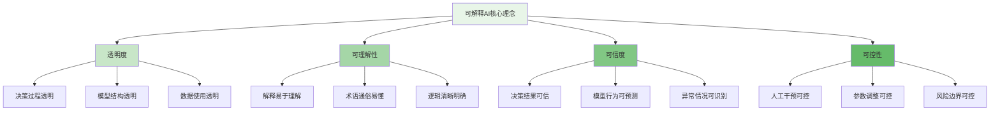
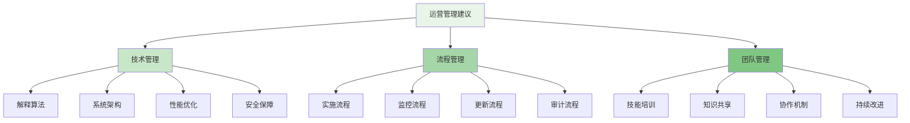

可解释AI(XAI)作为人工智能发展的重要方向，正在成为企业级智能风控平台不可或缺的核心能力。随着监管要求的日益严格和业务决策对透明度需求的不断提升，可解释AI不仅能够帮助风控团队理解模型决策逻辑，还能增强业务人员和监管机构对AI系统的信任，确保风控决策的公平性、合规性和可审计性。

## 可解释AI基础概念

可解释AI是指能够提供清晰、可理解的解释说明人工智能系统决策过程和结果的技术方法。

### XAI核心理念



### XAI方法分类

```yaml
# XAI方法分类
xai_methods_classification:
  post_hoc_explanations:
    name: "事后解释"
    description: "对已训练模型进行解释的方法，与模型训练过程无关"
    characteristics:
      - "模型无关性"
      - "灵活性高"
      - "适用性广"
      - "计算开销大"
    methods:
      - lime:
          name: "LIME (Local Interpretable Model-agnostic Explanations)"
          description: "通过局部线性近似解释任何模型的预测"
          advantages:
            - "适用于任何模型"
            - "提供局部解释"
            - "直观易懂"
          disadvantages:
            - "稳定性问题"
            - "计算复杂"
            - "参数敏感"
          applications:
            - "单个预测解释"
            - "模型调试"
            - "异常检测"
      
      - shap:
          name: "SHAP (SHapley Additive exPlanations)"
          description: "基于博弈论的特征重要性解释方法"
          advantages:
            - "理论基础扎实"
            - "一致性保证"
            - "全局和局部解释"
          disadvantages:
            - "计算复杂度高"
            - "近似算法误差"
            - "内存消耗大"
          applications:
            - "特征重要性分析"
            - "模型比较"
            - "决策支持"
      
      - attention_mechanisms:
          name: "注意力机制"
          description: "通过注意力权重解释模型关注点"
          advantages:
            - "内生解释性"
            - "实时解释"
            - "序列数据友好"
          disadvantages:
            - "仅适用于特定模型"
            - "注意力≠重要性"
            - "解释局限性"
          applications:
            - "文本风控"
            - "序列模式识别"
            - "多模态分析"
  
  intrinsic_explainability:
    name: "内在可解释性"
    description: "模型本身具有可解释性的方法，在设计时就考虑了解释能力"
    characteristics:
      - "天然可解释"
      - "计算效率高"
      - "稳定性好"
      - "表达能力有限"
    methods:
      - decision_trees:
          name: "决策树"
          description: "通过树结构提供直观的决策路径"
          advantages:
            - "天然可解释"
            - "规则清晰"
            - "易于验证"
          disadvantages:
            - "表达能力有限"
            - "容易过拟合"
            - "稳定性差"
          applications:
            - "规则提取"
            - "专家系统"
            - "合规审计"
      
      - linear_models:
          name: "线性模型"
          description: "通过权重系数解释特征影响"
          advantages:
            - "数学可解释"
            - "计算效率高"
            - "稳定性好"
          disadvantages:
            - "表达能力有限"
            - "特征交互建模困难"
            - "非线性关系处理差"
          applications:
            - "基准模型"
            - "特征筛选"
            - "因果推断"
      
      - rule_based_systems:
          name: "基于规则的系统"
          description: "通过明确规则进行决策和解释"
          advantages:
            - "完全透明"
            - "易于审计"
            - "可解释性强"
          disadvantages:
            - "维护成本高"
            - "扩展性差"
            - "适应性有限"
          applications:
            - "合规检查"
            - "专家知识编码"
            - "决策审核"
```

## 风控场景的可解释性需求

风控业务对可解释性有着特殊的要求，需要在保证模型性能的同时提供清晰的决策依据。

### 风控解释性要求

```python
class RiskControlExplainabilityRequirements:
    def __init__(self):
        self.business_requirements = {
            'transparency': {
                'description': '决策过程透明化',
                'requirements': [
                    '能够解释每个风险决策的依据',
                    '提供特征对决策的贡献度',
                    '支持决策路径追溯'
                ]
            },
            'auditability': {
                'description': '决策可审计性',
                'requirements': [
                    '完整的决策日志记录',
                    '支持监管合规检查',
                    '提供模型变更历史'
                ]
            },
            'fairness': {
                'description': '决策公平性',
                'requirements': [
                    '检测和消除算法偏见',
                    '确保不同群体的公平对待',
                    '提供公平性评估报告'
                ]
            },
            'accountability': {
                'description': '决策可问责性',
                'requirements': [
                    '明确决策责任人',
                    '支持决策错误追溯',
                    '提供风险处置预案'
                ]
            }
        }
        
        self.technical_requirements = {
            'real_time_explanation': {
                'description': '实时解释能力',
                'requirements': [
                    '毫秒级解释生成',
                    '低延迟响应',
                    '高并发支持'
                ]
            },
            'multi_granularity': {
                'description': '多粒度解释',
                'requirements': [
                    '全局模型解释',
                    '局部决策解释',
                    '特征级别解释'
                ]
            },
            'user_friendly': {
                'description': '用户友好性',
                'requirements': [
                    '自然语言解释',
                    '可视化展示',
                    '角色定制化'
                ]
            },
            'robustness': {
                'description': '解释鲁棒性',
                'requirements': [
                    '解释一致性保证',
                    '对抗攻击防御',
                    '异常情况处理'
                ]
            }
        }
    
    def validate_explainability_solution(self, solution):
        """验证可解释性解决方案是否满足要求"""
        validation_results = {
            'business_validation': self.validate_business_requirements(solution),
            'technical_validation': self.validate_technical_requirements(solution),
            'compliance_validation': self.validate_compliance_requirements(solution)
        }
        
        return validation_results
    
    def validate_business_requirements(self, solution):
        """验证业务要求"""
        results = {}
        
        # 透明度验证
        results['transparency'] = {
            'passed': solution.can_explain_decisions(),
            'details': solution.get_explanation_capabilities()
        }
        
        # 可审计性验证
        results['auditability'] = {
            'passed': solution.can_generate_audit_trail(),
            'details': solution.get_audit_capabilities()
        }
        
        # 公平性验证
        results['fairness'] = {
            'passed': solution.can_detect_bias(),
            'details': solution.get_fairness_metrics()
        }
        
        # 可问责性验证
        results['accountability'] = {
            'passed': solution.can_trace_decisions(),
            'details': solution.get_accountability_features()
        }
        
        return results
    
    def validate_technical_requirements(self, solution):
        """验证技术要求"""
        results = {}
        
        # 实时性验证
        results['real_time_explanation'] = {
            'passed': solution.get_explanation_latency() < 100,  # 毫秒
            'details': {
                'latency': solution.get_explanation_latency(),
                'throughput': solution.get_explanation_throughput()
            }
        }
        
        # 多粒度验证
        results['multi_granularity'] = {
            'passed': solution.supports_multi_granularity_explanation(),
            'details': solution.get_explanation_granularities()
        }
        
        # 用户友好性验证
        results['user_friendly'] = {
            'passed': solution.supports_user_friendly_explanation(),
            'details': solution.get_user_interface_capabilities()
        }
        
        # 鲁棒性验证
        results['robustness'] = {
            'passed': solution.is_explanation_robust(),
            'details': solution.get_robustness_metrics()
        }
        
        return results

class RiskExplanation:
    def __init__(self, prediction, input_data, model):
        self.prediction = prediction
        self.input_data = input_data
        self.model = model
        self.explanation_methods = {
            'shap': SHAPExplainer(),
            'lime': LIMEExplainer(),
            'attention': AttentionExplainer(),
            'decision_tree': DecisionTreeExplainer()
        }
    
    def generate_explanation(self, method='shap', user_role='analyst'):
        """生成风险决策解释"""
        # 1. 选择解释方法
        explainer = self.explanation_methods.get(method)
        if not explainer:
            raise ValueError(f"Unsupported explanation method: {method}")
        
        # 2. 生成技术解释
        technical_explanation = explainer.explain(self.model, self.input_data, self.prediction)
        
        # 3. 转换为业务解释
        business_explanation = self.convert_to_business_explanation(technical_explanation)
        
        # 4. 生成用户友好的解释
        user_friendly_explanation = self.generate_user_friendly_explanation(
            business_explanation, 
            user_role
        )
        
        # 5. 生成可视化
        visualization = self.generate_visualization(technical_explanation)
        
        return RiskDecisionExplanation(
            prediction=self.prediction,
            technical_explanation=technical_explanation,
            business_explanation=business_explanation,
            user_friendly_explanation=user_friendly_explanation,
            visualization=visualization,
            confidence=self.calculate_explanation_confidence(technical_explanation),
            generated_at=datetime.now()
        )
    
    def convert_to_business_explanation(self, technical_explanation):
        """将技术解释转换为业务解释"""
        # 1. 特征映射到业务含义
        business_features = self.map_features_to_business_meaning(
            technical_explanation.feature_importance
        )
        
        # 2. 风险因素识别
        risk_factors = self.identify_risk_factors(business_features)
        
        # 3. 影响程度评估
        impact_assessment = self.assess_factor_impact(risk_factors, technical_explanation.contributions)
        
        # 4. 业务建议生成
        business_recommendations = self.generate_business_recommendations(risk_factors)
        
        return BusinessExplanation(
            risk_factors=risk_factors,
            impact_assessment=impact_assessment,
            recommendations=business_recommendations,
            business_context=self.extract_business_context()
        )
    
    def generate_user_friendly_explanation(self, business_explanation, user_role):
        """生成用户友好的解释"""
        # 1. 根据用户角色调整解释复杂度
        explanation_level = self.determine_explanation_level(user_role)
        
        # 2. 简化业务术语
        simplified_explanation = self.simplify_business_terms(business_explanation, explanation_level)
        
        # 3. 生成自然语言描述
        natural_language_explanation = self.generate_natural_language(simplified_explanation)
        
        # 4. 添加行动建议
        actionable_recommendations = self.generate_actionable_recommendations(simplified_explanation, user_role)
        
        return UserFriendlyExplanation(
            natural_language=natural_language_explanation,
            recommendations=actionable_recommendations,
            role=user_role,
            explanation_level=explanation_level
        )
```

## SHAP解释方法实现

SHAP作为一种基于博弈论的解释方法，在风控场景中具有重要应用价值。

### SHAP在风控中的应用

```go
type SHAPExplainer struct {
    Model          ModelInterface
    BackgroundData [][]float64
    ExplainerType  string
}

type SHAPExplanation struct {
    SHAPValues     []float64          `json:"shap_values"`
    ExpectedValue  float64            `json:"expected_value"`
    FeatureNames   []string           `json:"feature_names"`
    FeatureValues  []float64          `json:"feature_values"`
    Prediction     float64            `json:"prediction"`
    BaseValue      float64            `json:"base_value"`
    Confidence     float64            `json:"confidence"`
}

func (se *SHAPExplainer) Explain(inputData []float64, featureNames []string) (*SHAPExplanation, error) {
    // 1. 根据模型类型选择合适的SHAP解释器
    explainer, err := se.initializeExplainer()
    if err != nil {
        return nil, fmt.Errorf("failed to initialize explainer: %v", err)
    }
    
    // 2. 计算SHAP值
    shapValues, err := explainer.CalculateSHAPValues(inputData)
    if err != nil {
        return nil, fmt.Errorf("failed to calculate SHAP values: %v", err)
    }
    
    // 3. 获取模型预测
    prediction, err := se.Model.Predict(inputData)
    if err != nil {
        return nil, fmt.Errorf("failed to get model prediction: %v", err)
    }
    
    // 4. 计算期望值
    expectedValue := explainer.GetExpectedValue()
    
    // 5. 构建解释结果
    explanation := &SHAPExplanation{
        SHAPValues:    shapValues,
        ExpectedValue: expectedValue,
        FeatureNames:  featureNames,
        FeatureValues: inputData,
        Prediction:    prediction,
        BaseValue:     expectedValue,
        Confidence:    se.calculateConfidence(shapValues),
    }
    
    return explanation, nil
}

func (se *SHAPExplainer) initializeExplainer() (SHAPExplainerInterface, error) {
    switch se.ExplainerType {
    case "tree":
        return NewTreeExplainer(se.Model, se.BackgroundData)
    case "linear":
        return NewLinearExplainer(se.Model, se.BackgroundData)
    case "deep":
        return NewDeepExplainer(se.Model, se.BackgroundData)
    case "kernel":
        return NewKernelExplainer(se.Model, se.BackgroundData)
    default:
        return NewKernelExplainer(se.Model, se.BackgroundData)
    }
}

func (se *SHAPExplainer) calculateConfidence(shapValues []float64) float64 {
    // 计算SHAP值的稳定性作为置信度
    variance := calculateVariance(shapValues)
    confidence := 1.0 / (1.0 + variance) // 方差越小，置信度越高
    return confidence
}

type TreeSHAPExplainer struct {
    Model          TreeModel
    BackgroundData [][]float64
    FeatureMaps    map[string]int
}

func (tse *TreeSHAPExplainer) CalculateSHAPValues(inputData []float64) ([]float64, error) {
    // 1. 构建树模型的SHAP计算图
    treeEnsemble := tse.Model.GetTreeEnsemble()
    
    // 2. 使用TreeSHAP算法计算SHAP值
    shapValues := make([]float64, len(inputData))
    
    // 对每棵树计算贡献
    for _, tree := range treeEnsemble.Trees {
        treeContributions := tse.calculateTreeContributions(tree, inputData)
        for i, contribution := range treeContributions {
            shapValues[i] += contribution
        }
    }
    
    // 3. 归一化处理
    shapValues = tse.normalizeSHAPValues(shapValues, treeEnsemble)
    
    return shapValues, nil
}

func (tse *TreeSHAPExplainer) calculateTreeContributions(tree *DecisionTree, inputData []float64) []float64 {
    contributions := make([]float64, len(inputData))
    
    // 使用TreeSHAP的递归算法计算每个特征的贡献
    tse.computePathContributions(tree.Root, inputData, contributions, 1.0)
    
    return contributions
}

func (tse *TreeSHAPExplainer) computePathContributions(node *TreeNode, inputData []float64, contributions []float64, weight float64) {
    if node.IsLeaf() {
        return
    }
    
    featureIndex := node.SplitFeature
    featureValue := inputData[featureIndex]
    
    if featureValue <= node.SplitValue {
        // 走左子树
        leftWeight := weight * node.LeftChild.Weight / node.Weight
        contributions[featureIndex] += leftWeight * (node.LeftChild.Value - node.Value)
        tse.computePathContributions(node.LeftChild, inputData, contributions, leftWeight)
    } else {
        // 走右子树
        rightWeight := weight * node.RightChild.Weight / node.Weight
        contributions[featureIndex] += rightWeight * (node.RightChild.Value - node.Value)
        tse.computePathContributions(node.RightChild, inputData, contributions, rightWeight)
    }
}

type RiskControlSHAPSystem struct {
    SHAPExplainers map[string]*SHAPExplainer
    ModelManager   *ModelManager
    CacheManager   *ExplanationCache
}

func (rcss *RiskControlSHAPSystem) GenerateRiskExplanation(
    modelId string,
    inputData []float64,
    featureNames []string,
) (*RiskExplanationResult, error) {
    // 1. 获取模型
    model, err := rcss.ModelManager.GetModel(modelId)
    if err != nil {
        return nil, fmt.Errorf("failed to get model: %v", err)
    }
    
    // 2. 检查缓存
    cacheKey := rcss.generateCacheKey(modelId, inputData)
    if cachedExplanation := rcss.CacheManager.Get(cacheKey); cachedExplanation != nil {
        return cachedExplanation, nil
    }
    
    // 3. 选择合适的SHAP解释器
    explainerType := rcss.determineExplainerType(model)
    explainer := rcss.SHAPExplainers[explainerType]
    if explainer == nil {
        explainer = &SHAPExplainer{
            Model:         model,
            ExplainerType: explainerType,
        }
    }
    
    // 4. 生成SHAP解释
    shapExplanation, err := explainer.Explain(inputData, featureNames)
    if err != nil {
        return nil, fmt.Errorf("failed to generate SHAP explanation: %v", err)
    }
    
    // 5. 转换为风控业务解释
    businessExplanation := rcss.convertToBusinessExplanation(shapExplanation)
    
    // 6. 生成可视化
    visualization := rcss.generateVisualization(shapExplanation)
    
    // 7. 构建最终结果
    result := &RiskExplanationResult{
        ModelId:             modelId,
        SHAPExplanation:     shapExplanation,
        BusinessExplanation: businessExplanation,
        Visualization:       visualization,
        GeneratedAt:         time.Now(),
    }
    
    // 8. 缓存结果
    rcss.CacheManager.Set(cacheKey, result)
    
    return result, nil
}

func (rcss *RiskControlSHAPSystem) convertToBusinessExplanation(shapExplanation *SHAPExplanation) *BusinessRiskExplanation {
    // 1. 分析特征重要性
    featureImportance := rcss.analyzeFeatureImportance(shapExplanation.SHAPValues, shapExplanation.FeatureNames)
    
    // 2. 识别风险驱动因素
    riskDrivers := rcss.identifyRiskDrivers(featureImportance)
    
    // 3. 评估业务影响
    businessImpact := rcss.assessBusinessImpact(riskDrivers, shapExplanation.Prediction)
    
    // 4. 生成业务建议
    businessRecommendations := rcss.generateBusinessRecommendations(riskDrivers)
    
    return &BusinessRiskExplanation{
        RiskScore:           shapExplanation.Prediction,
        KeyRiskFactors:      riskDrivers,
        FeatureImportance:   featureImportance,
        BusinessImpact:      businessImpact,
        Recommendations:     businessRecommendations,
        ExplanationStrength: shapExplanation.Confidence,
    }
}
```

### LIME解释方法实现

```typescript
interface LIMEExplainer {
    // 生成局部解释
    explain(instance: any, model: Model, config: LIMEConfig): Promise<LIMEExplanation>;
    
    // 生成扰动样本
    generatePerturbations(instance: any, config: PerturbationConfig): Promise<PerturbedSample[]>;
    
    // 训练解释模型
    trainExplanationModel(perturbedSamples: PerturbedSample[], model: Model): Promise<ExplanationModel>;
    
    // 评估解释质量
    evaluateExplanation(explanation: LIMEExplanation, instance: any, model: Model): Promise<ExplanationQuality>;
}

class RiskControlLIME implements LIMEExplainer {
    private kernel: KernelFunction;
    private distanceMetric: DistanceMetric;
    private explanationModel: ExplanationModelType;
    
    async explain(instance: any, model: Model, config: LIMEConfig): Promise<LIMEExplanation> {
        // 1. 生成扰动样本
        const perturbedSamples = await this.generatePerturbations(instance, config.perturbation);
        
        // 2. 获取模型预测
        const predictions = await this.getModelPredictions(perturbedSamples, model);
        
        // 3. 计算样本权重
        const weights = this.calculateSampleWeights(instance, perturbedSamples, config.kernel);
        
        // 4. 训练解释模型
        const explanationModel = await this.trainExplanationModel(
            perturbedSamples,
            predictions,
            weights,
            config.explanationModel
        );
        
        // 5. 生成解释
        const explanation = this.generateLIMEExplanation(
            instance,
            explanationModel,
            config.interpretation
        );
        
        // 6. 评估解释质量
        const quality = await this.evaluateExplanation(explanation, instance, model);
        
        return new LIMEExplanation({
            instance: instance,
            explanationModel: explanationModel,
            featureWeights: explanation.featureWeights,
            intercept: explanation.intercept,
            rSquared: explanation.rSquared,
            quality: quality,
            config: config
        });
    }
    
    async generatePerturbations(instance: any, config: PerturbationConfig): Promise<PerturbedSample[]> {
        const perturbedSamples: PerturbedSample[] = [];
        
        // 生成多个扰动样本
        for (let i = 0; i < config.numSamples; i++) {
            // 根据特征重要性生成扰动
            const perturbedInstance = this.perturbInstance(instance, config.perturbationStrategy);
            
            // 计算与原始实例的距离
            const distance = this.calculateDistance(instance, perturbedInstance, config.distanceMetric);
            
            perturbedSamples.push(new PerturbedSample({
                instance: perturbedInstance,
                distance: distance,
                similarity: this.kernel(distance, config.kernelWidth),
                index: i
            }));
        }
        
        return perturbedSamples;
    }
    
    private perturbInstance(instance: any, strategy: PerturbationStrategy): any {
        const perturbed = {...instance};
        
        switch (strategy.type) {
            case 'feature_sampling':
                return this.perturbByFeatureSampling(instance, strategy.samplingRate);
            case 'noise_addition':
                return this.perturbByNoiseAddition(instance, strategy.noiseLevel);
            case 'distribution_sampling':
                return this.perturbByDistributionSampling(instance, strategy.distribution);
            default:
                return this.perturbByFeatureSampling(instance, 0.5);
        }
    }
    
    private perturbByFeatureSampling(instance: any, samplingRate: number): any {
        const perturbed = {...instance};
        const featureNames = Object.keys(instance);
        
        // 随机选择部分特征进行扰动
        const selectedFeatures = featureNames.filter(() => Math.random() < samplingRate);
        
        for (const feature of selectedFeatures) {
            // 对数值特征添加噪声
            if (typeof instance[feature] === 'number') {
                const noise = (Math.random() - 0.5) * 0.1 * Math.abs(instance[feature]);
                perturbed[feature] = instance[feature] + noise;
            }
            // 对分类特征随机替换
            else if (typeof instance[feature] === 'string') {
                // 这里简化处理，实际应用中需要根据特征的可能取值进行替换
                perturbed[feature] = instance[feature] + '_perturbed';
            }
        }
        
        return perturbed;
    }
    
    async trainExplanationModel(
        samples: PerturbedSample[],
        predictions: number[],
        weights: number[],
        modelConfig: ExplanationModelConfig
    ): Promise<ExplanationModel> {
        // 1. 准备训练数据
        const trainingData = this.prepareTrainingData(samples, predictions, weights);
        
        // 2. 选择解释模型类型
        let explanationModel: ExplanationModel;
        switch (modelConfig.type) {
            case 'linear':
                explanationModel = new LinearExplanationModel(modelConfig.linearParams);
                break;
            case 'ridge':
                explanationModel = new RidgeExplanationModel(modelConfig.ridgeParams);
                break;
            case 'lasso':
                explanationModel = new LassoExplanationModel(modelConfig.lassoParams);
                break;
            default:
                explanationModel = new LinearExplanationModel();
        }
        
        // 3. 训练解释模型
        await explanationModel.train(trainingData.features, trainingData.targets, trainingData.weights);
        
        return explanationModel;
    }
    
    private prepareTrainingData(
        samples: PerturbedSample[],
        predictions: number[],
        weights: number[]
    ): TrainingData {
        // 将扰动样本转换为特征矩阵
        const features = samples.map(sample => this.instanceToFeatureVector(sample.instance));
        const targets = predictions;
        
        return new TrainingData({
            features: features,
            targets: targets,
            weights: weights
        });
    }
    
    private generateLIMEExplanation(
        instance: any,
        explanationModel: ExplanationModel,
        config: InterpretationConfig
    ): LIMEExplanationData {
        // 1. 获取特征权重
        const featureWeights = explanationModel.getFeatureWeights();
        const intercept = explanationModel.getIntercept();
        
        // 2. 计算R²值
        const rSquared = explanationModel.calculateRSquared();
        
        // 3. 识别关键特征
        const keyFeatures = this.identifyKeyFeatures(featureWeights, config.featureThreshold);
        
        // 4. 生成自然语言解释
        const naturalLanguage = this.generateNaturalLanguageExplanation(
            instance,
            featureWeights,
            keyFeatures,
            config.languageStyle
        );
        
        return new LIMEExplanationData({
            featureWeights: featureWeights,
            intercept: intercept,
            rSquared: rSquared,
            keyFeatures: keyFeatures,
            naturalLanguage: naturalLanguage
        });
    }
    
    async evaluateExplanation(
        explanation: LIMEExplanation,
        instance: any,
        model: Model
    ): Promise<ExplanationQuality> {
        // 1. 保真度评估
        const fidelity = await this.evaluateFidelity(explanation, instance, model);
        
        // 2. 稳定性评估
        const stability = await this.evaluateStability(explanation, instance, model);
        
        // 3. 稀疏性评估
        const sparsity = this.evaluateSparsity(explanation.featureWeights);
        
        // 4. 可理解性评估
        const interpretability = this.evaluateInterpretability(explanation);
        
        // 5. 综合质量评分
        const综合Score = this.calculate综合QualityScore(fidelity, stability, sparsity, interpretability);
        
        return new ExplanationQuality({
            fidelity: fidelity,
            stability: stability,
            sparsity: sparsity,
            interpretability: interpretability,
           综合Score: 综合Score,
            confidence: this.calculateQualityConfidence(综合Score)
        });
    }
}

class RiskExplanationVisualizer {
    createFeatureImportanceChart(explanation: any): HTMLElement {
        // 创建特征重要性图表
        const chartContainer = document.createElement('div');
        chartContainer.className = 'feature-importance-chart';
        
        // 根据解释类型创建不同类型的图表
        if (explanation.type === 'shap') {
            this.createSHAPChart(chartContainer, explanation);
        } else if (explanation.type === 'lime') {
            this.createLIMEChart(chartContainer, explanation);
        }
        
        return chartContainer;
    }
    
    createDecisionPathDiagram(explanation: any): HTMLElement {
        // 创建决策路径图
        const diagramContainer = document.createElement('div');
        diagramContainer.className = 'decision-path-diagram';
        
        // 根据模型类型创建路径图
        if (explanation.modelType === 'decision_tree') {
            this.createTreePathDiagram(diagramContainer, explanation);
        }
        
        return diagramContainer;
    }
    
    createCounterfactualExplanation(explanation: any): HTMLElement {
        // 创建反事实解释
        const cfContainer = document.createElement('div');
        cfContainer.className = 'counterfactual-explanation';
        
        // 显示原始决策和反事实决策的对比
        this.createComparisonView(cfContainer, explanation);
        
        return cfContainer;
    }
    
    private createSHAPChart(container: HTMLElement, explanation: any) {
        // 创建SHAP值的瀑布图
        const waterfallData = this.prepareWaterfallData(explanation);
        
        // 使用图表库创建可视化
        const chart = new WaterfallChart({
            container: container,
            data: waterfallData,
            title: '特征贡献度分析',
            xAxisLabel: '特征',
            yAxisLabel: '贡献度'
        });
        
        chart.render();
    }
    
    private createLIMEChart(container: HTMLElement, explanation: any) {
        // 创建LIME特征权重的条形图
        const barData = this.prepareBarData(explanation);
        
        // 使用图表库创建可视化
        const chart = new BarChart({
            container: container,
            data: barData,
            title: '局部特征重要性',
            xAxisLabel: '特征',
            yAxisLabel: '权重'
        });
        
        chart.render();
    }
}
```

## 可解释性在风控中的实践

可解释性在风控业务中的实践需要结合具体的业务场景和监管要求。

### 风控决策解释系统

```yaml
# 风控决策解释系统架构
risk_decision_explanation_system:
  system_architecture:
    name: "风控决策解释系统架构"
    description: "支持风控业务决策解释的系统架构"
    components:
      - explanation_engine:
          name: "解释引擎"
          description: "核心解释计算引擎"
          modules:
            - "SHAP解释器"
            - "LIME解释器"
            - "注意力解释器"
            - "规则提取器"
      
      - business_interpreter:
          name: "业务解释器"
          description: "将技术解释转换为业务解释"
          modules:
            - "特征业务映射"
            - "风险因素识别"
            - "影响评估"
            - "建议生成"
      
      - visualization_layer:
          name: "可视化层"
          description: "提供多种可视化解释方式"
          modules:
            - "图表生成"
            - "路径图绘制"
            - "对比视图"
            - "仪表板展示"
      
      - natural_language_generator:
          name: "自然语言生成器"
          description: "生成自然语言解释"
          modules:
            - "模板引擎"
            - "语言模型"
            - "角色适配"
            - "多语言支持"
  
  business_scenarios:
    fraud_detection:
      name: "欺诈检测解释"
      description: "为欺诈检测决策提供解释"
      explanation_components:
        - transaction_pattern_analysis:
            description: "交易模式分析解释"
            features:
              - "交易频率异常"
              - "交易金额异常"
              - "地理位置异常"
              - "时间模式异常"
        
        - user_behavior_analysis:
            description: "用户行为分析解释"
            features:
              - "登录行为异常"
              - "操作习惯变化"
              - "设备使用异常"
              - "社交关系异常"
      
      visualization_types:
        - "风险因素雷达图"
        - "时间序列行为图"
        - "地理分布热力图"
        - "行为模式对比图"
    
    credit_risk:
      name: "信用风险解释"
      description: "为信用风险评估提供解释"
      explanation_components:
        - financial_status_analysis:
            description: "财务状况分析解释"
            features:
              - "收入稳定性"
              - "负债比率"
              - "信用历史"
              - "资产状况"
        
        - repayment_ability_analysis:
            description: "还款能力分析解释"
            features:
              - "收入支出比"
              - "现金流状况"
              - "就业稳定性"
              - "担保情况"
      
      visualization_types:
        - "信用评分构成图"
        - "财务指标趋势图"
        - "风险因素权重图"
        - "历史记录时间轴"
  
  compliance_requirements:
    regulatory_reporting:
      name: "监管报告要求"
      requirements:
        - explanation_documentation:
            description: "解释文档化要求"
            details:
              - "完整记录解释过程"
              - "保存解释结果"
              - "支持审计追溯"
              - "定期报告生成"
        
        - fairness_assessment:
            description: "公平性评估要求"
            details:
              - "算法偏见检测"
              - "群体公平性分析"
              - "歧视性行为识别"
              - "纠正措施记录"
        
        - model_governance:
            description: "模型治理要求"
            details:
              - "模型变更跟踪"
              - "解释方法验证"
              - "质量监控指标"
              - "风险控制措施"
```

### 风控解释性监控

```javascript
class RiskExplainabilityMonitor {
    constructor(config) {
        this.config = config;
        this.metricsCollector = new ExplainabilityMetricsCollector();
        this.anomalyDetector = new ExplanationAnomalyDetector();
        this.alertEngine = new AlertEngine();
        this.reportGenerator = new ReportGenerator();
    }
    
    /**
     * 启动解释性监控
     */
    startMonitoring() {
        // 1. 启动指标收集
        this.metricsCollector.startCollection();
        
        // 2. 启动异常检测
        this.anomalyDetector.startDetection();
        
        // 3. 启动告警系统
        this.alertEngine.startAlerting();
        
        // 4. 启动定期报告
        this.scheduleRegularReports();
    }
    
    /**
     * 监控解释质量
     * @param {Object} explanation - 解释结果
     * @param {Object} prediction - 预测结果
     * @param {Object} actual - 实际结果
     */
    monitorExplanationQuality(explanation, prediction, actual) {
        // 1. 计算解释质量指标
        const qualityMetrics = this.calculateExplanationQuality(explanation, prediction, actual);
        
        // 2. 记录指标
        this.metricsCollector.recordMetrics(qualityMetrics);
        
        // 3. 检测异常
        const anomalies = this.anomalyDetector.detectAnomalies(qualityMetrics);
        if (anomalies.length > 0) {
            this.alertEngine.triggerAlert('explanation_quality_anomaly', {
                explanation: explanation,
                anomalies: anomalies,
                timestamp: Date.now()
            });
        }
        
        // 4. 评估业务影响
        const businessImpact = this.assessBusinessImpact(qualityMetrics);
        if (businessImpact.severe) {
            this.alertEngine.triggerAlert('severe_business_impact', {
                impact: businessImpact,
                metrics: qualityMetrics
            });
        }
    }
    
    /**
     * 计算解释质量指标
     * @param {Object} explanation - 解释结果
     * @param {Object} prediction - 预测结果
     * @param {Object} actual - 实际结果
     * @returns {Object} 质量指标
     */
    calculateExplanationQuality(explanation, prediction, actual) {
        return {
            // 保真度指标
            fidelity: this.calculateFidelity(explanation, prediction),
            
            // 稳定性指标
            stability: this.calculateStability(explanation),
            
            // 可理解性指标
            interpretability: this.calculateInterpretability(explanation),
            
            // 一致性指标
            consistency: this.calculateConsistency(explanation),
            
            // 业务相关性指标
            businessRelevance: this.calculateBusinessRelevance(explanation),
            
            // 时间戳
            timestamp: Date.now()
        };
    }
    
    /**
     * 计算保真度
     * @param {Object} explanation - 解释结果
     * @param {Object} prediction - 预测结果
     * @returns {number} 保真度分数
     */
    calculateFidelity(explanation, prediction) {
        // 对于SHAP解释，检查SHAP值之和是否等于预测值与基值的差
        if (explanation.type === 'shap') {
            const shapSum = explanation.shapValues.reduce((sum, val) => sum + val, 0);
            const predictionDiff = prediction - explanation.baseValue;
            return 1 - Math.abs(shapSum - predictionDiff) / Math.abs(predictionDiff);
        }
        
        // 对于LIME解释，检查R²值
        if (explanation.type === 'lime') {
            return explanation.rSquared;
        }
        
        return 0.5; // 默认值
    }
    
    /**
     * 生成解释性报告
     * @param {string} period - 报告周期
     * @returns {Object} 报告内容
     */
    async generateExplainabilityReport(period) {
        // 1. 收集报告数据
        const reportData = await this.collectReportData(period);
        
        // 2. 分析趋势
        const trends = this.analyzeTrends(reportData);
        
        // 3. 识别问题
        const issues = this.identifyIssues(reportData);
        
        // 4. 生成建议
        const recommendations = this.generateRecommendations(issues);
        
        // 5. 创建报告
        const report = this.reportGenerator.createReport({
            period: period,
            data: reportData,
            trends: trends,
            issues: issues,
            recommendations: recommendations,
            generatedAt: new Date()
        });
        
        return report;
    }
    
    /**
     * 合规性检查
     * @param {Object} explanation - 解释结果
     * @returns {Object} 合规性检查结果
     */
    checkCompliance(explanation) {
        const complianceResults = {
            // 公平性检查
            fairness: this.checkFairness(explanation),
            
            // 透明度检查
            transparency: this.checkTransparency(explanation),
            
            // 可审计性检查
            auditability: this.checkAuditability(explanation),
            
            // 可问责性检查
            accountability: this.checkAccountability(explanation)
        };
        
        // 检查是否存在严重违规
        const hasSeriousViolations = Object.values(complianceResults).some(
            result => result.level === 'severe'
        );
        
        if (hasSeriousViolations) {
            this.alertEngine.triggerAlert('compliance_violation', {
                violations: complianceResults,
                severity: 'severe',
                timestamp: Date.now()
            });
        }
        
        return complianceResults;
    }
}
```

## 最佳实践与经验总结

在实施风控可解释性系统时，需要遵循一系列最佳实践来确保系统效果和合规性。

### 实施最佳实践

1. **分层解释**：提供全局、局部和特征级别的多层次解释
2. **业务映射**：将技术解释映射为业务可理解的语言
3. **实时性保障**：确保解释生成满足业务实时性要求
4. **质量监控**：建立解释质量的持续监控机制
5. **合规保障**：确保解释系统满足监管合规要求

### 运营管理建议



通过合理应用可解释AI技术，企业级智能风控平台能够提升模型决策的透明度和可信度，满足监管要求和业务需求，为企业的风险管理提供更加全面和可靠的决策支持。