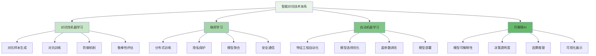
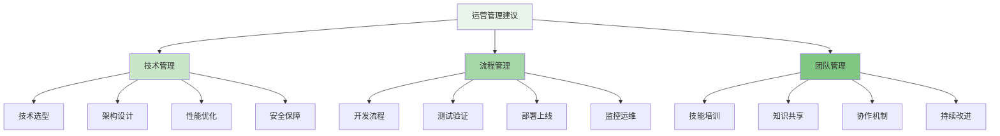

在企业级智能风控平台的发展过程中，智能对抗与前沿技术的应用是提升平台防护能力和智能化水平的关键。随着对抗性机器学习、联邦学习、自动机器学习(AutoML)和可解释AI(XAI)等前沿技术的不断成熟，风控平台正朝着更加智能、安全和透明的方向发展。这些技术不仅能够提升风控系统的检测能力和防护水平，还能够增强系统的可解释性和合规性，为企业的风险管理提供更加全面和先进的技术支撑。

## 智能对抗技术体系

智能对抗技术是应对日益复杂的攻击手段和提升风控系统鲁棒性的重要手段，通过模拟攻击和防御的动态博弈，不断提升系统的安全防护能力。

### 对抗技术架构



### 对抗性机器学习

对抗性机器学习是提升风控模型鲁棒性的重要技术，通过模拟攻击者的行为来增强模型的抗攻击能力。

```yaml
# 对抗性机器学习技术体系
adversarial_machine_learning:
  adversarial_attack:
    name: "对抗攻击"
    description: "生成对抗样本以测试模型的脆弱性"
    attack_types:
      - white_box_attack:
          name: "白盒攻击"
          description: "攻击者完全了解模型结构和参数"
          techniques:
            - "FGSM (Fast Gradient Sign Method)"
            - "PGD (Projected Gradient Descent)"
            - "CW (Carlini-Wagner)"
            - "JSMA (Jacobian-based Sensitive Map Attack)"
          applications:
            - "模型脆弱性测试"
            - "安全评估"
            - "红蓝对抗演练"
      
      - black_box_attack:
          name: "黑盒攻击"
          description: "攻击者不了解模型内部结构"
          techniques:
            - "基于查询的攻击"
            - "迁移性攻击"
            - "零阶优化攻击"
            - "遗传算法攻击"
          applications:
            - "模拟真实攻击场景"
            - "API安全测试"
            - "模型逆向工程防护"
      
      - grey_box_attack:
          name: "灰盒攻击"
          description: "攻击者了解部分模型信息"
          techniques:
            - "部分信息利用攻击"
            - "混合攻击策略"
          applications:
            - "中间人攻击模拟"
            - "部分知情攻击测试"
  
  adversarial_defense:
    name: "对抗防御"
    description: "提升模型对对抗攻击的防御能力"
    defense_strategies:
      - adversarial_training:
          name: "对抗训练"
          description: "在训练过程中加入对抗样本提升模型鲁棒性"
          implementation:
            - "FGSM对抗训练"
            - "PGD对抗训练"
            - " TRADES训练"
            - "动态对抗训练"
          benefits:
            - "提升模型鲁棒性"
            - "增强泛化能力"
            - "减少过拟合风险"
      
      - input_preprocessing:
          name: "输入预处理"
          description: "对输入数据进行预处理以消除对抗扰动"
          techniques:
            - "随机化处理"
            - "特征压缩"
            - "去噪滤波"
            - "数据增强"
          benefits:
            - "简单易实现"
            - "计算开销小"
            - "兼容性好"
      
      - detection_methods:
          name: "检测方法"
          description: "检测和识别对抗样本"
          approaches:
            - "基于统计特征的检测"
            - "基于模型行为的检测"
            - "基于梯度信息的检测"
            - "集成检测方法"
          benefits:
            - "实时防护"
            - "误报率低"
            - "可解释性强"
  
  robustness_evaluation:
    name: "鲁棒性评估"
    description: "评估模型在对抗环境下的性能表现"
    evaluation_metrics:
      - accuracy_under_attack:
          name: "攻击下准确率"
          description: "模型在面对对抗攻击时的准确率"
          calculation: "正确分类的对抗样本数 / 总对抗样本数"
      
      - robustness_radius:
          name: "鲁棒半径"
          description: "模型能够抵抗的最大扰动范围"
          calculation: "最小扰动使模型分类错误的距离"
      
      - transferability:
          name: "迁移性"
          description: "对抗样本在不同模型间的有效性"
          calculation: "在目标模型上成功的对抗样本比例"
```

### 联邦学习应用

联邦学习在保护数据隐私的前提下实现多方协作建模，为风控平台提供了新的技术路径。

```python
class FederatedLearningFramework:
    def __init__(self, config):
        self.config = config
        self.participants = []
        self.global_model = None
        self.aggregator = ModelAggregator()
        self.security_manager = SecurityManager()
        self.communication_manager = CommunicationManager()
    
    def register_participant(self, participant):
        """注册参与方"""
        # 1. 验证参与方身份
        identity_verification = self.security_manager.verify_identity(participant)
        if not identity_verification.is_valid:
            raise InvalidParticipantError("Participant identity verification failed")
        
        # 2. 检查参与方资质
        qualification_check = self.check_participant_qualification(participant)
        if not qualification_check.is_qualified:
            raise UnqualifiedParticipantError("Participant does not meet qualification requirements")
        
        # 3. 注册参与方
        self.participants.append(participant)
        
        # 4. 建立安全通信通道
        secure_channel = self.communication_manager.establish_secure_channel(participant)
        
        return {
            'participant_id': participant.id,
            'registration_status': 'success',
            'secure_channel': secure_channel
        }
    
    def initiate_federated_training(self, training_config):
        """启动联邦训练"""
        # 1. 验证训练配置
        config_validation = self.validate_training_config(training_config)
        if not config_validation.is_valid:
            raise InvalidTrainingConfigError(config_validation.errors)
        
        # 2. 初始化全局模型
        self.global_model = self.initialize_global_model(training_config.model_architecture)
        
        # 3. 广播训练任务
        training_tasks = self.broadcast_training_tasks(training_config)
        
        # 4. 启动训练轮次
        for round_num in range(training_config.rounds):
            # 执行一轮联邦训练
            round_result = self.execute_training_round(round_num, training_config)
            
            # 聚合模型更新
            aggregated_model = self.aggregate_model_updates(round_result.updates)
            
            # 更新全局模型
            self.global_model = aggregated_model
            
            # 评估模型性能
            performance_metrics = self.evaluate_global_model(self.global_model)
            
            # 记录训练日志
            self.log_training_progress(round_num, performance_metrics)
        
        return {
            'final_model': self.global_model,
            'training_history': self.get_training_history(),
            'performance_metrics': self.get_final_performance_metrics()
        }
    
    def execute_training_round(self, round_num, training_config):
        """执行训练轮次"""
        # 1. 向参与方分发全局模型
        self.distribute_global_model()
        
        # 2. 收集参与方训练结果
        participant_results = []
        for participant in self.participants:
            # 发送训练指令
            training_instruction = self.prepare_training_instruction(
                participant,
                training_config,
                round_num
            )
            
            # 执行本地训练
            local_result = participant.train_local_model(
                training_instruction,
                self.global_model
            )
            
            # 验证训练结果
            result_validation = self.validate_training_result(local_result)
            if result_validation.is_valid:
                participant_results.append(local_result)
            else:
                self.log_invalid_result(participant.id, result_validation.errors)
        
        # 3. 安全聚合模型更新
        secure_aggregation = self.aggregator.secure_aggregate(
            participant_results,
            training_config.aggregation_method
        )
        
        return TrainingRoundResult(
            round_number=round_num,
            updates=secure_aggregation.updates,
            statistics=secure_aggregation.statistics
        )
    
    def aggregate_model_updates(self, updates):
        """聚合模型更新"""
        # 1. 验证更新数据
        for update in updates:
            update_validation = self.security_manager.validate_model_update(update)
            if not update_validation.is_valid:
                raise InvalidModelUpdateError(update_validation.errors)
        
        # 2. 执行加权聚合
        aggregated_model = self.aggregator.weighted_average_aggregation(
            updates,
            self.calculate_participant_weights()
        )
        
        # 3. 应用差分隐私保护
        if self.config.differential_privacy.enabled:
            aggregated_model = self.security_manager.apply_differential_privacy(
                aggregated_model,
                self.config.differential_privacy.epsilon
            )
        
        return aggregated_model
    
    def evaluate_global_model(self, model):
        """评估全局模型"""
        # 1. 在各参与方本地数据上评估
        local_evaluations = []
        for participant in self.participants:
            local_metrics = participant.evaluate_model(model)
            local_evaluations.append({
                'participant_id': participant.id,
                'metrics': local_metrics
            })
        
        # 2. 计算全局评估指标
        global_metrics = self.calculate_global_metrics(local_evaluations)
        
        # 3. 分析模型公平性
        fairness_analysis = self.analyze_model_fairness(local_evaluations)
        
        # 4. 检测模型偏见
        bias_detection = self.detect_model_bias(local_evaluations)
        
        return ModelEvaluationResult(
            global_metrics=global_metrics,
            local_evaluations=local_evaluations,
            fairness_analysis=fairness_analysis,
            bias_detection=bias_detection
        )

class RiskControlFederatedLearning:
    def __init__(self):
        self.fl_framework = FederatedLearningFramework()
        self.risk_model_templates = RiskModelTemplates()
        self.data_privacy_manager = DataPrivacyManager()
    
    def setup_risk_control_fl_network(self, participants_config):
        """建立风控联邦学习网络"""
        # 1. 配置参与方
        participants = self.configure_participants(participants_config)
        
        # 2. 注册参与方
        registered_participants = []
        for participant in participants:
            registration_result = self.fl_framework.register_participant(participant)
            registered_participants.append(registration_result)
        
        # 3. 初始化风控模型模板
        risk_model_template = self.risk_model_templates.get_template('federated_risk_model')
        
        # 4. 配置隐私保护参数
        privacy_config = self.data_privacy_manager.configure_privacy_protection(
            participants_config.privacy_requirements
        )
        
        return FederatedRiskControlNetwork(
            participants=registered_participants,
            model_template=risk_model_template,
            privacy_config=privacy_config,
            network_status='initialized'
        )
    
    def train_federated_risk_model(self, training_config):
        """训练联邦风控模型"""
        # 1. 准备训练数据（仅本地处理，不传输原始数据）
        self.prepare_local_training_data()
        
        # 2. 配置联邦训练参数
        fl_training_config = self.configure_fl_training(training_config)
        
        # 3. 启动联邦训练
        training_result = self.fl_framework.initiate_federated_training(fl_training_config)
        
        # 4. 验证模型效果
        model_validation = self.validate_risk_model(training_result.final_model)
        
        # 5. 部署模型
        if model_validation.is_valid:
            deployment_result = self.deploy_federated_model(training_result.final_model)
            return {
                'model': training_result.final_model,
                'deployment': deployment_result,
                'evaluation': training_result.performance_metrics,
                'status': 'success'
            }
        else:
            return {
                'status': 'failed',
                'errors': model_validation.errors
            }
```

## 自动机器学习实现

自动机器学习(AutoML)能够自动化完成特征工程、模型选择和超参数调优等任务，大幅提升风控模型开发效率。

### AutoML架构设计

```go
type AutoMLFramework struct {
    FeatureEngineer    *FeatureEngineeringEngine
    ModelSelector      *ModelSelectionEngine
    HyperparameterTuner *HyperparameterTuningEngine
    ModelEvaluator     *ModelEvaluationEngine
    DeploymentManager  *ModelDeploymentManager
}

type AutoMLResult struct {
    BestModel          Model           `json:"best_model"`
    FeaturePipeline    FeaturePipeline `json:"feature_pipeline"`
    TrainingHistory    []TrainingRound `json:"training_history"`
    EvaluationMetrics  EvaluationMetrics `json:"evaluation_metrics"`
    Recommendations    []Recommendation `json:"recommendations"`
}

func (af *AutoMLFramework) ExecuteAutoMLPipeline(data TrainingData, config AutoMLConfig) (*AutoMLResult, error) {
    // 1. 自动特征工程
    featurePipeline, err := af.FeatureEngineer.AutoEngineerFeatures(data, config.FeatureConfig)
    if err != nil {
        return nil, fmt.Errorf("feature engineering failed: %v", err)
    }
    
    // 2. 模型选择与优化
    modelCandidates := af.ModelSelector.SelectCandidateModels(config.ModelCandidates)
    
    // 3. 超参数调优
    bestModels := make([]Model, 0)
    trainingHistory := make([]TrainingRound, 0)
    
    for _, modelCandidate := range modelCandidates {
        // 执行超参数搜索
        bestModel, searchHistory, err := af.HyperparameterTuner.OptimizeHyperparameters(
            modelCandidate,
            featurePipeline.Transform(data),
            config.HyperparameterConfig,
        )
        if err != nil {
            continue // 跳过失败的模型
        }
        
        bestModels = append(bestModels, bestModel)
        trainingHistory = append(trainingHistory, searchHistory...)
    }
    
    // 4. 模型评估与选择
    bestModel := af.ModelEvaluator.SelectBestModel(bestModels, featurePipeline.Transform(data))
    
    // 5. 生成评估报告
    evaluationMetrics := af.ModelEvaluator.EvaluateModel(bestModel, featurePipeline.Transform(data))
    
    // 6. 生成优化建议
    recommendations := af.generateRecommendations(bestModel, evaluationMetrics, config)
    
    return &AutoMLResult{
        BestModel:         bestModel,
        FeaturePipeline:   featurePipeline,
        TrainingHistory:   trainingHistory,
        EvaluationMetrics: evaluationMetrics,
        Recommendations:   recommendations,
    }, nil
}

type FeatureEngineeringEngine struct {
    FeatureGenerator   *FeatureGenerator
    FeatureSelector    *FeatureSelector
    FeatureTransformer *FeatureTransformer
}

func (fee *FeatureEngineeringEngine) AutoEngineerFeatures(data TrainingData, config FeatureConfig) (FeaturePipeline, error) {
    // 1. 自动生成特征
    generatedFeatures := fee.FeatureGenerator.GenerateFeatures(data, config.GenerationConfig)
    
    // 2. 特征选择
    selectedFeatures := fee.FeatureSelector.SelectFeatures(generatedFeatures, data, config.SelectionConfig)
    
    // 3. 特征变换
    transformedFeatures := fee.FeatureTransformer.TransformFeatures(selectedFeatures, config.TransformationConfig)
    
    // 4. 构建特征处理管道
    pipeline := NewFeaturePipeline(generatedFeatures, selectedFeatures, transformedFeatures)
    
    return pipeline, nil
}

func (fee *FeatureEngineeringEngine) GenerateFeatures(data TrainingData, config GenerationConfig) []Feature {
    features := make([]Feature, 0)
    
    // 1. 统计特征生成
    statFeatures := fee.generateStatisticalFeatures(data, config.StatisticalConfig)
    features = append(features, statFeatures...)
    
    // 2. 时间序列特征生成
    timeFeatures := fee.generateTimeSeriesFeatures(data, config.TimeSeriesConfig)
    features = append(features, timeFeatures...)
    
    // 3. 交叉特征生成
    crossFeatures := fee.generateCrossFeatures(data, config.CrossFeatureConfig)
    features = append(features, crossFeatures...)
    
    // 4. 文本特征生成
    textFeatures := fee.generateTextFeatures(data, config.TextConfig)
    features = append(features, textFeatures...)
    
    // 5. 图特征生成
    graphFeatures := fee.generateGraphFeatures(data, config.GraphConfig)
    features = append(features, graphFeatures...)
    
    return features
}

type ModelSelectionEngine struct {
    ModelRepository *ModelRepository
    PerformanceEstimator *PerformanceEstimator
}

func (mse *ModelSelectionEngine) SelectCandidateModels(candidates []ModelCandidate) []Model {
    selectedModels := make([]Model, 0)
    
    for _, candidate := range candidates {
        // 1. 检查模型适用性
        if !mse.isModelApplicable(candidate, mse.ModelRepository.GetModelRequirements()) {
            continue
        }
        
        // 2. 估计模型性能
        estimatedPerformance := mse.PerformanceEstimator.EstimatePerformance(candidate)
        
        // 3. 根据性能阈值筛选
        if estimatedPerformance.Score >= candidate.MinPerformanceThreshold {
            model := mse.ModelRepository.LoadModel(candidate.ModelType)
            selectedModels = append(selectedModels, model)
        }
    }
    
    return selectedModels
}

type HyperparameterTuningEngine struct {
    SearchAlgorithms map[string]SearchAlgorithm
    EarlyStopper     *EarlyStopper
}

func (hte *HyperparameterTuningEngine) OptimizeHyperparameters(
    model Model,
    data ProcessedData,
    config HyperparameterConfig,
) (Model, []TrainingRound, error) {
    // 1. 选择搜索算法
    searchAlgorithm := hte.SearchAlgorithms[config.SearchAlgorithm]
    
    // 2. 执行超参数搜索
    bestParams, searchHistory, err := searchAlgorithm.Search(
        model,
        data,
        config.SearchSpace,
        config.Objective,
        config.MaxTrials,
    )
    if err != nil {
        return nil, nil, err
    }
    
    // 3. 应用最佳参数
    optimizedModel := model.Clone()
    optimizedModel.SetHyperparameters(bestParams)
    
    // 4. 最终训练
    finalTrainingResult := optimizedModel.Train(data)
    
    // 5. 更新搜索历史
    finalRound := TrainingRound{
        Model: optimizedModel,
        Parameters: bestParams,
        Metrics: finalTrainingResult.Metrics,
        Timestamp: time.Now(),
    }
    searchHistory = append(searchHistory, finalRound)
    
    return optimizedModel, searchHistory, nil
}
```

### 风控场景的AutoML应用

```typescript
interface RiskControlAutoML {
    // 自动特征工程
    autoFeatureEngineering(data: RiskData, config: FeatureEngineeringConfig): Promise<FeaturePipeline>;
    
    // 自动模型选择
    autoModelSelection(candidates: ModelCandidate[], data: ProcessedRiskData): Promise<SelectedModel>;
    
    // 自动超参数调优
    autoHyperparameterTuning(model: Model, data: ProcessedRiskData, config: HyperparameterConfig): Promise<TunedModel>;
    
    // 自动模型部署
    autoModelDeployment(model: TunedModel, deploymentConfig: DeploymentConfig): Promise<DeploymentResult>;
}

class RiskControlAutoMLSystem implements RiskControlAutoML {
    private featureEngineer: FeatureEngineeringEngine;
    private modelSelector: ModelSelectionEngine;
    private hyperparameterTuner: HyperparameterTuningEngine;
    private deploymentManager: ModelDeploymentManager;
    
    async autoFeatureEngineering(data: RiskData, config: FeatureEngineeringConfig): Promise<FeaturePipeline> {
        // 1. 数据质量检查
        const dataQuality = await this.validateDataQuality(data);
        if (!dataQuality.isValid) {
            throw new DataQualityError(dataQuality.issues);
        }
        
        // 2. 风控特征自动生成
        const riskFeatures = await this.generateRiskControlFeatures(data, config);
        
        // 3. 特征重要性评估
        const featureImportance = await this.evaluateFeatureImportance(riskFeatures, data);
        
        // 4. 特征选择优化
        const selectedFeatures = await this.optimizeFeatureSelection(riskFeatures, featureImportance, config);
        
        // 5. 特征工程管道构建
        const featurePipeline = new FeaturePipeline({
            rawFeatures: riskFeatures,
            selectedFeatures: selectedFeatures,
            transformations: config.transformations,
            qualityMetrics: dataQuality.metrics
        });
        
        return featurePipeline;
    }
    
    async autoModelSelection(candidates: ModelCandidate[], data: ProcessedRiskData): Promise<SelectedModel> {
        // 1. 候选模型预筛选
        const filteredCandidates = await this.preFilterModels(candidates, data);
        
        // 2. 模型性能快速评估
        const performanceEstimates = await this.estimateModelPerformance(filteredCandidates, data);
        
        // 3. 模型复杂度评估
        const complexityAnalysis = await this.analyzeModelComplexity(filteredCandidates);
        
        // 4. 综合评估与选择
        const selectionCriteria = {
            performanceWeight: 0.6,
            complexityWeight: 0.3,
            interpretabilityWeight: 0.1
        };
        
        const selectedModel = await this.selectBestModel(
            performanceEstimates,
            complexityAnalysis,
            selectionCriteria
        );
        
        // 5. 生成模型选择报告
        const selectionReport = new ModelSelectionReport({
            selectedModel: selectedModel,
            candidates: filteredCandidates,
            performanceComparison: performanceEstimates,
            complexityAnalysis: complexityAnalysis,
            selectionReasoning: this.generateSelectionReasoning(selectedModel, selectionCriteria)
        });
        
        return {
            model: selectedModel,
            report: selectionReport
        };
    }
    
    async autoHyperparameterTuning(model: Model, data: ProcessedRiskData, config: HyperparameterConfig): Promise<TunedModel> {
        // 1. 超参数空间定义
        const searchSpace = this.defineHyperparameterSearchSpace(model, config);
        
        // 2. 选择调优算法
        const tuningAlgorithm = this.selectTuningAlgorithm(config.algorithm, model.type);
        
        // 3. 执行超参数搜索
        const searchResults = await tuningAlgorithm.search(
            model,
            data,
            searchSpace,
            config.objective,
            config.maxTrials
        );
        
        // 4. 结果验证与选择
        const bestTrial = await this.validateAndSelectBestTrial(searchResults, data);
        
        // 5. 模型重训练
        const tunedModel = model.clone();
        tunedModel.setHyperparameters(bestTrial.parameters);
        await tunedModel.train(data);
        
        // 6. 生成调优报告
        const tuningReport = new HyperparameterTuningReport({
            bestParameters: bestTrial.parameters,
            performanceImprovement: bestTrial.improvement,
            searchHistory: searchResults,
            tuningAlgorithm: config.algorithm,
            validationResults: bestTrial.validation
        });
        
        return {
            model: tunedModel,
            report: tuningReport
        };
    }
    
    private async generateRiskControlFeatures(data: RiskData, config: FeatureEngineeringConfig): Promise<RiskFeature[]> {
        const features: RiskFeature[] = [];
        
        // 1. 用户行为特征
        const behavioralFeatures = await this.generateBehavioralFeatures(data.userEvents);
        features.push(...behavioralFeatures);
        
        // 2. 交易特征
        const transactionFeatures = await this.generateTransactionFeatures(data.transactions);
        features.push(...transactionFeatures);
        
        // 3. 设备特征
        const deviceFeatures = await this.generateDeviceFeatures(data.deviceInfo);
        features.push(...deviceFeatures);
        
        // 4. 网络特征
        const networkFeatures = await this.generateNetworkFeatures(data.networkData);
        features.push(...networkFeatures);
        
        // 5. 图特征
        const graphFeatures = await this.generateGraphFeatures(data.relationships);
        features.push(...graphFeatures);
        
        // 6. 时间特征
        const temporalFeatures = await this.generateTemporalFeatures(data.timestamps);
        features.push(...temporalFeatures);
        
        return features;
    }
    
    private async estimateModelPerformance(candidates: ModelCandidate[], data: ProcessedRiskData): Promise<ModelPerformanceEstimate[]> {
        const estimates: ModelPerformanceEstimate[] = [];
        
        for (const candidate of candidates) {
            // 使用快速评估方法估计性能
            const performance = await this.quickPerformanceEstimation(candidate, data);
            
            estimates.push({
                model: candidate,
                estimatedPerformance: performance,
                confidence: this.calculateEstimationConfidence(candidate, data),
                estimationTime: performance.estimationTime
            });
        }
        
        return estimates;
    }
}
```

## 可解释AI技术应用

可解释AI(XAI)技术能够提升风控决策的透明度和可信度，满足监管要求和业务需求。

### XAI技术框架

```yaml
# 可解释AI技术框架
explainable_ai_framework:
  explanation_methods:
    post_hoc_explanations:
      name: "事后解释"
      description: "对已训练模型进行解释的方法"
      methods:
        - lime:
            name: "LIME (Local Interpretable Model-agnostic Explanations)"
            description: "通过局部线性近似解释任何模型的预测"
            advantages:
              - "模型无关性"
              - "局部可解释性"
              - "直观易懂"
            disadvantages:
              - "稳定性问题"
              - "计算开销大"
            applications:
              - "单个预测解释"
              - "模型调试"
              - "异常检测"
        
        - shap:
            name: "SHAP (SHapley Additive exPlanations)"
            description: "基于博弈论的特征重要性解释方法"
            advantages:
              - "理论基础扎实"
              - "一致性保证"
              - "全局和局部解释"
            disadvantages:
              - "计算复杂度高"
              - "近似算法误差"
            applications:
              - "特征重要性分析"
              - "模型比较"
              - "决策支持"
        
        - attention_mechanisms:
            name: "注意力机制"
            description: "通过注意力权重解释模型关注点"
            advantages:
              - "内生解释性"
              - "实时解释"
              - "序列数据友好"
            disadvantages:
              - "仅适用于特定模型"
              - "注意力≠重要性"
            applications:
              - "文本风控"
              - "序列模式识别"
              - "多模态分析"
    
    intrinsic_explainability:
      name: "内在可解释性"
      description: "模型本身具有可解释性的方法"
      methods:
        - decision_trees:
            name: "决策树"
            description: "通过树结构提供直观的决策路径"
            advantages:
              - "天然可解释"
              - "规则清晰"
              - "易于验证"
            disadvantages:
              - "表达能力有限"
              - "容易过拟合"
            applications:
              - "规则提取"
              - "专家系统"
              - "合规审计"
        
        - linear_models:
            name: "线性模型"
            description: "通过权重系数解释特征影响"
            advantages:
              - "数学可解释"
              - "计算效率高"
              - "稳定性好"
            disadvantages:
              - "表达能力有限"
              - "特征交互建模困难"
            applications:
              - "基准模型"
              - "特征筛选"
              - "因果推断"
        
        - rule_based_systems:
            name: "基于规则的系统"
            description: "通过明确规则进行决策和解释"
            advantages:
              - "完全透明"
              - "易于审计"
              - "可解释性强"
            disadvantages:
              - "维护成本高"
              - "扩展性差"
              - "适应性有限"
            applications:
              - "合规检查"
              - "专家知识编码"
              - "决策审核"

  explanation_interfaces:
    visualization_tools:
      name: "可视化工具"
      description: "通过图形化界面展示解释结果"
      tools:
        - feature_importance_charts:
            description: "特征重要性图表"
            components:
              - "条形图"
              - "雷达图"
              - "热力图"
        
        - decision_path_diagrams:
            description: "决策路径图"
            components:
              - "树状图"
              - "流程图"
              - "桑基图"
        
        - counterfactual_explanations:
            description: "反事实解释可视化"
            components:
              - "对比视图"
              - "变化轨迹"
              - "影响分析"
    
    natural_language_explanations:
      name: "自然语言解释"
      description: "将技术解释转换为自然语言描述"
      components:
        - template_based_generation:
            description: "基于模板的解释生成"
            features:
              - "预定义模板"
              - "参数填充"
              - "语言优化"
        
        - generative_explanation:
            description: "生成式解释"
            features:
              - "上下文理解"
              - "个性化表达"
              - "动态生成"
```

### XAI在风控中的实现

```python
class RiskControlXAIEngine:
    def __init__(self, config):
        self.config = config
        self.explanation_generators = {
            'lime': LIMEExplainer(),
            'shap': SHAPExplainer(),
            'attention': AttentionExplainer(),
            'decision_tree': DecisionTreeExplainer()
        }
        self.visualization_engine = VisualizationEngine()
        self.nlp_engine = NLPEngine()
    
    def generate_risk_explanation(self, model, input_data, prediction, method='shap'):
        """生成风控决策解释"""
        # 1. 选择解释方法
        explainer = self.explanation_generators.get(method)
        if not explainer:
            raise UnsupportedExplanationMethodError(f"Unsupported explanation method: {method}")
        
        # 2. 生成技术解释
        technical_explanation = explainer.explain(model, input_data, prediction)
        
        # 3. 转换为业务解释
        business_explanation = self.convert_to_business_explanation(technical_explanation, input_data)
        
        # 4. 生成可视化
        visualization = self.visualization_engine.create_explanation_visualization(technical_explanation)
        
        # 5. 生成自然语言解释
        natural_language_explanation = self.nlp_engine.generate_natural_language_explanation(
            business_explanation,
            self.config.language_preferences
        )
        
        # 6. 构建完整解释结果
        explanation_result = RiskExplanation(
            prediction=prediction,
            technical_explanation=technical_explanation,
            business_explanation=business_explanation,
            visualization=visualization,
            natural_language=natural_language_explanation,
            confidence=self.calculate_explanation_confidence(technical_explanation),
            generated_at=datetime.now()
        )
        
        return explanation_result
    
    def convert_to_business_explanation(self, technical_explanation, input_data):
        """将技术解释转换为业务解释"""
        # 1. 特征映射到业务含义
        business_features = self.map_features_to_business_meaning(
            technical_explanation.feature_importance,
            input_data
        )
        
        # 2. 风险因素识别
        risk_factors = self.identify_risk_factors(business_features)
        
        # 3. 影响程度评估
        impact_assessment = self.assess_factor_impact(risk_factors, technical_explanation.contributions)
        
        # 4. 业务建议生成
        business_recommendations = self.generate_business_recommendations(risk_factors)
        
        return BusinessExplanation(
            risk_factors=risk_factors,
            impact_assessment=impact_assessment,
            recommendations=business_recommendations,
            business_context=self.extract_business_context(input_data)
        )
    
    def generate_counterfactual_explanations(self, model, input_data, target_outcome):
        """生成反事实解释"""
        # 1. 寻找最小变化
        minimal_changes = self.find_minimal_changes_for_outcome(
            model,
            input_data,
            target_outcome
        )
        
        # 2. 验证反事实
        validated_counterfactuals = self.validate_counterfactuals(
            model,
            input_data,
            minimal_changes
        )
        
        # 3. 生成解释
        counterfactual_explanations = []
        for counterfactual in validated_counterfactuals:
            explanation = CounterfactualExplanation(
                original_input=input_data,
                counterfactual_input=counterfactual.changed_input,
                original_prediction=counterfactual.original_prediction,
                counterfactual_prediction=counterfactual.new_prediction,
                changes=counterfactual.changes,
                business_impact=self.assess_business_impact(counterfactual.changes),
                feasibility=self.assess_feasibility(counterfactual.changes)
            )
            counterfactual_explanations.append(explanation)
        
        return counterfactual_explanations

class SHAPExplainer:
    def __init__(self):
        self.shap_explainer = None
    
    def explain(self, model, input_data, prediction):
        """使用SHAP生成解释"""
        # 1. 初始化SHAP解释器
        if not self.shap_explainer:
            self.shap_explainer = self.initialize_shap_explainer(model)
        
        # 2. 计算SHAP值
        shap_values = self.shap_explainer.shap_values(input_data)
        
        # 3. 分析特征贡献
        feature_contributions = self.analyze_feature_contributions(shap_values, input_data)
        
        # 4. 识别关键特征
        key_features = self.identify_key_features(feature_contributions)
        
        # 5. 计算基线值
        expected_value = self.shap_explainer.expected_value
        
        return SHAPExplanation(
            shap_values=shap_values,
            feature_contributions=feature_contributions,
            key_features=key_features,
            expected_value=expected_value,
            prediction=prediction,
            input_data=input_data
        )
    
    def initialize_shap_explainer(self, model):
        """初始化SHAP解释器"""
        # 根据模型类型选择合适的SHAP解释器
        if isinstance(model, TreeModel):
            return shap.TreeExplainer(model)
        elif isinstance(model, LinearModel):
            return shap.LinearExplainer(model)
        elif isinstance(model, DeepLearningModel):
            return shap.DeepExplainer(model)
        else:
            return shap.KernelExplainer(model.predict, self.sample_background_data())
    
    def analyze_feature_contributions(self, shap_values, input_data):
        """分析特征贡献"""
        contributions = []
        
        # 对于每个特征计算其贡献
        for i, feature_name in enumerate(input_data.feature_names):
            contribution = FeatureContribution(
                feature_name=feature_name,
                shap_value=shap_values[i],
                absolute_contribution=abs(shap_values[i]),
                direction='positive' if shap_values[i] > 0 else 'negative',
                normalized_contribution=self.normalize_contribution(shap_values[i], shap_values)
            )
            contributions.append(contribution)
        
        # 按贡献大小排序
        contributions.sort(key=lambda x: x.absolute_contribution, reverse=True)
        
        return contributions

class VisualizationEngine:
    def __init__(self):
        self.chart_generators = {
            'bar': BarChartGenerator(),
            'waterfall': WaterfallChartGenerator(),
            'heatmap': HeatmapGenerator(),
            'tree': DecisionTreeVisualizer()
        }
    
    def create_explanation_visualization(self, explanation):
        """创建解释可视化"""
        visualizations = {}
        
        # 1. 特征重要性条形图
        if hasattr(explanation, 'feature_contributions'):
            visualizations['feature_importance'] = self.chart_generators['bar'].generate(
                data=explanation.feature_contributions,
                title="特征重要性分析",
                x_label="特征",
                y_label="贡献度"
            )
        
        # 2. 决策瀑布图
        if hasattr(explanation, 'prediction') and hasattr(explanation, 'expected_value'):
            visualizations['decision_waterfall'] = self.chart_generators['waterfall'].generate(
                base_value=explanation.expected_value,
                contributions=explanation.feature_contributions,
                final_value=explanation.prediction,
                title="决策过程分解"
            )
        
        # 3. 特征交互热力图
        if hasattr(explanation, 'interaction_effects'):
            visualizations['feature_interactions'] = self.chart_generators['heatmap'].generate(
                data=explanation.interaction_effects,
                title="特征交互效应",
                x_label="特征1",
                y_label="特征2"
            )
        
        return visualizations
```

## 最佳实践与经验总结

在应用智能对抗与前沿技术的过程中，需要遵循一系列最佳实践来确保技术的有效实施和价值实现。

### 技术实施最佳实践

1. **渐进式部署**：从简单场景开始，逐步扩展到复杂应用
2. **效果验证**：建立科学的评估体系，持续验证技术效果
3. **风险控制**：充分评估技术风险，制定应对措施
4. **合规保障**：确保技术应用符合相关法律法规要求
5. **人才培养**：加强团队技术能力建设，提升应用水平

### 运营管理建议



通过合理应用智能对抗与前沿技术，企业级智能风控平台能够不断提升防护能力和智能化水平，在应对复杂安全威胁的同时，满足合规要求和业务发展需要，为企业的数字化转型和业务创新提供坚实的技术保障。