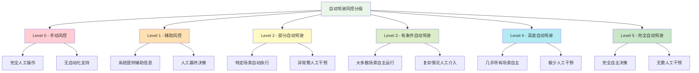
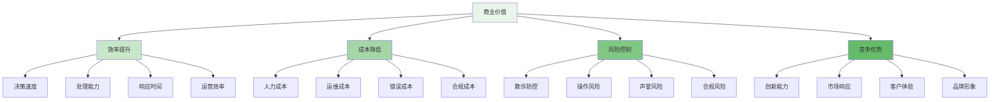

风控平台的"自动驾驶"愿景是指通过人工智能和自动化技术，实现风控系统的自主决策、自我优化和持续进化，最终达到无需人工干预的完全自主风控状态。这一愿景代表了智能风控发展的最高阶段，将彻底改变传统风控模式，构建更加智能、高效和前瞻性的风险防控体系。本章将深入探讨自动驾驶风控的核心理念、技术架构、实现路径和未来展望。

## 自动驾驶风控的核心理念

自动驾驶风控借鉴了自动驾驶汽车的技术理念，通过构建具备自主感知、智能决策、自动执行和持续学习能力的风控系统，实现从人工干预到完全自主的转变。

### 自动驾驶风控的分级模型



### 自动驾驶风控的核心能力

```yaml
# 自动驾驶风控核心能力体系
autonomous_risk_control_capabilities:
  autonomous_perception:
    name: "自主感知"
    description: "系统能够自主感知和理解风险环境"
    capabilities:
      - real_time_monitoring:
          name: "实时监控"
          description: "持续监控业务环境和风险态势"
          technologies:
            - "流式数据处理"
            - "实时特征计算"
            - "异常检测算法"
            - "态势感知引擎"
      
      - threat_intelligence:
          name: "威胁情报"
          description: "自动收集和分析威胁信息"
          technologies:
            - "威胁情报平台"
            - "情报聚合引擎"
            - "威胁评分模型"
            - "情报共享机制"
      
      - behavioral_analysis:
          name: "行为分析"
          description: "深度分析用户和系统行为模式"
          technologies:
            - "用户画像建模"
            - "行为序列分析"
            - "异常模式识别"
            - "预测性分析"
  
  autonomous_decision:
    name: "自主决策"
    description: "系统能够自主制定风险防控策略"
    capabilities:
      - risk_quantification:
          name: "风险量化"
          description: "精确量化各类风险的概率和影响"
          technologies:
            - "概率风险模型"
            - "蒙特卡洛模拟"
            - "风险价值计算"
            - "情景分析引擎"
      
      - strategy_generation:
          name: "策略生成"
          description: "自动生成最优风险防控策略"
          technologies:
            - "强化学习算法"
            - "优化算法"
            - "博弈论模型"
            - "专家系统"
      
      - decision_optimization:
          name: "决策优化"
          description: "持续优化决策效果和效率"
          technologies:
            - "多目标优化"
            - "在线学习"
            - "A/B测试框架"
            - "反馈控制系统"
  
  autonomous_execution:
    name: "自主执行"
    description: "系统能够自主执行防控措施"
    capabilities:
      - automated_response:
          name: "自动响应"
          description: "自动执行风险防控措施"
          technologies:
            - "自动化编排"
            - "工作流引擎"
            - "API集成平台"
            - "执行监控系统"
      
      - dynamic_adjustment:
          name: "动态调整"
          description: "根据环境变化动态调整策略"
          technologies:
            - "自适应控制"
            - "反馈调节"
            - "参数自动调优"
            - "策略热更新"
      
      - resource_orchestration:
          name: "资源编排"
          description: "智能调度和配置防控资源"
          technologies:
            - "容器编排"
            - "资源调度算法"
            - "弹性伸缩"
            - "负载均衡"
  
  autonomous_learning:
    name: "自主学习"
    description: "系统能够从经验中持续学习改进"
    capabilities:
      - experience_accumulation:
          name: "经验积累"
          description: "自动收集和整理防控经验"
          technologies:
            - "日志分析系统"
            - "经验数据库"
            - "知识图谱"
            - "案例管理系统"
      
      - pattern_recognition:
          name: "模式识别"
          description: "识别风险模式和发展趋势"
          technologies:
            - "机器学习算法"
            - "深度学习模型"
            - "聚类分析"
            - "关联规则挖掘"
      
      - continuous_improvement:
          name: "持续改进"
          description: "持续优化系统性能和效果"
          technologies:
            - "在线学习"
            - "增量学习"
            - "模型更新机制"
            - "效果评估系统"
  
  autonomous_evolution:
    name: "自主进化"
    description: "系统能够自主适应和进化升级"
    capabilities:
      - self_adaptation:
          name: "自我适应"
          description: "根据环境变化自主调整架构"
          technologies:
            - "自适应架构"
            - "微服务治理"
            - "智能路由"
            - "动态配置"
      
      - intelligent_upgrade:
          name: "智能升级"
          description: "自主识别和实施系统升级"
          technologies:
            - "AIOps平台"
            - "智能运维"
            - "自动化部署"
            - "灰度发布"
      
      - predictive_evolution:
          name: "预测进化"
          description: "预测未来需求并提前进化"
          technologies:
            - "趋势预测"
            - "需求分析"
            - "架构规划"
            - "技术路线图"
```

## 自动驾驶风控技术架构

实现自动驾驶风控需要构建一个高度智能化、模块化和可扩展的技术架构体系。

### 核心架构组件

```python
class AutonomousRiskControlSystem:
    def __init__(self):
        self.perception_engine = PerceptionEngine()
        self.decision_engine = DecisionEngine()
        self.execution_engine = ExecutionEngine()
        self.learning_engine = LearningEngine()
        self.evolution_engine = EvolutionEngine()
        self.orchestration_layer = OrchestrationLayer()
        self.monitoring_system = MonitoringSystem()
    
    def autonomous_risk_control_cycle(self, environment_state):
        """自动驾驶风控循环"""
        # 1. 自主感知
        perception_result = self.perception_engine.perceive(environment_state)
        
        # 2. 自主决策
        decision_result = self.decision_engine.decide(perception_result)
        
        # 3. 自主执行
        execution_result = self.execution_engine.execute(decision_result)
        
        # 4. 自主学习
        learning_result = self.learning_engine.learn(execution_result)
        
        # 5. 自主进化
        evolution_result = self.evolution_engine.evolve(learning_result)
        
        # 6. 系统编排
        orchestration_result = self.orchestration_layer.orchestrate(
            perception_result,
            decision_result,
            execution_result,
            learning_result,
            evolution_result
        )
        
        # 7. 状态监控
        monitoring_result = self.monitoring_system.monitor(orchestration_result)
        
        return AutonomousRiskControlCycleResult(
            perception=perception_result,
            decision=decision_result,
            execution=execution_result,
            learning=learning_result,
            evolution=evolution_result,
            orchestration=orchestration_result,
            monitoring=monitoring_result,
            timestamp=datetime.now()
        )
    
    def initialize_system(self, configuration):
        """系统初始化"""
        # 1. 组件初始化
        self.perception_engine.initialize(configuration.perception)
        self.decision_engine.initialize(configuration.decision)
        self.execution_engine.initialize(configuration.execution)
        self.learning_engine.initialize(configuration.learning)
        self.evolution_engine.initialize(configuration.evolution)
        
        # 2. 系统配置
        self.orchestration_layer.configure(configuration.orchestration)
        self.monitoring_system.configure(configuration.monitoring)
        
        # 3. 启动监控
        self.monitoring_system.start_monitoring()
        
        # 4. 系统自检
        system_health = self.perform_system_health_check()
        
        return SystemInitializationResult(
            components={
                'perception': self.perception_engine,
                'decision': self.decision_engine,
                'execution': self.execution_engine,
                'learning': self.learning_engine,
                'evolution': self.evolution_engine
            },
            orchestration=self.orchestration_layer,
            monitoring=self.monitoring_system,
            health=system_health,
            timestamp=datetime.now()
        )

class PerceptionEngine:
    def __init__(self):
        self.environment_monitor = EnvironmentMonitor()
        self.threat_intelligence = ThreatIntelligenceCenter()
        self.behavior_analyzer = BehaviorAnalyzer()
        self.situation_assessor = SituationAssessor()
    
    def perceive(self, environment_state):
        """感知环境状态"""
        # 1. 环境监控
        environment_data = self.environment_monitor.monitor(environment_state)
        
        # 2. 威胁情报收集
        threat_data = self.threat_intelligence.collect_intelligence()
        
        # 3. 行为分析
        behavior_analysis = self.behavior_analyzer.analyze_behaviors(environment_data)
        
        # 4. 情境评估
        situation_assessment = self.situation_assessor.assess_situation(
            environment_data,
            threat_data,
            behavior_analysis
        )
        
        return PerceptionResult(
            environment=environment_data,
            threats=threat_data,
            behaviors=behavior_analysis,
            situation=situation_assessment,
            timestamp=datetime.now()
        )
    
    def initialize(self, config):
        """初始化感知引擎"""
        self.environment_monitor.configure(config.environment_monitor)
        self.threat_intelligence.configure(config.threat_intelligence)
        self.behavior_analyzer.configure(config.behavior_analyzer)
        self.situation_assessor.configure(config.situation_assessor)

class DecisionEngine:
    def __init__(self):
        self.risk_quantifier = RiskQuantifier()
        self.strategy_generator = StrategyGenerator()
        self.decision_optimizer = DecisionOptimizer()
        self.policy_manager = PolicyManager()
    
    def decide(self, perception_result):
        """制定决策"""
        # 1. 风险量化
        risk_quantification = self.risk_quantifier.quantify(perception_result)
        
        # 2. 策略生成
        strategy_generation = self.strategy_generator.generate(risk_quantification)
        
        # 3. 决策优化
        decision_optimization = self.decision_optimizer.optimize(strategy_generation)
        
        # 4. 策略验证
        policy_validation = self.policy_manager.validate_policies(decision_optimization)
        
        return DecisionResult(
            risks=risk_quantification,
            strategies=strategy_generation,
            optimization=decision_optimization,
            validation=policy_validation,
            timestamp=datetime.now()
        )
    
    def initialize(self, config):
        """初始化决策引擎"""
        self.risk_quantifier.configure(config.risk_quantifier)
        self.strategy_generator.configure(config.strategy_generator)
        self.decision_optimizer.configure(config.decision_optimizer)
        self.policy_manager.configure(config.policy_manager)
```

### 智能决策算法

```go
type IntelligentDecisionAlgorithms struct {
    ReinforcementLearning  ReinforcementLearning
    GameTheory             GameTheory
    MultiObjectiveOptimization MultiObjectiveOptimization
    PredictiveAnalytics    PredictiveAnalytics
}

type ReinforcementLearning struct {
    AlgorithmType          string    `json:"algorithm_type"`          // 算法类型
    LearningRate           float64   `json:"learning_rate"`           // 学习率
    ExplorationStrategy    string    `json:"exploration_strategy"`    // 探索策略
    RewardFunction         string    `json:"reward_function"`         // 奖励函数
}

func (ida *IntelligentDecisionAlgorithms) ConfigureReinforcementLearning() ReinforcementLearning {
    return ReinforcementLearning{
        AlgorithmType:       "Deep Q-Network (DQN)",  // 深度Q网络
        LearningRate:        0.001,                  // 学习率
        ExplorationStrategy: "ε-greedy",             // ε-贪婪探索
        RewardFunction:      "risk_reward_function", // 风控奖励函数
    }
}

type GameTheory struct {
    GameModel              string    `json:"game_model"`              // 博弈模型
    EquilibriumConcept     string    `json:"equilibrium_concept"`     // 均衡概念
    StrategySpace          []string  `json:"strategy_space"`          // 策略空间
    PayoffFunction         string    `json:"payoff_function"`         // 收益函数
}

func (ida *IntelligentDecisionAlgorithms) SetupGameTheory() GameTheory {
    return GameTheory{
        GameModel:          "Stackelberg Game",      // 斯塔克伯格博弈
        EquilibriumConcept: "Stackelberg Equilibrium", // 斯塔克伯格均衡
        StrategySpace:      []string{"aggressive", "moderate", "conservative"}, // 策略空间
        PayoffFunction:     "security_payoff",       // 安全收益函数
    }
}

type MultiObjectiveOptimization struct {
    Objectives             []string  `json:"objectives"`             // 优化目标
    Constraints            []string  `json:"constraints"`            // 约束条件
    OptimizationAlgorithm  string    `json:"optimization_algorithm"`  // 优化算法
    TradeOffAnalysis       bool      `json:"trade_off_analysis"`      // 权衡分析
}

func (ida *IntelligentDecisionAlgorithms) ImplementMultiObjectiveOptimization() MultiObjectiveOptimization {
    return MultiObjectiveOptimization{
        Objectives: []string{
            "风险最小化",
            "成本最小化",
            "用户体验优化",
            "合规性保障",
        },
        Constraints: []string{
            "响应时间限制",
            "资源使用限制",
            "合规性约束",
            "业务连续性要求",
        },
        OptimizationAlgorithm: "NSGA-II",  // 非支配排序遗传算法
        TradeOffAnalysis:      true,       // 启用权衡分析
    }
}
```

## 自主学习与进化机制

自动驾驶风控系统的核心在于其自主学习和持续进化的能力，这使得系统能够不断适应环境变化并提升防控效果。

### 经验学习系统

```typescript
interface ExperienceLearningSystem {
    // 经验收集
    collectExperience(interaction: RiskInteraction): Promise<ExperienceData>;
    
    // 模式识别
    recognizePatterns(experience: ExperienceData): Promise<PatternRecognitionResult>;
    
    // 知识提取
    extractKnowledge(patterns: PatternRecognitionResult): Promise<KnowledgeExtractionResult>;
    
    // 模型更新
    updateModels(knowledge: KnowledgeExtractionResult): Promise<ModelUpdateResult>;
}

class AutonomousLearningEngine implements ExperienceLearningSystem {
    private experienceCollector: ExperienceCollector;
    private patternRecognizer: PatternRecognizer;
    private knowledgeExtractor: KnowledgeExtractor;
    private modelUpdater: ModelUpdater;
    
    async collectExperience(interaction: RiskInteraction): Promise<ExperienceData> {
        // 1. 交互数据收集
        const interactionData = await this.experienceCollector.collectInteractionData(interaction);
        
        // 2. 结果数据收集
        const outcomeData = await this.experienceCollector.collectOutcomeData(interaction);
        
        // 3. 环境数据收集
        const environmentData = await this.experienceCollector.collectEnvironmentData(interaction);
        
        // 4. 经验整合
        const integratedExperience = this.experienceCollector.integrateExperience(
            interactionData,
            outcomeData,
            environmentData
        );
        
        return new ExperienceData({
            interaction: interactionData,
            outcome: outcomeData,
            environment: environmentData,
            integrated: integratedExperience,
            timestamp: new Date()
        });
    }
    
    async recognizePatterns(experience: ExperienceData): Promise<PatternRecognitionResult> {
        // 1. 特征提取
        const features = await this.patternRecognizer.extractFeatures(experience);
        
        // 2. 聚类分析
        const clusters = await this.patternRecognizer.performClustering(features);
        
        // 3. 关联规则挖掘
        const associationRules = await this.patternRecognizer.mineAssociationRules(experience);
        
        // 4. 异常模式检测
        const anomalyPatterns = await this.patternRecognizer.detectAnomalyPatterns(experience);
        
        return new PatternRecognitionResult({
            features: features,
            clusters: clusters,
            associations: associationRules,
            anomalies: anomalyPatterns,
            timestamp: new Date()
        });
    }
    
    async extractKnowledge(patterns: PatternRecognitionResult): Promise<KnowledgeExtractionResult> {
        // 1. 规则提取
        const extractedRules = await this.knowledgeExtractor.extractRules(patterns);
        
        // 2. 模型参数优化
        const optimizedParameters = await this.knowledgeExtractor.optimizeModelParameters(patterns);
        
        // 3. 策略建议生成
        const strategyRecommendations = await this.knowledgeExtractor.generateStrategyRecommendations(patterns);
        
        // 4. 知识图谱构建
        const knowledgeGraph = await this.knowledgeExtractor.buildKnowledgeGraph(patterns);
        
        return new KnowledgeExtractionResult({
            rules: extractedRules,
            parameters: optimizedParameters,
            strategies: strategyRecommendations,
            knowledgeGraph: knowledgeGraph,
            timestamp: new Date()
        });
    }
    
    async updateModels(knowledge: KnowledgeExtractionResult): Promise<ModelUpdateResult> {
        // 1. 模型版本管理
        const versionControl = await this.modelUpdater.manageModelVersions(knowledge);
        
        // 2. 在线学习更新
        const onlineUpdates = await this.modelUpdater.performOnlineLearning(knowledge);
        
        // 3. 增量模型训练
        const incrementalTraining = await this.modelUpdater.trainIncrementalModels(knowledge);
        
        // 4. 模型效果验证
        const validationResults = await this.modelUpdater.validateModelUpdates(incrementalTraining);
        
        return new ModelUpdateResult({
            version: versionControl,
            online: onlineUpdates,
            incremental: incrementalTraining,
            validation: validationResults,
            timestamp: new Date()
        });
    }
    
    async continuousLearningLoop(): Promise<ContinuousLearningResult> {
        // 持续学习循环
        while (this.isLearningEnabled()) {
            // 1. 收集新经验
            const newExperience = await this.collectLatestExperience();
            
            // 2. 识别新模式
            const patterns = await this.recognizePatterns(newExperience);
            
            // 3. 提取新知识
            const knowledge = await this.extractKnowledge(patterns);
            
            // 4. 更新模型
            const modelUpdates = await this.updateModels(knowledge);
            
            // 5. 评估学习效果
            const learningEvaluation = await this.evaluateLearningEffectiveness(modelUpdates);
            
            // 6. 调整学习策略
            await this.adjustLearningStrategy(learningEvaluation);
            
            // 等待下一个学习周期
            await this.waitForNextLearningCycle();
        }
        
        return new ContinuousLearningResult({
            status: "completed",
            timestamp: new Date()
        });
    }
}
```

### 自适应进化机制

```yaml
# 自适应进化机制
adaptive_evolution_mechanism:
  system_self_adaptation:
    name: "系统自适应"
    description: "系统根据环境变化自主调整架构和配置"
    mechanisms:
      - dynamic_architecture:
          name: "动态架构"
          description: "根据负载和需求动态调整系统架构"
          implementation:
            - "微服务自动扩缩容"
            - "容器资源动态分配"
            - "网络拓扑自适应调整"
            - "数据流路径优化"
          benefits:
            - "资源利用效率提升"
            - "系统性能优化"
            - "故障自愈能力"
            - "弹性伸缩支持"
      
      - configuration_adaptation:
          name: "配置自适应"
          description: "根据运行状态自动调整系统配置"
          implementation:
            - "参数自动调优"
            - "策略动态调整"
            - "阈值自适应设置"
            - "算法参数优化"
          benefits:
            - "运行效率提升"
            - "适应性增强"
            - "维护成本降低"
            - "性能持续优化"
  
  intelligent_upgrade:
    name: "智能升级"
    description: "系统自主识别和实施升级"
    mechanisms:
      - autonomous_detection:
          name: "自主检测"
          description: "自动检测系统缺陷和改进机会"
          implementation:
            - "缺陷自动识别"
            - "性能瓶颈检测"
            - "安全漏洞扫描"
            - "技术债务评估"
          benefits:
            - "问题及时发现"
            - "风险主动防控"
            - "质量持续提升"
            - "技术先进性保持"
      
      - self_directed_upgrade:
          name: "自主升级"
          description: "系统自主规划和执行升级"
          implementation:
            - "升级路径规划"
            - "风险评估分析"
            - "自动化部署实施"
            - "效果验证确认"
          benefits:
            - "升级效率提升"
            - "业务中断减少"
            - "升级风险降低"
            - "运维负担减轻"
  
  predictive_evolution:
    name: "预测进化"
    description: "系统预测未来需求并提前进化"
    mechanisms:
      - trend_prediction:
          name: "趋势预测"
          description: "预测技术发展趋势和业务需求变化"
          implementation:
            - "技术趋势分析"
            - "业务需求预测"
            - "风险态势预判"
            - "能力需求规划"
          benefits:
            - "前瞻性规划"
            - "竞争优势保持"
            - "资源合理配置"
            - "发展路径清晰"
      
      - proactive_evolution:
          name: "主动进化"
          description: "提前实施系统进化以适应未来需求"
          implementation:
            - "技术预研"
            - "架构演进"
            - "能力储备"
            - "生态建设"
          benefits:
            - "发展主动权"
            - "创新能力提升"
            - "市场响应加速"
            - "可持续发展"
```

## 实施路径与关键技术

实现自动驾驶风控需要分阶段推进，并攻克一系列关键技术难题。

### 实施路径规划

```python
class AutonomousRiskControlImplementation:
    def __init__(self):
        self.roadmap_planner = RoadmapPlanner()
        self.technology_assessor = TechnologyAssessor()
        self.resource_allocator = ResourceAllocator()
        self.risk_manager = RiskManager()
    
    def create_implementation_roadmap(self, current_state, target_state):
        """创建实施路线图"""
        # 1. 现状评估
        current_assessment = self.assess_current_state(current_state)
        
        # 2. 目标分析
        target_analysis = self.analyze_target_state(target_state)
        
        # 3. 差距识别
        gap_analysis = self.identify_gaps(current_assessment, target_analysis)
        
        # 4. 路径规划
        implementation_roadmap = self.roadmap_planner.plan_roadmap(gap_analysis)
        
        # 5. 资源规划
        resource_plan = self.resource_allocator.allocate_resources(implementation_roadmap)
        
        # 6. 风险评估
        risk_assessment = self.risk_manager.assess_implementation_risks(implementation_roadmap)
        
        return ImplementationRoadmap(
            current=current_assessment,
            target=target_analysis,
            gaps=gap_analysis,
            roadmap=implementation_roadmap,
            resources=resource_plan,
            risks=risk_assessment,
            timestamp=datetime.now()
        )
    
    def assess_current_state(self, current_state):
        """评估当前状态"""
        # 1. 技术能力评估
        technical_capabilities = self.evaluate_technical_capabilities(current_state)
        
        # 2. 组织成熟度评估
        organizational_maturity = self.assess_organizational_maturity(current_state)
        
        # 3. 数据基础评估
        data_foundation = self.evaluate_data_foundation(current_state)
        
        # 4. 治理体系评估
        governance_framework = self.assess_governance_framework(current_state)
        
        return CurrentStateAssessment(
            technical=technical_capabilities,
            organizational=organizational_maturity,
            data=data_foundation,
            governance=governance_framework,
            overall=self.calculate_overall_maturity(
                technical_capabilities,
                organizational_maturity,
                data_foundation,
                governance_framework
            )
        )
    
    def plan_phase_implementations(self, roadmap):
        """规划阶段实施"""
        phase_implementations = []
        
        for phase in roadmap.phases:
            # 1. 阶段目标定义
            phase_objectives = self.define_phase_objectives(phase)
            
            # 2. 关键任务识别
            key_tasks = self.identify_key_tasks(phase)
            
            # 3. 里程碑设置
            milestones = self.set_phase_milestones(phase)
            
            # 4. 风险管控
            risk_controls = self.plan_phase_risk_controls(phase)
            
            # 5. 成果评估
            success_metrics = self.define_success_metrics(phase)
            
            phase_implementation = PhaseImplementationPlan(
                phase=phase,
                objectives=phase_objectives,
                tasks=key_tasks,
                milestones=milestones,
                risks=risk_controls,
                metrics=success_metrics,
                timeline=phase.timeline,
                budget=phase.budget
            )
            
            phase_implementations.append(phase_implementation)
        
        return phase_implementations

class RoadmapPlanner:
    def plan_roadmap(self, gap_analysis):
        """规划实施路线图"""
        # 1. 阶段划分
        phases = self.divide_into_phases(gap_analysis)
        
        # 2. 依赖关系分析
        dependencies = self.analyze_phase_dependencies(phases)
        
        # 3. 时间规划
        timeline = self.create_timeline(phases, dependencies)
        
        # 4. 资源需求估算
        resource_requirements = self.estimate_resource_requirements(phases)
        
        # 5. 预算规划
        budget_plan = self.plan_budget(resource_requirements)
        
        return ImplementationRoadmap(
            phases=phases,
            dependencies=dependencies,
            timeline=timeline,
            resources=resource_requirements,
            budget=budget_plan
        )
    
    def divide_into_phases(self, gap_analysis):
        """划分为实施阶段"""
        phases = [
            ImplementationPhase(
                name="基础能力建设",
                description="构建自动驾驶风控的基础技术能力和数据基础",
                objectives=[
                    "建立实时数据处理能力",
                    "完善风险感知体系",
                    "构建基础决策引擎",
                    "建立监控评估机制"
                ],
                duration="6-12个月",
                priority="high"
            ),
            ImplementationPhase(
                name="智能决策提升",
                description="提升系统的智能决策和自主执行能力",
                objectives=[
                    "实现风险量化分析",
                    "构建策略生成引擎",
                    "建立自动执行机制",
                    "完善决策优化能力"
                ],
                duration="12-18个月",
                priority="high"
            ),
            ImplementationPhase(
                name="自主学习进化",
                description="实现系统的自主学习和持续进化能力",
                objectives=[
                    "建立经验学习系统",
                    "构建模式识别能力",
                    "实现知识自动提取",
                    "建立模型自更新机制"
                ],
                duration="18-24个月",
                priority="medium"
            ),
            ImplementationPhase(
                name="完全自主运行",
                description="实现系统的完全自主运行和预测进化",
                objectives=[
                    "达到L4级自动驾驶风控",
                    "实现预测性风险防控",
                    "建立自主进化机制",
                    "实现完全无人干预"
                ],
                duration="24-36个月",
                priority="low"
            )
        ]
        
        return phases
```

### 关键技术突破

```go
type KeyTechnologyBreakthroughs struct {
    AdvancedAIAlgorithms   AdvancedAIAlgorithms
    RealTimeProcessing     RealTimeProcessing
    PrivacyPreserving      PrivacyPreserving
    SystemIntegration      SystemIntegration
}

type AdvancedAIAlgorithms struct {
    DeepReinforcementLearning bool    `json:"deep_reinforcement_learning"` // 深度强化学习
    FederatedLearning        bool    `json:"federated_learning"`         // 联邦学习
    TransferLearning         bool    `json:"transfer_learning"`          // 迁移学习
    ExplainableAI            bool    `json:"explainable_ai"`             // 可解释AI
}

func (ktb *KeyTechnologyBreakthroughs) ImplementAdvancedAI() AdvancedAIAlgorithms {
    return AdvancedAIAlgorithms{
        DeepReinforcementLearning: true,  // 启用深度强化学习
        FederatedLearning:        true,  // 启用联邦学习
        TransferLearning:         true,  // 启用迁移学习
        ExplainableAI:            true,  // 启用可解释AI
    }
}

type RealTimeProcessing struct {
    StreamProcessing         bool    `json:"stream_processing"`          // 流式处理
    EdgeComputing            bool    `json:"edge_computing"`             // 边缘计算
    InMemoryComputing        bool    `json:"in_memory_computing"`        // 内存计算
    ParallelProcessing       bool    `json:"parallel_processing"`        // 并行处理
}

func (ktb *KeyTechnologyBreakthroughs) EnableRealTimeProcessing() RealTimeProcessing {
    return RealTimeProcessing{
        StreamProcessing:   true,  // 启用流式处理
        EdgeComputing:      true,  // 启用边缘计算
        InMemoryComputing:  true,  // 启用内存计算
        ParallelProcessing: true,  // 启用并行处理
    }
}

type PrivacyPreserving struct {
    HomomorphicEncryption    bool    `json:"homomorphic_encryption"`     // 同态加密
    DifferentialPrivacy      bool    `json:"differential_privacy"`       // 差分隐私
    SecureMultiPartyComputation bool `json:"secure_multi_party_computation"` // 安全多方计算
    ZeroKnowledgeProof       bool    `json:"zero_knowledge_proof"`       // 零知识证明
}

func (ktb *KeyTechnologyBreakthroughs) ApplyPrivacyPreserving() PrivacyPreserving {
    return PrivacyPreserving{
        HomomorphicEncryption:        true,  // 启用同态加密
        DifferentialPrivacy:          true,  // 启用差分隐私
        SecureMultiPartyComputation: true,  // 启用安全多方计算
        ZeroKnowledgeProof:          true,  // 启用零知识证明
    }
}
```

## 挑战与应对策略

实现自动驾驶风控面临诸多挑战，需要制定相应的应对策略。

### 主要挑战分析

```yaml
# 自动驾驶风控主要挑战
autonomous_risk_control_challenges:
  technical_challenges:
    name: "技术挑战"
    description: "实现自动驾驶风控面临的技术难题"
    challenges:
      - algorithm_complexity:
          name: "算法复杂性"
          description: "需要处理复杂的多目标优化和不确定性决策"
          mitigation:
            - "分层决策架构"
            - "模块化算法设计"
            - "渐进式算法优化"
            - "混合智能方法"
      
      - data_quality:
          name: "数据质量"
          description: "高质量训练数据获取困难，标注成本高"
          mitigation:
            - "主动学习策略"
            - "半监督学习"
            - "数据增强技术"
            - "合成数据生成"
      
      - real_time_performance:
          name: "实时性能"
          description: "需要在毫秒级时间内完成复杂决策"
          mitigation:
            - "边缘计算部署"
            - "算法加速优化"
            - "缓存预计算"
            - "异步处理机制"
  
  business_challenges:
    name: "业务挑战"
    description: "业务层面面临的挑战和风险"
    challenges:
      - trust_building:
          name: "信任建立"
          description: "业务方对完全自主系统的信任度不足"
          mitigation:
            - "透明度提升"
            - "可解释性增强"
            - "渐进式部署"
            - "人机协作模式"
      
      - liability_allocation:
          name: "责任分配"
          description: "自主决策的责任归属问题"
          mitigation:
            - "法律框架完善"
            - "保险机制建立"
            - "审计轨迹完整"
            - "责任边界清晰"
      
      - organizational_change:
          name: "组织变革"
          description: "需要组织结构和流程的重大调整"
          mitigation:
            - "变革管理"
            - "技能培训"
            - "文化转型"
            - "激励机制"
  
  regulatory_challenges:
    name: "监管挑战"
    description: "监管合规方面面临的挑战"
    challenges:
      - compliance_ambiguity:
          name: "合规模糊性"
          description: "现有法规对自主系统覆盖不足"
          mitigation:
            - "监管沙盒试点"
            - "标准制定参与"
            - "合规框架建设"
            - "监管沟通机制"
      
      - audit_ability:
          name: "审计能力"
          description: "自主系统的可审计性挑战"
          mitigation:
            - "审计接口设计"
            - "决策过程记录"
            - "可追溯性保障"
            - "第三方审计"
      
      - ethical_considerations:
          name: "伦理考量"
          description: "AI决策的伦理和公平性问题"
          mitigation:
            - "伦理框架建立"
            - "公平性检测"
            - "偏见消除"
            - "人文关怀"
```

## 发展前景与价值展望

自动驾驶风控代表了智能风控发展的未来方向，具有巨大的商业价值和社会意义。

### 商业价值分析



### 社会价值展望

1. **安全价值**：通过更精准的风险识别和防控，保护用户财产安全和社会稳定

2. **效率价值**：大幅提升风险处理效率，释放人力资源用于更高价值的工作

3. **公平价值**：通过算法的标准化和透明化，减少人为偏见，促进公平公正

4. **创新价值**：推动风控技术的创新发展，为其他领域提供技术借鉴

通过系统性地推进自动驾驶风控的建设，企业将能够在未来的竞争中占据有利地位，构建更加智能、高效和安全的风险防控体系。这不仅是技术发展的必然趋势，也是应对日益复杂风险环境的必要举措。

自动驾驶风控的实现将标志着风控领域的一次重大变革，从被动响应转向主动预防，从人工决策转向智能自主，从静态规则转向动态适应。这一愿景的实现需要技术创新、组织变革、监管完善和生态协同的共同努力，但其带来的价值和影响将是深远而持久的。