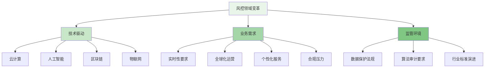
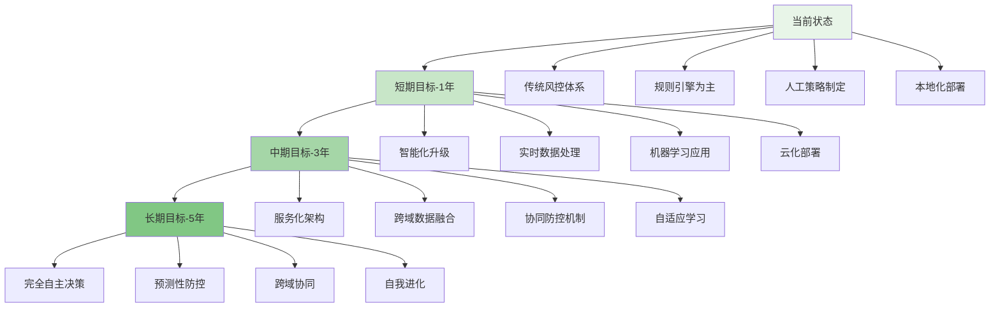

随着数字化浪潮的深入推进和技术创新的不断演进，企业级智能风控平台正面临着前所未有的发展机遇和挑战。从风控即服务（RaaS）到云原生架构，从跨行业风险信息共享到元宇宙中的新型风险，再到风控平台的"自动驾驶"愿景，未来的风控体系将更加智能化、协同化和前瞻性。本章将深入探讨这些前沿趋势，为构建下一代智能风控平台提供战略指引。

## 风控领域的变革浪潮

在数字化转型的大背景下，风控领域正经历着深刻的变革。传统的风控模式已难以应对日益复杂的业务场景和不断演进的威胁形态，新兴技术的融合应用正在重塑风控的理念和实践。

### 技术驱动的范式转变



### 风控生态系统演进

```yaml
# 风控生态系统演进路径
risk_control_ecosystem_evolution:
  phase_1_traditional_risk_control:
    name: "传统风控阶段"
    time_period: "2000-2010"
    characteristics:
      - "规则引擎为主"
      - "人工策略制定"
      - "本地化部署"
      - "单一业务场景"
    limitations:
      - "响应速度慢"
      - "扩展性差"
      - "维护成本高"
      - "智能化程度低"
  
  phase_2_intelligent_risk_control:
    name: "智能风控阶段"
    time_period: "2010-2020"
    characteristics:
      - "机器学习模型"
      - "实时数据处理"
      - "多维度特征"
      - "自动化决策"
    limitations:
      - "数据孤岛问题"
      - "模型更新滞后"
      - "解释性不足"
      - "部署复杂"
  
  phase_3_ecosystem_risk_control:
    name: "生态风控阶段"
    time_period: "2020-2030"
    characteristics:
      - "服务化架构"
      - "跨域数据融合"
      - "协同防控机制"
      - "自适应学习"
    key_features:
      - "风控即服务(RaaS)"
      - "云原生部署"
      - "联邦学习"
      - "智能对抗"
  
  phase_4_autonomous_risk_control:
    name: "自主风控阶段"
    time_period: "2030+"
    characteristics:
      - "完全自主决策"
      - "预测性防控"
      - "跨域协同"
      - "自我进化"
    key_features:
      - "自动驾驶风控"
      - "元宇宙风控"
      - "量子安全"
      - "脑机接口风控"
```

## 风控即服务（RaaS）与云原生风控

风控即服务（Risk Control as a Service, RaaS）是云计算和微服务架构在风控领域的深度应用，通过将风控能力服务化，实现资源的弹性伸缩和能力的按需使用。

### RaaS架构设计

```python
class RiskControlAsAService:
    def __init__(self, config):
        self.config = config
        self.service_registry = ServiceRegistry()
        self.api_gateway = APIGateway()
        self.monitoring_system = MonitoringSystem()
        self.billing_engine = BillingEngine()
    
    def deploy_risk_service(self, service_spec):
        """部署风控服务"""
        # 1. 服务容器化
        container_spec = self.create_container_spec(service_spec)
        
        # 2. 资源调度
        resource_allocation = self.allocate_resources(container_spec)
        
        # 3. 服务注册
        service_endpoint = self.service_registry.register_service(
            service_spec.service_name,
            container_spec,
            resource_allocation
        )
        
        # 4. 负载均衡配置
        self.api_gateway.configure_load_balancing(
            service_spec.service_name,
            service_endpoint
        )
        
        # 5. 监控告警设置
        self.monitoring_system.setup_monitoring(
            service_spec.service_name,
            service_spec.metrics
        )
        
        return service_endpoint
    
    def scale_risk_service(self, service_name, scale_factor):
        """弹性扩缩容风控服务"""
        # 1. 获取当前服务状态
        current_state = self.service_registry.get_service_state(service_name)
        
        # 2. 计算目标资源
        target_resources = self.calculate_target_resources(
            current_state.resources,
            scale_factor
        )
        
        # 3. 执行扩缩容
        scaling_result = self.execute_scaling(
            service_name,
            target_resources
        )
        
        # 4. 更新服务注册
        self.service_registry.update_service_state(
            service_name,
            scaling_result.new_state
        )
        
        return scaling_result
    
    def meter_service_usage(self, service_name):
        """计量服务使用情况"""
        # 1. 收集使用数据
        usage_data = self.monitoring_system.collect_usage_data(service_name)
        
        # 2. 计算费用
        billing_info = self.billing_engine.calculate_billing(usage_data)
        
        # 3. 生成账单
        invoice = self.billing_engine.generate_invoice(billing_info)
        
        return invoice

class CloudNativeRiskControlPlatform:
    def __init__(self):
        self.kubernetes_client = KubernetesClient()
        self.service_mesh = ServiceMesh()
        self.serverless_engine = ServerlessEngine()
        self.edge_computing = EdgeComputing()
    
    def deploy_cloud_native_architecture(self, platform_config):
        """部署云原生风控架构"""
        # 1. 创建命名空间
        namespace = self.kubernetes_client.create_namespace(
            platform_config.namespace
        )
        
        # 2. 部署核心服务
        core_services = self.deploy_core_services(platform_config.core_services)
        
        # 3. 配置服务网格
        service_mesh_config = self.service_mesh.configure_mesh(
            core_services,
            platform_config.mesh_policies
        )
        
        # 4. 部署无服务器函数
        serverless_functions = self.deploy_serverless_functions(
            platform_config.serverless_functions
        )
        
        # 5. 配置边缘计算节点
        edge_nodes = self.edge_computing.configure_edge_nodes(
            platform_config.edge_locations
        )
        
        return CloudNativePlatform(
            namespace=namespace,
            core_services=core_services,
            service_mesh=service_mesh_config,
            serverless_functions=serverless_functions,
            edge_nodes=edge_nodes
        )
    
    def implement_microservices_governance(self, services):
        """实现微服务治理"""
        # 1. 服务发现配置
        discovery_config = self.configure_service_discovery(services)
        
        # 2. 流量管理策略
        traffic_policies = self.configure_traffic_management(services)
        
        # 3. 安全策略实施
        security_policies = self.implement_security_policies(services)
        
        # 4. 熔断降级机制
        circuit_breakers = self.configure_circuit_breakers(services)
        
        # 5. 限流策略
        rate_limiting = self.configure_rate_limiting(services)
        
        return MicroservicesGovernance(
            discovery=discovery_config,
            traffic=traffic_policies,
            security=security_policies,
            circuit_breakers=circuit_breakers,
            rate_limiting=rate_limiting
        )
```

### 云原生风控优势

```go
type CloudNativeRiskControlBenefits struct {
    Scalability      ScalabilityBenefits
    Resilience       ResilienceBenefits
    CostEfficiency   CostEfficiencyBenefits
    InnovationSpeed  InnovationBenefits
}

type ScalabilityBenefits struct {
    AutoScaling           bool  `json:"auto_scaling"`
    ResourceUtilization   float64  `json:"resource_utilization"`
    PeakHandlingCapacity  int  `json:"peak_handling_capacity"`
}

func (cnrcb *CloudNativeRiskControlBenefits) AnalyzeScalabilityBenefits() ScalabilityBenefits {
    return ScalabilityBenefits{
        AutoScaling:           true,
        ResourceUtilization:   0.85,  // 85%资源利用率
        PeakHandlingCapacity:  100000, // 10万TPS峰值处理能力
    }
}

type ResilienceBenefits struct {
    HighAvailability     float64  `json:"high_availability"`  // 99.99%可用性
    FaultTolerance       bool     `json:"fault_tolerance"`
    SelfHealing          bool     `json:"self_healing"`
    DisasterRecoveryTime int      `json:"disaster_recovery_time"` // 分钟级恢复
}

func (cnrcb *CloudNativeRiskControlBenefits) AnalyzeResilienceBenefits() ResilienceBenefits {
    return ResilienceBenefits{
        HighAvailability:     0.9999,
        FaultTolerance:       true,
        SelfHealing:          true,
        DisasterRecoveryTime: 5, // 5分钟内恢复
    }
}

type CostEfficiencyBenefits struct {
    ResourcePooling         bool     `json:"resource_pooling"`
    PayPerUse               bool     `json:"pay_per_use"`
    OperationalCostSavings  float64  `json:"operational_cost_savings"` // 30%运营成本节省
    InfrastructureCostSavings float64 `json:"infrastructure_cost_savings"` // 50%基础设施成本节省
}

func (cnrcb *CloudNativeRiskControlBenefits) AnalyzeCostEfficiencyBenefits() CostEfficiencyBenefits {
    return CostEfficiencyBenefits{
        ResourcePooling:              true,
        PayPerUse:                    true,
        OperationalCostSavings:       0.30,
        InfrastructureCostSavings:    0.50,
    }
}
```

## 跨行业风险信息共享与联合防控

在数字化时代，风险往往具有跨行业、跨企业的传播特性，单一企业的风控能力已难以应对复杂的威胁环境。构建跨行业的风险信息共享机制和联合防控体系，成为提升整体风控效能的重要途径。

### 跨行业信息共享架构

```typescript
interface CrossIndustryRiskSharing {
    // 风险信息标准化
    standardizeRiskInformation(data: RiskData): Promise<StandardizedRiskData>;
    
    // 安全信息交换
    secureDataExchange(participants: Participant[]): Promise<ExchangeResult>;
    
    // 联合风险建模
    collaborativeRiskModeling(participants: Participant[], modelSpec: ModelSpec): Promise<CollaborativeModel>;
    
    // 隐私保护计算
    privacyPreservingComputation(data: SharedData, privacyLevel: PrivacyLevel): Promise<ProtectedResult>;
}

class CrossIndustryRiskSharingPlatform implements CrossIndustryRiskSharing {
    private dataStandardizer: DataStandardizer;
    private securityManager: SecurityManager;
    private modelCollaborator: ModelCollaborator;
    private privacyProtector: PrivacyProtector;
    
    async standardizeRiskInformation(data: RiskData): Promise<StandardizedRiskData> {
        // 1. 数据格式标准化
        const standardizedFormat = this.dataStandardizer.standardizeFormat(data);
        
        // 2. 风险标签统一
        const unifiedLabels = this.dataStandardizer.unifyRiskLabels(standardizedFormat);
        
        // 3. 时间戳同步
        const synchronizedData = this.dataStandardizer.synchronizeTimestamps(unifiedLabels);
        
        // 4. 质量检查
        const qualityReport = await this.dataStandardizer.checkDataQuality(synchronizedData);
        
        return new StandardizedRiskData({
            data: synchronizedData,
            quality: qualityReport,
            standard: this.dataStandardizer.getCurrentStandard()
        });
    }
    
    async secureDataExchange(participants: Participant[]): Promise<ExchangeResult> {
        // 1. 身份验证
        const authenticatedParticipants = await this.securityManager.authenticateParticipants(participants);
        
        // 2. 建立安全通道
        const secureChannels = await this.securityManager.establishSecureChannels(authenticatedParticipants);
        
        // 3. 数据加密传输
        const encryptedData = await this.securityManager.encryptAndTransmitData(secureChannels);
        
        // 4. 接收方解密验证
        const decryptedData = await this.securityManager.decryptAndVerifyData(encryptedData);
        
        // 5. 交换结果记录
        const exchangeRecord = await this.securityManager.recordExchange(decryptedData, participants);
        
        return new ExchangeResult({
            participants: authenticatedParticipants,
            data: decryptedData,
            security: exchangeRecord,
            timestamp: new Date()
        });
    }
    
    async collaborativeRiskModeling(participants: Participant[], modelSpec: ModelSpec): Promise<CollaborativeModel> {
        // 1. 模型框架定义
        const modelFramework = this.modelCollaborator.defineModelFramework(modelSpec);
        
        // 2. 联邦学习配置
        const federatedConfig = this.modelCollaborator.configureFederatedLearning(participants, modelFramework);
        
        // 3. 分布式训练
        const trainingResults = await this.modelCollaborator.distributedTraining(federatedConfig);
        
        // 4. 模型聚合
        const aggregatedModel = this.modelCollaborator.aggregateModels(trainingResults);
        
        // 5. 性能评估
        const performanceMetrics = await this.modelCollaborator.evaluateModel(aggregatedModel);
        
        return new CollaborativeModel({
            framework: modelFramework,
            participants: participants,
            model: aggregatedModel,
            performance: performanceMetrics,
            collaboration: federatedConfig
        });
    }
    
    async privacyPreservingComputation(data: SharedData, privacyLevel: PrivacyLevel): Promise<ProtectedResult> {
        // 1. 差分隐私处理
        const differentiallyPrivateData = this.privacyProtector.applyDifferentialPrivacy(data, privacyLevel);
        
        // 2. 同态加密
        const homomorphicallyEncryptedData = this.privacyProtector.applyHomomorphicEncryption(differentiallyPrivateData);
        
        // 3. 安全多方计算
        const secureComputationResult = await this.privacyProtector.performSecureMultiPartyComputation(
            homomorphicallyEncryptedData,
            privacyLevel
        );
        
        // 4. 结果解密
        const decryptedResult = this.privacyProtector.decryptResult(secureComputationResult);
        
        // 5. 隐私保护验证
        const privacyGuarantee = this.privacyProtector.verifyPrivacyGuarantee(decryptedResult, privacyLevel);
        
        return new ProtectedResult({
            result: decryptedResult,
            privacy: privacyGuarantee,
            method: privacyLevel,
            timestamp: new Date()
        });
    }
}
```

### 联合防控机制

```yaml
# 跨行业联合防控机制
cross_industry_collaborative_prevention:
  governance_framework:
    name: "治理框架"
    description: "建立跨行业的风险防控治理机制"
    components:
      - steering_committee:
          name: "指导委员会"
          responsibilities:
            - "制定合作原则"
            - "协调利益冲突"
            - "监督执行情况"
            - "评估合作效果"
          members:
            - "行业协会代表"
            - "监管机构代表"
            - "企业安全负责人"
            - "技术专家"
      
      - working_groups:
          name: "工作组"
          responsibilities:
            - "技术标准制定"
            - "信息共享实施"
            - "联合演练组织"
            - "最佳实践推广"
          focus_areas:
            - "数据标准"
            - "技术实现"
            - "运营管理"
            - "合规要求"
  
  information_sharing_mechanisms:
    name: "信息共享机制"
    description: "建立安全、高效的风险信息共享机制"
    mechanisms:
      - real_time_sharing:
          name: "实时共享"
          description: "高危风险信息的实时共享"
          requirements:
            - "低延迟传输"
            - "高可靠性保障"
            - "安全加密传输"
            - "权限控制机制"
          use_cases:
            - "新型欺诈模式"
            - "恶意IP地址"
            - "恶意软件特征"
            - "攻击手法更新"
      
      - batch_sharing:
          name: "批量共享"
          description: "定期批量共享风险数据"
          requirements:
            - "数据标准化"
            - "质量控制"
            - "隐私保护"
            - "合规审查"
          use_cases:
            - "风险趋势分析"
            - "模型训练数据"
            - "统计报告"
            - "经验总结"
      
      - threat_intelligence:
          name: "威胁情报"
          description: "共享威胁情报和攻击信息"
          requirements:
            - "情报标准化"
            - "可信度评估"
            - "时效性管理"
            - "溯源能力"
          use_cases:
            - "APT攻击信息"
            - "漏洞利用情报"
            - "恶意软件分析"
            - "攻击团伙信息"
  
  collaborative_response:
    name: "协同响应"
    description: "建立跨行业的协同响应机制"
    mechanisms:
      - joint_incident_response:
          name: "联合事件响应"
          description: "针对重大风险事件的联合响应"
          procedures:
            - "事件通报"
            - "资源共享"
            - "协同处置"
            - "事后总结"
          coordination:
            - "统一指挥"
            - "分工协作"
            - "信息同步"
            - "资源整合"
      
      - coordinated_defense:
          name: "协同防御"
          description: "针对共同威胁的协同防御"
          strategies:
            - "同步更新防护策略"
            - "联合技术攻关"
            - "共享防护资源"
            - "统一行动步调"
          implementation:
            - "定期演练"
            - "能力评估"
            - "技术交流"
            - "资源共享"
```

## 虚拟资产与元宇宙中的风控新挑战

随着元宇宙概念的兴起和虚拟资产的快速发展，数字世界中的风险防控面临着全新的挑战。虚拟资产的价值波动、数字身份的认证、虚拟空间的安全等问题，都需要创新的风控技术和方法。

### 元宇宙风控架构

```python
class MetaverseRiskControl:
    def __init__(self, config):
        self.config = config
        self.digital_identity_manager = DigitalIdentityManager()
        self.virtual_asset_guardian = VirtualAssetGuardian()
        self.spatial_security_monitor = SpatialSecurityMonitor()
        self.behavior_analyzer = BehaviorAnalyzer()
    
    def protect_digital_identity(self, identity_data):
        """保护数字身份"""
        # 1. 身份验证
        verification_result = self.digital_identity_manager.verify_identity(identity_data)
        
        # 2. 身份绑定
        binding_result = self.digital_identity_manager.bind_identity_to_user(verification_result)
        
        # 3. 身份保护
        protection_result = self.digital_identity_manager.protect_identity(binding_result)
        
        # 4. 身份监控
        monitoring_result = self.digital_identity_manager.monitor_identity_usage(protection_result)
        
        return DigitalIdentityProtectionResult(
            verification=verification_result,
            binding=binding_result,
            protection=protection_result,
            monitoring=monitoring_result
        )
    
    def secure_virtual_assets(self, asset_data):
        """保护虚拟资产"""
        # 1. 资产登记
        registration_result = self.virtual_asset_guardian.register_asset(asset_data)
        
        # 2. 资产权属验证
        ownership_result = self.virtual_asset_guardian.verify_ownership(registration_result)
        
        # 3. 资产交易监控
        transaction_monitoring = self.virtual_asset_guardian.monitor_transactions(ownership_result)
        
        # 4. 资产安全防护
        security_protection = self.virtual_asset_guardian.protect_assets(transaction_monitoring)
        
        return VirtualAssetSecurityResult(
            registration=registration_result,
            ownership=ownership_result,
            transaction_monitoring=transaction_monitoring,
            security=security_protection
        )
    
    def monitor_spatial_security(self, spatial_data):
        """监控空间安全"""
        # 1. 空间访问控制
        access_control = self.spatial_security_monitor.control_access(spatial_data)
        
        # 2. 空间行为监控
        behavior_monitoring = self.spatial_security_monitor.monitor_behavior(spatial_data)
        
        # 3. 空间异常检测
        anomaly_detection = self.spatial_security_monitor.detect_anomalies(behavior_monitoring)
        
        # 4. 空间安全响应
        security_response = self.spatial_security_monitor.respond_to_threats(anomaly_detection)
        
        return SpatialSecurityResult(
            access_control=access_control,
            behavior_monitoring=behavior_monitoring,
            anomaly_detection=anomaly_detection,
            security_response=security_response
        )

class VirtualAssetGuardian:
    def __init__(self):
        self.asset_registry = AssetRegistry()
        self.ownership_verifier = OwnershipVerifier()
        self.transaction_monitor = TransactionMonitor()
        self.security_enforcer = SecurityEnforcer()
    
    def register_asset(self, asset_data):
        """注册虚拟资产"""
        # 1. 资产信息验证
        validation_result = self.validate_asset_info(asset_data)
        
        # 2. 资产唯一性检查
        uniqueness_check = self.check_asset_uniqueness(asset_data)
        
        # 3. 资产登记
        registration_result = self.asset_registry.register_asset(asset_data)
        
        # 4. 资产标识生成
        asset_identifier = self.generate_asset_identifier(registration_result)
        
        return AssetRegistrationResult(
            validation=validation_result,
            uniqueness=uniqueness_check,
            registration=registration_result,
            identifier=asset_identifier
        )
    
    def verify_ownership(self, asset_registration):
        """验证资产权属"""
        # 1. 权属证明验证
        proof_verification = self.ownership_verifier.verify_proof(asset_registration)
        
        # 2. 区块链确权
        blockchain_confirmation = self.ownership_verifier.confirm_on_blockchain(proof_verification)
        
        # 3. 权属记录更新
        ownership_record = self.ownership_verifier.update_ownership_record(blockchain_confirmation)
        
        # 4. 权属证书生成
        ownership_certificate = self.ownership_verifier.generate_certificate(ownership_record)
        
        return OwnershipVerificationResult(
            proof=proof_verification,
            blockchain=blockchain_confirmation,
            record=ownership_record,
            certificate=ownership_certificate
        )
```

### 虚拟资产风险类型

```go
type VirtualAssetRiskTypes struct {
    MarketRisk       MarketRisk
    SecurityRisk     SecurityRisk
    ComplianceRisk   ComplianceRisk
    OperationalRisk  OperationalRisk
}

type MarketRisk struct {
    PriceVolatility     float64  `json:"price_volatility"`     // 价格波动风险
    LiquidityRisk       float64  `json:"liquidity_risk"`       // 流动性风险
    SpeculativeTrading  float64  `json:"speculative_trading"`  // 投机交易风险
}

func (vart *VirtualAssetRiskTypes) AnalyzeMarketRisk() MarketRisk {
    return MarketRisk{
        PriceVolatility:    0.75,  // 75%价格波动风险
        LiquidityRisk:      0.45,  // 45%流动性风险
        SpeculativeTrading: 0.60,  // 60%投机交易风险
    }
}

type SecurityRisk struct {
    CyberAttack         float64  `json:"cyber_attack"`         // 网络攻击风险
    SmartContractVuln   float64  `json:"smart_contract_vuln"`  // 智能合约漏洞风险
    PrivateKeyExposure  float64  `json:"private_key_exposure"` // 私钥泄露风险
    ExchangeHack        float64  `json:"exchange_hack"`        // 交易所被黑风险
}

func (vart *VirtualAssetRiskTypes) AnalyzeSecurityRisk() SecurityRisk {
    return SecurityRisk{
        CyberAttack:         0.80, // 80%网络攻击风险
        SmartContractVuln:   0.65, // 65%智能合约漏洞风险
        PrivateKeyExposure:  0.55, // 55%私钥泄露风险
        ExchangeHack:        0.70, // 70%交易所被黑风险
    }
}

type ComplianceRisk struct {
    RegulatoryUncertainty float64  `json:"regulatory_uncertainty"` // 监管不确定性风险
    AMLCompliance         float64  `json:"aml_compliance"`         // 反洗钱合规风险
    TaxReporting          float64  `json:"tax_reporting"`          // 税务申报风险
    CrossBorderTransfer   float64  `json:"cross_border_transfer"`  // 跨境转账风险
}

func (vart *VirtualAssetRiskTypes) AnalyzeComplianceRisk() ComplianceRisk {
    return ComplianceRisk{
        RegulatoryUncertainty: 0.70, // 70%监管不确定性风险
        AMLCompliance:         0.60, // 60%反洗钱合规风险
        TaxReporting:          0.50, // 50%税务申报风险
        CrossBorderTransfer:   0.55, // 55%跨境转账风险
    }
}
```

## 风控平台的"自动驾驶"愿景

风控平台的"自动驾驶"愿景是指通过人工智能和自动化技术，实现风控系统的自主决策、自我优化和持续进化，最终达到无需人工干预的完全自主风控状态。

### 自动驾驶风控架构

```typescript
interface AutonomousRiskControl {
    // 自主感知
    autonomousPerception(environment: RiskEnvironment): Promise<PerceptionResult>;
    
    // 自主决策
    autonomousDecision(perception: PerceptionResult): Promise<DecisionResult>;
    
    // 自主执行
    autonomousExecution(decision: DecisionResult): Promise<ExecutionResult>;
    
    // 自主学习
    autonomousLearning(experience: ExperienceData): Promise<LearningResult>;
    
    // 自主进化
    autonomousEvolution(learning: LearningResult): Promise<EvolutionResult>;
}

class AutonomousRiskControlSystem implements AutonomousRiskControl {
    private perceptionEngine: PerceptionEngine;
    private decisionEngine: DecisionEngine;
    private executionEngine: ExecutionEngine;
    private learningEngine: LearningEngine;
    private evolutionEngine: EvolutionEngine;
    
    async autonomousPerception(environment: RiskEnvironment): Promise<PerceptionResult> {
        // 1. 环境感知
        const environmentalData = await this.perceptionEngine.senseEnvironment(environment);
        
        // 2. 风险识别
        const riskIdentification = await this.perceptionEngine.identifyRisks(environmentalData);
        
        // 3. 威胁评估
        const threatAssessment = await this.perceptionEngine.assessThreats(riskIdentification);
        
        // 4. 情境理解
        const situationalAwareness = await this.perceptionEngine.understandSituation(threatAssessment);
        
        return new PerceptionResult({
            environment: environmentalData,
            risks: riskIdentification,
            threats: threatAssessment,
            situation: situationalAwareness,
            timestamp: new Date()
        });
    }
    
    async autonomousDecision(perception: PerceptionResult): Promise<DecisionResult> {
        // 1. 风险量化
        const riskQuantification = await this.decisionEngine.quantifyRisks(perception);
        
        // 2. 策略生成
        const strategyGeneration = await this.decisionEngine.generateStrategies(riskQuantification);
        
        // 3. 决策优化
        const decisionOptimization = await this.decisionEngine.optimizeDecisions(strategyGeneration);
        
        // 4. 决策验证
        const decisionValidation = await this.decisionEngine.validateDecisions(decisionOptimization);
        
        return new DecisionResult({
            risks: riskQuantification,
            strategies: strategyGeneration,
            optimization: decisionOptimization,
            validation: decisionValidation,
            timestamp: new Date()
        });
    }
    
    async autonomousExecution(decision: DecisionResult): Promise<ExecutionResult> {
        // 1. 执行计划制定
        const executionPlan = this.executionEngine.planExecution(decision);
        
        // 2. 资源调度
        const resourceAllocation = await this.executionEngine.allocateResources(executionPlan);
        
        // 3. 执行监控
        const executionMonitoring = await this.executionEngine.monitorExecution(resourceAllocation);
        
        // 4. 执行反馈
        const executionFeedback = await this.executionEngine.collectFeedback(executionMonitoring);
        
        return new ExecutionResult({
            plan: executionPlan,
            resources: resourceAllocation,
            monitoring: executionMonitoring,
            feedback: executionFeedback,
            timestamp: new Date()
        });
    }
    
    async autonomousLearning(experience: ExperienceData): Promise<LearningResult> {
        // 1. 经验收集
        const experienceCollection = await this.learningEngine.collectExperience(experience);
        
        // 2. 模式识别
        const patternRecognition = await this.learningEngine.recognizePatterns(experienceCollection);
        
        // 3. 知识提取
        const knowledgeExtraction = await this.learningEngine.extractKnowledge(patternRecognition);
        
        // 4. 模型更新
        const modelUpdate = await this.learningEngine.updateModels(knowledgeExtraction);
        
        return new LearningResult({
            experience: experienceCollection,
            patterns: patternRecognition,
            knowledge: knowledgeExtraction,
            model: modelUpdate,
            timestamp: new Date()
        });
    }
    
    async autonomousEvolution(learning: LearningResult): Promise<EvolutionResult> {
        // 1. 性能评估
        const performanceEvaluation = await this.evolutionEngine.evaluatePerformance(learning);
        
        // 2. 进化策略制定
        const evolutionStrategy = await this.evolutionEngine.formulateStrategy(performanceEvaluation);
        
        // 3. 系统重构
        const systemReconstruction = await this.evolutionEngine.reconstructSystem(evolutionStrategy);
        
        // 4. 进化验证
        const evolutionValidation = await this.evolutionEngine.validateEvolution(systemReconstruction);
        
        return new EvolutionResult({
            performance: performanceEvaluation,
            strategy: evolutionStrategy,
            reconstruction: systemReconstruction,
            validation: evolutionValidation,
            timestamp: new Date()
        });
    }
}
```

### 自动驾驶风控能力等级

```yaml
# 自动驾驶风控能力等级
autonomous_risk_control_levels:
  level_0_manual:
    name: "人工风控"
    description: "完全依赖人工进行风险识别、决策和执行"
    capabilities:
      - "人工风险识别"
      - "人工策略制定"
      - "人工决策执行"
      - "人工效果评估"
    limitations:
      - "响应速度慢"
      - "主观性强"
      - "效率低下"
      - "易疲劳出错"
  
  level_1_assisted:
    name: "辅助风控"
    description: "系统提供辅助信息，人工进行最终决策"
    capabilities:
      - "自动风险识别"
      - "风险信息展示"
      - "策略建议生成"
      - "人工最终决策"
    improvements:
      - "提升识别效率"
      - "减少人工负担"
      - "提供决策支持"
      - "降低出错概率"
  
  level_2_partial_autonomous:
    name: "部分自动驾驶"
    description: "系统可在特定场景下自动执行风控决策"
    capabilities:
      - "自动风险识别"
      - "自动策略匹配"
      - "条件自动执行"
      - "异常人工干预"
    improvements:
      - "提升响应速度"
      - "标准化执行流程"
      - "降低运营成本"
      - "增强一致性"
  
  level_3_conditional_autonomous:
    name: "有条件自动驾驶"
    description: "系统可在大多数场景下自动执行风控决策，复杂情况需人工介入"
    capabilities:
      - "全面风险感知"
      - "智能策略生成"
      - "自主决策执行"
      - "复杂情况告警"
    improvements:
      - "全天候运行"
      - "智能决策能力"
      - "自适应调整"
      - "高效处理能力"
  
  level_4_high_autonomous:
    name: "高度自动驾驶"
    description: "系统可在几乎所有场景下自主完成风控全流程"
    capabilities:
      - "自主环境感知"
      - "智能决策制定"
      - "自动策略执行"
      - "持续学习优化"
    improvements:
      - "全场景覆盖"
      - "自我优化能力"
      - "预测性防控"
      - "极少人工干预"
  
  level_5_full_autonomous:
    name: "完全自动驾驶"
    description: "系统完全自主完成风控全流程，无需人工干预"
    capabilities:
      - "完全自主感知"
      - "智能自主决策"
      - "自动执行优化"
      - "持续进化升级"
    improvements:
      - "零人工干预"
      - "自我进化能力"
      - "预测性防控"
      - "最优风险控制"
```

## 未来展望与战略建议

面向未来，风控平台的发展将更加注重智能化、协同化和前瞻性。企业需要制定相应的战略规划，以适应这一发展趋势。

### 发展路线图



### 战略实施建议

1. **技术能力构建**：加强人工智能、大数据、云计算等核心技术的研发和应用
2. **组织架构调整**：建立适应智能化风控的组织架构和人才体系
3. **数据治理完善**：构建完善的数据治理体系，确保数据质量和安全
4. **生态合作拓展**：积极参与行业生态合作，构建风险防控共同体
5. **合规体系强化**：建立健全合规管理体系，确保业务发展符合监管要求

通过系统性地推进这些战略举措，企业将能够在未来的风控竞争中占据有利地位，构建更加智能、高效和安全的风险防控体系。