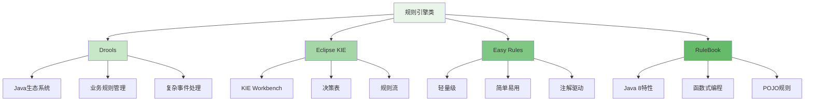

在企业级智能风控平台的建设过程中，合理利用开源组件可以显著降低开发成本、缩短上线时间，并获得社区的持续支持。本附录将介绍当前主流的开源风控组件，包括规则引擎、机器学习框架、图计算引擎、实时计算平台等，为风控平台的技术选型提供参考。

## 开源风控组件分类

开源风控组件按照功能可以分为多个类别，每个类别都有其特定的应用场景和技术特点。

### 规则引擎类组件



### 机器学习框架类组件

```yaml
# 机器学习框架类组件
machine_learning_frameworks:
  python_ecosystem:
    name: "Python生态"
    description: "基于Python的机器学习框架"
    frameworks:
      - scikit_learn:
          name: "Scikit-learn"
          description: "简单高效的机器学习库"
          features:
            - "丰富的算法实现"
            - "完善的文档"
            - "易于上手"
            - "社区活跃"
          use_cases:
            - "传统机器学习"
            - "数据预处理"
            - "模型评估"
            - "特征选择"
          limitations:
            - "不支持深度学习"
            - "大数据处理能力有限"
            - "分布式计算支持弱"
      
      - tensorflow:
          name: "TensorFlow"
          description: "Google开发的深度学习框架"
          features:
            - "强大的深度学习能力"
            - "分布式训练支持"
            - "生产环境部署"
            - "丰富的工具生态"
          use_cases:
            - "深度神经网络"
            - "自然语言处理"
            - "计算机视觉"
            - "推荐系统"
          limitations:
            - "学习曲线陡峭"
            - "资源消耗大"
            - "调试困难"
      
      - pytorch:
          name: "PyTorch"
          description: "Facebook开发的深度学习框架"
          features:
            - "动态计算图"
            - "易于调试"
            - "研究友好"
            - "社区快速发展"
          use_cases:
            - "研究实验"
            - "原型开发"
            - "自然语言处理"
            - "计算机视觉"
          limitations:
            - "生产部署复杂"
            - "性能优化需要经验"
            - "生态系统相对年轻"
  
  java_ecosystem:
    name: "Java生态"
    description: "基于Java的机器学习框架"
    frameworks:
      - apache_spark_mllib:
          name: "Apache Spark MLlib"
          description: "基于Spark的大规模机器学习库"
          features:
            - "大数据处理能力"
            - "分布式计算"
            - "与Spark生态集成"
            - "多种算法支持"
          use_cases:
            - "大规模数据处理"
            - "推荐系统"
            - "聚类分析"
            - "分类回归"
          limitations:
            - "算法实现相对简单"
            - "实时性有限"
            - "内存消耗大"
      
      - apache_flink_ml:
          name: "Apache Flink ML"
          description: "基于Flink的机器学习库"
          features:
            - "流式机器学习"
            - "实时处理能力"
            - "与Flink生态集成"
            - "增量学习支持"
          use_cases:
            - "实时推荐"
            - "异常检测"
            - "在线学习"
            - "流式分析"
          limitations:
            - "算法库相对较少"
            - "社区规模较小"
            - "学习资源有限"
```

## 主流开源组件详细介绍

### Drools规则引擎

```python
class DroolsRuleEngine:
    def __init__(self):
        self.kie_container = None
        self.kie_session = None
        self.rule_builder = RuleBuilder()
    
    def initialize_engine(self, kjar_path):
        """初始化Drools引擎"""
        # 1. 创建KIE服务
        kie_services = KieServices.Factory.get()
        
        # 2. 创建KIE容器
        self.kie_container = kie_services.newKieContainer(
            kie_services.newReleaseId("com.example", "risk-rules", "1.0.0")
        )
        
        # 3. 创建KIE会话
        self.kie_session = self.kie_container.newKieSession()
        
        return True
    
    def execute_rules(self, facts):
        """执行规则"""
        # 1. 插入事实
        for fact in facts:
            self.kie_session.insert(fact)
        
        # 2. 执行规则
        rule_results = self.kie_session.fireAllRules()
        
        # 3. 获取结果
        results = self.collect_results()
        
        return RuleExecutionResult(
            fired_rules=rule_results,
            results=results,
            session_state=self.kie_session.getObjects()
        )
    
    def build_risk_rules(self, rule_definitions):
        """构建风控规则"""
        rules = []
        for rule_def in rule_definitions:
            # 1. 解析规则定义
            parsed_rule = self.rule_builder.parse_rule_definition(rule_def)
            
            # 2. 生成DRL规则
            drl_rule = self.rule_builder.generate_drl_rule(parsed_rule)
            
            # 3. 验证规则
            validation_result = self.rule_builder.validate_rule(drl_rule)
            
            if validation_result.is_valid:
                rules.append(drl_rule)
        
        return RuleBuildResult(
            rules=rules,
            count=len(rules),
            validation_results=[r.validation for r in rules]
        )

class RiskControlRuleExample:
    def __init__(self):
        self.drools_engine = DroolsRuleEngine()
    
    def create_fraud_detection_rules(self):
        """创建反欺诈检测规则示例"""
        rules = [
            {
                "name": "高频交易检测",
                "condition": "transaction.amount > 10000 && transaction.frequency > 10",
                "action": "transaction.riskLevel = 'HIGH'; transaction.action = 'BLOCK'",
                "priority": 1
            },
            {
                "name": "异地登录检测",
                "condition": "login.location != user.lastLocation && time.diff < 3600",
                "action": "login.riskLevel = 'MEDIUM'; login.action = 'CHALLENGE'",
                "priority": 2
            },
            {
                "name": "黑名单匹配",
                "condition": "user.id in blackList",
                "action": "user.riskLevel = 'CRITICAL'; user.action = 'DENY'",
                "priority": 3
            }
        ]
        
        return self.drools_engine.build_risk_rules(rules)
```

### Apache Flink流处理引擎

```go
type ApacheFlinkStreamProcessing struct {
    StreamExecutionEnvironment *StreamExecutionEnvironment
    DataStream                 *DataStream
    WindowOperator             *WindowOperator
    CheckpointConfig           *CheckpointConfig
}

type RiskControlStreamProcessing struct {
    flinkEngine ApacheFlinkStreamProcessing
    processors  []StreamProcessor
}

func (rcsp *RiskControlStreamProcessing) InitializeFlinkEngine() *ApacheFlinkStreamProcessing {
    // 1. 创建执行环境
    env := stream.NewExecutionEnvironment()
    
    // 2. 配置检查点
    env.EnableCheckpointing(5000) // 5秒检查点间隔
    env.SetCheckpointingMode(checkpointing.ExactlyOnce)
    
    // 3. 配置状态后端
    env.SetStateBackend(statebackend.NewRocksDBStateBackend("hdfs://checkpoint-dir"))
    
    // 4. 配置重启策略
    env.SetRestartStrategy(restartstrategy.FixedDelayRestart(
        3, // 重启3次
        10000, // 10秒间隔
    ))
    
    return &ApacheFlinkStreamProcessing{
        StreamExecutionEnvironment: env,
        CheckpointConfig: env.CheckpointConfig(),
    }
}

func (rcsp *RiskControlStreamProcessing) ProcessRealTimeRiskData() {
    // 1. 创建数据源
    transactionSource := source.NewKafkaSource("transaction-topic", "localhost:9092")
    
    // 2. 创建数据流
    transactionStream := rcsp.flinkEngine.StreamExecutionEnvironment.
        AddSource(transactionSource).
        Map(NewTransactionMapper())
    
    // 3. 应用窗口操作
    riskAnalysisStream := transactionStream.
        KeyBy("userId").
        Window(window.NewTumblingEventTimeWindows(60000)). // 1分钟窗口
        Aggregate(NewRiskAggregator())
    
    // 4. 风险评分计算
    riskScoreStream := riskAnalysisStream.
        Map(NewRiskScoringFunction())
    
    // 5. 风险决策
    decisionStream := riskScoreStream.
        Process(NewRiskDecisionProcessor())
    
    // 6. 输出结果
    decisionStream.AddSink(sink.NewKafkaSink("risk-decision-topic", "localhost:9092"))
    
    // 7. 执行作业
    rcsp.flinkEngine.StreamExecutionEnvironment.Execute("Risk-Control-Job")
}

type TransactionMapper struct{}

func (tm *TransactionMapper) Map(value interface{}) interface{} {
    // 解析交易数据
    transaction := ParseTransactionData(value.([]byte))
    
    // 添加时间戳
    transaction.EventTime = utils.GetCurrentEventTime()
    
    // 添加基础特征
    transaction.Features = ExtractBasicFeatures(transaction)
    
    return transaction
}

type RiskAggregator struct{}

func (ra *RiskAggregator) CreateAccumulator() interface{} {
    return &RiskAggregation{}
}

func (ra *RiskAggregator) Add(value interface{}, accumulator interface{}) interface{} {
    transaction := value.(Transaction)
    agg := accumulator.(*RiskAggregation)
    
    // 累积统计信息
    agg.TransactionCount++
    agg.TotalAmount += transaction.Amount
    agg.UniqueIPCount = UpdateUniqueIPCount(agg.UniqueIPCount, transaction.IP)
    agg.TransactionPattern = UpdatePattern(agg.TransactionPattern, transaction)
    
    return agg
}

func (ra *RiskAggregator) GetResult(accumulator interface{}) interface{} {
    agg := accumulator.(*RiskAggregation)
    
    // 计算聚合特征
    agg.AverageAmount = agg.TotalAmount / float64(agg.TransactionCount)
    agg.IPFrequency = float64(agg.UniqueIPCount) / float64(agg.TransactionCount)
    agg.PatternScore = CalculatePatternScore(agg.TransactionPattern)
    
    return agg
}
```

### Apache Spark MLlib机器学习库

```typescript
interface ApacheSparkMLlib {
    // 数据处理
    processData(data: DataFrame): Promise<ProcessedData>;
    
    // 模型训练
    trainModel(trainingData: DataFrame, algorithm: string): Promise<TrainedModel>;
    
    // 模型评估
    evaluateModel(model: TrainedModel, testData: DataFrame): Promise<EvaluationResult>;
    
    // 模型部署
    deployModel(model: TrainedModel): Promise<DeploymentResult>;
}

class RiskControlMLPipeline implements ApacheSparkMLlib {
    private sparkSession: SparkSession;
    private featurePipeline: FeaturePipeline;
    private modelRegistry: ModelRegistry;
    
    async processData(data: DataFrame): Promise<ProcessedData> {
        // 1. 数据清洗
        const cleanedData = await this.cleanData(data);
        
        // 2. 特征工程
        const featureData = await this.engineerFeatures(cleanedData);
        
        // 3. 数据分割
        const [trainingData, testData] = await this.splitData(featureData);
        
        // 4. 数据验证
        const validationResult = await this.validateData(trainingData, testData);
        
        return new ProcessedData({
            training: trainingData,
            test: testData,
            validation: validationResult,
            features: featureData.schema.fields
        });
    }
    
    async trainModel(trainingData: DataFrame, algorithm: string): Promise<TrainedModel> {
        // 1. 选择算法
        const mlAlgorithm = this.selectAlgorithm(algorithm);
        
        // 2. 参数调优
        const bestParams = await this.tuneHyperparameters(mlAlgorithm, trainingData);
        
        // 3. 模型训练
        const trainedModel = await mlAlgorithm.fit(trainingData);
        
        // 4. 模型验证
        const validationMetrics = await this.validateModel(trainedModel, trainingData);
        
        // 5. 模型注册
        const modelId = await this.modelRegistry.registerModel(trainedModel, validationMetrics);
        
        return new TrainedModel({
            id: modelId,
            algorithm: algorithm,
            model: trainedModel,
            parameters: bestParams,
            metrics: validationMetrics,
            timestamp: new Date()
        });
    }
    
    async evaluateModel(model: TrainedModel, testData: DataFrame): Promise<EvaluationResult> {
        // 1. 模型预测
        const predictions = await model.model.transform(testData);
        
        // 2. 性能评估
        const evaluator = new BinaryClassificationEvaluator()
            .setLabelCol("label")
            .setRawPredictionCol("rawPrediction")
            .setMetricName("areaUnderROC");
        
        const auc = await evaluator.evaluate(predictions);
        
        // 3. 混淆矩阵计算
        const confusionMatrix = await this.calculateConfusionMatrix(predictions);
        
        // 4. 特征重要性分析
        const featureImportance = await this.analyzeFeatureImportance(model.model);
        
        return new EvaluationResult({
            auc: auc,
            confusionMatrix: confusionMatrix,
            featureImportance: featureImportance,
            predictions: predictions,
            timestamp: new Date()
        });
    }
    
    private async engineerFeatures(data: DataFrame): Promise<DataFrame> {
        // 1. 特征选择
        const selectedFeatures = await this.selectRelevantFeatures(data);
        
        // 2. 特征转换
        const transformedFeatures = await this.transformFeatures(selectedFeatures);
        
        // 3. 特征组合
        const combinedFeatures = await this.combineFeatures(transformedFeatures);
        
        // 4. 特征标准化
        const standardizedFeatures = await this.standardizeFeatures(combinedFeatures);
        
        return standardizedFeatures;
    }
    
    private selectAlgorithm(algorithm: string): Estimator {
        switch (algorithm) {
            case 'logistic_regression':
                return new LogisticRegression()
                    .setMaxIter(100)
                    .setRegParam(0.01);
            case 'random_forest':
                return new RandomForestClassifier()
                    .setNumTrees(100)
                    .setMaxDepth(10);
            case 'gradient_boosted_trees':
                return new GBTClassifier()
                    .setMaxIter(50)
                    .setMaxDepth(5);
            default:
                throw new Error(`Unsupported algorithm: ${algorithm}`);
        }
    }
}
```

## 图计算引擎组件

### Apache TinkerPop图计算框架

```python
class ApacheTinkerPopGraphEngine:
    def __init__(self):
        self.graph_traversal = None
        self.graph_database = None
        self.analytics_engine = None
    
    def initialize_graph_engine(self, config):
        """初始化图计算引擎"""
        # 1. 连接图数据库
        self.graph_database = GraphDatabase.open(config.database_url)
        
        # 2. 创建图遍历对象
        self.graph_traversal = self.graph_database.traversal()
        
        # 3. 配置分析引擎
        self.analytics_engine = GraphAnalyticsEngine(config.analytics_config)
        
        return True
    
    def detect_fraud_rings(self, time_window):
        """检测欺诈团伙"""
        # 1. 查询可疑用户
        suspicious_users = self.graph_traversal.V().hasLabel('user') \
            .has('risk_score', P.gt(0.8)) \
            .has('last_activity', P.within(time_window)) \
            .toList()
        
        # 2. 查找关联关系
        fraud_rings = []
        for user in suspicious_users:
            # 查找共同交易关系
            common_transactions = self.graph_traversal.V(user) \
                .out('transaction') \
                .in_('transaction') \
                .dedup() \
                .where(P.neq(user)) \
                .toList()
            
            # 查找设备共享关系
            shared_devices = self.graph_traversal.V(user) \
                .out('uses_device') \
                .in_('uses_device') \
                .dedup() \
                .where(P.neq(user)) \
                .toList()
            
            # 构建团伙图
            ring_graph = self.build_ring_graph(user, common_transactions, shared_devices)
            
            # 评估团伙风险
            ring_risk = self.evaluate_ring_risk(ring_graph)
            
            if ring_risk > 0.7:
                fraud_rings.append(FraudRing(
                    leader=user,
                    members=common_transactions + shared_devices,
                    risk_score=ring_risk,
                    evidence={
                        'common_transactions': len(common_transactions),
                        'shared_devices': len(shared_devices)
                    }
                ))
        
        return fraud_rings
    
    def analyze_user_network(self, user_id):
        """分析用户网络关系"""
        # 1. 获取用户节点
        user_vertex = self.graph_traversal.V().has('user', 'id', user_id).next()
        
        # 2. 分析一度关系
        first_degree_connections = self.graph_traversal.V(user_vertex) \
            .bothE() \
            .bothV() \
            .dedup() \
            .where(P.neq(user_vertex)) \
            .toList()
        
        # 3. 分析二度关系
        second_degree_connections = self.graph_traversal.V(user_vertex) \
            .bothE() \
            .bothV() \
            .bothE() \
            .bothV() \
            .dedup() \
            .where(P.neq(user_vertex)) \
            .toList()
        
        # 4. 计算中心性指标
        centrality_metrics = self.calculate_centrality_metrics(user_vertex)
        
        # 5. 识别社区结构
        communities = self.detect_communities(user_vertex)
        
        return UserNetworkAnalysis(
            user=user_vertex,
            first_degree=first_degree_connections,
            second_degree=second_degree_connections,
            centrality=centrality_metrics,
            communities=communities,
            timestamp=datetime.now()
        )

class GraphAnalyticsEngine:
    def __init__(self, config):
        self.config = config
        self.algorithms = {
            'pagerank': PageRankAlgorithm(),
            'connected_components': ConnectedComponentsAlgorithm(),
            'triangle_count': TriangleCountAlgorithm(),
            'shortest_path': ShortestPathAlgorithm()
        }
    
    def run_graph_analytics(self, graph, algorithms):
        """运行图分析算法"""
        results = {}
        
        for algorithm_name in algorithms:
            if algorithm_name in self.algorithms:
                algorithm = self.algorithms[algorithm_name]
                result = algorithm.execute(graph)
                results[algorithm_name] = result
        
        return GraphAnalyticsResult(
            results=results,
            timestamp=datetime.now()
        )
    
    def detect_anomalous_patterns(self, graph_analytics_result):
        """检测异常模式"""
        anomalies = []
        
        # 1. PageRank异常检测
        pagerank_anomalies = self.detect_pagerank_anomalies(
            graph_analytics_result.results['pagerank']
        )
        anomalies.extend(pagerank_anomalies)
        
        # 2. 社区结构异常检测
        community_anomalies = self.detect_community_anomalies(
            graph_analytics_result.results['connected_components']
        )
        anomalies.extend(community_anomalies)
        
        # 3. 三角计数异常检测
        triangle_anomalies = self.detect_triangle_anomalies(
            graph_analytics_result.results['triangle_count']
        )
        anomalies.extend(triangle_anomalies)
        
        return AnomalyDetectionResult(
            anomalies=anomalies,
            algorithms_used=list(graph_analytics_result.results.keys()),
            timestamp=datetime.now()
        )
```

## 实时计算平台

### Apache Storm流处理系统

```go
type ApacheStormStreamProcessing struct {
    TopologyBuilder    *TopologyBuilder
    StormConfig        *Config
    NimbusClient       *NimbusClient
    SupervisorClient   *SupervisorClient
}

type RiskControlStormTopology struct {
    stormEngine ApacheStormStreamProcessing
    spouts      []StormSpout
    bolts       []StormBolt
}

func (rcst *RiskControlStormTopology) BuildRiskControlTopology() *StormTopology {
    // 1. 创建拓扑构建器
    builder := topology.NewTopologyBuilder()
    
    // 2. 配置数据源Spout
    transactionSpout := spout.NewKafkaSpout("transaction-topic", "localhost:9092")
    builder.SetSpout("transaction-spout", transactionSpout, 2)
    
    // 3. 配置特征提取Bolt
    featureBolt := bolt.NewFeatureExtractionBolt()
    builder.SetBolt("feature-bolt", featureBolt, 4).
        ShuffleGrouping("transaction-spout")
    
    // 4. 配置规则引擎Bolt
    ruleBolt := bolt.NewRuleEngineBolt()
    builder.SetBolt("rule-bolt", ruleBolt, 4).
        ShuffleGrouping("feature-bolt")
    
    // 5. 配置机器学习Bolt
    mlBolt := bolt.NewMachineLearningBolt()
    builder.SetBolt("ml-bolt", mlBolt, 4).
        ShuffleGrouping("feature-bolt")
    
    // 6. 配置决策融合Bolt
    decisionBolt := bolt.NewDecisionFusionBolt()
    builder.SetBolt("decision-bolt", decisionBolt, 2).
        FieldsGrouping("rule-bolt", stream.NewFields("userId")).
        FieldsGrouping("ml-bolt", stream.NewFields("userId"))
    
    // 7. 配置结果输出Bolt
    outputBolt := bolt.NewResultOutputBolt()
    builder.SetBolt("output-bolt", outputBolt, 2).
        ShuffleGrouping("decision-bolt")
    
    return builder.CreateTopology()
}

func (rcst *RiskControlStormTopology) ConfigureStormCluster() *Config {
    config := storm.NewConfig()
    
    // 1. 配置工作进程
    config.SetNumWorkers(4)
    
    // 2. 配置消息确认机制
    config.SetMessageTimeout(30) // 30秒超时
    
    // 3. 配置序列化
    config.SetSerializationRegistrations([]interface{}{
        &Transaction{},
        &RiskDecision{},
        &FeatureVector{},
    })
    
    // 4. 配置监控
    config.SetDebug(false)
    config.SetMaxSpoutPending(5000)
    
    // 5. 配置容错
    config.SetTopologyWorkers(4)
    config.SetTopologyAckers(2)
    config.SetTopologyMaxSpoutPending(1000)
    
    return config
}

type FeatureExtractionBolt struct {
    BaseRichBolt
    collector OutputCollector
}

func (feb *FeatureExtractionBolt) Execute(tuple Tuple, collector OutputCollector) {
    // 1. 解析交易数据
    transaction := ParseTransactionFromTuple(tuple)
    
    // 2. 提取基础特征
    basicFeatures := ExtractBasicFeatures(transaction)
    
    // 3. 提取行为特征
    behavioralFeatures := ExtractBehavioralFeatures(transaction)
    
    // 4. 提取设备特征
    deviceFeatures := ExtractDeviceFeatures(transaction)
    
    // 5. 构建特征向量
    featureVector := BuildFeatureVector(
        basicFeatures,
        behavioralFeatures,
        deviceFeatures,
    )
    
    // 6. 发出特征向量
    collector.Emit([]interface{}{transaction.UserId, featureVector})
    collector.Ack(tuple)
}

type RuleEngineBolt struct {
    BaseRichBolt
    collector    OutputCollector
    ruleEngine   *DroolsRuleEngine
}

func (reb *RuleEngineBolt) Execute(tuple Tuple, collector OutputCollector) {
    // 1. 获取特征向量
    userId := tuple.GetString(0)
    featureVector := tuple.GetValue(1).(FeatureVector)
    
    // 2. 执行规则引擎
    ruleResult := reb.ruleEngine.ExecuteRules([]interface{}{featureVector})
    
    // 3. 生成规则决策
    ruleDecision := GenerateRuleDecision(ruleResult)
    
    // 4. 发出规则决策
    collector.Emit([]interface{}{userId, ruleDecision})
    collector.Ack(tuple)
}
```

## 组件选型建议

### 选型评估维度

```yaml
# 开源组件选型评估维度
component_selection_criteria:
  technical_factors:
    name: "技术因素"
    description: "技术层面的评估标准"
    factors:
      - performance:
          name: "性能"
          description: "处理能力、响应时间、吞吐量"
          weight: 0.25
          evaluation_metrics:
            - "QPS/TPS"
            - "延迟时间"
            - "资源利用率"
            - "扩展性"
      
      - reliability:
          name: "可靠性"
          description: "稳定性、容错能力、恢复能力"
          weight: 0.20
          evaluation_metrics:
            - "可用性指标"
            - "故障恢复时间"
            - "数据一致性"
            - "错误处理能力"
      
      - scalability:
          name: "可扩展性"
          description: "水平扩展、垂直扩展能力"
          weight: 0.15
          evaluation_metrics:
            - "集群扩展能力"
            - "负载均衡"
            - "资源弹性"
            - "分布式支持"
      
      - maintainability:
          name: "可维护性"
          description: "代码质量、文档完善度、易用性"
          weight: 0.15
          evaluation_metrics:
            - "文档完整性"
            - "API设计"
            - "配置复杂度"
            - "调试便利性"
  
  community_factors:
    name: "社区因素"
    description: "社区生态层面的评估标准"
    factors:
      - community_size:
          name: "社区规模"
          description: "用户数量、贡献者数量"
          weight: 0.10
          evaluation_metrics:
            - "GitHub stars"
            - "贡献者数量"
            - "社区活跃度"
            - "用户反馈"
      
      - support_resources:
          name: "支持资源"
          description: "文档、教程、培训资源"
          weight: 0.08
          evaluation_metrics:
            - "官方文档质量"
            - "教程丰富度"
            - "社区支持"
            - "商业支持"
      
      - update_frequency:
          name: "更新频率"
          description: "版本发布频率、bug修复速度"
          weight: 0.07
          evaluation_metrics:
            - "版本发布周期"
            - "bug修复速度"
            - "功能更新频率"
            - "安全补丁"
  
  business_factors:
    name: "业务因素"
    description: "业务层面的评估标准"
    factors:
      - license_compatibility:
          name: "许可证兼容性"
          description: "与企业政策的兼容性"
          weight: 0.15
          evaluation_metrics:
            - "许可证类型"
            - "商业使用限制"
            - "专利风险"
            - "合规性"
      
      - integration_cost:
          name: "集成成本"
          description: "学习成本、开发成本、运维成本"
          weight: 0.10
          evaluation_metrics:
            - "学习曲线"
            - "开发工作量"
            - "运维复杂度"
            - "人员技能要求"
      
      - long_term_support:
          name: "长期支持"
          description: "项目可持续性、路线图清晰度"
          weight: 0.10
          evaluation_metrics:
            - "项目活跃度"
            - "公司支持"
            - "路线图规划"
            - "版本稳定性"
```

### 风控场景组件推荐

```python
class RiskControlComponentRecommendation:
    def __init__(self):
        self.component_database = ComponentDatabase()
        self.evaluation_engine = EvaluationEngine()
    
    def recommend_components(self, requirements):
        """根据需求推荐组件"""
        recommendations = {}
        
        # 1. 规则引擎推荐
        rule_engine_recommendations = self.recommend_rule_engines(requirements.rule_engine)
        recommendations['rule_engine'] = rule_engine_recommendations
        
        # 2. 机器学习框架推荐
        ml_framework_recommendations = self.recommend_ml_frameworks(requirements.ml_framework)
        recommendations['ml_framework'] = ml_framework_recommendations
        
        # 3. 流处理平台推荐
        stream_processing_recommendations = self.recommend_stream_processing(requirements.stream_processing)
        recommendations['stream_processing'] = stream_processing_recommendations
        
        # 4. 图计算引擎推荐
        graph_engine_recommendations = self.recommend_graph_engines(requirements.graph_engine)
        recommendations['graph_engine'] = graph_engine_recommendations
        
        return ComponentRecommendationResult(
            recommendations=recommendations,
            evaluation_scores=self.calculate_evaluation_scores(recommendations),
            implementation_guidance=self.generate_implementation_guidance(recommendations)
        )
    
    def recommend_rule_engines(self, requirements):
        """推荐规则引擎"""
        candidates = [
            ComponentCandidate(
                name='Drools',
                category='rule_engine',
                strengths=['功能强大', '生态系统完善', '业务规则管理'],
                weaknesses=['学习曲线陡峭', '性能开销大'],
               适用场景=['复杂业务规则', '决策管理', '合规检查']
            ),
            ComponentCandidate(
                name='Easy Rules',
                category='rule_engine',
                strengths=['轻量级', '简单易用', '注解驱动'],
                weaknesses=['功能相对简单', '复杂规则支持有限'],
               适用场景=['简单规则', '快速原型', '轻量级应用']
            )
        ]
        
        return self.evaluate_and_rank_candidates(candidates, requirements)
    
    def recommend_ml_frameworks(self, requirements):
        """推荐机器学习框架"""
        candidates = [
            ComponentCandidate(
                name='Apache Spark MLlib',
                category='ml_framework',
                strengths=['大数据处理', '算法丰富', '生态系统完善'],
                weaknesses=['实时性有限', '资源消耗大'],
               适用场景=['批量处理', '离线训练', '大规模数据分析']
            ),
            ComponentCandidate(
                name='Apache Flink ML',
                category='ml_framework',
                strengths=['流式处理', '实时性好', '增量学习'],
                weaknesses=['算法库较少', '社区相对较小'],
               适用场景=['实时推荐', '在线学习', '流式分析']
            )
        ]
        
        return self.evaluate_and_rank_candidates(candidates, requirements)
    
    def evaluate_and_rank_candidates(self, candidates, requirements):
        """评估并排序候选组件"""
        evaluated_candidates = []
        
        for candidate in candidates:
            # 1. 技术评估
            technical_score = self.evaluate_technical_aspects(candidate, requirements)
            
            # 2. 社区评估
            community_score = self.evaluate_community_aspects(candidate)
            
            # 3. 业务评估
            business_score = self.evaluate_business_aspects(candidate, requirements)
            
            # 4. 综合评分
            overall_score = self.calculate_overall_score(
                technical_score,
                community_score,
                business_score
            )
            
            evaluated_candidates.append(EvaluatedCandidate(
                candidate=candidate,
                technical=technical_score,
                community=community_score,
                business=business_score,
                overall=overall_score
            ))
        
        # 按综合评分排序
        evaluated_candidates.sort(key=lambda x: x.overall, reverse=True)
        
        return evaluated_candidates

class ComponentDatabase:
    def __init__(self):
        self.components = self.load_component_data()
    
    def load_component_data(self):
        """加载组件数据"""
        return {
            'drools': {
                'name': 'Drools',
                'type': 'rule_engine',
                'description': '基于Java的业务规则管理系统',
                'maturity': '成熟',
                'license': 'Apache 2.0',
                'github_stars': 4500,
                'last_release': '2025-06-15',
                'documentation': '完善',
                'community': '活跃'
            },
            'flink': {
                'name': 'Apache Flink',
                'type': 'stream_processing',
                'description': '分布式流处理框架',
                'maturity': '成熟',
                'license': 'Apache 2.0',
                'github_stars': 21000,
                'last_release': '2025-08-20',
                'documentation': '完善',
                'community': '非常活跃'
            }
            # 更多组件数据...
        }
```

通过合理选择和组合这些开源风控组件，企业可以构建功能强大、性能优越且成本效益高的智能风控平台。在实际应用中，需要根据具体的业务需求、技术栈和资源约束来制定最适合的组件选型方案。