在企业级智能风控平台的建设中，第三方数据源是重要的数据补充，能够显著提升风险识别的准确性和覆盖面。本附录将详细介绍第三方数据源的分类、选型标准、集成方式以及最佳实践，为风控平台的数据生态建设提供指导。

## 第三方数据源分类体系

第三方数据源按照应用场景和数据类型可以分为多个类别，每类数据源都有其特定的价值和应用方式。

### 数据源分类架构

```mermaid
graph TB
    A[第三方数据源分类] --> B[身份验证类]
    A --> C[行为分析类]
    A --> D[信用评估类]
    A --> E[设备指纹类]
    A --> F[地理位置类]
    A --> G[社交网络类]
    A --> H[黑名单类]
    
    B --> B1[实名认证]
    B --> B2[活体检测]
    B --> B3[证件核验]
    
    C --> C1[用户行为]
    C --> C2[设备行为]
    C --> C3[网络行为]
    
    D --> D1[征信报告]
    D --> D2[信用评分]
    D --> D3[履约记录]
    
    E --> E1[设备标识]
    E --> E2[浏览器指纹]
    E --> E3[硬件信息]
    
    F --> F1[IP地理]
    F --> F2[GPS定位]
    F --> F3[基站定位]
    
    G --> G1[社交关系]
    G --> G2[社交行为]
    G --> G3[影响力分析]
    
    H --> H1[欺诈名单]
    H --> H2[风险设备]
    H --> H3[恶意IP]
    
    style A fill:#e8f5e8
    style B fill:#c8e6c8
    style C fill:#a5d6a7
    style D fill:#81c784
    style E fill:#66bb6a
    style F fill:#4caf50
    style G fill:#43a047
    style H fill:#388e3c
```



### 各类数据源详细说明

```yaml
# 第三方数据源详细分类
third_party_data_sources:
  identity_verification:
    name: "身份验证类"
    description: "用于验证用户身份真实性的数据源"
    data_types:
      - real_name_authentication:
          name: "实名认证"
          description: "验证用户真实姓名与身份证号匹配度"
          key_fields:
            - "姓名"
            - "身份证号"
            - "认证结果"
            - "认证时间"
          data_quality:
            - "准确性: 高"
            - "时效性: 实时"
            - "覆盖率: 全国"
          application_scenarios:
            - "账户注册"
            - "实名认证"
            - "KYC合规"
            - "反欺诈验证"
      
      - liveness_detection:
          name: "活体检测"
          description: "验证操作者为真实活体而非照片或模型"
          key_fields:
            - "检测结果"
            - "置信度"
            - "检测类型"
            - "检测时间"
          data_quality:
            - "准确性: 中高"
            - "时效性: 实时"
            - "技术成熟度: 高"
          application_scenarios:
            - "人脸识别"
            - "远程开户"
            - "身份核验"
            - "安全登录"
      
      - document_verification:
          name: "证件核验"
          description: "验证身份证、护照等证件的真实性和有效性"
          key_fields:
            - "证件类型"
            - "证件号码"
            - "有效期"
            - "核验结果"
          data_quality:
            - "准确性: 高"
            - "时效性: 准实时"
            - "数据权威性: 高"
          application_scenarios:
            - "证件上传验证"
            - "合规检查"
            - "风险评估"
            - "身份确认"
  
  behavioral_analysis:
    name: "行为分析类"
    description: "用于分析用户行为模式的数据源"
    data_types:
      - user_behavior:
          name: "用户行为"
          description: "分析用户在平台上的操作行为模式"
          key_fields:
            - "用户ID"
            - "行为类型"
            - "行为时间"
            - "行为特征"
          data_quality:
            - "准确性: 中"
            - "时效性: 近实时"
            - "数据丰富度: 高"
          application_scenarios:
            - "异常行为检测"
            - "用户画像"
            - "风险评分"
            - "个性化推荐"
      
      - device_behavior:
          name: "设备行为"
          description: "分析设备使用习惯和异常行为"
          key_fields:
            - "设备ID"
            - "使用频率"
            - "使用时段"
            - "行为模式"
          data_quality:
            - "准确性: 中高"
            - "时效性: 近实时"
            - "覆盖范围: 广泛"
          application_scenarios:
            - "设备风险识别"
            - "欺诈设备检测"
            - "设备画像"
            - "安全监控"
  
  credit_assessment:
    name: "信用评估类"
    description: "提供个人或企业信用状况评估的数据源"
    data_types:
      - credit_report:
          name: "征信报告"
          description: "详细的个人或企业信用历史记录"
          key_fields:
            - "信用评分"
            - "信贷记录"
            - "还款历史"
            - "违约记录"
          data_quality:
            - "准确性: 高"
            - "权威性: 高"
            - "更新频率: 月度"
          application_scenarios:
            - "信贷审批"
            - "风险定价"
            - "信用评估"
            - "合规检查"
      
      - credit_scoring:
          name: "信用评分"
          description: "基于多维度数据计算的信用评分"
          key_fields:
            - "信用分值"
            - "评分模型"
            - "评分时间"
            - "评分维度"
          data_quality:
            - "准确性: 中高"
            - "时效性: 日更新"
            - "覆盖范围: 广泛"
          application_scenarios:
            - "快速授信"
            - "风险预警"
            - "用户分层"
            - "营销策略"
```

## 数据源选型评估标准

选择合适的第三方数据源需要建立科学的评估体系，确保所选数据源能够满足业务需求并带来实际价值。

### 选型评估维度

```python
class DataSourceSelectionCriteria:
    def __init__(self):
        self.evaluation_dimensions = {
            'data_quality': DataQualityDimension(),
            'service_capability': ServiceCapabilityDimension(),
            'business_value': BusinessValueDimension(),
            'compliance_risk': ComplianceRiskDimension()
        }
    
    def evaluate_data_source(self, data_source, requirements):
        """评估数据源"""
        evaluation_results = {}
        
        # 1. 数据质量评估
        data_quality_score = self.evaluation_dimensions['data_quality'].evaluate(data_source)
        evaluation_results['data_quality'] = data_quality_score
        
        # 2. 服务能力评估
        service_capability_score = self.evaluation_dimensions['service_capability'].evaluate(data_source)
        evaluation_results['service_capability'] = service_capability_score
        
        # 3. 业务价值评估
        business_value_score = self.evaluation_dimensions['business_value'].evaluate(data_source, requirements)
        evaluation_results['business_value'] = business_value_score
        
        # 4. 合规风险评估
        compliance_risk_score = self.evaluation_dimensions['compliance_risk'].evaluate(data_source)
        evaluation_results['compliance_risk'] = compliance_risk_score
        
        # 5. 综合评分
        overall_score = self.calculate_overall_score(evaluation_results)
        
        return DataSourceEvaluationResult(
            data_source=data_source,
            evaluations=evaluation_results,
            overall_score=overall_score,
            recommendation=self.generate_recommendation(overall_score)
        )
    
    def calculate_overall_score(self, evaluation_results):
        """计算综合评分"""
        weights = {
            'data_quality': 0.35,
            'service_capability': 0.25,
            'business_value': 0.25,
            'compliance_risk': 0.15
        }
        
        weighted_score = sum(
            evaluation_results[dimension] * weights[dimension]
            for dimension in weights.keys()
        )
        
        # 合规风险作为扣分项
        compliance_penalty = (100 - evaluation_results['compliance_risk']) * 0.15
        
        return weighted_score - compliance_penalty

class DataQualityDimension:
    def evaluate(self, data_source):
        """评估数据质量"""
        # 1. 准确性评估
        accuracy_score = self.evaluate_accuracy(data_source)
        
        # 2. 完整性评估
        completeness_score = self.evaluate_completeness(data_source)
        
        # 3. 时效性评估
        timeliness_score = self.evaluate_timeliness(data_source)
        
        # 4. 一致性评估
        consistency_score = self.evaluate_consistency(data_source)
        
        # 5. 覆盖率评估
        coverage_score = self.evaluate_coverage(data_source)
        
        return self.calculate_weighted_quality_score(
            accuracy_score,
            completeness_score,
            timeliness_score,
            consistency_score,
            coverage_score
        )
    
    def evaluate_accuracy(self, data_source):
        """评估数据准确性"""
        # 基于历史验证结果计算准确性
        if hasattr(data_source, 'accuracy_rate'):
            return data_source.accuracy_rate * 100
        else:
            # 默认评估
            return 80  # 假设80%的准确性
    
    def evaluate_completeness(self, data_source):
        """评估数据完整性"""
        if hasattr(data_source, 'completeness_rate'):
            return data_source.completeness_rate * 100
        else:
            return 85  # 假设85%的完整性
    
    def evaluate_timeliness(self, data_source):
        """评估数据时效性"""
        if hasattr(data_source, 'update_frequency'):
            # 根据更新频率评估时效性
            frequency = data_source.update_frequency
            if frequency == 'real_time':
                return 95
            elif frequency == 'hourly':
                return 85
            elif frequency == 'daily':
                return 75
            elif frequency == 'weekly':
                return 60
            else:
                return 50
        else:
            return 70  # 默认时效性评分

class ServiceCapabilityDimension:
    def evaluate(self, data_source):
        """评估服务能力"""
        # 1. API稳定性评估
        stability_score = self.evaluate_api_stability(data_source)
        
        # 2. 响应时间评估
        response_time_score = self.evaluate_response_time(data_source)
        
        # 3. 并发处理能力评估
        concurrency_score = self.evaluate_concurrency(data_source)
        
        # 4. 故障恢复能力评估
        fault_tolerance_score = self.evaluate_fault_tolerance(data_source)
        
        # 5. 技术支持评估
        support_score = self.evaluate_technical_support(data_source)
        
        return self.calculate_weighted_service_score(
            stability_score,
            response_time_score,
            concurrency_score,
            fault_tolerance_score,
            support_score
        )

class BusinessValueDimension:
    def evaluate(self, data_source, requirements):
        """评估业务价值"""
        # 1. 业务匹配度评估
        business_match_score = self.evaluate_business_match(data_source, requirements)
        
        # 2. 成本效益评估
        cost_benefit_score = self.evaluate_cost_benefit(data_source)
        
        # 3. 实施难度评估
        implementation_difficulty_score = self.evaluate_implementation_difficulty(data_source)
        
        # 4. ROI预期评估
        roi_expectation_score = self.evaluate_roi_expectation(data_source, requirements)
        
        return self.calculate_weighted_business_score(
            business_match_score,
            cost_benefit_score,
            implementation_difficulty_score,
            roi_expectation_score
        )
```

### 选型评估矩阵

```go
type DataSourceEvaluationMatrix struct {
    DataQualityScore       float64
    ServiceCapabilityScore float64
    BusinessValueScore     float64
    ComplianceRiskScore    float64
    OverallScore           float64
    Recommendation         string
}

type DataSourceCandidate struct {
    Name              string
    Provider          string
    DataType          string
    Coverage          string
    UpdateFrequency   string
    ApiStability      float64
    ResponseTime      int
    Cost              float64
    ComplianceStatus  string
}

func (dsem *DataSourceEvaluationMatrix) EvaluateCandidate(candidate DataSourceCandidate, requirements DataSourceRequirements) DataSourceEvaluationMatrix {
    // 1. 数据质量评分
    dataQuality := dsem.calculateDataQualityScore(candidate)
    
    // 2. 服务能力评分
    serviceCapability := dsem.calculateServiceCapabilityScore(candidate)
    
    // 3. 业务价值评分
    businessValue := dsem.calculateBusinessValueScore(candidate, requirements)
    
    // 4. 合规风险评分
    complianceRisk := dsem.calculateComplianceRiskScore(candidate)
    
    // 5. 综合评分
    overall := dsem.calculateOverallScore(dataQuality, serviceCapability, businessValue, complianceRisk)
    
    // 6. 生成推荐意见
    recommendation := dsem.generateRecommendation(overall, complianceRisk)
    
    return DataSourceEvaluationMatrix{
        DataQualityScore:       dataQuality,
        ServiceCapabilityScore: serviceCapability,
        BusinessValueScore:     businessValue,
        ComplianceRiskScore:    complianceRisk,
        OverallScore:           overall,
        Recommendation:         recommendation,
    }
}

func (dsem *DataSourceEvaluationMatrix) calculateDataQualityScore(candidate DataSourceCandidate) float64 {
    // 数据质量评分基于覆盖率、更新频率等因素
    coverageScore := 0.0
    switch candidate.Coverage {
    case "national":
        coverageScore = 90
    case "regional":
        coverageScore = 70
    case "local":
        coverageScore = 50
    default:
        coverageScore = 60
    }
    
    frequencyScore := 0.0
    switch candidate.UpdateFrequency {
    case "real_time":
        frequencyScore = 95
    case "hourly":
        frequencyScore = 85
    case "daily":
        frequencyScore = 75
    case "weekly":
        frequencyScore = 60
    default:
        frequencyScore = 50
    }
    
    return (coverageScore * 0.6) + (frequencyScore * 0.4)
}

func (dsem *DataSourceEvaluationMatrix) calculateOverallScore(dataQuality, serviceCapability, businessValue, complianceRisk float64) float64 {
    // 权重分配
    weights := map[string]float64{
        "data_quality":       0.35,
        "service_capability": 0.25,
        "business_value":     0.25,
        "compliance_risk":    0.15,
    }
    
    // 计算加权分数
    weightedScore := (dataQuality * weights["data_quality"]) +
        (serviceCapability * weights["service_capability"]) +
        (businessValue * weights["business_value"])
    
    // 合规风险作为扣分项
    compliancePenalty := (100 - complianceRisk) * weights["compliance_risk"]
    
    return weightedScore - compliancePenalty
}
```

## 主流第三方数据源提供商分析

### 身份验证类数据源

```typescript
interface IdentityVerificationProviders {
    // 公安部一所
    ministryOfPublicSecurity(): Promise<ProviderInfo>;
    
    // 阿里云实人认证
    aliyunRealPerson(): Promise<ProviderInfo>;
    
    // 腾讯云实名认证
    tencentCloudIdentity(): Promise<ProviderInfo>;
    
    // 百度AI身份验证
    baiduAIIdentity(): Promise<ProviderInfo>;
}

class IdentityVerificationProviderAnalysis implements IdentityVerificationProviders {
    async ministryOfPublicSecurity(): Promise<ProviderInfo> {
        return new ProviderInfo({
            name: "公安部一所",
            type: "government",
           权威性: "最高",
            数据质量: "极高",
            覆盖范围: "全国",
            合规性: "完全合规",
            接入方式: "专线接入",
            响应时间: "实时",
            成本: "较高",
            适用场景: ["金融开户", "实名认证", "合规检查"]
        });
    }
    
    async aliyunRealPerson(): Promise<ProviderInfo> {
        return new ProviderInfo({
            name: "阿里云实人认证",
            type: "cloud_service",
           权威性: "高",
            数据质量: "高",
            覆盖范围: "全国",
            合规性: "合规",
            接入方式: "API接入",
            响应时间: "毫秒级",
            成本: "中等",
            适用场景: ["互联网账户", "在线服务", "快速验证"]
        });
    }
    
    async tencentCloudIdentity(): Promise<ProviderInfo> {
        return new ProviderInfo({
            name: "腾讯云实名认证",
            type: "cloud_service",
           权威性: "高",
            数据质量: "高",
            覆盖范围: "全国",
            合规性: "合规",
            接入方式: "API接入",
            响应时间: "毫秒级",
            成本: "中等",
            适用场景: ["社交平台", "游戏账户", "电商认证"]
        });
    }
    
    async compareProviders(providers: ProviderInfo[]): Promise<ComparisonResult> {
        // 1. 数据质量对比
        const qualityComparison = this.compareDataQuality(providers);
        
        // 2. 服务能力对比
        const serviceComparison = this.compareServiceCapability(providers);
        
        // 3. 成本效益对比
        const costComparison = this.compareCostEffectiveness(providers);
        
        // 4. 合规性对比
        const complianceComparison = this.compareCompliance(providers);
        
        return new ComparisonResult({
            quality: qualityComparison,
            service: serviceComparison,
            cost: costComparison,
            compliance: complianceComparison,
            overall_ranking: this.calculateOverallRanking(providers)
        });
    }
    
    private compareDataQuality(providers: ProviderInfo[]): QualityComparison {
        return providers.map(provider => ({
            provider: provider.name,
            accuracy: provider.数据质量,
            coverage: provider.覆盖范围,
            timeliness: provider.响应时间,
            authority: provider.权威性
        }));
    }
}
```

### 信用评估类数据源

```python
class CreditAssessmentProviders:
    def __init__(self):
        self.providers = {
            'central_bank': self.analyze_central_bank_data(),
            'zhima_credit': self.analyze_zhima_credit(),
            'tencent_credit': self.analyze_tencent_credit(),
            'baihang_credit': self.analyze_baihang_credit()
        }
    
    def analyze_central_bank_data(self):
        """分析央行征信数据"""
        return CreditProviderAnalysis(
            name="央行征信中心",
            type="government",
            authority="最高",
            data_quality="极高",
            coverage="全国",
            compliance="完全合规",
            access_mode="授权查询",
            response_time="T+1日",
            cost="按次计费",
            use_cases=["银行信贷", "融资租赁", "大额消费"],
            limitations=["查询次数限制", "个人授权要求", "数据更新延迟"]
        )
    
    def analyze_zhima_credit(self):
        """分析芝麻信用"""
        return CreditProviderAnalysis(
            name="芝麻信用",
            type="commercial",
            authority="高",
            data_quality="高",
            coverage="广泛",
            compliance="合规",
            access_mode="API接入",
            response_time="实时",
            cost="按调用计费",
            use_cases=["互联网金融", "租赁服务", "生活服务"],
            limitations=["数据维度有限", "覆盖人群偏差", "模型透明度"]
        )
    
    def analyze_tencent_credit(self):
        """分析腾讯信用"""
        return CreditProviderAnalysis(
            name="腾讯信用",
            type="commercial",
            authority="高",
            data_quality="中高",
            coverage="社交场景",
            compliance="合规",
            access_mode="API接入",
            response_time="实时",
            cost="按调用计费",
            use_cases=["社交金融", "游戏付费", "内容付费"],
            limitations=["场景局限", "数据深度有限", "跨平台难度"]
        )
    
    def analyze_baihang_credit(self):
        """分析百行征信"""
        return CreditProviderAnalysis(
            name="百行征信",
            type="commercial",
            authority="高",
            data_quality="高",
            coverage="互联网金融",
            compliance="合规",
            access_mode="会员制",
            response_time="准实时",
            cost="会员费+按次计费",
            use_cases=["网贷审批", "消费金融", "信用评估"],
            limitations=["机构会员制", "数据整合周期", "查询成本"]
        )
    
    def recommend_providers(self, business_requirements):
        """根据业务需求推荐数据源"""
        recommendations = []
        
        for provider_name, provider_analysis in self.providers.items():
            # 1. 匹配度评估
            match_score = self.calculate_match_score(provider_analysis, business_requirements)
            
            # 2. 成本效益分析
            cost_benefit = self.analyze_cost_benefit(provider_analysis, business_requirements)
            
            # 3. 风险评估
            risk_assessment = self.assess_provider_risk(provider_analysis)
            
            # 4. 综合推荐
            if match_score > 70 and risk_assessment.risk_level == "LOW":
                recommendations.append(ProviderRecommendation(
                    provider=provider_analysis,
                    match_score=match_score,
                    cost_benefit=cost_benefit,
                    risk=risk_assessment,
                    recommendation_level=self.determine_recommendation_level(match_score, cost_benefit)
                ))
        
        # 按推荐级别排序
        recommendations.sort(key=lambda x: x.recommendation_level, reverse=True)
        
        return recommendations

class CreditProviderAnalysis:
    def __init__(self, name, type, authority, data_quality, coverage, compliance, 
                 access_mode, response_time, cost, use_cases, limitations):
        self.name = name
        self.type = type
        self.authority = authority
        self.data_quality = data_quality
        self.coverage = coverage
        self.compliance = compliance
        self.access_mode = access_mode
        self.response_time = response_time
        self.cost = cost
        self.use_cases = use_cases
        self.limitations = limitations
```

## 数据源集成与管理

### 集成架构设计

```yaml
# 第三方数据源集成架构
third_party_data_integration:
  architecture_layers:
    name: "集成架构层次"
    description: "数据源集成的分层架构设计"
    layers:
      - application_layer:
          name: "应用层"
          description: "业务应用系统"
          components:
            - "风控决策引擎"
            - "策略管理系统"
            - "数据分析平台"
            - "报表展示系统"
      
      - service_layer:
          name: "服务层"
          description: "数据服务抽象层"
          components:
            - "数据服务网关"
            - "服务注册中心"
            - "负载均衡器"
            - "熔断器"
      
      - integration_layer:
          name: "集成层"
          description: "数据源适配与集成"
          components:
            - "数据源适配器"
            - "协议转换器"
            - "数据格式转换"
            - "安全认证模块"
      
      - data_source_layer:
          name: "数据源层"
          description: "第三方数据提供方"
          components:
            - "身份验证服务"
            - "信用评估服务"
            - "设备指纹服务"
            - "黑名单服务"
  
  integration_patterns:
    name: "集成模式"
    description: "不同类型数据源的集成方式"
    patterns:
      - real_time_api:
          name: "实时API调用"
          description: "通过API实时获取数据"
         适用场景:
            - "身份验证"
            - "风险评分"
            - "实时决策"
          技术实现:
            - "RESTful API"
            - "gRPC"
            - "WebSocket"
          优势:
            - "实时性强"
            - "数据新鲜"
            - "按需获取"
          挑战:
            - "网络延迟"
            - "并发限制"
            - "成本控制"
      
      - batch_processing:
          name: "批量处理"
          description: "定期批量获取数据"
         适用场景:
            - "征信报告"
            - "用户画像"
            - "模型训练"
          技术实现:
            - "FTP/SFTP"
            - "消息队列"
            - "数据仓库同步"
          优势:
            - "成本较低"
            - "数据完整"
            - "处理批量"
          挑战:
            - "时效性差"
            - "存储要求"
            - "处理复杂"
      
      - streaming_integration:
          name: "流式集成"
          description: "通过数据流实时接收数据"
         适用场景:
            - "行为监控"
            - "实时分析"
            - "异常检测"
          技术实现:
            - "Kafka"
            - "RabbitMQ"
            - "Amazon Kinesis"
          优势:
            - "低延迟"
            - "高吞吐"
            - "实时处理"
          挑战:
            - "复杂性高"
            - "资源消耗"
            - "容错要求"
```

### 数据源适配器实现

```go
type DataSourceAdapter struct {
    Config         *AdapterConfig
    HttpClient     *http.Client
    CircuitBreaker *CircuitBreaker
    Cache          *DataCache
    Logger         *Logger
}

type AdapterConfig struct {
    ProviderName   string
    ApiEndpoint    string
    ApiKey         string
    Timeout        time.Duration
    RetryCount     int
    CacheTTL       time.Duration
    RateLimit      int
}

func NewDataSourceAdapter(config *AdapterConfig) *DataSourceAdapter {
    return &DataSourceAdapter{
        Config:         config,
        HttpClient:     &http.Client{Timeout: config.Timeout},
        CircuitBreaker: NewCircuitBreaker(),
        Cache:          NewDataCache(config.CacheTTL),
        Logger:         NewLogger(),
    }
}

func (dsa *DataSourceAdapter) FetchIdentityData(request *IdentityRequest) (*IdentityResponse, error) {
    // 1. 检查缓存
    if cachedData := dsa.Cache.Get(request.CacheKey()); cachedData != nil {
        dsa.Logger.Info("Cache hit for identity data")
        return cachedData.(*IdentityResponse), nil
    }
    
    // 2. 熔断器检查
    if !dsa.CircuitBreaker.AllowRequest() {
        return nil, errors.New("circuit breaker is open")
    }
    
    // 3. 构造API请求
    apiRequest := dsa.buildIdentityApiRequest(request)
    
    // 4. 执行请求（带重试）
    var response *http.Response
    var err error
    for i := 0; i <= dsa.Config.RetryCount; i++ {
        response, err = dsa.HttpClient.Do(apiRequest)
        if err == nil && response.StatusCode == 200 {
            break
        }
        time.Sleep(time.Duration(i+1) * time.Second) // 指数退避
    }
    
    if err != nil {
        dsa.CircuitBreaker.RecordFailure()
        return nil, err
    }
    
    // 5. 处理响应
    identityResponse, err := dsa.processIdentityResponse(response)
    if err != nil {
        dsa.CircuitBreaker.RecordFailure()
        return nil, err
    }
    
    // 6. 更新缓存
    dsa.Cache.Set(request.CacheKey(), identityResponse)
    
    // 7. 记录成功
    dsa.CircuitBreaker.RecordSuccess()
    
    return identityResponse, nil
}

func (dsa *DataSourceAdapter) buildIdentityApiRequest(request *IdentityRequest) *http.Request {
    // 构造API请求
    url := fmt.Sprintf("%s/identity/verify", dsa.Config.ApiEndpoint)
    
    // 构造请求体
    requestBody := map[string]interface{}{
        "name":        request.Name,
        "id_number":   request.IdNumber,
        "phone":       request.Phone,
        "timestamp":   time.Now().Unix(),
    }
    
    // 添加签名
    signature := dsa.generateSignature(requestBody)
    requestBody["signature"] = signature
    
    // 创建HTTP请求
    jsonBody, _ := json.Marshal(requestBody)
    httpRequest, _ := http.NewRequest("POST", url, bytes.NewBuffer(jsonBody))
    httpRequest.Header.Set("Content-Type", "application/json")
    httpRequest.Header.Set("Authorization", "Bearer "+dsa.Config.ApiKey)
    
    return httpRequest
}

type CircuitBreaker struct {
    state          string
    failureCount   int
    successCount   int
    lastFailure    time.Time
    timeout        time.Duration
    failureThreshold int
}

func (cb *CircuitBreaker) AllowRequest() bool {
    switch cb.state {
    case "CLOSED":
        return true
    case "OPEN":
        if time.Since(cb.lastFailure) > cb.timeout {
            cb.state = "HALF_OPEN"
            return true
        }
        return false
    case "HALF_OPEN":
        return true
    default:
        return true
    }
}

func (cb *CircuitBreaker) RecordSuccess() {
    cb.successCount++
    if cb.state == "HALF_OPEN" && cb.successCount >= 2 {
        cb.state = "CLOSED"
        cb.failureCount = 0
        cb.successCount = 0
    }
}

func (cb *CircuitBreaker) RecordFailure() {
    cb.failureCount++
    cb.lastFailure = time.Now()
    if cb.failureCount >= cb.failureThreshold {
        cb.state = "OPEN"
    }
}
```

## 数据质量管理

### 数据质量监控体系

```python
class DataQualityMonitoring:
    def __init__(self, config):
        self.config = config
        self.metrics_collector = MetricsCollector()
        self.alert_engine = AlertEngine()
        self.quality_analyzer = QualityAnalyzer()
    
    def monitor_data_quality(self, data_source, data_batch):
        """监控数据质量"""
        # 1. 数据完整性检查
        completeness_metrics = self.check_data_completeness(data_batch)
        
        # 2. 数据准确性验证
        accuracy_metrics = self.verify_data_accuracy(data_batch)
        
        # 3. 数据一致性检查
        consistency_metrics = self.check_data_consistency(data_batch)
        
        # 4. 数据时效性评估
        timeliness_metrics = self.evaluate_data_timeliness(data_batch)
        
        # 5. 综合质量评分
        quality_score = self.calculate_quality_score(
            completeness_metrics,
            accuracy_metrics,
            consistency_metrics,
            timeliness_metrics
        )
        
        # 6. 质量报告生成
        quality_report = DataQualityReport(
            data_source=data_source,
            completeness=completeness_metrics,
            accuracy=accuracy_metrics,
            consistency=consistency_metrics,
            timeliness=timeliness_metrics,
            overall_score=quality_score,
            timestamp=datetime.now()
        )
        
        # 7. 告警触发
        if quality_score < self.config.quality_threshold:
            self.alert_engine.trigger_quality_alert(quality_report)
        
        # 8. 质量趋势分析
        trend_analysis = self.analyze_quality_trends(data_source, quality_report)
        
        return DataQualityMonitoringResult(
            report=quality_report,
            trends=trend_analysis,
            alerts=self.check_quality_alerts(quality_report)
        )
    
    def check_data_completeness(self, data_batch):
        """检查数据完整性"""
        completeness_metrics = {}
        
        for field in self.config.required_fields:
            # 计算字段缺失率
            missing_count = sum(1 for record in data_batch if not record.get(field))
            missing_rate = missing_count / len(data_batch)
            
            completeness_metrics[field] = {
                'missing_count': missing_count,
                'missing_rate': missing_rate,
                'completeness_score': (1 - missing_rate) * 100
            }
        
        return completeness_metrics
    
    def verify_data_accuracy(self, data_batch):
        """验证数据准确性"""
        accuracy_metrics = {}
        
        # 1. 与历史数据对比
        historical_comparison = self.compare_with_historical_data(data_batch)
        
        # 2. 逻辑一致性检查
        logical_consistency = self.check_logical_consistency(data_batch)
        
        # 3. 范围有效性检查
        range_validity = self.check_range_validity(data_batch)
        
        accuracy_metrics = {
            'historical_consistency': historical_comparison,
            'logical_consistency': logical_consistency,
            'range_validity': range_validity,
            'overall_accuracy': self.calculate_accuracy_score(
                historical_comparison,
                logical_consistency,
                range_validity
            )
        }
        
        return accuracy_metrics
    
    def calculate_quality_score(self, completeness, accuracy, consistency, timeliness):
        """计算综合质量评分"""
        weights = {
            'completeness': 0.3,
            'accuracy': 0.3,
            'consistency': 0.2,
            'timeliness': 0.2
        }
        
        completeness_score = sum(
            metrics['completeness_score'] 
            for metrics in completeness.values()
        ) / len(completeness)
        
        weighted_score = (
            completeness_score * weights['completeness'] +
            accuracy['overall_accuracy'] * weights['accuracy'] +
            consistency['overall_consistency'] * weights['consistency'] +
            timeliness['overall_timeliness'] * weights['timeliness']
        )
        
        return weighted_score

class QualityAnalyzer:
    def __init__(self):
        self.statistical_analyzer = StatisticalAnalyzer()
        self.anomaly_detector = AnomalyDetector()
        self.trend_analyzer = TrendAnalyzer()
    
    def analyze_quality_trends(self, data_source, quality_reports):
        """分析质量趋势"""
        # 1. 统计分析
        statistical_summary = self.statistical_analyzer.summarize(quality_reports)
        
        # 2. 异常检测
        anomalies = self.anomaly_detector.detect(quality_reports)
        
        # 3. 趋势预测
        trend_forecast = self.trend_analyzer.forecast(quality_reports)
        
        return QualityTrendAnalysis(
            statistics=statistical_summary,
            anomalies=anomalies,
            forecast=trend_forecast,
            data_source=data_source
        )
```

## 成本控制与优化

### 数据源成本管理

```typescript
interface DataSourceCostManagement {
    // 成本分析
    analyzeCosts(dataSources: DataSourceInfo[]): Promise<CostAnalysisResult>;
    
    // 成本优化
    optimizeCosts(currentCosts: CostAnalysisResult): Promise<OptimizationPlan>;
    
    // 预算管理
    manageBudget(budget: BudgetInfo): Promise<BudgetManagementResult>;
    
    // ROI评估
    evaluateROI(investment: InvestmentInfo): Promise<ROIResult>;
}

class DataSourceCostManager implements DataSourceCostManagement {
    async analyzeCosts(dataSources: DataSourceInfo[]): Promise<CostAnalysisResult> {
        // 1. 成本分类统计
        const costBreakdown = this.categorizeCosts(dataSources);
        
        // 2. 使用量分析
        const usageAnalysis = await this.analyzeUsage(dataSources);
        
        // 3. 性能成本比
        const performanceCostRatio = this.calculatePerformanceCostRatio(dataSources);
        
        // 4. 趋势分析
        const costTrends = this.analyzeCostTrends(dataSources);
        
        return new CostAnalysisResult({
            breakdown: costBreakdown,
            usage: usageAnalysis,
            performanceRatio: performanceCostRatio,
            trends: costTrends,
            totalCost: this.calculateTotalCost(dataSources)
        });
    }
    
    async optimizeCosts(currentCosts: CostAnalysisResult): Promise<OptimizationPlan> {
        // 1. 识别高成本项
        const highCostItems = this.identifyHighCostItems(currentCosts);
        
        // 2. 寻找替代方案
        const alternativeOptions = await this.findAlternatives(highCostItems);
        
        // 3. 成本效益分析
        const costBenefitAnalysis = this.analyzeCostBenefit(alternativeOptions);
        
        // 4. 制定优化计划
        const optimizationPlan = this.createOptimizationPlan(costBenefitAnalysis);
        
        // 5. 风险评估
        const riskAssessment = this.assessOptimizationRisks(optimizationPlan);
        
        return new OptimizationPlan({
            items: highCostItems,
            alternatives: alternativeOptions,
            analysis: costBenefitAnalysis,
            plan: optimizationPlan,
            risks: riskAssessment,
            expectedSavings: this.calculateExpectedSavings(optimizationPlan)
        });
    }
    
    private categorizeCosts(dataSources: DataSourceInfo[]): CostBreakdown {
        const breakdown: CostBreakdown = {
            licensing: 0,
            usage: 0,
            integration: 0,
            maintenance: 0,
            support: 0
        };
        
        dataSources.forEach(source => {
            breakdown.licensing += source.licensingCost || 0;
            breakdown.usage += source.usageCost || 0;
            breakdown.integration += source.integrationCost || 0;
            breakdown.maintenance += source.maintenanceCost || 0;
            breakdown.support += source.supportCost || 0;
        });
        
        return breakdown;
    }
    
    private calculateTotalCost(dataSources: DataSourceInfo[]): number {
        return dataSources.reduce((total, source) => {
            return total + (source.totalCost || 0);
        }, 0);
    }
}
```

通过科学的第三方数据源选型和管理，风控平台能够构建起完善的数据生态体系，为风险识别和决策提供强有力的数据支撑。在实际应用中，需要根据业务特点和资源约束，选择最适合的数据源组合，并建立完善的集成和管理体系。