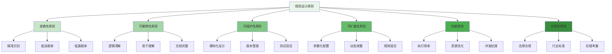

在企业级智能风控平台的建设中，策略规则集是风险识别和防控的核心组成部分。本附录将通过实际案例，详细介绍不同类型风控场景下的策略规则设计方法、规则表达方式以及最佳实践，为构建企业级风控策略体系提供参考。

## 风控策略规则集设计原则

构建有效的风控策略规则集需要遵循一系列设计原则，确保规则的科学性、可维护性和可扩展性。

### 规则设计核心原则



### 规则分类体系

```yaml
# 风控策略规则分类体系
risk_control_rule_classification:
  business_scenarios:
    name: "业务场景分类"
    description: "按照不同业务场景划分规则类型"
    categories:
      - user_registration:
          name: "用户注册"
          description: "用户账户创建阶段的风险防控"
          key_risks:
            - "虚假注册"
            - "批量注册"
            - "恶意爬虫"
            - "身份伪造"
          typical_rules:
            - "注册频率限制"
            - "设备指纹检测"
            - "IP黑名单匹配"
            - "手机号验证"
      
      - login_authentication:
          name: "登录认证"
          description: "用户身份验证阶段的风险防控"
          key_risks:
            - "暴力破解"
            - "撞库攻击"
            - "异地登录"
            - "设备异常"
          typical_rules:
            - "密码错误次数限制"
            - "登录频率控制"
            - "地理位置异常检测"
            - "设备指纹匹配"
      
      - transaction_payment:
          name: "交易支付"
          description: "资金交易环节的风险防控"
          key_risks:
            - "信用卡套现"
            - "洗钱交易"
            - "恶意退款"
            - "高风险商户"
          typical_rules:
            - "交易金额限制"
            - "交易频率控制"
            - "商户风险评级"
            - "用户信用评估"
  
  risk_levels:
    name: "风险等级分类"
    description: "按照风险严重程度划分规则类型"
    categories:
      - low_risk:
          name: "低风险"
          description: "一般性风险，可监控观察"
          response_actions:
            - "记录日志"
            - "风险评分调整"
            - "用户提醒"
            - "数据收集"
          typical_rules:
            - "行为模式偏离"
            - "设备使用异常"
            - "时间规律变化"
            - "数据填写不完整"
      
      - medium_risk:
          name: "中风险"
          description: "需要关注的风险，可能需要验证"
          response_actions:
            - "二次验证"
            - "人工审核"
            - "限制操作"
            - "风险预警"
          typical_rules:
            - "高频操作检测"
            - "异常时间段访问"
            - "多设备登录"
            - "信息不一致"
      
      - high_risk:
          name: "高风险"
          description: "明确的恶意行为，需要拦截"
          response_actions:
            - "直接拦截"
            - "账户冻结"
            - "紧急告警"
            - "司法报案"
          typical_rules:
            - "黑名单匹配"
            - "欺诈模式识别"
            - "恶意软件检测"
            - "违法内容识别"
  
  rule_complexity:
    name: "规则复杂度分类"
    description: "按照规则实现复杂度划分"
    categories:
      - simple_rules:
          name: "简单规则"
          description: "基于单一条件的规则"
          characteristics:
            - "条件简单"
            - "执行快速"
            - "易于理解"
            - "维护方便"
          examples:
            - "IP黑名单检测"
            - "手机号格式验证"
            - "登录次数限制"
            - "交易金额上限"
      
      - compound_rules:
          name: "复合规则"
          description: "基于多个条件组合的规则"
          characteristics:
            - "条件组合"
            - "逻辑复杂"
            - "权重计算"
            - "动态调整"
          examples:
            - "用户画像匹配"
            - "行为模式分析"
            - "设备指纹组合"
            - "地理位置关联"
      
      - intelligent_rules:
          name: "智能规则"
          description: "基于机器学习模型的规则"
          characteristics:
            - "模型驱动"
            - "自动学习"
            - "动态优化"
            - "复杂计算"
          examples:
            - "欺诈检测模型"
            - "信用评分模型"
            - "异常行为识别"
            - "风险预测模型"
```

## 用户注册风控规则集

用户注册是业务流程的第一道防线，需要建立完善的风控规则集来防止虚假注册和恶意行为。

### 基础验证规则

```python
class UserRegistrationRules:
    def __init__(self):
        self.rule_engine = RuleEngine()
        self.device_fingerprint = DeviceFingerprintService()
        self.ip_service = IPService()
        self.phone_verification = PhoneVerificationService()
    
    def validate_registration_request(self, registration_data):
        """验证注册请求"""
        validation_results = []
        
        # 1. 手机号格式验证
        phone_format_rule = SimpleRule(
            name="手机号格式验证",
            condition=lambda data: self.validate_phone_format(data.get('phone')),
            action="REJECT",
            risk_level="LOW",
            description="验证手机号格式是否正确"
        )
        validation_results.append(self.rule_engine.execute_rule(phone_format_rule, registration_data))
        
        # 2. 邮箱格式验证
        email_format_rule = SimpleRule(
            name="邮箱格式验证",
            condition=lambda data: self.validate_email_format(data.get('email')),
            action="REJECT",
            risk_level="LOW",
            description="验证邮箱格式是否正确"
        )
        validation_results.append(self.rule_engine.execute_rule(email_format_rule, registration_data))
        
        # 3. 用户名唯一性检查
        username_unique_rule = SimpleRule(
            name="用户名唯一性检查",
            condition=lambda data: self.check_username_unique(data.get('username')),
            action="REJECT",
            risk_level="LOW",
            description="检查用户名是否已被注册"
        )
        validation_results.append(self.rule_engine.execute_rule(username_unique_rule, registration_data))
        
        return validation_results
    
    def detect_suspicious_registration(self, registration_data):
        """检测可疑注册行为"""
        risk_results = []
        
        # 1. IP注册频率检测
        ip_frequency_rule = CompoundRule(
            name="IP注册频率检测",
            conditions=[
                lambda data: self.ip_service.get_registration_count(data.get('ip'), time_window=3600) > 10,
                lambda data: self.ip_service.is_data_center_ip(data.get('ip'))
            ],
            logic_operator="AND",
            action="CHALLENGE",
            risk_level="MEDIUM",
            description="检测同一IP在1小时内注册超过10次"
        )
        risk_results.append(self.rule_engine.execute_rule(ip_frequency_rule, registration_data))
        
        # 2. 设备指纹检测
        device_frequency_rule = CompoundRule(
            name="设备指纹注册频率检测",
            conditions=[
                lambda data: self.device_fingerprint.get_registration_count(data.get('device_fingerprint'), time_window=86400) > 5,
                lambda data: self.device_fingerprint.is_jailbroken(data.get('device_fingerprint'))
            ],
            logic_operator="OR",
            action="REVIEW",
            risk_level="HIGH",
            description="检测同一设备24小时内注册超过5次或设备被越狱"
        )
        risk_results.append(self.rule_engine.execute_rule(device_frequency_rule, registration_data))
        
        # 3. 手机号验证检测
        phone_verification_rule = CompoundRule(
            name="手机号验证检测",
            conditions=[
                lambda data: not self.phone_verification.is_verified(data.get('phone')),
                lambda data: self.phone_verification.get_verification_attempts(data.get('phone')) > 3
            ],
            logic_operator="AND",
            action="REJECT",
            risk_level="HIGH",
            description="手机号未通过验证且验证尝试超过3次"
        )
        risk_results.append(self.rule_engine.execute_rule(phone_verification_rule, registration_data))
        
        return risk_results
    
    def apply_advanced_fraud_detection(self, registration_data):
        """应用高级欺诈检测"""
        fraud_results = []
        
        # 1. 机器学习模型检测
        ml_fraud_rule = IntelligentRule(
            name="机器学习欺诈检测",
            model=FraudDetectionModel(),
            threshold=0.8,
            action="REVIEW",
            risk_level="HIGH",
            description="基于机器学习模型的欺诈检测"
        )
        fraud_results.append(self.rule_engine.execute_rule(ml_fraud_rule, registration_data))
        
        # 2. 用户画像匹配检测
        profile_matching_rule = IntelligentRule(
            name="用户画像匹配检测",
            model=UserProfileMatchingModel(),
            threshold=0.9,
            action="REJECT",
            risk_level="CRITICAL",
            description="检测与已知欺诈用户画像高度匹配的注册"
        )
        fraud_results.append(self.rule_engine.execute_rule(profile_matching_rule, registration_data))
        
        return fraud_results

class RuleEngine:
    def __init__(self):
        self.rule_logger = RuleLogger()
        self.metrics_collector = MetricsCollector()
    
    def execute_rule(self, rule, data):
        """执行规则"""
        start_time = time.time()
        
        try:
            # 1. 评估规则条件
            condition_result = rule.evaluate(data)
            
            # 2. 执行相应动作
            if condition_result:
                action_result = rule.execute_action(data)
                rule_result = RuleExecutionResult(
                    rule_name=rule.name,
                    triggered=True,
                    action=action_result,
                    risk_level=rule.risk_level,
                    execution_time=time.time() - start_time
                )
            else:
                rule_result = RuleExecutionResult(
                    rule_name=rule.name,
                    triggered=False,
                    action="ALLOW",
                    risk_level="NONE",
                    execution_time=time.time() - start_time
                )
            
            # 3. 记录执行日志
            self.rule_logger.log_rule_execution(rule_result)
            
            # 4. 收集指标
            self.metrics_collector.collect_rule_metrics(rule_result)
            
            return rule_result
            
        except Exception as e:
            self.rule_logger.log_rule_error(rule.name, str(e))
            return RuleExecutionResult(
                rule_name=rule.name,
                triggered=False,
                action="ERROR",
                risk_level="NONE",
                execution_time=time.time() - start_time,
                error=str(e)
            )

class SimpleRule:
    def __init__(self, name, condition, action, risk_level, description):
        self.name = name
        self.condition = condition
        self.action = action
        self.risk_level = risk_level
        self.description = description
    
    def evaluate(self, data):
        """评估规则条件"""
        try:
            return self.condition(data)
        except Exception:
            return False
    
    def execute_action(self, data):
        """执行规则动作"""
        return self.action
```

### 规则集配置示例

```go
type RegistrationRuleSet struct {
    BasicValidationRules   []RuleDefinition
    RiskDetectionRules     []RuleDefinition
    FraudPreventionRules   []RuleDefinition
    Configuration          RuleSetConfig
}

type RuleDefinition struct {
    ID          string                 `json:"id"`
    Name        string                 `json:"name"`
    Type        string                 `json:"type"`  // SIMPLE, COMPOUND, INTELLIGENT
    Conditions  []ConditionDefinition  `json:"conditions"`
    Action      string                 `json:"action"` // ALLOW, REJECT, CHALLENGE, REVIEW
    RiskLevel   string                 `json:"risk_level"` // LOW, MEDIUM, HIGH, CRITICAL
    Priority    int                    `json:"priority"`
    Enabled     bool                   `json:"enabled"`
    Metadata    map[string]interface{} `json:"metadata"`
}

type ConditionDefinition struct {
    Field      string      `json:"field"`
    Operator   string      `json:"operator"`  // EQ, NEQ, GT, LT, IN, CONTAINS, REGEX
    Value      interface{} `json:"value"`
    Threshold  float64     `json:"threshold,omitempty"`
    Weight     float64     `json:"weight,omitempty"`
}

func NewRegistrationRuleSet() *RegistrationRuleSet {
    return &RegistrationRuleSet{
        BasicValidationRules: []RuleDefinition{
            {
                ID:       "phone_format_validation",
                Name:     "手机号格式验证",
                Type:     "SIMPLE",
                Conditions: []ConditionDefinition{
                    {
                        Field:    "phone",
                        Operator: "REGEX",
                        Value:    "^1[3-9]\\d{9}$",
                    },
                },
                Action:    "REJECT",
                RiskLevel: "LOW",
                Priority:  1,
                Enabled:   true,
                Metadata: map[string]interface{}{
                    "description": "验证中国大陆手机号格式",
                    "category":    "validation",
                },
            },
            {
                ID:       "email_format_validation",
                Name:     "邮箱格式验证",
                Type:     "SIMPLE",
                Conditions: []ConditionDefinition{
                    {
                        Field:    "email",
                        Operator: "REGEX",
                        Value:    "^[a-zA-Z0-9._%+-]+@[a-zA-Z0-9.-]+\\.[a-zA-Z]{2,}$",
                    },
                },
                Action:    "REJECT",
                RiskLevel: "LOW",
                Priority:  1,
                Enabled:   true,
                Metadata: map[string]interface{}{
                    "description": "验证邮箱格式",
                    "category":    "validation",
                },
            },
        },
        RiskDetectionRules: []RuleDefinition{
            {
                ID:   "ip_registration_frequency",
                Name: "IP注册频率检测",
                Type: "COMPOUND",
                Conditions: []ConditionDefinition{
                    {
                        Field:     "ip_registration_count_1h",
                        Operator:  "GT",
                        Value:     10,
                        Weight:    0.6,
                    },
                    {
                        Field:     "is_data_center_ip",
                        Operator:  "EQ",
                        Value:     true,
                        Weight:    0.4,
                    },
                },
                Action:    "CHALLENGE",
                RiskLevel: "MEDIUM",
                Priority:  5,
                Enabled:   true,
                Metadata: map[string]interface{}{
                    "description": "检测数据中心IP高频注册",
                    "time_window": 3600,
                    "threshold":   10,
                },
            },
            {
                ID:   "device_registration_frequency",
                Name: "设备注册频率检测",
                Type: "COMPOUND",
                Conditions: []ConditionDefinition{
                    {
                        Field:     "device_registration_count_24h",
                        Operator:  "GT",
                        Value:     5,
                        Weight:    0.7,
                    },
                    {
                        Field:     "is_rooted_device",
                        Operator:  "EQ",
                        Value:     true,
                        Weight:    0.3,
                    },
                },
                Action:    "REVIEW",
                RiskLevel: "HIGH",
                Priority:  8,
                Enabled:   true,
                Metadata: map[string]interface{}{
                    "description": "检测设备高频注册或越狱设备",
                    "time_window": 86400,
                    "threshold":   5,
                },
            },
        },
        FraudPreventionRules: []RuleDefinition{
            {
                ID:   "ml_fraud_detection",
                Name: "机器学习欺诈检测",
                Type: "INTELLIGENT",
                Conditions: []ConditionDefinition{
                    {
                        Field:     "fraud_probability",
                        Operator:  "GT",
                        Value:     0.8,
                        Threshold: 0.8,
                    },
                },
                Action:    "REVIEW",
                RiskLevel: "HIGH",
                Priority:  10,
                Enabled:   true,
                Metadata: map[string]interface{}{
                    "description": "基于机器学习模型的欺诈检测",
                    "model_name":  "fraud_detection_v2",
                    "model_version": "2.1.0",
                },
            },
        },
        Configuration: RuleSetConfig{
            EvaluationMode:    "SEQUENTIAL",  // 顺序执行
            StopOnFirstMatch:  false,         // 不在首次匹配后停止
            DefaultAction:     "ALLOW",       // 默认允许
            Timeout:           1000,          // 1秒超时
            MaxParallelRules:  5,             // 最大并行规则数
        },
    }
}
```

## 登录认证风控规则集

登录认证是用户访问系统的关键环节，需要建立多层次的风控规则来防范各种攻击行为。

### 登录行为分析规则

```typescript
interface LoginAuthenticationRules {
    // 基础验证规则
    basicValidation(userData: LoginData): Promise<RuleResult[]>;
    
    // 风险行为检测
    riskBehaviorDetection(userData: LoginData): Promise<RuleResult[]>;
    
    // 智能威胁识别
    intelligentThreatDetection(userData: LoginData): Promise<RuleResult[]>;
    
    // 综合风险评估
    comprehensiveRiskAssessment(userData: LoginData): Promise<RiskAssessmentResult>;
}

class LoginAuthRuleEngine implements LoginAuthenticationRules {
    private ruleExecutor: RuleExecutor;
    private behaviorAnalyzer: BehaviorAnalyzer;
    private threatIntelligence: ThreatIntelligence;
    
    async basicValidation(userData: LoginData): Promise<RuleResult[]> {
        const basicRules: RuleDefinition[] = [
            {
                id: 'password_attempt_limit',
                name: '密码尝试次数限制',
                type: 'SIMPLE',
                conditions: [
                    {
                        field: 'failed_login_attempts',
                        operator: 'GT',
                        value: 5
                    }
                ],
                action: 'BLOCK',
                riskLevel: 'HIGH',
                priority: 10,
                description: '同一账户密码错误超过5次'
            },
            {
                id: 'account_status_check',
                name: '账户状态检查',
                type: 'SIMPLE',
                conditions: [
                    {
                        field: 'account_status',
                        operator: 'IN',
                        value: ['FROZEN', 'DISABLED', 'SUSPENDED']
                    }
                ],
                action: 'REJECT',
                riskLevel: 'HIGH',
                priority: 9,
                description: '账户状态异常'
            }
        ];
        
        return await this.ruleExecutor.executeRules(basicRules, userData);
    }
    
    async riskBehaviorDetection(userData: LoginData): Promise<RuleResult[]> {
        // 1. 异地登录检测
        const异地LoginRule: RuleDefinition = {
            id: '异地登录检测',
            name: '异地登录检测',
            type: 'COMPOUND',
            conditions: [
                {
                    field: 'current_location',
                    operator: 'NEQ',
                    value: 'last_login_location',
                    weight: 0.6
                },
                {
                    field: 'time_diff_hours',
                    operator: 'LT',
                    value: 6,
                    weight: 0.4
                }
            ],
            action: 'CHALLENGE',
            riskLevel: 'MEDIUM',
            priority: 7,
            description: '6小时内异地登录'
        };
        
        // 2. 设备异常检测
        const deviceAnomalyRule: RuleDefinition = {
            id: '设备异常检测',
            name: '设备异常检测',
            type: 'COMPOUND',
            conditions: [
                {
                    field: 'is_new_device',
                    operator: 'EQ',
                    value: true,
                    weight: 0.5
                },
                {
                    field: 'device_risk_score',
                    operator: 'GT',
                    value: 0.7,
                    weight: 0.5
                }
            ],
            action: 'CHALLENGE',
            riskLevel: 'MEDIUM',
            priority: 6,
            description: '新设备且设备风险评分高'
        };
        
        // 3. 时间异常检测
        const timeAnomalyRule: RuleDefinition = {
            id: '时间异常检测',
            name: '时间异常检测',
            type: 'SIMPLE',
            conditions: [
                {
                    field: 'login_time',
                    operator: 'IN',
                    value: ['02:00-05:00', '23:00-01:00']  // 深夜登录
                }
            ],
            action: 'REVIEW',
            riskLevel: 'LOW',
            priority: 4,
            description: '非正常时间段登录'
        };
        
        const riskRules = [异地LoginRule, deviceAnomalyRule, timeAnomalyRule];
        return await this.ruleExecutor.executeRules(riskRules, userData);
    }
    
    async intelligentThreatDetection(userData: LoginData): Promise<RuleResult[]> {
        // 1. 威胁情报匹配
        const threatIntelMatch = await this.threatIntelligence.checkIP(userData.ip);
        
        const threatIntelRule: RuleDefinition = {
            id: '威胁情报匹配',
            name: '威胁情报匹配',
            type: 'INTELLIGENT',
            conditions: [
                {
                    field: 'ip_threat_level',
                    operator: 'GT',
                    value: 0.8,
                    threshold: 0.8
                }
            ],
            action: 'BLOCK',
            riskLevel: 'CRITICAL',
            priority: 10,
            description: 'IP地址在威胁情报库中'
        };
        
        // 2. 行为模式异常
        const behaviorPattern = await this.behaviorAnalyzer.analyzeLoginPattern(userData);
        
        const behaviorAnomalyRule: RuleDefinition = {
            id: '行为模式异常',
            name: '行为模式异常',
            type: 'INTELLIGENT',
            conditions: [
                {
                    field: 'behavior_anomaly_score',
                    operator: 'GT',
                    value: 0.75,
                    threshold: 0.75
                }
            ],
            action: 'CHALLENGE',
            riskLevel: 'HIGH',
            priority: 8,
            description: '登录行为模式异常'
        };
        
        const intelligentRules = [threatIntelRule, behaviorAnomalyRule];
        return await this.ruleExecutor.executeRules(intelligentRules, userData);
    }
    
    async comprehensiveRiskAssessment(userData: LoginData): Promise<RiskAssessmentResult> {
        // 1. 执行所有规则
        const basicResults = await this.basicValidation(userData);
        const riskResults = await this.riskBehaviorDetection(userData);
        const intelligentResults = await this.intelligentThreatDetection(userData);
        
        const allResults = [...basicResults, ...riskResults, ...intelligentResults];
        
        // 2. 计算综合风险评分
        const riskScore = this.calculateRiskScore(allResults);
        
        // 3. 确定最终决策
        const finalDecision = this.determineFinalDecision(allResults, riskScore);
        
        // 4. 生成风险评估报告
        const assessmentReport = new RiskAssessmentReport({
            userId: userData.userId,
            riskScore: riskScore,
            decision: finalDecision,
            triggeredRules: allResults.filter(result => result.triggered),
            timestamp: new Date()
        });
        
        return new RiskAssessmentResult({
            score: riskScore,
            decision: finalDecision,
            report: assessmentReport,
            details: allResults
        });
    }
    
    private calculateRiskScore(ruleResults: RuleResult[]): number {
        let totalScore = 0;
        let totalWeight = 0;
        
        ruleResults.forEach(result => {
            if (result.triggered) {
                const riskWeight = this.getRiskWeight(result.riskLevel);
                totalScore += riskWeight * (result.confidence || 1.0);
                totalWeight += riskWeight;
            }
        });
        
        return totalWeight > 0 ? totalScore / totalWeight : 0;
    }
    
    private getRiskWeight(riskLevel: string): number {
        switch (riskLevel) {
            case 'LOW': return 1;
            case 'MEDIUM': return 3;
            case 'HIGH': return 7;
            case 'CRITICAL': return 10;
            default: return 0;
        }
    }
    
    private determineFinalDecision(ruleResults: RuleResult[], riskScore: number): string {
        // 检查是否有CRITICAL级别的规则被触发
        const criticalTriggered = ruleResults.some(
            result => result.triggered && result.riskLevel === 'CRITICAL'
        );
        
        if (criticalTriggered) {
            return 'BLOCK';
        }
        
        // 根据风险评分确定决策
        if (riskScore >= 0.8) {
            return 'BLOCK';
        } else if (riskScore >= 0.5) {
            return 'CHALLENGE';
        } else if (riskScore >= 0.3) {
            return 'REVIEW';
        } else {
            return 'ALLOW';
        }
    }
}
```

### 登录风控规则配置

```yaml
# 登录认证风控规则配置
login_authentication_rules:
  rule_sets:
    - name: "基础安全规则集"
      description: "登录认证的基础安全检查"
      rules:
        - id: "password_complexity_check"
          name: "密码复杂度检查"
          type: "SIMPLE"
          conditions:
            - field: "password"
              operator: "REGEX"
              value: "^(?=.*[a-z])(?=.*[A-Z])(?=.*\\d)(?=.*[@$!%*?&])[A-Za-z\\d@$!%*?&]{8,}$"
          action: "REJECT"
          risk_level: "LOW"
          priority: 1
          enabled: true
          metadata:
            description: "密码必须包含大小写字母、数字和特殊字符，长度至少8位"
        
        - id: "account_lockout"
          name: "账户锁定"
          type: "SIMPLE"
          conditions:
            - field: "failed_attempts"
              operator: "GTE"
              value: 5
          action: "LOCK_ACCOUNT"
          risk_level: "HIGH"
          priority: 10
          enabled: true
          metadata:
            description: "连续5次登录失败后锁定账户"
            lockout_duration: "30m"
    
    - name: "行为分析规则集"
      description: "基于用户行为的风控规则"
      rules:
        - id: "geographic_anomaly"
          name: "地理位置异常"
          type: "COMPOUND"
          conditions:
            - field: "location_distance_km"
              operator: "GT"
              value: 1000
              weight: 0.6
            - field: "time_diff_hours"
              operator: "LT"
              value: 6
              weight: 0.4
          action: "CHALLENGE"
          risk_level: "MEDIUM"
          priority: 5
          enabled: true
          metadata:
            description: "6小时内跨越1000公里登录"
        
        - id: "device_anomaly"
          name: "设备异常"
          type: "COMPOUND"
          conditions:
            - field: "is_new_device"
              operator: "EQ"
              value: true
              weight: 0.5
            - field: "device_risk_score"
              operator: "GT"
              value: 0.7
              weight: 0.5
          action: "CHALLENGE"
          risk_level: "MEDIUM"
          priority: 6
          enabled: true
          metadata:
            description: "新设备且设备风险评分高"
    
    - name: "智能检测规则集"
      description: "基于机器学习和威胁情报的检测规则"
      rules:
        - id: "ml_fraud_detection"
          name: "机器学习欺诈检测"
          type: "INTELLIGENT"
          conditions:
            - field: "fraud_probability"
              operator: "GT"
              value: 0.8
              threshold: 0.8
          action: "REVIEW"
          risk_level: "HIGH"
          priority: 8
          enabled: true
          metadata:
            description: "基于机器学习模型的欺诈检测"
            model: "fraud_detection_v3"
        
        - id: "threat_intelligence"
          name: "威胁情报匹配"
          type: "INTELLIGENT"
          conditions:
            - field: "ip_threat_score"
              operator: "GT"
              value: 0.9
              threshold: 0.9
          action: "BLOCK"
          risk_level: "CRITICAL"
          priority: 9
          enabled: true
          metadata:
            description: "IP地址在高危威胁情报库中"
```

## 交易支付风控规则集

交易支付环节涉及资金安全，是风控的重点领域，需要建立更加严格的风控规则集。

### 交易风险评估规则

```python
class TransactionRiskRules:
    def __init__(self):
        self.transaction_analyzer = TransactionAnalyzer()
        self.user_profile_service = UserProfileService()
        self.merchant_service = MerchantService()
        self.risk_model = RiskDetectionModel()
    
    def evaluate_transaction_risk(self, transaction_data):
        """评估交易风险"""
        risk_assessment = {
            'transaction_id': transaction_data.get('transaction_id'),
            'risk_score': 0.0,
            'risk_level': 'LOW',
            'triggered_rules': [],
            'recommendation': 'ALLOW',
            'details': {}
        }
        
        # 1. 基础交易规则检查
        basic_risks = self.check_basic_transaction_rules(transaction_data)
        risk_assessment['triggered_rules'].extend(basic_risks['triggered_rules'])
        risk_assessment['details']['basic'] = basic_risks['details']
        
        # 2. 用户行为分析
        user_risks = self.analyze_user_behavior(transaction_data)
        risk_assessment['triggered_rules'].extend(user_risks['triggered_rules'])
        risk_assessment['details']['user_behavior'] = user_risks['details']
        
        # 3. 商户风险评估
        merchant_risks = self.evaluate_merchant_risk(transaction_data)
        risk_assessment['triggered_rules'].extend(merchant_risks['triggered_rules'])
        risk_assessment['details']['merchant'] = merchant_risks['details']
        
        # 4. 智能风险检测
        intelligent_risks = self.apply_intelligent_detection(transaction_data)
        risk_assessment['triggered_rules'].extend(intelligent_risks['triggered_rules'])
        risk_assessment['details']['intelligent'] = intelligent_risks['details']
        
        # 5. 综合风险评分
        risk_assessment['risk_score'] = self.calculate_comprehensive_risk_score(risk_assessment)
        risk_assessment['risk_level'] = self.determine_risk_level(risk_assessment['risk_score'])
        risk_assessment['recommendation'] = self.determine_recommendation(risk_assessment)
        
        return risk_assessment
    
    def check_basic_transaction_rules(self, transaction_data):
        """检查基础交易规则"""
        triggered_rules = []
        details = {}
        
        # 1. 交易金额限制
        amount_limit_rule = {
            'rule_id': 'amount_limit_check',
            'rule_name': '交易金额限制检查',
            'condition': f"amount > {transaction_data.get('amount_limit', 10000)}",
            'triggered': transaction_data.get('amount', 0) > transaction_data.get('amount_limit', 10000),
            'risk_level': 'HIGH',
            'action': 'REVIEW' if transaction_data.get('amount', 0) > transaction_data.get('amount_limit', 10000) else 'ALLOW'
        }
        triggered_rules.append(amount_limit_rule)
        details['amount_limit'] = amount_limit_rule
        
        # 2. 交易频率检查
        frequency_rule = {
            'rule_id': 'transaction_frequency_check',
            'rule_name': '交易频率检查',
            'condition': f"user_transaction_count_24h > {transaction_data.get('frequency_limit', 10)}",
            'triggered': transaction_data.get('user_transaction_count_24h', 0) > transaction_data.get('frequency_limit', 10),
            'risk_level': 'MEDIUM',
            'action': 'CHALLENGE' if transaction_data.get('user_transaction_count_24h', 0) > transaction_data.get('frequency_limit', 10) else 'ALLOW'
        }
        triggered_rules.append(frequency_rule)
        details['frequency'] = frequency_rule
        
        # 3. 单日累计金额检查
        daily_limit_rule = {
            'rule_id': 'daily_amount_limit_check',
            'rule_name': '单日累计金额检查',
            'condition': f"daily_transaction_amount > {transaction_data.get('daily_limit', 50000)}",
            'triggered': transaction_data.get('daily_transaction_amount', 0) > transaction_data.get('daily_limit', 50000),
            'risk_level': 'HIGH',
            'action': 'REVIEW' if transaction_data.get('daily_transaction_amount', 0) > transaction_data.get('daily_limit', 50000) else 'ALLOW'
        }
        triggered_rules.append(daily_limit_rule)
        details['daily_limit'] = daily_limit_rule
        
        return {
            'triggered_rules': triggered_rules,
            'details': details
        }
    
    def analyze_user_behavior(self, transaction_data):
        """分析用户行为"""
        triggered_rules = []
        details = {}
        
        user_profile = self.user_profile_service.get_user_profile(transaction_data.get('user_id'))
        
        # 1. 用户风险等级检查
        user_risk_rule = {
            'rule_id': 'user_risk_level_check',
            'rule_name': '用户风险等级检查',
            'condition': f"user_risk_score > {transaction_data.get('user_risk_threshold', 0.7)}",
            'triggered': user_profile.get('risk_score', 0) > transaction_data.get('user_risk_threshold', 0.7),
            'risk_level': 'HIGH' if user_profile.get('risk_score', 0) > 0.8 else 'MEDIUM',
            'action': 'REVIEW' if user_profile.get('risk_score', 0) > transaction_data.get('user_risk_threshold', 0.7) else 'ALLOW'
        }
        triggered_rules.append(user_risk_rule)
        details['user_risk'] = user_risk_rule
        
        # 2. 异常用卡行为
        unusual_card_rule = {
            'rule_id': 'unusual_card_usage',
            'rule_name': '异常用卡行为',
            'condition': 'first_time_card_usage or multiple_cards_same_user',
            'triggered': transaction_data.get('is_first_time_card', False) or transaction_data.get('user_card_count', 1) > 3,
            'risk_level': 'MEDIUM',
            'action': 'CHALLENGE'
        }
        triggered_rules.append(unusual_card_rule)
        details['card_usage'] = unusual_card_rule
        
        return {
            'triggered_rules': triggered_rules,
            'details': details
        }
    
    def evaluate_merchant_risk(self, transaction_data):
        """评估商户风险"""
        triggered_rules = []
        details = {}
        
        merchant_info = self.merchant_service.get_merchant_info(transaction_data.get('merchant_id'))
        
        # 1. 商户风险评级
        merchant_risk_rule = {
            'rule_id': 'merchant_risk_rating',
            'rule_name': '商户风险评级',
            'condition': f"merchant_risk_level in {['HIGH', 'CRITICAL']}",
            'triggered': merchant_info.get('risk_level') in ['HIGH', 'CRITICAL'],
            'risk_level': merchant_info.get('risk_level', 'LOW'),
            'action': 'REVIEW' if merchant_info.get('risk_level') in ['HIGH', 'CRITICAL'] else 'ALLOW'
        }
        triggered_rules.append(merchant_risk_rule)
        details['merchant_risk'] = merchant_risk_rule
        
        # 2. 商户交易模式异常
        merchant_pattern_rule = {
            'rule_id': 'merchant_transaction_pattern',
            'rule_name': '商户交易模式异常',
            'condition': 'transaction_amount_deviation > 2.0',
            'triggered': merchant_info.get('amount_deviation', 0) > 2.0,
            'risk_level': 'MEDIUM',
            'action': 'REVIEW' if merchant_info.get('amount_deviation', 0) > 2.0 else 'ALLOW'
        }
        triggered_rules.append(merchant_pattern_rule)
        details['merchant_pattern'] = merchant_pattern_rule
        
        return {
            'triggered_rules': triggered_rules,
            'details': details
        }
    
    def apply_intelligent_detection(self, transaction_data):
        """应用智能检测"""
        triggered_rules = []
        details = {}
        
        # 1. 机器学习模型检测
        model_score = self.risk_model.predict(transaction_data)
        ml_detection_rule = {
            'rule_id': 'ml_fraud_detection',
            'rule_name': '机器学习欺诈检测',
            'condition': f"fraud_probability > {transaction_data.get('ml_threshold', 0.8)}",
            'triggered': model_score > transaction_data.get('ml_threshold', 0.8),
            'risk_level': 'HIGH',
            'action': 'REVIEW' if model_score > transaction_data.get('ml_threshold', 0.8) else 'ALLOW',
            'confidence': model_score
        }
        triggered_rules.append(ml_detection_rule)
        details['ml_detection'] = ml_detection_rule
        
        # 2. 关联网络分析
        network_risk = self.transaction_analyzer.analyze_network_risk(transaction_data)
        network_rule = {
            'rule_id': 'network_risk_analysis',
            'rule_name': '关联网络风险分析',
            'condition': f"network_risk_score > {transaction_data.get('network_threshold', 0.7)}",
            'triggered': network_risk > transaction_data.get('network_threshold', 0.7),
            'risk_level': 'HIGH',
            'action': 'REVIEW' if network_risk > transaction_data.get('network_threshold', 0.7) else 'ALLOW',
            'confidence': network_risk
        }
        triggered_rules.append(network_rule)
        details['network_analysis'] = network_rule
        
        return {
            'triggered_rules': triggered_rules,
            'details': details
        }
    
    def calculate_comprehensive_risk_score(self, risk_assessment):
        """计算综合风险评分"""
        total_score = 0
        total_weight = 0
        
        risk_weights = {
            'LOW': 1,
            'MEDIUM': 3,
            'HIGH': 7,
            'CRITICAL': 10
        }
        
        for rule in risk_assessment['triggered_rules']:
            if rule['triggered']:
                weight = risk_weights.get(rule['risk_level'], 1)
                confidence = rule.get('confidence', 1.0)
                total_score += weight * confidence
                total_weight += weight
        
        return total_score / total_weight if total_weight > 0 else 0.0
    
    def determine_risk_level(self, risk_score):
        """确定风险等级"""
        if risk_score >= 0.8:
            return 'CRITICAL'
        elif risk_score >= 0.6:
            return 'HIGH'
        elif risk_score >= 0.4:
            return 'MEDIUM'
        elif risk_score >= 0.2:
            return 'LOW'
        else:
            return 'VERY_LOW'
    
    def determine_recommendation(self, risk_assessment):
        """确定推荐动作"""
        # 检查是否有CRITICAL级别的规则被触发
        critical_triggered = any(
            rule['triggered'] and rule['risk_level'] == 'CRITICAL'
            for rule in risk_assessment['triggered_rules']
        )
        
        if critical_triggered:
            return 'BLOCK'
        
        # 根据风险等级确定推荐动作
        risk_level = risk_assessment['risk_level']
        if risk_level in ['CRITICAL', 'HIGH']:
            return 'REVIEW'
        elif risk_level == 'MEDIUM':
            return 'CHALLENGE'
        else:
            return 'ALLOW'
```

## 规则集管理最佳实践

### 规则生命周期管理

```go
type RuleLifecycleManager struct {
    RuleRepository     *RuleRepository
    VersionController  *VersionController
    TestingFramework   *RuleTestingFramework
    DeploymentManager  *RuleDeploymentManager
    MonitoringService  *RuleMonitoringService
}

type RuleLifecycleStage string

const (
    StageDevelopment   RuleLifecycleStage = "DEVELOPMENT"
    StageTesting       RuleLifecycleStage = "TESTING"
    StageStaging       RuleLifecycleStage = "STAGING"
    StageProduction    RuleLifecycleStage = "PRODUCTION"
    StageDeprecated    RuleLifecycleStage = "DEPRECATED"
    StageArchived      RuleLifecycleStage = "ARCHIVED"
)

func (rlm *RuleLifecycleManager) CreateRule(ruleDefinition RuleDefinition) (*Rule, error) {
    // 1. 验证规则定义
    if err := rlm.validateRuleDefinition(ruleDefinition); err != nil {
        return nil, err
    }
    
    // 2. 创建规则对象
    rule := &Rule{
        ID:          ruleDefinition.ID,
        Name:        ruleDefinition.Name,
        Definition:  ruleDefinition,
        Status:      "DRAFT",
        CreatedAt:   time.Now(),
        UpdatedAt:   time.Now(),
        Version:     "1.0.0",
        Stage:       StageDevelopment,
    }
    
    // 3. 保存到仓库
    if err := rlm.RuleRepository.Save(rule); err != nil {
        return nil, err
    }
    
    // 4. 记录操作日志
    rlm.logRuleOperation(rule, "CREATE")
    
    return rule, nil
}

func (rlm *RuleLifecycleManager) PromoteRule(ruleID string, targetStage RuleLifecycleStage) error {
    // 1. 获取规则
    rule, err := rlm.RuleRepository.GetByID(ruleID)
    if err != nil {
        return err
    }
    
    // 2. 验证阶段转换是否允许
    if !rlm.isStageTransitionAllowed(rule.Stage, targetStage) {
        return errors.New("stage transition not allowed")
    }
    
    // 3. 执行阶段特定操作
    switch targetStage {
    case StageTesting:
        if err := rlm.prepareForTesting(rule); err != nil {
            return err
        }
    case StageStaging:
        if err := rlm.prepareForStaging(rule); err != nil {
            return err
        }
    case StageProduction:
        if err := rlm.prepareForProduction(rule); err != nil {
            return err
        }
    }
    
    // 4. 更新规则阶段
    rule.Stage = targetStage
    rule.UpdatedAt = time.Now()
    
    // 5. 保存更新
    if err := rlm.RuleRepository.Update(rule); err != nil {
        return err
    }
    
    // 6. 记录操作日志
    rlm.logRuleOperation(rule, "PROMOTE")
    
    return nil
}

func (rlm *RuleLifecycleManager) TestRule(ruleID string, testCases []TestCase) (*TestResult, error) {
    // 1. 获取规则
    rule, err := rlm.RuleRepository.GetByID(ruleID)
    if err != nil {
        return nil, err
    }
    
    // 2. 执行测试
    testResults := make([]TestCaseResult, 0)
    passedCount := 0
    
    for _, testCase := range testCases {
        result := rlm.TestingFramework.ExecuteTestCase(rule, testCase)
        testResults = append(testResults, result)
        
        if result.Passed {
            passedCount++
        }
    }
    
    // 3. 生成测试报告
    testResult := &TestResult{
        RuleID:      ruleID,
        TotalTests:  len(testCases),
        PassedTests: passedCount,
        FailedTests: len(testCases) - passedCount,
        Results:     testResults,
        Timestamp:   time.Now(),
    }
    
    // 4. 保存测试结果
    if err := rlm.RuleRepository.SaveTestResult(testResult); err != nil {
        return nil, err
    }
    
    return testResult, nil
}

func (rlm *RuleLifecycleManager) DeployRule(ruleID string, environment string) error {
    // 1. 获取规则
    rule, err := rlm.RuleRepository.GetByID(ruleID)
    if err != nil {
        return err
    }
    
    // 2. 验证规则是否可以部署
    if rule.Stage != StageStaging {
        return errors.New("rule must be in staging stage to deploy")
    }
    
    // 3. 执行部署
    if err := rlm.DeploymentManager.DeployRule(rule, environment); err != nil {
        return err
    }
    
    // 4. 更新规则状态
    rule.Stage = StageProduction
    rule.DeployedAt = time.Now()
    rule.DeployedEnvironments = append(rule.DeployedEnvironments, environment)
    
    // 5. 保存更新
    if err := rlm.RuleRepository.Update(rule); err != nil {
        return err
    }
    
    // 6. 启动监控
    rlm.MonitoringService.StartMonitoring(ruleID, environment)
    
    // 7. 记录操作日志
    rlm.logRuleOperation(rule, "DEPLOY")
    
    return nil
}

type RuleTestingFramework struct {
    TestCaseRepository *TestCaseRepository
    MockDataService    *MockDataService
    AssertionEngine    *AssertionEngine
}

func (rtf *RuleTestingFramework) ExecuteTestCase(rule *Rule, testCase TestCase) TestCaseResult {
    // 1. 准备测试数据
    testData := rtf.MockDataService.GenerateTestData(testCase.Input)
    
    // 2. 执行规则
    startTime := time.Now()
    ruleResult := rule.Evaluate(testData)
    executionTime := time.Since(startTime)
    
    // 3. 验证结果
    passed := rtf.AssertionEngine.AssertResult(ruleResult, testCase.ExpectedOutput)
    
    // 4. 生成测试结果
    return TestCaseResult{
        TestCaseID:    testCase.ID,
        RuleID:        rule.ID,
        Input:         testCase.Input,
        Expected:      testCase.ExpectedOutput,
        Actual:        ruleResult,
        Passed:        passed,
        ExecutionTime: executionTime,
        Timestamp:     time.Now(),
    }
}
```

通过以上详细的规则集示例和管理实践，企业可以构建起完善、科学、可维护的风控策略体系。在实际应用中，需要根据具体的业务场景和风险特点，不断优化和调整规则集，确保风控系统的有效性和适应性。