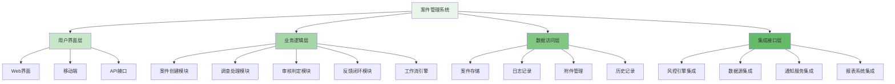

案件管理系统是风控运营工作台的核心组件，负责处理可疑交易、异常行为等风险事件的全生命周期管理。通过建立完善的案件管理流程，实现从风险事件发现到最终处理结果反馈的完整闭环，确保每个风险事件都能得到及时、准确的处理。

## 案件管理系统架构设计

案件管理系统需要支持复杂的业务流程和多角色协作，其架构设计直接影响系统的可用性和效率。

### 系统架构层次



### 核心功能模块

```yaml
# 案件管理系统核心功能模块
case_management_modules:
  case_creation:
    description: "案件创建与初始化"
    features:
      - "自动案件创建"
      - "手动案件创建"
      - "案件信息录入"
      - "优先级设置"
    integration_points:
      - "风控决策引擎"
      - "事件采集系统"
      - "外部数据源"
  
  investigation_processing:
    description: "案件调查与处理"
    features:
      - "调查任务分配"
      - "证据收集管理"
      - "调查进度跟踪"
      - "协查请求处理"
    integration_points:
      - "数据查询接口"
      - "外部系统调用"
      - "文档管理系统"
  
  review_decision:
    description: "案件审核与判定"
    features:
      - "多级审核流程"
      - "判定标准管理"
      - "审核意见记录"
      - "决策支持工具"
    integration_points:
      - "规则引擎"
      - "模型服务"
      - "知识库系统"
  
  feedback_closure:
    description: "反馈与闭环管理"
    features:
      - "处理结果反馈"
      - "策略优化建议"
      - "案例归档管理"
      - "经验总结分享"
    integration_points:
      - "策略管理系统"
      - "模型训练平台"
      - "知识库系统"
```

## 案件创建与初始化

案件创建是案件管理流程的起点，需要确保风险事件能够及时、准确地转化为可处理的案件。

### 自动案件创建机制

```python
class AutoCaseCreator:
    def __init__(self):
        self.risk_engine_client = RiskEngineClient()
        self.case_repository = CaseRepository()
        self.notification_service = NotificationService()
        self.priority_calculator = PriorityCalculator()
    
    def process_risk_events(self, events):
        """处理风险事件并创建案件"""
        created_cases = []
        
        for event in events:
            try:
                # 1. 评估事件风险等级
                risk_level = self.assess_risk_level(event)
                
                # 2. 判断是否需要创建案件
                if self.should_create_case(event, risk_level):
                    # 3. 创建案件
                    case = self.create_case_from_event(event, risk_level)
                    created_cases.append(case)
                    
                    # 4. 发送通知
                    self.send_creation_notification(case)
                
            except Exception as e:
                logger.error(f"Failed to process risk event {event.id}: {e}")
                continue
        
        return created_cases
    
    def assess_risk_level(self, event):
        """评估事件风险等级"""
        # 基于事件类型、金额、用户行为等维度计算风险评分
        risk_score = 0
        
        # 事件类型权重
        type_weights = {
            "FRAUD": 1.0,
            "ABUSE": 0.8,
            "SUSPICIOUS": 0.6,
            "NORMAL": 0.2
        }
        risk_score += type_weights.get(event.type, 0.1) * 30
        
        # 金额权重
        if event.amount > 10000:
            risk_score += 40
        elif event.amount > 1000:
            risk_score += 20
        else:
            risk_score += 10
        
        # 用户行为权重
        behavior_score = self.calculate_behavior_score(event.user_id)
        risk_score += behavior_score * 0.3
        
        # 返回风险等级
        if risk_score >= 80:
            return "HIGH"
        elif risk_score >= 50:
            return "MEDIUM"
        else:
            return "LOW"
    
    def create_case_from_event(self, event, risk_level):
        """从风险事件创建案件"""
        case = Case(
            id=self.generate_case_id(),
            event_id=event.id,
            risk_type=event.type,
            priority=self.priority_calculator.calculate(event, risk_level),
            status="CREATED",
            created_at=datetime.now(),
            metadata={
                "event_data": event.to_dict(),
                "risk_level": risk_level,
                "initial_score": self.calculate_initial_score(event)
            }
        )
        
        # 保存案件
        self.case_repository.save(case)
        
        # 记录创建日志
        self.log_case_creation(case)
        
        return case
```

### 手动案件创建流程

```go
type ManualCaseCreator struct {
    CaseRepository    *CaseRepository
    UserService       *UserService
    NotificationSvc   *NotificationService
    ValidationEngine  *ValidationEngine
}

type ManualCaseRequest struct {
    EventType     string            `json:"event_type"`
    EventDetails  map[string]interface{} `json:"event_details"`
    ReporterID    string            `json:"reporter_id"`
    Priority      string            `json:"priority"`
    Notes         string            `json:"notes"`
    Attachments   []string          `json:"attachments"`
}

func (mcc *ManualCaseCreator) CreateManualCase(request *ManualCaseRequest) (*Case, error) {
    // 1. 验证请求参数
    if err := mcc.validateRequest(request); err != nil {
        return nil, fmt.Errorf("invalid request: %w", err)
    }
    
    // 2. 验证报告人权限
    if err := mcc.UserService.CheckPermission(request.ReporterID, "create_case"); err != nil {
        return nil, fmt.Errorf("permission denied: %w", err)
    }
    
    // 3. 创建案件对象
    caseObj := &Case{
        ID:          generateCaseID(),
        EventType:   request.EventType,
        Priority:    request.Priority,
        Status:      "CREATED",
        ReporterID:  request.ReporterID,
        CreatedAt:   time.Now(),
        Metadata: map[string]interface{}{
            "event_details": request.EventDetails,
            "notes":         request.Notes,
            "attachments":   request.Attachments,
        },
    }
    
    // 4. 保存案件
    if err := mcc.CaseRepository.Save(caseObj); err != nil {
        return nil, fmt.Errorf("failed to save case: %w", err)
    }
    
    // 5. 处理附件
    if err := mcc.processAttachments(caseObj.ID, request.Attachments); err != nil {
        logger.Warnf("Failed to process attachments for case %s: %v", caseObj.ID, err)
    }
    
    // 6. 发送创建通知
    mcc.NotificationSvc.SendCaseCreationNotification(caseObj)
    
    // 7. 记录操作日志
    mcc.logManualCaseCreation(caseObj, request.ReporterID)
    
    return caseObj, nil
}

func (mcc *ManualCaseCreator) validateRequest(request *ManualCaseRequest) error {
    // 验证必填字段
    if request.EventType == "" {
        return fmt.Errorf("event_type is required")
    }
    
    if request.ReporterID == "" {
        return fmt.Errorf("reporter_id is required")
    }
    
    // 验证优先级
    validPriorities := []string{"LOW", "MEDIUM", "HIGH", "URGENT"}
    if !contains(validPriorities, request.Priority) {
        return fmt.Errorf("invalid priority: %s", request.Priority)
    }
    
    // 验证事件详情
    if err := mcc.ValidationEngine.ValidateEventDetails(request.EventType, request.EventDetails); err != nil {
        return fmt.Errorf("invalid event details: %w", err)
    }
    
    return nil
}
```

## 调查处理流程

调查处理是案件管理的核心环节，需要为调查人员提供充分的信息支持和工具协助。

### 调查任务分配机制

```typescript
interface InvestigationAssignment {
    // 智能任务分配
    assignTask(caseId: string, criteria: AssignmentCriteria): Promise<AssignmentResult>;
    
    // 任务重新分配
    reassignTask(taskId: string, newAssignee: string): Promise<void>;
    
    // 任务状态更新
    updateTaskStatus(taskId: string, status: TaskStatus): Promise<void>;
    
    // 调查进度跟踪
    trackInvestigationProgress(caseId: string): Promise<ProgressReport>;
}

class SmartTaskAssigner implements InvestigationAssignment {
    private userRepository: UserRepository;
    private workloadAnalyzer: WorkloadAnalyzer;
    private skillMatcher: SkillMatcher;
    private assignmentHistory: AssignmentHistory;
    
    async assignTask(caseId: string, criteria: AssignmentCriteria): Promise<AssignmentResult> {
        // 1. 获取可用调查员列表
        const availableInvestigators = await this.userRepository.getAvailableInvestigators();
        
        // 2. 分析工作负载
        const workloadInfo = await this.workloadAnalyzer.analyze(availableInvestigators);
        
        // 3. 匹配技能要求
        const skillMatched = await this.skillMatcher.match(availableInvestigators, criteria);
        
        // 4. 综合评估并选择最佳人选
        const bestCandidate = this.selectBestCandidate(
            availableInvestigators, 
            workloadInfo, 
            skillMatched, 
            criteria
        );
        
        // 5. 创建任务分配
        const assignment = await this.createAssignment(caseId, bestCandidate, criteria);
        
        // 6. 记录分配历史
        await this.assignmentHistory.record(assignment);
        
        // 7. 发送分配通知
        await this.sendAssignmentNotification(assignment);
        
        return {
            assignmentId: assignment.id,
            assignee: bestCandidate,
            caseId: caseId,
            assignedAt: new Date()
        };
    }
    
    private selectBestCandidate(
        candidates: User[], 
        workload: WorkloadInfo, 
        skills: SkillMatchResult, 
        criteria: AssignmentCriteria
    ): User {
        // 计算每个候选人的综合评分
        const scores = candidates.map(candidate => {
            // 工作负载评分 (负载越低得分越高)
            const workloadScore = this.calculateWorkloadScore(workload.get(candidate.id));
            
            // 技能匹配评分
            const skillScore = skills.getMatchScore(candidate.id);
            
            // 历史表现评分
            const historyScore = this.assignmentHistory.getPerformanceScore(candidate.id);
            
            // 优先级调整
            const priorityAdjustment = this.calculatePriorityAdjustment(candidate, criteria);
            
            // 综合评分
            const totalScore = (
                workloadScore * 0.3 + 
                skillScore * 0.4 + 
                historyScore * 0.2 + 
                priorityAdjustment * 0.1
            );
            
            return {
                candidate: candidate,
                score: totalScore
            };
        });
        
        // 选择得分最高的候选人
        return scores.sort((a, b) => b.score - a.score)[0].candidate;
    }
    
    async trackInvestigationProgress(caseId: string): Promise<ProgressReport> {
        // 1. 获取案件相关信息
        const caseInfo = await this.getCaseInfo(caseId);
        
        // 2. 获取调查任务状态
        const tasks = await this.getInvestigationTasks(caseId);
        
        // 3. 计算进度指标
        const progressMetrics = this.calculateProgressMetrics(tasks);
        
        // 4. 识别潜在问题
        const issues = this.identifyPotentialIssues(tasks);
        
        // 5. 生成进度报告
        return {
            caseId: caseId,
            caseInfo: caseInfo,
            tasks: tasks,
            progress: progressMetrics,
            issues: issues,
            lastUpdated: new Date()
        };
    }
}
```

### 证据收集与管理

```javascript
class EvidenceCollector {
    constructor(config) {
        this.config = config;
        this.storageService = new StorageService();
        this.metadataExtractor = new MetadataExtractor();
        this.verificationEngine = new VerificationEngine();
    }
    
    /**
     * 收集案件证据
     * @param {string} caseId - 案件ID
     * @param {Object} evidenceData - 证据数据
     * @returns {Promise<Object>} 证据记录
     */
    async collectEvidence(caseId, evidenceData) {
        try {
            // 1. 验证证据数据
            const validation = await this.validateEvidence(evidenceData);
            if (!validation.valid) {
                throw new Error(`Invalid evidence data: ${validation.errors.join(', ')}`);
            }
            
            // 2. 提取元数据
            const metadata = await this.metadataExtractor.extract(evidenceData);
            
            // 3. 存储证据
            const storageResult = await this.storageService.storeEvidence(evidenceData);
            
            // 4. 创建证据记录
            const evidenceRecord = {
                id: this.generateEvidenceId(),
                caseId: caseId,
                type: evidenceData.type,
                source: evidenceData.source,
                content: storageResult.location,
                metadata: metadata,
                collectedAt: new Date(),
                collector: evidenceData.collector,
                verified: false
            };
            
            // 5. 保存证据记录
            await this.saveEvidenceRecord(evidenceRecord);
            
            // 6. 触发验证流程
            this.triggerVerification(evidenceRecord);
            
            return evidenceRecord;
        } catch (error) {
            console.error('Evidence collection failed:', error);
            throw error;
        }
    }
    
    /**
     * 验证证据真实性
     * @param {Object} evidenceRecord - 证据记录
     * @returns {Promise<Object>} 验证结果
     */
    async verifyEvidence(evidenceRecord) {
        try {
            // 1. 执行验证检查
            const verificationResult = await this.verificationEngine.verify(evidenceRecord);
            
            // 2. 更新证据状态
            evidenceRecord.verified = verificationResult.valid;
            evidenceRecord.verificationResult = verificationResult;
            evidenceRecord.verifiedAt = new Date();
            
            // 3. 保存更新
            await this.updateEvidenceRecord(evidenceRecord);
            
            // 4. 记录验证日志
            await this.logVerification(evidenceRecord, verificationResult);
            
            return verificationResult;
        } catch (error) {
            console.error('Evidence verification failed:', error);
            throw error;
        }
    }
    
    /**
     * 获取案件所有证据
     * @param {string} caseId - 案件ID
     * @returns {Promise<Array>} 证据列表
     */
    async getCaseEvidence(caseId) {
        // 1. 查询证据记录
        const evidenceRecords = await this.queryEvidenceByCase(caseId);
        
        // 2. 补充证据内容
        const evidenceWithContent = await Promise.all(
            evidenceRecords.map(async record => {
                const content = await this.storageService.retrieveEvidence(record.content);
                return {
                    ...record,
                    content: content
                };
            })
        );
        
        return evidenceWithContent;
    }
}
```

## 审核判定流程

审核判定是确保案件处理质量和一致性的关键环节，需要建立标准化的审核流程和判定标准。

### 多级审核机制

```yaml
# 多级审核机制配置
multi_level_review:
  review_levels:
    level_1:
      name: "初级审核"
      description: "初步审核，确认案件基本信息和处理流程"
      reviewers:
        - "初级调查员"
        - "资深调查员"
      criteria:
        - "案件信息完整性检查"
        - "处理流程合规性检查"
        - "基本证据充分性评估"
      timeout: "24h"
    
    level_2:
      name: "高级审核"
      description: "深度审核，评估案件处理质量和风险控制效果"
      reviewers:
        - "高级调查员"
        - "风控专家"
      criteria:
        - "证据链完整性验证"
        - "处理结论合理性评估"
        - "风险控制措施有效性检查"
      timeout: "48h"
    
    level_3:
      name: "专家审核"
      description: "专家级审核，处理复杂或争议性案件"
      reviewers:
        - "风控专家"
        - "合规官"
      criteria:
        - "复杂案件专业评估"
        - "争议性问题专家判断"
        - "合规性最终确认"
      timeout: "72h"
  
  escalation_rules:
    - condition: "初级审核不通过"
      action: "升级到高级审核"
    
    - condition: "高级审核存在争议"
      action: "升级到专家审核"
    
    - condition: "超时未处理"
      action: "自动升级到下一级"
```

### 审核标准管理

```python
class ReviewStandardManager:
    def __init__(self):
        self.standard_repository = StandardRepository()
        self.version_control = VersionControl()
        self.approval_workflow = ApprovalWorkflow()
    
    def create_review_standard(self, standard_data):
        """创建审核标准"""
        # 1. 验证标准数据
        self.validate_standard_data(standard_data)
        
        # 2. 创建标准对象
        standard = ReviewStandard(
            id=self.generate_standard_id(),
            name=standard_data['name'],
            description=standard_data['description'],
            category=standard_data['category'],
            criteria=standard_data['criteria'],
            weight_config=standard_data['weight_config'],
            version=1,
            status="DRAFT",
            created_at=datetime.now()
        )
        
        # 3. 保存标准
        self.standard_repository.save(standard)
        
        # 4. 启动审批流程
        approval_process = self.approval_workflow.start_approval(
            item_id=standard.id,
            item_type="REVIEW_STANDARD",
            approvers=standard_data['approvers']
        )
        
        return {
            'standard': standard,
            'approval_process': approval_process
        }
    
    def evaluate_case_against_standard(self, case_id, standard_id):
        """根据审核标准评估案件"""
        # 1. 获取案件和标准
        case = self.get_case(case_id)
        standard = self.standard_repository.get(standard_id)
        
        # 2. 执行评估
        evaluation_result = self.perform_evaluation(case, standard)
        
        # 3. 计算得分
        score = self.calculate_score(evaluation_result, standard.weight_config)
        
        # 4. 生成评估报告
        report = self.generate_evaluation_report(case, standard, evaluation_result, score)
        
        # 5. 保存评估结果
        self.save_evaluation_result(case_id, standard_id, report)
        
        return report
    
    def perform_evaluation(self, case, standard):
        """执行具体评估"""
        evaluation_result = {}
        
        for criterion in standard.criteria:
            # 根据标准类型执行不同的评估逻辑
            if criterion['type'] == 'COMPLETENESS':
                evaluation_result[criterion['id']] = self.evaluate_completeness(case, criterion)
            elif criterion['type'] == 'ACCURACY':
                evaluation_result[criterion['id']] = self.evaluate_accuracy(case, criterion)
            elif criterion['type'] == 'COMPLIANCE':
                evaluation_result[criterion['id']] = self.evaluate_compliance(case, criterion)
            else:
                evaluation_result[criterion['id']] = self.evaluate_custom(case, criterion)
        
        return evaluation_result
    
    def calculate_score(self, evaluation_result, weight_config):
        """计算综合得分"""
        total_score = 0
        total_weight = 0
        
        for criterion_id, result in evaluation_result.items():
            weight = weight_config.get(criterion_id, 1.0)
            score = result.get('score', 0)
            
            total_score += score * weight
            total_weight += weight
        
        return total_score / total_weight if total_weight > 0 else 0
```

## 反馈闭环管理

反馈闭环是案件管理流程的最后环节，通过有效的反馈机制实现经验积累和持续改进。

### 处理结果反馈机制

```go
type FeedbackManager struct {
    FeedbackRepository *FeedbackRepository
    NotificationSvc    *NotificationService
    AnalyticsEngine    *AnalyticsEngine
    ImprovementTracker *ImprovementTracker
}

type Feedback struct {
    ID           string
    CaseID       string
    Result       string
    Satisfaction string
    Comments     string
    SubmittedBy  string
    SubmittedAt  time.Time
    Processed    bool
    ProcessedAt  time.Time
}

func (fm *FeedbackManager) SubmitFeedback(feedback *Feedback) error {
    // 1. 验证反馈数据
    if err := fm.validateFeedback(feedback); err != nil {
        return fmt.Errorf("invalid feedback: %w", err)
    }
    
    // 2. 设置反馈ID和时间戳
    feedback.ID = generateFeedbackID()
    feedback.SubmittedAt = time.Now()
    feedback.Processed = false
    
    // 3. 保存反馈
    if err := fm.FeedbackRepository.Save(feedback); err != nil {
        return fmt.Errorf("failed to save feedback: %w", err)
    }
    
    // 4. 发送反馈确认通知
    fm.NotificationSvc.SendFeedbackConfirmation(feedback)
    
    // 5. 触发分析流程
    go fm.analyzeFeedback(feedback)
    
    return nil
}

func (fm *FeedbackManager) analyzeFeedback(feedback *Feedback) {
    // 1. 提取反馈特征
    features := fm.extractFeedbackFeatures(feedback)
    
    // 2. 执行情感分析
    sentiment := fm.performSentimentAnalysis(feedback.Comments)
    
    // 3. 识别改进机会
    improvementOpportunities := fm.identifyImprovementOpportunities(features, sentiment)
    
    // 4. 更新分析结果
    fm.updateFeedbackAnalysis(feedback.ID, features, sentiment, improvementOpportunities)
    
    // 5. 跟踪改进项
    for _, opportunity := range improvementOpportunities {
        fm.ImprovementTracker.TrackOpportunity(opportunity)
    }
}

func (fm *FeedbackManager) ProcessFeedbackBatch(batchSize int) error {
    // 1. 获取未处理的反馈
    feedbacks, err := fm.FeedbackRepository.GetUnprocessed(batchSize)
    if err != nil {
        return fmt.Errorf("failed to get unprocessed feedback: %w", err)
    }
    
    // 2. 批量处理反馈
    for _, feedback := range feedbacks {
        // 3. 分析反馈内容
        analysis := fm.analyzeFeedbackContent(feedback)
        
        // 4. 生成改进建议
        suggestions := fm.generateImprovementSuggestions(analysis)
        
        // 5. 发送改进建议给相关人员
        fm.NotificationSvc.SendImprovementSuggestions(feedback, suggestions)
        
        // 6. 标记反馈为已处理
        feedback.Processed = true
        feedback.ProcessedAt = time.Now()
        fm.FeedbackRepository.Update(feedback)
    }
    
    return nil
}
```

### 策略优化建议系统

```typescript
interface StrategyOptimization {
    // 分析案件处理结果
    analyzeCaseOutcomes(caseIds: string[]): Promise<OutcomeAnalysis>;
    
    // 生成策略优化建议
    generateOptimizationSuggestions(analysis: OutcomeAnalysis): Promise<OptimizationSuggestion[]>;
    
    // 评估建议实施效果
    evaluateSuggestionImpact(suggestion: OptimizationSuggestion): Promise<ImpactAssessment>;
    
    // 跟踪优化实施进度
    trackOptimizationProgress(suggestionId: string): Promise<ProgressTracking>;
}

class StrategyOptimizer implements StrategyOptimization {
    private caseRepository: CaseRepository;
    private analyticsEngine: AnalyticsEngine;
    private suggestionEngine: SuggestionEngine;
    private impactAssessor: ImpactAssessor;
    
    async analyzeCaseOutcomes(caseIds: string[]): Promise<OutcomeAnalysis> {
        // 1. 获取案件处理结果
        const caseOutcomes = await this.caseRepository.getOutcomes(caseIds);
        
        // 2. 统计分析
        const statistics = this.performStatisticalAnalysis(caseOutcomes);
        
        // 3. 趋势分析
        const trends = this.analyzeTrends(caseOutcomes);
        
        // 4. 异常检测
        const anomalies = this.detectAnomalies(caseOutcomes);
        
        // 5. 生成分析报告
        return {
            statistics: statistics,
            trends: trends,
            anomalies: anomalies,
            analyzedAt: new Date()
        };
    }
    
    async generateOptimizationSuggestions(analysis: OutcomeAnalysis): Promise<OptimizationSuggestion[]> {
        // 1. 识别优化机会
        const opportunities = this.identifyOptimizationOpportunities(analysis);
        
        // 2. 生成具体建议
        const suggestions = await Promise.all(
            opportunities.map(async opportunity => {
                const suggestion = await this.suggestionEngine.generate(opportunity);
                return {
                    ...suggestion,
                    id: this.generateSuggestionId(),
                    createdAt: new Date(),
                    status: 'PENDING'
                };
            })
        );
        
        // 3. 保存建议
        await this.saveSuggestions(suggestions);
        
        return suggestions;
    }
    
    private identifyOptimizationOpportunities(analysis: OutcomeAnalysis): Opportunity[] {
        const opportunities: Opportunity[] = [];
        
        // 基于统计结果识别机会
        if (analysis.statistics.accuracy < 0.95) {
            opportunities.push({
                type: 'ACCURACY_IMPROVEMENT',
                description: '提高风险识别准确率',
                priority: 'HIGH'
            });
        }
        
        if (analysis.statistics.processingTime > 3600) { // 1小时
            opportunities.push({
                type: 'EFFICIENCY_IMPROVEMENT',
                description: '优化案件处理效率',
                priority: 'MEDIUM'
            });
        }
        
        // 基于趋势分析识别机会
        if (analysis.trends.increasingRisks) {
            opportunities.push({
                type: 'DETECTION_ENHANCEMENT',
                description: '加强风险检测能力',
                priority: 'HIGH'
            });
        }
        
        // 基于异常检测识别机会
        if (analysis.anomalies.length > 0) {
            opportunities.push({
                type: 'PROCESS_OPTIMIZATION',
                description: '优化异常处理流程',
                priority: 'MEDIUM'
            });
        }
        
        return opportunities;
    }
}
```

## 系统集成与扩展

案件管理系统需要与风控平台的其他组件紧密集成，形成完整的风控生态。

### 与风控引擎集成

```javascript
class CaseManagementIntegration {
    constructor(config) {
        this.config = config;
        this.riskEngineClient = new RiskEngineClient(config.riskEngine);
        this.notificationService = new NotificationService(config.notifications);
        this.reportingEngine = new ReportingEngine(config.reporting);
    }
    
    /**
     * 与风控引擎双向集成
     * @param {Object} caseData - 案件数据
     * @returns {Promise<Object>} 集成结果
     */
    async integrateWithRiskEngine(caseData) {
        try {
            // 1. 向风控引擎推送案件处理结果
            const engineUpdate = await this.riskEngineClient.updateCaseResult(caseData);
            
            // 2. 获取风控引擎反馈
            const engineFeedback = await this.riskEngineClient.getFeedback(caseData.id);
            
            // 3. 更新案件状态
            await this.updateCaseWithEngineFeedback(caseData.id, engineFeedback);
            
            // 4. 触发相关通知
            await this.notificationService.sendIntegrationNotification({
                caseId: caseData.id,
                engineUpdate: engineUpdate,
                engineFeedback: engineFeedback
            });
            
            return {
                success: true,
                engineUpdate: engineUpdate,
                engineFeedback: engineFeedback
            };
        } catch (error) {
            console.error('Risk engine integration failed:', error);
            return {
                success: false,
                error: error.message
            };
        }
    }
    
    /**
     * 实时同步案件状态
     * @param {string} caseId - 案件ID
     * @param {string} status - 案件状态
     * @returns {Promise<void>}
     */
    async syncCaseStatus(caseId, status) {
        // 1. 更新本地案件状态
        await this.updateLocalCaseStatus(caseId, status);
        
        // 2. 同步到风控引擎
        await this.riskEngineClient.syncCaseStatus(caseId, status);
        
        // 3. 更新相关报表
        await this.reportingEngine.updateCaseStatusReport(caseId, status);
        
        // 4. 发送状态变更通知
        await this.notificationService.sendStatusChangeNotification(caseId, status);
    }
}
```

通过构建完善的案件管理系统，风控团队可以实现案件处理的标准化、自动化和智能化，显著提升工作效率和处理质量，为企业的风险控制提供有力保障。