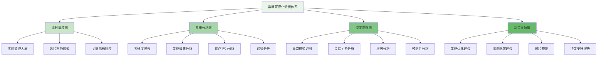
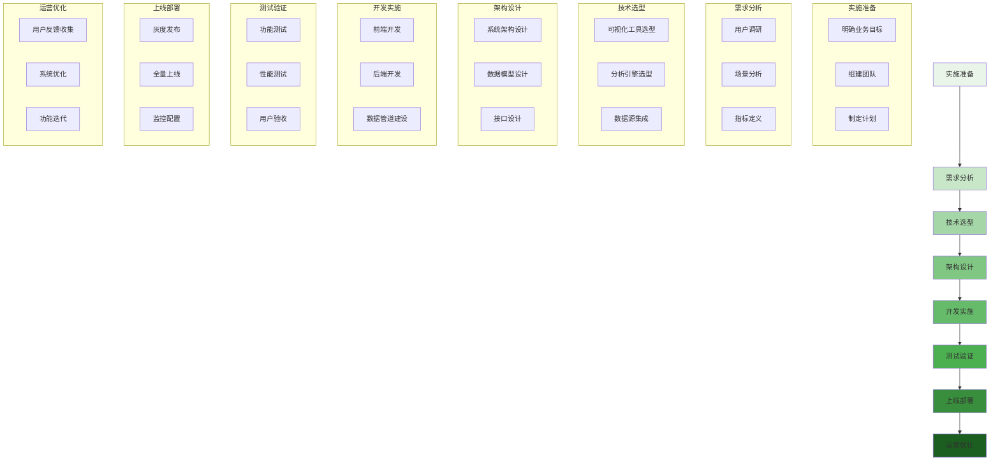

在企业级智能风控平台的运营中，数据可视化与分析是决策支持的核心工具。通过构建多维度的可视化分析体系，风控团队能够实时掌握业务风险态势，深入分析策略执行效果，并为持续优化提供数据驱动的决策依据。

## 数据可视化分析体系架构

数据可视化分析体系需要覆盖从实时监控到深度分析的全场景需求，形成完整的决策支持链条。

### 分析体系架构层次



### 核心分析维度

```yaml
# 数据可视化分析核心维度
analysis_dimensions:
  risk_overview:
    description: "风险态势总览"
    key_metrics:
      - "整体风险水位"
      - "各业务线风险分布"
      - "风险事件趋势"
      - "拦截率与误报率"
    visualization_types:
      - "实时监控大屏"
      - "趋势折线图"
      - "地理热力图"
      - "风险雷达图"
  
  strategy_effectiveness:
    description: "策略效果分析"
    key_metrics:
      - "策略命中率"
      - "策略准确率"
      - "策略成本收益"
      - "策略演进趋势"
    visualization_types:
      - "策略对比柱状图"
      - "效果趋势图"
      - "收益成本分析图"
      - "策略矩阵热图"
  
  user_behavior:
    description: "用户行为分析"
    key_metrics:
      - "用户风险画像"
      - "行为模式变化"
      - "异常行为识别"
      - "用户群体分析"
    visualization_types:
      - "用户画像雷达图"
      - "行为轨迹图"
      - "聚类分析图"
      - "时间序列图"
  
  operational_efficiency:
    description: "运营效率分析"
    key_metrics:
      - "案件处理时效"
      - "团队工作负载"
      - "自动化率"
      - "人力成本分析"
    visualization_types:
      - "效率仪表盘"
      - "工作负载图"
      - "时效分析图"
      - "成本效益图"
```

## 实时监控与态势感知

实时监控与态势感知是风控运营的第一道防线，需要提供直观、及时的风险视图。

### 实时监控大屏设计

```python
class RealTimeMonitoringDashboard:
    def __init__(self):
        self.metrics_collector = MetricsCollector()
        self.alert_engine = AlertEngine()
        self.visualization_engine = VisualizationEngine()
    
    def render_overview_panel(self):
        """渲染总览面板"""
        # 1. 获取核心指标
        core_metrics = self.metrics_collector.get_core_metrics()
        
        # 2. 构建可视化组件
        components = {
            "risk_level_indicator": self.build_risk_level_indicator(core_metrics.risk_level),
            "event_volume_chart": self.build_event_volume_chart(core_metrics.event_volume),
            "interception_rate_chart": self.build_interception_rate_chart(core_metrics.interception_rate),
            "top_risk_business": self.build_top_risk_business_chart(core_metrics.business_risk)
        }
        
        # 3. 渲染面板
        dashboard = self.visualization_engine.render_dashboard(components)
        
        return dashboard
    
    def build_risk_level_indicator(self, risk_level):
        """构建风险等级指示器"""
        indicator_config = {
            "type": "gauge",
            "title": "整体风险水位",
            "value": risk_level.current_score,
            "max": 100,
            "thresholds": [
                {"value": 30, "color": "green", "label": "低风险"},
                {"value": 70, "color": "yellow", "label": "中风险"},
                {"value": 100, "color": "red", "label": "高风险"}
            ],
            "current_status": risk_level.status
        }
        
        return indicator_config
    
    def build_event_volume_chart(self, event_volume):
        """构建事件量趋势图"""
        chart_config = {
            "type": "line",
            "title": "风险事件量趋势",
            "data": event_volume.hourly_data,
            "x_axis": "time",
            "y_axis": "count",
            "threshold_line": event_volume.threshold,
            "alert_zones": event_volume.alert_zones
        }
        
        return chart_config
    
    def update_real_time_data(self):
        """更新实时数据"""
        while True:
            # 1. 收集最新数据
            latest_data = self.metrics_collector.collect_latest()
            
            # 2. 检查告警条件
            alerts = self.alert_engine.check_alerts(latest_data)
            
            # 3. 触发告警
            if alerts:
                self.alert_engine.trigger_alerts(alerts)
            
            # 4. 更新可视化
            self.visualization_engine.update_data(latest_data)
            
            # 5. 等待下次更新
            time.sleep(5)  # 5秒更新一次
```

### 攻击态势感知系统

```go
type AttackSituationAwareness struct {
    DataCollector    *RealTimeDataCollector
    PatternAnalyzer  *AttackPatternAnalyzer
    Visualization    *SituationVisualization
    AlertManager     *AlertNotificationManager
}

type AttackSituation struct {
    TimeWindow       time.Time
    AttackVectors    []AttackVector
    RiskHotspots     []RiskHotspot
    TrendAnalysis    TrendAnalysis
    PredictiveAlerts []PredictiveAlert
}

type AttackVector struct {
    Type             string    // 攻击类型
    Source           string    // 攻击来源
    Target           string    // 攻击目标
    Volume           int       // 攻击量级
    Intensity        float64   // 攻击强度
    SuccessRate      float64   // 成功率
    GeoDistribution  map[string]float64  // 地理分布
}

func (asa *AttackSituationAwareness) AnalyzeAttackSituation() *AttackSituation {
    // 1. 收集实时数据
    rawData := asa.DataCollector.CollectRealTimeData()
    
    // 2. 识别攻击向量
    attackVectors := asa.identifyAttackVectors(rawData)
    
    // 3. 分析风险热点
    riskHotspots := asa.analyzeRiskHotspots(attackVectors)
    
    // 4. 趋势分析
    trendAnalysis := asa.performTrendAnalysis(attackVectors)
    
    // 5. 预测性分析
    predictiveAlerts := asa.generatePredictiveAlerts(trendAnalysis)
    
    situation := &AttackSituation{
        TimeWindow:       time.Now(),
        AttackVectors:    attackVectors,
        RiskHotspots:     riskHotspots,
        TrendAnalysis:    trendAnalysis,
        PredictiveAlerts: predictiveAlerts,
    }
    
    // 6. 可视化呈现
    asa.Visualization.RenderSituation(situation)
    
    // 7. 告警通知
    asa.AlertManager.SendAlerts(predictiveAlerts)
    
    return situation
}

func (asa *AttackSituationAwareness) identifyAttackVectors(rawData []*EventData) []AttackVector {
    vectors := make([]AttackVector, 0)
    
    // 按攻击类型和来源分组统计
    vectorMap := make(map[string]*AttackVector)
    
    for _, event := range rawData {
        key := fmt.Sprintf("%s_%s_%s", event.AttackType, event.SourceIP, event.Target)
        
        if vector, exists := vectorMap[key]; exists {
            vector.Volume++
            if event.IsSuccess {
                vector.SuccessRate = (vector.SuccessRate*float64(vector.Volume-1) + 1) / float64(vector.Volume)
            }
        } else {
            vector := &AttackVector{
                Type:        event.AttackType,
                Source:      event.SourceIP,
                Target:      event.Target,
                Volume:      1,
                Intensity:   event.Intensity,
                SuccessRate: 0,
            }
            if event.IsSuccess {
                vector.SuccessRate = 1.0
            }
            vectorMap[key] = vector
        }
    }
    
    // 转换为切片
    for _, vector := range vectorMap {
        if vector.Volume > 10 { // 过滤低频攻击
            vectors = append(vectors, *vector)
        }
    }
    
    return vectors
}
```

## 策略效果分析系统

策略效果分析是优化风控体系的关键环节，需要建立科学的评估体系。

### 策略效果评估框架

```typescript
interface StrategyEffectivenessAnalyzer {
    // 策略效果评估
    evaluateStrategyEffectiveness(strategyId: string, timeRange: TimeRange): Promise<StrategyEvaluation>;
    
    // 策略对比分析
    compareStrategies(strategyIds: string[]): Promise<StrategyComparison>;
    
    // ROI分析
    analyzeROI(strategyId: string, timeRange: TimeRange): Promise<ROIReturn>;
    
    // 趋势预测
    predictStrategyTrend(strategyId: string, forecastPeriod: number): Promise<TrendPrediction>;
}

class RiskControlStrategyAnalyzer implements StrategyEffectivenessAnalyzer {
    private metricsRepository: MetricsRepository;
    private businessImpactCalculator: BusinessImpactCalculator;
    private statisticalEngine: StatisticalAnalysisEngine;
    
    async evaluateStrategyEffectiveness(strategyId: string, timeRange: TimeRange): Promise<StrategyEvaluation> {
        // 1. 收集策略执行数据
        const executionData = await this.metricsRepository.getStrategyExecutionData(
            strategyId, 
            timeRange
        );
        
        // 2. 计算核心指标
        const coreMetrics = this.calculateCoreMetrics(executionData);
        
        // 3. 业务影响分析
        const businessImpact = await this.businessImpactCalculator.calculateImpact(
            strategyId, 
            timeRange
        );
        
        // 4. 统计显著性检验
        const statisticalSignificance = await this.statisticalEngine.testSignificance(
            executionData
        );
        
        // 5. 综合评估
        const evaluation = {
            strategyId: strategyId,
            timeRange: timeRange,
            metrics: coreMetrics,
            businessImpact: businessImpact,
            statisticalSignificance: statisticalSignificance,
            overallScore: this.calculateOverallScore(coreMetrics, businessImpact),
            recommendations: this.generateRecommendations(coreMetrics, businessImpact)
        };
        
        return evaluation;
    }
    
    async compareStrategies(strategyIds: string[]): Promise<StrategyComparison> {
        // 1. 并行获取各策略数据
        const evaluations = await Promise.all(
            strategyIds.map(id => this.evaluateStrategyEffectiveness(id, {last: '30d'}))
        );
        
        // 2. 构建对比矩阵
        const comparisonMatrix = this.buildComparisonMatrix(evaluations);
        
        // 3. 识别最佳实践
        const bestPractices = this.identifyBestPractices(evaluations);
        
        // 4. 差异化分析
        const差异化Analysis = this.perform差异化Analysis(evaluations);
        
        return {
            strategies: evaluations,
            comparisonMatrix: comparisonMatrix,
            bestPractices: bestPractices,
            差异化Analysis: 差异化Analysis
        };
    }
    
    private calculateCoreMetrics(executionData: StrategyExecutionData) {
        return {
            // 准确性指标
            precision: this.calculatePrecision(executionData),
            recall: this.calculateRecall(executionData),
            f1Score: this.calculateF1Score(executionData),
            
            // 效率指标
            processingTime: executionData.avgProcessingTime,
            throughput: executionData.eventsPerSecond,
            
            // 成本指标
            costPerEvent: executionData.totalCost / executionData.eventCount,
            resourceUtilization: executionData.avgResourceUtilization,
            
            // 业务指标
            businessImpact: executionData.businessValue,
            userExperience: executionData.userSatisfaction
        };
    }
    
    private calculateOverallScore(metrics: any, businessImpact: any): number {
        // 加权计算综合得分
        const weights = {
            precision: 0.2,
            recall: 0.2,
            f1Score: 0.15,
            businessImpact: 0.25,
            userExperience: 0.1,
            costEfficiency: 0.1
        };
        
        return (
            metrics.precision * weights.precision +
            metrics.recall * weights.recall +
            metrics.f1Score * weights.f1Score +
            businessImpact.value * weights.businessImpact +
            businessImpact.userSatisfaction * weights.userExperience +
            (1 / metrics.costPerEvent) * weights.costEfficiency
        );
    }
}
```

### 多维度报表系统

```javascript
class MultiDimensionalReportingSystem {
    constructor(config) {
        this.config = config;
        this.reportGenerator = new ReportGenerator();
        this.dataAggregator = new DataAggregator();
        this.visualizationEngine = new VisualizationEngine();
    }
    
    /**
     * 生成多维度风险报表
     * @param {Object} criteria - 报表生成条件
     * @returns {Promise<Object>} 报表数据
     */
    async generateRiskReport(criteria) {
        try {
            // 1. 数据聚合
            const aggregatedData = await this.aggregateRiskData(criteria);
            
            // 2. 多维度分析
            const dimensionalAnalysis = await this.performDimensionalAnalysis(aggregatedData);
            
            // 3. 生成可视化图表
            const charts = await this.generateCharts(dimensionalAnalysis);
            
            // 4. 生成报表内容
            const reportContent = await this.reportGenerator.generate({
                data: dimensionalAnalysis,
                charts: charts,
                metadata: {
                    generatedAt: new Date(),
                    criteria: criteria,
                    version: this.config.version
                }
            });
            
            return {
                success: true,
                data: reportContent,
                analysis: dimensionalAnalysis
            };
        } catch (error) {
            console.error('Failed to generate risk report:', error);
            return { success: false, error: error.message };
        }
    }
    
    /**
     * 聚合风险数据
     * @param {Object} criteria - 聚合条件
     * @returns {Promise<Object>} 聚合数据
     */
    async aggregateRiskData(criteria) {
        // 1. 确定数据源
        const dataSources = this.identifyDataSources(criteria);
        
        // 2. 并行获取数据
        const rawData = await Promise.all(
            dataSources.map(source => this.fetchDataFromSource(source, criteria))
        );
        
        // 3. 数据清洗和标准化
        const cleanedData = await this.cleanAndStandardizeData(rawData);
        
        // 4. 按维度聚合
        const aggregated = this.aggregateByDimensions(cleanedData, criteria.dimensions);
        
        return aggregated;
    }
    
    /**
     * 执行多维度分析
     * @param {Object} data - 待分析数据
     * @returns {Promise<Object>} 分析结果
     */
    async performDimensionalAnalysis(data) {
        const analysis = {};
        
        // 1. 时间维度分析
        analysis.timeAnalysis = this.analyzeTimeDimension(data);
        
        // 2. 业务维度分析
        analysis.businessAnalysis = this.analyzeBusinessDimension(data);
        
        // 3. 地域维度分析
        analysis.geoAnalysis = this.analyzeGeoDimension(data);
        
        // 4. 用户维度分析
        analysis.userAnalysis = this.analyzeUserDimension(data);
        
        // 5. 策略维度分析
        analysis.strategyAnalysis = this.analyzeStrategyDimension(data);
        
        // 6. 关联性分析
        analysis.correlationAnalysis = this.analyzeCorrelations(data);
        
        return analysis;
    }
    
    /**
     * 生成可视化图表
     * @param {Object} analysis - 分析结果
     * @returns {Promise<Array>} 图表配置
     */
    async generateCharts(analysis) {
        const charts = [];
        
        // 1. 风险趋势图
        charts.push({
            type: 'line',
            title: '风险事件趋势分析',
            data: analysis.timeAnalysis.trendData,
            options: {
                xAxis: 'date',
                yAxis: 'eventCount',
                series: ['total', 'blocked', 'suspicious']
            }
        });
        
        // 2. 业务分布饼图
        charts.push({
            type: 'pie',
            title: '各业务线风险分布',
            data: analysis.businessAnalysis.distribution,
            options: {
                valueField: 'count',
                labelField: 'business'
            }
        });
        
        // 3. 地理热力图
        charts.push({
            type: 'heatmap',
            title: '风险地理分布',
            data: analysis.geoAnalysis.heatmapData,
            options: {
                xAxis: 'longitude',
                yAxis: 'latitude',
                valueField: 'riskLevel'
            }
        });
        
        // 4. 用户画像雷达图
        charts.push({
            type: 'radar',
            title: '高风险用户画像',
            data: analysis.userAnalysis.riskProfile,
            options: {
                indicators: ['frequency', 'amount', 'diversity', 'timing', 'geography']
            }
        });
        
        // 5. 策略效果对比柱状图
        charts.push({
            type: 'bar',
            title: '策略效果对比',
            data: analysis.strategyAnalysis.effectiveness,
            options: {
                xAxis: 'strategy',
                yAxis: 'effectiveness',
                series: ['precision', 'recall', 'f1Score']
            }
        });
        
        return charts;
    }
}
```

## 深度洞察与预测分析

通过高级分析技术挖掘数据中的深层规律，为风控策略优化提供前瞻性洞察。

### 异常模式识别

```yaml
# 异常模式识别方法
anomaly_detection_methods:
  statistical_methods:
    name: "统计学方法"
    techniques:
      - "Z-Score检测"
      - "箱线图异常识别"
      - "控制图分析"
   适用场景:
      - "周期性业务模式"
      - "稳定业务基线"
      - "简单异常检测"
    优势:
      - "计算简单"
      - "解释性强"
      - "实时性好"
    劣势:
      - "对复杂模式识别能力有限"
      - "需要稳定的历史数据"
  
  machine_learning:
    name: "机器学习方法"
    techniques:
      - "孤立森林(Isolation Forest)"
      - "局部异常因子(LOF)"
      - "一类支持向量机(One-Class SVM)"
    适用场景:
      - "高维数据异常检测"
      - "复杂模式识别"
      - "无监督异常发现"
    优势:
      - "自动特征学习"
      - "适应性强"
      - "处理复杂模式"
    劣势:
      - "模型解释性差"
      - "需要大量训练数据"
      - "计算资源消耗大"
  
  deep_learning:
    name: "深度学习方法"
    techniques:
      - "自编码器(Autoencoder)"
      - "变分自编码器(VAE)"
      - "生成对抗网络(GAN)"
    适用场景:
      - "超大规模数据"
      - "复杂时间序列"
      - "多模态数据融合"
    优势:
      - "强大的表征学习能力"
      - "处理复杂非线性关系"
      - "自动特征提取"
    劣势:
      - "模型复杂度高"
      - "训练时间长"
      - "黑盒特性明显"
```

### 预测性分析模型

```python
class PredictiveAnalyticsEngine:
    def __init__(self):
        self.models = {
            'risk_trend': RiskTrendPredictor(),
            'attack_forecast': AttackForecastModel(),
            'strategy_performance': StrategyPerformancePredictor(),
            'resource_demand': ResourceDemandForecaster()
        }
        self.model_manager = ModelManager()
    
    def predict_risk_trend(self, historical_data, forecast_horizon=7):
        """预测风险趋势"""
        # 1. 数据预处理
        processed_data = self.preprocess_data(historical_data)
        
        # 2. 特征工程
        features = self.engineer_features(processed_data)
        
        # 3. 模型预测
        predictions = self.models['risk_trend'].predict(
            features, 
            horizon=forecast_horizon
        )
        
        # 4. 置信度评估
        confidence = self.evaluate_prediction_confidence(predictions)
        
        # 5. 风险预警
        alerts = self.generate_risk_alerts(predictions, confidence)
        
        return {
            'predictions': predictions,
            'confidence': confidence,
            'alerts': alerts,
            'forecast_horizon': forecast_horizon
        }
    
    def forecast_attack_patterns(self, threat_intelligence, historical_attacks):
        """预测攻击模式"""
        # 1. 威胁情报分析
        threat_analysis = self.analyze_threat_intelligence(threat_intelligence)
        
        # 2. 历史攻击模式分析
        attack_patterns = self.analyze_attack_patterns(historical_attacks)
        
        # 3. 融合预测
        forecast = self.models['attack_forecast'].forecast(
            threat_analysis,
            attack_patterns
        )
        
        # 4. 优先级排序
        prioritized_threats = self.prioritize_threats(forecast)
        
        return {
            'forecast': forecast,
            'prioritized_threats': prioritized_threats,
            'recommendations': self.generate_defense_recommendations(prioritized_threats)
        }
    
    def preprocess_data(self, raw_data):
        """数据预处理"""
        # 1. 数据清洗
        cleaned_data = self.clean_data(raw_data)
        
        # 2. 缺失值处理
        filled_data = self.handle_missing_values(cleaned_data)
        
        # 3. 异常值处理
        normalized_data = self.handle_outliers(filled_data)
        
        # 4. 数据标准化
        standardized_data = self.standardize_data(normalized_data)
        
        return standardized_data
    
    def engineer_features(self, data):
        """特征工程"""
        features = {}
        
        # 1. 时间特征
        features['temporal'] = self.extract_temporal_features(data)
        
        # 2. 统计特征
        features['statistical'] = self.extract_statistical_features(data)
        
        # 3. 趋势特征
        features['trend'] = self.extract_trend_features(data)
        
        # 4. 周期性特征
        features['periodic'] = self.extract_periodic_features(data)
        
        # 5. 交互特征
        features['interaction'] = self.extract_interaction_features(data)
        
        return features

class RiskTrendPredictor:
    def __init__(self):
        self.lstm_model = self.build_lstm_model()
        self.ensemble_models = self.build_ensemble()
        self.feature_importance = {}
    
    def build_lstm_model(self):
        """构建LSTM预测模型"""
        model = Sequential([
            LSTM(128, return_sequences=True, input_shape=(None, 10)),
            Dropout(0.2),
            LSTM(64, return_sequences=False),
            Dropout(0.2),
            Dense(32, activation='relu'),
            Dense(1, activation='linear')
        ])
        
        model.compile(
            optimizer='adam',
            loss='mse',
            metrics=['mae']
        )
        
        return model
    
    def build_ensemble(self):
        """构建集成模型"""
        return {
            'lstm': self.lstm_model,
            'prophet': ProphetModel(),
            'arima': ARIMAModel(),
            'random_forest': RandomForestRegressor()
        }
    
    def predict(self, features, horizon=7):
        """执行预测"""
        predictions = {}
        
        # 1. 各模型独立预测
        for model_name, model in self.ensemble_models.items():
            pred = model.predict(features, horizon)
            predictions[model_name] = pred
        
        # 2. 集成预测结果
        ensemble_prediction = self.ensemble_predict(predictions)
        
        # 3. 计算预测区间
        prediction_interval = self.calculate_prediction_interval(predictions)
        
        return {
            'ensemble': ensemble_prediction,
            'individual': predictions,
            'interval': prediction_interval,
            'feature_importance': self.feature_importance
        }
```

## 最佳实践与经验总结

在构建数据可视化与分析系统的过程中，需要遵循一系列最佳实践来确保系统的成功实施和有效运行。

### 系统设计原则

1. **用户体验优先**：界面设计简洁直观，操作流程符合用户习惯
2. **数据驱动决策**：所有功能都应基于数据分析，提供决策支持
3. **实时性与准确性并重**：在保证数据准确性的前提下，尽可能提高实时性
4. **可扩展性设计**：系统架构应支持功能模块的灵活扩展
5. **安全性保障**：严格的数据访问控制和操作审计机制

### 实施建议



### 运营管理建议

1. **建立标准化流程**：制定详细的报表生成和分析流程规范
2. **持续优化迭代**：基于用户反馈和数据分析不断改进系统功能
3. **团队能力建设**：定期组织培训，提升团队数据分析技能
4. **效果评估机制**：建立科学的KPI体系，量化系统价值

通过构建功能完善的数据可视化与分析体系，企业可以显著提升风控决策的科学性和准确性，实现从被动响应到主动预测的转变，为业务的健康发展提供有力保障。