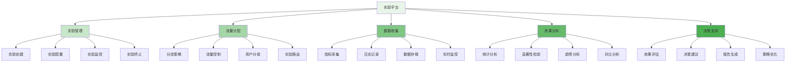
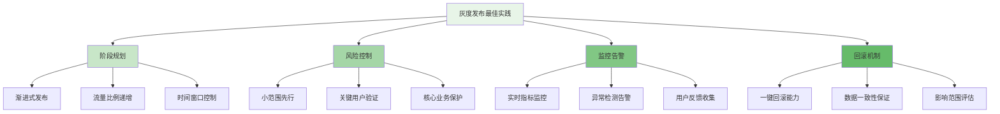

在企业级智能风控平台的演进过程中，实验平台是确保策略和模型优化科学性的关键基础设施。通过建立完善的A/B测试和灰度发布机制，风控团队能够在控制风险的前提下，科学地验证新策略和新模型的效果，实现数据驱动的持续优化。

## 实验平台架构设计

实验平台需要支持从实验设计到效果评估的全生命周期管理，确保实验的科学性和结果的可靠性。

### 平台架构层次



### 核心功能模块

```yaml
# 实验平台核心功能模块
experiment_platform_modules:
  experiment_management:
    description: "实验全生命周期管理"
    features:
      - "实验创建与配置"
      - "实验状态管理"
      - "实验监控与告警"
      - "实验终止与归档"
    integration_points:
      - "策略管理系统"
      - "模型服务系统"
      - "用户管理系统"
  
  traffic_allocation:
    description: "流量分配与控制"
    features:
      - "分流策略管理"
      - "流量比例控制"
      - "用户分组策略"
      - "实验路由机制"
    integration_points:
      - "网关系统"
      - "负载均衡器"
      - "用户画像系统"
  
  data_collection:
    description: "实验数据收集"
    features:
      - "核心指标采集"
      - "实验日志记录"
      - "数据质量监控"
      - "实时数据流处理"
    integration_points:
      - "数据管道系统"
      - "指标计算引擎"
      - "日志收集系统"
  
  effect_analysis:
    description: "实验效果分析"
    features:
      - "统计分析引擎"
      - "显著性检验"
      - "趋势分析工具"
      - "对比分析报告"
    integration_points:
      - "BI分析系统"
      - "统计计算库"
      - "可视化平台"
```

## A/B测试框架设计

A/B测试框架是实验平台的核心，需要确保实验设计的科学性和结果分析的准确性。

### 实验设计原则

```python
class ABTestFramework:
    def __init__(self):
        self.experiment_manager = ExperimentManager()
        self.traffic_controller = TrafficController()
        self.data_collector = DataCollector()
        self.analysis_engine = AnalysisEngine()
    
    def create_experiment(self, experiment_config):
        """创建A/B测试实验"""
        # 1. 验证实验配置
        self.validate_experiment_config(experiment_config)
        
        # 2. 生成实验ID
        experiment_id = self.generate_experiment_id()
        
        # 3. 创建实验对象
        experiment = Experiment(
            id=experiment_id,
            name=experiment_config.name,
            description=experiment_config.description,
            hypothesis=experiment_config.hypothesis,
            metrics=experiment_config.metrics,
            variants=experiment_config.variants,
            duration=experiment_config.duration,
            traffic_allocation=experiment_config.traffic_allocation,
            created_at=datetime.now()
        )
        
        # 4. 保存实验配置
        self.experiment_manager.save_experiment(experiment)
        
        # 5. 初始化流量分配
        self.traffic_controller.initialize_allocation(experiment)
        
        # 6. 启动数据收集
        self.data_collector.start_collection(experiment)
        
        return experiment
    
    def validate_experiment_config(self, config):
        """验证实验配置"""
        # 1. 必需字段检查
        required_fields = ['name', 'hypothesis', 'metrics', 'variants']
        for field in required_fields:
            if not hasattr(config, field):
                raise ValueError(f"Missing required field: {field}")
        
        # 2. 变体配置检查
        if len(config.variants) < 2:
            raise ValueError("At least 2 variants required for A/B test")
        
        # 3. 指标定义检查
        for metric in config.metrics:
            if not metric.name or not metric.type:
                raise ValueError("Invalid metric definition")
        
        # 4. 流量分配检查
        total_allocation = sum([v.allocation for v in config.variants])
        if abs(total_allocation - 1.0) > 0.01:
            raise ValueError("Total traffic allocation must equal 100%")
        
        # 5. 统计显著性检查
        self.check_statistical_power(config)
    
    def check_statistical_power(self, config):
        """检查统计功效"""
        # 1. 计算最小样本量
        min_sample_size = self.calculate_min_sample_size(
            config.metrics,
            config.variants[0].expected_effect,
            config.significance_level,
            config.statistical_power
        )
        
        # 2. 估算实验时长
        estimated_duration = self.estimate_experiment_duration(
            min_sample_size,
            config.traffic_allocation
        )
        
        # 3. 验证实验时长
        if estimated_duration > config.duration:
            raise ValueError(
                f"Estimated duration ({estimated_duration} days) exceeds configured duration ({config.duration} days)"
            )
        
        return {
            'min_sample_size': min_sample_size,
            'estimated_duration': estimated_duration
        }
    
    def calculate_min_sample_size(self, metrics, expected_effect, alpha=0.05, power=0.8):
        """计算最小样本量"""
        sample_sizes = []
        
        for metric in metrics:
            if metric.type == 'proportion':
                # 比例型指标样本量计算
                sample_size = self.calculate_proportion_sample_size(
                    metric.baseline_rate,
                    expected_effect,
                    alpha,
                    power
                )
            elif metric.type == 'continuous':
                # 连续型指标样本量计算
                sample_size = self.calculate_continuous_sample_size(
                    metric.baseline_mean,
                    metric.baseline_std,
                    expected_effect,
                    alpha,
                    power
                )
            else:
                raise ValueError(f"Unsupported metric type: {metric.type}")
            
            sample_sizes.append(sample_size)
        
        # 返回最大样本量需求
        return max(sample_sizes)
```

### 流量分配机制

```go
type TrafficController struct {
    AllocationStrategy AllocationStrategy
    UserSegmenter      UserSegmenter
    ExperimentRouter   ExperimentRouter
    Monitoring         TrafficMonitoring
}

type TrafficAllocation struct {
    ExperimentID    string
    Variants        []VariantAllocation
    TotalTraffic    float64
    StartTime       time.Time
    EndTime         time.Time
    Status          string  // active, paused, completed
}

type VariantAllocation struct {
    VariantID       string
    AllocationRate  float64
    UserSegments    []UserSegment
    TrafficCap      *TrafficCap
}

type UserSegment struct {
    SegmentType     string  // demographic, behavioral, geographic
    Conditions      []Condition
    AllocationBoost float64
}

func (tc *TrafficController) AllocateTraffic(experiment *Experiment) *TrafficAllocation {
    // 1. 创建流量分配对象
    allocation := &TrafficAllocation{
        ExperimentID: experiment.ID,
        TotalTraffic: experiment.TrafficAllocation,
        StartTime:    time.Now(),
        EndTime:      time.Now().Add(experiment.Duration),
        Status:       "active",
    }
    
    // 2. 为每个变体分配流量
    variants := make([]VariantAllocation, 0)
    remainingTraffic := experiment.TrafficAllocation
    
    for i, variant := range experiment.Variants {
        variantAlloc := VariantAllocation{
            VariantID:      variant.ID,
            AllocationRate: variant.Allocation,
            UserSegments:   variant.UserSegments,
        }
        
        // 3. 应用流量上限
        if variant.TrafficCap != nil {
            variantAlloc.TrafficCap = variant.TrafficCap
        }
        
        variants = append(variants, variantAlloc)
        remainingTraffic -= variant.Allocation
    }
    
    // 4. 验证流量分配
    if math.Abs(remainingTraffic) > 0.001 {
        return nil, fmt.Errorf("traffic allocation sum is not 100%%")
    }
    
    allocation.Variants = variants
    
    // 5. 初始化分流器
    tc.initializeRouter(allocation)
    
    // 6. 启动监控
    tc.Monitoring.StartMonitoring(allocation)
    
    return allocation
}

func (tc *TrafficController) RouteUser(user *User, experimentID string) string {
    // 1. 获取实验流量分配
    allocation := tc.getAllocation(experimentID)
    if allocation == nil || allocation.Status != "active" {
        return ""  // 默认变体
    }
    
    // 2. 用户分段匹配
    matchedSegments := tc.UserSegmenter.MatchSegments(user, allocation.Variants)
    
    // 3. 应用分流策略
    variantID := tc.AllocationStrategy.Route(user, allocation, matchedSegments)
    
    // 4. 记录路由日志
    tc.logRoutingDecision(user, experimentID, variantID)
    
    return variantID
}

func (tc *TrafficController) initializeRouter(allocation *TrafficAllocation) error {
    // 1. 创建哈希分流器
    hasher := consistent.New()
    
    // 2. 为每个变体添加虚拟节点
    for _, variant := range allocation.Variants {
        virtualNodes := int(variant.AllocationRate * 1000)  // 1000个虚拟节点基数
        for i := 0; i < virtualNodes; i++ {
            nodeKey := fmt.Sprintf("%s-%d", variant.VariantID, i)
            hasher.Add(nodeKey)
        }
    }
    
    // 3. 配置实验路由
    routerConfig := &RouterConfig{
        ExperimentID: allocation.ExperimentID,
        Hasher:       hasher,
        Segments:     allocation.Variants,
    }
    
    tc.ExperimentRouter.Configure(routerConfig)
    
    return nil
}
```

## 灰度发布机制

灰度发布是控制风险的重要手段，需要支持渐进式的策略和模型上线。

### 灰度发布策略

```typescript
interface GradualRolloutManager {
    // 灰度发布计划
    createRolloutPlan(strategy: RolloutStrategy): Promise<RolloutPlan>;
    
    // 执行灰度发布
    executeRollout(plan: RolloutPlan): Promise<RolloutStatus>;
    
    // 监控发布状态
    monitorRollout(planId: string): Promise<RolloutMetrics>;
    
    // 回滚机制
    rollbackRollout(planId: string): Promise<RolloutStatus>;
}

class RiskControlGradualRollout implements GradualRolloutManager {
    private rolloutRepository: RolloutRepository;
    private monitoringService: RolloutMonitoringService;
    private alertEngine: AlertEngine;
    
    async createRolloutPlan(strategy: RolloutStrategy): Promise<RolloutPlan> {
        // 1. 验证策略配置
        this.validateRolloutStrategy(strategy);
        
        // 2. 生成发布计划
        const plan = new RolloutPlan({
            id: this.generatePlanId(),
            strategy: strategy,
            phases: this.generateRolloutPhases(strategy),
            criteria: strategy.criteria,
            rollbackPlan: strategy.rollbackPlan,
            createdAt: new Date()
        });
        
        // 3. 保存发布计划
        await this.rolloutRepository.savePlan(plan);
        
        return plan;
    }
    
    async executeRollout(plan: RolloutPlan): Promise<RolloutStatus> {
        // 1. 验证计划状态
        if (plan.status !== 'pending') {
            throw new Error('Rollout plan is not in pending status');
        }
        
        // 2. 更新计划状态
        plan.status = 'executing';
        await this.rolloutRepository.updatePlan(plan);
        
        // 3. 执行发布阶段
        for (const phase of plan.phases) {
            try {
                // 执行阶段
                await this.executePhase(phase);
                
                // 监控阶段效果
                const metrics = await this.monitorPhase(phase);
                
                // 评估是否继续
                if (!this.shouldContinueRollout(metrics, phase.criteria)) {
                    // 触发回滚
                    await this.rollbackRollout(plan.id);
                    return 'rolled_back';
                }
                
                // 更新阶段状态
                phase.status = 'completed';
                phase.completedAt = new Date();
                await this.rolloutRepository.updatePlan(plan);
                
            } catch (error) {
                // 阶段执行失败，触发回滚
                await this.rollbackRollout(plan.id);
                throw error;
            }
        }
        
        // 4. 完成发布
        plan.status = 'completed';
        plan.completedAt = new Date();
        await this.rolloutRepository.updatePlan(plan);
        
        return 'completed';
    }
    
    private generateRolloutPhases(strategy: RolloutStrategy): RolloutPhase[] {
        const phases: RolloutPhase[] = [];
        
        // 1. 内部测试阶段
        phases.push({
            id: 'internal_test',
            name: '内部测试',
            trafficPercentage: 0.01,  // 1%流量
            duration: '2h',
            targetGroups: ['internal_users'],
            monitoringMetrics: ['error_rate', 'latency'],
            successCriteria: {
                error_rate: '<0.1%',
                latency: '<100ms'
            }
        });
        
        // 2. 小流量阶段
        phases.push({
            id: 'small_traffic',
            name: '小流量验证',
            trafficPercentage: 0.05,  // 5%流量
            duration: '24h',
            targetGroups: ['all_users'],
            monitoringMetrics: ['error_rate', 'latency', 'business_impact'],
            successCriteria: {
                error_rate: '<0.5%',
                latency: '<200ms',
                business_impact: '>0.95'
            }
        });
        
        // 3. 中等流量阶段
        phases.push({
            id: 'medium_traffic',
            name: '中等流量验证',
            trafficPercentage: 0.2,  // 20%流量
            duration: '48h',
            targetGroups: ['all_users'],
            monitoringMetrics: ['error_rate', 'latency', 'business_impact', 'user_satisfaction'],
            successCriteria: {
                error_rate: '<1%',
                latency: '<300ms',
                business_impact: '>0.98',
                user_satisfaction: '>0.9'
            }
        });
        
        // 4. 全量发布阶段
        phases.push({
            id: 'full_rollout',
            name: '全量发布',
            trafficPercentage: 1.0,  // 100%流量
            duration: '7d',
            targetGroups: ['all_users'],
            monitoringMetrics: ['error_rate', 'latency', 'business_impact', 'user_satisfaction'],
            successCriteria: {
                error_rate: '<2%',
                latency: '<500ms',
                business_impact: '>0.99',
                user_satisfaction: '>0.85'
            }
        });
        
        return phases;
    }
    
    private async executePhase(phase: RolloutPhase): Promise<void> {
        // 1. 更新流量分配
        await this.updateTrafficAllocation(phase);
        
        // 2. 启动监控
        await this.monitoringService.startPhaseMonitoring(phase);
        
        // 3. 等待阶段完成
        await this.waitForPhaseCompletion(phase.duration);
    }
    
    private async monitorPhase(phase: RolloutPhase): Promise<RolloutMetrics> {
        // 1. 收集监控指标
        const metrics = await this.monitoringService.collectMetrics(phase);
        
        // 2. 检查告警条件
        const alerts = await this.alertEngine.checkAlerts(metrics);
        
        // 3. 如果有严重告警，立即停止
        if (alerts.some(alert => alert.severity === 'critical')) {
            throw new Error('Critical alert detected during rollout');
        }
        
        return metrics;
    }
    
    private shouldContinueRollout(metrics: RolloutMetrics, criteria: SuccessCriteria): boolean {
        // 1. 检查所有成功标准
        for (const [metric, threshold] of Object.entries(criteria)) {
            const actualValue = metrics[metric];
            if (!this.evaluateThreshold(actualValue, threshold)) {
                return false;
            }
        }
        
        return true;
    }
}
```

### 效果评估与分析

```javascript
class ExperimentEffectAnalyzer {
    constructor(config) {
        this.config = config;
        this.statisticalEngine = new StatisticalAnalysisEngine();
        this.businessImpactCalculator = new BusinessImpactCalculator();
        this.visualizationEngine = new VisualizationEngine();
    }
    
    /**
     * 分析实验效果
     * @param {string} experimentId - 实验ID
     * @returns {Promise<Object>} 分析结果
     */
    async analyzeExperimentEffect(experimentId) {
        try {
            // 1. 获取实验数据
            const experimentData = await this.getExperimentData(experimentId);
            
            // 2. 统计分析
            const statisticalResults = await this.performStatisticalAnalysis(experimentData);
            
            // 3. 业务影响分析
            const businessImpact = await this.calculateBusinessImpact(experimentData);
            
            // 4. 生成可视化报告
            const visualizations = await this.generateVisualizations(experimentData, statisticalResults);
            
            // 5. 综合评估
            const overallAssessment = this.assessOverallEffect(statisticalResults, businessImpact);
            
            return {
                experimentId: experimentId,
                statisticalResults: statisticalResults,
                businessImpact: businessImpact,
                visualizations: visualizations,
                assessment: overallAssessment,
                recommendations: this.generateRecommendations(overallAssessment)
            };
        } catch (error) {
            console.error('Failed to analyze experiment effect:', error);
            return { success: false, error: error.message };
        }
    }
    
    /**
     * 执行统计分析
     * @param {Object} data - 实验数据
     * @returns {Promise<Object>} 统计分析结果
     */
    async performStatisticalAnalysis(data) {
        const results = {};
        
        // 1. 描述性统计
        results.descriptive = this.calculateDescriptiveStatistics(data);
        
        // 2. 假设检验
        results.hypothesisTests = await this.conductHypothesisTests(data);
        
        // 3. 置信区间
        results.confidenceIntervals = this.calculateConfidenceIntervals(data);
        
        // 4. 效应量计算
        results.effectSizes = this.calculateEffectSizes(data);
        
        // 5. 统计显著性
        results.significance = this.evaluateStatisticalSignificance(results.hypothesisTests);
        
        return results;
    }
    
    /**
     * 计算描述性统计
     * @param {Object} data - 数据
     * @returns {Object} 描述性统计结果
     */
    calculateDescriptiveStatistics(data) {
        const stats = {};
        
        for (const [variant, variantData] of Object.entries(data.variants)) {
            stats[variant] = {
                count: variantData.length,
                mean: this.calculateMean(variantData),
                median: this.calculateMedian(variantData),
                stdDev: this.calculateStandardDeviation(variantData),
                min: Math.min(...variantData),
                max: Math.max(...variantData),
                quartiles: this.calculateQuartiles(variantData)
            };
        }
        
        return stats;
    }
    
    /**
     * 进行假设检验
     * @param {Object} data - 数据
     * @returns {Promise<Object>} 假设检验结果
     */
    async conductHypothesisTests(data) {
        const tests = {};
        
        // 获取对照组和实验组数据
        const controlGroup = data.variants[data.controlVariant];
        const treatmentGroups = Object.keys(data.variants)
            .filter(key => key !== data.controlVariant)
            .map(key => ({ name: key, data: data.variants[key] }));
        
        // 为每个实验组进行检验
        for (const group of treatmentGroups) {
            // t检验
            const tTest = await this.statisticalEngine.tTest(controlGroup, group.data);
            
            // 方差分析
            const anova = await this.statisticalEngine.anova([controlGroup, group.data]);
            
            // 卡方检验（适用于分类数据）
            const chiSquare = await this.statisticalEngine.chiSquareTest(controlGroup, group.data);
            
            tests[group.name] = {
                tTest: tTest,
                anova: anova,
                chiSquare: chiSquare
            };
        }
        
        return tests;
    }
    
    /**
     * 计算业务影响
     * @param {Object} data - 实验数据
     * @returns {Promise<Object>} 业务影响结果
     */
    async calculateBusinessImpact(data) {
        const impact = {};
        
        // 1. 计算各变体的业务指标
        for (const [variant, variantData] of Object.entries(data.variants)) {
            impact[variant] = await this.businessImpactCalculator.calculate(variantData);
        }
        
        // 2. 计算相对提升
        const controlImpact = impact[data.controlVariant];
        for (const [variant, variantImpact] of Object.entries(impact)) {
            if (variant !== data.controlVariant) {
                impact[variant].relativeImprovement = this.calculateRelativeImprovement(
                    variantImpact,
                    controlImpact
                );
            }
        }
        
        // 3. 计算统计显著性
        impact.significance = await this.evaluateBusinessSignificance(impact);
        
        return impact;
    }
    
    /**
     * 生成可视化图表
     * @param {Object} data - 数据
     * @param {Object} analysis - 分析结果
     * @returns {Promise<Array>} 图表配置
     */
    async generateVisualizations(data, analysis) {
        const charts = [];
        
        // 1. 均值对比柱状图
        charts.push({
            type: 'bar',
            title: '各变体核心指标对比',
            data: this.prepareMeanComparisonData(analysis.descriptive),
            options: {
                xAxis: 'variant',
                yAxis: 'mean',
                series: ['mean']
            }
        });
        
        // 2. 分布直方图
        charts.push({
            type: 'histogram',
            title: '指标分布对比',
            data: this.prepareDistributionData(data),
            options: {
                xAxis: 'value',
                yAxis: 'frequency',
                groupBy: 'variant'
            }
        });
        
        // 3. 趋势图
        charts.push({
            type: 'line',
            title: '实验期间指标趋势',
            data: await this.prepareTrendData(data),
            options: {
                xAxis: 'time',
                yAxis: 'metric_value',
                series: Object.keys(data.variants)
            }
        });
        
        // 4. 置信区间图
        charts.push({
            type: 'errorbar',
            title: '各变体指标置信区间',
            data: this.prepareConfidenceIntervalData(analysis.confidenceIntervals),
            options: {
                xAxis: 'variant',
                yAxis: 'value',
                errorField: 'margin_of_error'
            }
        });
        
        return charts;
    }
    
    /**
     * 综合效果评估
     * @param {Object} statisticalResults - 统计结果
     * @param {Object} businessImpact - 业务影响
     * @returns {Object} 综合评估结果
     */
    assessOverallEffect(statisticalResults, businessImpact) {
        // 1. 统计显著性评估
        const statisticalSignificance = this.evaluateStatisticalSignificance(
            statisticalResults.significance
        );
        
        // 2. 业务显著性评估
        const businessSignificance = this.evaluateBusinessSignificance(
            businessImpact.significance
        );
        
        // 3. 综合评估
        const overallScore = this.calculateOverallScore(
            statisticalSignificance,
            businessSignificance,
            statisticalResults.effectSizes,
            businessImpact
        );
        
        return {
            statisticalSignificance: statisticalSignificance,
            businessSignificance: businessSignificance,
            overallScore: overallScore,
            confidence: this.calculateAssessmentConfidence(statisticalResults, businessImpact)
        };
    }
}
```

## 最佳实践与经验总结

在构建实验平台的过程中，需要遵循一系列最佳实践来确保平台的成功实施和有效运行。

### 实验设计最佳实践

1. **明确实验目标**：每个实验都应有清晰、可衡量的目标
2. **合理选择指标**：区分核心指标、观察指标和反向指标
3. **确保样本量充足**：基于统计学原理计算最小样本量
4. **控制实验变量**：一次只测试一个变量，避免混淆因素
5. **随机化分组**：确保各组用户特征分布一致

### 灰度发布最佳实践



### 运营管理建议

1. **建立标准化流程**：制定详细的实验设计和发布流程规范
2. **持续优化迭代**：基于实验结果不断改进平台功能
3. **团队能力建设**：定期组织培训，提升团队实验设计能力
4. **文化建设**：培养数据驱动的决策文化

通过构建功能完善的实验平台，企业可以科学地验证风控策略和模型的优化效果，降低创新风险，提升风控系统的智能化水平。