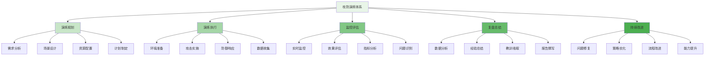
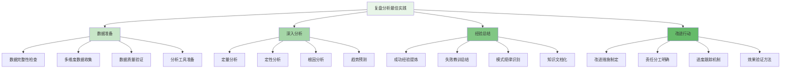

攻防演练与复盘是企业级智能风控平台持续改进和能力提升的核心机制。通过定期组织实战化的攻防演练，并进行深入的复盘分析，企业能够不断发现系统薄弱环节，优化防护策略，并提升团队的应急响应能力。

## 攻防演练体系架构

攻防演练体系需要涵盖从演练规划到效果评估的完整生命周期，确保演练的科学性和有效性。

### 演练体系架构



### 核心功能模块

```yaml
# 攻防演练体系核心功能模块
attack_defense_exercise_modules:
  exercise_planning:
    description: "演练规划管理"
    features:
      - "需求分析与目标设定"
      - "场景设计与复杂度评估"
      - "资源配置与环境准备"
      - "时间计划与人员安排"
    integration_points:
      - "威胁情报平台"
      - "业务系统分析"
      - "资源管理系统"
  
  exercise_execution:
    description: "演练执行管理"
    features:
      - "环境初始化"
      - "攻击场景实施"
      - "防御响应执行"
      - "过程数据记录"
    integration_points:
      - "攻击工具平台"
      - "监控系统"
      - "日志收集系统"
  
  monitoring_evaluation:
    description: "监控与评估"
    features:
      - "实时监控与告警"
      - "效果指标计算"
      - "问题识别与记录"
      - "过程合规性检查"
    integration_points:
      - "监控平台"
      - "数据分析系统"
      - "合规检查工具"
  
  debriefing_improvement:
    description: "复盘与改进"
    features:
      - "数据分析与挖掘"
      - "经验教训总结"
      - "改进建议生成"
      - "跟踪验证机制"
    integration_points:
      - "知识管理系统"
      - "问题跟踪系统"
      - "策略优化平台"
```

## 演练规划与设计

演练规划是确保攻防演练效果的关键环节，需要科学设计演练场景和目标。

### 演练规划框架

```python
class AttackDefenseExercisePlanner:
    def __init__(self):
        self.requirements_analyzer = RequirementsAnalyzer()
        self.scenario_designer = ScenarioDesigner()
        self.resource_manager = ResourceManager()
        self.timeline_planner = TimelinePlanner()
    
    def plan_exercise(self, exercise_config):
        """规划攻防演练"""
        # 1. 需求分析
        requirements = self.requirements_analyzer.analyze(exercise_config.requirements)
        
        # 2. 场景设计
        scenarios = self.scenario_designer.design_scenarios(
            requirements.scenario_types,
            exercise_config.complexity_level
        )
        
        # 3. 资源配置
        resources = self.resource_manager.allocate_resources(
            scenarios,
            exercise_config.resource_constraints
        )
        
        # 4. 时间规划
        timeline = self.timeline_planner.create_timeline(
            scenarios,
            exercise_config.available_time
        )
        
        # 5. 风险评估
        risk_assessment = self.assess_planning_risks(scenarios, resources)
        
        # 6. 生成演练计划
        exercise_plan = ExercisePlan(
            id=self.generate_plan_id(),
            name=exercise_config.name,
            description=exercise_config.description,
            requirements=requirements,
            scenarios=scenarios,
            resources=resources,
            timeline=timeline,
            risk_assessment=risk_assessment,
            approval_status="pending",
            created_at=datetime.now()
        )
        
        return exercise_plan
    
    def analyze_requirements(self, requirement_config):
        """分析演练需求"""
        # 1. 业务需求分析
        business_requirements = self.analyze_business_requirements(
            requirement_config.business_domains
        )
        
        # 2. 技术需求分析
        technical_requirements = self.analyze_technical_requirements(
            requirement_config.system_components
        )
        
        # 3. 安全需求分析
        security_requirements = self.analyze_security_requirements(
            requirement_config.threat_scenarios
        )
        
        # 4. 合规需求分析
        compliance_requirements = self.analyze_compliance_requirements(
            requirement_config.regulatory_standards
        )
        
        return ExerciseRequirements(
            business=business_requirements,
            technical=technical_requirements,
            security=security_requirements,
            compliance=compliance_requirements,
            overall_objectives=requirement_config.objectives
        )
    
    def design_scenarios(self, scenario_types, complexity_level):
        """设计演练场景"""
        scenarios = []
        
        for scenario_type in scenario_types:
            if scenario_type == "account_takeover":
                scenario = self.design_account_takeover_scenario(complexity_level)
            elif scenario_type == "payment_fraud":
                scenario = self.design_payment_fraud_scenario(complexity_level)
            elif scenario_type == "content_abuse":
                scenario = self.design_content_abuse_scenario(complexity_level)
            elif scenario_type == "promotion_abuse":
                scenario = self.design_promotion_abuse_scenario(complex_level)
            else:
                scenario = self.design_generic_scenario(scenario_type, complexity_level)
            
            scenarios.append(scenario)
        
        return scenarios
    
    def design_account_takeover_scenario(self, complexity):
        """设计账户盗用场景"""
        # 基础攻击向量
        base_vectors = [
            AttackVector(
                type="credential_stuffing",
                techniques=["credential_harvesting", "automated_login"],
                tools=["hydra", "burp_suite"],
                complexity="low"
            ),
            AttackVector(
                type="session_hijacking",
                techniques=["packet_sniffing", "token_extraction"],
                tools=["wireshark", "ettercap"],
                complexity="medium"
            )
        ]
        
        # 根据复杂度增加向量
        if complexity == "high":
            advanced_vectors = [
                AttackVector(
                    type="multi_stage_attack",
                    techniques=["social_engineering", "phishing", "mfa_bypass"],
                    tools=["social_engineering_toolkit", "custom_phishing"],
                    complexity="high"
                ),
                AttackVector(
                    type="lateral_movement",
                    techniques=["privilege_escalation", "internal_reconnaissance"],
                    tools=["metasploit", "cobalt_strike"],
                    complexity="high"
                )
            ]
            base_vectors.extend(advanced_vectors)
        
        return ExerciseScenario(
            id=f"scenario-{len(scenarios)+1}",
            type="account_takeover",
            name="复杂账户盗用攻击演练",
            description="模拟攻击者通过多种手段获取并控制用户账户",
            attack_vectors=base_vectors,
            success_criteria=[
                SuccessCriterion(
                    metric="compromised_accounts",
                    threshold=">10",
                    weight=0.4
                ),
                SuccessCriterion(
                    metric="undetected_sessions",
                    threshold=">5",
                    weight=0.3
                ),
                SuccessCriterion(
                    metric="bypassed_protections",
                    threshold=">2",
                    weight=0.3
                )
            ],
            expected_business_impact="medium",
            complexity=complexity
        )
```

### 演练执行管理

```go
type ExerciseExecutor struct {
    EnvironmentManager  *EnvironmentManager
    AttackOrchestrator  *AttackOrchestrator
    DefenseCoordinator  *DefenseCoordinator
    DataManager         *ExerciseDataManager
}

type ExerciseExecution struct {
    PlanID          string
    Scenarios       []ExerciseScenario
    Environment     *ExerciseEnvironment
    AttackResults   []AttackResult
    DefenseResults  []DefenseResult
    ExecutionData   *ExecutionData
    Status          string  // pending, running, completed, failed
    StartTime       time.Time
    EndTime         time.Time
}

type AttackResult struct {
    ScenarioID      string
    VectorID        string
    ExecutionSteps  []AttackStepResult
    SuccessRate     float64
    BypassedDetections []string
    BusinessImpact  BusinessImpact
    ExecutionTime   time.Duration
}

type DefenseResult struct {
    ScenarioID      string
    DetectionResults []DetectionResult
    ResponseActions []ResponseAction
    ResponseTime    time.Duration
    FalsePositives  int
    MissedDetections int
    ResourceUsage   ResourceUsage
}

func (ee *ExerciseExecutor) ExecuteExercise(plan *ExercisePlan) (*ExerciseExecution, error) {
    // 1. 初始化演练环境
    environment, err := ee.EnvironmentManager.SetupEnvironment(plan)
    if err != nil {
        return nil, fmt.Errorf("failed to setup exercise environment: %v", err)
    }
    
    // 2. 创建执行对象
    execution := &ExerciseExecution{
        PlanID:      plan.ID,
        Scenarios:   plan.Scenarios,
        Environment: environment,
        Status:      "running",
        StartTime:   time.Now(),
    }
    
    // 3. 按场景顺序执行
    for _, scenario := range plan.Scenarios {
        // 执行攻击场景
        attackResult, err := ee.AttackOrchestrator.ExecuteScenario(scenario, environment)
        if err != nil {
            execution.Status = "failed"
            return execution, fmt.Errorf("failed to execute attack scenario %s: %v", scenario.ID, err)
        }
        execution.AttackResults = append(execution.AttackResults, attackResult)
        
        // 收集防御响应
        defenseResult, err := ee.DefenseCoordinator.CollectDefenseResponse(scenario, attackResult)
        if err != nil {
            execution.Status = "failed"
            return execution, fmt.Errorf("failed to collect defense response for scenario %s: %v", scenario.ID, err)
        }
        execution.DefenseResults = append(execution.DefenseResults, defenseResult)
        
        // 记录执行数据
        ee.DataManager.RecordScenarioExecution(scenario, attackResult, defenseResult)
    }
    
    // 4. 完成执行
    execution.Status = "completed"
    execution.EndTime = time.Now()
    
    // 5. 生成执行报告
    execution.ExecutionData = ee.DataManager.GenerateExecutionReport(execution)
    
    return execution, nil
}

func (ee *ExerciseExecutor) ExecuteScenario(scenario *ExerciseScenario, environment *ExerciseEnvironment) (*AttackResult, error) {
    // 1. 初始化场景执行
    scenarioContext := ee.initializeScenarioContext(scenario, environment)
    
    // 2. 按攻击向量顺序执行
    stepResults := make([]AttackStepResult, 0)
    bypassedDetections := make([]string, 0)
    
    for _, vector := range scenario.AttackVectors {
        // 执行攻击向量
        vectorResult := ee.executeAttackVector(vector, scenarioContext)
        stepResults = append(stepResults, vectorResult.StepResults...)
        
        // 记录绕过检测的情况
        if vectorResult.BypassedDetection {
            bypassedDetections = append(bypassedDetections, vector.Type)
        }
    }
    
    // 3. 计算成功率
    successRate := ee.calculateSuccessRate(stepResults, scenario.SuccessCriteria)
    
    // 4. 评估业务影响
    businessImpact := ee.assessBusinessImpact(stepResults, scenario.ExpectedBusinessImpact)
    
    // 5. 计算执行时间
    executionTime := time.Since(scenarioContext.StartTime)
    
    return &AttackResult{
        ScenarioID:         scenario.ID,
        ExecutionSteps:     stepResults,
        SuccessRate:        successRate,
        BypassedDetections: bypassedDetections,
        BusinessImpact:     businessImpact,
        ExecutionTime:      executionTime,
    }, nil
}

func (ee *ExerciseExecutor) executeAttackVector(vector *AttackVector, context *ScenarioContext) *VectorExecutionResult {
    // 1. 准备攻击工具
    tools := ee.prepareAttackTools(vector.Tools, context.Environment)
    
    // 2. 按步骤执行攻击
    stepResults := make([]AttackStepResult, 0)
    
    for _, step := range vector.ExecutionSteps {
        stepResult := ee.executeAttackStep(step, tools, context)
        stepResults = append(stepResults, stepResult)
    }
    
    // 3. 评估向量执行效果
    vectorSuccess := ee.evaluateVectorSuccess(stepResults, vector.SuccessCriteria)
    bypassedDetection := ee.checkDetectionBypass(stepResults, context.Environment)
    
    return &VectorExecutionResult{
        Vector:             vector,
        StepResults:        stepResults,
        Success:            vectorSuccess,
        BypassedDetection:  bypassedDetection,
    }
}
```

## 复盘分析与总结

复盘分析是攻防演练的核心价值所在，通过深入分析演练数据，能够发现系统薄弱环节并提出改进建议。

### 复盘分析框架

```typescript
interface ExerciseDebriefing {
    // 数据收集
    collectExerciseData(execution: ExerciseExecution): Promise<ExerciseData>;
    
    // 攻击效果分析
    analyzeAttackEffectiveness(data: ExerciseData): Promise<AttackAnalysis>;
    
    // 防御能力分析
    analyzeDefenseCapability(data: ExerciseData): Promise<DefenseAnalysis>;
    
    // 综合评估
    conductComprehensiveAssessment(attack: AttackAnalysis, defense: DefenseAnalysis): Promise<ComprehensiveAssessment>;
    
    // 改进建议生成
    generateImprovementRecommendations(assessment: ComprehensiveAssessment): Promise<ImprovementRecommendations>;
}

class AttackDefenseDebriefing implements ExerciseDebriefing {
    private dataCollector: ExerciseDataCollector;
    private attackAnalyzer: AttackEffectivenessAnalyzer;
    private defenseAnalyzer: DefenseCapabilityAnalyzer;
    private assessmentEngine: ComprehensiveAssessmentEngine;
    
    async collectExerciseData(execution: ExerciseExecution): Promise<ExerciseData> {
        // 1. 收集攻击数据
        const attackData = await this.dataCollector.collectAttackData(execution.AttackResults);
        
        // 2. 收集防御数据
        const defenseData = await this.dataCollector.collectDefenseData(execution.DefenseResults);
        
        // 3. 收集系统日志
        const systemLogs = await this.dataCollector.collectSystemLogs(execution.Environment);
        
        // 4. 收集业务影响数据
        const businessImpact = await this.dataCollector.collectBusinessImpact(execution);
        
        // 5. 收集用户反馈
        const userFeedback = await this.dataCollector.collectUserFeedback(execution);
        
        return {
            attackData: attackData,
            defenseData: defenseData,
            systemLogs: systemLogs,
            businessImpact: businessImpact,
            userFeedback: userFeedback,
            execution: execution
        };
    }
    
    async analyzeAttackEffectiveness(data: ExerciseData): Promise<AttackAnalysis> {
        // 1. 总体成功率分析
        const overallSuccess = this.attackAnalyzer.calculateOverallSuccessRate(data.attackData);
        
        // 2. 各场景效果分析
        const scenarioEffectiveness = this.attackAnalyzer.analyzeScenarioEffectiveness(data.attackData);
        
        // 3. 攻击向量分析
        const vectorAnalysis = this.attackAnalyzer.analyzeAttackVectors(data.attackData);
        
        // 4. 绕过能力分析
        const bypassAnalysis = this.attackAnalyzer.analyzeBypassCapabilities(data.attackData, data.defenseData);
        
        // 5. 时效性分析
        const timingAnalysis = this.attackAnalyzer.analyzeTimingEffectiveness(data.attackData);
        
        return {
            overallSuccess: overallSuccess,
            scenarioEffectiveness: scenarioEffectiveness,
            vectorAnalysis: vectorAnalysis,
            bypassAnalysis: bypassAnalysis,
            timingAnalysis: timingAnalysis,
            strengths: this.identifyAttackStrengths(vectorAnalysis, bypassAnalysis),
            weaknesses: this.identifyAttackWeaknesses(timingAnalysis, scenarioEffectiveness)
        };
    }
    
    async analyzeDefenseCapability(data: ExerciseData): Promise<DefenseAnalysis> {
        // 1. 检测能力分析
        const detectionAnalysis = this.defenseAnalyzer.analyzeDetectionCapability(data.defenseData);
        
        // 2. 响应能力分析
        const responseAnalysis = this.defenseAnalyzer.analyzeResponseCapability(data.defenseData);
        
        // 3. 准确性分析
        const accuracyAnalysis = this.defenseAnalyzer.analyzeAccuracy(data.defenseData);
        
        // 4. 资源利用分析
        const resourceAnalysis = this.defenseAnalyzer.analyzeResourceUtilization(data.defenseData);
        
        // 5. 覆盖面分析
        const coverageAnalysis = this.defenseAnalyzer.analyzeCoverage(data.defenseData, data.attackData);
        
        return {
            detectionAnalysis: detectionAnalysis,
            responseAnalysis: responseAnalysis,
            accuracyAnalysis: accuracyAnalysis,
            resourceAnalysis: resourceAnalysis,
            coverageAnalysis: coverageAnalysis,
            strengths: this.identifyDefenseStrengths(detectionAnalysis, responseAnalysis),
            weaknesses: this.identifyDefenseWeaknesses(accuracyAnalysis, coverageAnalysis)
        };
    }
    
    async conductComprehensiveAssessment(attack: AttackAnalysis, defense: DefenseAnalysis): Promise<ComprehensiveAssessment> {
        // 1. 平衡性评估
        const balanceAssessment = this.assessmentEngine.evaluateBalance(attack, defense);
        
        // 2. 实战价值评估
        const practicalValue = this.assessmentEngine.assessPracticalValue(attack, defense);
        
        // 3. 学习效果评估
        const learningEffect = this.assessmentEngine.evaluateLearningEffect(attack, defense);
        
        // 4. 成本效益评估
        const costBenefit = this.assessmentEngine.analyzeCostBenefit(attack, defense);
        
        // 5. 综合评分
        const overallScore = this.assessmentEngine.calculateOverallScore(
            attack.overallSuccess,
            defense.detectionAnalysis.detectionRate,
            balanceAssessment,
            practicalValue,
            learningEffect,
            costBenefit
        );
        
        return {
            balanceAssessment: balanceAssessment,
            practicalValue: practicalValue,
            learningEffect: learningEffect,
            costBenefit: costBenefit,
            overallScore: overallScore,
            assessmentLevel: this.determineAssessmentLevel(overallScore),
            keyFindings: this.extractKeyFindings(attack, defense),
            criticalIssues: this.identifyCriticalIssues(attack, defense)
        };
    }
    
    private identifyAttackStrengths(vectorAnalysis: any, bypassAnalysis: any): string[] {
        const strengths = [];
        
        // 分析攻击向量优势
        for (const [vectorType, effectiveness] of Object.entries(vectorAnalysis.effectiveness)) {
            if (effectiveness > 0.8) {
                strengths.push(`在${vectorType}攻击向量上表现出色`);
            }
        }
        
        // 分析绕过能力优势
        if (bypassAnalysis.bypassRate > 0.6) {
            strengths.push("具备较强的检测绕过能力");
        }
        
        return strengths;
    }
    
    private identifyDefenseWeaknesses(accuracyAnalysis: any, coverageAnalysis: any): string[] {
        const weaknesses = [];
        
        // 分析准确性弱点
        if (accuracyAnalysis.falsePositiveRate > 0.1) {
            weaknesses.push("误报率较高，影响运营效率");
        }
        
        if (accuracyAnalysis.missedDetectionRate > 0.15) {
            weaknesses.push("漏报率较高，存在安全风险");
        }
        
        // 分析覆盖面弱点
        for (const [vectorType, coverage] of Object.entries(coverageAnalysis.coverage)) {
            if (coverage < 0.5) {
                weaknesses.push(`${vectorType}类型的攻击检测覆盖面不足`);
            }
        }
        
        return weaknesses;
    }
}
```

### 数据分析与挖掘

```javascript
class ExerciseDataAnalyzer {
    constructor(config) {
        this.config = config;
        this.statisticalEngine = new StatisticalAnalysisEngine();
        this.trendAnalyzer = new TrendAnalysisEngine();
        this.patternRecognizer = new PatternRecognitionEngine();
        this.rootCauseAnalyzer = new RootCauseAnalysisEngine();
    }
    
    /**
     * 分析演练数据
     * @param {Object} exerciseData - 演练数据
     * @returns {Promise<Object>} 分析结果
     */
    async analyzeExerciseData(exerciseData) {
        try {
            // 1. 描述性统计分析
            const descriptiveStats = this.performDescriptiveAnalysis(exerciseData);
            
            // 2. 趋势分析
            const trends = await this.analyzeTrends(exerciseData);
            
            // 3. 模式识别
            const patterns = await this.identifyPatterns(exerciseData);
            
            // 4. 异常检测
            const anomalies = await this.detectAnomalies(exerciseData);
            
            // 5. 根因分析
            const rootCauses = await this.analyzeRootCauses(exerciseData, anomalies);
            
            // 6. 关联分析
            const correlations = await this.analyzeCorrelations(exerciseData);
            
            // 7. 预测分析
            const predictions = await this.makePredictions(exerciseData, patterns);
            
            return {
                descriptiveStats: descriptiveStats,
                trends: trends,
                patterns: patterns,
                anomalies: anomalies,
                rootCauses: rootCauses,
                correlations: correlations,
                predictions: predictions
            };
        } catch (error) {
            console.error('Failed to analyze exercise data:', error);
            return { success: false, error: error.message };
        }
    }
    
    /**
     * 执行描述性统计分析
     * @param {Object} data - 数据
     * @returns {Object} 统计结果
     */
    performDescriptiveAnalysis(data) {
        const stats = {};
        
        // 1. 攻击成功率统计
        stats.attackSuccess = this.calculateBasicStats(
            data.attackResults.map(r => r.successRate)
        );
        
        // 2. 检测率统计
        stats.detectionRate = this.calculateBasicStats(
            data.defenseResults.map(r => r.detectionResults.map(d => d.detectionRate)).flat()
        );
        
        // 3. 响应时间统计
        stats.responseTime = this.calculateBasicStats(
            data.defenseResults.map(r => r.responseTime)
        );
        
        // 4. 误报率统计
        stats.falsePositive = this.calculateBasicStats(
            data.defenseResults.map(r => r.falsePositives / (r.falsePositives + r.detectionResults.length))
        );
        
        // 5. 资源消耗统计
        stats.resourceUsage = this.calculateResourceUsageStats(data.defenseResults);
        
        return stats;
    }
    
    /**
     * 分析趋势
     * @param {Object} data - 数据
     * @returns {Promise<Object>} 趋势分析结果
     */
    async analyzeTrends(data) {
        const trends = {};
        
        // 1. 攻击成功率趋势
        trends.attackSuccess = await this.trendAnalyzer.analyzeTimeSeries(
            data.attackResults.map(r => ({
                timestamp: r.timestamp,
                value: r.successRate
            }))
        );
        
        // 2. 防御能力趋势
        trends.defenseCapability = await this.trendAnalyzer.analyzeTimeSeries(
            data.defenseResults.map(r => ({
                timestamp: r.timestamp,
                value: this.calculateDefenseScore(r)
            }))
        );
        
        // 3. 系统性能趋势
        trends.systemPerformance = await this.trendAnalyzer.analyzeTimeSeries(
            data.systemMetrics.map(m => ({
                timestamp: m.timestamp,
                value: m.performanceScore
            }))
        );
        
        return trends;
    }
    
    /**
     * 识别模式
     * @param {Object} data - 数据
     * @returns {Promise<Object>} 模式识别结果
     */
    async identifyPatterns(data) {
        const patterns = {};
        
        // 1. 攻击模式识别
        patterns.attackPatterns = await this.patternRecognizer.identifyAttackPatterns(
            data.attackResults
        );
        
        // 2. 防御模式识别
        patterns.defensePatterns = await this.patternRecognizer.identifyDefensePatterns(
            data.defenseResults
        );
        
        // 3. 时间模式识别
        patterns.timePatterns = await this.patternRecognizer.identifyTimePatterns(
            data.attackResults,
            data.defenseResults
        );
        
        // 4. 关联模式识别
        patterns.correlationPatterns = await this.patternRecognizer.identifyCorrelationPatterns(
            data.attackResults,
            data.defenseResults
        );
        
        return patterns;
    }
    
    /**
     * 检测异常
     * @param {Object} data - 数据
     * @returns {Promise<Array>} 异常检测结果
     */
    async detectAnomalies(data) {
        const anomalies = [];
        
        // 1. 统计异常检测
        const statisticalAnomalies = this.detectStatisticalAnomalies(data);
        anomalies.push(...statisticalAnomalies);
        
        // 2. 机器学习异常检测
        const mlAnomalies = await this.detectMLAnomalies(data);
        anomalies.push(...mlAnomalies);
        
        // 3. 规则异常检测
        const ruleAnomalies = this.detectRuleBasedAnomalies(data);
        anomalies.push(...ruleAnomalies);
        
        // 4. 行为异常检测
        const behaviorAnomalies = await this.detectBehaviorAnomalies(data);
        anomalies.push(...behaviorAnomalies);
        
        return anomalies;
    }
    
    /**
     * 分析根因
     * @param {Object} data - 数据
     * @param {Array} anomalies - 异常
     * @returns {Promise<Array>} 根因分析结果
     */
    async analyzeRootCauses(data, anomalies) {
        const rootCauses = [];
        
        for (const anomaly of anomalies) {
            // 1. 基于规则的根因分析
            const ruleBasedCauses = this.rootCauseAnalyzer.analyzeRuleBasedCauses(anomaly, data);
            rootCauses.push(...ruleBasedCauses);
            
            // 2. 基于统计的根因分析
            const statisticalCauses = this.rootCauseAnalyzer.analyzeStatisticalCauses(anomaly, data);
            rootCauses.push(...statisticalCauses);
            
            // 3. 基于机器学习的根因分析
            const mlCauses = await this.rootCauseAnalyzer.analyzeMLCauses(anomaly, data);
            rootCauses.push(...mlCauses);
        }
        
        return rootCauses;
    }
}
```

## 改进措施与跟踪

基于复盘分析结果，制定并跟踪改进措施是确保演练价值实现的关键。

### 改进措施管理

```yaml
# 改进措施管理框架
improvement_management_framework:
  measure_categories:
    detection_improvement:
      name: "检测能力改进"
      measures:
        - "优化规则引擎策略"
        - "增强机器学习模型"
        - "完善名单服务配置"
        - "提升图计算能力"
      expected_outcomes:
        - "提高攻击检测率"
        - "降低误报率"
        - "缩短检测响应时间"
    
    response_optimization:
      name: "响应机制优化"
      measures:
        - "优化事件响应流程"
        - "完善自动化处置机制"
        - "加强团队协作能力"
        - "提升应急响应速度"
      expected_outcomes:
        - "缩短事件响应时间"
        - "提高处置准确性"
        - "降低业务影响"
    
    system_resilience:
      name: "系统韧性增强"
      measures:
        - "完善系统冗余设计"
        - "优化资源配置策略"
        - "加强监控告警能力"
        - "提升故障恢复速度"
      expected_outcomes:
        - "提高系统可用性"
        - "增强抗攻击能力"
        - "降低系统故障率"
    
    process_improvement:
      name: "流程机制改进"
      measures:
        - "完善演练规划流程"
        - "优化复盘分析机制"
        - "加强知识管理"
        - "提升团队能力"
      expected_outcomes:
        - "提高演练效果"
        - "加速能力提升"
        - "增强持续改进能力"
```

### 跟踪验证机制

```python
class ImprovementTracker:
    def __init__(self):
        self.measure_repository = ImprovementMeasureRepository()
        self.tracking_engine = ImprovementTrackingEngine()
        self.verification_engine = ImprovementVerificationEngine()
        self.reporting_engine = ImprovementReportingEngine()
    
    def track_improvement_measures(self, recommendations):
        """跟踪改进措施"""
        # 1. 创建改进措施
        measures = self.create_improvement_measures(recommendations)
        
        # 2. 分配责任人
        assigned_measures = self.assign_responsibilities(measures)
        
        # 3. 设置里程碑
        milestone_measures = self.set_milestones(assigned_measures)
        
        # 4. 启动跟踪
        tracked_measures = self.start_tracking(milestone_measures)
        
        return tracked_measures
    
    def create_improvement_measures(self, recommendations):
        """创建改进措施"""
        measures = []
        
        for recommendation in recommendations:
            measure = ImprovementMeasure(
                id=self.generate_measure_id(),
                type=recommendation.type,
                description=recommendation.description,
                actions=recommendation.actions,
                priority=recommendation.priority,
                expected_outcome=recommendation.expected_outcome,
                creation_time=datetime.now(),
                status="planned"
            )
            measures.append(measure)
        
        return measures
    
    def verify_improvement_effect(self, measure, verification_data):
        """验证改进效果"""
        # 1. 数据收集
        verification_metrics = self.collect_verification_metrics(measure, verification_data)
        
        # 2. 效果评估
        effect_assessment = self.assess_improvement_effect(measure, verification_metrics)
        
        # 3. 对比分析
        comparison_analysis = self.compare_with_baseline(measure, verification_metrics)
        
        # 4. 统计显著性检验
        statistical_significance = self.test_statistical_significance(
            verification_metrics.baseline,
            verification_metrics.current
        )
        
        # 5. 生成验证报告
        verification_report = self.generate_verification_report(
            measure,
            effect_assessment,
            comparison_analysis,
            statistical_significance
        )
        
        return {
            'measure': measure,
            'metrics': verification_metrics,
            'assessment': effect_assessment,
            'comparison': comparison_analysis,
            'significance': statistical_significance,
            'report': verification_report,
            'verified': effect_assessment.improvement_rate > 0.1 and statistical_significance.p_value < 0.05
        }
    
    def generate_improvement_report(self, tracked_measures, verification_results):
        """生成改进报告"""
        # 1. 汇总改进措施状态
        measure_summary = self.summarize_measure_status(tracked_measures)
        
        # 2. 分析改进效果
        effect_analysis = self.analyze_improvement_effects(verification_results)
        
        # 3. 识别成功实践
        success_practices = self.identify_success_practices(verification_results)
        
        # 4. 发现改进障碍
        improvement_barriers = self.identify_improvement_barriers(verification_results)
        
        # 5. 制定后续计划
        next_steps = self.plan_next_improvements(measure_summary, effect_analysis)
        
        return ImprovementReport(
            period=self.get_reporting_period(),
            measure_summary=measure_summary,
            effect_analysis=effect_analysis,
            success_practices=success_practices,
            improvement_barriers=improvement_barriers,
            next_steps=next_steps,
            overall_assessment=self.calculate_overall_improvement_score(effect_analysis),
            recommendations=self.generate_report_recommendations(effect_analysis, improvement_barriers)
        )
```

## 最佳实践与经验总结

在实施攻防演练与复盘机制的过程中，需要遵循一系列最佳实践来确保机制的有效性和可持续性。

### 演练实施最佳实践

1. **目标明确**：每次演练都应有清晰的目标和预期成果
2. **场景真实**：设计贴近实际业务和威胁环境的攻击场景
3. **渐进实施**：从简单场景开始，逐步增加复杂度
4. **全程记录**：详细记录演练过程和结果数据
5. **及时复盘**：演练结束后立即进行复盘总结

### 复盘分析最佳实践



### 持续改进最佳实践

1. **建立反馈闭环**：确保改进措施能够形成闭环管理
2. **定期评估效果**：建立定期评估机制验证改进效果
3. **知识管理**：将经验和教训系统化管理
4. **能力提升**：通过演练不断提升团队能力
5. **文化建设**：培养持续改进的团队文化

通过建立完善的攻防演练与复盘机制，企业可以不断发现和修复系统脆弱性，优化防护策略，提升团队实战能力，从而构建更加健壮的风控防护体系。这种机制不仅能够提升技术防护水平，还能够培养团队的应急响应能力和持续改进意识，为企业的长期安全发展提供有力保障。