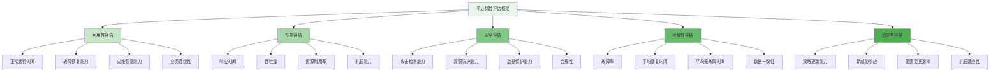

平台韧性评估是企业级智能风控平台建设中的关键环节，旨在检验系统在遭受各种攻击和压力情况下的应急响应与恢复能力。通过系统性的韧性评估，企业能够识别平台的薄弱环节，优化防护机制，并提升整体抗打击能力。

## 平台韧性评估框架

平台韧性评估需要建立全面的评估框架，涵盖可用性、性能、安全性、可靠性等多个维度。

### 评估框架架构



### 评估维度定义

```yaml
# 平台韧性评估维度
resilience_assessment_dimensions:
  availability:
    name: "可用性"
    description: "系统在各种情况下保持正常服务的能力"
    key_metrics:
      - "系统正常运行时间百分比"
      - "平均故障间隔时间(MTBF)"
      - "平均修复时间(MTTR)"
      - "服务恢复时间目标(RTO)"
      - "数据恢复点目标(RPO)"
    assessment_methods:
      - "压力测试"
      - "故障注入测试"
      - "灾难恢复演练"
      - "长期稳定性监控"
  
  performance:
    name: "性能"
    description: "系统在正常和异常负载下的性能表现"
    key_metrics:
      - "平均响应时间"
      - "峰值吞吐量"
      - "资源利用率"
      - "容量弹性"
      - "性能衰退率"
    assessment_methods:
      - "负载测试"
      - "压力测试"
      - "容量规划验证"
      - "性能基准测试"
  
  security:
    name: "安全性"
    description: "系统抵御各种安全威胁的能力"
    key_metrics:
      - "攻击检测率"
      - "漏洞修复时间"
      - "安全事件响应时间"
      - "数据泄露防护能力"
      - "合规性符合度"
    assessment_methods:
      - "渗透测试"
      - "漏洞扫描"
      - "红蓝对抗"
      - "安全审计"
  
  reliability:
    name: "可靠性"
    description: "系统长期稳定运行的能力"
    key_metrics:
      - "故障率"
      - "平均修复时间(MTTR)"
      - "平均无故障时间(MTBF)"
      - "数据一致性"
      - "服务级别协议符合度"
    assessment_methods:
      - "长期稳定性测试"
      - "故障模式分析"
      - "冗余机制验证"
      - "数据完整性检查"
  
  adaptability:
    name: "适应性"
    description: "系统适应变化和新威胁的能力"
    key_metrics:
      - "策略更新时效"
      - "新威胁响应时间"
      - "配置变更影响"
      - "扩展能力"
      - "学习改进速度"
    assessment_methods:
      - "变更管理评估"
      - "新策略部署测试"
      - "弹性伸缩验证"
      - "持续改进评估"
```

## 可用性评估

可用性是平台韧性的核心指标，直接关系到业务的连续性。

### 可用性评估方法

```python
class AvailabilityAssessment:
    def __init__(self):
        self.stress_tester = StressTester()
        self.fault_injector = FaultInjector()
        self.recovery_verifier = RecoveryVerifier()
        self.availability_calculator = AvailabilityCalculator()
    
    def assess_availability(self, assessment_config):
        """评估平台可用性"""
        # 1. 正常运行时间测试
        uptime_test = self.conduct_uptime_test(assessment_config.uptime_duration)
        
        # 2. 故障恢复测试
        recovery_test = self.conduct_recovery_test(assessment_config.fault_scenarios)
        
        # 3. 灾难恢复演练
        dr_test = self.conduct_disaster_recovery_test(assessment_config.dr_scenarios)
        
        # 4. 业务连续性验证
        continuity_test = self.verify_business_continuity(assessment_config.business_scenarios)
        
        # 5. 可用性指标计算
        availability_metrics = self.calculate_availability_metrics(
            uptime_test.results,
            recovery_test.results,
            dr_test.results,
            continuity_test.results
        )
        
        # 6. 可用性等级评估
        availability_level = self.evaluate_availability_level(availability_metrics)
        
        return AvailabilityAssessmentResult(
            uptime_test=uptime_test,
            recovery_test=recovery_test,
            dr_test=dr_test,
            continuity_test=continuity_test,
            metrics=availability_metrics,
            level=availability_level,
            recommendations=self.generate_availability_recommendations(availability_metrics)
        )
    
    def conduct_uptime_test(self, duration):
        """执行正常运行时间测试"""
        # 1. 初始化测试环境
        test_environment = self.setup_uptime_test_environment()
        
        # 2. 启动持续监控
        monitor = self.start_continuous_monitoring(test_environment)
        
        # 3. 执行长时间运行测试
        test_start_time = datetime.now()
        while (datetime.now() - test_start_time).total_seconds() < duration:
            # 检查系统状态
            system_status = self.check_system_status(test_environment)
            
            # 记录状态变化
            if system_status != "normal":
                monitor.record_downtime(system_status)
            
            # 等待下一次检查
            time.sleep(60)  # 每分钟检查一次
        
        # 4. 收集测试结果
        test_results = monitor.get_uptime_statistics()
        
        return UptimeTestResult(
            duration=duration,
            uptime_percentage=test_results.uptime_percentage,
            downtime_events=test_results.downtime_events,
            mean_time_between_failures=test_results.mtbf,
            mean_time_to_recovery=test_results.mttr
        )
    
    def conduct_recovery_test(self, fault_scenarios):
        """执行故障恢复测试"""
        recovery_results = []
        
        for scenario in fault_scenarios:
            # 1. 注入故障
            fault_injection = self.fault_injector.inject_fault(scenario)
            
            # 2. 监控系统响应
            response_monitor = self.start_response_monitoring()
            
            # 3. 触发恢复机制
            recovery_trigger = self.trigger_recovery_mechanism(scenario.recovery_procedure)
            
            # 4. 验证恢复效果
            recovery_verification = self.recovery_verifier.verify_recovery(
                fault_injection,
                recovery_trigger
            )
            
            # 5. 记录恢复结果
            recovery_result = RecoveryTestResult(
                scenario=scenario,
                fault_injection=fault_injection,
                response_time=response_monitor.get_response_time(),
                recovery_time=recovery_verification.recovery_time,
                success_rate=recovery_verification.success_rate,
                data_integrity=recovery_verification.data_integrity
            )
            recovery_results.append(recovery_result)
        
        return RecoveryTestSuiteResult(
            scenarios=fault_scenarios,
            results=recovery_results,
            overall_success_rate=self.calculate_overall_recovery_rate(recovery_results)
        )
    
    def calculate_availability_metrics(self, uptime_results, recovery_results, dr_results, continuity_results):
        """计算可用性指标"""
        # 1. 系统正常运行时间百分比
        uptime_percentage = uptime_results.uptime_percentage
        
        # 2. 平均故障间隔时间
        mtbf = uptime_results.mean_time_between_failures
        
        # 3. 平均修复时间
        mttr = self.calculate_average_mttr(recovery_results, dr_results)
        
        # 4. 服务恢复时间目标符合度
        rto_compliance = self.evaluate_rto_compliance(recovery_results, dr_results)
        
        # 5. 数据恢复点目标符合度
        rpo_compliance = self.evaluate_rpo_compliance(recovery_results, dr_results)
        
        # 6. 综合可用性评分
        overall_availability = self.calculate_overall_availability(
            uptime_percentage,
            mtbf,
            mttr,
            rto_compliance,
            rpo_compliance
        )
        
        return AvailabilityMetrics(
            uptime_percentage=uptime_percentage,
            mtbf=mtbf,
            mttr=mttr,
            rto_compliance=rto_compliance,
            rpo_compliance=rpo_compliance,
            overall_availability=overall_availability
        )
```

### 故障注入测试

```go
type FaultInjectionTester struct {
    FaultLibrary     *FaultLibrary
    InjectionEngine  *FaultInjectionEngine
    MonitoringSystem *SystemMonitoring
    RecoveryChecker  *RecoveryChecker
}

type FaultScenario struct {
    ID              string
    Name            string
    Description     string
    FaultType       string  // hardware, network, software, data
    InjectionPoint   string  // component, service, network, storage
    Severity        string  // low, medium, high, critical
    ExpectedImpact  string  // partial, major, complete
    RecoveryTime    time.Duration
    Dependencies    []string
}

type FaultInjectionResult struct {
    Scenario        *FaultScenario
    InjectionTime   time.Time
    DetectionTime   time.Time
    RecoveryTime    time.Time
    SystemImpact    SystemImpact
    RecoverySuccess bool
    DataIntegrity   bool
    BusinessImpact  BusinessImpact
}

func (fit *FaultInjectionTester) ExecuteFaultInjectionTest(scenario *FaultScenario) *FaultInjectionResult {
    // 1. 记录注入开始时间
    injectionTime := time.Now()
    
    // 2. 执行故障注入
    fault, err := fit.InjectionEngine.InjectFault(scenario)
    if err != nil {
        return &FaultInjectionResult{
            Scenario:      scenario,
            InjectionTime: injectionTime,
            SystemImpact:  SystemImpact{Status: "injection_failed", Error: err.Error()},
        }
    }
    
    // 3. 启动系统监控
    monitor := fit.MonitoringSystem.StartMonitoring(scenario.InjectionPoint)
    defer monitor.Stop()
    
    // 4. 等待系统响应
    detectionTime := fit.waitForSystemResponse(monitor, scenario.Severity)
    
    // 5. 验证恢复机制
    recoveryCheck := fit.RecoveryChecker.CheckRecovery(scenario, fault)
    recoveryTime := time.Now()
    
    // 6. 评估系统影响
    systemImpact := fit.assessSystemImpact(monitor.GetMetrics(), scenario.ExpectedImpact)
    
    // 7. 验证数据完整性
    dataIntegrity := fit.verifyDataIntegrity(scenario.InjectionPoint)
    
    // 8. 评估业务影响
    businessImpact := fit.assessBusinessImpact(scenario, systemImpact)
    
    return &FaultInjectionResult{
        Scenario:        scenario,
        InjectionTime:   injectionTime,
        DetectionTime:   detectionTime,
        RecoveryTime:    recoveryTime,
        SystemImpact:    systemImpact,
        RecoverySuccess: recoveryCheck.Success,
        DataIntegrity:   dataIntegrity,
        BusinessImpact:  businessImpact,
    }
}

func (fit *FaultInjectionTester) waitForSystemResponse(monitor *SystemMonitor, severity string) time.Time {
    timeout := fit.getTimeoutForSeverity(severity)
    ticker := time.NewTicker(100 * time.Millisecond)
    defer ticker.Stop()
    
    timeoutTimer := time.NewTimer(timeout)
    defer timeoutTimer.Stop()
    
    for {
        select {
        case <-ticker.C:
            // 检查是否有异常指标
            if monitor.HasAbnormalMetrics() {
                return time.Now()
            }
        case <-timeoutTimer.C:
            // 超时返回
            return time.Now()
        }
    }
}

func (fit *FaultInjectionTester) assessSystemImpact(metrics SystemMetrics, expectedImpact string) SystemImpact {
    impact := SystemImpact{
        Status: "assessing",
        Metrics: metrics,
    }
    
    // 1. CPU使用率影响
    if metrics.CPUUtilization > 90 {
        impact.CPUImpact = "severe"
        impact.ImpactLevel += 2
    } else if metrics.CPUUtilization > 70 {
        impact.CPUImpact = "moderate"
        impact.ImpactLevel += 1
    }
    
    // 2. 内存使用影响
    if metrics.MemoryUtilization > 90 {
        impact.MemoryImpact = "severe"
        impact.ImpactLevel += 2
    } else if metrics.MemoryUtilization > 70 {
        impact.MemoryImpact = "moderate"
        impact.ImpactLevel += 1
    }
    
    // 3. 网络影响
    if metrics.NetworkLatency > 1000 {  // 1秒
        impact.NetworkImpact = "severe"
        impact.ImpactLevel += 2
    } else if metrics.NetworkLatency > 500 {  // 500毫秒
        impact.NetworkImpact = "moderate"
        impact.ImpactLevel += 1
    }
    
    // 4. 存储影响
    if metrics.DiskIO > 10000 {  // IOPS
        impact.StorageImpact = "severe"
        impact.ImpactLevel += 2
    } else if metrics.DiskIO > 5000 {
        impact.StorageImpact = "moderate"
        impact.ImpactLevel += 1
    }
    
    // 5. 确定总体影响级别
    if impact.ImpactLevel >= 6 {
        impact.Status = "severe"
    } else if impact.ImpactLevel >= 3 {
        impact.Status = "moderate"
    } else {
        impact.Status = "minor"
    }
    
    return impact
}
```

## 性能韧性评估

性能韧性评估关注系统在各种负载和压力情况下的表现。

### 性能测试方法

```typescript
interface PerformanceResilienceAssessment {
    // 负载测试
    conductLoadTest(config: LoadTestConfig): Promise<LoadTestResult>;
    
    // 压力测试
    conductStressTest(config: StressTestConfig): Promise<StressTestResult>;
    
    // 容量规划验证
    verifyCapacityPlanning(config: CapacityTestConfig): Promise<CapacityTestResult>;
    
    // 性能基准测试
    runPerformanceBenchmark(config: BenchmarkConfig): Promise<BenchmarkResult>;
}

class PerformanceResilienceEvaluator implements PerformanceResilienceAssessment {
    private loadTester: LoadTester;
    private stressTester: StressTester;
    private capacityVerifier: CapacityVerifier;
    private benchmarkRunner: BenchmarkRunner;
    
    async conductLoadTest(config: LoadTestConfig): Promise<LoadTestResult> {
        // 1. 准备测试环境
        const testEnvironment = await this.prepareTestEnvironment(config.environment);
        
        // 2. 配置负载生成器
        const loadGenerator = await this.configureLoadGenerator(config.loadPattern);
        
        // 3. 启动监控系统
        const monitor = await this.startPerformanceMonitoring(testEnvironment);
        
        // 4. 执行负载测试
        const testResults = await this.loadTester.executeLoadTest(
            loadGenerator,
            config.duration,
            config.metrics
        );
        
        // 5. 收集性能数据
        const performanceData = await monitor.collectPerformanceData();
        
        // 6. 分析测试结果
        const analysis = await this.analyzeLoadTestResults(testResults, performanceData);
        
        // 7. 生成测试报告
        const report = await this.generateLoadTestReport(analysis);
        
        return {
            config: config,
            environment: testEnvironment,
            results: testResults,
            performanceData: performanceData,
            analysis: analysis,
            report: report
        };
    }
    
    async conductStressTest(config: StressTestConfig): Promise<StressTestResult> {
        // 1. 渐进式压力施加
        const stressResults = [];
        let currentLoad = config.initialLoad;
        
        while (currentLoad <= config.maximumLoad && !this.shouldStopStressTest(stressResults)) {
            // 执行当前负载级别的测试
            const loadTestConfig = this.createLoadTestConfig(currentLoad, config);
            const loadTestResult = await this.conductLoadTest(loadTestConfig);
            stressResults.push(loadTestResult);
            
            // 增加负载
            currentLoad += config.loadIncrement;
            
            // 等待系统稳定
            await this.waitForSystemStabilization();
        }
        
        // 2. 分析压力测试结果
        const stressAnalysis = await this.analyzeStressTestResults(stressResults);
        
        // 3. 识别性能瓶颈
        const bottlenecks = await this.identifyPerformanceBottlenecks(stressAnalysis);
        
        // 4. 评估系统极限
        const systemLimits = await this.evaluateSystemLimits(stressAnalysis);
        
        // 5. 生成压力测试报告
        const report = await this.generateStressTestReport(stressAnalysis, bottlenecks, systemLimits);
        
        return {
            config: config,
            results: stressResults,
            analysis: stressAnalysis,
            bottlenecks: bottlenecks,
            systemLimits: systemLimits,
            report: report
        };
    }
    
    async verifyCapacityPlanning(config: CapacityTestConfig): Promise<CapacityTestResult> {
        // 1. 验证资源分配
        const resourceVerification = await this.verifyResourceAllocation(config.resources);
        
        // 2. 测试扩展能力
        const scalingTest = await this.testScalingCapability(config.scalingScenarios);
        
        // 3. 验证容量模型
        const capacityModelVerification = await this.verifyCapacityModel(config.capacityModel);
        
        // 4. 评估容量利用率
        const utilizationAnalysis = await this.analyzeCapacityUtilization(config.utilizationMetrics);
        
        // 5. 生成容量验证报告
        const report = await this.generateCapacityVerificationReport(
            resourceVerification,
            scalingTest,
            capacityModelVerification,
            utilizationAnalysis
        );
        
        return {
            config: config,
            resourceVerification: resourceVerification,
            scalingTest: scalingTest,
            capacityModelVerification: capacityModelVerification,
            utilizationAnalysis: utilizationAnalysis,
            report: report
        };
    }
    
    private async analyzeLoadTestResults(testResults: any, performanceData: any): Promise<LoadTestAnalysis> {
        // 1. 响应时间分析
        const responseTimeAnalysis = this.analyzeResponseTimes(performanceData.responseTimes);
        
        // 2. 吞吐量分析
        const throughputAnalysis = this.analyzeThroughput(performanceData.throughput);
        
        // 3. 资源使用分析
        const resourceUsageAnalysis = this.analyzeResourceUsage(performanceData.resourceMetrics);
        
        // 4. 错误率分析
        const errorRateAnalysis = this.analyzeErrorRates(performanceData.errorRates);
        
        // 5. 性能趋势分析
        const trendAnalysis = await this.analyzePerformanceTrends(performanceData);
        
        // 6. 性能衰退分析
        const degradationAnalysis = this.analyzePerformanceDegradation(performanceData);
        
        return {
            responseTime: responseTimeAnalysis,
            throughput: throughputAnalysis,
            resourceUsage: resourceUsageAnalysis,
            errorRate: errorRateAnalysis,
            trends: trendAnalysis,
            degradation: degradationAnalysis,
            overallPerformance: this.calculateOverallPerformanceScore(
                responseTimeAnalysis,
                throughputAnalysis,
                resourceUsageAnalysis,
                errorRateAnalysis
            )
        };
    }
    
    private analyzeResponseTimes(responseTimes: number[]): ResponseTimeAnalysis {
        if (responseTimes.length === 0) return { average: 0, median: 0, p95: 0, p99: 0 };
        
        // 排序响应时间
        const sortedTimes = [...responseTimes].sort((a, b) => a - b);
        
        // 计算统计指标
        const average = sortedTimes.reduce((sum, time) => sum + time, 0) / sortedTimes.length;
        const median = sortedTimes[Math.floor(sortedTimes.length / 2)];
        const p95Index = Math.floor(sortedTimes.length * 0.95);
        const p99Index = Math.floor(sortedTimes.length * 0.99);
        const p95 = sortedTimes[p95Index];
        const p99 = sortedTimes[p99Index];
        
        return {
            average: average,
            median: median,
            p95: p95,
            p99: p99,
            min: Math.min(...sortedTimes),
            max: Math.max(...sortedTimes)
        };
    }
    
    private analyzeThroughput(throughputData: any[]): ThroughputAnalysis {
        if (throughputData.length === 0) return { average: 0, peak: 0, sustained: 0 };
        
        // 计算平均吞吐量
        const totalRequests = throughputData.reduce((sum, data) => sum + data.requests, 0);
        const totalTime = throughputData[throughputData.length - 1].timestamp - throughputData[0].timestamp;
        const average = totalRequests / (totalTime / 1000);  // 每秒请求数
        
        // 计算峰值吞吐量
        const peak = Math.max(...throughputData.map(data => data.requestsPerSecond));
        
        // 计算持续吞吐量
        const sustained = this.calculateSustainedThroughput(throughputData);
        
        return {
            average: average,
            peak: peak,
            sustained: sustained,
            trend: this.analyzeThroughputTrend(throughputData)
        };
    }
}
```

### 性能监控与分析

```javascript
class PerformanceMonitoringSystem {
    constructor(config) {
        this.config = config;
        this.metricsCollector = new MetricsCollector();
        this.anomalyDetector = new AnomalyDetector();
        this.trendAnalyzer = new TrendAnalyzer();
        this.alertEngine = new AlertEngine();
    }
    
    /**
     * 启动性能监控
     * @param {Object} environment - 监控环境
     * @returns {Promise<Object>} 监控实例
     */
    async startPerformanceMonitoring(environment) {
        try {
            // 1. 初始化监控代理
            const monitoringAgents = await this.initializeMonitoringAgents(environment);
            
            // 2. 配置指标收集
            const metricConfigs = this.configureMetricsCollection();
            
            // 3. 启动数据收集
            const dataCollection = await this.startDataCollection(monitoringAgents, metricConfigs);
            
            // 4. 启动异常检测
            const anomalyDetection = await this.startAnomalyDetection();
            
            // 5. 启动趋势分析
            const trendAnalysis = await this.startTrendAnalysis();
            
            // 6. 启动告警系统
            const alerting = await this.startAlertingSystem();
            
            return {
                agents: monitoringAgents,
                collectors: dataCollection,
                detectors: anomalyDetection,
                analyzers: trendAnalysis,
                alerters: alerting,
                status: 'running'
            };
        } catch (error) {
            console.error('Failed to start performance monitoring:', error);
            return { success: false, error: error.message };
        }
    }
    
    /**
     * 收集性能数据
     * @returns {Promise<Object>} 性能数据
     */
    async collectPerformanceData() {
        // 1. 收集系统指标
        const systemMetrics = await this.metricsCollector.collectSystemMetrics();
        
        // 2. 收集应用指标
        const applicationMetrics = await this.metricsCollector.collectApplicationMetrics();
        
        // 3. 收集业务指标
        const businessMetrics = await this.metricsCollector.collectBusinessMetrics();
        
        // 4. 收集用户体验指标
        const userExperienceMetrics = await this.metricsCollector.collectUserExperienceMetrics();
        
        // 5. 检测异常
        const anomalies = await this.anomalyDetector.detectAnomalies([
            ...systemMetrics,
            ...applicationMetrics,
            ...businessMetrics,
            ...userExperienceMetrics
        ]);
        
        // 6. 分析趋势
        const trends = await this.trendAnalyzer.analyzeTrends([
            ...systemMetrics,
            ...applicationMetrics
        ]);
        
        return {
            system: systemMetrics,
            application: applicationMetrics,
            business: businessMetrics,
            userExperience: userExperienceMetrics,
            anomalies: anomalies,
            trends: trends,
            timestamp: new Date()
        };
    }
    
    /**
     * 实时性能分析
     * @param {Object} currentMetrics - 当前指标
     * @returns {Promise<Object>} 分析结果
     */
    async analyzeRealTimePerformance(currentMetrics) {
        // 1. 性能基线对比
        const baselineComparison = await this.compareWithBaseline(currentMetrics);
        
        // 2. 性能衰退检测
        const degradationDetection = await this.detectPerformanceDegradation(currentMetrics);
        
        // 3. 瓶颈识别
        const bottleneckIdentification = await this.identifyBottlenecks(currentMetrics);
        
        // 4. 资源使用优化建议
        const optimizationSuggestions = await this.generateOptimizationSuggestions(currentMetrics);
        
        // 5. 容量预测
        const capacityForecast = await this.forecastCapacityNeeds(currentMetrics);
        
        return {
            baselineComparison: baselineComparison,
            degradation: degradationDetection,
            bottlenecks: bottleneckIdentification,
            optimizations: optimizationSuggestions,
            capacityForecast: capacityForecast
        };
    }
    
    /**
     * 性能告警处理
     * @param {Object} metrics - 指标数据
     * @returns {Promise<Array>} 告警列表
     */
    async handlePerformanceAlerts(metrics) {
        const alerts = [];
        
        // 1. 检查响应时间告警
        if (metrics.responseTime > this.config.thresholds.responseTime) {
            const alert = await this.alertEngine.createAlert({
                type: 'response_time_degradation',
                severity: this.calculateSeverity(metrics.responseTime, this.config.thresholds.responseTime),
                message: `响应时间超过阈值: ${metrics.responseTime}ms`,
                metrics: metrics,
                timestamp: new Date()
            });
            alerts.push(alert);
        }
        
        // 2. 检查吞吐量告警
        if (metrics.throughput < this.config.thresholds.minThroughput) {
            const alert = await this.alertEngine.createAlert({
                type: 'throughput_drop',
                severity: this.calculateSeverity(this.config.thresholds.minThroughput, metrics.throughput),
                message: `吞吐量下降至: ${metrics.throughput} req/s`,
                metrics: metrics,
                timestamp: new Date()
            });
            alerts.push(alert);
        }
        
        // 3. 检查错误率告警
        if (metrics.errorRate > this.config.thresholds.errorRate) {
            const alert = await this.alertEngine.createAlert({
                type: 'error_rate_spike',
                severity: this.calculateSeverity(metrics.errorRate, this.config.thresholds.errorRate),
                message: `错误率上升至: ${(metrics.errorRate * 100).toFixed(2)}%`,
                metrics: metrics,
                timestamp: new Date()
            });
            alerts.push(alert);
        }
        
        // 4. 检查资源使用告警
        if (metrics.cpuUsage > this.config.thresholds.cpuUsage) {
            const alert = await this.alertEngine.createAlert({
                type: 'high_cpu_usage',
                severity: this.calculateSeverity(metrics.cpuUsage, this.config.thresholds.cpuUsage),
                message: `CPU使用率过高: ${(metrics.cpuUsage * 100).toFixed(2)}%`,
                metrics: metrics,
                timestamp: new Date()
            });
            alerts.push(alert);
        }
        
        // 5. 处理告警
        if (alerts.length > 0) {
            await this.alertEngine.processAlerts(alerts);
        }
        
        return alerts;
    }
    
    /**
     * 生成性能报告
     * @param {Object} performanceData - 性能数据
     * @returns {Promise<Object>} 性能报告
     */
    async generatePerformanceReport(performanceData) {
        // 1. 性能概览
        const overview = this.generatePerformanceOverview(performanceData);
        
        // 2. 详细指标分析
        const detailedAnalysis = await this.performDetailedAnalysis(performanceData);
        
        // 3. 趋势分析
        const trendAnalysis = await this.performTrendAnalysis(performanceData);
        
        // 4. 异常分析
        const anomalyAnalysis = await this.performAnomalyAnalysis(performanceData);
        
        // 5. 优化建议
        const recommendations = await this.generatePerformanceRecommendations(performanceData);
        
        // 6. 性能评分
        const performanceScore = this.calculatePerformanceScore(performanceData);
        
        return {
            overview: overview,
            detailedAnalysis: detailedAnalysis,
            trends: trendAnalysis,
            anomalies: anomalyAnalysis,
            recommendations: recommendations,
            score: performanceScore,
            generatedAt: new Date()
        };
    }
}
```

## 安全韧性评估

安全韧性评估关注系统在面对各种安全威胁时的防护和恢复能力。

### 安全测试方法

```yaml
# 安全韧性评估方法
security_resilience_assessment_methods:
  penetration_testing:
    name: "渗透测试"
    description: "模拟真实攻击测试系统安全防护能力"
    test_types:
      - "外部渗透测试"
      - "内部渗透测试"
      - "Web应用渗透测试"
      - "移动应用渗透测试"
      - "API安全测试"
    key_metrics:
      - "漏洞发现数量"
      - "高危漏洞修复率"
      - "攻击检测率"
      - "响应时间"
    tools:
      - "Metasploit"
      - "Burp Suite"
      - "Nmap"
      - "SQLMap"
      - "OWASP ZAP"
  
  vulnerability_scanning:
    name: "漏洞扫描"
    description: "自动化扫描系统安全漏洞"
    scan_types:
      - "网络漏洞扫描"
      - "主机漏洞扫描"
      - "Web应用扫描"
      - "数据库扫描"
      - "配置审计"
    key_metrics:
      - "漏洞扫描覆盖率"
      - "漏洞修复及时性"
      - "误报率"
      - "漏报率"
    tools:
      - "Nessus"
      - "OpenVAS"
      - "Qualys"
      - "Acunetix"
      - "Nikto"
  
  red_team_exercise:
    name: "红队演练"
    description: "模拟高级持续性威胁测试整体防护能力"
    exercise_types:
      - "初始访问测试"
      - "权限提升测试"
      - "横向移动测试"
      - "数据渗出测试"
      - "持久化测试"
    key_metrics:
      - "攻击成功率"
      - "检测绕过能力"
      - "响应有效性"
      - "恢复时间"
    tools:
      - "Cobalt Strike"
      - "Empire"
      - "Metasploit"
      - "Custom Exploits"
  
  security_auditing:
    name: "安全审计"
    description: "系统性检查安全控制措施有效性"
    audit_areas:
      - "访问控制审计"
      - "数据保护审计"
      - "日志审计"
      - "合规性审计"
      - "配置审计"
    key_metrics:
      - "控制措施符合度"
      - "审计发现问题数"
      - "整改措施完成率"
      - "合规性评分"
    tools:
      - "OpenSCAP"
      - "Netskope"
      - "Custom Audit Scripts"
```

### 安全韧性分析

```python
class SecurityResilienceAssessment:
    def __init__(self):
        self.pen_tester = PenetrationTester()
        self.vuln_scanner = VulnerabilityScanner()
        self.red_team = RedTeamExercise()
        self.auditor = SecurityAuditor()
    
    def assess_security_resilience(self, assessment_config):
        """评估安全韧性"""
        # 1. 渗透测试
        pen_test_results = self.conduct_penetration_test(assessment_config.pen_test_config)
        
        # 2. 漏洞扫描
        vuln_scan_results = self.perform_vulnerability_scan(assessment_config.vuln_scan_config)
        
        # 3. 红队演练
        red_team_results = self.conduct_red_team_exercise(assessment_config.red_team_config)
        
        # 4. 安全审计
        audit_results = self.perform_security_audit(assessment_config.audit_config)
        
        # 5. 综合安全评估
        comprehensive_assessment = self.perform_comprehensive_security_assessment(
            pen_test_results,
            vuln_scan_results,
            red_team_results,
            audit_results
        )
        
        # 6. 安全韧性评分
        resilience_score = self.calculate_security_resilience_score(comprehensive_assessment)
        
        # 7. 生成评估报告
        assessment_report = self.generate_security_assessment_report(
            pen_test_results,
            vuln_scan_results,
            red_team_results,
            audit_results,
            comprehensive_assessment,
            resilience_score
        )
        
        return SecurityResilienceAssessmentResult(
            penetration_test=pen_test_results,
            vulnerability_scan=vuln_scan_results,
            red_team_exercise=red_team_results,
            security_audit=audit_results,
            comprehensive_assessment=comprehensive_assessment,
            resilience_score=resilience_score,
            report=assessment_report
        )
    
    def conduct_penetration_test(self, config):
        """执行渗透测试"""
        # 1. 信息收集
        reconnaissance = self.pen_tester.perform_reconnaissance(config.targets)
        
        # 2. 漏洞识别
        vulnerabilities = self.pen_tester.identify_vulnerabilities(
            config.targets,
            reconnaissance.findings
        )
        
        # 3. 漏洞利用
        exploitation_results = self.pen_tester.exploit_vulnerabilities(
            vulnerabilities,
            config.exploitation_limits
        )
        
        # 4. 权限提升
        privilege_escalation = self.pen_tester.attempt_privilege_escalation(
            exploitation_results,
            config.escalation_techniques
        )
        
        # 5. 数据访问
        data_access = self.pen_tester.attempt_data_access(
            privilege_escalation,
            config.data_targets
        )
        
        # 6. 清理痕迹
        cleanup = self.pen_tester.perform_cleanup(data_access)
        
        return PenetrationTestResult(
            reconnaissance=reconnaissance,
            vulnerabilities=vulnerabilities,
            exploitation=exploitation_results,
            privilege_escalation=privilege_escalation,
            data_access=data_access,
            cleanup=cleanup,
            overall_success=self.calculate_pen_test_success_rate(exploitation_results, data_access),
            time_taken=self.calculate_test_duration(reconnaissance, cleanup)
        )
    
    def perform_comprehensive_security_assessment(self, pen_test, vuln_scan, red_team, audit):
        """执行综合安全评估"""
        # 1. 漏洞统计分析
        vulnerability_analysis = self.analyze_vulnerabilities(
            vuln_scan.findings,
            pen_test.vulnerabilities
        )
        
        # 2. 攻击面分析
        attack_surface_analysis = self.analyze_attack_surface(
            pen_test.reconnaissance,
            vuln_scan.findings,
            red_team.findings
        )
        
        # 3. 防护能力评估
        protection_assessment = self.assess_protection_capabilities(
            pen_test.exploitation,
            red_team.attack_progress,
            audit.findings
        )
        
        # 4. 响应能力评估
        response_assessment = self.assess_response_capabilities(
            pen_test.exploitation.detections,
            red_team.attack_progress.detections,
            audit.incident_response_review
        )
        
        # 5. 恢复能力评估
        recovery_assessment = self.assess_recovery_capabilities(
            pen_test.cleanup.recovery_measures,
            red_team.attack_progress.recovery_measures,
            audit.business_continuity_review
        )
        
        return ComprehensiveSecurityAssessment(
            vulnerability_analysis=vulnerability_analysis,
            attack_surface=attack_surface_analysis,
            protection_assessment=protection_assessment,
            response_assessment=response_assessment,
            recovery_assessment=recovery_assessment,
            overall_security_posture=self.calculate_overall_security_posture(
                vulnerability_analysis,
                protection_assessment,
                response_assessment,
                recovery_assessment
            )
        )
```

## 最佳实践与经验总结

在实施平台韧性评估的过程中，需要遵循一系列最佳实践来确保评估的有效性和实用性。

### 评估实施最佳实践

1. **系统性规划**：制定全面的评估计划，覆盖所有关键维度
2. **渐进式实施**：从基础评估开始，逐步增加复杂度
3. **真实环境测试**：在尽可能接近生产环境的条件下进行测试
4. **数据完整性**：确保评估过程中数据的完整性和准确性
5. **及时反馈**：建立快速反馈机制，及时调整评估策略

### 持续改进最佳实践

```mermaid
graph TB
    A[持续改进最佳实践] --> B[评估准备]
    A --> C[测试执行]
    A --> D[结果分析]
    A --> E[改进实施]
    A --> F[效果验证]
    
    B --> B1[明确评估目标]
    B --> B2[设计测试场景]
    B --> B3[准备测试环境]
    B --> B4[制定评估标准]
    
    C --> C1[执行韧性测试]
    C --> C2[收集测试数据]
    C --> C3[监控系统表现]
    C --> C4[记录异常情况]
    
    D --> D1[数据分析]
    D --> D2[问题识别]
    D --> D3[根因分析]
    D --> D4[改进建议]
    
    E --> E1[制定改进计划]
    E --> E2[分配改进任务]
    E --> E3[实施改进措施]
    E --> E4[跟踪改进进度]
    
    F --> F1[验证改进效果]
    F --> F2[评估提升程度]
    F --> F3[更新评估基线]
    F --> F4[优化评估流程]
    
    style A fill:#e8f5e8
    style B fill:#c8e6c8
    style C fill:#a5d6a7
    style D fill:#81c784
    style E fill:#66bb6a
    style F fill:#4caf50
```



### 运营管理建议

1. **建立专职团队**：组建专业的韧性评估团队负责评估工作
2. **制度化管理**：建立定期评估和持续改进的制度化流程
3. **工具平台建设**：建设完善的评估工具和平台
4. **知识管理**：建立评估经验和教训的知识管理体系
5. **文化建设**：培养重视系统韧性和持续改进的团队文化

通过建立完善的平台韧性评估机制，企业可以全面了解风控平台在各种压力和攻击情况下的表现，及时发现和修复系统脆弱性，优化防护机制，从而构建更加健壮和可靠的风控防护体系。这种评估机制不仅能够提升技术防护水平，还能够增强团队的风险意识和应急响应能力，为企业的长期安全发展提供有力保障。