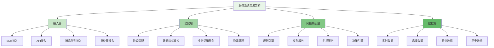
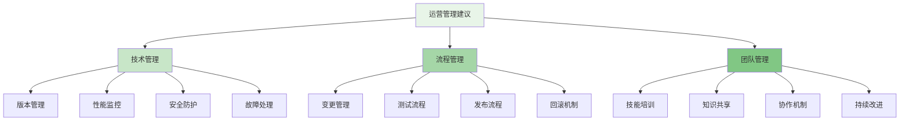

在企业级智能风控平台的实施过程中，与业务系统的无缝集成是确保风控策略有效落地的关键环节。通过轻量级SDK和标准化API调用方式，风控平台能够深度融入业务流程，实现实时风险识别和精准决策。

## 业务集成架构设计

业务系统集成需要构建清晰的架构层次，确保风控能力能够以最小侵入性的方式融入现有业务系统。

### 集成架构层次



### 接入方式对比

```yaml
# 业务系统接入方式对比
integration_methods:
  sdk_integration:
    name: "SDK集成"
    description: "通过嵌入式SDK实现业务系统与风控平台的深度集成"
    advantages:
      - "低延迟：本地处理，响应速度快"
      - "高可用：本地缓存，网络异常时可降级"
      - "易集成：提供标准API，开发成本低"
      - "实时性强：可实时获取风控决策结果"
    disadvantages:
      - "版本管理：需要统一版本管理和升级"
      - "资源占用：占用业务系统计算资源"
      - "安全风险：增加攻击面"
   适用场景:
      - "高频交易系统"
      - "实时风控要求高的场景"
      - "对响应时间敏感的业务"
  
  api_integration:
    name: "API集成"
    description: "通过RESTful API或gRPC实现业务系统与风控平台的松耦合集成"
    advantages:
      - "松耦合：业务系统与风控平台独立部署"
      - "易扩展：支持多种协议和数据格式"
      - "易维护：集中管理，升级不影响业务系统"
      - "跨语言：支持多种编程语言"
    disadvantages:
      - "网络延迟：依赖网络通信"
      - "可用性：网络异常时可能影响业务"
      - "并发限制：需要考虑API限流"
    适用场景:
      - "后台管理系统"
      - "批量处理场景"
      - "对实时性要求不高的业务"
  
  message_queue_integration:
    name: "消息队列集成"
    description: "通过消息队列实现异步风控处理"
    advantages:
      - "异步处理：提高系统吞吐量"
      - "削峰填谷：应对流量高峰"
      - "解耦合：业务系统与风控平台完全解耦"
      - "可靠性：消息持久化，保证不丢失"
    disadvantages:
      - "实时性差：不适合实时风控场景"
      - "复杂性：需要处理消息顺序和重复"
      - "延迟：存在消息传递延迟"
    适用场景:
      - "非实时风控场景"
      - "批量风控处理"
      - "日志分析和审计"
  
  batch_processing_integration:
    name: "批处理集成"
    description: "通过定时任务或批处理方式实现风控分析"
    advantages:
      - "处理大量数据：适合大数据量分析"
      - "资源利用：可利用空闲资源进行处理"
      - "成本低：不需要实时计算资源"
    disadvantages:
      - "实时性差：无法实现实时风控"
      - "延迟高：处理结果存在延迟"
    适用场景:
      - "风险分析报告"
      - "用户行为分析"
      - "模型训练数据准备"
```

## SDK集成实现

SDK集成是实现业务系统与风控平台深度集成的重要方式，通过提供轻量级的客户端库，降低业务系统的集成复杂度。

### SDK架构设计

```python
class RiskControlSDK:
    def __init__(self, config):
        self.config = config
        self.client = RiskControlClient(config.server_url)
        self.cache = LocalCache(config.cache_size)
        self.logger = Logger(config.log_level)
        self.metrics_collector = MetricsCollector()
    
    def check_risk(self, event_data):
        """风险检查接口"""
        # 1. 数据预处理
        processed_data = self.preprocess_data(event_data)
        
        # 2. 本地缓存检查
        cache_key = self.generate_cache_key(processed_data)
        cached_result = self.cache.get(cache_key)
        if cached_result:
            self.logger.info(f"Cache hit for key: {cache_key}")
            self.metrics_collector.record_cache_hit()
            return cached_result
        
        # 3. 远程风控检查
        try:
            risk_result = self.client.check_risk(processed_data)
            
            # 4. 缓存结果
            self.cache.set(cache_key, risk_result, ttl=self.config.cache_ttl)
            
            # 5. 记录指标
            self.metrics_collector.record_risk_check(
                event_type=processed_data.get('event_type'),
                result=risk_result,
                response_time=self.metrics_collector.get_last_response_time()
            )
            
            return risk_result
        except Exception as e:
            self.logger.error(f"Risk check failed: {str(e)}")
            
            # 降级处理
            if self.config.fallback_enabled:
                return self.fallback_check(processed_data)
            else:
                raise e
    
    def preprocess_data(self, event_data):
        """数据预处理"""
        # 1. 数据清洗
        cleaned_data = self.clean_data(event_data)
        
        # 2. 数据标准化
        standardized_data = self.standardize_data(cleaned_data)
        
        # 3. 特征提取
        features = self.extract_features(standardized_data)
        
        # 4. 数据签名
        signed_data = self.sign_data(features)
        
        return signed_data
    
    def generate_cache_key(self, data):
        """生成缓存键"""
        # 使用数据指纹作为缓存键
        data_fingerprint = self.calculate_data_fingerprint(data)
        return f"risk_check:{data_fingerprint}"
    
    def fallback_check(self, data):
        """降级检查"""
        # 1. 本地规则检查
        local_result = self.local_rule_check(data)
        
        # 2. 白名单检查
        whitelist_result = self.whitelist_check(data)
        
        # 3. 综合降级结果
        fallback_result = {
            'risk_level': 'low' if local_result == 'safe' and whitelist_result else 'medium',
            'decision': 'allow' if local_result == 'safe' and whitelist_result else 'review',
            'reason': '降级处理：风控服务不可用',
            'timestamp': int(time.time()),
            'fallback': True
        }
        
        return fallback_result

class RiskControlClient:
    def __init__(self, server_url):
        self.server_url = server_url
        self.session = requests.Session()
        self.session.headers.update({
            'Content-Type': 'application/json',
            'User-Agent': 'RiskControl-SDK/1.0'
        })
    
    def check_risk(self, data):
        """远程风控检查"""
        url = f"{self.server_url}/api/v1/risk/check"
        
        # 添加认证信息
        headers = self.add_authentication()
        
        # 发送请求
        start_time = time.time()
        response = self.session.post(url, json=data, headers=headers, timeout=5)
        end_time = time.time()
        
        # 记录响应时间
        response_time = (end_time - start_time) * 1000  # 转换为毫秒
        
        if response.status_code == 200:
            result = response.json()
            result['response_time'] = response_time
            return result
        else:
            raise RiskControlAPIError(f"API request failed with status {response.status_code}")
    
    def add_authentication(self):
        """添加认证信息"""
        # 生成签名
        timestamp = str(int(time.time()))
        signature = self.generate_signature(timestamp)
        
        return {
            'X-Timestamp': timestamp,
            'X-Signature': signature,
            'X-App-Key': self.config.app_key
        }
    
    def generate_signature(self, timestamp):
        """生成签名"""
        # 使用HMAC-SHA256生成签名
        message = f"{self.config.app_key}{timestamp}"
        signature = hmac.new(
            self.config.app_secret.encode('utf-8'),
            message.encode('utf-8'),
            hashlib.sha256
        ).hexdigest()
        return signature
```

### SDK使用示例

```go
// Go语言SDK使用示例
package main

import (
    "fmt"
    "log"
    "time"
    
    "github.com/company/risk-control-sdk-go"
)

func main() {
    // 1. 初始化SDK配置
    config := &riskcontrol.Config{
        ServerURL:   "https://risk-control.example.com",
        AppKey:      "your-app-key",
        AppSecret:   "your-app-secret",
        CacheSize:   1000,
        CacheTTL:    5 * time.Minute,
        Timeout:     3 * time.Second,
        Fallback:    true,
    }
    
    // 2. 创建SDK实例
    sdk, err := riskcontrol.NewSDK(config)
    if err != nil {
        log.Fatal("Failed to initialize SDK:", err)
    }
    
    // 3. 构造业务事件数据
    eventData := map[string]interface{}{
        "event_type": "user_login",
        "user_id":    "user_12345",
        "ip":         "192.168.1.100",
        "user_agent": "Mozilla/5.0 (Windows NT 10.0; Win64; x64) AppleWebKit/537.36",
        "timestamp":  time.Now().Unix(),
        "device_info": map[string]interface{}{
            "device_id": "device_abc123",
            "platform":  "web",
            "browser":   "Chrome",
        },
        "location": map[string]interface{}{
            "country": "CN",
            "city":    "Beijing",
        },
    }
    
    // 4. 执行风险检查
    result, err := sdk.CheckRisk(eventData)
    if err != nil {
        log.Printf("Risk check failed: %v", err)
        return
    }
    
    // 5. 根据风控结果处理业务逻辑
    switch result.Decision {
    case "allow":
        fmt.Println("允许用户登录")
        // 执行正常登录流程
        handleLoginSuccess(eventData)
    case "deny":
        fmt.Println("拒绝用户登录")
        // 记录拒绝日志并阻止登录
        handleLoginDenied(eventData, result.Reason)
    case "challenge":
        fmt.Println("需要二次验证")
        // 发送验证码或进行其他验证
        handleChallenge(eventData, result.ChallengeType)
    case "review":
        fmt.Println("需要人工审核")
        // 将事件发送到审核队列
        handleManualReview(eventData)
    }
    
    // 6. 记录风控结果
    log.Printf("Risk check result: %+v", result)
}

func handleLoginSuccess(eventData map[string]interface{}) {
    // 处理登录成功的逻辑
    fmt.Printf("User %s login successful\n", eventData["user_id"])
}

func handleLoginDenied(eventData map[string]interface{}, reason string) {
    // 处理登录被拒绝的逻辑
    fmt.Printf("User %s login denied: %s\n", eventData["user_id"], reason)
}

func handleChallenge(eventData map[string]interface{}, challengeType string) {
    // 处理二次验证的逻辑
    fmt.Printf("User %s needs %s challenge\n", eventData["user_id"], challengeType)
}

func handleManualReview(eventData map[string]interface{}) {
    // 处理人工审核的逻辑
    fmt.Printf("User %s needs manual review\n", eventData["user_id"])
}
```

## API集成实现

API集成通过标准化的接口实现业务系统与风控平台的松耦合集成，适用于多种业务场景。

### RESTful API设计

```typescript
// 风控API接口定义
interface RiskControlAPI {
    // 风险检查接口
    checkRisk(request: RiskCheckRequest): Promise<RiskCheckResponse>;
    
    // 批量风险检查接口
    batchCheckRisk(request: BatchRiskCheckRequest): Promise<BatchRiskCheckResponse>;
    
    // 风控结果反馈接口
    feedbackRiskResult(request: RiskFeedbackRequest): Promise<RiskFeedbackResponse>;
    
    // 风控策略查询接口
    queryRiskPolicies(request: PolicyQueryRequest): Promise<PolicyQueryResponse>;
}

// 风险检查请求
interface RiskCheckRequest {
    eventId: string;           // 事件ID
    eventType: string;         // 事件类型
    eventData: any;            // 事件数据
    context?: RiskContext;     // 上下文信息
    timeout?: number;          // 超时时间（毫秒）
}

// 风险检查响应
interface RiskCheckResponse {
    eventId: string;           // 事件ID
    riskLevel: RiskLevel;      // 风险等级 (low, medium, high, critical)
    decision: RiskDecision;    // 决策结果 (allow, deny, challenge, review)
    score?: number;            // 风险评分
    reason?: string;           // 决策原因
    details?: RiskDetails;     // 详细信息
    timestamp: number;         // 时间戳
    processingTime: number;    // 处理时间（毫秒）
}

// 风险等级枚举
type RiskLevel = 'low' | 'medium' | 'high' | 'critical';

// 决策结果枚举
type RiskDecision = 'allow' | 'deny' | 'challenge' | 'review';

// 风险详情
interface RiskDetails {
    triggeredRules?: TriggeredRule[];     // 触发的规则
    modelScores?: ModelScore[];           // 模型评分
    matchedLists?: MatchedList[];         // 匹配的名单
    riskFactors?: RiskFactor[];           // 风险因子
}

// 触发的规则
interface TriggeredRule {
    ruleId: string;        // 规则ID
    ruleName: string;      // 规则名称
    ruleType: string;      // 规则类型
    score: number;         // 规则评分
    description: string;   // 规则描述
}

// 模型评分
interface ModelScore {
    modelId: string;       // 模型ID
    modelName: string;     // 模型名称
    score: number;         // 模型评分
    version: string;       // 模型版本
}

class RiskControlAPIClient {
    private baseUrl: string;
    private apiKey: string;
    private timeout: number;
    
    constructor(config: { baseUrl: string; apiKey: string; timeout?: number }) {
        this.baseUrl = config.baseUrl;
        this.apiKey = config.apiKey;
        this.timeout = config.timeout || 5000;
    }
    
    /**
     * 风险检查
     * @param request 风险检查请求
     * @returns 风险检查响应
     */
    async checkRisk(request: RiskCheckRequest): Promise<RiskCheckResponse> {
        const url = `${this.baseUrl}/api/v1/risk/check`;
        
        const headers = {
            'Content-Type': 'application/json',
            'Authorization': `Bearer ${this.apiKey}`,
            'X-Request-ID': this.generateRequestId(),
            'X-Timestamp': Date.now().toString()
        };
        
        try {
            const response = await fetch(url, {
                method: 'POST',
                headers: headers,
                body: JSON.stringify(request),
                timeout: this.timeout
            });
            
            if (!response.ok) {
                throw new Error(`HTTP error! status: ${response.status}`);
            }
            
            const result: RiskCheckResponse = await response.json();
            return result;
        } catch (error) {
            throw new Error(`Risk check failed: ${error.message}`);
        }
    }
    
    /**
     * 批量风险检查
     * @param request 批量风险检查请求
     * @returns 批量风险检查响应
     */
    async batchCheckRisk(request: BatchRiskCheckRequest): Promise<BatchRiskCheckResponse> {
        const url = `${this.baseUrl}/api/v1/risk/batch-check`;
        
        const headers = {
            'Content-Type': 'application/json',
            'Authorization': `Bearer ${this.apiKey}`,
            'X-Request-ID': this.generateRequestId(),
            'X-Timestamp': Date.now().toString()
        };
        
        try {
            const response = await fetch(url, {
                method: 'POST',
                headers: headers,
                body: JSON.stringify(request),
                timeout: this.timeout
            });
            
            if (!response.ok) {
                throw new Error(`HTTP error! status: ${response.status}`);
            }
            
            const result: BatchRiskCheckResponse = await response.json();
            return result;
        } catch (error) {
            throw new Error(`Batch risk check failed: ${error.message}`);
        }
    }
    
    /**
     * 生成请求ID
     * @returns 请求ID
     */
    private generateRequestId(): string {
        return 'req_' + Date.now() + '_' + Math.random().toString(36).substr(2, 9);
    }
}

// 使用示例
async function example() {
    // 初始化API客户端
    const client = new RiskControlAPIClient({
        baseUrl: 'https://risk-control.example.com',
        apiKey: 'your-api-key',
        timeout: 3000
    });
    
    // 构造风险检查请求
    const request: RiskCheckRequest = {
        eventId: 'event_' + Date.now(),
        eventType: 'user_registration',
        eventData: {
            userId: 'user_123',
            email: 'user@example.com',
            phone: '13800138000',
            ip: '192.168.1.100',
            userAgent: 'Mozilla/5.0...',
            timestamp: Date.now()
        },
        timeout: 2000
    };
    
    try {
        // 执行风险检查
        const response = await client.checkRisk(request);
        
        // 处理风控结果
        console.log('Risk check result:', response);
        
        // 根据决策结果执行相应操作
        switch (response.decision) {
            case 'allow':
                console.log('Allow user registration');
                // 允许用户注册
                break;
            case 'deny':
                console.log('Deny user registration');
                // 拒绝用户注册
                break;
            case 'challenge':
                console.log('Challenge user registration');
                // 要求用户进行二次验证
                break;
            case 'review':
                console.log('Review user registration');
                // 将用户注册提交人工审核
                break;
        }
    } catch (error) {
        console.error('Risk check failed:', error);
    }
}
```

### API集成最佳实践

```javascript
// API集成最佳实践示例
class RiskControlIntegration {
    constructor(config) {
        this.config = config;
        this.apiClient = new RiskControlAPIClient(config.api);
        this.cache = new LRUCache(config.cache);
        this.retryManager = new RetryManager(config.retry);
        this.metricsCollector = new MetricsCollector();
    }
    
    /**
     * 集成式风险检查
     * @param {Object} eventData - 业务事件数据
     * @returns {Promise<Object>} 风控结果
     */
    async integratedRiskCheck(eventData) {
        const startTime = Date.now();
        
        try {
            // 1. 数据预处理
            const processedData = this.preprocessEventData(eventData);
            
            // 2. 缓存检查
            const cacheKey = this.generateCacheKey(processedData);
            const cachedResult = this.cache.get(cacheKey);
            if (cachedResult) {
                this.metricsCollector.recordCacheHit();
                return {
                    ...cachedResult,
                    fromCache: true,
                    processingTime: Date.now() - startTime
                };
            }
            
            // 3. 执行风险检查
            const riskRequest = this.buildRiskCheckRequest(processedData);
            const riskResult = await this.retryManager.executeWithRetry(
                () => this.apiClient.checkRisk(riskRequest)
            );
            
            // 4. 缓存结果
            this.cache.set(cacheKey, riskResult, this.config.cache.ttl);
            
            // 5. 记录指标
            this.metricsCollector.recordRiskCheck({
                eventType: processedData.eventType,
                riskLevel: riskResult.riskLevel,
                decision: riskResult.decision,
                processingTime: Date.now() - startTime,
                success: true
            });
            
            return {
                ...riskResult,
                fromCache: false,
                processingTime: Date.now() - startTime
            };
        } catch (error) {
            // 6. 错误处理和降级
            this.metricsCollector.recordRiskCheck({
                eventType: eventData.eventType,
                success: false,
                error: error.message,
                processingTime: Date.now() - startTime
            });
            
            // 降级处理
            if (this.config.fallback.enabled) {
                return this.fallbackRiskCheck(eventData);
            }
            
            throw error;
        }
    }
    
    /**
     * 数据预处理
     * @param {Object} eventData - 原始事件数据
     * @returns {Object} 处理后的数据
     */
    preprocessEventData(eventData) {
        // 1. 数据清洗
        const cleanedData = this.cleanEventData(eventData);
        
        // 2. 数据标准化
        const standardizedData = this.standardizeEventData(cleanedData);
        
        // 3. 特征工程
        const features = this.extractFeatures(standardizedData);
        
        // 4. 数据签名
        const signedData = this.signEventData(features);
        
        return signedData;
    }
    
    /**
     * 构建风险检查请求
     * @param {Object} processedData - 处理后的数据
     * @returns {Object} 风险检查请求
     */
    buildRiskCheckRequest(processedData) {
        return {
            eventId: this.generateEventId(),
            eventType: processedData.eventType,
            eventData: processedData,
            context: {
                businessScenario: processedData.businessScenario,
                userSegment: processedData.userSegment,
                riskTolerance: processedData.riskTolerance
            },
            timeout: this.config.api.timeout
        };
    }
    
    /**
     * 降级风险检查
     * @param {Object} eventData - 事件数据
     * @returns {Object} 降级检查结果
     */
    fallbackRiskCheck(eventData) {
        // 1. 本地规则检查
        const localRulesResult = this.evaluateLocalRules(eventData);
        
        // 2. 白名单检查
        const whitelistResult = this.checkWhitelist(eventData);
        
        // 3. 简单启发式检查
        const heuristicResult = this.simpleHeuristicCheck(eventData);
        
        // 4. 综合降级结果
        const fallbackDecision = this.combineFallbackResults(
            localRulesResult,
            whitelistResult,
            heuristicResult
        );
        
        return {
            eventId: eventData.eventId || this.generateEventId(),
            riskLevel: fallbackDecision.riskLevel,
            decision: fallbackDecision.decision,
            reason: '降级处理：风控服务不可用',
            fallback: true,
            timestamp: Date.now(),
            processingTime: 50  // 降级处理时间
        };
    }
    
    /**
     * 评估本地规则
     * @param {Object} eventData - 事件数据
     * @returns {Object} 本地规则评估结果
     */
    evaluateLocalRules(eventData) {
        const rules = this.config.fallback.localRules;
        const triggeredRules = [];
        let riskScore = 0;
        
        for (const rule of rules) {
            if (this.evaluateRule(rule, eventData)) {
                triggeredRules.push(rule);
                riskScore += rule.score;
            }
        }
        
        return {
            triggeredRules: triggeredRules,
            riskScore: riskScore,
            riskLevel: this.determineRiskLevel(riskScore)
        };
    }
    
    /**
     * 检查白名单
     * @param {Object} eventData - 事件数据
     * @returns {boolean} 是否在白名单中
     */
    checkWhitelist(eventData) {
        const whitelist = this.config.fallback.whitelist;
        
        // 检查用户ID是否在白名单中
        if (eventData.userId && whitelist.userIds.includes(eventData.userId)) {
            return true;
        }
        
        // 检查IP是否在白名单中
        if (eventData.ip && whitelist.ips.includes(eventData.ip)) {
            return true;
        }
        
        // 检查设备ID是否在白名单中
        if (eventData.deviceId && whitelist.deviceIds.includes(eventData.deviceId)) {
            return true;
        }
        
        return false;
    }
}
```

## 集成测试与验证

业务系统集成完成后，需要进行全面的测试和验证，确保集成的稳定性和可靠性。

### 集成测试策略

```yaml
# 集成测试策略
integration_test_strategy:
  unit_testing:
    name: "单元测试"
    description: "对SDK和API客户端进行单元测试"
    test_cases:
      - "SDK初始化测试"
      - "数据预处理测试"
      - "缓存功能测试"
      - "降级处理测试"
      - "错误处理测试"
    tools:
      - "JUnit (Java)"
      - "pytest (Python)"
      - "Jest (JavaScript)"
      - "Go testing package"
  
  integration_testing:
    name: "集成测试"
    description: "测试业务系统与风控平台的集成"
    test_cases:
      - "正常风控检查流程"
      - "网络异常处理"
      - "超时处理"
      - "认证失败处理"
      - "批量处理测试"
    tools:
      - "Postman"
      - "JMeter"
      - "K6"
      - "自定义测试脚本"
  
  performance_testing:
    name: "性能测试"
    description: "验证集成方案的性能表现"
    test_cases:
      - "响应时间测试"
      - "并发处理能力"
      - "缓存命中率"
      - "资源消耗测试"
    tools:
      - "JMeter"
      - "K6"
      - "Gatling"
      - "自定义压测工具"
  
  chaos_testing:
    name: "混沌测试"
    description: "验证系统在异常情况下的稳定性"
    test_cases:
      - "网络延迟模拟"
      - "服务不可用模拟"
      - "数据包丢失模拟"
      - "服务降级验证"
    tools:
      - "Chaos Monkey"
      - "Gremlin"
      - "自定义故障注入工具"
```

### 测试用例示例

```python
import unittest
from unittest.mock import patch, MagicMock
import time

class TestRiskControlSDK(unittest.TestCase):
    def setUp(self):
        self.config = {
            'server_url': 'https://test-risk-control.example.com',
            'app_key': 'test-app-key',
            'app_secret': 'test-app-secret',
            'cache_size': 100,
            'cache_ttl': 300,
            'timeout': 3,
            'fallback_enabled': True
        }
        self.sdk = RiskControlSDK(self.config)
    
    def test_sdk_initialization(self):
        """测试SDK初始化"""
        self.assertIsNotNone(self.sdk.client)
        self.assertIsNotNone(self.sdk.cache)
        self.assertIsNotNone(self.sdk.logger)
    
    @patch('risk_control_sdk.RiskControlClient.check_risk')
    def test_risk_check_success(self, mock_check_risk):
        """测试风险检查成功"""
        # 模拟API返回
        mock_result = {
            'risk_level': 'low',
            'decision': 'allow',
            'score': 0.1,
            'reason': '正常用户行为',
            'timestamp': int(time.time())
        }
        mock_check_risk.return_value = mock_result
        
        # 执行风险检查
        event_data = {
            'event_type': 'user_login',
            'user_id': 'test_user_123',
            'ip': '192.168.1.100'
        }
        result = self.sdk.check_risk(event_data)
        
        # 验证结果
        self.assertEqual(result['risk_level'], 'low')
        self.assertEqual(result['decision'], 'allow')
        self.assertEqual(result['score'], 0.1)
    
    @patch('risk_control_sdk.RiskControlClient.check_risk')
    def test_risk_check_with_cache(self, mock_check_risk):
        """测试缓存功能"""
        # 模拟API返回
        mock_result = {
            'risk_level': 'medium',
            'decision': 'review',
            'score': 0.6,
            'reason': '需要人工审核',
            'timestamp': int(time.time())
        }
        mock_check_risk.return_value = mock_result
        
        # 第一次调用
        event_data = {
            'event_type': 'user_login',
            'user_id': 'test_user_123',
            'ip': '192.168.1.100'
        }
        result1 = self.sdk.check_risk(event_data)
        
        # 第二次调用相同数据
        result2 = self.sdk.check_risk(event_data)
        
        # 验证API只被调用一次
        mock_check_risk.assert_called_once()
        
        # 验证两次结果相同
        self.assertEqual(result1, result2)
    
    @patch('risk_control_sdk.RiskControlClient.check_risk')
    def test_risk_check_timeout(self, mock_check_risk):
        """测试超时处理"""
        # 模拟超时异常
        mock_check_risk.side_effect = RiskControlAPIError("Request timeout")
        
        # 启用降级
        self.sdk.config.fallback_enabled = True
        
        # 执行风险检查
        event_data = {
            'event_type': 'user_login',
            'user_id': 'test_user_123',
            'ip': '192.168.1.100'
        }
        result = self.sdk.check_risk(event_data)
        
        # 验证降级结果
        self.assertTrue(result.get('fallback', False))
        self.assertIn('降级处理', result.get('reason', ''))

if __name__ == '__main__':
    unittest.main()
```

## 最佳实践与经验总结

在实施业务系统集成过程中，需要遵循一系列最佳实践来确保集成的成功和可持续性。

### 集成实施最佳实践

1. **渐进式集成**：从简单场景开始，逐步增加复杂度
2. **标准化接口**：定义清晰、稳定的API接口规范
3. **容错设计**：实现完善的错误处理和降级机制
4. **性能优化**：合理使用缓存，优化网络通信
5. **监控告警**：建立全面的监控和告警体系

### 运营管理建议



通过合理的业务系统集成设计和实施，风控平台能够与业务系统深度融合，实现高效的实时风险识别和精准决策，为企业的业务安全提供有力保障。