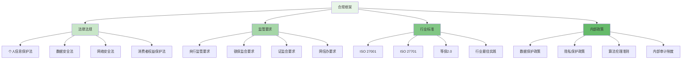

在企业级智能风控平台的实施过程中，合规性考量是确保平台合法运营和规避法律风险的重要环节。随着《个人信息保护法》、《数据安全法》等法律法规的实施，以及算法审计等监管要求的加强，风控平台必须建立完善的合规保障体系，确保在提供有效风控服务的同时，严格遵守相关法律法规和监管要求。

## 合规框架设计

构建全面的合规框架是确保风控平台合规运营的基础，需要涵盖法律法规、监管要求、行业标准等多个维度。

### 合规框架架构



### 合规要求映射

```yaml
# 风控平台合规要求映射
compliance_requirements_mapping:
  personal_information_protection:
    name: "个人信息保护"
    description: "遵守《个人信息保护法》等相关法律法规"
    legal_basis:
      - "《中华人民共和国个人信息保护法》"
      - "《中华人民共和国数据安全法》"
      - "《中华人民共和国网络安全法》"
    key_requirements:
      - consent_management:
          name: "同意管理"
          description: "确保个人信息处理获得用户明确同意"
          implementation:
            - "提供清晰的隐私政策"
            - "实现用户同意的收集和管理"
            - "支持用户撤回同意"
            - "记录同意状态和变更历史"
      
      data_minimization:
          name: "数据最小化"
          description: "仅收集和处理必要的个人信息"
          implementation:
            - "定义数据收集范围和目的"
            - "实施数据分类和标记"
            - "定期清理过期和无用数据"
            - "建立数据保留策略"
      
      purpose_limitation:
          name: "目的限制"
          description: "个人信息仅用于明确告知的目的"
          implementation:
            - "明确数据处理目的"
            - "实施访问控制和权限管理"
            - "监控数据使用情况"
            - "防止数据滥用"
      
      data_security:
          name: "数据安全"
          description: "采取技术和管理措施保护个人信息安全"
          implementation:
            - "数据加密存储和传输"
            - "访问控制和身份认证"
            - "安全审计和监控"
            - "数据备份和恢复"
  
  algorithm_audit:
    name: "算法审计"
    description: "满足算法审计和可解释性要求"
    regulatory_basis:
      - "《互联网信息服务算法推荐管理规定》"
      - "《新一代人工智能伦理规范》"
      - "各行业算法监管要求"
    key_requirements:
      - algorithm_transparency:
          name: "算法透明度"
          description: "确保算法决策过程的透明性"
          implementation:
            - "提供算法决策说明"
            - "建立算法文档管理体系"
            - "支持决策结果溯源"
            - "定期发布算法评估报告"
      
      fairness_and_non_discrimination:
          name: "公平性和非歧视"
          description: "确保算法决策的公平性，避免歧视"
          implementation:
            - "建立算法公平性评估机制"
            - "实施偏见检测和纠正"
            - "定期审查算法效果"
            - "建立申诉和复核机制"
      
      human_oversight:
          name: "人工监督"
          description: "确保重要决策有人工参与和监督"
          implementation:
            - "设定人工审核阈值"
            - "建立人工干预机制"
            - "提供人工复核功能"
            - "记录人工决策过程"
      
      accountability:
          name: "责任追究"
          description: "建立算法决策的责任追究机制"
          implementation:
            - "明确算法决策责任人"
            - "建立决策错误追溯机制"
            - "制定风险处置预案"
            - "定期开展责任评估"
  
  data_governance:
    name: "数据治理"
    description: "建立完善的数据治理体系"
    standards:
      - "ISO 27001信息安全管理体系"
      - "ISO 27701隐私信息管理体系"
      - "等保2.0三级及以上要求"
      - "行业数据治理最佳实践"
    key_requirements:
      - data_classification:
          name: "数据分类"
          description: "对数据进行分类管理和保护"
          implementation:
            - "建立数据分类标准"
            - "实施数据标记和标识"
            - "制定分类保护策略"
            - "定期更新分类结果"
      
      access_control:
          name: "访问控制"
          description: "严格控制数据访问权限"
          implementation:
            - "建立基于角色的访问控制"
            - "实施最小权限原则"
            - "定期审查访问权限"
            - "记录访问日志"
      
      data_lifecycle:
          name: "数据生命周期"
          description: "管理数据从创建到销毁的全生命周期"
          implementation:
            - "制定数据创建规范"
            - "实施数据使用监控"
            - "建立数据归档机制"
            - "执行安全数据销毁"
```

## 个人信息保护实施

个人信息保护是风控平台合规的核心要求，需要从技术、管理和流程等多个维度全面实施。

### 数据收集与处理

```python
class PersonalDataProtectionManager:
    def __init__(self, config):
        self.config = config
        self.consent_manager = ConsentManager()
        self.data_classifier = DataClassifier()
        self.access_controller = AccessController()
        self.audit_logger = AuditLogger()
    
    def collect_personal_data(self, data_collection_request):
        """收集个人信息"""
        # 1. 验证数据收集合法性
        legality_check = self.validate_data_collection_legality(data_collection_request)
        if not legality_check.is_legal:
            raise IllegalDataCollectionError(legality_check.reason)
        
        # 2. 获取用户同意
        consent_status = self.consent_manager.get_consent_status(
            user_id=data_collection_request.user_id,
            purpose=data_collection_request.purpose
        )
        
        if consent_status != 'granted':
            raise ConsentNotGrantedError(f"User consent not granted for purpose: {data_collection_request.purpose}")
        
        # 3. 数据分类标记
        classified_data = self.data_classifier.classify_and_tag(data_collection_request.data)
        
        # 4. 记录数据收集日志
        self.audit_logger.log_data_collection(
            user_id=data_collection_request.user_id,
            data_types=classified_data.types,
            purpose=data_collection_request.purpose,
            consent_id=consent_status.consent_id,
            timestamp=datetime.now()
        )
        
        # 5. 安全存储
        encrypted_data = self.encrypt_personal_data(classified_data.data)
        storage_result = self.secure_storage.store(encrypted_data)
        
        return {
            'collection_id': self.generate_collection_id(),
            'status': 'success',
            'data_id': storage_result.data_id,
            'classification': classified_data.classification
        }
    
    def process_personal_data(self, data_processing_request):
        """处理个人信息"""
        # 1. 验证处理目的合法性
        purpose_validation = self.validate_processing_purpose(
            data_processing_request.data_id,
            data_processing_request.purpose
        )
        
        if not purpose_validation.is_valid:
            raise InvalidProcessingPurposeError(purpose_validation.reason)
        
        # 2. 检查访问权限
        access_check = self.access_controller.check_access(
            user_id=data_processing_request.processor_id,
            data_id=data_processing_request.data_id,
            operation='process'
        )
        
        if not access_check.is_allowed:
            raise AccessDeniedError("Insufficient permissions to process personal data")
        
        # 3. 数据最小化处理
        minimized_data = self.apply_data_minimization(
            data_processing_request.data_id,
            data_processing_request.required_fields
        )
        
        # 4. 记录处理日志
        self.audit_logger.log_data_processing(
            data_id=data_processing_request.data_id,
            processor_id=data_processing_request.processor_id,
            purpose=data_processing_request.purpose,
            operations=data_processing_request.operations,
            timestamp=datetime.now()
        )
        
        # 5. 执行数据处理
        processing_result = self.execute_data_processing(
            minimized_data,
            data_processing_request.operations
        )
        
        return processing_result
    
    def validate_data_collection_legality(self, request):
        """验证数据收集合法性"""
        # 检查是否符合法律要求
        legal_compliance = self.check_legal_compliance(request)
        
        # 检查是否符合最小化原则
        minimization_compliance = self.check_minimization_compliance(request.data)
        
        # 检查是否获得合法同意
        consent_compliance = self.check_consent_compliance(request.user_id, request.purpose)
        
        return LegalityCheckResult(
            is_legal=legal_compliance and minimization_compliance and consent_compliance,
            reason=self.generate_legality_reason(legal_compliance, minimization_compliance, consent_compliance)
        )
    
    def apply_data_minimization(self, data_id, required_fields):
        """应用数据最小化原则"""
        # 获取完整数据
        full_data = self.secure_storage.retrieve(data_id)
        decrypted_data = self.decrypt_personal_data(full_data)
        
        # 只保留必需字段
        minimized_data = {}
        for field in required_fields:
            if field in decrypted_data:
                minimized_data[field] = decrypted_data[field]
        
        # 记录最小化处理
        self.audit_logger.log_data_minimization(
            data_id=data_id,
            original_fields=list(decrypted_data.keys()),
            retained_fields=required_fields,
            timestamp=datetime.now()
        )
        
        return minimized_data

class ConsentManager:
    def __init__(self):
        self.consent_repository = ConsentRepository()
        self.notification_service = NotificationService()
    
    def request_consent(self, user_id, purpose, description):
        """请求用户同意"""
        # 1. 生成同意请求
        consent_request = ConsentRequest(
            request_id=self.generate_request_id(),
            user_id=user_id,
            purpose=purpose,
            description=description,
            requested_at=datetime.now()
        )
        
        # 2. 发送同意请求通知
        self.notification_service.send_consent_request(
            user_id=user_id,
            consent_request=consent_request
        )
        
        # 3. 记录请求状态
        self.consent_repository.save_request(consent_request)
        
        return consent_request.request_id
    
    def grant_consent(self, user_id, request_id):
        """授予同意"""
        # 1. 验证请求有效性
        consent_request = self.consent_repository.get_request(request_id)
        if not consent_request or consent_request.user_id != user_id:
            raise InvalidConsentRequestError("Invalid consent request")
        
        # 2. 创建同意记录
        consent_record = ConsentRecord(
            consent_id=self.generate_consent_id(),
            user_id=user_id,
            purpose=consent_request.purpose,
            granted_at=datetime.now(),
            expires_at=self.calculate_expiration_time(consent_request.purpose),
            status='granted'
        )
        
        # 3. 保存同意记录
        self.consent_repository.save_consent(consent_record)
        
        # 4. 更新请求状态
        consent_request.status = 'granted'
        consent_request.granted_at = datetime.now()
        self.consent_repository.update_request(consent_request)
        
        # 5. 发送确认通知
        self.notification_service.send_consent_granted_confirmation(user_id, consent_record)
        
        return consent_record.consent_id
    
    def withdraw_consent(self, user_id, consent_id):
        """撤回同意"""
        # 1. 获取同意记录
        consent_record = self.consent_repository.get_consent(consent_id)
        if not consent_record or consent_record.user_id != user_id:
            raise InvalidConsentRecordError("Invalid consent record")
        
        # 2. 更新同意状态
        consent_record.status = 'withdrawn'
        consent_record.withdrawn_at = datetime.now()
        self.consent_repository.update_consent(consent_record)
        
        # 3. 记录撤回日志
        self.consent_repository.log_consent_withdrawal(
            consent_id=consent_id,
            user_id=user_id,
            withdrawn_at=datetime.now()
        )
        
        # 4. 通知相关系统
        self.notification_service.notify_consent_withdrawal(user_id, consent_id)
        
        return True
```

### 隐私保护技术实现

```go
type PrivacyProtectionEngine struct {
    DataEncryptor      *DataEncryptor
    Anonymizer         *DataAnonymizer
    AccessController   *AccessController
    AuditLogger        *AuditLogger
    Config             *PrivacyConfig
}

type PrivacyProtectionResult struct {
    ProtectedData      interface{}     `json:"protected_data"`
    ProtectionLevel    string          `json:"protection_level"`
    AppliedTechniques  []string        `json:"applied_techniques"`
    ProcessingTime     time.Duration   `json:"processing_time"`
}

func (ppe *PrivacyProtectionEngine) ProtectPersonalData(data interface{}, protectionLevel string) (*PrivacyProtectionResult, error) {
    startTime := time.Now()
    
    // 1. 数据分类识别
    dataClassifier := NewDataClassifier()
    classifiedData := dataClassifier.Classify(data)
    
    // 2. 应用隐私保护技术
    var protectedData interface{}
    var appliedTechniques []string
    
    switch protectionLevel {
    case "high":
        // 高级别保护：加密 + 匿名化
        encryptedData := ppe.DataEncryptor.Encrypt(data)
        anonymizedData := ppe.Anonymizer.Anonymize(encryptedData, classifiedData.SensitiveFields)
        protectedData = anonymizedData
        appliedTechniques = []string{"encryption", "anonymization"}
        
    case "medium":
        // 中级别保护：加密 + 数据脱敏
        encryptedData := ppe.DataEncryptor.Encrypt(data)
        maskedData := ppe.applyDataMasking(encryptedData, classifiedData.SensitiveFields)
        protectedData = maskedData
        appliedTechniques = []string{"encryption", "data_masking"}
        
    case "low":
        // 低级别保护：基础加密
        protectedData = ppe.DataEncryptor.Encrypt(data)
        appliedTechniques = []string{"encryption"}
        
    default:
        return nil, fmt.Errorf("unsupported protection level: %s", protectionLevel)
    }
    
    // 3. 记录保护日志
    ppe.AuditLogger.LogPrivacyProtection(
        classifiedData.DataTypes,
        protectionLevel,
        appliedTechniques,
        time.Since(startTime),
    )
    
    // 4. 返回保护结果
    result := &PrivacyProtectionResult{
        ProtectedData:     protectedData,
        ProtectionLevel:   protectionLevel,
        AppliedTechniques: appliedTechniques,
        ProcessingTime:    time.Since(startTime),
    }
    
    return result, nil
}

func (ppe *PrivacyProtectionEngine) applyDataMasking(data interface{}, sensitiveFields []string) interface{} {
    // 实现数据脱敏逻辑
    maskedData := make(map[string]interface{})
    
    // 类型断言，假设data是map[string]interface{}
    if dataMap, ok := data.(map[string]interface{}); ok {
        for key, value := range dataMap {
            if ppe.isSensitiveField(key, sensitiveFields) {
                // 对敏感字段进行脱敏处理
                maskedData[key] = ppe.maskSensitiveData(key, value)
            } else {
                maskedData[key] = value
            }
        }
    }
    
    return maskedData
}

func (ppe *PrivacyProtectionEngine) isSensitiveField(fieldName string, sensitiveFields []string) bool {
    for _, field := range sensitiveFields {
        if field == fieldName {
            return true
        }
    }
    return false
}

func (ppe *PrivacyProtectionEngine) maskSensitiveData(fieldName string, value interface{}) interface{} {
    // 根据字段类型应用不同的脱敏策略
    switch fieldName {
    case "phone":
        if phoneStr, ok := value.(string); ok {
            return ppe.maskPhoneNumber(phoneStr)
        }
    case "email":
        if emailStr, ok := value.(string); ok {
            return ppe.maskEmail(emailStr)
        }
    case "id_card":
        if idCardStr, ok := value.(string); ok {
            return ppe.maskIDCard(idCardStr)
        }
    case "bank_account":
        if accountStr, ok := value.(string); ok {
            return ppe.maskBankAccount(accountStr)
        }
    default:
        // 默认脱敏：保留前几位和后几位，中间用*替代
        if strValue, ok := value.(string); ok {
            return ppe.defaultMask(strValue)
        }
    }
    
    return value
}

func (ppe *PrivacyProtectionEngine) maskPhoneNumber(phone string) string {
    if len(phone) >= 11 {
        return phone[:3] + "****" + phone[7:]
    }
    return phone
}

func (ppe *PrivacyProtectionEngine) maskEmail(email string) string {
    parts := strings.Split(email, "@")
    if len(parts) == 2 {
        username := parts[0]
        domain := parts[1]
        if len(username) > 2 {
            maskedUsername := username[:2] + "***"
            return maskedUsername + "@" + domain
        }
    }
    return "***@***"
}

func (ppe *PrivacyProtectionEngine) DataEncryptor struct {
    KeyManager *KeyManager
    Algorithm  string
}

func (de *DataEncryptor) Encrypt(data interface{}) interface{} {
    // 获取加密密钥
    key := de.KeyManager.GetCurrentKey()
    
    // 序列化数据
    dataBytes, err := json.Marshal(data)
    if err != nil {
        // 处理错误
        return data
    }
    
    // 执行加密
    encryptedBytes := de.performEncryption(dataBytes, key)
    
    // 返回加密后的数据
    return base64.StdEncoding.EncodeToString(encryptedBytes)
}

func (de *DataEncryptor) Decrypt(encryptedData string) (interface{}, error) {
    // 解码加密数据
    encryptedBytes, err := base64.StdEncoding.DecodeString(encryptedData)
    if err != nil {
        return nil, err
    }
    
    // 获取解密密钥
    key := de.KeyManager.GetCurrentKey()
    
    // 执行解密
    decryptedBytes := de.performDecryption(encryptedBytes, key)
    
    // 反序列化数据
    var decryptedData interface{}
    err = json.Unmarshal(decryptedBytes, &decryptedData)
    if err != nil {
        return nil, err
    }
    
    return decryptedData, nil
}
```

## 算法审计与可解释性

算法审计和可解释性是确保风控算法合规的重要手段，需要建立完善的审计机制和解释能力。

### 算法审计框架

```typescript
interface AlgorithmAuditFramework {
    // 算法备案管理
    registerAlgorithm(algorithm: AlgorithmInfo): Promise<AlgorithmRegistration>;
    
    // 算法影响评估
    conductImpactAssessment(algorithmId: string): Promise<ImpactAssessment>;
    
    // 算法性能监控
    monitorAlgorithmPerformance(algorithmId: string): Promise<PerformanceMetrics>;
    
    // 算法审计报告
    generateAuditReport(algorithmId: string): Promise<AuditReport>;
}

class RiskControlAlgorithmAuditor implements AlgorithmAuditFramework {
    private algorithmRepository: AlgorithmRepository;
    private auditLogger: AuditLogger;
    private metricsCollector: MetricsCollector;
    private biasDetector: BiasDetector;
    
    async registerAlgorithm(algorithm: AlgorithmInfo): Promise<AlgorithmRegistration> {
        // 1. 验证算法信息完整性
        const validation = this.validateAlgorithmInfo(algorithm);
        if (!validation.isValid) {
            throw new ValidationError(validation.errors);
        }
        
        // 2. 生成算法ID
        const algorithmId = this.generateAlgorithmId();
        
        // 3. 创建算法注册记录
        const registration = new AlgorithmRegistration({
            algorithmId: algorithmId,
            name: algorithm.name,
            version: algorithm.version,
            description: algorithm.description,
            developer: algorithm.developer,
            developmentDate: algorithm.developmentDate,
            purpose: algorithm.purpose,
            dataSources: algorithm.dataSources,
            technicalSpecifications: algorithm.technicalSpecifications,
            ethicalConsiderations: algorithm.ethicalConsiderations,
            complianceStatus: 'pending_review',
            registrationDate: new Date(),
            lastUpdated: new Date()
        });
        
        // 4. 保存注册信息
        await this.algorithmRepository.saveRegistration(registration);
        
        // 5. 记录审计日志
        await this.auditLogger.logAlgorithmRegistration(registration);
        
        return registration;
    }
    
    async conductImpactAssessment(algorithmId: string): Promise<ImpactAssessment> {
        // 1. 获取算法信息
        const algorithm = await this.algorithmRepository.getAlgorithm(algorithmId);
        
        // 2. 收集算法使用数据
        const usageData = await this.collectAlgorithmUsageData(algorithmId);
        
        // 3. 分析算法影响
        const impactAnalysis = await this.analyzeAlgorithmImpact(
            algorithm,
            usageData
        );
        
        // 4. 检测算法偏见
        const biasAnalysis = await this.biasDetector.detectBias(
            algorithmId,
            usageData.decisions
        );
        
        // 5. 评估公平性
        const fairnessAssessment = await this.assessFairness(
            usageData.decisions,
            usageData.userDemographics
        );
        
        // 6. 生成影响评估报告
        const impactAssessment = new ImpactAssessment({
            algorithmId: algorithmId,
            assessmentDate: new Date(),
            impactAnalysis: impactAnalysis,
            biasAnalysis: biasAnalysis,
            fairnessAssessment: fairnessAssessment,
            recommendations: this.generateImpactRecommendations(
                impactAnalysis,
                biasAnalysis,
                fairnessAssessment
            ),
            overallRiskLevel: this.calculateOverallRiskLevel(
                impactAnalysis,
                biasAnalysis,
                fairnessAssessment
            )
        });
        
        // 7. 保存评估结果
        await this.algorithmRepository.saveImpactAssessment(impactAssessment);
        
        // 8. 记录审计日志
        await this.auditLogger.logImpactAssessment(impactAssessment);
        
        return impactAssessment;
    }
    
    async monitorAlgorithmPerformance(algorithmId: string): Promise<PerformanceMetrics> {
        // 1. 收集性能指标
        const rawMetrics = await this.metricsCollector.collectAlgorithmMetrics(algorithmId);
        
        // 2. 计算关键性能指标
        const kpis = this.calculateKeyPerformanceIndicators(rawMetrics);
        
        // 3. 分析性能趋势
        const trends = await this.analyzePerformanceTrends(algorithmId, kpis);
        
        // 4. 检测异常情况
        const anomalies = await this.detectPerformanceAnomalies(kpis);
        
        // 5. 生成性能报告
        const performanceMetrics = new PerformanceMetrics({
            algorithmId: algorithmId,
            collectionDate: new Date(),
            kpis: kpis,
            trends: trends,
            anomalies: anomalies,
            overallPerformance: this.calculateOverallPerformance(kpis),
            recommendations: this.generatePerformanceRecommendations(kpis, anomalies)
        });
        
        // 6. 保存性能数据
        await this.algorithmRepository.savePerformanceMetrics(performanceMetrics);
        
        // 7. 触发告警（如有必要）
        if (anomalies.critical.length > 0) {
            await this.triggerPerformanceAlert(algorithmId, anomalies.critical);
        }
        
        return performanceMetrics;
    }
    
    async generateAuditReport(algorithmId: string): Promise<AuditReport> {
        // 1. 收集审计数据
        const auditData = await this.collectAuditData(algorithmId);
        
        // 2. 分析合规性
        const complianceAnalysis = await this.analyzeCompliance(auditData);
        
        // 3. 评估风险
        const riskAssessment = await this.assessAlgorithmRisk(algorithmId, auditData);
        
        // 4. 生成审计发现
        const auditFindings = this.identifyAuditFindings(auditData, complianceAnalysis);
        
        // 5. 制定改进建议
        const recommendations = this.generateAuditRecommendations(auditFindings, riskAssessment);
        
        // 6. 生成审计报告
        const auditReport = new AuditReport({
            algorithmId: algorithmId,
            reportId: this.generateReportId(),
            generationDate: new Date(),
            auditPeriod: auditData.period,
            complianceStatus: complianceAnalysis.status,
            riskLevel: riskAssessment.overallRisk,
            findings: auditFindings,
            recommendations: recommendations,
            conclusion: this.generateAuditConclusion(complianceAnalysis, riskAssessment),
            nextAuditDate: this.calculateNextAuditDate()
        });
        
        // 7. 保存审计报告
        await this.algorithmRepository.saveAuditReport(auditReport);
        
        // 8. 通知相关人员
        await this.notifyAuditResults(algorithmId, auditReport);
        
        return auditReport;
    }
    
    private async analyzeAlgorithmImpact(algorithm: AlgorithmInfo, usageData: AlgorithmUsageData): Promise<ImpactAnalysis> {
        // 1. 用户影响分析
        const userImpact = this.analyzeUserImpact(usageData.userOutcomes);
        
        // 2. 业务影响分析
        const businessImpact = this.analyzeBusinessImpact(usageData.businessMetrics);
        
        // 3. 社会影响分析
        const socialImpact = await this.analyzeSocialImpact(usageData.decisions);
        
        // 4. 环境影响分析
        const environmentalImpact = this.analyzeEnvironmentalImpact(algorithm);
        
        return new ImpactAnalysis({
            userImpact: userImpact,
            businessImpact: businessImpact,
            socialImpact: socialImpact,
            environmentalImpact: environmentalImpact,
            overallImpact: this.calculateOverallImpact(userImpact, businessImpact, socialImpact, environmentalImpact)
        });
    }
    
    private async assessFairness(decisions: AlgorithmDecision[], demographics: UserDemographics[]): Promise<FairnessAssessment> {
        // 1. 群体公平性评估
        const groupFairness = this.evaluateGroupFairness(decisions, demographics);
        
        // 2. 个体公平性评估
        const individualFairness = this.evaluateIndividualFairness(decisions);
        
        // 3. 程序公平性评估
        const proceduralFairness = this.evaluateProceduralFairness(decisions);
        
        // 4. 补偿公平性评估
        const correctiveFairness = this.evaluateCorrectiveFairness(decisions);
        
        return new FairnessAssessment({
            groupFairness: groupFairness,
            individualFairness: individualFairness,
            proceduralFairness: proceduralFairness,
            correctiveFairness: correctiveFairness,
            overallFairness: this.calculateOverallFairness(groupFairness, individualFairness, proceduralFairness, correctiveFairness),
            disparities: this.identifyFairnessDisparities(groupFairness, individualFairness)
        });
    }
}
```

### 算法可解释性实现

```javascript
class AlgorithmExplainabilityEngine {
    constructor(config) {
        this.config = config;
        this.modelInterpreter = new ModelInterpreter();
        this.featureAnalyzer = new FeatureAnalyzer();
        this.decisionLogger = new DecisionLogger();
    }
    
    /**
     * 生成算法决策解释
     * @param {string} algorithmId - 算法ID
     * @param {Object} inputData - 输入数据
     * @param {Object} decisionResult - 决策结果
     * @returns {Promise<Object>} 决策解释
     */
    async generateDecisionExplanation(algorithmId, inputData, decisionResult) {
        try {
            // 1. 特征重要性分析
            const featureImportance = await this.analyzeFeatureImportance(
                algorithmId,
                inputData,
                decisionResult
            );
            
            // 2. 决策路径分析
            const decisionPath = await this.traceDecisionPath(
                algorithmId,
                inputData,
                decisionResult
            );
            
            // 3. 对比分析
            const comparisonAnalysis = await this.performComparisonAnalysis(
                algorithmId,
                inputData,
                decisionResult
            );
            
            // 4. 规则解释
            const ruleExplanation = await this.explainRules(
                algorithmId,
                inputData,
                decisionResult
            );
            
            // 5. 生成综合解释
            const explanation = {
                decisionId: this.generateDecisionId(),
                algorithmId: algorithmId,
                input: this.sanitizeInputForExplanation(inputData),
                result: decisionResult,
                explanation: {
                    featureImportance: featureImportance,
                    decisionPath: decisionPath,
                    comparison: comparisonAnalysis,
                    rules: ruleExplanation,
                    summary: this.generateExplanationSummary(
                        featureImportance,
                        decisionPath,
                        ruleExplanation
                    )
                },
                confidence: this.calculateExplanationConfidence(
                    featureImportance,
                    decisionPath
                ),
                generatedAt: new Date()
            };
            
            // 6. 记录解释日志
            await this.decisionLogger.logExplanation(explanation);
            
            return explanation;
        } catch (error) {
            console.error('Failed to generate decision explanation:', error);
            throw new ExplanationGenerationError(error.message);
        }
    }
    
    /**
     * 分析特征重要性
     * @param {string} algorithmId - 算法ID
     * @param {Object} inputData - 输入数据
     * @param {Object} decisionResult - 决策结果
     * @returns {Promise<Object>} 特征重要性分析结果
     */
    async analyzeFeatureImportance(algorithmId, inputData, decisionResult) {
        // 1. 获取模型信息
        const modelInfo = await this.getModelInfo(algorithmId);
        
        // 2. 计算特征贡献度
        const featureContributions = await this.modelInterpreter.calculateFeatureContributions(
            modelInfo,
            inputData,
            decisionResult
        );
        
        // 3. 分析特征影响
        const featureImpact = this.analyzeFeatureImpact(featureContributions);
        
        // 4. 识别关键特征
        const keyFeatures = this.identifyKeyFeatures(featureContributions);
        
        return {
            contributions: featureContributions,
            impact: featureImpact,
            keyFeatures: keyFeatures,
            methodology: this.getFeatureImportanceMethodology(modelInfo.type)
        };
    }
    
    /**
     * 追踪决策路径
     * @param {string} algorithmId - 算法ID
     * @param {Object} inputData - 输入数据
     * @param {Object} decisionResult - 决策结果
     * @returns {Promise<Object>} 决策路径
     */
    async traceDecisionPath(algorithmId, inputData, decisionResult) {
        // 1. 获取算法类型
        const algorithmType = await this.getAlgorithmType(algorithmId);
        
        // 2. 根据算法类型追踪决策路径
        let decisionPath;
        switch (algorithmType) {
            case 'decision_tree':
                decisionPath = await this.traceDecisionTreePath(algorithmId, inputData);
                break;
            case 'rule_based':
                decisionPath = await this.traceRuleBasedPath(algorithmId, inputData);
                break;
            case 'neural_network':
                decisionPath = await this.traceNeuralNetworkPath(algorithmId, inputData);
                break;
            default:
                decisionPath = await this.traceGenericPath(algorithmId, inputData);
        }
        
        // 3. 分析路径关键节点
        const keyNodes = this.identifyKeyDecisionNodes(decisionPath);
        
        return {
            path: decisionPath,
            keyNodes: keyNodes,
            length: decisionPath.length,
            complexity: this.calculatePathComplexity(decisionPath)
        };
    }
    
    /**
     * 生成用户友好的解释
     * @param {Object} technicalExplanation - 技术解释
     * @param {string} userRole - 用户角色
     * @returns {Object} 用户友好的解释
     */
    generateUserFriendlyExplanation(technicalExplanation, userRole) {
        // 1. 根据用户角色调整解释复杂度
        const explanationLevel = this.determineExplanationLevel(userRole);
        
        // 2. 简化技术术语
        const simplifiedExplanation = this.simplifyTechnicalTerms(
            technicalExplanation,
            explanationLevel
        );
        
        // 3. 添加业务上下文
        const contextualExplanation = this.addBusinessContext(
            simplifiedExplanation,
            userRole
        );
        
        // 4. 生成可视化元素
        const visualization = this.generateExplanationVisualization(
            simplifiedExplanation
        );
        
        return {
            ...contextualExplanation,
            visualization: visualization,
            userRole: userRole,
            explanationLevel: explanationLevel,
            generatedAt: new Date()
        };
    }
    
    /**
     * 简化技术术语
     * @param {Object} explanation - 技术解释
     * @param {string} level - 解释级别
     * @returns {Object} 简化后的解释
     */
    simplifyTechnicalTerms(explanation, level) {
        const simplificationRules = this.getSimplificationRules(level);
        
        // 递归简化解释内容
        const simplified = this.recursivelySimplify(
            explanation,
            simplificationRules
        );
        
        return simplified;
    }
    
    /**
     * 递归简化内容
     * @param {any} content - 要简化的内