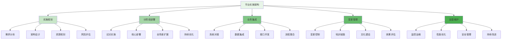
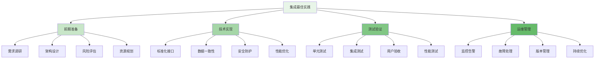

平台实施与业务集成是企业级智能风控平台建设的关键环节，直接决定了平台能否成功落地并发挥预期价值。通过科学的分阶段实施策略、有效的业务系统集成方案、完善的变更管理与培训体系，以及严格的合规性保障，企业能够确保风控平台顺利部署并持续创造业务价值。

## 平台实施整体架构

平台实施需要建立清晰的架构体系，涵盖从规划到运维的全生命周期管理。

### 实施架构层次



### 实施核心原则

```yaml
# 平台实施核心原则
implementation_principles:
  phased_approach:
    name: "分阶段实施"
    description: "采用渐进式实施策略，降低项目风险"
    key_practices:
      - "先核心后扩展"
      - "先规则后模型"
      - "先试点后推广"
      - "持续迭代优化"
  
  business_alignment:
    name: "业务对齐"
    description: "确保平台实施与业务目标保持一致"
    key_practices:
      - "深入理解业务需求"
      - "量化业务价值"
      - "建立KPI体系"
      - "定期评估效果"
  
  technical_excellence:
    name: "技术卓越"
    description: "追求技术实现的高质量和高可靠性"
    key_practices:
      - "架构设计先行"
      - "代码质量保障"
      - "性能优化持续"
      - "安全防护到位"
  
  user_centric:
    name: "用户中心"
    description: "以用户体验为中心设计和实施平台"
    key_practices:
      - "用户需求调研"
      - "界面友好设计"
      - "操作流程简化"
      - "培训支持到位"
```

## 分阶段实施策略

分阶段实施是确保平台成功落地的关键策略，需要根据业务价值和复杂度合理规划实施路径。

### 实施阶段规划

```python
class PhasedImplementationStrategy:
    def __init__(self):
        self.phase_planner = PhasePlanner()
        self.risk_manager = RiskManager()
        self.resource_allocator = ResourceAllocator()
        self.progress_tracker = ProgressTracker()
    
    def plan_implementation(self, business_context):
        """规划分阶段实施"""
        # 1. 业务场景分析
        business_analysis = self.analyze_business_scenarios(business_context)
        
        # 2. 实施优先级排序
        priority_scenarios = self.prioritize_scenarios(business_analysis)
        
        # 3. 分阶段规划
        implementation_phases = self.design_implementation_phases(priority_scenarios)
        
        # 4. 资源配置
        resource_plan = self.allocate_resources(implementation_phases)
        
        # 5. 风险评估
        risk_assessment = self.assess_implementation_risks(implementation_phases)
        
        # 6. 时间规划
        timeline = self.create_implementation_timeline(implementation_phases)
        
        return ImplementationPlan(
            phases=implementation_phases,
            resources=resource_plan,
            risks=risk_assessment,
            timeline=timeline,
            business_alignment=business_analysis
        )
    
    def analyze_business_scenarios(self, context):
        """分析业务场景"""
        scenarios = []
        
        # 1. 核心交易场景
        core_scenarios = self.identify_core_scenarios(context.business_domains)
        for scenario in core_scenarios:
            scenarios.append(ScenarioAnalysis(
                name=scenario.name,
                domain=scenario.domain,
                risk_level="high",
                business_value="high",
                implementation_complexity="medium",
                priority="high"
            ))
        
        # 2. 营销活动场景
        marketing_scenarios = self.identify_marketing_scenarios(context.business_domains)
        for scenario in marketing_scenarios:
            scenarios.append(ScenarioAnalysis(
                name=scenario.name,
                domain=scenario.domain,
                risk_level="medium",
                business_value="high",
                implementation_complexity="low",
                priority="medium"
            ))
        
        # 3. 内容安全场景
        content_scenarios = self.identify_content_scenarios(context.business_domains)
        for scenario in content_scenarios:
            scenarios.append(ScenarioAnalysis(
                name=scenario.name,
                domain=scenario.domain,
                risk_level="medium",
                business_value="medium",
                implementation_complexity="high",
                priority="medium"
            ))
        
        return scenarios
    
    def design_implementation_phases(self, scenarios):
        """设计实施阶段"""
        phases = []
        
        # 第一阶段：核心交易风控
        phase1_scenarios = [s for s in scenarios if s.domain == "transaction" and s.priority == "high"]
        phases.append(ImplementationPhase(
            id="phase-1",
            name="核心交易风控实施",
            description="实施核心交易场景的风险控制能力",
            scenarios=phase1_scenarios,
            components=["data_collection", "rule_engine", "decision_engine"],
            deliverables=["transaction_risk_control", "real_time_monitoring"],
            duration="3 months",
            success_criteria=["99.9% availability", "sub-100ms response time", "95% detection rate"]
        ))
        
        # 第二阶段：营销反作弊
        phase2_scenarios = [s for s in scenarios if s.domain == "marketing"]
        phases.append(ImplementationPhase(
            id="phase-2",
            name="营销反作弊实施",
            description="实施营销活动场景的反作弊能力",
            scenarios=phase2_scenarios,
            components=["feature_platform", "model_service", "list_service"],
            deliverables=["promotion_protection", "campaign_analytics"],
            duration="2 months",
            success_criteria=["90% fraud detection", "10% false positive rate", "real-time response"]
        ))
        
        # 第三阶段：内容安全
        phase3_scenarios = [s for s in scenarios if s.domain == "content"]
        phases.append(ImplementationPhase(
            id="phase-3",
            name="内容安全实施",
            description="实施内容安全场景的风险控制能力",
            scenarios=phase3_scenarios,
            components=["graph_computing", "behavior_analysis", "content_moderation"],
            deliverables=["content_filtering", "community_protection"],
            duration="4 months",
            success_criteria=["95% inappropriate_content detection", "low false positive", "scalable architecture"]
        ))
        
        # 第四阶段：全场景优化
        phase4_scenarios = scenarios
        phases.append(ImplementationPhase(
            id="phase-4",
            name="全场景优化与扩展",
            description="优化全场景风控能力并扩展新功能",
            scenarios=phase4_scenarios,
            components=["ai_models", "experiment_platform", "knowledge_base"],
            deliverables=["intelligent_risk_control", "continuous_optimization"],
            duration="3 months",
            success_criteria=["end-to-end optimization", "automated decision making", "predictive analytics"]
        ))
        
        return phases
    
    def execute_phase(self, phase, environment):
        """执行实施阶段"""
        # 1. 阶段准备
        preparation = self.prepare_phase(phase, environment)
        
        # 2. 组件部署
        deployment = self.deploy_components(phase.components, environment)
        
        # 3. 功能测试
        testing = self.test_phase_functionality(phase, deployment)
        
        # 4. 用户验收
        acceptance = self.conduct_user_acceptance(phase, testing)
        
        # 5. 生产上线
        production = self.deploy_to_production(phase, acceptance)
        
        # 6. 效果评估
        evaluation = self.evaluate_phase_results(phase, production)
        
        return PhaseExecutionResult(
            phase=phase,
            preparation=preparation,
            deployment=deployment,
            testing=testing,
            acceptance=acceptance,
            production=production,
            evaluation=evaluation,
            overall_success=evaluation.meets_success_criteria
        )
```

### 实施风险管理

```go
type ImplementationRiskManager struct {
    RiskAssessor    *RiskAssessor
    MitigationPlanner *MitigationPlanner
    MonitoringSystem *RiskMonitoringSystem
    ResponseTeam     *IncidentResponseTeam
}

type ImplementationRisk struct {
    ID              string
    Phase           string
    Category        string  // technical, business, schedule, resource
    Description     string
    Probability     float64
    Impact          float64
    RiskScore       float64
    MitigationPlan  *MitigationPlan
    Status          string  // identified, mitigated, realized, closed
}

type MitigationPlan struct {
    Strategies      []MitigationStrategy
    Resources       []ResourceRequirement
    Timeline        time.Duration
    ResponsibleTeam string
    SuccessCriteria []string
}

func (irm *ImplementationRiskManager) AssessPhaseRisks(phase *ImplementationPhase) []*ImplementationRisk {
    risks := make([]*ImplementationRisk, 0)
    
    // 1. 技术风险评估
    technicalRisks := irm.assessTechnicalRisks(phase)
    risks = append(risks, technicalRisks...)
    
    // 2. 业务风险评估
    businessRisks := irm.assessBusinessRisks(phase)
    risks = append(risks, businessRisks...)
    
    // 3. 进度风险评估
    scheduleRisks := irm.assessScheduleRisks(phase)
    risks = append(risks, scheduleRisks...)
    
    // 4. 资源风险评估
    resourceRisks := irm.assessResourceRisks(phase)
    risks = append(risks, resourceRisks...)
    
    // 5. 计算风险评分
    for _, risk := range risks {
        risk.RiskScore = risk.Probability * risk.Impact
    }
    
    // 6. 制定缓解计划
    for _, risk := range risks {
        risk.MitigationPlan = irm.MitigationPlanner.CreateMitigationPlan(risk)
    }
    
    return risks
}

func (irm *ImplementationRiskManager) MonitorImplementationRisks(phaseID string) {
    // 1. 启动风险监控
    monitor := irm.MonitoringSystem.StartMonitoring(phaseID)
    defer monitor.Stop()
    
    // 2. 定期风险评估
    ticker := time.NewTicker(24 * time.Hour)  // 每天评估一次
    defer ticker.Stop()
    
    for {
        select {
        case <-ticker.C:
            // 重新评估风险
            currentRisks := irm.RiskAssessor.ReassessRisks(phaseID)
            
            // 检查新风险
            newRisks := irm.identifyNewRisks(currentRisks)
            if len(newRisks) > 0 {
                // 通知相关人员
                irm.notifyRiskStakeholders(newRisks)
            }
            
            // 检查风险状态变化
            changedRisks := irm.identifyRiskChanges(currentRisks)
            if len(changedRisks) > 0 {
                // 更新缓解计划
                irm.updateMitigationPlans(changedRisks)
            }
            
        case incident := <-monitor.IncidentChannel:
            // 处理风险事件
            irm.handleRiskIncident(incident)
        }
    }
}

func (irm *ImplementationRiskManager) assessTechnicalRisks(phase *ImplementationPhase) []*ImplementationRisk {
    risks := make([]*ImplementationRisk, 0)
    
    // 1. 架构风险
    if len(phase.components) > 5 {
        risks = append(risks, &ImplementationRisk{
            ID:          fmt.Sprintf("risk-%s-arch-1", phase.id),
            Phase:       phase.id,
            Category:    "technical",
            Description: "组件过多可能导致架构复杂性增加",
            Probability: 0.6,
            Impact:      0.7,
        })
    }
    
    // 2. 性能风险
    for _, component := range phase.components {
        if component == "graph_computing" || component == "real_time_analytics" {
            risks = append(risks, &ImplementationRisk{
                ID:          fmt.Sprintf("risk-%s-perf-1", phase.id),
                Phase:       phase.id,
                Category:    "technical",
                Description: fmt.Sprintf("%s组件可能存在性能瓶颈", component),
                Probability: 0.5,
                Impact:      0.8,
            })
        }
    }
    
    // 3. 集成风险
    if len(phase.components) > 3 {
        risks = append(risks, &ImplementationRisk{
            ID:          fmt.Sprintf("risk-%s-int-1", phase.id),
            Phase:       phase.id,
            Category:    "technical",
            Description: "多组件集成可能遇到兼容性问题",
            Probability: 0.4,
            Impact:      0.6,
        })
    }
    
    return risks
}
```

## 业务系统集成方案

业务系统集成是平台实施的关键环节，需要确保风控平台与现有业务系统的无缝对接。

### 集成架构设计

```typescript
interface BusinessSystemIntegration {
    // 系统对接
    integrateWithBusinessSystems(config: IntegrationConfig): Promise<IntegrationResult>;
    
    // 数据集成
    integrateDataSources(sources: DataSource[]): Promise<DataIntegrationResult>;
    
    // 接口开发
    developIntegrationAPIs(interfaces: APIInterface[]): Promise<APIDevelopmentResult>;
    
    // 流程整合
    integrateBusinessProcesses(processes: BusinessProcess[]): Promise<ProcessIntegrationResult>;
}

class RiskControlSystemIntegrator implements BusinessSystemIntegration {
    private apiGateway: APIGateway;
    private dataPipeline: DataIntegrationPipeline;
    private processOrchestrator: ProcessOrchestrator;
    private monitoringSystem: IntegrationMonitoring;
    
    async integrateWithBusinessSystems(config: IntegrationConfig): Promise<IntegrationResult> {
        // 1. 系统对接分析
        const systemAnalysis = await this.analyzeSystemIntegration(config.systems);
        
        // 2. 集成方案设计
        const integrationPlan = await this.designIntegrationPlan(systemAnalysis);
        
        // 3. 接口开发
        const apiDevelopment = await this.developIntegrationAPIs(integrationPlan.interfaces);
        
        // 4. 数据管道建设
        const dataIntegration = await this.integrateDataSources(integrationPlan.dataSources);
        
        // 5. 流程整合
        const processIntegration = await this.integrateBusinessProcesses(integrationPlan.processes);
        
        // 6. 集成测试
        const integrationTesting = await this.testSystemIntegration(
            apiDevelopment,
            dataIntegration,
            processIntegration
        );
        
        // 7. 生产部署
        const productionDeployment = await this.deployToProduction(integrationTesting);
        
        return {
            config: config,
            analysis: systemAnalysis,
            plan: integrationPlan,
            apiDevelopment: apiDevelopment,
            dataIntegration: dataIntegration,
            processIntegration: processIntegration,
            testing: integrationTesting,
            deployment: productionDeployment,
            success: productionDeployment.status === 'completed'
        };
    }
    
    async integrateDataSources(sources: DataSource[]): Promise<DataIntegrationResult> {
        const integrationResults = [];
        
        for (const source of sources) {
            // 1. 数据源连接
            const connection = await this.establishDataSourceConnection(source);
            
            // 2. 数据格式转换
            const transformer = await this.createDataTransformer(source);
            
            // 3. 数据管道配置
            const pipeline = await this.configureDataPipeline(source, connection, transformer);
            
            // 4. 数据质量监控
            const qualityMonitor = await this.setupDataQualityMonitoring(source, pipeline);
            
            // 5. 性能优化
            const optimization = await this.optimizeDataIntegration(source, pipeline);
            
            integrationResults.push({
                source: source,
                connection: connection,
                transformer: transformer,
                pipeline: pipeline,
                qualityMonitor: qualityMonitor,
                optimization: optimization
            });
        }
        
        return {
            sources: sources,
            results: integrationResults,
            overallStatus: this.evaluateDataIntegrationStatus(integrationResults)
        };
    }
    
    private async analyzeSystemIntegration(systems: BusinessSystem[]): Promise<SystemIntegrationAnalysis> {
        const analysis = {
            compatibility: [],
            dependencies: [],
            integrationPoints: [],
            riskAssessment: []
        };
        
        // 1. 兼容性分析
        for (const system of systems) {
            const compatibility = await this.assessSystemCompatibility(system);
            analysis.compatibility.push({
                system: system,
                compatibility: compatibility,
                recommendations: this.generateCompatibilityRecommendations(compatibility)
            });
        }
        
        // 2. 依赖关系分析
        analysis.dependencies = this.analyzeSystemDependencies(systems);
        
        // 3. 集成点识别
        analysis.integrationPoints = this.identifyIntegrationPoints(systems);
        
        // 4. 风险评估
        analysis.riskAssessment = this.assessIntegrationRisks(systems, analysis.integrationPoints);
        
        return analysis;
    }
    
    private async designIntegrationPlan(analysis: SystemIntegrationAnalysis): Promise<IntegrationPlan> {
        // 1. 接口设计
        const interfaces = this.designAPIInterfaces(analysis.integrationPoints);
        
        // 2. 数据源规划
        const dataSources = this.planDataSources(analysis.integrationPoints);
        
        // 3. 流程映射
        const processes = this.mapBusinessProcesses(analysis.integrationPoints);
        
        // 4. 安全设计
        const security = this.designIntegrationSecurity(analysis.riskAssessment);
        
        // 5. 监控设计
        const monitoring = this.designIntegrationMonitoring(interfaces, dataSources, processes);
        
        return {
            interfaces: interfaces,
            dataSources: dataSources,
            processes: processes,
            security: security,
            monitoring: monitoring,
            timeline: this.estimateIntegrationTimeline(interfaces, dataSources, processes)
        };
    }
}
```

### 轻量级集成方案

```javascript
class LightweightIntegrationSolution {
    constructor(config) {
        this.config = config;
        this.sdkManager = new SDKManager();
        this.apiGateway = new APIGateway();
        this.eventBus = new EventBus();
        this.connectorFactory = new ConnectorFactory();
    }
    
    /**
     * 提供轻量级SDK集成方案
     * @param {Object} integrationRequirements - 集成需求
     * @returns {Promise<Object>} 集成方案
     */
    async provideLightweightSDK(integrationRequirements) {
        try {
            // 1. 分析集成需求
            const requirementsAnalysis = this.analyzeIntegrationRequirements(integrationRequirements);
            
            // 2. 选择合适的SDK
            const selectedSDK = this.selectAppropriateSDK(requirementsAnalysis);
            
            // 3. 生成SDK配置
            const sdkConfig = this.generateSDKConfiguration(selectedSDK, requirementsAnalysis);
            
            // 4. 创建集成示例
            const integrationExamples = this.createIntegrationExamples(sdkConfig);
            
            // 5. 生成文档
            const documentation = await this.generateIntegrationDocumentation(sdkConfig, integrationExamples);
            
            return {
                sdk: selectedSDK,
                config: sdkConfig,
                examples: integrationExamples,
                documentation: documentation,
                estimatedEffort: this.estimateIntegrationEffort(requirementsAnalysis)
            };
        } catch (error) {
            console.error('Failed to provide lightweight SDK:', error);
            return { success: false, error: error.message };
        }
    }
    
    /**
     * 提供API调用集成方案
     * @param {Object} apiRequirements - API集成需求
     * @returns {Promise<Object>} API集成方案
     */
    async provideAPIIntegration(apiRequirements) {
        // 1. API网关配置
        const gatewayConfig = await this.configureAPIGateway(apiRequirements);
        
        // 2. 认证授权设置
        const authConfig = await this.setupAuthenticationAuthorization(apiRequirements);
        
        // 3. 流量控制配置
        const rateLimiting = await this.configureRateLimiting(apiRequirements);
        
        // 4. 监控告警设置
        const monitoring = await this.setupAPIMonitoring(apiRequirements);
        
        // 5. 生成API文档
        const apiDocumentation = await this.generateAPIDocumentation(apiRequirements);
        
        // 6. 提供调用示例
        const apiExamples = this.createAPIUsageExamples(apiRequirements);
        
        return {
            gateway: gatewayConfig,
            auth: authConfig,
            rateLimiting: rateLimiting,
            monitoring: monitoring,
            documentation: apiDocumentation,
            examples: apiExamples,
            endpoints: this.generateAPIEndpoints(apiRequirements)
        };
    }
    
    /**
     * 分析集成需求
     * @param {Object} requirements - 集成需求
     * @returns {Object} 需求分析结果
     */
    analyzeIntegrationRequirements(requirements) {
        const analysis = {
            integrationType: requirements.type,
            dataVolume: requirements.dataVolume,
            realTimeRequirement: requirements.realTime,
            securityLevel: requirements.securityLevel,
            performanceRequirements: requirements.performance,
            existingSystems: requirements.existingSystems || []
        };
        
        // 1. 复杂度评估
        analysis.complexity = this.assessIntegrationComplexity(analysis);
        
        // 2. 技术栈匹配
        analysis.techStackMatch = this.evaluateTechStackCompatibility(analysis);
        
        // 3. 资源需求评估
        analysis.resourceRequirements = this.estimateResourceRequirements(analysis);
        
        // 4. 风险评估
        analysis.risks = this.assessIntegrationRisks(analysis);
        
        return analysis;
    }
    
    /**
     * 选择合适的SDK
     * @param {Object} analysis - 需求分析
     * @returns {Object} 选中的SDK
     */
    selectAppropriateSDK(analysis) {
        const supportedSDKs = [
            {
                name: 'Java SDK',
                languages: ['Java', 'Kotlin'],
                features: ['sync', 'async', 'batch'],
                performance: 'high',
                complexity: 'medium'
            },
            {
                name: 'Python SDK',
                languages: ['Python'],
                features: ['sync', 'async'],
                performance: 'medium',
                complexity: 'low'
            },
            {
                name: 'Node.js SDK',
                languages: ['JavaScript', 'TypeScript'],
                features: ['async', 'streaming'],
                performance: 'high',
                complexity: 'low'
            },
            {
                name: 'Go SDK',
                languages: ['Go'],
                features: ['sync', 'async', 'concurrent'],
                performance: 'very_high',
                complexity: 'medium'
            }
        ];
        
        // 根据需求分析选择最合适的SDK
        let bestSDK = supportedSDKs[0];
        let bestScore = 0;
        
        for (const sdk of supportedSDKs) {
            const score = this.calculateSDKScore(sdk, analysis);
            if (score > bestScore) {
                bestScore = score;
                bestSDK = sdk;
            }
        }
        
        return bestSDK;
    }
    
    /**
     * 生成SDK配置
     * @param {Object} sdk - SDK信息
     * @param {Object} analysis - 需求分析
     * @returns {Object} SDK配置
     */
    generateSDKConfiguration(sdk, analysis) {
        return {
            sdkName: sdk.name,
            version: this.getLatestStableVersion(sdk.name),
            installation: this.generateInstallationInstructions(sdk),
            initialization: this.generateInitializationCode(sdk, analysis),
            configuration: {
                endpoint: this.config.apiEndpoint,
                timeout: analysis.performanceRequirements.timeout || 5000,
                retries: analysis.performanceRequirements.retries || 3,
                security: {
                    authMethod: analysis.securityLevel === 'high' ? 'oauth2' : 'api_key',
                    encryption: analysis.securityLevel === 'high'
                }
            },
            features: this.selectSDKFeatures(sdk, analysis)
        };
    }
}
```

## 最佳实践与经验总结

在平台实施与业务集成过程中，需要遵循一系列最佳实践来确保项目的成功。

### 实施最佳实践

1. **渐进式实施**：采用分阶段、迭代式的实施方法，降低项目风险
2. **业务对齐**：确保技术实施与业务目标保持高度一致
3. **用户参与**：让最终用户深度参与实施过程，提高接受度
4. **风险管控**：建立完善的风险识别和应对机制
5. **持续改进**：建立反馈机制，持续优化实施效果

### 集成最佳实践



### 运营管理建议

1. **建立专职团队**：组建专业的实施和集成团队负责项目推进
2. **制度化管理**：建立标准化的实施流程和管理制度
3. **工具平台建设**：建设完善的实施和集成工具平台
4. **知识管理**：建立实施经验和教训的知识管理体系
5. **文化建设**：培养协作共赢的团队文化

通过科学的分阶段实施策略、完善的业务系统集成方案、有效的变更管理与培训体系，以及严格的合规性保障，企业能够确保风控平台顺利部署并持续创造业务价值。这种系统化的实施方法不仅能够降低项目风险，还能够提高用户接受度，为平台的长期成功奠定坚实基础。