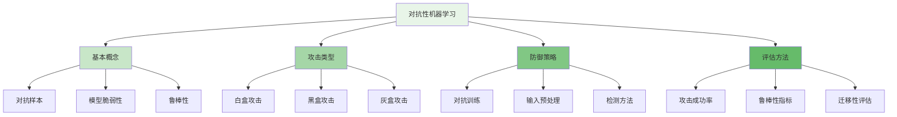
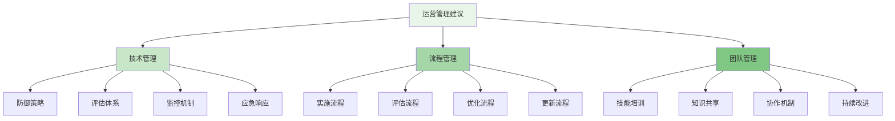

对抗性机器学习是提升企业级智能风控平台模型鲁棒性和安全防护能力的关键技术。通过模拟攻击者的行为和策略，对抗性机器学习能够增强模型对各种攻击手段的防御能力，包括黑盒攻击和白盒攻击，从而构建更加安全可靠的风控防护体系。

## 对抗性机器学习基础

对抗性机器学习是机器学习安全领域的重要分支，专注于研究模型在面对恶意攻击时的脆弱性和防御方法。

### 对抗性机器学习概念



### 对抗样本生成原理

```yaml
# 对抗样本生成原理
adversarial_sample_generation:
  definition:
    name: "对抗样本"
    description: "通过对原始输入添加微小扰动生成的样本，能够使模型产生错误预测"
    mathematical_representation: "x' = x + δ, where ||δ|| ≤ ε"
    key_characteristics:
      - "扰动微小：人眼难以察觉"
      - "误导性强：能使模型产生错误分类"
      - "针对性：针对特定模型生成"
  
  generation_methods:
    gradient_based_attacks:
      name: "基于梯度的攻击"
      description: "利用模型梯度信息生成对抗样本"
      methods:
        - fgsm:
            name: "FGSM (Fast Gradient Sign Method)"
            description: "快速梯度符号法，通过梯度符号生成扰动"
            formula: "δ = ε * sign(∇_x J(θ, x, y))"
            advantages:
              - "计算简单快速"
              - "实现容易"
              - "效果明显"
            disadvantages:
              - "扰动较大"
              - "迁移性一般"
              - "容易防御"
        
        - pgd:
            name: "PGD (Projected Gradient Descent)"
            description: "投影梯度下降法，FGSM的迭代版本"
            formula: "x_{t+1} = Π_{x+εS}(x_t + α * sign(∇_x J(θ, x_t, y)))"
            advantages:
              - "攻击效果强"
              - "适应性好"
              - "应用广泛"
            disadvantages:
              - "计算复杂"
              - "耗时较长"
              - "需要多次迭代"
        
        - cw:
            name: "CW (Carlini-Wagner)"
            description: "Carlini和Wagner提出的攻击方法，攻击效果强"
            formula: "minimize ||δ||_2^2 + c * f(x + δ)"
            advantages:
              - "攻击效果最强"
              - "难以防御"
              - "精确控制"
            disadvantages:
              - "计算复杂度高"
              - "实现难度大"
              - "耗时很长"
    
    score_based_attacks:
      name: "基于分数的攻击"
      description: "通过查询模型输出分数生成对抗样本"
      methods:
        - boundary_attack:
            name: "边界攻击"
            description: "通过在决策边界附近搜索生成对抗样本"
            process:
              - "初始化对抗样本"
              - "逐步优化样本"
              - "保持对抗性"
            advantages:
              - "无需梯度信息"
              - "黑盒场景适用"
              - "效果较好"
            disadvantages:
              - "收敛速度慢"
              - "计算量大"
              - "参数敏感"
        
        - zo_adam:
            name: "零阶优化方法"
            description: "使用零阶优化技术生成对抗样本"
            approach:
              - "估计梯度方向"
              - "优化扰动"
              - "验证对抗性"
            advantages:
              - "适用于黑盒"
              - "理论基础强"
              - "可并行化"
            disadvantages:
              - "查询次数多"
              - "收敛较慢"
              - "实现复杂"
    
    evolution_based_attacks:
      name: "基于进化的攻击"
      description: "使用进化算法生成对抗样本"
      methods:
        - genetic_algorithm:
            name: "遗传算法"
            description: "模拟生物进化过程生成对抗样本"
            steps:
              - "种群初始化"
              - "适应度评估"
              - "选择操作"
              - "交叉变异"
              - "迭代优化"
            advantages:
              - "全局搜索能力强"
              - "不依赖梯度"
              - "并行处理"
            disadvantages:
              - "收敛速度慢"
              - "参数调优难"
              - "计算开销大"
```

## 攻击类型与特点

不同类型的攻击具有不同的特点和适用场景，需要针对性地设计防御策略。

### 白盒攻击

白盒攻击是指攻击者完全了解目标模型的结构、参数和训练数据的攻击方式。

```python
class WhiteBoxAttackFramework:
    def __init__(self, model, config):
        self.model = model
        self.config = config
        self.attack_methods = {
            'fgsm': self.fgsm_attack,
            'pgd': self.pgd_attack,
            'cw': self.cw_attack,
            'deepfool': self.deepfool_attack
        }
    
    def generate_adversarial_sample(self, x, y, method='pgd'):
        """生成对抗样本"""
        if method not in self.attack_methods:
            raise ValueError(f"Unsupported attack method: {method}")
        
        attack_func = self.attack_methods[method]
        return attack_func(x, y)
    
    def fgsm_attack(self, x, y):
        """FGSM攻击实现"""
        # 1. 计算损失函数相对于输入的梯度
        x_tensor = torch.tensor(x, requires_grad=True, dtype=torch.float)
        y_tensor = torch.tensor(y, dtype=torch.long)
        
        # 前向传播
        output = self.model(x_tensor)
        loss = torch.nn.functional.cross_entropy(output, y_tensor)
        
        # 反向传播计算梯度
        loss.backward()
        gradient = x_tensor.grad.data
        
        # 2. 生成扰动
        perturbation = self.config.epsilon * torch.sign(gradient)
        
        # 3. 生成对抗样本
        x_adv = x_tensor + perturbation
        x_adv = torch.clamp(x_adv, 0, 1)  # 确保输入在有效范围内
        
        return x_adv.detach().numpy()
    
    def pgd_attack(self, x, y):
        """PGD攻击实现"""
        # 1. 初始化对抗样本
        x_tensor = torch.tensor(x, dtype=torch.float)
        x_adv = x_tensor + torch.randn_like(x_tensor) * 0.01
        x_adv = torch.clamp(x_adv, x_tensor - self.config.epsilon, x_tensor + self.config.epsilon)
        x_adv = torch.clamp(x_adv, 0, 1)
        x_adv.requires_grad = True
        
        # 2. 迭代优化
        for _ in range(self.config.pgd_steps):
            # 计算梯度
            output = self.model(x_adv)
            loss = torch.nn.functional.cross_entropy(output, torch.tensor(y, dtype=torch.long))
            loss.backward()
            
            # 更新对抗样本
            with torch.no_grad():
                x_adv += self.config.alpha * torch.sign(x_adv.grad)
                x_adv = torch.max(torch.min(x_adv, x_tensor + self.config.epsilon), x_tensor - self.config.epsilon)
                x_adv = torch.clamp(x_adv, 0, 1)
                x_adv.grad.zero_()
        
        return x_adv.detach().numpy()
    
    def cw_attack(self, x, y):
        """CW攻击实现"""
        # 1. 初始化优化变量
        x_tensor = torch.tensor(x, dtype=torch.float)
        w = torch.arctanh(2 * x_tensor - 1)  # 变量替换
        w.requires_grad = True
        
        # 2. 优化过程
        optimizer = torch.optim.Adam([w], lr=self.config.cw_lr)
        
        for _ in range(self.config.cw_steps):
            optimizer.zero_grad()
            
            # 变量还原
            x_adv = 0.5 * (torch.tanh(w) + 1)
            
            # 计算损失
            output = self.model(x_adv)
            loss_adv = self.cw_loss_function(output, y, x_tensor, x_adv)
            
            # 反向传播
            loss_adv.backward()
            optimizer.step()
        
        # 3. 生成最终对抗样本
        x_adv_final = 0.5 * (torch.tanh(w) + 1)
        return x_adv_final.detach().numpy()
    
    def cw_loss_function(self, output, y_true, x_orig, x_adv):
        """CW损失函数"""
        # 分类损失
        y_true_tensor = torch.tensor(y_true, dtype=torch.long)
        classification_loss = torch.nn.functional.cross_entropy(output, y_true_tensor)
        
        # 距离损失
        distance_loss = torch.norm(x_adv - x_orig, p=2)
        
        # 综合损失
        return distance_loss + self.config.cw_c * classification_loss

class RiskControlWhiteBoxAttacker:
    def __init__(self, config):
        self.config = config
        self.attack_framework = WhiteBoxAttackFramework(None, config)
    
    def attack_risk_model(self, model, legitimate_samples, attack_config):
        """攻击风控模型"""
        # 1. 准备攻击数据
        attack_samples = self.prepare_attack_samples(legitimate_samples, attack_config)
        
        # 2. 执行攻击
        adversarial_samples = []
        for sample in attack_samples:
            adv_sample = self.attack_framework.generate_adversarial_sample(
                sample.data,
                sample.label,
                method=attack_config.attack_method
            )
            adversarial_samples.append(adv_sample)
        
        # 3. 评估攻击效果
        attack_success_rate = self.evaluate_attack_success(
            model,
            legitimate_samples,
            adversarial_samples
        )
        
        # 4. 分析模型脆弱性
        vulnerability_analysis = self.analyze_model_vulnerability(
            model,
            legitimate_samples,
            adversarial_samples
        )
        
        return AttackResult(
            adversarial_samples=adversarial_samples,
            success_rate=attack_success_rate,
            vulnerability_analysis=vulnerability_analysis,
            attack_method=attack_config.attack_method
        )
    
    def prepare_attack_samples(self, legitimate_samples, attack_config):
        """准备攻击样本"""
        # 1. 样本筛选
        selected_samples = self.select_attack_targets(legitimate_samples, attack_config)
        
        # 2. 样本预处理
        processed_samples = self.preprocess_samples(selected_samples)
        
        # 3. 标签构造
        attack_samples = self.construct_attack_labels(processed_samples, attack_config)
        
        return attack_samples
```

### 黑盒攻击

黑盒攻击是指攻击者不了解目标模型内部结构和参数的攻击方式，只能通过输入输出接口进行交互。

```go
type BlackBoxAttackFramework struct {
    QueryLimiter     *QueryLimiter
    SurrogateModel   *SurrogateModel
    Transferability  *TransferabilityAnalyzer
    Optimization     *OptimizationEngine
}

type BlackBoxAttackResult struct {
    AdversarialSamples []AdversarialSample `json:"adversarial_samples"`
    QueryCount         int                 `json:"query_count"`
    SuccessRate        float64             `json:"success_rate"`
    Transferability    float64             `json:"transferability"`
}

func (baf *BlackBoxAttackFramework) ExecuteBlackBoxAttack(
    targetAPI ModelAPI,
    samples []AttackSample,
    config BlackBoxConfig,
) (*BlackBoxAttackResult, error) {
    // 1. 初始化攻击环境
    err := baf.initializeAttackEnvironment(config)
    if err != nil {
        return nil, fmt.Errorf("failed to initialize attack environment: %v", err)
    }
    
    // 2. 生成对抗样本
    adversarialSamples := make([]AdversarialSample, 0)
    totalQueries := 0
    
    for _, sample := range samples {
        // 检查查询限制
        if baf.QueryLimiter.IsLimitExceeded() {
            break
        }
        
        // 执行黑盒攻击
        advSample, queryCount, err := baf.generateAdversarialSample(targetAPI, sample, config)
        if err != nil {
            continue
        }
        
        adversarialSamples = append(adversarialSamples, advSample)
        totalQueries += queryCount
    }
    
    // 3. 评估攻击效果
    successRate := baf.evaluateAttackSuccess(targetAPI, samples, adversarialSamples)
    
    // 4. 分析迁移性
    transferability := baf.Transferability.AnalyzeTransferability(
        baf.SurrogateModel,
        targetAPI,
        adversarialSamples,
    )
    
    return &BlackBoxAttackResult{
        AdversarialSamples: adversarialSamples,
        QueryCount:         totalQueries,
        SuccessRate:        successRate,
        Transferability:    transferability,
    }, nil
}

func (baf *BlackBoxAttackFramework) generateAdversarialSample(
    targetAPI ModelAPI,
    sample AttackSample,
    config BlackBoxConfig,
) (AdversarialSample, int, error) {
    queryCount := 0
    
    // 1. 基于查询的攻击
    if config.AttackMethod == "query_based" {
        return baf.queryBasedAttack(targetAPI, sample, config, &queryCount)
    }
    
    // 2. 基于迁移的攻击
    if config.AttackMethod == "transfer_based" {
        return baf.transferBasedAttack(targetAPI, sample, config)
    }
    
    // 3. 基于估

计的攻击
    if config.AttackMethod == "gradient_estimation" {
        return baf.gradientEstimationAttack(targetAPI, sample, config, &queryCount)
    }
    
    return AdversarialSample{}, 0, fmt.Errorf("unsupported attack method: %s", config.AttackMethod)
}

func (baf *BlackBoxAttackFramework) queryBasedAttack(
    targetAPI ModelAPI,
    sample AttackSample,
    config BlackBoxConfig,
    queryCount *int,
) (AdversarialSample, int, error) {
    // 1. 初始化扰动
    perturbation := baf.initializePerturbation(sample.Data, config)
    
    // 2. 迭代优化扰动
    for i := 0; i < config.MaxIterations; i++ {
        // 查询目标模型
        prediction, err := targetAPI.Predict(sample.Data + perturbation)
        if err != nil {
            return AdversarialSample{}, *queryCount, err
        }
        (*queryCount)++
        
        // 检查是否成功生成对抗样本
        if baf.isAdversarialSample(prediction, sample.Label) {
            return AdversarialSample{
                OriginalData: sample.Data,
                PerturbedData: sample.Data + perturbation,
                OriginalLabel: sample.Label,
                AdversarialLabel: prediction.Label,
            }, *queryCount, nil
        }
        
        // 更新扰动
        perturbation = baf.updatePerturbation(perturbation, prediction, sample, config)
        
        // 检查查询限制
        if baf.QueryLimiter.IsLimitExceeded() {
            break
        }
    }
    
    return AdversarialSample{}, *queryCount, fmt.Errorf("failed to generate adversarial sample")
}

func (baf *BlackBoxAttackFramework) transferBasedAttack(
    targetAPI ModelAPI,
    sample AttackSample,
    config BlackBoxConfig,
) (AdversarialSample, int, error) {
    // 1. 使用代理模型生成对抗样本
    surrogateAdvSample, err := baf.SurrogateModel.GenerateAdversarialSample(sample, config)
    if err != nil {
        return AdversarialSample{}, 0, err
    }
    
    // 2. 测试在目标模型上的效果
    targetPrediction, err := targetAPI.Predict(surrogateAdvSample.PerturbedData)
    if err != nil {
        return AdversarialSample{}, 1, err
    }
    
    // 3. 检查迁移性
    if targetPrediction.Label != sample.Label {
        return AdversarialSample{
            OriginalData: sample.Data,
            PerturbedData: surrogateAdvSample.PerturbedData,
            OriginalLabel: sample.Label,
            AdversarialLabel: targetPrediction.Label,
        }, 1, nil
    }
    
    return AdversarialSample{}, 1, fmt.Errorf("transfer attack failed")
}

type RiskControlBlackBoxAttacker struct {
    AttackFramework *BlackBoxAttackFramework
    ModelProfiler   *ModelProfiler
}

func (rcbba *RiskControlBlackBoxAttacker) AttackRiskControlAPI(
    apiEndpoint string,
    testSamples []RiskSample,
    attackConfig BlackBoxAttackConfig,
) (*RiskControlAttackResult, error) {
    // 1. 初始化目标API客户端
    targetAPI := NewModelAPIClient(apiEndpoint)
    
    // 2. 分析API特性
    apiProfile := rcbba.ModelProfiler.ProfileAPI(targetAPI, testSamples)
    
    // 3. 配置攻击参数
    attackParams := rcbba.configureAttackParameters(apiProfile, attackConfig)
    
    // 4. 执行黑盒攻击
    attackResult, err := rcbba.AttackFramework.ExecuteBlackBoxAttack(
        targetAPI,
        convertToAttackSamples(testSamples),
        attackParams,
    )
    if err != nil {
        return nil, fmt.Errorf("black box attack failed: %v", err)
    }
    
    // 5. 分析风控模型脆弱性
    vulnerabilityAnalysis := rcbba.analyzeRiskModelVulnerability(
        targetAPI,
        testSamples,
        attackResult.AdversarialSamples,
        apiProfile,
    )
    
    // 6. 生成攻击报告
    attackReport := &RiskControlAttackResult{
        AttackResult: attackResult,
        VulnerabilityAnalysis: vulnerabilityAnalysis,
        APIProfile: apiProfile,
        Recommendations: rcbba.generateAttackRecommendations(
            vulnerabilityAnalysis,
            apiProfile,
        ),
    }
    
    return attackReport, nil
}
```

## 防御策略与实现

针对不同类型的攻击，需要采用相应的防御策略来提升模型的鲁棒性。

### 对抗训练

对抗训练是最有效的防御方法之一，通过在训练过程中加入对抗样本来提升模型的鲁棒性。

```typescript
interface AdversarialTrainingFramework {
    // 对抗训练主流程
    trainWithAdversarialSamples(model: Model, trainingData: TrainingData, config: AdversarialTrainingConfig): Promise<TrainedModel>;
    
    // 生成对抗样本
    generateAdversarialSamples(model: Model, data: TrainingData, attackConfig: AttackConfig): Promise<AdversarialSamples>;
    
    // 混合训练
    mixedTraining(model: Model, cleanData: TrainingData, adversarialData: AdversarialSamples, config: MixedTrainingConfig): Promise<TrainedModel>;
    
    // 评估鲁棒性
    evaluateRobustness(model: Model, testData: TestData, attackConfig: AttackConfig): Promise<RobustnessMetrics>;
}

class RiskControlAdversarialTrainer implements AdversarialTrainingFramework {
    private attackGenerator: AttackGenerator;
    private robustnessEvaluator: RobustnessEvaluator;
    
    async trainWithAdversarialSamples(
        model: Model,
        trainingData: TrainingData,
        config: AdversarialTrainingConfig
    ): Promise<TrainedModel> {
        // 1. 初始化训练环境
        const trainingEnvironment = await this.initializeTrainingEnvironment(model, config);
        
        // 2. 对抗训练主循环
        for (let epoch = 0; epoch < config.epochs; epoch++) {
            // 2.1 生成对抗样本
            const adversarialSamples = await this.generateAdversarialSamples(
                trainingEnvironment.currentModel,
                trainingData,
                config.attackConfig
            );
            
            // 2.2 混合训练
            const mixedData = this.mixTrainingData(trainingData, adversarialSamples, config.mixingRatio);
            
            // 2.3 执行训练步骤
            const trainingResult = await this.mixedTraining(
                trainingEnvironment.currentModel,
                mixedData.cleanData,
                mixedData.adversarialData,
                config.trainingConfig
            );
            
            // 2.4 更新模型
            trainingEnvironment.currentModel = trainingResult.model;
            
            // 2.5 评估训练效果
            const robustnessMetrics = await this.evaluateRobustness(
                trainingEnvironment.currentModel,
                trainingData.validationSet,
                config.evaluationConfig
            );
            
            // 2.6 记录训练日志
            await this.logTrainingProgress(epoch, trainingResult, robustnessMetrics);
            
            // 2.7 检查早停条件
            if (this.shouldEarlyStop(robustnessMetrics, config.earlyStopConfig)) {
                break;
            }
        }
        
        return trainingEnvironment.currentModel;
    }
    
    async generateAdversarialSamples(
        model: Model,
        data: TrainingData,
        attackConfig: AttackConfig
    ): Promise<AdversarialSamples> {
        // 1. 选择攻击方法
        const attackMethod = this.selectAttackMethod(attackConfig, model.type);
        
        // 2. 批量生成对抗样本
        const adversarialSamples: AdversarialSample[] = [];
        
        for (const batch of this.batchData(data, attackConfig.batchSize)) {
            // 生成批次对抗样本
            const batchAdversarialSamples = await attackMethod.generate(
                model,
                batch,
                attackConfig.attackParams
            );
            
            adversarialSamples.push(...batchAdversarialSamples);
        }
        
        // 3. 过滤有效对抗样本
        const validAdversarialSamples = await this.filterValidAdversarialSamples(
            adversarialSamples,
            attackConfig.validityThreshold
        );
        
        return {
            samples: validAdversarialSamples,
            generationMethod: attackConfig.attackMethod,
            successRate: validAdversarialSamples.length / data.samples.length
        };
    }
    
    async mixedTraining(
        model: Model,
        cleanData: TrainingData,
        adversarialData: AdversarialSamples,
        config: MixedTrainingConfig
    ): Promise<TrainedModel> {
        // 1. 数据混合策略
        const mixedDataset = this.createMixedDataset(cleanData, adversarialData, config.mixingStrategy);
        
        // 2. 执行训练
        const trainingResult = await model.train(mixedDataset, config.trainingParams);
        
        // 3. 动态调整训练策略
        const adjustedConfig = this.adjustTrainingStrategy(
            trainingResult,
            config,
            mixedDataset.statistics
        );
        
        // 4. 重新训练（如有必要）
        if (adjustedConfig.retrain) {
            return await model.train(mixedDataset, adjustedConfig.newParams);
        }
        
        return trainingResult.model;
    }
    
    async evaluateRobustness(
        model: Model,
        testData: TestData,
        attackConfig: AttackConfig
    ): Promise<RobustnessMetrics> {
        // 1. 生成测试对抗样本
        const testAdversarialSamples = await this.generateAdversarialSamples(
            model,
            testData,
            attackConfig
        );
        
        // 2. 评估模型在干净数据上的表现
        const cleanAccuracy = await this.evaluateModelAccuracy(model, testData.cleanSamples);
        
        // 3. 评估模型在对抗样本上的表现
        const adversarialAccuracy = await this.evaluateModelAccuracy(
            model,
            testAdversarialSamples.samples.map(s => s.perturbedData)
        );
        
        // 4. 计算鲁棒性指标
        const robustnessMetrics = this.calculateRobustnessMetrics(
            cleanAccuracy,
            adversarialAccuracy,
            testAdversarialSamples.successRate
        );
        
        // 5. 分析错误模式
        const errorAnalysis = await this.analyzeErrorPatterns(
            model,
            testData,
            testAdversarialSamples.samples
        );
        
        return {
            ...robustnessMetrics,
            errorAnalysis: errorAnalysis,
            evaluationTime: Date.now()
        };
    }
    
    private async initializeTrainingEnvironment(model: Model, config: AdversarialTrainingConfig): Promise<TrainingEnvironment> {
        // 1. 模型备份
        const modelBackup = model.clone();
        
        // 2. 训练日志初始化
        const trainingLogger = new TrainingLogger(config.logConfig);
        
        // 3. 攻击生成器初始化
        const attackGenerator = new AttackGenerator(config.attackConfig);
        
        // 4. 评估器初始化
        const robustnessEvaluator = new RobustnessEvaluator(config.evaluationConfig);
        
        return {
            currentModel: model,
            backupModel: modelBackup,
            logger: trainingLogger,
            attackGenerator: attackGenerator,
            evaluator: robustnessEvaluator
        };
    }
    
    private mixTrainingData(
        cleanData: TrainingData,
        adversarialData: AdversarialSamples,
        mixingRatio: number
    ): MixedTrainingData {
        // 1. 计算混合数量
        const adversarialCount = Math.floor(cleanData.samples.length * mixingRatio);
        
        // 2. 随机采样对抗样本
        const sampledAdversarial = this.randomSample(
            adversarialData.samples,
            adversarialCount
        );
        
        // 3. 创建混合数据集
        const mixedSamples = [
            ...cleanData.samples,
            ...sampledAdversarial.map(s => s.perturbedData)
        ];
        
        return {
            cleanData: cleanData,
            adversarialData: sampledAdversarial,
            mixedSamples: mixedSamples,
            mixingRatio: mixingRatio
        };
    }
}
```

### 输入预处理防御

输入预处理是一种简单有效的防御方法，通过对输入数据进行变换来消除对抗扰动。

```javascript
class InputPreprocessingDefense {
    constructor(config) {
        this.config = config;
        this.preprocessingMethods = {
            'randomization': this.randomizationDefense.bind(this),
            'feature_squeezing': this.featureSqueezingDefense.bind(this),
            'jpeg_compression': this.jpegCompressionDefense.bind(this),
            'total_variance_minimization': this.totalVarianceMinimizationDefense.bind(this)
        };
    }
    
    /**
     * 应用输入预处理防御
     * @param {Array} inputs - 输入数据
     * @param {string} method - 防御方法
     * @returns {Array} 防御后的数据
     */
    async applyDefense(inputs, method = 'randomization') {
        const defenseMethod = this.preprocessingMethods[method];
        if (!defenseMethod) {
            throw new Error(`Unsupported defense method: ${method}`);
        }
        
        // 批量处理输入数据
        const defendedInputs = [];
        for (const input of inputs) {
            const defendedInput = await defenseMethod(input);
            defendedInputs.push(defendedInput);
        }
        
        return defendedInputs;
    }
    
    /**
     * 随机化防御
     * @param {any} input - 输入数据
     * @returns {any} 防御后的数据
     */
    async randomizationDefense(input) {
        // 1. 添加随机噪声
        const noise = this.generateRandomNoise(input.shape, this.config.randomization.noiseLevel);
        const noisyInput = this.addNoise(input, noise);
        
        // 2. 随机缩放
        const scale = this.generateRandomScale(this.config.randomization.scaleRange);
        const scaledInput = this.scaleInput(noisyInput, scale);
        
        // 3. 随机裁剪和填充
        const croppedInput = this.randomCrop(scaledInput, this.config.randomization.cropSize);
        
        return croppedInput;
    }
    
    /**
     * 特征压缩防御
     * @param {any} input - 输入数据
     * @returns {any} 防御后的数据
     */
    async featureSqueezingDefense(input) {
        // 1. 降低颜色深度
        const squeezedColors = this.squeezeColorDepth(
            input,
            this.config.featureSqueezing.colorDepth
        );
        
        // 2. 空间平滑
        const smoothedInput = this.spatialSmoothing(
            squeezedColors,
            this.config.featureSqueezing.smoothingKernel
        );
        
        // 3. 中值滤波
        const filteredInput = this.medianFilter(
            smoothedInput,
            this.config.featureSqueezing.medianFilterSize
        );
        
        return filteredInput;
    }
    
    /**
     * JPEG压缩防御
     * @param {any} input - 输入数据
     * @returns {any} 防御后的数据
     */
    async jpegCompressionDefense(input) {
        // 1. 转换为图像格式
        const image = this.convertToImage(input);
        
        // 2. JPEG压缩
        const compressedImage = this.jpegCompress(
            image,
            this.config.jpegCompression.quality
        );
        
        // 3. 转换回原始格式
        const decompressedInput = this.convertFromImage(compressedImage);
        
        return decompressedInput;
    }
    
    /**
     * 总变差最小化防御
     * @param {any} input - 输入数据
     * @returns {any} 防御后的数据
     */
    async totalVarianceMinimizationDefense(input) {
        // 1. 初始化优化变量
        let optimizedInput = input.clone();
        
        // 2. 迭代优化
        for (let i = 0; i < this.config.tvMinimization.iterations; i++) {
            // 计算总变差损失
            const tvLoss = this.computeTotalVariance(optimizedInput);
            
            // 计算数据保真度损失
            const fidelityLoss = this.computeFidelityLoss(optimizedInput, input);
            
            // 总损失
            const totalLoss = tvLoss * this.config.tvMinimization.tvWeight + 
                             fidelityLoss * this.config.tvMinimization.fidelityWeight;
            
            // 梯度更新
            const gradient = this.computeGradient(totalLoss, optimizedInput);
            optimizedInput = this.updateInput(optimizedInput, gradient, this.config.tvMinimization.learningRate);
        }
        
        return optimizedInput;
    }
    
    /**
     * 集成防御策略
     * @param {Array} inputs - 输入数据
     * @returns {Array} 防御后的数据
     */
    async ensembleDefense(inputs) {
        // 1. 应用多种防御方法
        const defendedResults = {};
        
        for (const [methodName, method] of Object.entries(this.preprocessingMethods)) {
            defendedResults[methodName] = await this.applyDefense(inputs, methodName);
        }
        
        // 2. 投票决策
        const ensembleResults = this.ensembleDecision(defendedResults);
        
        // 3. 置信度评估
        const confidenceScores = this.evaluateDefenseConfidence(defendedResults, ensembleResults);
        
        return {
            defendedInputs: ensembleResults,
            confidenceScores: confidenceScores,
            methodContributions: this.analyzeMethodContributions(defendedResults, ensembleResults)
        };
    }
    
    /**
     * 生成随机噪声
     * @param {Array} shape - 数据形状
     * @param {number} noiseLevel - 噪声级别
     * @returns {any} 随机噪声
     */
    generateRandomNoise(shape, noiseLevel) {
        // 生成符合指定形状的随机噪声
        const noise = new Array(shape.reduce((a, b) => a * b, 1))
            .fill(0)
            .map(() => (Math.random() - 0.5) * 2 * noiseLevel);
        
        // 重塑为原始形状
        return this.reshape(noise, shape);
    }
    
    /**
     * 计算总变差
     * @param {any} input - 输入数据
     * @returns {number} 总变差值
     */
    computeTotalVariance(input) {
        // 计算水平和垂直方向的差异
        const horizontalDiff = this.computeDifference(input, 'horizontal');
        const verticalDiff = this.computeDifference(input, 'vertical');
        
        // 计算总变差
        const tv = Math.sqrt(
            Math.pow(horizontalDiff, 2) + 
            Math.pow(verticalDiff, 2)
        );
        
        return tv;
    }
}
```

## 鲁棒性评估与监控

建立完善的鲁棒性评估和监控体系，持续跟踪模型的安全状态。

### 鲁棒性评估框架

```yaml
# 鲁棒性评估框架
robustness_evaluation_framework:
  evaluation_metrics:
    accuracy_under_attack:
      name: "攻击下准确率"
      description: "模型在面对对抗攻击时的准确率"
      calculation: "正确分类的对抗样本数 / 总对抗样本数"
      threshold: "> 95%"
    
    robustness_radius:
      name: "鲁棒半径"
      description: "模型能够抵抗的最大扰动范围"
      calculation: "最小扰动使模型分类错误的距离"
      threshold: "> 0.1"
    
    transferability_rate:
      name: "迁移率"
      description: "对抗样本在不同模型间的有效性"
      calculation: "在目标模型上成功的对抗样本比例"
      threshold: "< 30%"
    
    gradient_masking_detection:
      name: "梯度掩蔽检测"
      description: "检测模型是否通过梯度掩蔽来防御攻击"
      calculation: "梯度范数的统计特性分析"
      threshold: "梯度范数应符合正常分布"
  
  evaluation_scenarios:
    white_box_evaluation:
      name: "白盒评估"
      description: "攻击者完全了解模型信息的评估场景"
      attack_methods:
        - "FGSM"
        - "PGD"
        - "CW"
        - "DeepFool"
      evaluation_frequency: "每月"
    
    black_box_evaluation:
      name: "黑盒评估"
      description: "攻击者不了解模型信息的评估场景"
      attack_methods:
        - "基于查询的攻击"
        - "迁移性攻击"
        - "零阶优化攻击"
      evaluation_frequency: "每季度"
    
    adaptive_evaluation:
      name: "自适应评估"
      description: "根据模型更新动态调整评估策略"
      attack_methods:
        - "自适应攻击"
        - "集成攻击"
        - "物理世界攻击"
      evaluation_frequency: "模型更新后"
  
  monitoring_indicators:
    real_time_monitoring:
      name: "实时监控指标"
      indicators:
        - adversarial_sample_detection_rate:
            name: "对抗样本检测率"
            description: "系统检测到的对抗样本比例"
            alert_threshold: "> 1%"
        
        - model_confidence_decrease:
            name: "模型置信度下降"
            description: "模型预测置信度异常下降的情况"
            alert_threshold: "连续5个样本下降 > 20%"
        
        - prediction_inconsistency:
            name: "预测不一致性"
            description: "相同输入多次预测结果不一致"
            alert_threshold: "> 5%"
    
    batch_monitoring:
      name: "批量监控指标"
      indicators:
        - robustness_degradation:
            name: "鲁棒性退化"
            description: "模型鲁棒性指标的下降趋势"
            alert_threshold: "连续3次评估下降 > 10%"
        
        - attack_surface_expansion:
            name: "攻击面扩展"
            description: "模型易受攻击的输入范围扩大"
            alert_threshold: "鲁棒半径缩小 > 15%"
```

### 风控场景的鲁棒性监控

```python
class RiskControlRobustnessMonitor:
    def __init__(self, config):
        self.config = config
        self.metrics_collector = MetricsCollector()
        self.anomaly_detector = AnomalyDetector()
        self.alert_engine = AlertEngine()
        self.evaluation_scheduler = EvaluationScheduler()
    
    def start_monitoring(self):
        """启动鲁棒性监控"""
        # 1. 启动实时监控
        self.start_real_time_monitoring()
        
        # 2. 启动定期评估
        self.evaluation_scheduler.schedule_evaluations(
            self.config.evaluation_schedule
        )
        
        # 3. 启动告警系统
        self.alert_engine.start_alerting()
        
        # 4. 启动日志记录
        self.metrics_collector.start_logging()
    
    def monitor_prediction_robustness(self, model, input_data, prediction_result):
        """监控预测鲁棒性"""
        # 1. 计算预测置信度
        confidence = self.calculate_prediction_confidence(prediction_result)
        
        # 2. 检测异常置信度
        if self.anomaly_detector.is_anomalous_confidence(confidence):
            self.alert_engine.trigger_alert(
                alert_type='low_confidence',
                data={
                    'input': input_data,
                    'confidence': confidence,
                    'threshold': self.config.confidence_threshold
                }
            )
        
        # 3. 检测对抗样本
        is_adversarial = self.detect_adversarial_sample(input_data, model)
        if is_adversarial:
            self.alert_engine.trigger_alert(
                alert_type='adversarial_sample',
                data={
                    'input': input_data,
                    'detection_method': is_adversarial.detection_method,
                    'confidence': is_adversarial.confidence
                }
            )
        
        # 4. 记录监控指标
        self.metrics_collector.record_robustness_metrics(
            input_data=input_data,
            confidence=confidence,
            is_adversarial=is_adversarial,
            timestamp=datetime.now()
        )
    
    def detect_adversarial_sample(self, input_data, model):
        """检测对抗样本"""
        # 1. 多模型一致性检测
        consistency_result = self.check_model_consistency(input_data, model)
        if not consistency_result.is_consistent:
            return AdversarialDetectionResult(
                is_adversarial=True,
                detection_method='model_consistency',
                confidence=consistency_result.confidence
            )
        
        # 2. 输入特征异常检测
        feature_anomaly = self.detect_feature_anomalies(input_data)
        if feature_anomaly.is_anomalous:
            return AdversarialDetectionResult(
                is_adversarial=True,
                detection_method='feature_anomaly',
                confidence=feature_anomaly.confidence
            )
        
        # 3. 梯度范数检测
        gradient_norm = self.calculate_gradient_norm(input_data, model)
        if self.is_suspicious_gradient_norm(gradient_norm):
            return AdversarialDetectionResult(
                is_adversarial=True,
                detection_method='gradient_norm',
                confidence=self.calculate_gradient_suspicion(gradient_norm)
            )
        
        # 4. 随机化检测
        randomization_result = self.perform_randomization_test(input_data, model)
        if randomization_result.is_adversarial:
            return AdversarialDetectionResult(
                is_adversarial=True,
                detection_method='randomization_test',
                confidence=randomization_result.confidence
            )
        
        return AdversarialDetectionResult(
            is_adversarial=False,
            detection_method=None,
            confidence=1.0
        )
    
    def evaluate_model_robustness(self, model, evaluation_config):
        """评估模型鲁棒性"""
        # 1. 生成评估数据集
        evaluation_dataset = self.prepare_evaluation_dataset(evaluation_config)
        
        # 2. 白盒攻击评估
        white_box_results = self.perform_white_box_evaluation(
            model,
            evaluation_dataset,
            evaluation_config.white_box_config
        )
        
        # 3. 黑盒攻击评估
        black_box_results = self.perform_black_box_evaluation(
            model,
            evaluation_dataset,
            evaluation_config.black_box_config
        )
        
        # 4. 计算综合鲁棒性指标
        robustness_metrics = self.calculate_robustness_metrics(
            white_box_results,
            black_box_results
        )
        
        # 5. 生成评估报告
        evaluation_report = self.generate_robustness_report(
            white_box_results,
            black_box_results,
            robustness_metrics
        )
        
        # 6. 触发告警（如有必要）
        if self.should_trigger_robustness_alert(robustness_metrics):
            self.alert_engine.trigger_alert(
                alert_type='robustness_degradation',
                data={
                    'metrics': robustness_metrics,
                    'thresholds': self.config.robustness_thresholds
                }
            )
        
        return evaluation_report
    
    def check_model_consistency(self, input_data, target_model):
        """检查模型一致性"""
        # 1. 获取多个模型的预测结果
        predictions = []
        for model in self.get_ensemble_models():
            prediction = model.predict(input_data)
            predictions.append(prediction)
        
        # 2. 计算预测一致性
        consistency_score = self.calculate_prediction_consistency(predictions)
        
        # 3. 与目标模型比较
        target_prediction = target_model.predict(input_data)
        consistency_with_target = self.compare_with_target_prediction(
            predictions,
            target_prediction
        )
        
        return ConsistencyResult(
            is_consistent=consistency_score > self.config.consistency_threshold and 
                         consistency_with_target > self.config.target_consistency_threshold,
            confidence=min(consistency_score, consistency_with_target),
            consistency_score=consistency_score,
            target_consistency=consistency_with_target
        )
```

## 最佳实践与经验总结

在实施对抗性机器学习防护体系时，需要遵循一系列最佳实践来确保防护效果和系统稳定性。

### 实施最佳实践

1. **分层防护**：采用多种防御策略构建多层次防护体系
2. **持续评估**：建立定期的鲁棒性评估机制
3. **动态调整**：根据评估结果动态调整防御策略
4. **监控告警**：建立实时监控和告警机制
5. **应急响应**：制定对抗攻击的应急响应预案

### 运营管理建议



通过系统性地应用对抗性机器学习技术，企业级智能风控平台能够有效提升模型的鲁棒性和安全防护能力，在面对各种黑盒和白盒攻击时保持稳定的防护效果，为企业的业务安全提供坚实的技术保障。