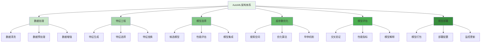
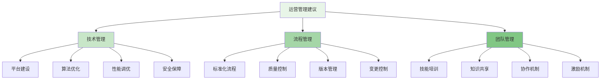

自动机器学习(AutoML)作为人工智能领域的重要发展方向，正在深刻改变风控模型的开发模式。通过自动化完成特征工程、模型选择和超参数调优等关键环节，AutoML能够显著提升风控模型的开发效率和质量，降低对专业人员的依赖，使风控团队能够更专注于业务理解和策略制定，构建更加智能化的风控建模体系。

## 自动机器学习基础概念

自动机器学习是一种将机器学习流程自动化的技术，旨在降低机器学习的门槛并提高建模效率。

### AutoML架构体系



### AutoML核心组件

```yaml
# AutoML核心组件
automl_core_components:
  automated_feature_engineering:
    name: "自动特征工程"
    description: "自动化完成特征生成、选择和变换的过程"
    key_functions:
      - feature_generation:
          name: "特征生成"
          description: "自动生成各种类型的特征"
          techniques:
            - "统计特征生成"
            - "时间序列特征生成"
            - "交叉特征生成"
            - "文本特征生成"
            - "图特征生成"
      
      - feature_selection:
          name: "特征选择"
          description: "从大量特征中选择最优特征子集"
          methods:
            - "过滤法"
            - "包装法"
            - "嵌入法"
            - "混合方法"
      
      - feature_transformation:
          name: "特征变换"
          description: "对特征进行变换以提升模型效果"
          techniques:
            - "标准化"
            - "归一化"
            - "离散化"
            - "编码变换"
            - "降维技术"
  
  automated_model_selection:
    name: "自动模型选择"
    description: "自动化选择最适合的机器学习模型"
    key_functions:
      - candidate_generation:
          name: "候选模型生成"
          description: "生成候选模型列表"
          models:
            - "线性模型"
            - "树模型"
            - "神经网络"
            - "集成学习"
            - "深度学习"
      
      - performance_evaluation:
          name: "性能评估"
          description: "评估候选模型的性能"
          metrics:
            - "准确率"
            - "召回率"
            - "F1分数"
            - "AUC"
            - "KS值"
      
      - model_ensembling:
          name: "模型集成"
          description: "组合多个模型提升整体性能"
          methods:
            - "投票法"
            - "加权平均"
            - "堆叠法"
            - "提升法"
  
  automated_hyperparameter_optimization:
    name: "自动超参数优化"
    description: "自动化优化模型超参数"
    key_functions:
      - search_space_definition:
          name: "搜索空间定义"
          description: "定义超参数搜索空间"
          components:
            - "连续参数"
            - "离散参数"
            - "条件参数"
            - "层级参数"
      
      - optimization_algorithms:
          name: "优化算法"
          description: "用于搜索最优超参数的算法"
          algorithms:
            - "网格搜索"
            - "随机搜索"
            - "贝叶斯优化"
            - "进化算法"
            - "梯度优化"
      
      - early_stopping:
          name: "早停机制"
          description: "防止过拟合和节省计算资源"
          strategies:
            - "性能阈值"
            - "收敛检测"
            - "资源限制"
            - "时间约束"
```

## 风控场景的自动特征工程

自动特征工程是AutoML在风控领域的重要应用，能够大幅提升特征开发效率和质量。

### 风控特征自动生成

```python
class RiskControlAutoFeatureEngineer:
    def __init__(self, config):
        self.config = config
        self.feature_generators = {
            'statistical': StatisticalFeatureGenerator(),
            'temporal': TemporalFeatureGenerator(),
            'cross': CrossFeatureGenerator(),
            'text': TextFeatureGenerator(),
            'graph': GraphFeatureGenerator()
        }
        self.feature_selector = FeatureSelector()
        self.feature_transformer = FeatureTransformer()
    
    def auto_engineer_features(self, risk_data, engineering_config):
        """自动进行风控特征工程"""
        # 1. 数据质量检查
        data_quality = self.validate_data_quality(risk_data)
        if not data_quality.is_valid:
            raise DataQualityError(f"Data quality issues: {data_quality.issues}")
        
        # 2. 自动生成特征
        generated_features = self.generate_risk_features(risk_data, engineering_config)
        
        # 3. 特征选择优化
        selected_features = self.optimize_feature_selection(generated_features, risk_data, engineering_config)
        
        # 4. 特征变换处理
        transformed_features = self.transform_features(selected_features, engineering_config)
        
        # 5. 特征工程管道构建
        feature_pipeline = FeatureEngineeringPipeline(
            raw_features=generated_features,
            selected_features=selected_features,
            transformed_features=transformed_features,
            quality_metrics=data_quality.metrics
        )
        
        return feature_pipeline
    
    def generate_risk_features(self, risk_data, config):
        """生成风控特征"""
        all_features = []
        
        # 1. 统计特征生成
        if config.enable_statistical_features:
            statistical_features = self.feature_generators['statistical'].generate_features(
                risk_data.numerical_data,
                config.statistical_config
            )
            all_features.extend(statistical_features)
        
        # 2. 时间序列特征生成
        if config.enable_temporal_features:
            temporal_features = self.feature_generators['temporal'].generate_features(
                risk_data.temporal_data,
                config.temporal_config
            )
            all_features.extend(temporal_features)
        
        # 3. 交叉特征生成
        if config.enable_cross_features:
            cross_features = self.feature_generators['cross'].generate_features(
                risk_data.categorical_data,
                config.cross_config
            )
            all_features.extend(cross_features)
        
        # 4. 文本特征生成
        if config.enable_text_features:
            text_features = self.feature_generators['text'].generate_features(
                risk_data.text_data,
                config.text_config
            )
            all_features.extend(text_features)
        
        # 5. 图特征生成
        if config.enable_graph_features:
            graph_features = self.feature_generators['graph'].generate_features(
                risk_data.graph_data,
                config.graph_config
            )
            all_features.extend(graph_features)
        
        return all_features
    
    def optimize_feature_selection(self, features, risk_data, config):
        """优化特征选择"""
        # 1. 特征重要性评估
        feature_importance = self.evaluate_feature_importance(features, risk_data)
        
        # 2. 多样性分析
        feature_diversity = self.analyze_feature_diversity(features)
        
        # 3. 冗余性检测
        redundant_features = self.detect_redundant_features(features)
        
        # 4. 综合选择策略
        selected_features = self.feature_selector.select_features(
            features=features,
            importance_scores=feature_importance,
            diversity_scores=feature_diversity,
            redundant_features=redundant_features,
            selection_config=config.selection_config
        )
        
        return selected_features

class StatisticalFeatureGenerator:
    def __init__(self):
        self.statistical_functions = {
            'mean': np.mean,
            'std': np.std,
            'min': np.min,
            'max': np.max,
            'median': np.median,
            'skew': scipy.stats.skew,
            'kurtosis': scipy.stats.kurtosis,
            'quantile_25': lambda x: np.percentile(x, 25),
            'quantile_75': lambda x: np.percentile(x, 75),
            'entropy': self.calculate_entropy
        }
    
    def generate_features(self, numerical_data, config):
        """生成统计特征"""
        features = []
        
        for column_name, column_data in numerical_data.items():
            # 跳过非数值列
            if not self.is_numerical(column_data):
                continue
            
            # 生成各种统计特征
            for stat_name, stat_func in self.statistical_functions.items():
                try:
                    stat_value = stat_func(column_data)
                    feature = RiskFeature(
                        name=f"{column_name}_{stat_name}",
                        value=stat_value,
                        type="statistical",
                        source_column=column_name,
                        statistical_type=stat_name
                    )
                    features.append(feature)
                except Exception as e:
                    print(f"Error calculating {stat_name} for {column_name}: {e}")
                    continue
        
        return features
    
    def calculate_entropy(self, data):
        """计算熵值"""
        # 处理连续数据的离散化
        if len(np.unique(data)) > 10:
            # 对连续数据进行分箱
            bins = np.histogram_bin_edges(data, bins=10)
            discretized_data = np.digitize(data, bins)
        else:
            discretized_data = data
        
        # 计算概率分布
        unique_values, counts = np.unique(discretized_data, return_counts=True)
        probabilities = counts / len(discretized_data)
        
        # 计算熵
        entropy = -np.sum(probabilities * np.log2(probabilities + 1e-10))
        return entropy

class TemporalFeatureGenerator:
    def __init__(self):
        self.temporal_patterns = {
            'trend': self.calculate_trend,
            'seasonality': self.calculate_seasonality,
            'volatility': self.calculate_volatility,
            'autocorrelation': self.calculate_autocorrelation,
            'change_points': self.detect_change_points
        }
    
    def generate_features(self, temporal_data, config):
        """生成时间序列特征"""
        features = []
        
        for series_name, time_series in temporal_data.items():
            # 生成各种时间序列特征
            for pattern_name, pattern_func in self.temporal_patterns.items():
                try:
                    pattern_value = pattern_func(time_series)
                    feature = RiskFeature(
                        name=f"{series_name}_{pattern_name}",
                        value=pattern_value,
                        type="temporal",
                        source_series=series_name,
                        temporal_pattern=pattern_name
                    )
                    features.append(feature)
                except Exception as e:
                    print(f"Error calculating {pattern_name} for {series_name}: {e}")
                    continue
        
        return features
    
    def calculate_trend(self, time_series):
        """计算趋势特征"""
        # 使用线性回归计算趋势斜率
        x = np.arange(len(time_series))
        slope, intercept, r_value, p_value, std_err = scipy.stats.linregress(x, time_series)
        return slope
    
    def calculate_seasonality(self, time_series):
        """计算季节性特征"""
        # 使用傅里叶变换检测季节性
        fft_values = np.fft.fft(time_series)
        power_spectrum = np.abs(fft_values) ** 2
        
        # 找到主要频率成分
        dominant_frequency = np.argmax(power_spectrum[1:len(power_spectrum)//2]) + 1
        seasonality_strength = power_spectrum[dominant_frequency] / np.sum(power_spectrum)
        
        return seasonality_strength
    
    def calculate_volatility(self, time_series):
        """计算波动性特征"""
        # 计算收益率的标准差
        returns = np.diff(time_series) / time_series[:-1]
        volatility = np.std(returns)
        return volatility

class CrossFeatureGenerator:
    def __init__(self):
        self.combination_methods = {
            'multiplication': self.multiply_features,
            'division': self.divide_features,
            'addition': self.add_features,
            'subtraction': self.subtract_features,
            'ratio': self.calculate_ratio
        }
    
    def generate_features(self, categorical_data, config):
        """生成交叉特征"""
        features = []
        
        # 获取所有分类特征列
        categorical_columns = list(categorical_data.keys())
        
        # 生成两两组合的交叉特征
        for i in range(len(categorical_columns)):
            for j in range(i + 1, len(categorical_columns)):
                col1 = categorical_columns[i]
                col2 = categorical_columns[j]
                
                # 生成交叉特征
                cross_features = self.create_cross_features(
                    categorical_data[col1],
                    categorical_data[col2],
                    col1,
                    col2,
                    config
                )
                features.extend(cross_features)
        
        return features
    
    def create_cross_features(self, data1, data2, col1, col2, config):
        """创建交叉特征"""
        cross_features = []
        
        # 组合两个特征的值
        combined_values = [f"{val1}_{val2}" for val1, val2 in zip(data1, data2)]
        
        # 创建频率特征
        value_counts = pd.Series(combined_values).value_counts()
        frequency_features = []
        for value in combined_values:
            frequency = value_counts.get(value, 0)
            feature = RiskFeature(
                name=f"{col1}_{col2}_frequency",
                value=frequency,
                type="cross",
                source_columns=[col1, col2],
                cross_type="frequency"
            )
            frequency_features.append(feature)
        
        cross_features.extend(frequency_features)
        
        # 创建编码特征
        if config.enable_onehot_encoding:
            encoded_features = self.onehot_encode_cross_features(combined_values, col1, col2)
            cross_features.extend(encoded_features)
        
        return cross_features
    
    def onehot_encode_cross_features(self, combined_values, col1, col2):
        """对交叉特征进行独热编码"""
        encoded_features = []
        
        # 获取唯一值
        unique_values = list(set(combined_values))
        
        # 为每个唯一值创建一个特征
        for value in unique_values:
            encoded_values = [1 if combined_value == value else 0 for combined_value in combined_values]
            feature = RiskFeature(
                name=f"{col1}_{col2}_{value}",
                value=encoded_values,
                type="cross",
                source_columns=[col1, col2],
                cross_type="onehot"
            )
            encoded_features.append(feature)
        
        return encoded_features
```

### 特征选择与优化

```go
type FeatureSelector struct {
    SelectionMethods map[string]SelectionMethod
    EvaluationMetric string
    MaxFeatures      int
}

type SelectionMethod interface {
    Select(features []RiskFeature, data RiskData, config SelectionConfig) []RiskFeature
}

type FilterMethod struct{}

func (fm *FilterMethod) Select(features []RiskFeature, data RiskData, config SelectionConfig) []RiskFeature {
    // 1. 计算特征重要性分数
    importanceScores := fm.calculateImportanceScores(features, data)
    
    // 2. 根据重要性排序
    sortedFeatures := fm.sortByImportance(features, importanceScores)
    
    // 3. 选择Top K特征
    selectedFeatures := fm.selectTopK(sortedFeatures, config.MaxFeatures)
    
    return selectedFeatures
}

func (fm *FilterMethod) calculateImportanceScores(features []RiskFeature, data RiskData) map[string]float64 {
    scores := make(map[string]float64)
    
    for _, feature := range features {
        // 根据特征类型选择不同的重要性计算方法
        switch feature.Type {
        case "statistical":
            scores[feature.Name] = fm.calculateStatisticalImportance(feature, data)
        case "temporal":
            scores[feature.Name] = fm.calculateTemporalImportance(feature, data)
        case "cross":
            scores[feature.Name] = fm.calculateCrossImportance(feature, data)
        case "text":
            scores[feature.Name] = fm.calculateTextImportance(feature, data)
        case "graph":
            scores[feature.Name] = fm.calculateGraphImportance(feature, data)
        default:
            scores[feature.Name] = fm.calculateGenericImportance(feature, data)
        }
    }
    
    return scores
}

func (fm *FilterMethod) calculateStatisticalImportance(feature RiskFeature, data RiskData) float64 {
    // 对于统计特征，使用方差作为重要性指标
    if feature.Value == nil {
        return 0.0
    }
    
    // 如果是数值型特征，计算方差
    if values, ok := feature.Value.([]float64); ok {
        if len(values) == 0 {
            return 0.0
        }
        
        mean := calculateMean(values)
        variance := 0.0
        for _, value := range values {
            variance += math.Pow(value-mean, 2)
        }
        variance /= float64(len(values))
        
        return variance
    }
    
    return 0.0
}

type WrapperMethod struct {
    ModelEvaluator *ModelEvaluator
}

func (wm *WrapperMethod) Select(features []RiskFeature, data RiskData, config SelectionConfig) []RiskFeature {
    // 1. 初始化特征子集
    currentFeatures := make([]RiskFeature, 0)
    remainingFeatures := features
    
    // 2. 前向选择
    for len(currentFeatures) < config.MaxFeatures && len(remainingFeatures) > 0 {
        bestFeature := wm.findBestFeature(currentFeatures, remainingFeatures, data, config)
        if bestFeature != nil {
            currentFeatures = append(currentFeatures, *bestFeature)
            remainingFeatures = wm.removeFeature(remainingFeatures, bestFeature.Name)
        } else {
            break
        }
    }
    
    return currentFeatures
}

func (wm *WrapperMethod) findBestFeature(currentFeatures, candidateFeatures []RiskFeature, data RiskData, config SelectionConfig) *RiskFeature {
    var bestFeature *RiskFeature
    bestScore := -1.0
    
    // 评估每个候选特征
    for _, feature := range candidateFeatures {
        // 构造临时特征集
        tempFeatures := append(currentFeatures, feature)
        
        // 训练模型并评估性能
        score := wm.evaluateFeatureSet(tempFeatures, data, config)
        if score > bestScore {
            bestScore = score
            bestFeature = &feature
        }
    }
    
    return bestFeature
}

func (wm *WrapperMethod) evaluateFeatureSet(features []RiskFeature, data RiskData, config SelectionConfig) float64 {
    // 1. 构造特征矩阵
    featureMatrix := wm.constructFeatureMatrix(features, data)
    
    // 2. 训练评估模型
    model := wm.ModelEvaluator.TrainEvaluationModel(featureMatrix, data.Labels)
    
    // 3. 交叉验证评估
    score := wm.ModelEvaluator.CrossValidate(model, featureMatrix, data.Labels, config.CV_Folds)
    
    return score
}

type EmbeddedMethod struct {
    RegularizationType string
    RegularizationStrength float64
}

func (em *EmbeddedMethod) Select(features []RiskFeature, data RiskData, config SelectionConfig) []RiskFeature {
    // 1. 构造特征矩阵
    featureMatrix := em.constructFeatureMatrix(features, data)
    
    // 2. 根据正则化类型选择模型
    var model RegularizedModel
    switch em.RegularizationType {
    case "lasso":
        model = NewLassoModel(em.RegularizationStrength)
    case "ridge":
        model = NewRidgeModel(em.RegularizationStrength)
    case "elastic_net":
        model = NewElasticNetModel(em.RegularizationStrength)
    default:
        model = NewLassoModel(em.RegularizationStrength)
    }
    
    // 3. 训练正则化模型
    model.Train(featureMatrix, data.Labels)
    
    // 4. 根据系数选择特征
    coefficients := model.GetCoefficients()
    selectedFeatures := em.selectFeaturesByCoefficients(features, coefficients, config.Threshold)
    
    return selectedFeatures
}

func (em *EmbeddedMethod) selectFeaturesByCoefficients(features []RiskFeature, coefficients []float64, threshold float64) []RiskFeature {
    selected := make([]RiskFeature, 0)
    
    for i, feature := range features {
        // 检查系数是否超过阈值
        if math.Abs(coefficients[i]) > threshold {
            selected = append(selected, feature)
        }
    }
    
    return selected
}

type RiskControlFeatureOptimizer struct {
    FeatureSelector *FeatureSelector
    DiversityAnalyzer *FeatureDiversityAnalyzer
    RedundancyDetector *FeatureRedundancyDetector
}

func (rco *RiskControlFeatureOptimizer) OptimizeFeatures(features []RiskFeature, data RiskData, config OptimizationConfig) []RiskFeature {
    // 1. 多方法特征选择
    selectedFeatures := rco.multiMethodSelection(features, data, config)
    
    // 2. 多样性增强
    diverseFeatures := rco.enhanceDiversity(selectedFeatures, config)
    
    // 3. 冗余特征去除
    finalFeatures := rco.removeRedundancy(diverseFeatures, config)
    
    // 4. 性能验证
    performance := rco.validatePerformance(finalFeatures, data, config)
    
    // 5. 返回优化后的特征
    return finalFeatures
}

func (rco *RiskControlFeatureOptimizer) multiMethodSelection(features []RiskFeature, data RiskData, config OptimizationConfig) []RiskFeature {
    // 1. 应用多种选择方法
    filterSelected := rco.FeatureSelector.SelectionMethods["filter"].Select(features, data, config.FilterConfig)
    wrapperSelected := rco.FeatureSelector.SelectionMethods["wrapper"].Select(features, data, config.WrapperConfig)
    embeddedSelected := rco.FeatureSelector.SelectionMethods["embedded"].Select(features, data, config.EmbeddedConfig)
    
    // 2. 集成选择结果
    integratedFeatures := rco.integrateSelectionResults(
        filterSelected,
        wrapperSelected,
        embeddedSelected,
        config.IntegrationStrategy,
    )
    
    return integratedFeatures
}
```

## 自动模型选择与集成

自动模型选择能够根据数据特点和业务需求自动选择最优的机器学习模型。

### 候选模型生成与评估

```typescript
interface ModelSelector {
    // 生成候选模型
    generateCandidateModels(dataCharacteristics: DataCharacteristics, config: ModelSelectionConfig): Promise<CandidateModel[]>;
    
    // 评估候选模型
    evaluateCandidateModels(candidates: CandidateModel[], trainingData: TrainingData, config: EvaluationConfig): Promise<ModelEvaluation[]>;
    
    // 选择最优模型
    selectBestModel(evaluations: ModelEvaluation[], criteria: SelectionCriteria): Promise<SelectedModel>;
    
    // 模型集成
    ensembleModels(models: SelectedModel[], ensembleConfig: EnsembleConfig): Promise<EnsembleModel>;
}

class RiskControlModelSelector implements ModelSelector {
    private modelRepository: ModelRepository;
    private evaluator: ModelEvaluator;
    private ensembleBuilder: EnsembleBuilder;
    
    async generateCandidateModels(dataCharacteristics: DataCharacteristics, config: ModelSelectionConfig): Promise<CandidateModel[]> {
        // 1. 分析数据特征
        const dataAnalysis = await this.analyzeDataCharacteristics(dataCharacteristics);
        
        // 2. 根据数据特点生成候选模型
        const candidateModels: CandidateModel[] = [];
        
        // 线性模型候选
        if (config.enableLinearModels) {
            const linearModels = this.generateLinearModelCandidates(dataAnalysis, config.linearConfig);
            candidateModels.push(...linearModels);
        }
        
        // 树模型候选
        if (config.enableTreeModels) {
            const treeModels = this.generateTreeModelCandidates(dataAnalysis, config.treeConfig);
            candidateModels.push(...treeModels);
        }
        
        // 神经网络候选
        if (config.enableNeuralNetworks) {
            const nnModels = this.generateNeuralNetworkCandidates(dataAnalysis, config.nnConfig);
            candidateModels.push(...nnModels);
        }
        
        // 集成学习候选
        if (config.enableEnsembleMethods) {
            const ensembleModels = this.generateEnsembleModelCandidates(dataAnalysis, config.ensembleConfig);
            candidateModels.push(...ensembleModels);
        }
        
        return candidateModels;
    }
    
    async evaluateCandidateModels(candidates: CandidateModel[], trainingData: TrainingData, config: EvaluationConfig): Promise<ModelEvaluation[]> {
        const evaluations: ModelEvaluation[] = [];
        
        // 并行评估候选模型
        const evaluationPromises = candidates.map(candidate => 
            this.evaluateSingleModel(candidate, trainingData, config)
        );
        
        const results = await Promise.all(evaluationPromises);
        evaluations.push(...results);
        
        return evaluations;
    }
    
    async selectBestModel(evaluations: ModelEvaluation[], criteria: SelectionCriteria): Promise<SelectedModel> {
        // 1. 多指标综合评估
        const综合Scores = this.calculate综合Scores(evaluations, criteria);
        
        // 2. 排序选择
        const sortedEvaluations = evaluations.sort((a, b) => 
            (综合Scores.get(b.modelId) || 0) - (综合Scores.get(a.modelId) || 0)
        );
        
        // 3. 选择最佳模型
        const bestEvaluation = sortedEvaluations[0];
        
        // 4. 生成选择报告
        const selectionReport = this.generateSelectionReport(evaluations, 综合Scores, criteria);
        
        return new SelectedModel({
            model: bestEvaluation.model,
            evaluation: bestEvaluation,
            report: selectionReport,
            confidence: this.calculateSelectionConfidence(bestEvaluation, 综合Scores)
        });
    }
    
    async ensembleModels(models: SelectedModel[], ensembleConfig: EnsembleConfig): Promise<EnsembleModel> {
        // 1. 构建集成模型
        const ensembleModel = await this.ensembleBuilder.buildEnsemble(models, ensembleConfig);
        
        // 2. 评估集成效果
        const ensembleEvaluation = await this.evaluator.evaluateEnsemble(ensembleModel, ensembleConfig.evaluationData);
        
        // 3. 优化集成权重
        const optimizedEnsemble = await this.optimizeEnsembleWeights(ensembleModel, ensembleConfig);
        
        return new EnsembleModel({
            ensemble: optimizedEnsemble,
            evaluation: ensembleEvaluation,
            configuration: ensembleConfig,
            performanceGain: this.calculatePerformanceGain(models, ensembleEvaluation)
        });
    }
    
    private async evaluateSingleModel(candidate: CandidateModel, trainingData: TrainingData, config: EvaluationConfig): Promise<ModelEvaluation> {
        // 1. 模型训练
        const trainedModel = await candidate.model.train(trainingData.trainingSet);
        
        // 2. 交叉验证评估
        const cvResults = await this.evaluator.crossValidate(
            trainedModel,
            trainingData.validationSet,
            config.cvFolds
        );
        
        // 3. 性能指标计算
        const performanceMetrics = this.evaluator.calculatePerformanceMetrics(
            cvResults.predictions,
            trainingData.validationSet.labels
        );
        
        // 4. 鲁棒性评估
        const robustnessMetrics = await this.evaluator.assessRobustness(
            trainedModel,
            trainingData.testSet,
            config.robustnessConfig
        );
        
        // 5. 可解释性评估
        const interpretabilityScore = await this.evaluator.assessInterpretability(
            trainedModel,
            config.interpretabilityConfig
        );
        
        // 6. 计算资源消耗
        const resourceMetrics = this.evaluator.calculateResourceConsumption(
            trainedModel,
            config.resourceConfig
        );
        
        return new ModelEvaluation({
            modelId: candidate.modelId,
            model: trainedModel,
            candidate: candidate,
            performance: performanceMetrics,
            robustness: robustnessMetrics,
            interpretability: interpretabilityScore,
            resources: resourceMetrics,
            cvResults: cvResults,
            evaluationTime: Date.now()
        });
    }
    
    private generateLinearModelCandidates(dataAnalysis: DataAnalysis, config: LinearModelConfig): CandidateModel[] {
        const candidates: CandidateModel[] = [];
        
        // 逻辑回归
        if (config.enableLogisticRegression) {
            candidates.push(new CandidateModel({
                modelId: 'logistic_regression',
                model: new LogisticRegression(config.logisticParams),
                category: 'linear',
                complexity: 'low',
                interpretability: 'high'
            }));
        }
        
        // 线性SVM
        if (config.enableLinearSVM) {
            candidates.push(new CandidateModel({
                modelId: 'linear_svm',
                model: new LinearSVM(config.svmParams),
                category: 'linear',
                complexity: 'medium',
                interpretability: 'medium'
            }));
        }
        
        // 岭回归
        if (config.enableRidgeRegression) {
            candidates.push(new CandidateModel({
                modelId: 'ridge_regression',
                model: new RidgeRegression(config.ridgeParams),
                category: 'linear',
                complexity: 'low',
                interpretability: 'high'
            }));
        }
        
        return candidates;
    }
    
    private generateTreeModelCandidates(dataAnalysis: DataAnalysis, config: TreeModelConfig): CandidateModel[] {
        const candidates: CandidateModel[] = [];
        
        // 随机森林
        if (config.enableRandomForest) {
            candidates.push(new CandidateModel({
                modelId: 'random_forest',
                model: new RandomForest(config.rfParams),
                category: 'tree',
                complexity: 'high',
                interpretability: 'medium'
            }));
        }
        
        // XGBoost
        if (config.enableXGBoost) {
            candidates.push(new CandidateModel({
                modelId: 'xgboost',
                model: new XGBoost(config.xgbParams),
                category: 'tree',
                complexity: 'high',
                interpretability: 'low'
            }));
        }
        
        // LightGBM
        if (config.enableLightGBM) {
            candidates.push(new CandidateModel({
                modelId: 'lightgbm',
                model: new LightGBM(config.lgbParams),
                category: 'tree',
                complexity: 'high',
                interpretability: 'low'
            }));
        }
        
        return candidates;
    }
}

class ModelEvaluator {
    async crossValidate(model: Model, data: ValidationData, folds: number): Promise<CrossValidationResult> {
        // 1. 数据分割
        const foldsData = this.splitDataIntoFolds(data, folds);
        
        // 2. 交叉验证
        const foldResults: FoldResult[] = [];
        for (let i = 0; i < folds; i++) {
            const trainData = this.getTrainingData(foldsData, i);
            const testData = foldsData[i];
            
            // 训练模型
            const trainedModel = await model.train(trainData);
            
            // 预测测试集
            const predictions = await trainedModel.predict(testData.features);
            
            // 计算指标
            const metrics = this.calculatePerformanceMetrics(predictions, testData.labels);
            
            foldResults.push(new FoldResult({
                fold: i,
                metrics: metrics,
                predictions: predictions,
                actual: testData.labels
            }));
        }
        
        // 3. 汇总结果
        const aggregatedMetrics = this.aggregateFoldMetrics(foldResults);
        const confidenceIntervals = this.calculateConfidenceIntervals(foldResults);
        
        return new CrossValidationResult({
            folds: foldResults,
            aggregatedMetrics: aggregatedMetrics,
            confidenceIntervals: confidenceIntervals,
            cvScore: aggregatedMetrics.meanAccuracy
        });
    }
    
    calculatePerformanceMetrics(predictions: Prediction[], actual: Label[]): PerformanceMetrics {
        // 计算各种性能指标
        const accuracy = this.calculateAccuracy(predictions, actual);
        const precision = this.calculatePrecision(predictions, actual);
        const recall = this.calculateRecall(predictions, actual);
        const f1Score = this.calculateF1Score(precision, recall);
        const auc = this.calculateAUC(predictions, actual);
        const ks = this.calculateKSStatistic(predictions, actual);
        
        return new PerformanceMetrics({
            accuracy: accuracy,
            precision: precision,
            recall: recall,
            f1Score: f1Score,
            auc: auc,
            ks: ks,
            support: actual.length
        });
    }
    
    async assessRobustness(model: Model, testData: TestData, config: RobustnessConfig): Promise<RobustnessMetrics> {
        // 1. 对抗样本测试
        const adversarialRobustness = await this.testAdversarialRobustness(model, testData, config.adversarial);
        
        // 2. 数据扰动测试
        const perturbationRobustness = await this.testPerturbationRobustness(model, testData, config.perturbation);
        
        // 3. 分布漂移测试
        const driftRobustness = await this.testDriftRobustness(model, testData, config.drift);
        
        // 4. 综合鲁棒性评分
        const综合Score = this.calculate综合RobustnessScore(
            adversarialRobustness,
            perturbationRobustness,
            driftRobustness,
            config.weights
        );
        
        return new RobustnessMetrics({
            adversarial: adversarialRobustness,
            perturbation: perturbationRobustness,
            drift: driftRobustness,
           综合Score: 综合Score,
            confidence: this.calculateRobustnessConfidence(综合Score)
        });
    }
}
```

## 自动超参数优化

自动超参数优化是AutoML的核心组件，能够显著提升模型性能。

### 贝叶斯优化实现

```javascript
class BayesianOptimizer {
    constructor(config) {
        this.config = config;
        this.gaussianProcess = new GaussianProcessRegressor(config.gpConfig);
        this.acquisitionFunction = new AcquisitionFunction(config.acqConfig);
        this.observedPoints = [];
        this.observedValues = [];
    }
    
    /**
     * 执行贝叶斯优化
     * @param {Function} objectiveFunction - 目标函数
     * @param {Object} searchSpace - 搜索空间
     * @param {number} maxIterations - 最大迭代次数
     * @returns {Object} 优化结果
     */
    async optimize(objectiveFunction, searchSpace, maxIterations) {
        // 1. 初始化随机点
        const initialPoints = this.generateInitialPoints(searchSpace, this.config.initialPoints);
        const initialValues = await this.evaluatePoints(objectiveFunction, initialPoints);
        
        // 2. 更新观测数据
        this.observedPoints.push(...initialPoints);
        this.observedValues.push(...initialValues);
        
        // 3. 贝叶斯优化主循环
        for (let i = 0; i < maxIterations; i++) {
            // 3.1 训练高斯过程模型
            await this.gaussianProcess.fit(this.observedPoints, this.observedValues);
            
            // 3.2 选择下一个采样点
            const nextPoint = this.selectNextPoint(searchSpace);
            
            // 3.3 评估目标函数
            const nextValue = await this.evaluatePoint(objectiveFunction, nextPoint);
            
            // 3.4 更新观测数据
            this.observedPoints.push(nextPoint);
            this.observedValues.push(nextValue);
            
            // 3.5 检查收敛条件
            if (this.shouldStopOptimization()) {
                break;
            }
        }
        
        // 4. 返回最优解
        const bestIndex = this.findBestIndex(this.observedValues);
        const bestPoint = this.observedPoints[bestIndex];
        const bestValue = this.observedValues[bestIndex];
        
        return {
            bestPoint: bestPoint,
            bestValue: bestValue,
            history: {
                points: this.observedPoints,
                values: this.observedValues
            },
            iterations: this.observedPoints.length
        };
    }
    
    /**
     * 选择下一个采样点
     * @param {Object} searchSpace - 搜索空间
     * @returns {Object} 下一个采样点
     */
    selectNextPoint(searchSpace) {
        // 使用采集函数选择下一个点
        const acquisitionScores = [];
        const candidatePoints = this.generateCandidatePoints(searchSpace, this.config.candidates);
        
        // 计算每个候选点的采集函数值
        for (const point of candidatePoints) {
            const acquisitionValue = this.acquisitionFunction.compute(
                point,
                this.gaussianProcess,
                this.observedPoints,
                this.observedValues
            );
            acquisitionScores.push({
                point: point,
                score: acquisitionValue
            });
        }
        
        // 选择得分最高的点
        acquisitionScores.sort((a, b) => b.score - a.score);
        return acquisitionScores[0].point;
    }
    
    /**
     * 生成初始随机点
     * @param {Object} searchSpace - 搜索空间
     * @param {number} count - 点数量
     * @returns {Array} 随机点数组
     */
    generateInitialPoints(searchSpace, count) {
        const points = [];
        for (let i = 0; i < count; i++) {
            const point = {};
            for (const [paramName, paramConfig] of Object.entries(searchSpace)) {
                point[paramName] = this.sampleParameter(paramConfig);
            }
            points.push(point);
        }
        return points;
    }
    
    /**
     * 采样参数值
     * @param {Object} paramConfig - 参数配置
     * @returns {any} 参数值
     */
    sampleParameter(paramConfig) {
        switch (paramConfig.type) {
            case 'integer':
                return Math.floor(Math.random() * (paramConfig.max - paramConfig.min + 1)) + paramConfig.min;
            case 'float':
                return Math.random() * (paramConfig.max - paramConfig.min) + paramConfig.min;
            case 'categorical':
                return paramConfig.choices[Math.floor(Math.random() * paramConfig.choices.length)];
            case 'log':
                const logMin = Math.log(paramConfig.min);
                const logMax = Math.log(paramConfig.max);
                return Math.exp(Math.random() * (logMax - logMin) + logMin);
            default:
                return paramConfig.min;
        }
    }
}

class RiskControlHyperparameterOptimizer {
    constructor(config) {
        this.config = config;
        this.bayesianOptimizer = new BayesianOptimizer(config.bayesianConfig);
        this.randomSearch = new RandomSearchOptimizer(config.randomConfig);
        this.gridSearch = new GridSearchOptimizer(config.gridConfig);
    }
    
    /**
     * 自动优化风控模型超参数
     * @param {Object} model - 模型对象
     * @param {Object} data - 训练数据
     * @param {Object} searchSpace - 搜索空间
     * @returns {Object} 优化结果
     */
    async autoOptimize(model, data, searchSpace) {
        // 1. 选择优化算法
        const optimizer = this.selectOptimizer(searchSpace, this.config);
        
        // 2. 定义目标函数
        const objectiveFunction = async (params) => {
            // 设置模型参数
            model.setHyperparameters(params);
            
            // 训练模型
            await model.train(data.trainingSet);
            
            // 交叉验证评估
            const cvResult = await model.crossValidate(data.validationSet, this.config.cvFolds);
            
            // 返回负的评估指标（因为优化器默认最小化）
            return -cvResult.metrics[this.config.objectiveMetric];
        };
        
        // 3. 执行优化
        const optimizationResult = await optimizer.optimize(
            objectiveFunction,
            searchSpace,
            this.config.maxIterations
        );
        
        // 4. 应用最优参数
        model.setHyperparameters(optimizationResult.bestPoint);
        
        // 5. 最终训练
        await model.train(data.fullDataset);
        
        // 6. 生成优化报告
        const optimizationReport = this.generateOptimizationReport(optimizationResult, model);
        
        return {
            model: model,
            bestParameters: optimizationResult.bestPoint,
            bestScore: -optimizationResult.bestValue,
            optimizationHistory: optimizationResult.history,
            report: optimizationReport
        };
    }
    
    /**
     * 选择优化算法
     * @param {Object} searchSpace - 搜索空间
     * @param {Object} config - 配置参数
     * @returns {Object} 优化器
     */
    selectOptimizer(searchSpace, config) {
        // 根据搜索空间大小和复杂度选择优化算法
        const spaceSize = this.calculateSearchSpaceSize(searchSpace);
        
        if (spaceSize < config.gridSearchThreshold) {
            return this.gridSearch;
        } else if (spaceSize < config.bayesianThreshold) {
            return this.randomSearch;
        } else {
            return this.bayesianOptimizer;
        }
    }
    
    /**
     * 计算搜索空间大小
     * @param {Object} searchSpace - 搜索空间
     * @returns {number} 空间大小
     */
    calculateSearchSpaceSize(searchSpace) {
        let size = 1;
        for (const [paramName, paramConfig] of Object.entries(searchSpace)) {
            switch (paramConfig.type) {
                case 'integer':
                case 'float':
                    size *= Math.ceil((paramConfig.max - paramConfig.min) / paramConfig.step);
                    break;
                case 'categorical':
                    size *= paramConfig.choices.length;
                    break;
                case 'log':
                    size *= Math.ceil(Math.log(paramConfig.max / paramConfig.min) / Math.log(paramConfig.base));
                    break;
            }
        }
        return size;
    }
}
```

## AutoML在风控中的实践

AutoML在风控领域的实践需要考虑业务特点和合规要求。

### 风控AutoML平台架构

```yaml
# 风控AutoML平台架构
risk_control_automl_platform:
  platform_architecture:
    name: "风控AutoML平台架构"
    description: "支持风控业务的自动化机器学习平台"
    components:
      - data_processing_layer:
          name: "数据处理层"
          description: "负责风控数据的预处理和清洗"
          modules:
            - "数据质量检查"
            - "缺失值处理"
            - "异常值检测"
            - "数据标准化"
      
      - feature_engineering_layer:
          name: "特征工程层"
          description: "自动化完成风控特征的生成和选择"
          modules:
            - "自动特征生成"
            - "特征选择优化"
            - "特征变换处理"
            - "特征重要性分析"
      
      - model_selection_layer:
          name: "模型选择层"
          description: "自动化选择最优的风控模型"
          modules:
            - "候选模型生成"
            - "模型性能评估"
            - "模型选择决策"
            - "模型集成构建"
      
      - hyperparameter_optimization_layer:
          name: "超参数优化层"
          description: "自动化优化模型超参数"
          modules:
            - "搜索空间定义"
            - "优化算法执行"
            - "早停机制"
            - "结果验证"
      
      - model_deployment_layer:
          name: "模型部署层"
          description: "负责模型的部署和监控"
          modules:
            - "模型打包"
            - "部署配置"
            - "性能监控"
            - "自动更新"
  
  business_applications:
    fraud_detection:
      name: "欺诈检测"
      description: "自动化的欺诈检测模型开发"
      features:
        - "交易行为分析"
        - "用户画像构建"
        - "异常模式识别"
        - "实时风险评估"
    
    credit_risk:
      name: "信用风险"
      description: "自动化的信用风险评估模型"
      features:
        - "信用评分建模"
        - "违约概率预测"
        - "风险等级划分"
        - "授信策略优化"
    
    market_risk:
      name: "市场风险"
      description: "自动化的市场风险监控模型"
      features:
        - "价格波动预测"
        - "风险价值计算"
        - "压力测试"
        - "风险敞口分析"
  
  compliance_considerations:
    data_privacy:
      name: "数据隐私"
      measures:
        - "数据脱敏处理"
        - "访问权限控制"
        - "审计日志记录"
        - "合规性检查"
    
    model_governance:
      name: "模型治理"
      measures:
        - "模型可解释性"
        - "公平性检测"
        - "偏见消除"
        - "文档化管理"
    
    regulatory_compliance:
      name: "监管合规"
      measures:
        - "监管报告生成"
        - "模型备案管理"
        - "变更审计跟踪"
        - "风险评估文档"
```

### 风控AutoML实施流程

```mermaid
graph TB
    A[风控AutoML实施流程] --> B[需求分析]
    A --> C[数据准备]
    A --> D[自动建模]
    A --> E[模型评估]
    A --> F[部署上线]
    A --> G[监控运维]
    
    B --> B1[业务目标确定]
    B --> B2[数据需求分析]
    B --> B3[合规要求梳理]
    
    C --> C1[数据收集]
    C --> C2[数据清洗]
    C --> C3[数据标注]
    C --> C4[数据分割]
    
    D --> D1[特征工程]
    D --> D2[模型选择]
    D --> D3[参数优化]
    D --> D4[模型训练]
    
    E --> E1[性能评估]
    E --> E2[鲁棒性测试]
    E --> E3[可解释性分析]
    E --> E4[合规性检查]
    
    F --> F1[模型打包]
    F --> F2[部署配置]
    F --> F3[服务测试]
    F --> F4[上线审批]
    
    G --> G1[性能监控]
    G --> G2[异常检测]
    G --> G3[模型更新]
    G --> G4[效果评估]
    
    style A fill:#e8f5e8
    style B fill:#c8e6c8
    style C fill:#a5d6a7
    style D fill:#81c784
    style E fill:#66bb6a
    style F fill:#4caf50
    style G fill:#388e3c
```



## 最佳实践与经验总结

在实施风控AutoML系统时，需要遵循一系列最佳实践来确保系统效果和可靠性。

### 实施最佳实践

1. **业务导向**：始终以业务目标为导向，确保AutoML输出符合业务需求
2. **数据质量**：重视数据质量，建立完善的数据治理体系
3. **模型可解释性**：在自动化过程中保持模型的可解释性
4. **合规保障**：确保AutoML流程符合相关法规要求
5. **持续优化**：建立持续优化机制，不断提升模型性能

### 运营管理建议



通过合理应用自动机器学习技术，企业级智能风控平台能够大幅提升模型开发效率和质量，降低对专业人员的依赖，构建更加智能化的风控建模体系，为企业的风险管理提供强有力的技术支撑。