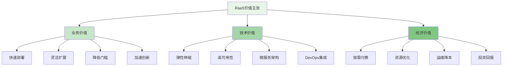

风控即服务（Risk Control as a Service, RaaS）和云原生风控是企业级智能风控平台发展的重要趋势。通过将风控能力服务化和云化，企业可以实现资源的弹性伸缩、能力的按需使用，以及更高效的风控体系运营。本章将深入探讨RaaS的核心理念、云原生风控架构设计，以及如何通过这些技术构建弹性、可扩展、高可用的下一代风控平台。

## 风控即服务（RaaS）的核心理念

风控即服务（RaaS）是云计算和微服务架构在风控领域的深度应用，它将传统的风控功能模块化、服务化，通过API接口提供给用户按需使用。这种模式不仅降低了企业构建风控系统的门槛，还实现了资源的高效利用和能力的快速迭代。

### RaaS的价值主张



### RaaS架构设计原则

```yaml
# RaaS架构设计原则
raas_architecture_principles:
  service_oriented:
    name: "面向服务"
    description: "将风控功能拆分为独立的服务单元"
    principles:
      - single_responsibility:
          name: "单一职责"
          description: "每个服务只负责一个特定的风控功能"
          benefits:
            - "易于维护"
            - "便于测试"
            - "快速迭代"
            - "独立部署"
      
      - loose_coupling:
          name: "松耦合"
          description: "服务之间通过标准接口通信"
          benefits:
            - "降低依赖"
            - "提高灵活性"
            - "便于替换"
            - "易于扩展"
      
      - high_cohesion:
          name: "高内聚"
          description: "服务内部功能高度相关"
          benefits:
            - "功能集中"
            - "逻辑清晰"
            - "易于理解"
            - "便于复用"
  
  cloud_native:
    name: "云原生"
    description: "充分利用云计算的弹性、可扩展性优势"
    principles:
      - containerization:
          name: "容器化"
          description: "使用容器技术打包和部署服务"
          benefits:
            - "环境一致性"
            - "快速启动"
            - "资源隔离"
            - "便于编排"
      
      - microservices:
          name: "微服务"
          description: "将应用拆分为小的、独立的服务"
          benefits:
            - "独立开发"
            - "独立部署"
            - "技术多样性"
            - "故障隔离"
      
      - devops:
          name: "DevOps"
          description: "实现开发运维一体化"
          benefits:
            - "快速交付"
            - "持续集成"
            - "自动化测试"
            - "快速反馈"
  
  api_first:
    name: "API优先"
    description: "以API为核心设计和实现服务"
    principles:
      - standardized_interfaces:
          name: "标准化接口"
          description: "使用标准协议和数据格式"
          benefits:
            - "易于集成"
            - "降低学习成本"
            - "提高互操作性"
            - "便于文档化"
      
      - version_management:
          name: "版本管理"
          description: "提供API版本管理和兼容性保障"
          benefits:
            - "平滑升级"
            - "向后兼容"
            - "降低风险"
            - "便于维护"
```

## 云原生风控平台架构

云原生风控平台充分利用容器、微服务、服务网格等云原生技术，构建高可用、可扩展、易维护的风控系统架构。

### 核心组件架构

```python
class CloudNativeRiskControlPlatform:
    def __init__(self):
        self.kubernetes_orchestrator = KubernetesOrchestrator()
        self.service_mesh = ServiceMesh()
        self.api_gateway = APIGateway()
        self.monitoring_system = MonitoringSystem()
        self.config_management = ConfigManagement()
        self.security_framework = SecurityFramework()
    
    def deploy_platform(self, platform_config):
        """部署云原生风控平台"""
        # 1. 创建命名空间
        namespace = self.kubernetes_orchestrator.create_namespace(
            platform_config.namespace
        )
        
        # 2. 部署核心服务
        core_services = self.deploy_core_services(platform_config.services)
        
        # 3. 配置服务网格
        mesh_config = self.service_mesh.configure_mesh(
            core_services,
            platform_config.mesh_policies
        )
        
        # 4. 设置API网关
        gateway_config = self.api_gateway.configure_routes(core_services)
        
        # 5. 部署监控系统
        monitoring_setup = self.monitoring_system.setup_monitoring(core_services)
        
        # 6. 配置安全管理
        security_setup = self.security_framework.apply_security_policies(
            core_services,
            platform_config.security_policies
        )
        
        return CloudNativePlatformDeployment(
            namespace=namespace,
            services=core_services,
            mesh=mesh_config,
            gateway=gateway_config,
            monitoring=monitoring_setup,
            security=security_setup
        )
    
    def deploy_core_services(self, service_configs):
        """部署核心风控服务"""
        deployed_services = []
        
        for service_config in service_configs:
            # 1. 创建服务定义
            service_definition = self.create_service_definition(service_config)
            
            # 2. 构建容器镜像
            container_image = self.build_container_image(service_config)
            
            # 3. 部署到Kubernetes
            deployed_service = self.kubernetes_orchestrator.deploy_service(
                service_definition,
                container_image
            )
            
            # 4. 配置自动扩缩容
            self.kubernetes_orchestrator.configure_autoscaling(
                deployed_service,
                service_config.scaling_policy
            )
            
            deployed_services.append(deployed_service)
        
        return deployed_services
    
    def implement_service_governance(self, services):
        """实现服务治理"""
        # 1. 服务发现配置
        discovery_config = self.configure_service_discovery(services)
        
        # 2. 流量管理策略
        traffic_policies = self.configure_traffic_management(services)
        
        # 3. 安全策略实施
        security_policies = self.implement_security_policies(services)
        
        # 4. 熔断降级机制
        circuit_breakers = self.configure_circuit_breakers(services)
        
        # 5. 限流策略
        rate_limiting = self.configure_rate_limiting(services)
        
        return ServiceGovernanceConfig(
            discovery=discovery_config,
            traffic=traffic_policies,
            security=security_policies,
            circuit_breakers=circuit_breakers,
            rate_limiting=rate_limiting
        )

class KubernetesOrchestrator:
    def __init__(self):
        self.k8s_client = KubernetesClient()
        self.helm_manager = HelmManager()
    
    def deploy_service(self, service_definition, container_image):
        """部署服务到Kubernetes"""
        # 1. 创建Deployment
        deployment = self.k8s_client.create_deployment(
            service_definition.name,
            container_image,
            service_definition.replicas,
            service_definition.resources
        )
        
        # 2. 创建Service
        service = self.k8s_client.create_service(
            service_definition.name,
            service_definition.ports,
            service_definition.selector
        )
        
        # 3. 创建Ingress（如需要）
        if service_definition.expose_internet:
            ingress = self.k8s_client.create_ingress(
                service_definition.name,
                service_definition.domain,
                service_definition.paths
            )
        
        # 4. 配置健康检查
        self.k8s_client.configure_health_checks(
            deployment,
            service_definition.health_check
        )
        
        return DeployedService(
            deployment=deployment,
            service=service,
            ingress=ingress if service_definition.expose_internet else None
        )
    
    def configure_autoscaling(self, deployed_service, scaling_policy):
        """配置自动扩缩容"""
        # 1. 创建HPA（Horizontal Pod Autoscaler）
        hpa = self.k8s_client.create_horizontal_pod_autoscaler(
            deployed_service.deployment.name,
            scaling_policy.min_replicas,
            scaling_policy.max_replicas,
            scaling_policy.metrics
        )
        
        # 2. 配置资源请求和限制
        self.k8s_client.update_resource_limits(
            deployed_service.deployment,
            scaling_policy.resource_limits
        )
        
        return hpa
```

### 服务网格在风控中的应用

```go
type ServiceMeshInRiskControl struct {
    TrafficManagement    TrafficManagement
    SecurityControl      SecurityControl
    Observability        Observability
    Resilience           Resilience
}

type TrafficManagement struct {
    LoadBalancing        string  `json:"load_balancing"`        // 负载均衡策略
    TrafficSplitting     float64 `json:"traffic_splitting"`     // 流量分割比例
    RequestRouting       string  `json:"request_routing"`       // 请求路由规则
    FaultInjection       float64 `json:"fault_injection"`       // 故障注入比例
}

func (smrc *ServiceMeshInRiskControl) ConfigureTrafficManagement() TrafficManagement {
    return TrafficManagement{
        LoadBalancing:    "LEAST_CONN",  // 最少连接数负载均衡
        TrafficSplitting: 0.9,           // 90%流量到主版本
        RequestRouting:   "PATH_BASED",  // 基于路径的路由
        FaultInjection:   0.01,          // 1%故障注入用于测试
    }
}

type SecurityControl struct {
    MutualTLS            bool    `json:"mutual_tls"`            // 双向TLS认证
    AuthorizationPolicy  string  `json:"authorization_policy"`  // 授权策略
    RateLimiting         int     `json:"rate_limiting"`         // 限流设置
    AuditLogging         bool    `json:"audit_logging"`         // 审计日志
}

func (smrc *ServiceMeshInRiskControl) ImplementSecurityControl() SecurityControl {
    return SecurityControl{
        MutualTLS:           true,       // 启用双向TLS
        AuthorizationPolicy: "RBAC",     // 基于角色的访问控制
        RateLimiting:        1000,       // 每秒1000个请求限流
        AuditLogging:        true,       // 启用审计日志
    }
}

type Observability struct {
    MetricsCollection    bool    `json:"metrics_collection"`    // 指标收集
    DistributedTracing   bool    `json:"distributed_tracing"`   // 分布式追踪
    AccessLogging        bool    `json:"access_logging"`        // 访问日志
    MonitoringDashboard  string  `json:"monitoring_dashboard"`  // 监控仪表板
}

func (smrc *ServiceMeshInRiskControl) SetupObservability() Observability {
    return Observability{
        MetricsCollection:    true,        // 启用指标收集
        DistributedTracing:   true,        // 启用分布式追踪
        AccessLogging:        true,        // 启用访问日志
        MonitoringDashboard:  "GRAFANA",   // 使用Grafana作为监控仪表板
    }
}
```

## 弹性伸缩与高可用设计

云原生风控平台的一个重要特性是能够根据业务负载自动弹性伸缩，并保证系统的高可用性。

### 弹性伸缩策略

```typescript
interface AutoScalingStrategy {
    // 基于CPU使用率的扩缩容
    cpuBasedScaling(metrics: CPUMetrics): Promise<ScalingDecision>;
    
    // 基于内存使用率的扩缩容
    memoryBasedScaling(metrics: MemoryMetrics): Promise<ScalingDecision>;
    
    // 基于请求量的扩缩容
    requestBasedScaling(metrics: RequestMetrics): Promise<ScalingDecision>;
    
    // 基于自定义指标的扩缩容
    customMetricsScaling(metrics: CustomMetrics): Promise<ScalingDecision>;
    
    // 预测性扩缩容
    predictiveScaling(historicalData: HistoricalData): Promise<ScalingDecision>;
}

class RiskControlAutoScaler implements AutoScalingStrategy {
    private scalingPolicies: ScalingPolicies;
    private predictionEngine: PredictionEngine;
    private metricsCollector: MetricsCollector;
    
    async cpuBasedScaling(metrics: CPUMetrics): Promise<ScalingDecision> {
        // 1. 收集CPU使用率指标
        const cpuUsage = metrics.cpuUsagePercentage;
        
        // 2. 根据阈值判断是否需要扩缩容
        if (cpuUsage > this.scalingPolicies.cpuThresholdHigh) {
            // 高负载，需要扩容
            const scaleUpFactor = this.calculateScaleUpFactor(cpuUsage);
            return new ScalingDecision({
                action: 'scale_up',
                factor: scaleUpFactor,
                reason: `CPU usage ${cpuUsage}% exceeds threshold ${this.scalingPolicies.cpuThresholdHigh}%`,
                timestamp: new Date()
            });
        } else if (cpuUsage < this.scalingPolicies.cpuThresholdLow) {
            // 低负载，可以缩容
            const scaleDownFactor = this.calculateScaleDownFactor(cpuUsage);
            return new ScalingDecision({
                action: 'scale_down',
                factor: scaleDownFactor,
                reason: `CPU usage ${cpuUsage}% below threshold ${this.scalingPolicies.cpuThresholdLow}%`,
                timestamp: new Date()
            });
        }
        
        // 正常范围，无需调整
        return new ScalingDecision({
            action: 'no_action',
            factor: 1.0,
            reason: `CPU usage ${cpuUsage}% within normal range`,
            timestamp: new Date()
        });
    }
    
    async requestBasedScaling(metrics: RequestMetrics): Promise<ScalingDecision> {
        // 1. 收集请求量指标
        const requestRate = metrics.requestsPerSecond;
        const latency = metrics.averageLatency;
        
        // 2. 综合评估是否需要扩缩容
        const needScaleUp = requestRate > this.scalingPolicies.requestThresholdHigh || 
                           latency > this.scalingPolicies.latencyThresholdHigh;
        
        const needScaleDown = requestRate < this.scalingPolicies.requestThresholdLow && 
                             latency < this.scalingPolicies.latencyThresholdLow;
        
        if (needScaleUp) {
            // 需要扩容
            const scaleUpFactor = this.calculateRequestBasedScaleFactor(requestRate, latency);
            return new ScalingDecision({
                action: 'scale_up',
                factor: scaleUpFactor,
                reason: `Request rate ${requestRate} or latency ${latency}ms exceeds threshold`,
                timestamp: new Date()
            });
        } else if (needScaleDown) {
            // 可以缩容
            const scaleDownFactor = this.calculateRequestBasedScaleFactor(requestRate, latency);
            return new ScalingDecision({
                action: 'scale_down',
                factor: scaleDownFactor,
                reason: `Request rate ${requestRate} and latency ${latency}ms below threshold`,
                timestamp: new Date()
            });
        }
        
        // 正常范围，无需调整
        return new ScalingDecision({
            action: 'no_action',
            factor: 1.0,
            reason: `Request metrics within normal range`,
            timestamp: new Date()
        });
    }
    
    async predictiveScaling(historicalData: HistoricalData): Promise<ScalingDecision> {
        // 1. 分析历史数据趋势
        const trendAnalysis = await this.predictionEngine.analyzeTrends(historicalData);
        
        // 2. 预测未来负载
        const forecast = await this.predictionEngine.forecastLoad(trendAnalysis);
        
        // 3. 根据预测结果制定扩缩容策略
        if (forecast.predictedLoad > this.scalingPolicies.predictionThresholdHigh) {
            // 预测高负载，提前扩容
            const scaleUpFactor = this.calculatePredictiveScaleFactor(forecast.predictedLoad);
            return new ScalingDecision({
                action: 'scale_up',
                factor: scaleUpFactor,
                reason: `Predicted load ${forecast.predictedLoad} exceeds threshold`,
                timestamp: new Date(),
                predictive: true
            });
        } else if (forecast.predictedLoad < this.scalingPolicies.predictionThresholdLow) {
            // 预测低负载，可以缩容
            const scaleDownFactor = this.calculatePredictiveScaleFactor(forecast.predictedLoad);
            return new ScalingDecision({
                action: 'scale_down',
                factor: scaleDownFactor,
                reason: `Predicted load ${forecast.predictedLoad} below threshold`,
                timestamp: new Date(),
                predictive: true
            });
        }
        
        // 预测正常，无需调整
        return new ScalingDecision({
            action: 'no_action',
            factor: 1.0,
            reason: `Predicted load within normal range`,
            timestamp: new Date(),
            predictive: true
        });
    }
    
    private calculateScaleUpFactor(currentValue: number): number {
        // 根据当前值与阈值的差距计算扩容因子
        const thresholdRatio = currentValue / this.scalingPolicies.cpuThresholdHigh;
        return Math.min(1 + (thresholdRatio - 1) * 0.5, this.scalingPolicies.maxScaleFactor);
    }
    
    private calculateScaleDownFactor(currentValue: number): number {
        // 根据当前值与阈值的差距计算缩容因子
        const thresholdRatio = currentValue / this.scalingPolicies.cpuThresholdLow;
        return Math.max(1 - (1 - thresholdRatio) * 0.3, this.scalingPolicies.minScaleFactor);
    }
}
```

### 高可用性保障机制

```yaml
# 高可用性保障机制
high_availability_mechanisms:
  fault_tolerance:
    name: "容错机制"
    description: "确保系统在部分组件故障时仍能正常运行"
    mechanisms:
      - redundancy:
          name: "冗余设计"
          description: "关键组件部署多个实例"
          implementation:
            - "多副本部署"
            - "多区域部署"
            - "多可用区部署"
            - "负载均衡"
          benefits:
            - "消除单点故障"
            - "提高可用性"
            - "增强可靠性"
            - "支持故障切换"
      
      - circuit_breaker:
          name: "熔断器"
          description: "防止故障级联传播"
          implementation:
            - "服务调用监控"
            - "失败计数器"
            - "熔断状态管理"
            - "自动恢复机制"
          benefits:
            - "防止雪崩效应"
            - "快速失败"
            - "保护下游服务"
            - "自动恢复"
      
      - retry_mechanism:
          name: "重试机制"
          description: "对临时故障进行自动重试"
          implementation:
            - "指数退避"
            - "随机抖动"
            - "最大重试次数"
            - "失败处理策略"
          benefits:
            - "提高成功率"
            - "应对临时故障"
            - "增强稳定性"
            - "减少人工干预"
  
  disaster_recovery:
    name: "灾难恢复"
    description: "确保在重大故障时能够快速恢复"
    mechanisms:
      - backup_restore:
          name: "备份恢复"
          description: "定期备份关键数据并支持快速恢复"
          implementation:
            - "数据备份策略"
            - "备份存储管理"
            - "恢复流程设计"
            - "恢复测试验证"
          benefits:
            - "数据安全保障"
            - "业务连续性"
            - "快速恢复能力"
            - "合规要求满足"
      
      - failover:
          name: "故障切换"
          description: "在主系统故障时自动切换到备用系统"
          implementation:
            - "健康检查机制"
            - "切换触发条件"
            - "数据同步策略"
            - "切换执行流程"
          benefits:
            - "零停机时间"
            - "自动故障处理"
            - "业务不中断"
            - "用户体验保障"
  
  monitoring_alerting:
    name: "监控告警"
    description: "实时监控系统状态并及时告警"
    mechanisms:
      - real_time_monitoring:
          name: "实时监控"
          description: "持续监控系统各项指标"
          implementation:
            - "指标收集"
            - "日志分析"
            - "性能监控"
            - "健康检查"
          benefits:
            - "问题及时发现"
            - "性能优化依据"
            - "容量规划支持"
            - "故障预防"
      
      - intelligent_alerting:
          name: "智能告警"
          description: "基于规则和机器学习的智能告警"
          implementation:
            - "告警规则配置"
            - "异常检测算法"
            - "告警分级管理"
            - "通知渠道集成"
          benefits:
            - "减少误报漏报"
            - "快速响应故障"
            - "降低运维负担"
            - "提高处理效率"
```

## 成本优化与资源管理

云原生风控平台在提供弹性伸缩能力的同时，也需要关注成本优化和资源的有效利用。

### 资源优化策略

```python
class ResourceOptimizer:
    def __init__(self, config):
        self.config = config
        self.cost_analyzer = CostAnalyzer()
        self.resource_scheduler = ResourceScheduler()
        self.rightsizing_engine = RightsizingEngine()
    
    def optimize_resource_allocation(self, services):
        """优化资源分配"""
        # 1. 成本分析
        cost_analysis = self.cost_analyzer.analyze_service_costs(services)
        
        # 2. 资源使用效率评估
        efficiency_evaluation = self.evaluate_resource_efficiency(services)
        
        # 3. 资源重分配建议
        reallocation_recommendations = self.generate_reallocation_recommendations(
            cost_analysis,
            efficiency_evaluation
        )
        
        # 4. 实施优化措施
        optimization_results = self.implement_optimizations(reallocation_recommendations)
        
        return ResourceOptimizationResult(
            cost_analysis=cost_analysis,
            efficiency=efficiency_evaluation,
            recommendations=reallocation_recommendations,
            results=optimization_results
        )
    
    def implement_spot_instance_strategy(self, service_deployments):
        """实施Spot实例策略"""
        # 1. 识别适合使用Spot实例的服务
        spot_eligible_services = self.identify_spot_eligible_services(service_deployments)
        
        # 2. 配置Spot实例组
        spot_instance_groups = self.configure_spot_instance_groups(spot_eligible_services)
        
        # 3. 设置中断处理机制
        interruption_handlers = self.setup_interruption_handlers(spot_instance_groups)
        
        # 4. 监控Spot实例使用情况
        spot_monitoring = self.monitor_spot_instance_usage(spot_instance_groups)
        
        return SpotInstanceStrategy(
            eligible_services=spot_eligible_services,
            instance_groups=spot_instance_groups,
            interruption_handlers=interruption_handlers,
            monitoring=spot_monitoring
        )
    
    def optimize_storage_costs(self, storage_resources):
        """优化存储成本"""
        # 1. 存储类型优化
        storage_tiering = self.implement_storage_tiering(storage_resources)
        
        # 2. 数据生命周期管理
        lifecycle_management = self.configure_data_lifecycle(storage_resources)
        
        # 3. 数据压缩和去重
        compression_deduplication = self.apply_compression_and_deduplication(storage_resources)
        
        # 4. 存储容量规划
        capacity_planning = self.plan_storage_capacity(storage_resources)
        
        return StorageOptimizationResult(
            tiering=storage_tiering,
            lifecycle=lifecycle_management,
            compression=compression_deduplication,
            capacity=capacity_planning
        )

class CostAnalyzer:
    def __init__(self):
        self.billing_apis = BillingAPIs()
        self.cost_models = CostModels()
    
    def analyze_service_costs(self, services):
        """分析服务成本"""
        service_costs = {}
        
        for service in services:
            # 1. 计算计算资源成本
            compute_cost = self.calculate_compute_cost(service)
            
            # 2. 计算存储成本
            storage_cost = self.calculate_storage_cost(service)
            
            # 3. 计算网络成本
            network_cost = self.calculate_network_cost(service)
            
            # 4. 计算其他成本（如许可证等）
            other_costs = self.calculate_other_costs(service)
            
            # 5. 汇总成本
            total_cost = compute_cost + storage_cost + network_cost + other_costs
            
            service_costs[service.name] = ServiceCostAnalysis(
                compute=compute_cost,
                storage=storage_cost,
                network=network_cost,
                other=other_costs,
                total=total_cost,
                trend=self.analyze_cost_trend(service)
            )
        
        return service_costs
    
    def calculate_compute_cost(self, service):
        """计算计算资源成本"""
        # 获取实例类型和使用时长
        instance_type = service.deployment.spec.template.spec.containers[0].resources.requests.get('cpu', '1')
        usage_hours = self.get_service_uptime_hours(service)
        
        # 根据云服务商定价计算成本
        hourly_rate = self.get_instance_hourly_rate(instance_type)
        return hourly_rate * usage_hours
    
    def calculate_storage_cost(self, service):
        """计算存储成本"""
        # 获取存储使用量
        storage_usage = self.get_service_storage_usage(service)
        
        # 根据存储类型和使用量计算成本
        storage_type = service.storage.type
        storage_rate = self.get_storage_rate(storage_type)
        return storage_rate * storage_usage
```

## 实践案例与最佳经验

通过实际案例分析，我们可以更好地理解RaaS和云原生风控平台的价值和实施要点。

### 电商平台风控平台云化实践

```go
type ECommerceRiskControlCaseStudy struct {
    CompanyBackground    string
    Challenges           []string
    Solution             CloudNativeSolution
    Implementation       ImplementationDetails
    Results              ResultsMetrics
    LessonsLearned       []string
}

type CloudNativeSolution struct {
    Architecture         string
    Technologies         []string
    DeploymentModel      string
    ScalingStrategy      string
}

type ImplementationDetails struct {
    Timeline             string
    TeamStructure        string
    MigrationProcess     string
    KeyMilestones        []string
}

type ResultsMetrics struct {
    PerformanceImprovement   float64
    CostReduction            float64
    AvailabilityImprovement  float64
    DeploymentSpeedup        float64
}

func NewECommerceRiskControlCaseStudy() *ECommerceRiskControlCaseStudy {
    return &ECommerceRiskControlCaseStudy{
        CompanyBackground: "某大型电商平台，日订单量超过1000万笔，面临复杂的欺诈风险",
        Challenges: []string{
            "传统风控系统响应慢，无法应对高并发场景",
            "系统扩展性差，业务高峰期经常出现性能瓶颈",
            "运维成本高，需要大量人力维护",
            "新功能上线周期长，无法快速响应业务需求",
        },
        Solution: CloudNativeSolution{
            Architecture:    "基于Kubernetes的微服务架构，使用Istio服务网格",
            Technologies:    []string{"Kubernetes", "Istio", "Prometheus", "Grafana", "ELK"},
            DeploymentModel: "多区域部署，实现异地容灾",
            ScalingStrategy: "基于请求量和CPU使用率的自动扩缩容",
        },
        Implementation: ImplementationDetails{
            Timeline:     "6个月完成整体迁移",
            TeamStructure: "组建专门的云原生转型团队，包括架构师、开发、运维人员",
            MigrationProcess: "采用渐进式迁移策略，先迁移非核心服务，再迁移核心风控服务",
            KeyMilestones: []string{
                "第1个月：搭建云原生基础设施",
                "第2-3个月：迁移数据服务和名单服务",
                "第4-5个月：迁移规则引擎和模型服务",
                "第6个月：完成核心风控服务迁移并上线",
            },
        },
        Results: ResultsMetrics{
            PerformanceImprovement:   0.75,  // 性能提升75%
            CostReduction:            0.40,  // 成本降低40%
            AvailabilityImprovement:  0.999, // 可用性提升到99.9%
            DeploymentSpeedup:        0.80,  // 部署速度提升80%
        },
        LessonsLearned: []string{
            "云原生转型需要顶层设计和分步实施",
            "服务拆分要合理，避免过度拆分增加复杂性",
            "监控和告警体系要与云原生架构同步建设",
            "团队技能转型是成功的关键因素",
            "安全性和合规性要求要在架构设计阶段就考虑",
        },
    }
}
```

### 最佳实践总结

1. **渐进式迁移**：采用渐进式迁移策略，先迁移非核心服务，再迁移核心风控服务，降低迁移风险

2. **服务合理拆分**：根据业务功能和数据耦合度合理拆分服务，避免过度拆分增加系统复杂性

3. **监控体系先行**：在云原生架构实施初期就要建立完善的监控和告警体系，确保系统可观测性

4. **安全合规内生**：将安全性和合规性要求内嵌到架构设计中，而不是事后补救

5. **团队能力提升**：加强团队云原生技术能力建设，确保有足够的技术能力支撑架构转型

通过RaaS和云原生风控平台的建设，企业可以构建更加弹性、可扩展、高可用的风控体系，不仅能够有效应对业务高峰期的挑战，还能显著降低运营成本，提升风控效率和效果。随着技术的不断发展，RaaS和云原生风控将成为企业数字化转型的重要支撑力量。