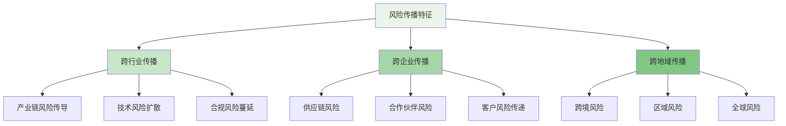
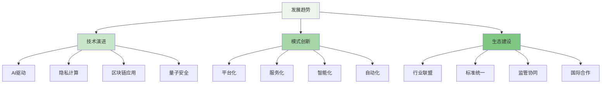

在数字化时代，风险往往具有跨行业、跨企业的传播特性，单一企业的风控能力已难以应对复杂的威胁环境。构建跨行业的风险信息共享机制和联合防控体系，成为提升整体风控效能的重要途径。本章将深入探讨跨行业风险信息共享的架构设计、技术实现、治理机制，以及如何通过联合防控提升整体风险抵御能力。

## 跨行业风险信息共享的必要性

随着数字经济的快速发展，风险的传播方式和影响范围发生了深刻变化。传统的封闭式风控模式已难以应对日益复杂的威胁环境，跨行业的风险信息共享和联合防控成为必然趋势。

### 风险传播的跨域特性



### 信息孤岛的挑战

```yaml
# 信息孤岛带来的挑战
information_silo_challenges:
  detection_limitations:
    name: "检测能力局限"
    description: "单一企业难以识别跨域风险模式"
    impacts:
      - "新型欺诈模式识别延迟"
      - "复杂攻击手法发现困难"
      - "风险趋势判断不准确"
      - "防护策略更新滞后"
  
  response_inadequacy:
    name: "响应能力不足"
    description: "缺乏协同响应机制"
    impacts:
      - "应急处置效率低下"
      - "资源协调困难"
      - "信息同步不及时"
      - "处置效果不理想"
  
  cost_inefficiency:
    name: "成本效率低下"
    description: "重复建设和资源浪费"
    impacts:
      - "技术研发成本高"
      - "信息获取成本大"
      - "防护资源分散"
      - "整体ROI偏低"
  
  innovation_constraints:
    name: "创新受限"
    description: "缺乏协同创新机制"
    impacts:
      - "技术发展缓慢"
      - "最佳实践难推广"
      - "经验积累不充分"
      - "行业标准缺失"
```

## 跨行业信息共享架构设计

构建有效的跨行业风险信息共享体系需要从技术架构、数据标准、安全机制等多个维度进行系统设计。

### 总体架构框架

```python
class CrossIndustryRiskSharingPlatform:
    def __init__(self, config):
        self.config = config
        self.data_standardizer = DataStandardizer()
        self.security_manager = SecurityManager()
        self.privacy_protector = PrivacyProtector()
        self.governance_framework = GovernanceFramework()
        self.participant_manager = ParticipantManager()
    
    def onboard_participant(self, participant_info):
        """参与者接入平台"""
        # 1. 身份验证
        identity_verification = self.verify_participant_identity(participant_info)
        
        # 2. 资质审核
        qualification_review = self.review_participant_qualification(participant_info)
        
        # 3. 协议签署
        agreement_signing = self.sign_participation_agreement(participant_info)
        
        # 4. 权限配置
        access_control = self.configure_participant_access(participant_info)
        
        # 5. 技术对接
        technical_integration = self.integrate_participant_system(participant_info)
        
        return ParticipantOnboardingResult(
            verification=identity_verification,
            qualification=qualification_review,
            agreement=agreement_signing,
            access=access_control,
            integration=technical_integration
        )
    
    def share_risk_information(self, risk_data, sharing_policy):
        """共享风险信息"""
        # 1. 数据标准化
        standardized_data = self.data_standardizer.standardize(risk_data)
        
        # 2. 隐私保护处理
        protected_data = self.privacy_protector.apply_protection(standardized_data)
        
        # 3. 安全传输
        encrypted_data = self.security_manager.encrypt_data(protected_data)
        
        # 4. 分发给授权参与者
        distribution_result = self.distribute_to_participants(encrypted_data, sharing_policy)
        
        # 5. 记录共享日志
        sharing_log = self.record_sharing_activity(risk_data, distribution_result)
        
        return RiskInformationSharingResult(
            standardized=standardized_data,
            protected=protected_data,
            encrypted=encrypted_data,
            distribution=distribution_result,
            log=sharing_log
        )
    
    def receive_risk_information(self, shared_data, participant_id):
        """接收风险信息"""
        # 1. 身份验证
        sender_verification = self.verify_sender_identity(participant_id)
        
        # 2. 数据解密
        decrypted_data = self.security_manager.decrypt_data(shared_data)
        
        # 3. 隐私保护验证
        privacy_compliance = self.privacy_protector.verify_compliance(decrypted_data)
        
        # 4. 数据质量检查
        quality_assessment = self.data_standardizer.assess_quality(decrypted_data)
        
        # 5. 数据入库处理
        storage_result = self.store_received_data(decrypted_data, sender_verification)
        
        return RiskInformationReceptionResult(
            verification=sender_verification,
            decrypted=decrypted_data,
            privacy=privacy_compliance,
            quality=quality_assessment,
            storage=storage_result
        )

class DataStandardizer:
    def __init__(self):
        self.schema_registry = SchemaRegistry()
        self.validation_engine = ValidationEngine()
        self.transformation_engine = TransformationEngine()
    
    def standardize(self, raw_data):
        """标准化风险数据"""
        # 1. 数据格式识别
        data_format = self.identify_data_format(raw_data)
        
        # 2. 格式转换
        converted_data = self.convert_to_standard_format(raw_data, data_format)
        
        # 3. 数据验证
        validation_result = self.validate_data(converted_data)
        
        # 4. 数据丰富化
        enriched_data = self.enrich_data_with_context(converted_data)
        
        # 5. 标准化输出
        standardized_output = self.generate_standardized_output(enriched_data)
        
        return DataStandardizationResult(
            format=data_format,
            converted=converted_data,
            validation=validation_result,
            enriched=enriched_data,
            output=standardized_output
        )
    
    def convert_to_standard_format(self, raw_data, source_format):
        """转换为标准格式"""
        # 获取标准数据模式
        standard_schema = self.schema_registry.get_standard_schema()
        
        # 根据源格式选择转换规则
        transformation_rules = self.schema_registry.get_transformation_rules(source_format)
        
        # 执行数据转换
        converted_data = self.transformation_engine.apply_transformation(
            raw_data,
            standard_schema,
            transformation_rules
        )
        
        return converted_data
    
    def enrich_data_with_context(self, data):
        """丰富数据上下文信息"""
        # 1. 地理位置信息补充
        geo_enrichment = self.enrich_with_geolocation(data)
        
        # 2. 时间上下文补充
        temporal_enrichment = self.enrich_with_temporal_context(geo_enrichment)
        
        # 3. 行业背景补充
        industry_enrichment = self.enrich_with_industry_context(temporal_enrichment)
        
        # 4. 风险标签补充
        risk_enrichment = self.enrich_with_risk_labels(industry_enrichment)
        
        return risk_enrichment
```

### 安全与隐私保护机制

```go
type SecurityAndPrivacyProtection struct {
    EncryptionMechanism     EncryptionMechanism
    AccessControl           AccessControl
    PrivacyPreserving       PrivacyPreserving
    AuditAndCompliance      AuditAndCompliance
}

type EncryptionMechanism struct {
    DataInTransit        string  `json:"data_in_transit"`        // 传输中数据加密
    DataAtRest           string  `json:"data_at_rest"`           // 静态数据加密
    KeyManagement        string  `json:"key_management"`         // 密钥管理
    CertificateAuthority string  `json:"certificate_authority"`  // 证书颁发机构
}

func (sapp *SecurityAndPrivacyProtection) ConfigureEncryption() EncryptionMechanism {
    return EncryptionMechanism{
        DataInTransit:        "TLS 1.3",          // 传输层安全协议
        DataAtRest:           "AES-256-GCM",      // 静态数据加密算法
        KeyManagement:        "Hardware Security Module (HSM)",  // 硬件安全模块
        CertificateAuthority: "Enterprise PKI",   // 企业公钥基础设施
    }
}

type AccessControl struct {
    Authentication       string  `json:"authentication"`       // 身份认证
    Authorization        string  `json:"authorization"`        // 权限授权
    RoleBasedAccess      bool    `json:"role_based_access"`    // 基于角色的访问控制
    AttributeBasedAccess bool    `json:"attribute_based_access"` // 基于属性的访问控制
}

func (sapp *SecurityAndPrivacyProtection) ImplementAccessControl() AccessControl {
    return AccessControl{
        Authentication:       "Multi-factor Authentication (MFA)",  // 多因素认证
        Authorization:        "OAuth 2.0 / OpenID Connect",        // 授权协议
        RoleBasedAccess:      true,                                // 启用基于角色的访问控制
        AttributeBasedAccess: true,                                // 启用基于属性的访问控制
    }
}

type PrivacyPreserving struct {
    DataAnonymization    bool    `json:"data_anonymization"`    // 数据匿名化
    DifferentialPrivacy   bool    `json:"differential_privacy"`  // 差分隐私
    HomomorphicEncryption bool    `json:"homomorphic_encryption"` // 同态加密
    SecureMultiPartyComputation bool `json:"secure_multi_party_computation"` // 安全多方计算
}

func (sapp *SecurityAndPrivacyProtection) ApplyPrivacyPreserving() PrivacyPreserving {
    return PrivacyPreserving{
        DataAnonymization:           true,   // 启用数据匿名化
        DifferentialPrivacy:         true,   // 启用差分隐私
        HomomorphicEncryption:       false,  // 同态加密（计算开销大，选择性启用）
        SecureMultiPartyComputation: true,   // 启用安全多方计算
    }
}
```

## 联合防控机制建设

跨行业的联合防控机制是提升整体风险抵御能力的关键，需要建立完善的协同响应和联合处置体系。

### 联合响应框架

```typescript
interface CollaborativeResponseFramework {
    // 联合事件响应
    jointIncidentResponse(incident: SecurityIncident): Promise<ResponseResult>;
    
    // 协同防御策略
    coordinatedDefenseStrategy(threat: ThreatIntelligence): Promise<DefensePlan>;
    
    // 资源共享机制
    resourceSharing(participants: Participant[], resources: Resource[]): Promise<SharingAgreement>;
    
    // 联合演练组织
    jointExercise(participants: Participant[], scenario: ExerciseScenario): Promise<ExerciseResult>;
}

class CollaborativeResponseSystem implements CollaborativeResponseFramework {
    private incidentManager: IncidentManager;
    private defenseCoordinator: DefenseCoordinator;
    private resourceBroker: ResourceBroker;
    private exerciseOrganizer: ExerciseOrganizer;
    
    async jointIncidentResponse(incident: SecurityIncident): Promise<ResponseResult> {
        // 1. 事件通报
        const incidentNotification = await this.notifyParticipants(incident);
        
        // 2. 情报共享
        const intelligenceSharing = await this.shareIncidentIntelligence(incident);
        
        // 3. 协调响应
        const coordinatedResponse = await this.coordinateResponseActions(incident);
        
        // 4. 资源调配
        const resourceAllocation = await this.allocateEmergencyResources(incident);
        
        // 5. 效果评估
        const responseEvaluation = await this.evaluateResponseEffectiveness(coordinatedResponse);
        
        return new ResponseResult({
            notification: incidentNotification,
            intelligence: intelligenceSharing,
            coordination: coordinatedResponse,
            resources: resourceAllocation,
            evaluation: responseEvaluation,
            timestamp: new Date()
        });
    }
    
    async coordinatedDefenseStrategy(threat: ThreatIntelligence): Promise<DefensePlan> {
        // 1. 威胁分析
        const threatAnalysis = await this.analyzeThreatIntelligence(threat);
        
        // 2. 影响评估
        const impactAssessment = await this.assessThreatImpact(threatAnalysis);
        
        // 3. 策略制定
        const strategyFormulation = await this.formulateDefenseStrategy(impactAssessment);
        
        // 4. 协调实施
        const coordinatedImplementation = await this.coordinateStrategyImplementation(strategyFormulation);
        
        // 5. 监控调整
        const strategyMonitoring = await this.monitorStrategyEffectiveness(coordinatedImplementation);
        
        return new DefensePlan({
            analysis: threatAnalysis,
            impact: impactAssessment,
            strategy: strategyFormulation,
            implementation: coordinatedImplementation,
            monitoring: strategyMonitoring,
            timestamp: new Date()
        });
    }
    
    async resourceSharing(participants: Participant[], resources: Resource[]): Promise<SharingAgreement> {
        // 1. 资源需求评估
        const resourceNeeds = await this.assessResourceNeeds(participants, resources);
        
        // 2. 资源可用性检查
        const availabilityCheck = await this.checkResourceAvailability(resources);
        
        // 3. 共享协议制定
        const sharingProtocol = await this.formulateSharingProtocol(resourceNeeds, availabilityCheck);
        
        // 4. 协议签署
        const agreementSigning = await this.signSharingAgreement(participants, sharingProtocol);
        
        // 5. 执行监控
        const executionMonitoring = await this.monitorResourceSharing(agreementSigning);
        
        return new SharingAgreement({
            needs: resourceNeeds,
            availability: availabilityCheck,
            protocol: sharingProtocol,
            agreement: agreementSigning,
            monitoring: executionMonitoring,
            timestamp: new Date()
        });
    }
    
    private async notifyParticipants(incident: SecurityIncident): Promise<NotificationResult> {
        // 1. 确定通知范围
        const notificationRecipients = this.determineNotificationRecipients(incident);
        
        // 2. 构造通知内容
        const notificationContent = this.constructNotificationContent(incident);
        
        // 3. 发送通知
        const notificationResults = await this.sendNotifications(notificationRecipients, notificationContent);
        
        // 4. 确认接收
        const receiptConfirmation = await this.confirmNotificationReceipt(notificationResults);
        
        return new NotificationResult({
            recipients: notificationRecipients,
            content: notificationContent,
            results: notificationResults,
            confirmation: receiptConfirmation,
            timestamp: new Date()
        });
    }
}
```

### 联合防控治理机制

```yaml
# 联合防控治理机制
collaborative_governance_mechanism:
  governance_structure:
    name: "治理结构"
    description: "建立跨行业的联合防控治理组织"
    components:
      - steering_committee:
          name: "指导委员会"
          responsibilities:
            - "制定合作原则和框架"
            - "协调重大事项决策"
            - "监督合作执行情况"
            - "评估合作效果"
          members:
            - "监管机构代表"
            - "行业协会负责人"
            - "龙头企业安全主管"
            - "技术专家"
            - "法律合规专家"
      
      - working_groups:
          name: "工作组"
          responsibilities:
            - "技术标准制定"
            - "实施方案推进"
            - "最佳实践推广"
            - "问题协调解决"
          focus_areas:
            - "技术实现"
            - "运营管理"
            - "合规要求"
            - "法律事务"
  
  operational_procedures:
    name: "运营程序"
    description: "规范联合防控的日常运营流程"
    procedures:
      - incident_reporting:
          name: "事件报告"
          description: "建立统一的事件报告机制"
          steps:
            - "事件发现"
            - "初步评估"
            - "信息上报"
            - "分类处理"
            - "跟踪反馈"
          requirements:
            - "报告时效性"
            - "信息完整性"
            - "保密性要求"
            - "责任追溯"
      
      - intelligence_sharing:
          name: "情报共享"
          description: "规范威胁情报的共享流程"
          steps:
            - "情报收集"
            - "分析研判"
            - "分级分类"
            - "安全分发"
            - "应用反馈"
          requirements:
            - "情报质量"
            - "时效性保障"
            - "隐私保护"
            - "可信度验证"
      
      - coordinated_response:
          name: "协同响应"
          description: "建立协同响应的执行机制"
          steps:
            - "事件通报"
            - "资源协调"
            - "行动同步"
            - "效果评估"
            - "经验总结"
          requirements:
            - "响应时效"
            - "协调机制"
            - "资源共享"
            - "效果评估"
  
  compliance_framework:
    name: "合规框架"
    description: "确保联合防控活动符合法律法规要求"
    components:
      - legal_compliance:
          name: "法律合规"
          description: "遵守相关法律法规"
          requirements:
            - "数据保护法"
            - "网络安全法"
            - "个人信息保护"
            - "跨境数据传输"
      
      - industry_standards:
          name: "行业标准"
          description: "遵循行业标准和最佳实践"
          requirements:
            - "信息安全标准"
            - "数据治理标准"
            - "风险管理标准"
            - "审计要求"
      
      - ethical_guidelines:
          name: "伦理准则"
          description: "遵循技术伦理和道德规范"
          requirements:
            - "公平性原则"
            - "透明度要求"
            - "隐私保护"
            - "责任担当"
```

## 技术实现方案

跨行业风险信息共享和联合防控需要先进的技术支撑，包括数据标准化、隐私保护计算、区块链等技术的应用。

### 数据标准化与互操作性

```python
class DataInteroperabilityFramework:
    def __init__(self):
        self.schema_registry = SchemaRegistry()
        self.transformation_engine = TransformationEngine()
        self.validation_service = ValidationService()
        self.metadata_manager = MetadataManager()
    
    def register_data_schema(self, schema_definition):
        """注册数据模式"""
        # 1. 模式验证
        validation_result = self.validate_schema_definition(schema_definition)
        
        # 2. 模式注册
        registered_schema = self.schema_registry.register_schema(schema_definition)
        
        # 3. 版本管理
        version_info = self.manage_schema_versions(registered_schema)
        
        # 4. 元数据更新
        metadata_update = self.update_schema_metadata(registered_schema, version_info)
        
        return SchemaRegistrationResult(
            validation=validation_result,
            registration=registered_schema,
            version=version_info,
            metadata=metadata_update
        )
    
    def transform_data(self, source_data, source_schema, target_schema):
        """数据转换"""
        # 1. 数据解析
        parsed_data = self.parse_source_data(source_data, source_schema)
        
        # 2. 映射规则应用
        mapping_result = self.apply_mapping_rules(parsed_data, source_schema, target_schema)
        
        # 3. 数据转换
        transformed_data = self.transformation_engine.transform_data(mapping_result, target_schema)
        
        # 4. 转换验证
        validation_result = self.validate_transformed_data(transformed_data, target_schema)
        
        return DataTransformationResult(
            parsed=parsed_data,
            mapping=mapping_result,
            transformed=transformed_data,
            validation=validation_result
        )
    
    def generate_interoperability_spec(self, participant_schemas):
        """生成互操作性规范"""
        # 1. 模式分析
        schema_analysis = self.analyze_participant_schemas(participant_schemas)
        
        # 2. 差异识别
        differences = self.identify_schema_differences(schema_analysis)
        
        # 3. 映射规则生成
        mapping_rules = self.generate_mapping_rules(differences)
        
        # 4. 互操作性规范生成
        interoperability_spec = self.create_interoperability_specification(mapping_rules)
        
        return InteroperabilitySpecification(
            analysis=schema_analysis,
            differences=differences,
            mappings=mapping_rules,
            specification=interoperability_spec
        )

class PrivacyPreservingComputation:
    def __init__(self):
        self.homomorphic_engine = HomomorphicEncryptionEngine()
        self.differential_privacy = DifferentialPrivacyEngine()
        self.secure_multiparty = SecureMultipartyComputationEngine()
        self.trusted_execution = TrustedExecutionEnvironment()
    
    def apply_differential_privacy(self, data, epsilon=1.0):
        """应用差分隐私"""
        # 1. 敏感数据识别
        sensitive_attributes = self.identify_sensitive_attributes(data)
        
        # 2. 噪声添加
        noisy_data = self.differential_privacy.add_noise(data, sensitive_attributes, epsilon)
        
        # 3. 隐私预算管理
        budget_management = self.manage_privacy_budget(epsilon, sensitive_attributes)
        
        # 4. 效用评估
        utility_assessment = self.assess_data_utility(noisy_data, data)
        
        return DifferentialPrivacyResult(
            sensitive=sensitive_attributes,
            noisy=noisy_data,
            budget=budget_management,
            utility=utility_assessment
        )
    
    def perform_secure_multiparty_computation(self, participant_data, computation_function):
        """执行安全多方计算"""
        # 1. 参与方密钥生成
        participant_keys = self.generate_participant_keys(participant_data)
        
        # 2. 数据加密分片
        encrypted_shares = self.create_encrypted_shares(participant_data, participant_keys)
        
        # 3. 安全计算执行
        secure_computation = self.secure_multiparty.execute_computation(
            encrypted_shares,
            computation_function
        )
        
        # 4. 结果重构
        final_result = self.reconstruct_result(secure_computation, participant_keys)
        
        return SecureMultipartyComputationResult(
            keys=participant_keys,
            shares=encrypted_shares,
            computation=secure_computation,
            result=final_result
        )
```

### 区块链在联合防控中的应用

```go
type BlockchainInCollaborativeDefense struct {
    ImmutableLedger      ImmutableLedger
    SmartContracts       SmartContracts
    DecentralizedIdentity DecentralizedIdentity
    ConsensusMechanism   ConsensusMechanism
}

type ImmutableLedger struct {
    TransactionLogging   bool    `json:"transaction_logging"`   // 交易日志记录
    AuditTrail           bool    `json:"audit_trail"`           // 审计轨迹
    TamperProof          bool    `json:"tamper_proof"`          // 防篡改
    Transparency         bool    `json:"transparency"`          // 透明度
}

func (bicd *BlockchainInCollaborativeDefense) ConfigureImmutableLedger() ImmutableLedger {
    return ImmutableLedger{
        TransactionLogging:   true,   // 启用交易日志记录
        AuditTrail:           true,   // 启用审计轨迹
        TamperProof:          true,   // 启用防篡改机制
        Transparency:         true,   // 启用透明度机制
    }
}

type SmartContracts struct {
    AutomatedExecution   bool    `json:"automated_execution"`   // 自动执行
    RuleEnforcement      bool    `json:"rule_enforcement"`      // 规则执行
    ConditionalLogic     bool    `json:"conditional_logic"`     // 条件逻辑
    EventTriggering      bool    `json:"event_triggering"`      // 事件触发
}

func (bicd *BlockchainInCollaborativeDefense) DeploySmartContracts() SmartContracts {
    return SmartContracts{
        AutomatedExecution:   true,   // 启用自动执行
        RuleEnforcement:      true,   // 启用规则执行
        ConditionalLogic:     true,   // 启用条件逻辑
        EventTriggering:      true,   // 启用事件触发
    }
}

type RiskIntelligenceContract struct {
    ContractAddress      string
    Participants         []Participant
    SharingRules         SharingRules
    ValidationMechanism  ValidationMechanism
}

func (ric *RiskIntelligenceContract) ShareIntelligence(intelligence RiskIntelligence) bool {
    // 1. 验证参与者权限
    if !ric.validateParticipantAccess(intelligence.Provider) {
        return false
    }
    
    // 2. 验证情报质量
    if !ric.validateIntelligenceQuality(intelligence) {
        return false
    }
    
    // 3. 应用共享规则
    if !ric.applySharingRules(intelligence) {
        return false
    }
    
    // 4. 记录到区块链
    transaction := ric.recordToLedger(intelligence)
    
    // 5. 通知接收方
    ric.notifyRecipients(intelligence, transaction)
    
    return true
}

func (ric *RiskIntelligenceContract) validateParticipantAccess(participant Participant) bool {
    for _, p := range ric.Participants {
        if p.ID == participant.ID && p.Status == "ACTIVE" {
            return true
        }
    }
    return false
}
```

## 实践案例与效果评估

通过实际案例分析，我们可以更好地理解跨行业风险信息共享和联合防控的价值和实施要点。

### 金融行业联合反欺诈案例

```typescript
interface FinancialIndustryCollaborativeAntiFraud {
    // 案例背景
    caseBackground: CaseBackground;
    
    // 实施方案
    implementation: ImplementationPlan;
    
    // 技术架构
    technicalArchitecture: TechnicalArchitecture;
    
    // 运营效果
    operationalResults: OperationalResults;
    
    // 经验总结
    lessonsLearned: string[];
}

class FinancialAntiFraudCaseStudy implements FinancialIndustryCollaborativeAntiFraud {
    caseBackground: CaseBackground;
    implementation: ImplementationPlan;
    technicalArchitecture: TechnicalArchitecture;
    operationalResults: OperationalResults;
    lessonsLearned: string[];
    
    constructor() {
        this.caseBackground = {
            industry: "金融行业",
            participants: 15, // 15家主要银行和金融机构
            challenge: "跨行欺诈案件识别困难，单一机构难以发现复杂欺诈模式",
            objective: "建立跨机构的欺诈信息共享和联合防控机制"
        };
        
        this.implementation = {
            timeline: "12个月",
            phases: [
                "第一阶段：基础设施搭建和标准制定（3个月）",
                "第二阶段：试点机构接入和测试（3个月）",
                "第三阶段：全面推广和优化（4个月）",
                "第四阶段：效果评估和持续改进（2个月）"
            ],
            keyActivities: [
                "建立统一的数据标准和共享协议",
                "开发安全的信息共享平台",
                "实施隐私保护技术",
                "建立联合响应机制"
            ]
        };
        
        this.technicalArchitecture = {
            platform: "基于区块链的去中心化信息共享平台",
            technologies: ["区块链", "同态加密", "差分隐私", "联邦学习"],
            security: "多层次安全防护体系",
            interoperability: "支持多种数据格式和系统接口"
        };
        
        this.operationalResults = {
            fraudDetectionRate: 0.75, // 欺诈案件识别率提升75%
            responseTime: 0.60, // 响应时间缩短60%
            falsePositiveRate: 0.30, // 误报率降低30%
            costReduction: 0.40, // 运营成本降低40%
            participantSatisfaction: 0.85 // 参与者满意度85%
        };
        
        this.lessonsLearned = [
            "统一标准是成功的关键，需要在项目初期投入足够时间制定标准",
            "隐私保护技术的应用需要平衡安全性和实用性",
            "治理机制的设计要充分考虑各参与方的利益平衡",
            "技术平台的易用性直接影响参与者的积极性",
            "持续的运营维护和优化是保障长期效果的重要因素"
        ];
    }
    
    async evaluateEffectiveness(): Promise<EffectivenessEvaluation> {
        // 1. 定量指标评估
        const quantitativeMetrics = await this.assessQuantitativeMetrics();
        
        // 2. 定性反馈收集
        const qualitativeFeedback = await this.collectQualitativeFeedback();
        
        // 3. 成本效益分析
        const costBenefitAnalysis = await this.analyzeCostBenefit();
        
        // 4. 风险评估
        const riskAssessment = await this.assessImplementationRisks();
        
        // 5. 综合评价
        const overallEvaluation = this.generateOverallEvaluation(
            quantitativeMetrics,
            qualitativeFeedback,
            costBenefitAnalysis,
            riskAssessment
        );
        
        return new EffectivenessEvaluation({
            quantitative: quantitativeMetrics,
            qualitative: qualitativeFeedback,
            costBenefit: costBenefitAnalysis,
            risk: riskAssessment,
            overall: overallEvaluation,
            timestamp: new Date()
        });
    }
    
    private async assessQuantitativeMetrics(): Promise<QuantitativeMetrics> {
        return {
            detectionRate: this.operationalResults.fraudDetectionRate,
            responseTime: this.operationalResults.responseTime,
            falsePositive: this.operationalResults.falsePositiveRate,
            costSavings: this.operationalResults.costReduction,
            coverage: 0.95, // 95%的参与机构实现有效覆盖
            scalability: 0.80, // 系统具备良好的可扩展性
            reliability: 0.99 // 系统可靠性达到99%
        };
    }
}
```

### 效果评估指标体系

```yaml
# 跨行业风险信息共享效果评估指标体系
effectiveness_evaluation_metrics:
  security_effectiveness:
    name: "安全有效性"
    description: "评估联合防控对安全风险的控制效果"
    metrics:
      - threat_detection_rate:
          name: "威胁检测率"
          description: "成功检测的威胁占总威胁的比例"
          target: "> 80%"
          measurement: "检测到的威胁数 / 总威胁数"
      
      - response_time_reduction:
          name: "响应时间缩短"
          description: "联合响应相比独立响应的时间缩短比例"
          target: "> 50%"
          measurement: "(独立响应时间 - 联合响应时间) / 独立响应时间"
      
      - incident_prevention:
          name: "事件预防率"
          description: "通过联合防控预防的事件占潜在事件的比例"
          target: "> 60%"
          measurement: "预防的事件数 / 潜在事件数"
  
  operational_efficiency:
    name: "运营效率"
    description: "评估联合防控对运营效率的提升效果"
    metrics:
      - cost_reduction:
          name: "成本降低"
          description: "实施联合防控后的成本降低比例"
          target: "> 30%"
          measurement: "(实施前成本 - 实施后成本) / 实施前成本"
      
      - resource_utilization:
          name: "资源利用率"
          description: "共享资源的利用效率"
          target: "> 70%"
          measurement: "实际使用资源 / 可用资源"
      
      - deployment_speed:
          name: "部署速度"
          description: "新策略或新功能的部署速度提升"
          target: "> 50%"
          measurement: "(传统部署时间 - 联合部署时间) / 传统部署时间"
  
  collaboration_quality:
    name: "协作质量"
    description: "评估跨行业协作的质量和效果"
    metrics:
      - participant_satisfaction:
          name: "参与者满意度"
          description: "参与者对联合防控机制的满意度"
          target: "> 80%"
          measurement: "满意度调查平均分"
      
      - information_sharing_frequency:
          name: "信息共享频率"
          description: "单位时间内信息共享的次数"
          target: "> 100次/月"
          measurement: "月度信息共享次数"
      
      - collaborative_incident_resolution:
          name: "协同事件解决率"
          description: "通过协同机制解决的事件占总事件的比例"
          target: "> 70%"
          measurement: "协同解决事件数 / 总事件数"
```

## 发展趋势与战略建议

跨行业风险信息共享和联合防控是未来风控发展的重要方向，需要从战略高度进行规划和实施。

### 发展趋势展望



### 战略实施建议

1. **顶层设计**：从战略高度规划跨行业联合防控体系，明确目标、路径和时间表

2. **标准先行**：优先制定统一的数据标准、技术标准和操作规范，为协作奠定基础

3. **试点示范**：选择重点行业和典型场景开展试点，积累经验后再逐步推广

4. **技术保障**：加大隐私保护、区块链等关键技术的研发投入，确保技术先进性

5. **治理完善**：建立健全的治理机制，平衡各方利益，确保协作的可持续性

通过系统性地推进跨行业风险信息共享和联合防控，可以显著提升整体风险抵御能力，构建更加安全、高效的数字生态环境。这不仅是技术发展的必然趋势，也是应对复杂风险挑战的必要举措。