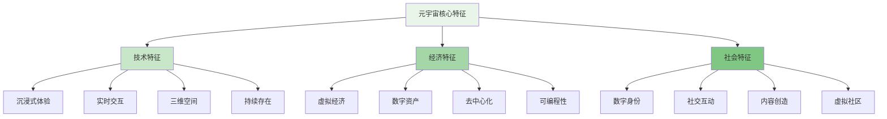
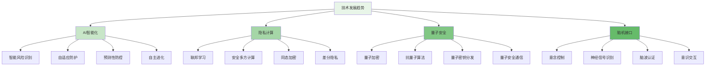

随着元宇宙概念的兴起和虚拟资产的快速发展，数字世界中的风险防控面临着全新的挑战。虚拟资产的价值波动、数字身份的认证、虚拟空间的安全等问题，都需要创新的风控技术和方法。本章将深入探讨虚拟资产与元宇宙环境下的风险特征、技术挑战和防控策略，为构建适应未来数字世界的智能风控体系提供指导。

## 元宇宙与虚拟资产概述

元宇宙作为下一代互联网形态，正在重新定义数字世界的交互方式和价值体系。虚拟资产作为元宇宙经济系统的核心要素，其独特的属性和风险特征对传统风控模式提出了新的挑战。

### 元宇宙的核心特征



### 虚拟资产的类型与特征

```yaml
# 虚拟资产分类与特征
virtual_assets_classification:
  digital_currency:
    name: "数字货币"
    description: "基于区块链技术的数字化货币"
    types:
      - cryptocurrency:
          name: "加密货币"
          examples: ["Bitcoin", "Ethereum", "Solana"]
          characteristics:
            - "去中心化"
            - "加密安全"
            - "全球流通"
            - "价值波动大"
      
      - central_bank_digital_currency:
          name: "央行数字货币"
          examples: ["Digital Yuan", "Digital Dollar"]
          characteristics:
            - "中心化管理"
            - "法定货币地位"
            - "稳定性较高"
            - "监管合规"
  
  non_fungible_tokens:
    name: "非同质化代币"
    description: "代表独特数字资产的代币"
    types:
      - digital_art:
          name: "数字艺术品"
          examples: ["CryptoPunks", "Bored Ape Yacht Club"]
          characteristics:
            - "唯一性"
            - "收藏价值"
            - "版权属性"
            - "投机性强"
      
      - virtual_real_estate:
          name: "虚拟地产"
          examples: ["Decentraland", "The Sandbox"]
          characteristics:
            - "空间属性"
            - "稀缺性"
            - "位置价值"
            - "开发潜力"
  
  virtual_goods:
    name: "虚拟商品"
    description: "游戏或平台内的数字化商品"
    types:
      - in_game_items:
          name: "游戏道具"
          examples: ["武器装备", "皮肤外观", "角色道具"]
          characteristics:
            - "功能性"
            - "娱乐属性"
            - "平台依赖"
            - "生命周期短"
      
      - digital_services:
          name: "数字服务"
          examples: ["虚拟会议", "在线教育", "数字咨询"]
          characteristics:
            - "服务属性"
            - "时效性"
            - "体验导向"
            - "个性化"
```

## 虚拟资产风险分析

虚拟资产的特殊属性使其面临不同于传统资产的独特风险，需要针对性的风险识别和防控措施。

### 市场风险

```python
class VirtualAssetMarketRisk:
    def __init__(self):
        self.volatility_analyzer = VolatilityAnalyzer()
        self.liquidity_assessor = LiquidityAssessor()
        self.speculation_detector = SpeculationDetector()
    
    def analyze_price_volatility(self, asset_data):
        """分析价格波动风险"""
        # 1. 历史波动率计算
        historical_volatility = self.volatility_analyzer.calculate_historical_volatility(asset_data.prices)
        
        # 2. 预测波动率建模
        predicted_volatility = self.volatility_analyzer.predict_future_volatility(asset_data)
        
        # 3. 极端波动检测
        extreme_events = self.volatility_analyzer.detect_extreme_volatility(asset_data.prices)
        
        # 4. 风险评级
        volatility_risk_level = self.volatility_analyzer.assess_risk_level(historical_volatility)
        
        return PriceVolatilityAnalysis(
            historical=historical_volatility,
            predicted=predicted_volatility,
            extreme_events=extreme_events,
            risk_level=volatility_risk_level,
            timestamp=datetime.now()
        )
    
    def assess_liquidity_risk(self, market_data):
        """评估流动性风险"""
        # 1. 交易量分析
        trading_volume_analysis = self.liquidity_assessor.analyze_trading_volume(market_data.volume)
        
        # 2. 买卖价差评估
        spread_analysis = self.liquidity_assessor.evaluate_bid_ask_spread(market_data.spread)
        
        # 3. 市场深度分析
        depth_analysis = self.liquidity_assessor.analyze_market_depth(market_data.order_book)
        
        # 4. 流动性风险评级
        liquidity_risk = self.liquidity_assessor.assess_liquidity_risk(
            trading_volume_analysis,
            spread_analysis,
            depth_analysis
        )
        
        return LiquidityRiskAssessment(
            volume=trading_volume_analysis,
            spread=spread_analysis,
            depth=depth_analysis,
            risk=liquidity_risk,
            timestamp=datetime.now()
        )
    
    def detect_speculative_trading(self, trading_patterns):
        """检测投机交易行为"""
        # 1. 交易频率分析
        frequency_analysis = self.speculation_detector.analyze_trading_frequency(trading_patterns)
        
        # 2. 价格操纵识别
        manipulation_detection = self.speculation_detector.detect_price_manipulation(trading_patterns)
        
        # 3. 异常交易模式识别
        anomaly_patterns = self.speculation_detector.identify_anomalous_patterns(trading_patterns)
        
        # 4. 投机风险评估
        speculation_risk = self.speculation_detector.assess_speculation_risk(
            frequency_analysis,
            manipulation_detection,
            anomaly_patterns
        )
        
        return SpeculationDetectionResult(
            frequency=frequency_analysis,
            manipulation=manipulation_detection,
            anomalies=anomaly_patterns,
            risk=speculation_risk,
            timestamp=datetime.now()
        )

class VolatilityAnalyzer:
    def calculate_historical_volatility(self, prices, window=30):
        """计算历史波动率"""
        # 计算日收益率
        returns = self.calculate_returns(prices)
        
        # 计算滚动波动率
        rolling_volatility = returns.rolling(window=window).std() * np.sqrt(252)  # 年化波动率
        
        # 统计特征
        volatility_stats = {
            'mean': rolling_volatility.mean(),
            'std': rolling_volatility.std(),
            'max': rolling_volatility.max(),
            'min': rolling_volatility.min(),
            'current': rolling_volatility.iloc[-1]
        }
        
        return HistoricalVolatility(
            series=rolling_volatility,
            stats=volatility_stats,
            window=window
        )
    
    def predict_future_volatility(self, asset_data):
        """预测未来波动率"""
        # 使用GARCH模型预测
        garch_model = self.fit_garch_model(asset_data.prices)
        forecast = garch_model.forecast(horizon=30)  # 预测未来30天
        
        # 使用机器学习模型预测
        ml_prediction = self.ml_volatility_forecast(asset_data)
        
        return VolatilityForecast(
            garch=forecast,
            machine_learning=ml_prediction,
            confidence_interval=self.calculate_confidence_interval(forecast)
        )
```

### 安全风险

```go
type VirtualAssetSecurityRisk struct {
    CyberAttackRisk      CyberAttackRisk
    SmartContractRisk    SmartContractRisk
    PrivateKeyRisk       PrivateKeyRisk
    ExchangeRisk         ExchangeRisk
}

type CyberAttackRisk struct {
    AttackVectors        []string  `json:"attack_vectors"`        // 攻击向量
    VulnerabilityLevel   float64   `json:"vulnerability_level"`   // 漏洞等级
    DetectionCapability  float64   `json:"detection_capability"`  // 检测能力
    ResponseReadiness    float64   `json:"response_readiness"`    // 响应准备度
}

func (vasr *VirtualAssetSecurityRisk) AssessCyberAttackRisk() CyberAttackRisk {
    return CyberAttackRisk{
        AttackVectors: []string{
            "DDoS攻击",
            "钓鱼攻击",
            "恶意软件",
            "社会工程学攻击",
            "零日漏洞利用",
        },
        VulnerabilityLevel:   0.75,  // 75%漏洞风险等级
        DetectionCapability:  0.60,  // 60%检测能力
        ResponseReadiness:    0.55,  // 55%响应准备度
    }
}

type SmartContractRisk struct {
    CodeVulnerabilities  float64   `json:"code_vulnerabilities"`  // 代码漏洞
    AuditCoverage        float64   `json:"audit_coverage"`        // 审计覆盖率
    UpgradeMechanism     string    `json:"upgrade_mechanism"`     // 升级机制
    GovernanceRisk       float64   `json:"governance_risk"`       // 治理风险
}

func (vasr *VirtualAssetSecurityRisk) EvaluateSmartContractRisk() SmartContractRisk {
    return SmartContractRisk{
        CodeVulnerabilities:  0.65,  // 65%代码漏洞风险
        AuditCoverage:        0.40,  // 40%审计覆盖率
        UpgradeMechanism:     "可升级代理模式",
        GovernanceRisk:       0.50,  // 50%治理风险
    }
}

type PrivateKeyRisk struct {
    StorageSecurity      float64   `json:"storage_security"`      // 存储安全
    AccessControl        float64   `json:"access_control"`        // 访问控制
    BackupMechanism      string    `json:"backup_mechanism"`      // 备份机制
    RecoveryProcess      string    `json:"recovery_process"`      // 恢复流程
}

func (vasr *VirtualAssetSecurityRisk) AnalyzePrivateKeyRisk() PrivateKeyRisk {
    return PrivateKeyRisk{
        StorageSecurity:      0.55,  // 55%存储安全
        AccessControl:        0.60,  // 60%访问控制
        BackupMechanism:      "多重签名+硬件钱包",
        RecoveryProcess:      "助记词+社交恢复",
    }
}

type ExchangeRisk struct {
    PlatformSecurity     float64   `json:"platform_security"`     // 平台安全
    CustodyRisk          float64   `json:"custody_risk"`          // 托管风险
    RegulatoryCompliance float64   `json:"regulatory_compliance"` // 监管合规
    BusinessContinuity   float64   `json:"business_continuity"`   // 业务连续性
}

func (vasr *VirtualAssetSecurityRisk) ReviewExchangeRisk() ExchangeRisk {
    return ExchangeRisk{
        PlatformSecurity:     0.70,  // 70%平台安全
        CustodyRisk:          0.65,  // 65%托管风险
        RegulatoryCompliance: 0.50,  // 50%监管合规
        BusinessContinuity:   0.55,  // 55%业务连续性
    }
}
```

## 元宇宙环境下的新型风险

元宇宙作为一个全新的数字环境，带来了传统风控模式难以覆盖的新型风险类型。

### 数字身份风险

```typescript
interface DigitalIdentityRisk {
    // 身份伪造风险
    identityForgery(digitalIdentity: DigitalIdentity): Promise<ForgeryRiskAssessment>;
    
    // 身份盗用风险
    identityTheft(digitalIdentity: DigitalIdentity): Promise<TheftRiskAssessment>;
    
    // 身份滥用风险
    identityMisuse(digitalIdentity: DigitalIdentity): Promise<MisuseRiskAssessment>;
    
    // 身份隐私风险
    identityPrivacy(digitalIdentity: DigitalIdentity): Promise<PrivacyRiskAssessment>;
}

class DigitalIdentityRiskManager implements DigitalIdentityRisk {
    private identityVerifier: IdentityVerifier;
    private behaviorAnalyzer: BehaviorAnalyzer;
    private privacyProtector: PrivacyProtector;
    private fraudDetector: FraudDetector;
    
    async identityForgery(digitalIdentity: DigitalIdentity): Promise<ForgeryRiskAssessment> {
        // 1. 身份验证强度评估
        const verificationStrength = await this.identityVerifier.assessVerificationStrength(digitalIdentity);
        
        // 2. 生物特征一致性检查
        const biometricConsistency = await this.identityVerifier.checkBiometricConsistency(digitalIdentity);
        
        // 3. 历史行为模式分析
        const behavioralPattern = await this.behaviorAnalyzer.analyzeBehavioralPatterns(digitalIdentity);
        
        // 4. 伪造风险评估
        const forgeryRisk = this.calculateForgeryRisk(verificationStrength, biometricConsistency, behavioralPattern);
        
        return new ForgeryRiskAssessment({
            verification: verificationStrength,
            biometric: biometricConsistency,
            behavioral: behavioralPattern,
            risk: forgeryRisk,
            timestamp: new Date()
        });
    }
    
    async identityTheft(digitalIdentity: DigitalIdentity): Promise<TheftRiskAssessment> {
        // 1. 异常登录检测
        const loginAnomalies = await this.detectLoginAnomalies(digitalIdentity);
        
        // 2. 设备指纹分析
        const deviceFingerprinting = await this.analyzeDeviceFingerprints(digitalIdentity);
        
        // 3. 地理位置异常检测
        const locationAnomalies = await this.detectLocationAnomalies(digitalIdentity);
        
        // 4. 盗用风险评估
        const theftRisk = this.calculateTheftRisk(loginAnomalies, deviceFingerprinting, locationAnomalies);
        
        return new TheftRiskAssessment({
            login: loginAnomalies,
            device: deviceFingerprinting,
            location: locationAnomalies,
            risk: theftRisk,
            timestamp: new Date()
        });
    }
    
    async identityMisuse(digitalIdentity: DigitalIdentity): Promise<MisuseRiskAssessment> {
        // 1. 权限使用分析
        const permissionUsage = await this.analyzePermissionUsage(digitalIdentity);
        
        // 2. 行为偏离检测
        const behavioralDeviation = await this.detectBehavioralDeviations(digitalIdentity);
        
        // 3. 内容发布监控
        const contentMonitoring = await this.monitorContentPublishing(digitalIdentity);
        
        // 4. 滥用风险评估
        const misuseRisk = this.calculateMisuseRisk(permissionUsage, behavioralDeviation, contentMonitoring);
        
        return new MisuseRiskAssessment({
            permission: permissionUsage,
            behavioral: behavioralDeviation,
            content: contentMonitoring,
            risk: misuseRisk,
            timestamp: new Date()
        });
    }
    
    async identityPrivacy(digitalIdentity: DigitalIdentity): Promise<PrivacyRiskAssessment> {
        // 1. 数据收集范围评估
        const dataCollectionScope = await this.assessDataCollectionScope(digitalIdentity);
        
        // 2. 隐私设置合规性检查
        const privacyCompliance = await this.checkPrivacySettingCompliance(digitalIdentity);
        
        // 3. 第三方数据共享分析
        const thirdPartySharing = await this.analyzeThirdPartyDataSharing(digitalIdentity);
        
        // 4. 隐私风险评估
        const privacyRisk = this.calculatePrivacyRisk(dataCollectionScope, privacyCompliance, thirdPartySharing);
        
        return new PrivacyRiskAssessment({
            collection: dataCollectionScope,
            compliance: privacyCompliance,
            sharing: thirdPartySharing,
            risk: privacyRisk,
            timestamp: new Date()
        });
    }
    
    private async detectLoginAnomalies(digitalIdentity: DigitalIdentity): Promise<LoginAnomalyDetection> {
        // 1. 时间模式分析
        const timePattern = this.analyzeLoginTimePatterns(digitalIdentity.loginHistory);
        
        // 2. 频率异常检测
        const frequencyAnomalies = this.detectLoginFrequencyAnomalies(digitalIdentity.loginHistory);
        
        // 3. 成功率分析
        const successRate = this.calculateLoginSuccessRate(digitalIdentity.loginHistory);
        
        // 4. 异常评分
        const anomalyScore = this.calculateLoginAnomalyScore(timePattern, frequencyAnomalies, successRate);
        
        return new LoginAnomalyDetection({
            timePattern: timePattern,
            frequency: frequencyAnomalies,
            successRate: successRate,
            score: anomalyScore,
            timestamp: new Date()
        });
    }
}
```

### 虚拟空间安全风险

```yaml
# 虚拟空间安全风险
virtual_space_security_risks:
  spatial_intrusion:
    name: "空间入侵"
    description: "未经授权进入虚拟空间或区域"
    attack_vectors:
      - unauthorized_access:
          name: "未授权访问"
          description: "通过漏洞或弱认证进入受限区域"
          prevention:
            - "强化访问控制"
            - "多因素认证"
            - "权限最小化"
            - "实时监控"
      
      - virtual_trespassing:
          name: "虚拟侵入"
          description: "非法进入私人虚拟空间"
          prevention:
            - "边界防护"
            - "隐私设置"
            - "举报机制"
            - "法律保护"
  
  content_moderation:
    name: "内容审核"
    description: "虚拟空间中的不当内容管理"
    risk_types:
      - harmful_content:
          name: "有害内容"
          description: "暴力、色情、仇恨言论等"
          detection_methods:
            - "AI内容识别"
            - "用户举报"
            - "关键词过滤"
            - "社区监督"
      
      - intellectual_property:
          name: "知识产权侵犯"
          description: "盗用他人创作内容"
          detection_methods:
            - "数字水印"
            - "内容指纹"
            - "侵权举报"
            - "区块链确权"
  
  economic_disruption:
    name: "经济扰乱"
    description: "虚拟经济系统的恶意干扰"
    attack_types:
      - market_manipulation:
          name: "市场操纵"
          description: "通过虚假交易影响资产价格"
          prevention:
            - "交易监控"
            - "异常检测"
            - "价格稳定机制"
            - "透明度提升"
      
      - resource_hoarding:
          name: "资源囤积"
          description: "恶意囤积稀缺虚拟资源"
          prevention:
            - "限购机制"
            - "资源释放"
            - "市场调节"
            - "反垄断监管"
```

## 元宇宙风控技术架构

面对元宇宙环境下的新型风险，需要构建适应性的风控技术架构，整合多种先进技术手段。

### 分布式身份认证体系

```python
class DecentralizedIdentityAuthentication:
    def __init__(self):
        self.blockchain_identity = BlockchainIdentity()
        self.biometric_verifier = BiometricVerifier()
        self.behavior_analyzer = BehaviorAnalyzer()
        self.reputation_system = ReputationSystem()
    
    def authenticate_user(self, identity_claim, authentication_context):
        """用户身份认证"""
        # 1. 区块链身份验证
        blockchain_verification = self.blockchain_identity.verify_identity(identity_claim)
        
        # 2. 生物特征验证
        biometric_verification = self.biometric_verifier.verify_biometrics(
            identity_claim.biometric_data,
            authentication_context
        )
        
        # 3. 行为模式分析
        behavioral_analysis = self.behavior_analyzer.analyze_user_behavior(
            identity_claim.user_id,
            authentication_context
        )
        
        # 4. 声誉评分检查
        reputation_score = self.reputation_system.get_user_reputation(identity_claim.user_id)
        
        # 5. 综合认证决策
        authentication_result = self.make_authentication_decision(
            blockchain_verification,
            biometric_verification,
            behavioral_analysis,
            reputation_score
        )
        
        return DigitalIdentityAuthenticationResult(
            blockchain=blockchain_verification,
            biometric=biometric_verification,
            behavioral=behavioral_analysis,
            reputation=reputation_score,
            result=authentication_result,
            timestamp=datetime.now()
        )
    
    def manage_digital_identity(self, user_id, identity_operations):
        """数字身份管理"""
        # 1. 身份信息更新
        identity_update = self.update_identity_information(user_id, identity_operations)
        
        # 2. 权限管理
        permission_management = self.manage_user_permissions(user_id, identity_operations)
        
        # 3. 隐私设置
        privacy_configuration = self.configure_privacy_settings(user_id, identity_operations)
        
        # 4. 安全审计
        security_audit = self.audit_identity_operations(user_id, identity_operations)
        
        return DigitalIdentityManagementResult(
            update=identity_update,
            permissions=permission_management,
            privacy=privacy_configuration,
            audit=security_audit,
            timestamp=datetime.now()
        )
    
    def detect_identity_anomalies(self, user_activities):
        """检测身份异常行为"""
        # 1. 异常登录检测
        login_anomalies = self.detect_login_anomalies(user_activities.login_events)
        
        # 2. 行为模式偏离
        behavioral_deviations = self.detect_behavioral_deviations(user_activities.user_actions)
        
        # 3. 权限滥用检测
        permission_abuse = self.detect_permission_abuse(user_activities.permission_requests)
        
        # 4. 综合异常评估
        anomaly_assessment = self.assess_identity_anomalies(
            login_anomalies,
            behavioral_deviations,
            permission_abuse
        )
        
        return IdentityAnomalyDetectionResult(
            login=login_anomalies,
            behavioral=behavioral_deviations,
            permission=permission_abuse,
            assessment=anomaly_assessment,
            timestamp=datetime.now()
        )

class BlockchainIdentity:
    def __init__(self):
        self.identity_contract = IdentitySmartContract()
        self.did_registry = DecentralizedIdentityRegistry()
        self.verifiable_credential = VerifiableCredentialManager()
    
    def verify_identity(self, identity_claim):
        """验证区块链身份"""
        # 1. DID解析
        did_document = self.did_registry.resolve_did(identity_claim.did)
        
        # 2. 凭证验证
        credential_verification = self.verifiable_credential.verify_credential(
            identity_claim.credential,
            did_document
        )
        
        # 3. 链上状态检查
        on_chain_status = self.identity_contract.check_identity_status(identity_claim.did)
        
        # 4. 综合验证结果
        verification_result = self.combine_verification_results(
            did_document,
            credential_verification,
            on_chain_status
        )
        
        return BlockchainIdentityVerification(
            did=did_document,
            credential=credential_verification,
            on_chain=on_chain_status,
            result=verification_result,
            timestamp=datetime.now()
        )
```

### 虚拟资产安全防护

```go
type VirtualAssetSecurityProtection struct {
    AssetRegistration    AssetRegistration
    OwnershipVerification OwnershipVerification
    TransactionMonitoring TransactionMonitoring
    SmartContractSecurity SmartContractSecurity
}

type AssetRegistration struct {
    UniqueIdentification bool    `json:"unique_identification"` // 唯一标识
    MetadataManagement   bool    `json:"metadata_management"`   // 元数据管理
    ProvenanceTracking   bool    `json:"provenance_tracking"`   // 来源追踪
    StandardsCompliance  bool    `json:"standards_compliance"`  // 标准合规
}

func (vasp *VirtualAssetSecurityProtection) SetupAssetRegistration() AssetRegistration {
    return AssetRegistration{
        UniqueIdentification: true,   // 启用唯一标识
        MetadataManagement:   true,   // 启用元数据管理
        ProvenanceTracking:   true,   // 启用来源追踪
        StandardsCompliance:  true,   // 启用标准合规
    }
}

type OwnershipVerification struct {
    MultiSignature       bool    `json:"multi_signature"`       // 多重签名
    HardwareWallet       bool    `json:"hardware_wallet"`       // 硬件钱包
    SocialRecovery       bool    `json:"social_recovery"`       // 社交恢复
    BiometricAuth        bool    `json:"biometric_auth"`        // 生物识别认证
}

func (vasp *VirtualAssetSecurityProtection) ConfigureOwnershipVerification() OwnershipVerification {
    return OwnershipVerification{
        MultiSignature:       true,   // 启用多重签名
        HardwareWallet:       true,   // 启用硬件钱包
        SocialRecovery:       true,   // 启用社交恢复
        BiometricAuth:        true,   // 启用生物识别认证
    }
}

type TransactionMonitoring struct {
    RealTimeScanning     bool    `json:"real_time_scanning"`    // 实时扫描
    AnomalyDetection     bool    `json:"anomaly_detection"`     // 异常检测
    RiskScoring          bool    `json:"risk_scoring"`          // 风险评分
    AutomatedResponse    bool    `json:"automated_response"`    // 自动响应
}

func (vasp *VirtualAssetSecurityProtection) EnableTransactionMonitoring() TransactionMonitoring {
    return TransactionMonitoring{
        RealTimeScanning:     true,   // 启用实时扫描
        AnomalyDetection:     true,   // 启用异常检测
        RiskScoring:          true,   // 启用风险评分
        AutomatedResponse:    true,   // 启用自动响应
    }
}

type SmartContractSecurity struct {
    CodeAudit            bool    `json:"code_audit"`            // 代码审计
    FormalVerification   bool    `json:"formal_verification"`   // 形式化验证
    UpgradeMechanism     string  `json:"upgrade_mechanism"`     // 升级机制
    EmergencyStop        bool    `json:"emergency_stop"`        // 紧急停止
}

func (vasp *VirtualAssetSecurityProtection) ImplementSmartContractSecurity() SmartContractSecurity {
    return SmartContractSecurity{
        CodeAudit:            true,        // 启用代码审计
        FormalVerification:   true,        // 启用形式化验证
        UpgradeMechanism:     "代理模式",   // 使用代理升级模式
        EmergencyStop:        true,        // 启用紧急停止功能
    }
}
```

## 风控策略与实施路径

针对元宇宙和虚拟资产环境下的风险特征，需要制定相应的风控策略和实施路径。

### 分层防护策略

```typescript
interface LayeredProtectionStrategy {
    // 感知层防护
    perceptionLayerProtection(environment: VirtualEnvironment): Promise<PerceptionProtectionResult>;
    
    // 网络层防护
    networkLayerProtection(network: VirtualNetwork): Promise<NetworkProtectionResult>;
    
    // 应用层防护
    applicationLayerProtection(application: VirtualApplication): Promise<ApplicationProtectionResult>;
    
    // 数据层防护
    dataLayerProtection(data: VirtualData): Promise<DataProtectionResult>;
}

class MetaverseRiskProtectionStrategy implements LayeredProtectionStrategy {
    private perceptionProtector: PerceptionLayerProtector;
    private networkProtector: NetworkLayerProtector;
    private applicationProtector: ApplicationLayerProtector;
    private dataProtector: DataLayerProtector;
    
    async perceptionLayerProtection(environment: VirtualEnvironment): Promise<PerceptionProtectionResult> {
        // 1. 环境感知监控
        const environmentMonitoring = await this.perceptionProtector.monitorEnvironment(environment);
        
        // 2. 异常行为检测
        const anomalyDetection = await this.perceptionProtector.detectAnomalies(environmentMonitoring);
        
        // 3. 威胁评估
        const threatAssessment = await this.perceptionProtector.assessThreats(anomalyDetection);
        
        // 4. 防护响应
        const protectionResponse = await this.perceptionProtector.respondToThreats(threatAssessment);
        
        return new PerceptionProtectionResult({
            monitoring: environmentMonitoring,
            anomalies: anomalyDetection,
            threats: threatAssessment,
            response: protectionResponse,
            timestamp: new Date()
        });
    }
    
    async networkLayerProtection(network: VirtualNetwork): Promise<NetworkProtectionResult> {
        // 1. 网络流量监控
        const trafficMonitoring = await this.networkProtector.monitorTraffic(network);
        
        // 2. 入侵检测
        const intrusionDetection = await this.networkProtector.detectIntrusions(trafficMonitoring);
        
        // 3. 访问控制
        const accessControl = await this.networkProtector.enforceAccessControl(network);
        
        // 4. 安全响应
        const securityResponse = await this.networkProtector.respondToSecurityEvents(intrusionDetection);
        
        return new NetworkProtectionResult({
            traffic: trafficMonitoring,
            intrusion: intrusionDetection,
            access: accessControl,
            response: securityResponse,
            timestamp: new Date()
        });
    }
    
    async applicationLayerProtection(application: VirtualApplication): Promise<ApplicationProtectionResult> {
        // 1. 应用行为监控
        const behaviorMonitoring = await this.applicationProtector.monitorApplicationBehavior(application);
        
        // 2. 漏洞扫描
        const vulnerabilityScanning = await this.applicationProtector.scanVulnerabilities(application);
        
        // 3. 代码安全检测
        const codeSecurity = await this.applicationProtector.checkCodeSecurity(application);
        
        // 4. 应用防护响应
        const protectionResponse = await this.applicationProtector.respondToApplicationThreats(
            behaviorMonitoring,
            vulnerabilityScanning,
            codeSecurity
        );
        
        return new ApplicationProtectionResult({
            behavior: behaviorMonitoring,
            vulnerability: vulnerabilityScanning,
            code: codeSecurity,
            response: protectionResponse,
            timestamp: new Date()
        });
    }
    
    async dataLayerProtection(data: VirtualData): Promise<DataProtectionResult> {
        // 1. 数据分类标记
        const dataClassification = await this.dataProtector.classifyData(data);
        
        // 2. 数据加密保护
        const dataEncryption = await this.dataProtector.encryptData(dataClassification);
        
        // 3. 数据访问控制
        const accessControl = await this.dataProtector.enforceDataAccessControl(dataEncryption);
        
        // 4. 数据泄露防护
        const dlpProtection = await this.dataProtector.preventDataLeaks(accessControl);
        
        return new DataProtectionResult({
            classification: dataClassification,
            encryption: dataEncryption,
            access: accessControl,
            dlp: dlpProtection,
            timestamp: new Date()
        });
    }
}
```

### 实施路径规划

```yaml
# 元宇宙风控实施路径
metaverse_risk_control_implementation:
  phase_1_foundation:
    name: "基础建设阶段"
    duration: "6-12个月"
    objectives:
      - "建立元宇宙风控基础架构"
      - "制定虚拟资产安全标准"
      - "构建数字身份认证体系"
      - "部署基础监控系统"
    key_activities:
      - "技术选型与架构设计"
      - "安全标准制定"
      - "身份认证系统开发"
      - "基础监控平台搭建"
      - "团队能力建设"
    deliverables:
      - "元宇宙风控架构设计文档"
      - "虚拟资产安全标准"
      - "数字身份认证系统"
      - "基础监控平台"
  
  phase_2_pilot:
    name: "试点验证阶段"
    duration: "3-6个月"
    objectives:
      - "在典型场景中验证风控能力"
      - "优化风控策略和算法"
      - "完善系统功能和性能"
      - "积累运营经验"
    key_activities:
      - "选择试点场景"
      - "部署风控系统"
      - "策略调优"
      - "性能优化"
      - "运营流程建立"
    deliverables:
      - "试点场景风控方案"
      - "优化后的风控策略"
      - "性能优化报告"
      - "运营流程文档"
  
  phase_3_scale:
    name: "规模化部署阶段"
    duration: "6-12个月"
    objectives:
      - "全面部署风控系统"
      - "建立完整的风控体系"
      - "实现自动化运营"
      - "持续优化改进"
    key_activities:
      - "系统全面部署"
      - "风控体系完善"
      - "自动化工具开发"
      - "持续优化机制"
      - "效果评估改进"
    deliverables:
      - "全面部署的风控系统"
      - "完整的风控体系"
      - "自动化运营工具"
      - "持续优化机制"
```

## 监管合规与标准建设

元宇宙和虚拟资产的发展需要完善的监管框架和标准体系作为保障。

### 监管框架设计

```python
class RegulatoryComplianceFramework:
    def __init__(self):
        self.compliance_monitor = ComplianceMonitor()
        self.reporting_system = ReportingSystem()
        self.audit_trail = AuditTrailManager()
        self.policy_engine = PolicyEngine()
    
    def ensure_regulatory_compliance(self, business_operations):
        """确保监管合规"""
        # 1. 合规要求识别
        compliance_requirements = self.identify_compliance_requirements(business_operations)
        
        # 2. 合规状态监控
        compliance_status = self.compliance_monitor.monitor_compliance(business_operations, compliance_requirements)
        
        # 3. 违规风险评估
        violation_risk = self.assess_violation_risk(compliance_status)
        
        # 4. 合规改进建议
        improvement_recommendations = self.generate_compliance_improvements(violation_risk)
        
        return RegulatoryComplianceResult(
            requirements=compliance_requirements,
            status=compliance_status,
            risk=violation_risk,
            improvements=improvement_recommendations,
            timestamp=datetime.now()
        )
    
    def generate_regulatory_reports(self, reporting_period):
        """生成监管报告"""
        # 1. 数据收集
        report_data = self.collect_report_data(reporting_period)
        
        # 2. 数据验证
        data_validation = self.validate_report_data(report_data)
        
        # 3. 报告生成
        regulatory_report = self.reporting_system.generate_report(report_data, data_validation)
        
        # 4. 报告提交
        submission_result = self.submit_regulatory_report(regulatory_report)
        
        return RegulatoryReportingResult(
            data=report_data,
            validation=data_validation,
            report=regulatory_report,
            submission=submission_result,
            timestamp=datetime.now()
        )
    
    def maintain_audit_trail(self, business_activities):
        """维护审计轨迹"""
        # 1. 活动记录
        activity_records = self.audit_trail.record_activities(business_activities)
        
        # 2. 数据完整性验证
        integrity_verification = self.audit_trail.verify_data_integrity(activity_records)
        
        # 3. 审计轨迹查询
        audit_queries = self.audit_trail.support_audit_queries(activity_records)
        
        # 4. 合规证据生成
        compliance_evidence = self.audit_trail.generate_compliance_evidence(activity_records)
        
        return AuditTrailResult(
            records=activity_records,
            integrity=integrity_verification,
            queries=audit_queries,
            evidence=compliance_evidence,
            timestamp=datetime.now()
        )

class PolicyEngine:
    def __init__(self):
        self.policy_repository = PolicyRepository()
        self.policy_enforcer = PolicyEnforcer()
        self.policy_analyzer = PolicyAnalyzer()
        self.policy_optimizer = PolicyOptimizer()
    
    def enforce_compliance_policies(self, business_context):
        """执行合规策略"""
        # 1. 策略检索
        applicable_policies = self.policy_repository.get_applicable_policies(business_context)
        
        # 2. 策略执行
        policy_enforcement = self.policy_enforcer.enforce_policies(applicable_policies, business_context)
        
        # 3. 策略效果分析
        policy_analysis = self.policy_analyzer.analyze_policy_effectiveness(policy_enforcement)
        
        # 4. 策略优化建议
        optimization_recommendations = self.policy_optimizer.suggest_policy_improvements(policy_analysis)
        
        return PolicyEnforcementResult(
            policies=applicable_policies,
            enforcement=policy_enforcement,
            analysis=policy_analysis,
            optimization=optimization_recommendations,
            timestamp=datetime.now()
        )
```

### 行业标准建设

```go
type IndustryStandardsDevelopment struct {
    TechnicalStandards   TechnicalStandards
    SecurityStandards    SecurityStandards
    PrivacyStandards     PrivacyStandards
    Interoperability     Interoperability
}

type TechnicalStandards struct {
    DataFormats          []string  `json:"data_formats"`          // 数据格式标准
    APISpecifications    []string  `json:"api_specifications"`    // API规范标准
    ProtocolStandards    []string  `json:"protocol_standards"`    // 协议标准
    PerformanceBenchmarks []string `json:"performance_benchmarks"` // 性能基准标准
}

func (isd *IndustryStandardsDevelopment) DefineTechnicalStandards() TechnicalStandards {
    return TechnicalStandards{
        DataFormats: []string{
            "虚拟资产元数据标准",
            "数字身份数据格式",
            "虚拟空间描述语言",
            "交互协议规范",
        },
        APISpecifications: []string{
            "虚拟资产API规范",
            "身份认证API标准",
            "内容审核API接口",
            "交易监控API定义",
        },
        ProtocolStandards: []string{
            "跨平台通信协议",
            "虚拟资产转移协议",
            "数字身份验证协议",
            "安全多方计算协议",
        },
        PerformanceBenchmarks: []string{
            "身份验证响应时间",
            "交易处理吞吐量",
            "内容审核准确率",
            "系统可用性指标",
        },
    }
}

type SecurityStandards struct {
    Authentication       []string  `json:"authentication"`        // 认证标准
    Encryption           []string  `json:"encryption"`            // 加密标准
    AccessControl        []string  `json:"access_control"`        // 访问控制标准
    IncidentResponse     []string  `json:"incident_response"`     // 事件响应标准
}

func (isd *IndustryStandardsDevelopment) EstablishSecurityStandards() SecurityStandards {
    return SecurityStandards{
        Authentication: []string{
            "多因素认证要求",
            "生物识别认证标准",
            "区块链身份验证",
            "零信任安全模型",
        },
        Encryption: []string{
            "数据传输加密标准",
            "静态数据加密要求",
            "密钥管理规范",
            "同态加密应用指南",
        },
        AccessControl: []string{
            "基于角色的访问控制",
            "属性基访问控制",
            "动态权限管理",
            "最小权限原则",
        },
        IncidentResponse: []string{
            "安全事件分类标准",
            "应急响应流程",
            "信息共享机制",
            "恢复验证要求",
        },
    }
}
```

## 发展趋势与未来展望

元宇宙和虚拟资产风控领域正在快速发展，未来将呈现以下趋势：

### 技术发展趋势



### 应用前景展望

1. **全息风控**：通过全息技术实现更加直观和全面的风险可视化监控

2. **情感计算**：利用情感识别技术分析用户情绪状态，预防冲动交易等风险行为

3. **数字孪生风控**：构建物理世界的数字孪生模型，实现虚实结合的风险防控

4. **跨维度协同**：实现物理世界、数字世界和意识世界的跨维度风险协同防控

通过系统性地构建适应元宇宙和虚拟资产环境的风控体系，可以有效应对数字世界中的新型风险挑战，为数字经济的健康发展提供坚实保障。这不仅需要技术创新，更需要监管完善、标准建设和行业协作的共同推进。